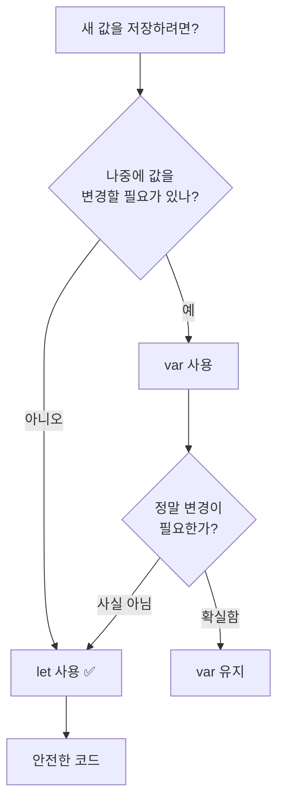
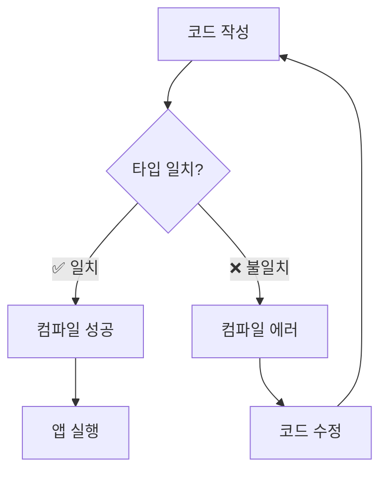
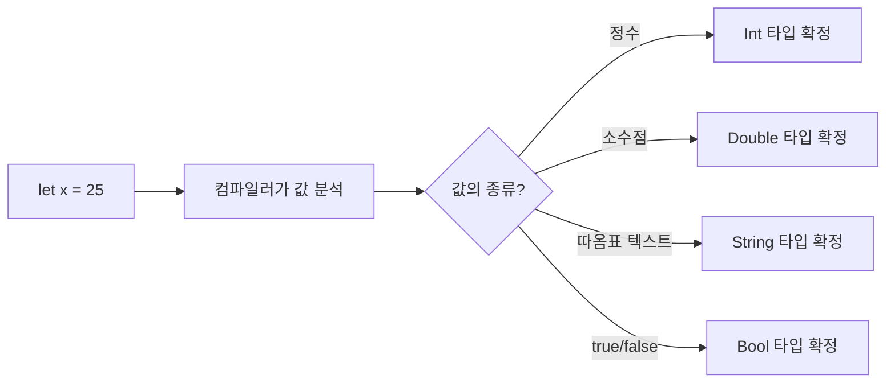

# 변수와 상수

> var, let, 데이터 타입, Type Safety와 Type Inference

## 개요

프로그래밍의 가장 기본은 **데이터를 담아두는 것**입니다. Swift에서는 `var`와 `let`이라는 두 가지 키워드로 데이터를 저장하는데, 이 단순한 구분이 안전하고 예측 가능한 코드의 출발점이 됩니다.

**선수 지식**: [개발 환경 설정](./01-introduction.md)에서 Playground 사용법을 익힌 상태
**학습 목표**:
- `var`(변수)와 `let`(상수)의 차이를 이해하고 적절히 사용한다
- Swift의 기본 데이터 타입(Int, Double, String, Bool)을 익힌다
- Type Safety와 Type Inference가 왜 중요한지 이해한다

## 왜 알아야 할까?

앱을 만들 때 사용자 이름, 점수, 설정 값 등 수많은 데이터를 다루게 됩니다. 이 데이터를 어디에, 어떻게 저장하느냐에 따라 코드의 안전성이 달라지죠. Swift는 "바뀔 수 있는 값"과 "바뀌면 안 되는 값"을 명확히 구분하도록 설계되어 있어서, 실수로 값을 변경하는 버그를 원천적으로 막아줍니다.

실제로 한 연구에 따르면, 데이터를 변경 불가능(immutable)하게 선언하는 습관만으로도 **상태 관련 버그가 약 25% 감소**한다고 합니다. Swift가 `let`을 적극 권장하는 이유가 바로 여기에 있어요.

> 📊 **그림 3**: var vs let 선택 기준 — 기본은 let, 필요할 때만 var




## 핵심 개념

### 개념 1: var와 let — 변수와 상수

> 💡 **비유**: `var`는 **화이트보드**, `let`은 **액자에 넣은 사진**입니다. 화이트보드에는 언제든 지우고 새로 쓸 수 있지만, 액자에 넣은 사진은 한번 걸면 바꾸지 않죠.

```swift
// var: 변수 — 값을 바꿀 수 있습니다
var currentScore = 0
currentScore = 10       // ✅ 값 변경 가능
currentScore = 25       // ✅ 또 변경 가능

// let: 상수 — 한번 정하면 바꿀 수 없습니다
let playerName = "Swift 초보자"
// playerName = "고수"  // ❌ 컴파일 에러! 상수는 변경 불가
```

Swift는 `let`을 기본으로 사용하라고 강력히 권장합니다. 왜 그럴까요? 값이 변하지 않는다는 보장이 있으면, 코드를 읽을 때 "이 값이 중간에 바뀌었을까?" 걱정할 필요가 없기 때문이에요. 실제로 Xcode도 `var`로 선언했는데 값을 한 번도 변경하지 않으면 **"let으로 바꾸세요"** 라는 경고를 띄웁니다.

> 🔥 **실무 팁**: 처음에는 무조건 `let`으로 선언하세요. 나중에 값을 변경해야 할 때만 `var`로 바꾸면 됩니다. 이 습관이 안전한 코드의 시작입니다.

### 개념 2: 기본 데이터 타입

Swift에는 데이터의 종류를 구분하는 **타입(Type)** 이 있습니다. 가장 자주 쓰는 네 가지를 알아봅시다.

> 💡 **비유**: 타입은 **그릇의 종류**와 같습니다. 밥그릇에는 밥을, 컵에는 물을 담듯이, `Int` 타입에는 정수를, `String` 타입에는 문자열을 담습니다. 밥그릇에 물을 부으면 안 되듯이, Swift에서도 타입이 맞지 않으면 에러가 발생합니다.

```swift
// 정수 (Integer) — 소수점 없는 숫자
let age: Int = 25
let temperature: Int = -3

// 실수 (Double) — 소수점 있는 숫자
let pi: Double = 3.14159
let height: Double = 175.5

// 문자열 (String) — 텍스트
let greeting: String = "안녕하세요!"
let emoji: String = "🚀"

// 불리언 (Bool) — 참/거짓
let isStudent: Bool = true
let hasAccount: Bool = false
```

| 타입 | 설명 | 예시 |
|------|------|------|
| **Int** | 정수 (소수점 없음) | `42`, `-7`, `0` |
| **Double** | 실수 (소수점 있음) | `3.14`, `-0.5`, `100.0` |
| **String** | 문자열 (텍스트) | `"Hello"`, `"Swift"` |
| **Bool** | 불리언 (참/거짓) | `true`, `false` |

### 개념 3: Type Safety — Swift의 안전벨트

> 📊 **그림 1**: Type Safety 동작 흐름 — 컴파일 시점에 타입 불일치를 차단




Swift는 **Type Safe** 언어입니다. 한번 정해진 타입은 절대 다른 타입의 값을 받지 않아요.

```swift
var score: Int = 100
// score = "백점"     // ❌ 컴파일 에러! Int에 String을 넣을 수 없습니다

var name: String = "Kim"
// name = 42          // ❌ 컴파일 에러! String에 Int를 넣을 수 없습니다
```

"이거 너무 엄격한 거 아닌가?" 라고 생각할 수 있는데요, 사실 이게 엄청난 장점입니다. 다른 언어에서는 실행 중에(런타임에) 타입이 맞지 않아서 앱이 갑자기 꺼지는 일이 흔하거든요. Swift는 **코드를 작성하는 시점에** 이런 실수를 잡아줘서, 앱이 갑자기 죽는 걸 미리 방지합니다.

### 개념 4: Type Inference — 똑똑한 자동 추론

> 📊 **그림 2**: Type Inference 과정 — Swift 컴파일러가 값을 보고 타입을 결정




매번 타입을 직접 적는 건 귀찮겠죠? Swift는 **대입하는 값을 보고 타입을 자동으로 추론**합니다. 이걸 **타입 추론(Type Inference)** 이라고 합니다.

```swift
// 타입을 직접 지정 (Type Annotation)
let explicitAge: Int = 25

// 타입 추론 — 25를 보고 자동으로 Int로 판단
let inferredAge = 25           // Int로 추론
let inferredPi = 3.14          // Double로 추론
let inferredName = "Swift"     // String으로 추론
let inferredFlag = true        // Bool로 추론
```

타입을 직접 안 써도 Swift가 알아서 맞춰주니 코드가 훨씬 깔끔해집니다. 다만 Swift가 내부적으로 타입을 기억하고 있기 때문에, 나중에 다른 타입의 값을 넣으려고 하면 역시 에러가 발생해요.

```swift
var city = "서울"    // String으로 추론됨
// city = 123        // ❌ 에러! String으로 추론된 변수에 Int를 넣을 수 없습니다
city = "부산"        // ✅ 같은 String 타입이므로 OK
```

### 개념 5: 문자열 보간 (String Interpolation)

변수 값을 문자열 안에 자연스럽게 넣는 방법입니다. `\(변수명)` 형식을 사용합니다.

```run:swift
let name = "민수"
let age = 28

// 문자열 보간으로 변수 값을 포함
let introduction = "\(name)님은 \(age)세입니다."
print(introduction)  // "민수님은 28세입니다."

// 계산식도 넣을 수 있습니다
let price = 15000
let quantity = 3
print("총 금액: \(price * quantity)원")  // "총 금액: 45000원"
```

```output
민수님은 28세입니다.
총 금액: 45000원
```

> 💡 **알고 계셨나요?**: 다른 언어에서는 문자열을 합칠 때 `"이름: " + name + ", 나이: " + String(age)` 처럼 복잡하게 써야 하는 경우가 많은데, Swift의 `\()` 문법은 훨씬 직관적이고 읽기 쉽습니다. 심지어 `\()` 안에 함수 호출이나 복잡한 표현식도 넣을 수 있어요.

## 실습: 직접 해보기

Playground를 열고 자기 소개 프로그램을 만들어 봅시다.

```run:swift
import Foundation

// 내 정보를 상수와 변수로 선언합니다
let myName = "여러분의 이름"        // 이름은 안 바뀌니까 let
let birthYear = 1998                // 태어난 해도 let
var favoriteLanguage = "Swift"      // 좋아하는 언어는 바뀔 수 있으니 var

// 올해 나이 계산
let currentYear = 2026
let myAge = currentYear - birthYear

// 자기 소개 출력
print("👋 안녕하세요!")
print("저는 \(myName)이고, \(myAge)살입니다.")
print("요즘 \(favoriteLanguage)를 배우고 있어요!")

// 좋아하는 언어 변경
favoriteLanguage = "SwiftUI"
print("아, 정확히는 \(favoriteLanguage)요! 😄")

// 타입 확인해 보기
print("myName의 타입: \(type(of: myName))")      // String
print("birthYear의 타입: \(type(of: birthYear))")  // Int
print("myAge의 타입: \(type(of: myAge))")          // Int
```

```output
👋 안녕하세요!
저는 여러분의 이름이고, 28살입니다.
요즘 Swift를 배우고 있어요!
아, 정확히는 SwiftUI요! 😄
myName의 타입: String
birthYear의 타입: Int
myAge의 타입: Int
```

## 더 깊이 알아보기

### Swift 이름의 유래

Swift라는 이름이 어떻게 정해졌는지 아시나요? 원래 프로젝트 코드명은 "Shiny"였는데, 출시 3개월 전에 정식 이름을 정하기 시작했다고 합니다. 창시자 Chris Lattner에 따르면, 상표 검색이 엄청 복잡했대요. 실제로 같은 이름의 작은 연구용 언어가 이미 있었거든요.

결국 **Swift(칼새)**라는 이름이 선택되었습니다. 칼새는 세상에서 가장 빠른 새 중 하나로, 시속 170km 이상으로 날 수 있죠. "빠르고 자유롭다"는 이미지가 언어의 철학과 딱 맞았던 거예요. 재미있는 건, "Swift"가 "Shiny"와 글자 수가 같아서 버전 관리 시스템의 히스토리를 수정하기도 편했다는 사실! 😄

## 흔한 오해와 팁

> ⚠️ **흔한 오해**: "`let`은 단순한 값에만 쓰고, 복잡한 건 `var`를 써야 한다" — 전혀 아닙니다! 배열, 딕셔너리, 객체 등 복잡한 데이터도 변경할 필요가 없다면 `let`으로 선언하세요. **기본은 `let`, 필요할 때만 `var`**가 Swift의 원칙입니다.

> 🔥 **실무 팁**: Swift에서 `Int`는 실행 환경에 따라 크기가 달라집니다. 64비트 시스템(현재 모든 iPhone)에서는 64비트 정수이므로 약 ±9.2경까지 표현할 수 있어요. 일반적인 앱 개발에서 `Int` 크기를 걱정할 필요는 거의 없습니다.

> ⚠️ **흔한 오해**: "타입 추론이 있으니까 Swift는 동적 타입 언어다" — Swift는 **정적 타입(Static Type)** 언어입니다. 타입을 안 써도 컴파일러가 타입을 확정하기 때문에, 한번 정해진 타입은 절대 바뀌지 않습니다. JavaScript나 Python 같은 동적 타입 언어와는 근본적으로 다릅니다.

## 핵심 정리

| 개념 | 설명 |
|------|------|
| **var** | 변수 선언. 값을 나중에 변경할 수 있음 |
| **let** | 상수 선언. 한번 정하면 변경 불가. 기본으로 사용 권장 |
| **Type Safety** | 타입이 맞지 않는 값 대입을 컴파일 시점에 차단 |
| **Type Inference** | 값을 보고 타입을 자동 추론. 타입 명시를 생략 가능 |
| **Type Annotation** | `let age: Int = 25`처럼 타입을 직접 지정하는 문법 |
| **String Interpolation** | `\(변수명)`으로 문자열 안에 값을 삽입 |

## 다음 섹션 미리보기

변수와 상수에 하나의 값을 담는 법을 배웠으니, 이제 **여러 개의 값을 한꺼번에 다루는 방법**을 알아볼 차례입니다. [컬렉션 타입](./03-collections.md)에서 Array, Dictionary, Set을 만나봅시다.

## 참고 자료

- [The Basics — The Swift Programming Language](https://docs.swift.org/swift-book/documentation/the-swift-programming-language/thebasics/) - Swift 공식 문서의 기초 문법 설명
- [Variables and Constants — Hacking with Swift](https://www.hackingwithswift.com/read/0/2/variables-and-constants) - Paul Hudson의 var/let 설명
- [WWDC 2014: Introduction to Swift](https://developer.apple.com/videos/play/wwdc2014/402/) - Swift가 처음 세상에 공개된 WWDC 세션
- [Chris Lattner: How and when did Swift get its name?](https://www.hackingwithswift.com/interviews/chris-lattner-how-and-when-did-swift-get-its-name) - Swift 이름의 유래 인터뷰
