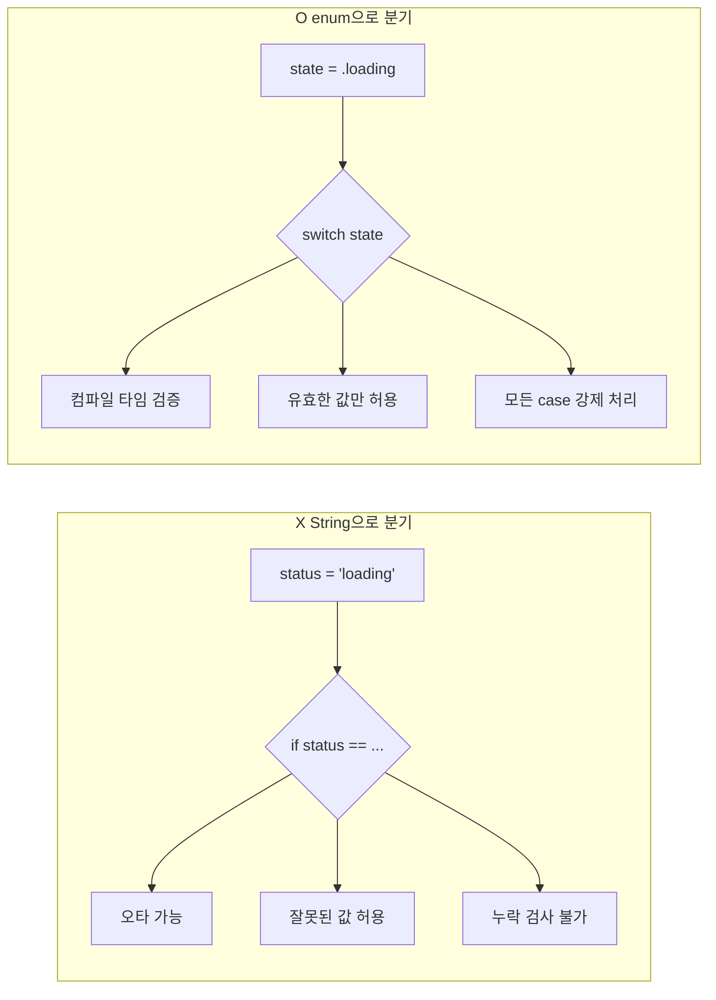
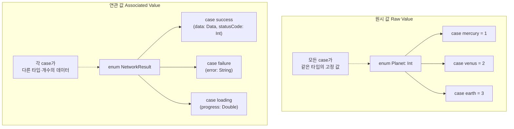
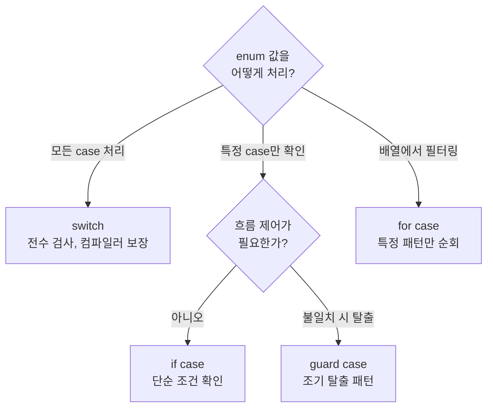
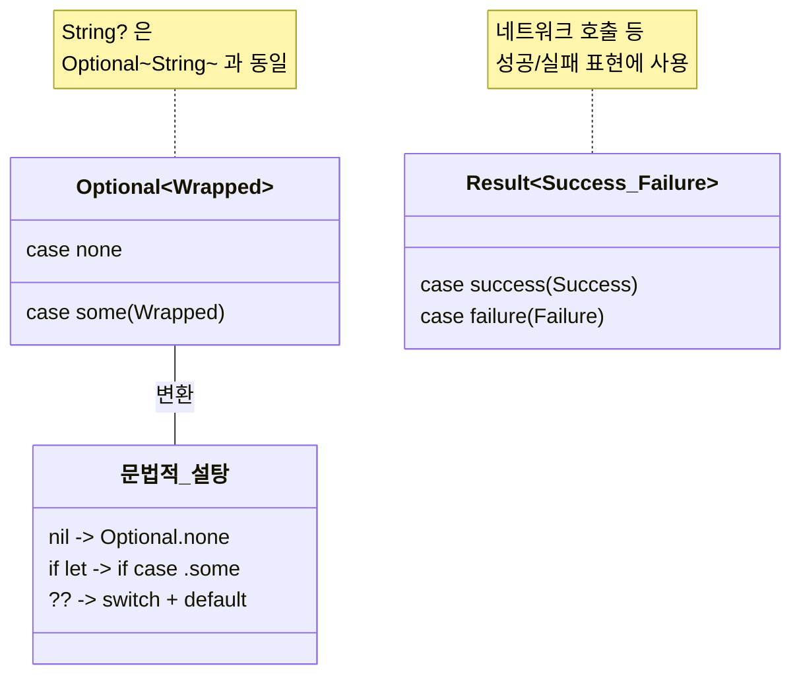

# 열거형과 패턴 매칭

> enum, associated values, Swift의 강력한 switch

## 개요

앞서 [옵셔널](../01-swift-basics/06-optionals.md)에서 "Optional은 사실 enum이다"라고 언급했던 거 기억하시나요? Swift의 **열거형(enum)** 은 다른 언어의 열거형과는 차원이 다릅니다. 단순히 상수 목록을 나열하는 수준을 넘어, **연관 값(associated values)** 을 가질 수 있고, 메서드와 연산 프로퍼티도 가질 수 있으며, **패턴 매칭**과 결합하면 놀라울 정도로 표현력이 강해집니다.

**선수 지식**: [구조체와 클래스](./01-struct-class.md), [프로토콜과 익스텐션](./03-protocols-extensions.md)
**학습 목표**:
- 열거형을 정의하고 사용하는 방법을 익힌다
- 원시 값(raw value)과 연관 값(associated value)의 차이를 이해한다
- switch와 if case를 활용한 패턴 매칭을 구현한다
- 실전에서 enum을 효과적으로 활용하는 패턴을 안다

## 왜 알아야 할까?

> 📊 **그림 1**: enum이 해결하는 문제 — String/Int 분기 vs enum 분기




Swift 앱을 만들다 보면 "몇 가지 정해진 경우 중 하나"를 표현해야 할 때가 정말 많습니다. 네트워크 요청의 결과(성공/실패), 앱의 화면 상태(로딩/콘텐츠/에러), 결제 수단(카드/현금/포인트) 등이 다 그렇죠. 이런 상황에서 `String`이나 `Int`로 구분하면 오타, 잘못된 값 같은 버그가 생기기 쉽습니다. enum을 쓰면 **컴파일러가 모든 경우를 빠짐없이 처리했는지 검사**해주니까 훨씬 안전해요.

## 핵심 개념

### 개념 1: 열거형 기본

> 💡 **비유**: 열거형은 **자판기의 버튼**입니다. 커피, 녹차, 주스 — 정해진 선택지만 있고, "피자"를 누를 수는 없죠. 유효한 값만 허용하는 것이 enum의 핵심입니다.

```run:swift
// 기본 열거형 정의
enum Direction {
    case north
    case south
    case east
    case west
}

// 한 줄로도 쓸 수 있습니다
enum Season {
    case spring, summer, fall, winter
}

// 사용
var heading = Direction.north
heading = .east    // 타입이 이미 알려져 있으면 .만으로 충분

// switch로 모든 경우를 처리 (exhaustive!)
switch heading {
case .north: print("⬆️ 북쪽")
case .south: print("⬇️ 남쪽")
case .east:  print("➡️ 동쪽")
case .west:  print("⬅️ 서쪽")
}
```

```output
➡️ 동쪽
```

여기서 핵심은, `switch`가 **모든 case를 다루지 않으면 컴파일 에러**가 난다는 점입니다. `east`를 빠뜨렸다면 Swift가 "이 경우를 처리하지 않았어!"라고 경고해 줘요.

### 개념 2: 원시 값 (Raw Value)

각 case에 고정된 값을 부여할 수 있습니다.

```run:swift
// String 원시 값
enum HTTPMethod: String {
    case get = "GET"
    case post = "POST"
    case put = "PUT"
    case delete = "DELETE"
}

print(HTTPMethod.post.rawValue)   // "POST"

// Int 원시 값 — 자동으로 0, 1, 2... 할당
enum Planet: Int {
    case mercury = 1    // 1부터 시작
    case venus          // 자동으로 2
    case earth          // 자동으로 3
    case mars           // 자동으로 4
}

print(Planet.earth.rawValue)   // 3

// 원시 값으로 enum 생성 (옵셔널 반환!)
let planet = Planet(rawValue: 3)   // Optional(Planet.earth)
let unknown = Planet(rawValue: 99)  // nil
```

```output
POST
3
```

### 개념 3: 연관 값 (Associated Value) — enum의 진짜 힘

> 📊 **그림 2**: 원시 값(Raw Value)과 연관 값(Associated Value) 비교




> 💡 **비유**: 원시 값이 **이름표**(고정된 라벨)라면, 연관 값은 **택배 상자**(case마다 다른 내용물을 담을 수 있는 것)입니다. 같은 "배송" case라도 안에 든 물건이 다를 수 있죠.

연관 값을 쓰면 각 case가 **서로 다른 타입과 개수의 데이터**를 가질 수 있습니다.

```run:swift
// 네트워크 응답 결과
enum NetworkResult {
    case success(data: Data, statusCode: Int)
    case failure(error: String)
    case loading(progress: Double)
}

let result = NetworkResult.success(data: Data(), statusCode: 200)

// switch로 연관 값 추출
switch result {
case .success(let data, let statusCode):
    print("✅ 성공! 상태 코드: \(statusCode), 데이터: \(data.count)바이트")
case .failure(let error):
    print("❌ 실패: \(error)")
case .loading(let progress):
    print("⏳ 로딩 중... \(Int(progress * 100))%")
}
```

```output
✅ 성공! 상태 코드: 200, 데이터: 0바이트
```

```run:swift
// 실전 활용: 결제 수단
enum PaymentMethod {
    case creditCard(number: String, expiry: String)
    case bankTransfer(bank: String, account: String)
    case applePay
    case cash
}

func processPayment(_ method: PaymentMethod, amount: Int) {
    switch method {
    case .creditCard(let number, _):
        let masked = "****-****-****-" + number.suffix(4)
        print("💳 카드 \(masked)로 \(amount)원 결제")
    case .bankTransfer(let bank, let account):
        print("🏦 \(bank) \(account)로 \(amount)원 이체")
    case .applePay:
        print(" Apple Pay로 \(amount)원 결제")
    case .cash:
        print("💵 현금 \(amount)원 결제")
    }
}

processPayment(.creditCard(number: "1234567890123456", expiry: "12/26"), amount: 50000)
```

```output
💳 카드 ****-****-****-3456로 50000원 결제
```

### 개념 4: 패턴 매칭 — switch를 넘어서

> 📊 **그림 3**: Swift 패턴 매칭 도구 — 상황별 선택 가이드




`switch` 말고도 다양한 방법으로 enum을 매칭할 수 있습니다.

```run:swift
enum AppState {
    case loading
    case loaded(items: [String])
    case error(message: String)
}

let state = AppState.loaded(items: ["항목1", "항목2", "항목3"])

// if case — 특정 case인지만 확인
if case .loaded(let items) = state {
    print("아이템 \(items.count)개 로드됨")
}

// guard case — 특정 case가 아니면 빠져나가기
func displayItems(state: AppState) {
    guard case .loaded(let items) = state else {
        print("아이템을 표시할 수 없는 상태입니다")
        return
    }
    // 여기서 items를 안전하게 사용
    for item in items {
        print("  - \(item)")
    }
}

// for case — 배열에서 특정 패턴만 골라내기
let results: [NetworkResult] = [
    .success(data: Data(), statusCode: 200),
    .failure(error: "타임아웃"),
    .success(data: Data(), statusCode: 201),
    .loading(progress: 0.5)
]

// 성공 케이스만 골라서 순회
for case .success(_, let code) in results {
    print("성공 응답: \(code)")
}
```

```output
성공 응답: 200
성공 응답: 201
```

### 개념 5: enum에 메서드와 연산 프로퍼티 추가

Swift의 enum은 struct처럼 메서드와 연산 프로퍼티를 가질 수 있습니다.

```run:swift
enum Compass {
    case north, south, east, west

    // 연산 프로퍼티
    var emoji: String {
        switch self {
        case .north: return "⬆️"
        case .south: return "⬇️"
        case .east:  return "➡️"
        case .west:  return "⬅️"
        }
    }

    // 메서드
    func opposite() -> Compass {
        switch self {
        case .north: return .south
        case .south: return .north
        case .east:  return .west
        case .west:  return .east
        }
    }

    // CaseIterable을 채택하면 모든 case를 배열로 얻을 수 있습니다
}

let dir = Compass.east
print("\(dir.emoji) 반대 방향: \(dir.opposite().emoji)")
```

```output
➡️ 반대 방향: ⬅️
```

```run:swift
// CaseIterable — 모든 case를 순회
enum Difficulty: String, CaseIterable {
    case easy = "쉬움"
    case normal = "보통"
    case hard = "어려움"
    case expert = "전문가"
}

print("난이도 선택지:")
for difficulty in Difficulty.allCases {
    print("  - \(difficulty.rawValue)")
}
```

```output
난이도 선택지:
  - 쉬움
  - 보통
  - 어려움
  - 전문가
```

## 실습: 직접 해보기

자판기 시뮬레이터를 만들어 봅시다.

```run:swift
import Foundation

// 음료 종류
enum Beverage: String, CaseIterable {
    case coffee = "커피"
    case greenTea = "녹차"
    case juice = "주스"
    case water = "물"

    var price: Int {
        switch self {
        case .coffee:   return 1500
        case .greenTea: return 1200
        case .juice:    return 1800
        case .water:    return 800
        }
    }

    var emoji: String {
        switch self {
        case .coffee:   return "☕"
        case .greenTea: return "🍵"
        case .juice:    return "🧃"
        case .water:    return "💧"
        }
    }
}

// 자판기 동작 결과
enum VendingResult {
    case success(beverage: Beverage, change: Int)
    case insufficientFunds(required: Int, inserted: Int)
    case outOfStock(beverage: Beverage)
}

// 자판기
struct VendingMachine {
    var stock: [Beverage: Int] = [
        .coffee: 5, .greenTea: 3, .juice: 0, .water: 10
    ]

    mutating func purchase(beverage: Beverage, payment: Int) -> VendingResult {
        // 재고 확인
        guard let count = stock[beverage], count > 0 else {
            return .outOfStock(beverage: beverage)
        }

        // 금액 확인
        guard payment >= beverage.price else {
            return .insufficientFunds(required: beverage.price, inserted: payment)
        }

        // 판매!
        stock[beverage] = count - 1
        let change = payment - beverage.price
        return .success(beverage: beverage, change: change)
    }
}

// 시뮬레이션
var machine = VendingMachine()

let orders: [(Beverage, Int)] = [
    (.coffee, 2000),
    (.juice, 1500),
    (.greenTea, 1000),
    (.water, 1000)
]

print("🏧 자판기 시뮬레이션")
print("────────────────────")

for (beverage, payment) in orders {
    let result = machine.purchase(beverage: beverage, payment: payment)

    switch result {
    case .success(let bev, let change):
        print("\(bev.emoji) \(bev.rawValue) 구매 완료! 거스름돈: \(change)원")

    case .insufficientFunds(let required, let inserted):
        print("❌ 금액 부족! \(required)원 필요, \(inserted)원 투입됨")

    case .outOfStock(let bev):
        print("❌ \(bev.emoji) \(bev.rawValue) 품절입니다!")
    }
}
```

```output
🏧 자판기 시뮬레이션
────────────────────
☕ 커피 구매 완료! 거스름돈: 500원
❌ 🧃 주스 품절입니다!
❌ 금액 부족! 1200원 필요, 1000원 투입됨
💧 물 구매 완료! 거스름돈: 200원
```

## 더 깊이 알아보기

### Optional은 정말 enum이다

> 📊 **그림 4**: Swift 핵심 타입의 enum 기반 구조




Swift의 `Optional<T>`은 실제로 이렇게 정의되어 있습니다:

```swift
// Swift 표준 라이브러리의 실제 정의 (단순화)
enum Optional<Wrapped> {
    case none        // nil
    case some(Wrapped)  // 값이 있음
}
```

그래서 옵셔널에 대해 switch를 쓸 수 있는 거예요:

```run:swift
let name: String? = "민수"

switch name {
case .some(let value):
    print("이름: \(value)")
case .none:
    print("이름 없음")
}
```

```output
이름: 민수
```

`if let name = name`은 사실 `if case .some(let name) = name`의 문법적 설탕인 셈이죠. Swift의 많은 핵심 기능이 enum 위에 세워져 있다는 사실이 놀랍지 않나요?

또한 Swift의 `Result` 타입도 enum입니다:

```swift
// Swift 표준 라이브러리의 실제 정의
enum Result<Success, Failure: Error> {
    case success(Success)
    case failure(Failure)
}
```

이처럼 enum은 Swift 타입 시스템의 근간을 이루는 핵심 요소입니다.

## 흔한 오해와 팁

> ⚠️ **흔한 오해**: "enum은 단순한 상수 모음이다" — C나 Java의 enum만 경험했다면 그럴 수 있지만, Swift의 enum은 **연관 값, 메서드, 프로토콜 채택, 제네릭**까지 지원하는 본격적인 타입입니다. 사실상 "이름 붙은 union 타입"에 가까워요.

> 🔥 **실무 팁**: 앱의 상태 관리에 enum을 적극 활용하세요. 화면 상태를 `isLoading: Bool`, `hasError: Bool` 같은 여러 Bool로 관리하면 "로딩 중이면서 에러" 같은 불가능한 상태가 생길 수 있습니다. enum으로 `.loading`, `.loaded(data)`, `.error(message)`로 정의하면 **불가능한 상태를 원천 차단**할 수 있어요.

> 💡 **알고 계셨나요?**: Swift의 enum에서 연관 값(associated value) 기능은 함수형 프로그래밍 언어의 **대수적 데이터 타입(Algebraic Data Type)** 에서 영감을 받은 것입니다. Haskell의 data 타입, Rust의 enum과 매우 비슷하죠. 이 기능 덕분에 Swift는 "안전한 코드"를 작성하기가 훨씬 쉬워졌습니다.

## 핵심 정리

| 개념 | 설명 |
|------|------|
| **enum** | 정해진 경우의 수를 타입으로 정의. 안전한 분기 처리 |
| **case** | enum의 각 경우. `.north`, `.success` 등 |
| **원시 값 (rawValue)** | case에 부여하는 고정 값. `String`, `Int` 등 |
| **연관 값** | case마다 다른 데이터를 함께 저장. `.success(data: Data)` |
| **CaseIterable** | 모든 case를 `allCases` 배열로 순회 가능 |
| **if case** | 특정 case인지 확인하고 연관 값 추출 |
| **guard case** | 특정 case가 아니면 조기 탈출 |
| **for case** | 배열에서 특정 패턴만 골라 순회 |

## 다음 섹션 미리보기

Ch2의 마지막 섹션입니다! 이제 타입을 더 유연하게 만드는 **제네릭(Generic)** 과, 예상치 못한 상황에 대처하는 **에러 처리(Error Handling)** 를 배웁니다. [제네릭과 에러 처리](./05-generics-errors.md)에서 Swift 타입 시스템의 마지막 퍼즐 조각을 맞춰 봅시다.

## 참고 자료

- [Enumerations — The Swift Programming Language](https://docs.swift.org/swift-book/documentation/the-swift-programming-language/enumerations/) - Swift 공식 문서의 열거형 설명
- [Pattern Matching — The Swift Programming Language](https://docs.swift.org/swift-book/documentation/the-swift-programming-language/patterns/) - 패턴 매칭 공식 가이드
- [Enums — Hacking with Swift](https://www.hackingwithswift.com/100/swiftui/15) - 100 Days of SwiftUI의 enum 학습
- [Algebraic Data Types in Swift — Swift by Sundell](https://www.swiftbysundell.com/articles/modelling-state-in-swift/) - enum으로 상태 모델링하기
