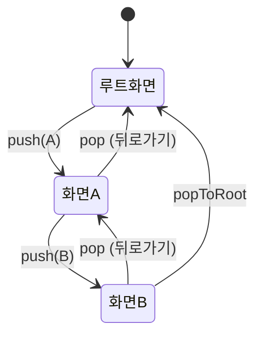
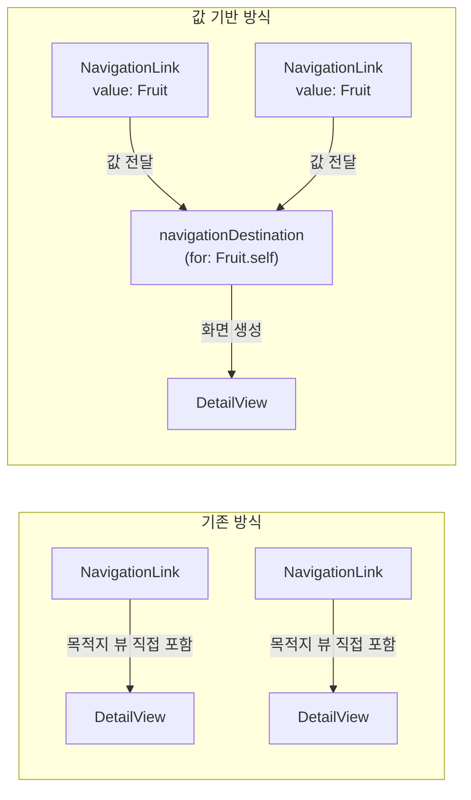
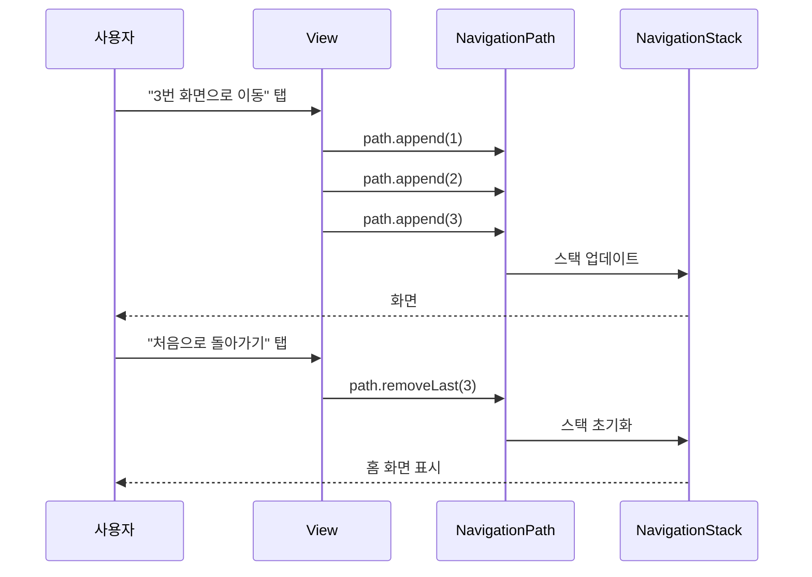

# NavigationStack

> 화면 전환, NavigationLink, toolbar, navigationTitle

## 개요

하나의 화면만으로는 앱을 만들 수 없죠. 설정 앱에서 "Wi-Fi"를 탭하면 상세 화면으로 이동하고, 뒤로 가면 다시 돌아옵니다. 이런 **화면 전환**을 SwiftUI에서는 `NavigationStack`으로 구현합니다. 이 섹션에서는 멀티 화면 앱의 기초를 배워봅니다.

**선수 지식**: [Ch3. SwiftUI 첫걸음](../03-swiftui-start/05-lists-scroll.md)에서 배운 List, ForEach, 기본 뷰 구성
**학습 목표**:
- NavigationStack으로 화면 전환 구조 만들기
- NavigationLink로 화면 이동 구현하기
- navigationTitle과 toolbar로 네비게이션 바 꾸미기
- NavigationPath로 프로그래밍 방식 네비게이션 구현하기

## 왜 알아야 할까?

스마트폰 앱의 가장 기본적인 인터랙션이 뭘까요? 바로 **"탭해서 다음 화면으로 이동"**입니다. 연락처 앱에서 이름을 탭하면 상세 정보가 나오고, App Store에서 앱을 탭하면 상세 페이지로 넘어가죠. 이 패턴을 **Push/Pop 네비게이션**이라고 부르는데, iOS 앱 개발에서 가장 먼저 익혀야 할 핵심 패턴이에요.

## 핵심 개념

### 개념 1: NavigationStack — 화면을 쌓는 컨테이너

> 💡 **비유**: NavigationStack은 **책 더미**입니다. 새 화면을 열면 맨 위에 한 장을 올리고(push), 뒤로 가면 맨 위 장을 꺼냅니다(pop). 항상 맨 위에 있는 화면만 보이죠.

NavigationStack은 SwiftUI에서 화면 전환을 관리하는 컨테이너 뷰입니다. 이 안에 넣은 뷰는 자동으로 네비게이션 바가 생기고, 화면 전환 기능을 사용할 수 있게 됩니다.

> 📊 **그림 1**: NavigationStack의 Push/Pop 동작 원리




```swift
import SwiftUI

struct ContentView: View {
    var body: some View {
        // NavigationStack으로 감싸면 네비게이션 기능 활성화
        NavigationStack {
            List {
                Text("첫 번째 항목")
                Text("두 번째 항목")
                Text("세 번째 항목")
            }
            // 네비게이션 바에 제목 표시
            .navigationTitle("목록")
        }
    }
}

#Preview {
    ContentView()
}
```

> ⚠️ **흔한 오해**: "NavigationView를 써야 하는 거 아닌가요?" — `NavigationView`는 iOS 16에서 **deprecated** 되었습니다. 새 프로젝트에서는 반드시 `NavigationStack`을 사용하세요!

### 개념 2: NavigationLink — 화면 이동 버튼

> 💡 **비유**: NavigationLink는 **문**입니다. 문을 열면(탭하면) 새 방(화면)으로 들어가고, 뒤로 가기 버튼은 다시 원래 방으로 돌아오는 출구예요.

NavigationLink를 탭하면 새 화면이 오른쪽에서 슬라이드되며 나타납니다. 가장 간단한 형태부터 살펴볼까요?

```swift
import SwiftUI

struct FruitListView: View {
    // 과일 목록 데이터
    let fruits = ["사과", "바나나", "체리", "딸기", "포도"]

    var body: some View {
        NavigationStack {
            List(fruits, id: \.self) { fruit in
                // NavigationLink: 탭하면 상세 화면으로 이동
                NavigationLink(fruit) {
                    // 이동할 목적지 뷰
                    FruitDetailView(name: fruit)
                }
            }
            .navigationTitle("과일 가게")
        }
    }
}

// 상세 화면
struct FruitDetailView: View {
    let name: String

    var body: some View {
        VStack(spacing: 20) {
            Text(name)
                .font(.largeTitle)
                .bold()
            Text("\(name)의 상세 정보입니다")
                .foregroundStyle(.secondary)
        }
        // 상세 화면에도 제목 설정 가능
        .navigationTitle(name)
        // 인라인 스타일로 제목 표시
        .navigationBarTitleDisplayMode(.inline)
    }
}

#Preview {
    FruitListView()
}
```

### 개념 3: 값 기반 네비게이션 — 더 스마트한 방법

> 💡 **비유**: 앞서 본 NavigationLink는 "문 뒤에 방을 직접 만들어두는 것"이었다면, 값 기반 네비게이션은 "티켓(값)만 가지고 가면 안내 데스크(navigationDestination)가 알아서 방을 배정해주는 것"이에요.

iOS 16부터 NavigationLink에 **값(value)**을 전달하고, `navigationDestination`에서 그 값의 타입에 따라 화면을 결정하는 방식이 추가되었어요. 이 방식이 더 유연하고 재사용성이 높습니다.

> 📊 **그림 2**: 기존 방식 vs 값 기반 네비게이션 비교




```swift
import SwiftUI

// 과일 모델: Hashable 프로토콜 준수 필수!
struct Fruit: Hashable {
    let name: String
    let emoji: String
    let color: Color
}

struct SmartFruitListView: View {
    let fruits = [
        Fruit(name: "사과", emoji: "🍎", color: .red),
        Fruit(name: "바나나", emoji: "🍌", color: .yellow),
        Fruit(name: "포도", emoji: "🍇", color: .purple),
    ]

    var body: some View {
        NavigationStack {
            List(fruits, id: \.self) { fruit in
                // 값만 전달하는 NavigationLink
                NavigationLink(value: fruit) {
                    Label(fruit.name, systemImage: "leaf.fill")
                }
            }
            // 타입별로 목적지를 한 곳에서 정의
            .navigationDestination(for: Fruit.self) { fruit in
                VStack(spacing: 16) {
                    Text(fruit.emoji)
                        .font(.system(size: 100))
                    Text(fruit.name)
                        .font(.largeTitle)
                        .foregroundStyle(fruit.color)
                }
                .navigationTitle(fruit.name)
            }
            .navigationTitle("과일 가게")
        }
    }
}

#Preview {
    SmartFruitListView()
}
```

> 🔥 **실무 팁**: `navigationDestination`은 NavigationStack 내부 뷰의 **루트 레벨**에 붙이세요. 깊이 중첩된 뷰에 붙이면 화면 전환이 작동하지 않거나 예상과 다르게 동작할 수 있습니다.

### 개념 4: NavigationPath — 프로그래밍 방식 네비게이션

여러 타입의 값을 하나의 네비게이션 스택에서 관리하려면 `NavigationPath`를 사용합니다. 코드로 화면을 push/pop할 수도 있어요.

> 📊 **그림 3**: NavigationPath를 통한 프로그래밍 방식 네비게이션




```swift
import SwiftUI

struct ProgrammaticNavView: View {
    // NavigationPath로 네비게이션 스택 상태 관리
    @State private var path = NavigationPath()

    var body: some View {
        NavigationStack(path: $path) {
            VStack(spacing: 20) {
                // 코드로 화면 push
                Button("3번 화면으로 바로 이동") {
                    path.append(1)
                    path.append(2)
                    path.append(3)
                }
                .buttonStyle(.borderedProminent)

                Button("처음으로 돌아가기") {
                    // 모든 화면 pop (루트로 복귀)
                    path.removeLast(path.count)
                }
                .buttonStyle(.bordered)
            }
            .navigationDestination(for: Int.self) { number in
                VStack {
                    Text("화면 #\(number)")
                        .font(.largeTitle)
                    Button("다음 화면") {
                        path.append(number + 1)
                    }
                    .buttonStyle(.borderedProminent)
                }
                .navigationTitle("화면 \(number)")
            }
            .navigationTitle("홈")
        }
    }
}

#Preview {
    ProgrammaticNavView()
}
```

### 개념 5: navigationTitle과 toolbar

네비게이션 바를 꾸미는 두 가지 핵심 수정자를 알아볼까요?

```swift
import SwiftUI

struct ToolbarDemoView: View {
    var body: some View {
        NavigationStack {
            List {
                ForEach(1...20, id: \.self) { item in
                    Text("항목 \(item)")
                }
            }
            // 큰 제목 스타일 (기본값)
            .navigationTitle("내 목록")
            // iOS 26: 부제목 추가 가능!
            .navigationSubtitle("총 20개 항목")
            // 툴바에 버튼 추가
            .toolbar {
                // 오른쪽 상단에 추가 버튼
                ToolbarItem(placement: .topBarTrailing) {
                    Button("추가", systemImage: "plus") {
                        print("추가 버튼 탭!")
                    }
                }
                // 왼쪽 상단에 편집 버튼
                ToolbarItem(placement: .topBarLeading) {
                    Button("편집", systemImage: "pencil") {
                        print("편집 버튼 탭!")
                    }
                }
                // 하단 툴바
                ToolbarItem(placement: .bottomBar) {
                    Button("공유", systemImage: "square.and.arrow.up") {
                        print("공유!")
                    }
                }
            }
        }
    }
}

#Preview {
    ToolbarDemoView()
}
```

> 💡 **알고 계셨나요?**: iOS 26에서는 `.navigationSubtitle()`이 새로 추가되어 네비게이션 바에 부제목을 넣을 수 있게 되었습니다. macOS에서는 이미 지원되던 기능인데, 드디어 iOS에도 왔네요!

## 실습: 직접 해보기

간단한 연락처 앱을 만들어봅시다.

```swift
import SwiftUI

// 연락처 모델
struct Contact: Hashable, Identifiable {
    let id = UUID()
    let name: String
    let phone: String
    let emoji: String
}

// 메인 화면: 연락처 목록
struct ContactListView: View {
    let contacts = [
        Contact(name: "김철수", phone: "010-1234-5678", emoji: "👨"),
        Contact(name: "이영희", phone: "010-9876-5432", emoji: "👩"),
        Contact(name: "박민수", phone: "010-5555-1234", emoji: "🧑"),
        Contact(name: "정수진", phone: "010-7777-8888", emoji: "👧"),
    ]

    var body: some View {
        NavigationStack {
            List(contacts) { contact in
                NavigationLink(value: contact) {
                    HStack {
                        Text(contact.emoji)
                            .font(.title)
                        VStack(alignment: .leading) {
                            Text(contact.name)
                                .font(.headline)
                            Text(contact.phone)
                                .font(.caption)
                                .foregroundStyle(.secondary)
                        }
                    }
                }
            }
            .navigationDestination(for: Contact.self) { contact in
                ContactDetailView(contact: contact)
            }
            .navigationTitle("연락처")
            .toolbar {
                ToolbarItem(placement: .topBarTrailing) {
                    Button("추가", systemImage: "plus") { }
                }
            }
        }
    }
}

// 상세 화면
struct ContactDetailView: View {
    let contact: Contact

    var body: some View {
        VStack(spacing: 24) {
            Text(contact.emoji)
                .font(.system(size: 80))

            Text(contact.name)
                .font(.largeTitle)
                .bold()

            HStack {
                Image(systemName: "phone.fill")
                    .foregroundStyle(.green)
                Text(contact.phone)
                    .font(.title3)
            }

            Spacer()
        }
        .padding(.top, 40)
        .navigationTitle(contact.name)
        .navigationBarTitleDisplayMode(.inline)
    }
}

#Preview {
    ContactListView()
}
```

## 더 깊이 알아보기

### NavigationStack의 탄생 이야기

SwiftUI 초기(2019)에는 `NavigationView`라는 컨테이너를 사용했습니다. 하지만 NavigationView에는 치명적인 한계가 있었어요. 프로그래밍 방식으로 화면을 push/pop하기가 매우 어려웠고, iPad에서의 동작이 예측하기 힘들었거든요.

Apple은 **WWDC 2022**에서 "The SwiftUI cookbook for navigation"이라는 세션을 통해 `NavigationStack`과 `NavigationSplitView`를 발표했습니다. 이 새로운 API는 **값 기반 네비게이션**이라는 혁신적인 패턴을 도입해서, "어디로 갈지"를 뷰가 아닌 **데이터**로 표현할 수 있게 만들었죠. 이것은 딥링크, 상태 복원, 테스트를 훨씬 쉽게 만들어준 게임 체인저였습니다.

### iOS 26에서의 변화

iOS 26에서는 NavigationStack의 API 자체는 크게 바뀌지 않았지만, **Liquid Glass** 디자인 언어가 자동으로 적용됩니다. 네비게이션 바가 반투명한 유리 효과를 갖게 되어, 스크롤할 때 콘텐츠가 바 뒤로 은은하게 비치는 아름다운 효과를 볼 수 있어요. 코드를 한 줄도 바꾸지 않아도 이 효과가 자동으로 적용됩니다!

또한 `ToolbarSpacer`라는 새로운 타입이 추가되어 툴바 아이템을 논리적 그룹으로 분리할 수 있게 되었고, `.navigationSubtitle()`로 네비게이션 바에 부제목을 표시할 수 있게 되었습니다.

## 흔한 오해와 팁

> ⚠️ **흔한 오해**: "NavigationLink 안에 Button을 넣어도 되나요?" — NavigationLink 자체가 이미 탭 가능한 뷰입니다. 안에 Button을 넣으면 탭 이벤트가 충돌할 수 있으니, 둘 중 하나만 사용하세요.

> 🔥 **실무 팁**: `navigationDestination(for:)`은 NavigationStack 당 **타입별로 하나만** 정의하세요. 같은 타입에 대해 여러 개를 정의하면 마지막 것만 작동합니다.

> 💡 **알고 계셨나요?**: NavigationPath는 `Codable`을 지원합니다. 이를 활용하면 앱을 종료했다가 다시 열었을 때 이전 네비게이션 상태를 그대로 복원할 수 있어요!

## 핵심 정리

| 개념 | 설명 |
|------|------|
| NavigationStack | 화면 전환을 관리하는 컨테이너 뷰 |
| NavigationLink | 탭하면 새 화면으로 이동하는 뷰 |
| navigationDestination | 값의 타입에 따라 목적지 화면을 정의하는 수정자 |
| NavigationPath | 여러 타입의 네비게이션 상태를 관리하는 타입 |
| navigationTitle | 네비게이션 바에 제목을 표시하는 수정자 |
| toolbar | 네비게이션 바에 버튼을 추가하는 수정자 |
| ToolbarSpacer | 툴바 아이템을 그룹으로 분리하는 새로운 타입 (iOS 26) |

## 다음 섹션 미리보기

화면을 "앞뒤로" 이동하는 방법을 배웠으니, 다음은 **탭으로 화면을 전환**하고 **모달로 팝업**을 띄우는 방법을 배워볼 거예요. [02. TabView와 모달](./02-tab-modal.md)에서 만나요!

## 참고 자료

- [NavigationStack - Apple Developer Documentation](https://developer.apple.com/documentation/swiftui/navigationstack) - NavigationStack의 공식 API 문서
- [The SwiftUI cookbook for navigation - WWDC22](https://developer.apple.com/videos/play/wwdc2022/10054/) - NavigationStack이 처음 소개된 핵심 WWDC 세션
- [What's new in SwiftUI - WWDC25](https://developer.apple.com/videos/play/wwdc2025/256/) - iOS 26의 SwiftUI 변경사항
- [Mastering NavigationStack in SwiftUI - Swift with Majid](https://swiftwithmajid.com/2022/10/05/mastering-navigationstack-in-swiftui-navigationpath/) - NavigationPath 심화 활용법
