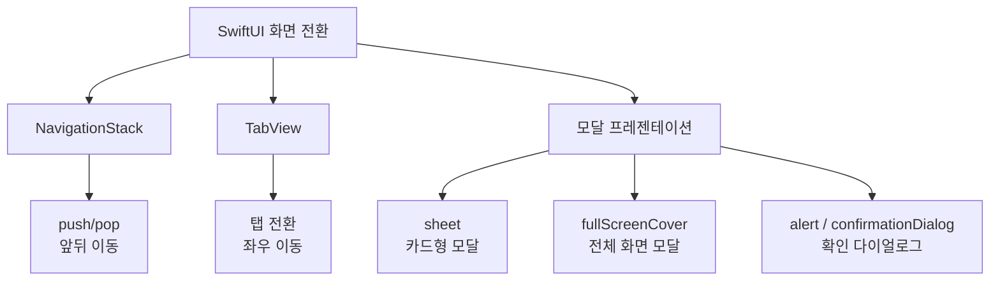
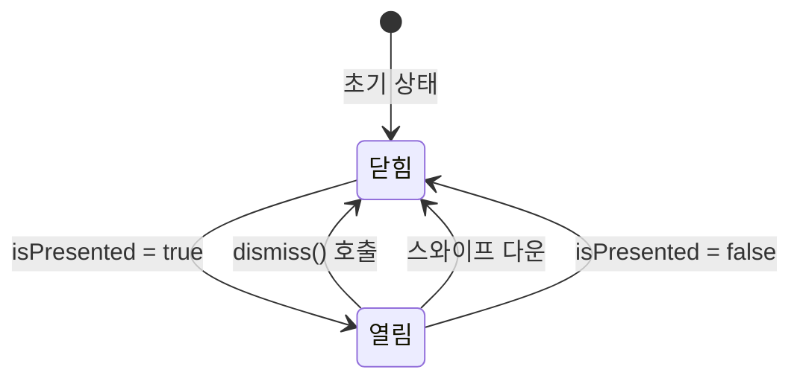
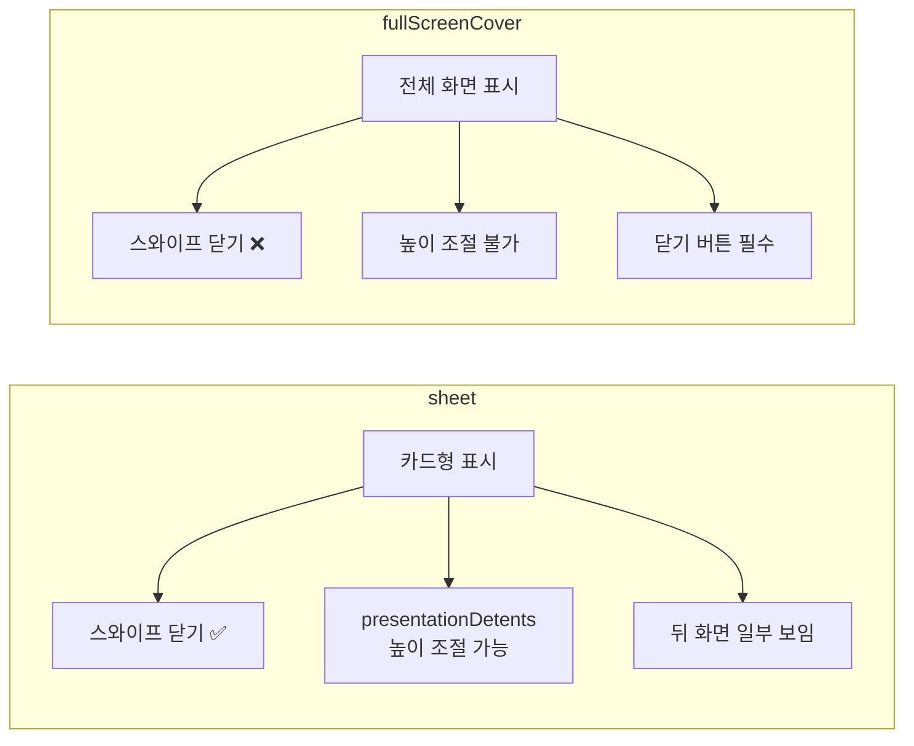

# TabView와 모달

> 탭 네비게이션, sheet, fullScreenCover, alert

## 개요

앞서 NavigationStack으로 화면을 "앞뒤로" 이동하는 법을 배웠는데요, 이번에는 **탭으로 화면을 전환**하고, **모달로 팝업을 띄우는** 두 가지 핵심 패턴을 배워봅니다. 카카오톡을 생각해보세요 — 하단에 채팅, 오픈채팅, 쇼핑 탭이 있고, 프로필을 탭하면 모달이 올라오죠? 바로 그 패턴입니다.

**선수 지식**: [01. NavigationStack](./01-navigation-stack.md)에서 배운 네비게이션 기초
**학습 목표**:
- TabView로 탭 기반 화면 구성하기
- sheet와 fullScreenCover로 모달 띄우기
- alert와 confirmationDialog로 사용자 확인 받기
- presentationDetents로 하프시트 만들기

## 왜 알아야 할까?

대부분의 iOS 앱은 **탭 바**를 기본 구조로 사용해요. Instagram, Twitter, App Store, 음악 앱 등 거의 모든 앱에서 하단 탭을 볼 수 있죠. 그리고 모달은 사용자의 주의를 집중시켜야 할 때 — 새 글 작성, 설정 변경, 삭제 확인 등 — 필수적인 패턴입니다.

> 📊 **그림 1**: SwiftUI 화면 전환 패턴 전체 구조




## 핵심 개념

### 개념 1: TabView — 탭으로 화면 전환

> 💡 **비유**: TabView는 **서류함의 탭 인덱스**입니다. 각 탭을 누르면 해당 서류(화면)가 바로 앞으로 나오죠. NavigationStack이 "앞뒤로" 이동이라면, TabView는 "좌우로" 이동하는 느낌이에요.

iOS 18부터는 새로운 `Tab` 구조체를 사용합니다. 기존 `.tabItem()` 수정자보다 훨씬 직관적이에요.

```swift
import SwiftUI

struct MainTabView: View {
    var body: some View {
        TabView {
            // 각 탭을 Tab으로 정의
            Tab("홈", systemImage: "house.fill") {
                NavigationStack {
                    Text("홈 화면")
                        .navigationTitle("홈")
                }
            }

            Tab("검색", systemImage: "magnifyingglass") {
                NavigationStack {
                    Text("검색 화면")
                        .navigationTitle("검색")
                }
            }

            Tab("프로필", systemImage: "person.fill") {
                NavigationStack {
                    Text("프로필 화면")
                        .navigationTitle("프로필")
                }
            }
        }
    }
}

#Preview {
    MainTabView()
}
```

> ⚠️ **흔한 오해**: "`.tabItem()`을 써도 되지 않나요?" — `.tabItem()`은 iOS 18.1부터 **deprecated**되었습니다. 새 프로젝트에서는 `Tab` 구조체를 사용하세요!

### 개념 2: 프로그래밍 방식 탭 전환

탭에 `value`를 부여하고, `selection` 바인딩으로 코드에서 탭을 전환할 수 있습니다.

```swift
import SwiftUI

struct SelectableTabView: View {
    // 현재 선택된 탭을 추적
    @State private var selectedTab = 0

    var body: some View {
        TabView(selection: $selectedTab) {
            Tab("홈", systemImage: "house.fill", value: 0) {
                VStack {
                    Text("홈 화면")
                    // 코드로 다른 탭으로 이동
                    Button("설정으로 이동") {
                        selectedTab = 2
                    }
                    .buttonStyle(.borderedProminent)
                }
            }

            Tab("검색", systemImage: "magnifyingglass", value: 1) {
                Text("검색 화면")
            }

            Tab("설정", systemImage: "gear", value: 2) {
                Text("설정 화면")
            }
        }
    }
}

#Preview {
    SelectableTabView()
}
```

### 개념 3: sheet — 카드형 모달

> 📊 **그림 2**: sheet 모달의 상태 흐름




> 💡 **비유**: sheet는 **메모지를 화면 위에 올려놓는 것**입니다. 아래 화면이 살짝 보이고, 위에 새 내용이 떠오르죠. 아래로 스와이프하면 메모지를 치울 수 있어요.

```swift
import SwiftUI

struct SheetDemoView: View {
    // 시트 표시 여부를 제어하는 상태 변수
    @State private var showingSheet = false

    var body: some View {
        Button("프로필 보기") {
            showingSheet = true
        }
        .buttonStyle(.borderedProminent)
        // isPresented가 true가 되면 시트가 올라옴
        .sheet(isPresented: $showingSheet) {
            ProfileSheetView()
        }
    }
}

struct ProfileSheetView: View {
    // 시트를 닫을 때 사용하는 환경 값
    @Environment(\.dismiss) var dismiss

    var body: some View {
        NavigationStack {
            VStack(spacing: 20) {
                Image(systemName: "person.circle.fill")
                    .font(.system(size: 80))
                    .foregroundStyle(.blue)
                Text("홍길동")
                    .font(.title)
                Text("iOS 개발자")
                    .foregroundStyle(.secondary)
            }
            .navigationTitle("프로필")
            .navigationBarTitleDisplayMode(.inline)
            .toolbar {
                ToolbarItem(placement: .topBarTrailing) {
                    Button("닫기") {
                        dismiss()
                    }
                }
            }
        }
    }
}

#Preview {
    SheetDemoView()
}
```

### 개념 4: presentationDetents — 시트 높이 조절

iOS 16부터 시트의 높이를 자유롭게 조절할 수 있게 되었어요. 지도 앱에서 검색 결과가 화면 하단 절반만 차지하는 것 보신 적 있죠? 그게 바로 이 기능입니다.

```swift
import SwiftUI

struct HalfSheetDemo: View {
    @State private var showingSheet = false

    var body: some View {
        Button("하프 시트 열기") {
            showingSheet = true
        }
        .sheet(isPresented: $showingSheet) {
            VStack(spacing: 16) {
                Text("하프 시트!")
                    .font(.title)
                Text("화면의 절반만 차지합니다")
                    .foregroundStyle(.secondary)
            }
            .padding()
            // 시트 높이 옵션 설정
            .presentationDetents([.medium, .large])
            // 드래그 인디케이터 표시
            .presentationDragIndicator(.visible)
        }
    }
}

#Preview {
    HalfSheetDemo()
}
```

주요 detent 옵션:
- `.medium` — 화면 절반 높이
- `.large` — 전체 높이 (기본값)
- `.fraction(0.3)` — 화면의 30%
- `.height(200)` — 고정 200pt 높이

### 개념 5: fullScreenCover — 전체 화면 모달

> 📊 **그림 3**: sheet vs fullScreenCover 비교




sheet가 카드 스타일이라면, fullScreenCover는 화면 전체를 덮는 모달이에요. 스와이프로 닫을 수 없어서, 사용자가 반드시 "닫기" 버튼을 탭해야 합니다. 로그인 화면이나 온보딩 같은 중요한 흐름에 적합합니다.

```swift
import SwiftUI

struct FullScreenDemo: View {
    @State private var showingFullScreen = false

    var body: some View {
        Button("로그인 화면 열기") {
            showingFullScreen = true
        }
        // 전체 화면 모달
        .fullScreenCover(isPresented: $showingFullScreen) {
            LoginView()
        }
    }
}

struct LoginView: View {
    @Environment(\.dismiss) var dismiss

    var body: some View {
        NavigationStack {
            VStack(spacing: 20) {
                Image(systemName: "person.badge.key.fill")
                    .font(.system(size: 60))
                    .foregroundStyle(.blue)
                Text("로그인")
                    .font(.largeTitle)
                    .bold()
                Text("계속하려면 로그인하세요")
                    .foregroundStyle(.secondary)
            }
            .toolbar {
                ToolbarItem(placement: .topBarLeading) {
                    Button("닫기", systemImage: "xmark") {
                        dismiss()
                    }
                }
            }
        }
    }
}

#Preview {
    FullScreenDemo()
}
```

> 🔥 **실무 팁**: `sheet`와 `fullScreenCover` 중 뭘 쓸지 고민된다면? **기본은 sheet**, 스와이프 닫기를 막아야 할 때만 fullScreenCover를 쓰세요. sheet에서도 `.interactiveDismissDisabled()`로 스와이프 닫기를 막을 수 있습니다.

### 개념 6: alert와 confirmationDialog

사용자에게 확인을 받거나 경고를 보여줄 때 사용합니다.

```swift
import SwiftUI

struct AlertDemoView: View {
    @State private var showingAlert = false
    @State private var showingDialog = false

    var body: some View {
        VStack(spacing: 20) {
            // 알림 다이얼로그
            Button("파일 삭제") {
                showingAlert = true
            }
            .alert("정말 삭제하시겠습니까?", isPresented: $showingAlert) {
                // 파괴적 작업은 role: .destructive
                Button("삭제", role: .destructive) {
                    print("삭제 완료")
                }
                // 취소 버튼은 role: .cancel
                Button("취소", role: .cancel) { }
            } message: {
                Text("이 작업은 되돌릴 수 없습니다.")
            }

            // 액션 시트 (하단에서 올라오는 옵션)
            Button("공유 옵션") {
                showingDialog = true
            }
            .confirmationDialog(
                "공유 방법 선택",
                isPresented: $showingDialog,
                titleVisibility: .visible
            ) {
                Button("메시지로 보내기") { }
                Button("이메일로 보내기") { }
                Button("링크 복사") { }
                Button("취소", role: .cancel) { }
            }
        }
        .buttonStyle(.bordered)
    }
}

#Preview {
    AlertDemoView()
}
```

## 실습: 직접 해보기

미니 메모 앱의 탭 구조를 만들어봅시다.

```swift
import SwiftUI

struct MemoAppView: View {
    @State private var selectedTab = 0
    @State private var showingNewMemo = false
    @State private var memos = ["장보기 목록", "회의 메모", "아이디어 정리"]

    var body: some View {
        TabView(selection: $selectedTab) {
            // 메모 목록 탭
            Tab("메모", systemImage: "note.text", value: 0) {
                NavigationStack {
                    List {
                        ForEach(memos, id: \.self) { memo in
                            NavigationLink(memo) {
                                Text(memo)
                                    .font(.title)
                                    .navigationTitle(memo)
                            }
                        }
                    }
                    .navigationTitle("모든 메모")
                    .toolbar {
                        ToolbarItem(placement: .topBarTrailing) {
                            Button("새 메모", systemImage: "plus") {
                                showingNewMemo = true
                            }
                        }
                    }
                    .sheet(isPresented: $showingNewMemo) {
                        NewMemoSheet(memos: $memos)
                    }
                }
            }
            .badge(memos.count)

            // 설정 탭
            Tab("설정", systemImage: "gear", value: 1) {
                NavigationStack {
                    Text("설정 화면")
                        .navigationTitle("설정")
                }
            }
        }
    }
}

struct NewMemoSheet: View {
    @Binding var memos: [String]
    @State private var newMemoText = ""
    @Environment(\.dismiss) var dismiss

    var body: some View {
        NavigationStack {
            Form {
                TextField("메모 제목", text: $newMemoText)
            }
            .navigationTitle("새 메모")
            .navigationBarTitleDisplayMode(.inline)
            .toolbar {
                ToolbarItem(placement: .cancellationAction) {
                    Button("취소") { dismiss() }
                }
                ToolbarItem(placement: .confirmationAction) {
                    Button("저장") {
                        if !newMemoText.isEmpty {
                            memos.append(newMemoText)
                        }
                        dismiss()
                    }
                    .disabled(newMemoText.isEmpty)
                }
            }
        }
        .presentationDetents([.medium])
    }
}

#Preview {
    MemoAppView()
}
```

## 더 깊이 알아보기

### 모달 프레젠테이션의 역사

iOS 13 이전에는 모달을 띄우면 항상 **전체 화면**을 덮었습니다. 하지만 iPhone 화면이 점점 커지면서, 상단의 "닫기" 버튼에 손이 닿기 어려워졌죠. Apple은 **WWDC 2019**에서 기본 모달 스타일을 카드형(page sheet)으로 변경했는데요, 발표 당시 이렇게 말했어요: *"최초 SDK 이래 iPhone의 기본 프레젠테이션은 전체 화면이었습니다. 이제 훨씬 유연한 카드 프레젠테이션으로 바꿉니다."* 아래로 스와이프해서 닫을 수 있는 이 직관적인 패턴은 이후 iOS 디자인의 핵심이 되었습니다.

### iOS 26의 Liquid Glass 모달

iOS 26에서는 시트가 **Liquid Glass** 효과를 자동으로 적용받습니다. 부분 높이(`.medium` 등)의 시트는 화면 위에 **둥글게 떠 있는 유리** 느낌으로 표시되고, 뒤쪽 콘텐츠가 은은하게 비칩니다. 전체 높이(`.large`)가 되면 점차 불투명해지며 화면 가장자리에 고정됩니다.

## 흔한 오해와 팁

> ⚠️ **흔한 오해**: "sheet를 여러 개 중첩해도 되나요?" — 하나의 뷰에 sheet를 여러 개 붙이면 예측하기 어려운 동작이 발생할 수 있습니다. 대신 하나의 sheet에서 보여줄 내용을 상태로 관리하세요.

> 🔥 **실무 팁**: iOS 26에서 `.confirmationDialog()`는 **트리거 뷰에 직접 붙여야** 합니다. Liquid Glass 애니메이션이 해당 뷰에서 시작되기 때문에, 다른 위치에 붙이면 어색한 애니메이션이 나와요.

> 💡 **알고 계셨나요?**: iOS 26에서는 `.tabBarMinimizeBehavior(.onScrollDown)`으로 스크롤할 때 탭 바가 자동으로 최소화되는 효과를 줄 수 있습니다. 콘텐츠에 더 집중할 수 있게 해주는 멋진 기능이에요!

## 핵심 정리

| 개념 | 설명 |
|------|------|
| TabView | 탭 바로 여러 화면을 전환하는 컨테이너 |
| Tab | 각 탭을 정의하는 구조체 (iOS 18+) |
| sheet | 카드형 모달, 스와이프로 닫기 가능 |
| fullScreenCover | 전체 화면 모달, 닫기 버튼 필수 |
| presentationDetents | 시트 높이를 조절하는 수정자 |
| alert | 경고 다이얼로그 |
| confirmationDialog | 하단 액션 시트 |
| @Environment(\.dismiss) | 모달을 닫는 환경 값 |

## 다음 섹션 미리보기

화면 전환과 모달을 마스터했으니, 다음은 사용자로부터 **텍스트, 숫자, 선택 값** 등을 입력받는 방법을 배워봅니다. [03. 폼과 사용자 입력](./03-forms-input.md)에서 만나요!

## 참고 자료

- [TabView - Apple Developer Documentation](https://developer.apple.com/documentation/swiftui/tabview) - TabView 공식 API 문서
- [sheet - Apple Developer Documentation](https://developer.apple.com/documentation/swiftui/view/sheet(ispresented:ondismiss:content:)) - sheet 수정자 공식 문서
- [What's new in SwiftUI - WWDC25](https://developer.apple.com/videos/play/wwdc2025/256/) - iOS 26 SwiftUI 변경사항
- [Elevate your tab and sidebar experience in iPadOS - WWDC24](https://developer.apple.com/videos/play/wwdc2024/10147/) - Tab 구조체 소개 세션
