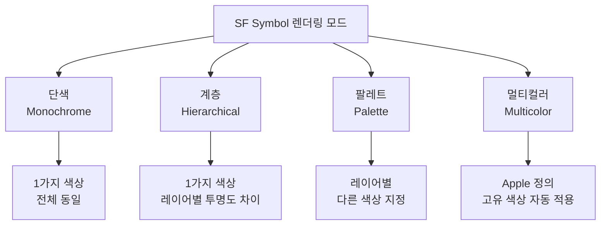
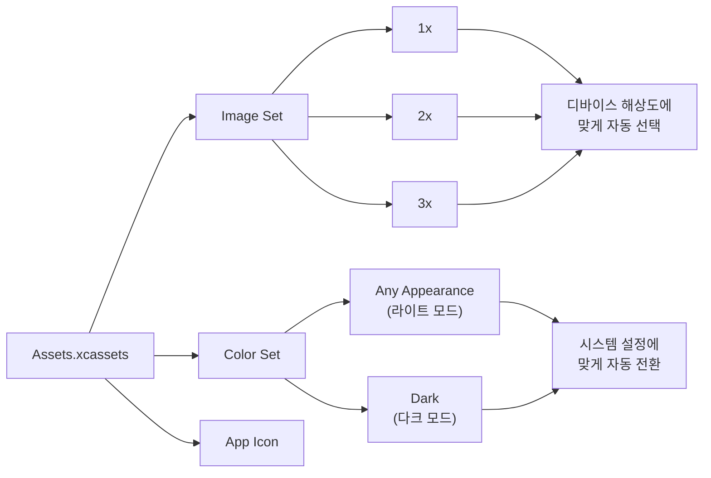
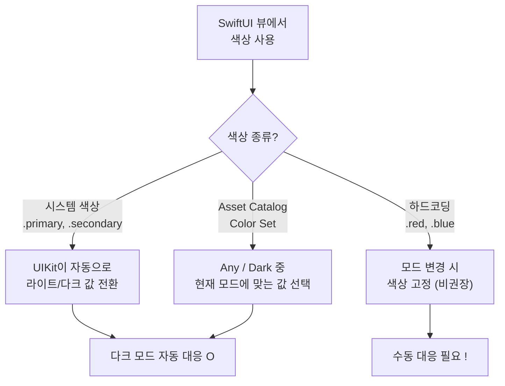

# SF Symbols과 에셋 관리

> SF Symbols 6, Asset Catalog, Color Set, 다크모드 대응

## 개요

앱을 예쁘게 만들려면 아이콘과 이미지가 필수인데요, Apple이 **6,000개 이상의 무료 아이콘**을 제공한다는 사실, 알고 계셨나요? 이 섹션에서는 SF Symbols 활용법과 Xcode의 에셋 카탈로그로 이미지와 색상을 체계적으로 관리하는 방법을 배워봅니다.

**선수 지식**: [03. 폼과 사용자 입력](./03-forms-input.md)에서 배운 Form 구성 기초
**학습 목표**:
- SF Symbols를 SwiftUI에서 활용하기
- 심볼 렌더링 모드(단색, 계층, 팔레트, 멀티컬러) 이해하기
- symbolEffect로 애니메이션 적용하기
- Asset Catalog로 이미지와 색상 관리하기
- 다크 모드 대응하기

## 왜 알아야 할까?

앱에서 "설정" 아이콘, "검색" 돋보기, "공유" 화살표 같은 아이콘은 어디서 올까요? 직접 디자인하면 시간도 걸리고, 다양한 크기에 대응하기도 어렵죠. **SF Symbols**를 사용하면 시스템 폰트처럼 자동으로 크기가 조절되고, Apple의 모든 플랫폼에서 일관된 모습을 보여줍니다. 디자이너 없이도 전문적인 앱을 만들 수 있는 비결이에요!

## 핵심 개념

### 개념 1: SF Symbols 기초 — 시스템 아이콘 사용하기

> 💡 **비유**: SF Symbols는 **거대한 아이콘 사전**이에요. "이런 아이콘 있을까?" 하고 찾으면 거의 있습니다. 게다가 크기도 자동 조절되는 **벡터 아이콘**이라 어떤 크기에서도 선명해요.

```swift
import SwiftUI

struct SFSymbolsBasicView: View {
    var body: some View {
        VStack(spacing: 24) {
            // 기본 사용: Image(systemName:)
            Image(systemName: "star.fill")
                .font(.largeTitle)

            // Label: 아이콘 + 텍스트 조합
            Label("즐겨찾기", systemImage: "heart.fill")
                .font(.title2)

            // 폰트 크기로 아이콘 크기 조절
            HStack(spacing: 20) {
                Image(systemName: "cloud.sun.fill")
                    .font(.caption)
                Image(systemName: "cloud.sun.fill")
                    .font(.body)
                Image(systemName: "cloud.sun.fill")
                    .font(.title)
                Image(systemName: "cloud.sun.fill")
                    .font(.largeTitle)
            }

            // 색상 적용
            Image(systemName: "flame.fill")
                .font(.system(size: 50))
                .foregroundStyle(.orange)
        }
    }
}

#Preview {
    SFSymbolsBasicView()
}
```

> 💡 **알고 계셨나요?**: SF Symbols는 **WWDC 2019**에서 처음 소개되었습니다. 처음에는 약 1,500개의 심볼로 시작했는데, 지금은 **6,000개 이상**으로 늘어났어요. Apple이 매년 수백 개씩 추가하고 있답니다!

### 개념 2: 렌더링 모드 — 아이콘에 색을 입히는 4가지 방법

SF Symbols는 단순한 흑백 아이콘이 아닙니다. **4가지 렌더링 모드**로 다양한 색상 표현이 가능해요.

> 📊 **그림 1**: SF Symbols의 4가지 렌더링 모드 비교




```swift
import SwiftUI

struct RenderingModesView: View {
    var body: some View {
        VStack(spacing: 30) {
            // 1. 단색 (Monochrome) — 기본값
            // 하나의 색상으로 전체를 채움
            HStack {
                Image(systemName: "cloud.sun.rain.fill")
                    .symbolRenderingMode(.monochrome)
                    .foregroundStyle(.blue)
                Text("단색 (Monochrome)")
            }
            .font(.title2)

            // 2. 계층 (Hierarchical)
            // 하나의 색상을 기준으로 레이어별 투명도가 달라짐
            HStack {
                Image(systemName: "cloud.sun.rain.fill")
                    .symbolRenderingMode(.hierarchical)
                    .foregroundStyle(.blue)
                Text("계층 (Hierarchical)")
            }
            .font(.title2)

            // 3. 팔레트 (Palette)
            // 레이어별로 다른 색상을 지정
            HStack {
                Image(systemName: "cloud.sun.rain.fill")
                    .symbolRenderingMode(.palette)
                    .foregroundStyle(.gray, .orange, .blue)
                Text("팔레트 (Palette)")
            }
            .font(.title2)

            // 4. 멀티컬러 (Multicolor)
            // Apple이 정의한 고유 색상 사용
            HStack {
                Image(systemName: "cloud.sun.rain.fill")
                    .symbolRenderingMode(.multicolor)
                Text("멀티컬러 (Multicolor)")
            }
            .font(.title2)
        }
        .padding()
    }
}

#Preview {
    RenderingModesView()
}
```

### 개념 3: symbolEffect — 아이콘 애니메이션

iOS 17부터 SF Symbols에 **애니메이션 효과**를 줄 수 있게 되었어요. 알림 벨이 흔들리거나, 다운로드 아이콘이 반짝이는 효과를 코드 한 줄로 구현할 수 있습니다.

```swift
import SwiftUI

struct SymbolEffectView: View {
    @State private var isBellActive = false
    @State private var isDownloading = false

    var body: some View {
        VStack(spacing: 40) {
            // 바운스 효과: 탭할 때마다 통통 튀기
            Image(systemName: "bell.fill")
                .font(.system(size: 50))
                .foregroundStyle(.orange)
                .symbolEffect(.bounce, value: isBellActive)
                .onTapGesture { isBellActive.toggle() }

            // 연속 흔들림 효과
            Image(systemName: "wifi")
                .font(.system(size: 50))
                .foregroundStyle(.blue)
                .symbolEffect(.variableColor.iterative,
                              options: .repeat(.continuous))

            // 심볼 교체 애니메이션 (Magic Replace)
            Image(systemName: isDownloading
                  ? "pause.circle.fill"
                  : "play.circle.fill")
                .font(.system(size: 50))
                .foregroundStyle(.green)
                .contentTransition(.symbolEffect(.replace))
                .onTapGesture { isDownloading.toggle() }

            // 위글 효과 (iOS 18+)
            Image(systemName: "bell.badge.fill")
                .font(.system(size: 50))
                .foregroundStyle(.red)
                .symbolEffect(.wiggle,
                              options: .repeat(.periodic(delay: 2)))
        }
        .padding()
    }
}

#Preview {
    SymbolEffectView()
}
```

> 🔥 **실무 팁**: `symbolEffect`는 모든 심볼에서 동일하게 작동하지 않아요. `.variableColor`는 레이어가 있는 심볼에서만 효과적이고, `.wiggle`은 심볼에 따라 흔들리는 방향이 다릅니다. SF Symbols 앱에서 미리 테스트해보세요!

### 개념 4: Asset Catalog — 이미지와 색상 관리

> 💡 **비유**: Asset Catalog은 앱의 **옷장**입니다. 이미지, 색상, 아이콘 등을 잘 정리해두면, 코드에서 이름만으로 꺼내 쓸 수 있어요. 라이트 모드용/다크 모드용 옷을 따로 걸어두면 상황에 맞게 자동으로 바뀌죠.

> 📊 **그림 2**: Asset Catalog의 구조와 리소스 해석 흐름




**이미지 에셋 추가하기:**
1. Xcode에서 `Assets.xcassets`를 클릭
2. 좌측 하단 + 버튼 → "Image Set" 선택
3. 1x, 2x, 3x 해상도별 이미지를 드래그하여 등록

**컬러 에셋 추가하기:**
1. Assets.xcassets에서 + 버튼 → "Color Set" 선택
2. "Any Appearance"에 라이트 모드 색상 설정
3. "Dark"에 다크 모드 색상 설정

```swift
import SwiftUI

struct AssetCatalogDemoView: View {
    var body: some View {
        VStack(spacing: 20) {
            // 에셋 카탈로그의 이미지 (타입 세이프 방식, Xcode 15+)
            // Image(.myPhoto)   // ImageResource 자동 생성

            // 문자열 기반 방식
            // Image("my-photo")

            // 에셋 카탈로그의 커스텀 색상
            // Color(.myBrand)   // ColorResource 자동 생성

            // SF Symbol은 systemName으로
            Image(systemName: "photo.artframe")
                .font(.system(size: 60))
                .foregroundStyle(.blue)

            Text("에셋 카탈로그 데모")
                .font(.title2)
                // 커스텀 색상 사용 예시
                // .foregroundStyle(Color(.brandColor))
        }
    }
}

#Preview {
    AssetCatalogDemoView()
}
```

> 💡 **알고 계셨나요?**: Xcode 15부터는 에셋 카탈로그에 등록한 이미지와 색상에 대해 **타입 세이프한 Swift 심볼**이 자동 생성됩니다. `Image("photo")`(문자열 기반) 대신 `Image(.photo)`(타입 세이프)로 쓸 수 있어서, 오타로 인한 런타임 오류를 방지할 수 있어요!

### 개념 5: 다크 모드 대응

SwiftUI는 다크 모드를 기본 지원합니다. 시스템 색상과 Asset Catalog을 활용하면 자동으로 대응돼요.

> 📊 **그림 3**: SwiftUI 다크 모드 색상 해석 흐름




```swift
import SwiftUI

struct DarkModeView: View {
    var body: some View {
        VStack(spacing: 20) {
            // 시스템 색상: 자동으로 다크/라이트 대응
            Text("시스템 색상은 자동 대응!")
                .foregroundStyle(.primary)    // 검정 ↔ 흰색
            Text("보조 텍스트")
                .foregroundStyle(.secondary)  // 회색 (밝기 자동 조절)

            // 배경도 자동 대응
            RoundedRectangle(cornerRadius: 12)
                .fill(Color(.systemBackground))
                .frame(height: 100)
                .overlay {
                    Text("시스템 배경색")
                }

            // SF Symbols도 다크 모드에 자동 대응
            HStack(spacing: 20) {
                Image(systemName: "sun.max.fill")
                    .symbolRenderingMode(.multicolor)
                Image(systemName: "moon.fill")
                    .symbolRenderingMode(.multicolor)
            }
            .font(.largeTitle)
        }
        .padding()
    }
}

// 다크 모드로 프리뷰
#Preview("라이트 모드") {
    DarkModeView()
        .preferredColorScheme(.light)
}

#Preview("다크 모드") {
    DarkModeView()
        .preferredColorScheme(.dark)
}
```

## 실습: 직접 해보기

SF Symbols를 활용한 기능 소개 화면을 만들어봅시다.

```swift
import SwiftUI

struct FeatureRow: View {
    let symbol: String
    let title: String
    let description: String
    let color: Color

    var body: some View {
        HStack(spacing: 16) {
            Image(systemName: symbol)
                .font(.title)
                .symbolRenderingMode(.hierarchical)
                .foregroundStyle(color)
                .frame(width: 50, height: 50)

            VStack(alignment: .leading, spacing: 4) {
                Text(title)
                    .font(.headline)
                Text(description)
                    .font(.subheadline)
                    .foregroundStyle(.secondary)
            }

            Spacer()
        }
        .padding(.vertical, 8)
    }
}

struct FeatureListView: View {
    var body: some View {
        NavigationStack {
            List {
                FeatureRow(
                    symbol: "swift",
                    title: "Swift로 작성",
                    description: "안전하고 빠른 코드",
                    color: .orange
                )
                FeatureRow(
                    symbol: "iphone",
                    title: "네이티브 앱",
                    description: "iOS에 최적화된 경험",
                    color: .blue
                )
                FeatureRow(
                    symbol: "lock.shield.fill",
                    title: "보안 우선",
                    description: "데이터를 안전하게 보호",
                    color: .green
                )
                FeatureRow(
                    symbol: "sparkles",
                    title: "아름다운 디자인",
                    description: "Liquid Glass 적용",
                    color: .purple
                )
            }
            .navigationTitle("앱 기능")
        }
    }
}

#Preview {
    FeatureListView()
}
```

## 더 깊이 알아보기

### SF Symbols의 역사

SF Symbols는 **WWDC 2019**에서 Apple의 San Francisco 시스템 폰트 계열의 일부로 소개되었습니다. "SF"가 바로 San Francisco의 약자예요. Apple 디자인 팀은 수천 개의 벡터 심볼을 일일이 손으로 디자인했는데, 각 심볼은 9개의 두께(weight)와 3개의 크기(scale)를 지원해서 **총 27가지 변형**을 가지고 있어요.

SF Symbols 7 (iOS 26)에서는 **Draw 애니메이션**이 추가되었습니다. 심볼이 마치 손으로 그리듯이 나타나고 사라지는 효과예요. 또한 **그래디언트 렌더링**으로 하나의 색상에서 자동으로 깊이감 있는 그래디언트를 생성합니다.

### 커스텀 심볼 만들기

Apple의 SF Symbols 앱에서 기존 심볼을 복제한 후 컴포넌트(원형 테두리, 뱃지, 슬래시 등)를 조합해서 커스텀 심볼을 만들 수 있어요. SVG로 내보내서 Xcode의 에셋 카탈로그에 드래그하면 바로 사용 가능합니다. 커스텀 심볼은 `Image("mySymbol")`로 사용하고, `Image(systemName:)`은 사용할 수 없다는 점만 주의하세요.

## 흔한 오해와 팁

> ⚠️ **흔한 오해**: "SF Symbols는 상업 앱에서도 무료로 쓸 수 있나요?" — 네! Apple 플랫폼(iOS, macOS 등) 앱에서는 **무료로 사용** 가능합니다. 단, 앱 외부(웹사이트, 마케팅 자료 등)에서는 사용이 제한됩니다.

> 🔥 **실무 팁**: 어떤 심볼이 있는지 찾으려면 Apple의 **SF Symbols 앱**을 다운로드하세요 (무료). 카테고리별 검색, 렌더링 모드 미리보기, 애니메이션 테스트까지 모두 가능합니다.

> 💡 **알고 계셨나요?**: `.symbolRenderingMode(.multicolor)`를 적용하면 Apple 디자이너가 정한 "정답" 색상이 자동 적용됩니다. 날씨 아이콘의 태양은 노랗게, 구름은 회색으로 나오죠!

## 핵심 정리

| 개념 | 설명 |
|------|------|
| Image(systemName:) | SF Symbol 아이콘을 표시하는 방법 |
| Label | 아이콘 + 텍스트 조합 뷰 |
| symbolRenderingMode | 단색, 계층, 팔레트, 멀티컬러 중 선택 |
| symbolEffect | 바운스, 위글, 펄스 등 아이콘 애니메이션 |
| contentTransition | 심볼 교체 시 부드러운 전환 효과 |
| Asset Catalog | Xcode에서 이미지/색상을 관리하는 도구 |
| Color Set | 다크/라이트 모드별 색상을 정의 |
| preferredColorScheme | 다크/라이트 모드 강제 지정 |

## 다음 섹션 미리보기

이제 iOS 26의 가장 눈에 띄는 변화, **Liquid Glass** 디자인 언어를 본격적으로 배워봅니다. 반투명 유리 효과로 앱에 깊이감과 세련미를 더하는 방법을 알아볼까요? [05. iOS 26 Liquid Glass 디자인](./05-liquid-glass.md)에서 만나요!

## 참고 자료

- [SF Symbols - Apple Developer](https://developer.apple.com/sf-symbols/) - SF Symbols 앱 다운로드 및 공식 가이드
- [What's new in SF Symbols 7 - WWDC25](https://developer.apple.com/videos/play/wwdc2025/272/) - SF Symbols 7 새 기능 (Draw 애니메이션, 그래디언트)
- [Animate symbols in your app - WWDC23](https://developer.apple.com/videos/play/wwdc2023/10197/) - symbolEffect 소개 세션
- [Asset Catalog - Apple Developer Documentation](https://developer.apple.com/documentation/xcode/asset-management) - Xcode 에셋 카탈로그 가이드
