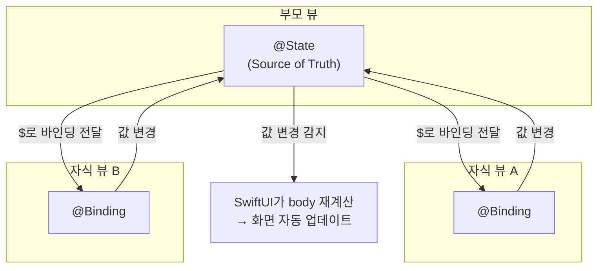
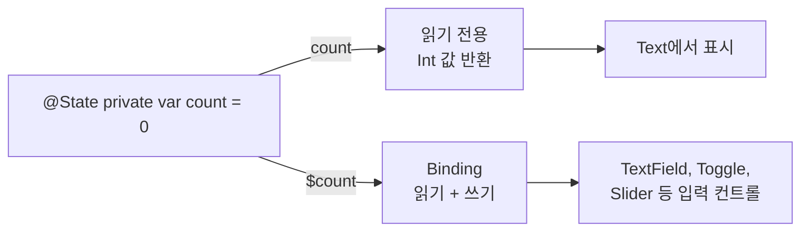
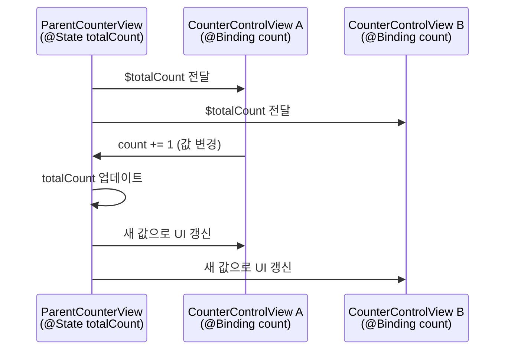
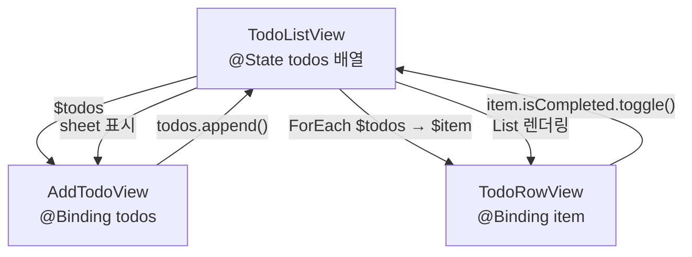

# @State와 @Binding

> 뷰 내부 상태, 부모-자식 간 양방향 바인딩

## 개요

지금까지 우리는 화면을 예쁘게 꾸미고, 네비게이션을 구성하고, Liquid Glass까지 적용해봤어요. 그런데 한 가지 중요한 질문이 남아있죠 — **"데이터가 바뀌면 화면은 어떻게 알고 업데이트될까?"** 이번 섹션에서는 SwiftUI의 심장이라 할 수 있는 상태 관리의 기초, `@State`와 `@Binding`을 깊이 파헤쳐봅니다.

**선수 지식**: [05. iOS 26 Liquid Glass 디자인](../04-navigation-design/05-liquid-glass.md)까지의 SwiftUI 기본 지식
**학습 목표**:
- @State가 SwiftUI에서 하는 역할 정확히 이해하기
- @Binding으로 부모-자식 뷰 간 데이터 양방향 연결하기
- @Bindable로 @Observable 객체의 프로퍼티에 바인딩 만들기
- 값 타입과 참조 타입에서의 상태 관리 차이 이해하기

## 왜 알아야 할까?

> 📊 **그림 1**: @State와 @Binding의 데이터 흐름 전체 구조




SwiftUI는 **선언형(Declarative)** 프레임워크입니다. "이 데이터가 이러면 화면은 이렇게 보여줘"라고 선언하면, 데이터가 바뀔 때 SwiftUI가 알아서 화면을 업데이트해요. 그런데 이 마법이 작동하려면, SwiftUI가 **어떤 데이터를 지켜봐야 하는지** 알아야 합니다. 그게 바로 `@State`의 역할이에요.

`@State`와 `@Binding`을 모르면 SwiftUI에서 사실상 아무것도 할 수 없습니다. 버튼 하나 누를 때마다 바뀌는 숫자, 텍스트 필드에 입력하는 글자, 토글의 on/off — 모든 인터랙션의 출발점이 바로 여기거든요.

## 핵심 개념

### 개념 1: @State — 뷰가 소유하는 데이터

> 💡 **비유**: `@State`는 **개인 화이트보드**입니다. 내 책상 위에 있는 화이트보드에 숫자를 적으면, 그 화이트보드를 바라보는 CCTV(SwiftUI)가 변화를 감지하고 모니터(화면)를 자동으로 업데이트해요. 다른 사람의 화이트보드가 아니라 **내 것**이라는 게 중요합니다.

`@State`는 **뷰가 직접 소유하고 관리하는 데이터**를 선언하는 프로퍼티 래퍼입니다. 이 값이 바뀌면 SwiftUI는 해당 뷰의 `body`를 다시 계산해서 화면을 업데이트합니다.

```swift
import SwiftUI

struct CounterView: View {
    // @State: 이 뷰가 소유하는 상태 — 반드시 private으로 선언
    @State private var count = 0

    var body: some View {
        VStack(spacing: 20) {
            // count가 바뀔 때마다 이 Text가 자동으로 업데이트됩니다
            Text("카운트: \(count)")
                .font(.largeTitle)
                .fontWeight(.bold)

            HStack(spacing: 16) {
                // 빼기 버튼
                Button("- 1") {
                    count -= 1
                }
                .buttonStyle(.bordered)

                // 더하기 버튼
                Button("+ 1") {
                    count += 1
                }
                .buttonStyle(.borderedProminent)
            }
        }
        .padding()
    }
}

#Preview {
    CounterView()
}
```

여기서 중요한 포인트가 몇 가지 있어요:

- **`private` 선언**: `@State`는 항상 `private`으로 선언하세요. 이 데이터의 주인은 이 뷰니까요.
- **값 타입**: `@State`는 `Int`, `String`, `Bool`, `struct` 같은 값 타입에 사용합니다.
- **초기값 필수**: 선언할 때 반드시 초기값을 줘야 합니다.

> ⚠️ **흔한 오해**: "body가 호출될 때마다 @State가 초기화되지 않을까?" — 아닙니다! SwiftUI는 @State의 값을 뷰와 별도의 저장소에 보관합니다. 뷰 구조체가 다시 생성되더라도 @State 값은 유지돼요.

### 개념 2: @State로 다양한 타입 다루기

`@State`는 `Int`뿐 아니라 모든 값 타입에 사용할 수 있습니다.

```swift
struct ProfileEditorView: View {
    @State private var name = ""           // String
    @State private var age = 25            // Int
    @State private var isDeveloper = true  // Bool
    @State private var rating = 3.5        // Double
    @State private var selectedColor = Color.blue  // Color

    var body: some View {
        Form {
            // TextField에 $를 붙여 양방향 바인딩
            TextField("이름을 입력하세요", text: $name)

            // Stepper로 숫자 조절
            Stepper("나이: \(age)세", value: $age, in: 1...120)

            // Toggle로 불리언 전환
            Toggle("개발자인가요?", isOn: $isDeveloper)

            // Slider로 실수 조절
            Slider(value: $rating, in: 1...5, step: 0.5)
            Text("평점: \(rating, specifier: "%.1f")")

            // ColorPicker로 색상 선택
            ColorPicker("좋아하는 색", selection: $selectedColor)
        }
    }
}

#Preview {
    ProfileEditorView()
}
```

눈치채셨나요? `$` 기호가 붙었어요! 이게 바로 다음에 배울 **바인딩(Binding)** 입니다.

### 개념 3: $와 바인딩의 비밀

> 💡 **비유**: `@State`가 **원본 서류**라면, `$`를 붙이면 그 서류에 대한 **편집 권한이 있는 링크**를 만드는 겁니다. 링크를 받은 사람은 서류를 읽을 수도 있고, 내용을 수정할 수도 있어요. 수정하면 원본이 직접 바뀝니다.

`@State` 프로퍼티 앞에 `$`를 붙이면 `Binding<T>` 타입의 값이 됩니다. 이 바인딩은 **읽기/쓰기 모두 가능한 참조**입니다.

- `count` → 현재 값을 **읽기만** 함 (`Int`)
- `$count` → 값을 **읽고 쓸 수 있는 바인딩** (`Binding<Int>`)

> 📊 **그림 2**: @State 값 읽기 vs $ 바인딩의 차이




`TextField`, `Toggle`, `Slider` 같은 입력 컨트롤은 값을 변경해야 하므로, `$`를 통해 바인딩을 전달받습니다.

### 개념 4: @Binding — 부모의 데이터를 빌려 쓰기

> 💡 **비유**: `@Binding`은 **리모컨**과 같아요. TV(부모 뷰)가 가진 볼륨 값을 리모컨(자식 뷰)으로 조절할 수 있죠. 리모컨 자체는 볼륨 데이터를 저장하지 않고, TV의 볼륨을 직접 바꿉니다.

자식 뷰가 부모 뷰의 `@State` 데이터를 수정해야 할 때 `@Binding`을 사용합니다. `@Binding`은 데이터를 **소유하지 않고, 참조만** 합니다.

```swift
// 자식 뷰: 카운터 컨트롤만 담당
struct CounterControlView: View {
    // @Binding: 이 뷰는 데이터를 소유하지 않고, 부모의 데이터를 참조
    @Binding var count: Int

    var body: some View {
        HStack(spacing: 16) {
            Button("- 1") {
                count -= 1  // 부모의 @State가 변경됨!
            }
            .buttonStyle(.bordered)

            Text("\(count)")
                .font(.title)
                .frame(minWidth: 50)

            Button("+ 1") {
                count += 1
            }
            .buttonStyle(.borderedProminent)
        }
    }
}

// 부모 뷰: 데이터의 주인
struct ParentCounterView: View {
    @State private var totalCount = 0  // Source of Truth (진실의 원천)

    var body: some View {
        VStack(spacing: 30) {
            Text("총 카운트: \(totalCount)")
                .font(.largeTitle)

            // $를 붙여 바인딩을 전달
            CounterControlView(count: $totalCount)

            // 같은 바인딩을 여러 자식에게 전달할 수도 있음
            CounterControlView(count: $totalCount)
        }
        .padding()
    }
}

#Preview {
    ParentCounterView()
}
```

이 코드에서 `CounterControlView` 두 개가 같은 `$totalCount`를 공유하고 있어요. 어느 쪽에서든 값을 바꾸면 양쪽 모두 업데이트됩니다. 이것이 **단일 진실의 원천(Single Source of Truth)** 패턴이에요.

> 📊 **그림 3**: Single Source of Truth — 하나의 @State를 여러 자식이 공유




> 🔥 **실무 팁**: `@Binding`에는 `private`을 붙이지 마세요. 부모 뷰가 값을 전달해줘야 하니까요. `@State`는 `private`, `@Binding`은 `private` 없이 — 이 규칙만 기억하면 됩니다.

### 개념 5: @State로 참조 타입 관리하기 (iOS 17+)

iOS 17부터 `@State`에 큰 변화가 생겼습니다. 이전에는 값 타입만 `@State`로 관리했는데, 이제 `@Observable` 클래스도 `@State`로 관리할 수 있어요. 이건 다음 섹션에서 자세히 배울 내용이지만, 여기서 핵심만 미리 짚어볼게요.

```swift
import SwiftUI
import Observation

// @Observable 매크로가 붙은 클래스 (다음 섹션에서 자세히!)
@Observable
class TimerModel {
    var seconds = 0
    var isRunning = false
}

struct TimerView: View {
    // iOS 17+: @State로 @Observable 클래스도 관리 가능!
    // 이전에는 @StateObject를 써야 했습니다
    @State private var timer = TimerModel()

    var body: some View {
        VStack(spacing: 20) {
            Text("\(timer.seconds)초")
                .font(.system(size: 60, weight: .bold, design: .monospaced))

            Button(timer.isRunning ? "정지" : "시작") {
                timer.isRunning.toggle()
            }
            .buttonStyle(.borderedProminent)
        }
    }
}

#Preview {
    TimerView()
}
```

| 시대 | 값 타입 상태 | 참조 타입 상태 |
|------|-------------|--------------|
| iOS 13~16 | `@State` | `@StateObject` |
| iOS 17+ (현재) | `@State` | `@State` + `@Observable` |

> 💡 **알고 계셨나요?**: `@StateObject`는 공식적으로 deprecated되지는 않았지만, Apple은 iOS 17+ 새 코드에서 `@State` + `@Observable` 조합을 권장합니다. 하나의 프로퍼티 래퍼로 값 타입과 참조 타입 모두를 다룰 수 있게 된 거죠!

### 개념 6: 커스텀 바인딩 만들기

때로는 단순히 값을 전달하는 것이 아니라, 값이 바뀔 때 **추가 로직**을 실행하고 싶을 때가 있어요. 이럴 때 커스텀 `Binding`을 만들 수 있습니다.

```swift
struct TemperatureView: View {
    @State private var celsius: Double = 20.0

    // 섭씨 ↔ 화씨 자동 변환 커스텀 바인딩
    var fahrenheitBinding: Binding<Double> {
        Binding(
            get: { celsius * 9 / 5 + 32 },       // 읽을 때: 섭씨 → 화씨
            set: { celsius = ($0 - 32) * 5 / 9 }  // 쓸 때: 화씨 → 섭씨
        )
    }

    var body: some View {
        Form {
            Section("섭씨") {
                Slider(value: $celsius, in: -40...100, step: 1)
                Text("\(celsius, specifier: "%.0f")°C")
            }

            Section("화씨") {
                // 커스텀 바인딩 사용
                Slider(value: fahrenheitBinding, in: -40...212, step: 1)
                Text("\(fahrenheitBinding.wrappedValue, specifier: "%.0f")°F")
            }
        }
    }
}

#Preview {
    TemperatureView()
}
```

커스텀 바인딩은 **데이터 변환**, **유효성 검사**, **로깅** 등 다양한 용도로 활용할 수 있습니다.

## 실습: 직접 해보기

배운 내용을 종합해서, **할 일 추가 화면**을 만들어봅시다. 부모-자식 뷰 간의 데이터 흐름을 직접 체험할 수 있어요.

```swift
import SwiftUI

// 할 일 데이터 모델 (값 타입)
struct TodoItem: Identifiable {
    let id = UUID()
    var title: String
    var isCompleted: Bool = false
}

// 할 일 한 줄을 보여주는 자식 뷰
struct TodoRowView: View {
    // @Binding으로 부모의 TodoItem을 직접 수정
    @Binding var item: TodoItem

    var body: some View {
        HStack {
            // 완료 토글 버튼
            Button {
                item.isCompleted.toggle()
            } label: {
                Image(systemName: item.isCompleted ? "checkmark.circle.fill" : "circle")
                    .foregroundStyle(item.isCompleted ? .green : .gray)
                    .font(.title2)
            }
            .buttonStyle(.plain)

            // 할 일 제목
            Text(item.title)
                .strikethrough(item.isCompleted)
                .foregroundStyle(item.isCompleted ? .secondary : .primary)

            Spacer()
        }
    }
}

// 새 할 일을 입력하는 자식 뷰
struct AddTodoView: View {
    // @Binding으로 부모의 배열에 직접 추가
    @Binding var todos: [TodoItem]
    @State private var newTitle = ""
    @Environment(\.dismiss) private var dismiss

    var body: some View {
        NavigationStack {
            Form {
                TextField("할 일을 입력하세요", text: $newTitle)

                Button("추가하기") {
                    guard !newTitle.isEmpty else { return }
                    let newItem = TodoItem(title: newTitle)
                    todos.append(newItem)
                    dismiss()
                }
                .disabled(newTitle.isEmpty)
            }
            .navigationTitle("새 할 일")
            .toolbar {
                ToolbarItem(placement: .cancellationAction) {
                    Button("취소") { dismiss() }
                }
            }
        }
    }
}

// 부모 뷰: 모든 데이터의 Source of Truth
struct TodoListView: View {
    @State private var todos: [TodoItem] = [
        TodoItem(title: "SwiftUI 공부하기"),
        TodoItem(title: "프로젝트 시작하기"),
        TodoItem(title: "앱스토어 출시하기")
    ]
    @State private var showAddSheet = false

    var body: some View {
        NavigationStack {
            List {
                ForEach($todos) { $item in
                    // $item: 배열 요소 하나하나에 대한 바인딩
                    TodoRowView(item: $item)
                }
                .onDelete { indexSet in
                    todos.remove(atOffsets: indexSet)
                }
            }
            .navigationTitle("할 일 목록")
            .toolbar {
                Button {
                    showAddSheet = true
                } label: {
                    Image(systemName: "plus")
                }
            }
            .sheet(isPresented: $showAddSheet) {
                AddTodoView(todos: $todos)
            }
        }
    }
}

#Preview {
    TodoListView()
}
```

이 실습에서 주목할 포인트:

> 📊 **그림 4**: 할 일 앱의 뷰 계층과 데이터 흐름



- **`TodoListView`**: `@State`로 `todos` 배열을 소유 (Source of Truth)
- **`TodoRowView`**: `@Binding`으로 개별 아이템을 수정
- **`AddTodoView`**: `@Binding`으로 부모의 배열에 새 항목 추가
- **`ForEach($todos)`**: 배열의 각 요소에 대한 바인딩 자동 생성

## 더 깊이 알아보기

SwiftUI의 상태 관리 시스템은 2019년 WWDC에서 처음 소개되었을 때 개발자들에게 큰 충격을 줬습니다. 기존 UIKit에서는 데이터가 바뀌면 개발자가 직접 `tableView.reloadData()`나 `label.text = "새 값"`처럼 UI를 수동으로 업데이트해야 했거든요.

**Chris Lattner**(Swift 언어 창시자)가 2010년에 시작한 Swift 프로젝트의 핵심 철학 중 하나가 **"안전성(Safety)"** 이었는데요, SwiftUI의 `@State`와 `@Binding`은 이 철학을 UI 프로그래밍으로 확장한 것입니다. 데이터와 UI의 동기화를 컴파일러 수준에서 보장하니까요.

WWDC 2020의 **"Data Essentials in SwiftUI"** 세션에서 Apple 엔지니어가 한 말이 인상적입니다: *"SwiftUI에서 가장 중요한 질문은 'Source of Truth가 어디인가?'입니다."* 이 원칙은 오늘날까지 SwiftUI 아키텍처의 핵심으로 남아있어요.

그리고 WWDC 2023에서 `@Observable` 매크로가 등장하면서, `@State`의 역할이 더욱 확장되었습니다. 이제 `@State` 하나로 값 타입과 참조 타입 모두를 관리할 수 있게 되었죠. 이전에는 `@State`, `@StateObject`, `@ObservedObject`, `@EnvironmentObject` 네 가지를 상황에 따라 골라 써야 했는데, 이제는 훨씬 단순해졌습니다.

## 흔한 오해와 팁

> ⚠️ **흔한 오해**: "@State 변수를 외부에서 초기화할 수 있다" — `@State`는 뷰의 **내부 상태**입니다. 외부에서 초기값을 주입하고 싶다면 `init()`에서 `_count = State(initialValue: value)`처럼 해야 하는데, 이 패턴은 권장되지 않아요. 외부에서 데이터를 받아야 한다면 `@Binding`이나 `@Environment`를 쓰세요.

> 🔥 **실무 팁**: `@Binding`을 여러 단계로 내려보내야 할 때("Prop Drilling")가 생기면, 그건 `@Environment`를 써야 한다는 신호입니다. 3단계 이상의 바인딩 전달은 코드를 복잡하게 만들어요. 이 내용은 [03. @Environment와 앱 전역 상태](./03-environment.md)에서 다룹니다.

> 💡 **알고 계셨나요?**: SwiftUI의 `@State`는 내부적으로 뷰 구조체가 아닌 **별도의 힙 저장소**에 값을 보관합니다. 그래서 뷰 구조체가 `body` 호출 때문에 다시 생성되더라도 상태가 유지되는 거예요. Apple은 이를 "SwiftUI manages the storage"라고 표현합니다.

## 핵심 정리

| 개념 | 설명 |
|------|------|
| `@State` | 뷰가 소유하는 상태. 값이 바뀌면 자동으로 UI 업데이트 |
| `@Binding` | 다른 뷰의 `@State`를 참조하는 양방향 연결. 데이터를 소유하지 않음 |
| `$` 접두어 | `@State` 프로퍼티를 `Binding` 타입으로 변환 |
| `private` | `@State`는 항상 `private`, `@Binding`은 `private` 없이 |
| Source of Truth | 데이터의 유일한 주인. 하나의 데이터에 하나의 @State만 |
| 커스텀 Binding | `Binding(get:set:)`으로 변환/검증 로직 추가 가능 |
| iOS 17+ | `@State`로 `@Observable` 클래스도 관리 가능 (`@StateObject` 대체) |

## 다음 섹션 미리보기

`@State`와 `@Binding`은 값 타입에는 완벽하지만, 앱이 커지면 여러 뷰에서 공유하는 **복잡한 데이터 모델**이 필요해집니다. 다음 섹션 [02. @Observable 매크로](./02-observable.md)에서는 클래스 기반의 데이터 모델을 만들고, SwiftUI가 프로퍼티 단위로 변경을 추적하는 강력한 Observation 시스템을 배워봅니다.

## 참고 자료

- [State | Apple Developer Documentation](https://developer.apple.com/documentation/swiftui/state) - @State 공식 레퍼런스
- [Binding | Apple Developer Documentation](https://developer.apple.com/documentation/swiftui/binding) - @Binding 공식 레퍼런스
- [Driving changes in your UI with state and bindings](https://developer.apple.com/tutorials/swiftui-concepts/driving-changes-in-your-ui-with-state-and-bindings) - Apple 공식 튜토리얼
- [Data Essentials in SwiftUI (WWDC 2020)](https://developer.apple.com/videos/play/wwdc2020/10040/) - Source of Truth 개념의 원전
- [Discover Observation in SwiftUI (WWDC 2023)](https://developer.apple.com/videos/play/wwdc2023/10149/) - @State가 @Observable과 만나는 순간
- [Managing user interface state | Apple Developer Documentation](https://developer.apple.com/documentation/swiftui/managing-user-interface-state) - 상태 관리 종합 가이드
