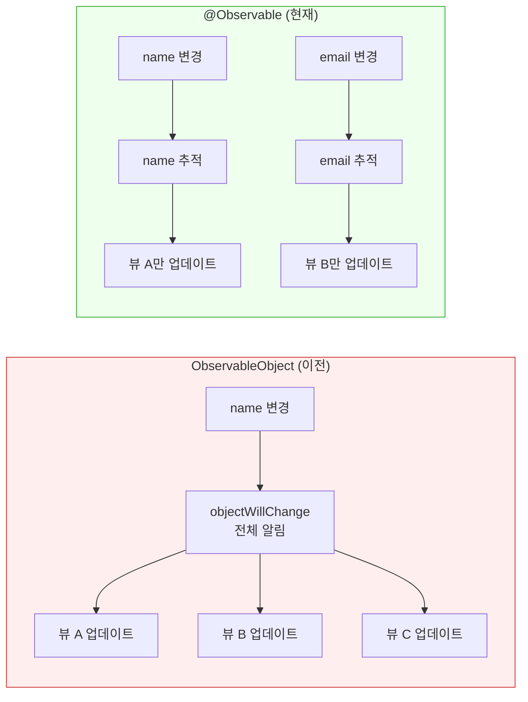
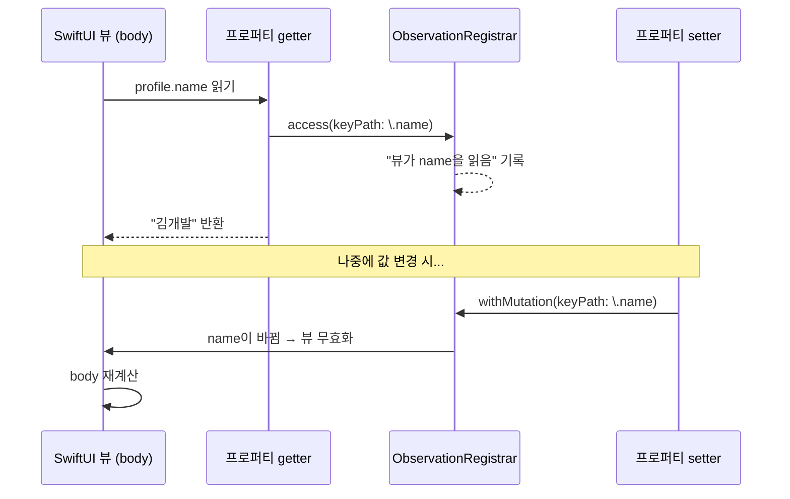
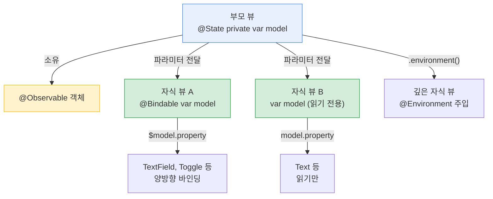
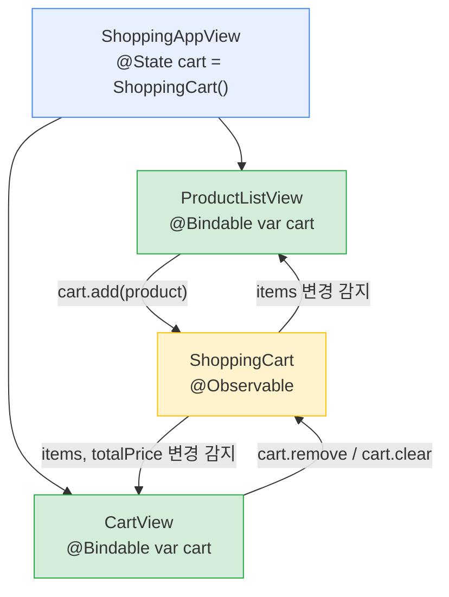

# @Observable 매크로

> Observation 프레임워크, 뷰 모델과의 연결

## 개요

앞서 `@State`로 간단한 값 타입 상태를 관리하는 법을 배웠죠. 하지만 실제 앱에서는 사용자 정보, 장바구니, 설정값 등 **여러 프로퍼티를 가진 복잡한 데이터 모델**이 필요합니다. 이런 모델을 만들고 SwiftUI와 자연스럽게 연결하는 마법의 도구가 바로 `@Observable` 매크로입니다.

**선수 지식**: [01. @State와 @Binding](./01-state-binding.md)에서 배운 상태 관리 기초
**학습 목표**:
- @Observable 매크로로 관찰 가능한 데이터 모델 만들기
- @Observable이 내부적으로 어떻게 동작하는지 이해하기
- ObservableObject에서 @Observable로의 변화 이해하기
- @Bindable로 @Observable 객체의 프로퍼티에 바인딩 만들기
- @ObservationIgnored로 추적 제외 프로퍼티 설정하기

## 왜 알아야 할까?

카운터 앱이야 `@State private var count = 0` 하나면 충분하죠. 하지만 쇼핑 앱을 생각해보세요 — 상품명, 가격, 수량, 장바구니 목록, 총 금액... 이런 데이터를 `@State` 변수 10개로 관리하면 코드가 엉망이 됩니다.

`@Observable`을 사용하면 관련된 데이터를 **하나의 클래스에 깔끔하게 모아놓고**, SwiftUI가 프로퍼티 하나하나의 변경을 정밀하게 추적합니다. 게다가 이전 세대(`ObservableObject`)보다 **성능도 좋고 코드도 간결**해요. iOS 17+를 타겟으로 하는 모든 새 프로젝트에서 표준이 된 기술입니다.

## 핵심 개념

### 개념 1: @Observable 매크로 기초

> 💡 **비유**: `@Observable`은 **스마트 감시 카메라 시스템**입니다. 집 안의 각 방(프로퍼티)마다 카메라가 설치되어 있어서, 거실(name)에 변화가 생기면 거실을 보는 모니터만 업데이트하고, 주방(email)을 보는 모니터는 그대로 둡니다. 이전 시스템(`ObservableObject`)은 어떤 방이든 변화가 생기면 **모든 모니터**가 깜빡였거든요.

> 📊 **그림 1**: @Observable의 프로퍼티 수준 추적 vs ObservableObject의 전체 알림




`@Observable`은 클래스에 붙이는 매크로입니다. 이 매크로를 붙이면 **모든 저장 프로퍼티**가 자동으로 관찰 대상이 됩니다.

```swift
import SwiftUI
import Observation

// @Observable 매크로를 클래스에 붙이면 끝!
@Observable
class UserProfile {
    var name = "김개발"       // 자동으로 관찰됨
    var email = ""            // 자동으로 관찰됨
    var age = 25              // 자동으로 관찰됨
    var isPremium = false     // 자동으로 관찰됨
}

struct ProfileView: View {
    // @State로 @Observable 객체를 소유 (iOS 17+)
    @State private var profile = UserProfile()

    var body: some View {
        VStack(alignment: .leading, spacing: 16) {
            // name만 읽으므로, name이 바뀔 때만 이 부분이 업데이트됨
            Text("안녕하세요, \(profile.name)님!")
                .font(.title)

            // isPremium을 읽으므로, isPremium이 바뀔 때만 업데이트됨
            if profile.isPremium {
                Label("프리미엄 회원", systemImage: "star.fill")
                    .foregroundStyle(.yellow)
            }

            Button("프리미엄 전환") {
                profile.isPremium.toggle()
            }
            .buttonStyle(.borderedProminent)
        }
        .padding()
    }
}

#Preview {
    ProfileView()
}
```

놀랍게도 `@Published`나 `objectWillChange` 같은 건 **하나도 필요 없습니다**. `@Observable`만 붙이면 SwiftUI가 알아서 각 프로퍼티의 변경을 추적해요.

### 개념 2: @Observable vs ObservableObject — 무엇이 달라졌나

iOS 17 이전에는 `ObservableObject` 프로토콜과 `@Published`를 사용했습니다. 비교해보면 얼마나 간결해졌는지 확실히 느낄 수 있어요.

```swift
// ❌ 이전 방식 (iOS 13~16): 보일러플레이트가 많음
class OldUserProfile: ObservableObject {
    @Published var name = "김개발"     // 일일이 @Published 필요
    @Published var email = ""
    @Published var age = 25
    @Published var isPremium = false
}

struct OldProfileView: View {
    @StateObject private var profile = OldUserProfile()  // @StateObject 필요
    var body: some View {
        Text(profile.name)
    }
}
```

```swift
// ✅ 현재 방식 (iOS 17+): 깔끔하고 성능도 좋음
@Observable
class NewUserProfile {
    var name = "김개발"     // 그냥 var만 쓰면 됨!
    var email = ""
    var age = 25
    var isPremium = false
}

struct NewProfileView: View {
    @State private var profile = NewUserProfile()  // @State 하나로 통일
    var body: some View {
        Text(profile.name)
    }
}
```

핵심 차이를 정리하면:

| 항목 | ObservableObject (이전) | @Observable (현재) |
|------|----------------------|-------------------|
| 프로퍼티 선언 | `@Published var` 필요 | 그냥 `var` |
| 뷰에서 소유할 때 | `@StateObject` | `@State` |
| 뷰에서 받을 때 | `@ObservedObject` | 그냥 프로퍼티 (래퍼 불필요) |
| Environment로 | `@EnvironmentObject` | `@Environment` |
| 바인딩 만들기 | `$model.property` (자동) | `@Bindable` 필요 |
| 업데이트 범위 | **모든** `@Published` 변경 → 전체 뷰 업데이트 | **읽은 프로퍼티만** 변경 시 해당 뷰 업데이트 |

> ⚠️ **흔한 오해**: "@Observable은 ObservableObject의 완벽한 대체재다" — 대부분 맞지만, 초기화 타이밍과 라이프사이클에 미묘한 차이가 있습니다. `@StateObject`는 지연 초기화(lazy init)를 했지만, `@State` + `@Observable`은 뷰 구조체가 생성될 때마다 이니셜라이저가 호출됩니다(다만 SwiftUI가 값을 보존합니다). 대부분의 경우 문제가 되지 않지만, 매우 무거운 초기화가 필요한 경우 `.task` 수정자에서 설정하는 것을 고려하세요.

### 개념 3: @Observable의 비밀 — 매크로가 하는 일

> 💡 **비유**: `@Observable`은 **자동 포장 기계**입니다. 우리가 평범한 `var name`을 넣으면, 기계가 자동으로 "누가 이 값을 읽었는지 기록하고, 값이 바뀌면 알림을 보내는" 코드로 감싸줍니다. 우리는 기계의 내부 동작을 몰라도 결과물을 쓰기만 하면 돼요.

`@Observable` 매크로는 컴파일 타임에 코드를 변환합니다. 내부적으로는 이런 일이 벌어져요:

1. 클래스에 **`ObservationRegistrar`** 가 자동 추가됨
2. 각 저장 프로퍼티가 **computed property + backing storage**로 변환됨
3. getter에서 **"이 프로퍼티를 읽었어"** 를 등록 (`access` 호출)
4. setter에서 **"이 프로퍼티가 바뀔 거야/바뀌었어"** 를 알림 (`withMutation` 호출)

> 📊 **그림 2**: @Observable 매크로가 프로퍼티를 변환하는 과정




SwiftUI는 뷰의 `body`를 계산할 때, 어떤 `@Observable` 프로퍼티에 접근했는지를 추적합니다. 그래서 해당 프로퍼티가 바뀔 때**만** 그 뷰를 다시 그리는 거예요. 이것이 `ObservableObject`보다 성능이 좋은 핵심 이유입니다.

### 개념 4: @Bindable — @Observable 객체에 바인딩 만들기

앞 섹션에서 `@State`에 `$`를 붙여 바인딩을 만들었죠? `@Observable` 객체의 프로퍼티에 바인딩이 필요할 때는 `@Bindable`을 사용합니다.

```swift
@Observable
class Settings {
    var username = ""
    var notificationsEnabled = true
    var fontSize = 16.0
}

// 뷰가 @Observable 객체를 소유하는 경우
struct SettingsView: View {
    // @State로 소유 → $를 바로 사용 가능!
    @State private var settings = Settings()

    var body: some View {
        Form {
            // @State로 소유한 @Observable은 $가 자동으로 됨
            TextField("사용자 이름", text: $settings.username)
            Toggle("알림 받기", isOn: $settings.notificationsEnabled)
            Slider(value: $settings.fontSize, in: 12...24, step: 1)
            Text("미리보기")
                .font(.system(size: settings.fontSize))
        }
    }
}
```

```swift
// 뷰가 @Observable 객체를 외부에서 받는 경우
struct SettingsDetailView: View {
    // 외부에서 받은 @Observable → @Bindable로 바인딩 생성
    @Bindable var settings: Settings

    var body: some View {
        Form {
            TextField("사용자 이름", text: $settings.username)
            Toggle("알림 받기", isOn: $settings.notificationsEnabled)
        }
    }
}

// 사용하는 부모 뷰
struct ParentView: View {
    @State private var settings = Settings()

    var body: some View {
        // settings를 자식 뷰에 전달
        SettingsDetailView(settings: settings)
    }
}

#Preview {
    ParentView()
}
```

바인딩이 필요한 상황별 사용법을 정리하면:

| 상황 | 사용법 |
|------|--------|
| `@State`로 소유한 `@Observable` | `$object.property` 바로 사용 |
| 파라미터로 받은 `@Observable` | `@Bindable var object` 선언 후 `$object.property` |
| `@Environment`로 받은 `@Observable` | body 안에서 `@Bindable var obj = obj` 후 사용 |

> 📊 **그림 3**: @Observable 객체의 소유와 전달 패턴




### 개념 5: @ObservationIgnored — 추적 제외하기

모든 프로퍼티가 관찰될 필요는 없습니다. 캐시, 내부 카운터, 임시 데이터 등 UI와 관계없는 프로퍼티는 `@ObservationIgnored`로 제외할 수 있어요.

```swift
@Observable
class ImageLoader {
    var currentImage: Image?      // UI에 표시 → 관찰 필요
    var isLoading = false          // 로딩 상태 → 관찰 필요

    // 캐시나 내부 상태는 관찰 불필요
    @ObservationIgnored
    var cache: [String: Data] = [:]

    @ObservationIgnored
    var requestCount = 0

    func loadImage(from url: String) {
        requestCount += 1  // UI가 다시 그려질 필요 없음
        isLoading = true   // 이건 UI에 반영됨
        // ... 이미지 로딩 로직
    }
}
```

> 🔥 **실무 팁**: `@ObservationIgnored`는 성능 최적화에 유용합니다. 초당 여러 번 바뀌는 값(타이머 내부 카운터, 네트워크 진행률 raw 데이터 등)은 제외하고, 실제 UI에 보여줄 가공된 값만 관찰하면 불필요한 뷰 업데이트를 줄일 수 있어요.

### 개념 6: @Observable은 클래스 전용

한 가지 꼭 기억할 점이 있어요. `@Observable`은 **클래스(class)에만** 사용할 수 있습니다. 구조체(struct)에는 사용할 수 없어요.

왜 그럴까요? Observation 프레임워크는 **참조 타입의 정체성(identity)** 에 의존합니다. 같은 객체를 여러 뷰가 참조하고, 그 객체의 프로퍼티가 바뀌면 참조하는 모든 뷰에 알려야 하죠. 값 타입(struct)은 복사되니까 이런 공유 참조가 불가능합니다.

- **값 타입 상태** (Int, String, struct) → `@State`
- **참조 타입 데이터 모델** (class) → `@Observable` + `@State`

## 실습: 직접 해보기

쇼핑 카트를 모델링해봅시다. `@Observable`로 데이터 모델을 만들고, 여러 뷰에서 공유하는 패턴을 연습합니다.

```swift
import SwiftUI
import Observation

// 상품 데이터 모델 (값 타입 — struct)
struct Product: Identifiable {
    let id = UUID()
    let name: String
    let price: Int
    let emoji: String
}

// 장바구니 데이터 모델 (참조 타입 — @Observable class)
@Observable
class ShoppingCart {
    var items: [Product] = []

    // 연산 프로퍼티도 자동으로 의존성이 추적됩니다
    var totalPrice: Int {
        items.reduce(0) { $0 + $1.price }
    }

    var itemCount: Int {
        items.count
    }

    // 내부 로깅용 — UI와 무관
    @ObservationIgnored
    var addedCount = 0

    func add(_ product: Product) {
        items.append(product)
        addedCount += 1
    }

    func remove(at offsets: IndexSet) {
        items.remove(atOffsets: offsets)
    }

    func clear() {
        items.removeAll()
    }
}

// 상품 목록 뷰
struct ProductListView: View {
    let products: [Product] = [
        Product(name: "맥북 프로", price: 2_990_000, emoji: "💻"),
        Product(name: "아이폰", price: 1_550_000, emoji: "📱"),
        Product(name: "에어팟 프로", price: 359_000, emoji: "🎧"),
        Product(name: "아이패드", price: 599_000, emoji: "📲"),
        Product(name: "애플워치", price: 599_000, emoji: "⌚")
    ]

    // @Bindable로 외부에서 받은 @Observable에 접근
    @Bindable var cart: ShoppingCart

    var body: some View {
        List(products) { product in
            HStack {
                Text(product.emoji)
                    .font(.largeTitle)

                VStack(alignment: .leading) {
                    Text(product.name)
                        .font(.headline)
                    Text("\(product.price)원")
                        .foregroundStyle(.secondary)
                }

                Spacer()

                Button("담기") {
                    cart.add(product)
                }
                .buttonStyle(.borderedProminent)
                .buttonBorderShape(.capsule)
            }
        }
    }
}

// 장바구니 뷰
struct CartView: View {
    @Bindable var cart: ShoppingCart

    var body: some View {
        VStack {
            if cart.items.isEmpty {
                ContentUnavailableView(
                    "장바구니가 비었어요",
                    systemImage: "cart",
                    description: Text("상품을 담아보세요!")
                )
            } else {
                List {
                    ForEach(cart.items) { item in
                        HStack {
                            Text(item.emoji)
                            Text(item.name)
                            Spacer()
                            Text("\(item.price)원")
                                .foregroundStyle(.secondary)
                        }
                    }
                    .onDelete { offsets in
                        cart.remove(at: offsets)
                    }

                    // 총액 표시
                    Section {
                        HStack {
                            Text("총 금액")
                                .font(.headline)
                            Spacer()
                            Text("\(cart.totalPrice)원")
                                .font(.title3)
                                .fontWeight(.bold)
                                .foregroundStyle(.blue)
                        }
                    }
                }

                Button("장바구니 비우기") {
                    cart.clear()
                }
                .foregroundStyle(.red)
                .padding()
            }
        }
    }
}

// 메인 뷰 — @State로 장바구니 소유
struct ShoppingAppView: View {
    @State private var cart = ShoppingCart()
    @State private var selectedTab = 0

    var body: some View {
        TabView(selection: $selectedTab) {
            Tab("상품", systemImage: "bag", value: 0) {
                NavigationStack {
                    ProductListView(cart: cart)
                        .navigationTitle("Apple Store")
                }
            }

            Tab("장바구니", systemImage: "cart", value: 1) {
                NavigationStack {
                    CartView(cart: cart)
                        .navigationTitle("장바구니 (\(cart.itemCount))")
                }
            }
        }
    }
}

#Preview {
    ShoppingAppView()
}
```

이 실습에서 주목할 포인트:

> 📊 **그림 4**: 쇼핑 카트 실습의 뷰 계층과 데이터 흐름



- **`ShoppingCart`**: `@Observable` 클래스로, 여러 뷰에서 공유
- **`ShoppingAppView`**: `@State`로 `cart`를 소유 (Source of Truth)
- **`ProductListView`, `CartView`**: `@Bindable`로 `cart`를 받아 사용
- **연산 프로퍼티** (`totalPrice`, `itemCount`): 의존하는 저장 프로퍼티가 바뀌면 자동 업데이트

## 더 깊이 알아보기

`@Observable` 매크로는 **Swift Evolution 프로포절 SE-0395 "Observation"** 으로 제안되어, WWDC 2023에서 iOS 17과 함께 공개되었습니다. 이 프레임워크의 설계를 이끈 핵심 인물 중 한 명이 **Philippe Hausler**인데, 그는 Apple Foundation 팀의 시니어 엔지니어로서 Combine 프레임워크에도 참여했던 인물이에요.

Observation 프레임워크가 탄생한 배경에는 흥미로운 이야기가 있습니다. SwiftUI 초기(2019년)에 `ObservableObject`와 `@Published`를 만들었을 때, 이것이 **Combine 프레임워크에 의존**한다는 한계가 있었어요. Combine은 iOS 13+에서만 사용 가능하고, 크로스 플랫폼 Swift(Linux 등)에서는 쓸 수 없었죠. Observation 프레임워크는 Combine에 전혀 의존하지 않고, **Swift 매크로 시스템**을 활용해 더 효율적인 관찰 메커니즘을 구현했습니다.

그리고 **Swift 6.2**(Xcode 26과 함께 출시)에서는 `Observations`라는 새로운 `AsyncSequence` 타입이 추가되었습니다. 이를 통해 SwiftUI 뷰가 아닌 곳에서도 `@Observable` 객체의 변경을 비동기 스트림으로 관찰할 수 있게 되었어요. 이전에는 `withObservationTracking`이 한 번만 발동되는 제한이 있었는데, `Observations`가 이 문제를 깔끔하게 해결했습니다.

## 흔한 오해와 팁

> ⚠️ **흔한 오해**: "@Observable은 struct에도 쓸 수 있다" — 아닙니다! `@Observable`은 **클래스 전용**입니다. 구조체에 붙이면 컴파일 에러가 발생해요. 값 타입 상태는 그냥 `@State`를 쓰면 됩니다.

> 💡 **알고 계셨나요?**: `@Observable` 객체의 프로퍼티를 **클로저 안에서** 읽으면 SwiftUI가 추적하지 못할 수 있습니다. `onAppear { print(model.name) }`에서 `model.name`이 바뀌어도 뷰가 업데이트되지 않아요. 반드시 `body` 표현식에서 직접 접근해야 SwiftUI가 의존성을 추적합니다.

> 🔥 **실무 팁**: `@Observable` 클래스에 `@MainActor`를 붙이는 것을 추천합니다. UI 상태를 관리하는 클래스는 메인 스레드에서 프로퍼티를 변경해야 하니까요. Swift 6.2에서는 Approachable Concurrency 모드를 켜면 기본적으로 `@MainActor`가 적용됩니다.

## 핵심 정리

| 개념 | 설명 |
|------|------|
| `@Observable` | 클래스의 모든 저장 프로퍼티를 자동으로 관찰 가능하게 만드는 매크로 |
| `@State` + `@Observable` | `@StateObject`를 대체. 뷰가 @Observable 객체를 소유할 때 사용 |
| `@Bindable` | 외부에서 받은 @Observable 객체의 프로퍼티에 바인딩($) 생성 |
| `@ObservationIgnored` | 특정 프로퍼티를 관찰 대상에서 제외 |
| 프로퍼티 수준 추적 | @Observable은 읽은 프로퍼티만 추적 → ObservableObject보다 효율적 |
| 클래스 전용 | `@Observable`은 class에만 사용 가능, struct에는 `@State` 사용 |

## 다음 섹션 미리보기

하나의 `@Observable` 객체를 여러 뷰에 전달할 때, 파라미터로 계속 넘기는 건 번거롭죠? 다음 섹션 [03. @Environment와 앱 전역 상태](./03-environment.md)에서는 **뷰 계층 전체에 데이터를 주입**하는 `@Environment` 시스템을 배웁니다. 더 이상 prop drilling을 하지 않아도 됩니다!

## 참고 자료

- [Discover Observation in SwiftUI (WWDC 2023)](https://developer.apple.com/videos/play/wwdc2023/10149/) - @Observable의 모든 것을 다루는 필수 세션
- [Migrating from the Observable Object protocol to the Observable macro](https://developer.apple.com/documentation/swiftui/migrating-from-the-observable-object-protocol-to-the-observable-macro) - Apple 공식 마이그레이션 가이드
- [SE-0395: Observation](https://github.com/swiftlang/swift-evolution/blob/main/proposals/0395-observability.md) - Observation 프레임워크의 Swift Evolution 프로포절
- [Observable Macro performance increase over ObservableObject](https://www.avanderlee.com/swiftui/observable-macro-performance-increase-observableobject/) - @Observable의 성능 이점을 분석한 SwiftLee 블로그
- [What's new in SwiftUI (WWDC 2025)](https://developer.apple.com/videos/play/wwdc2025/256/) - iOS 26의 SwiftUI 업데이트 전체 정리
- [Streaming changes with Observations (Swift 6.2)](https://swiftwithmajid.com/2025/07/30/streaming-changes-with-observations/) - Swift 6.2의 Observations AsyncSequence 소개
