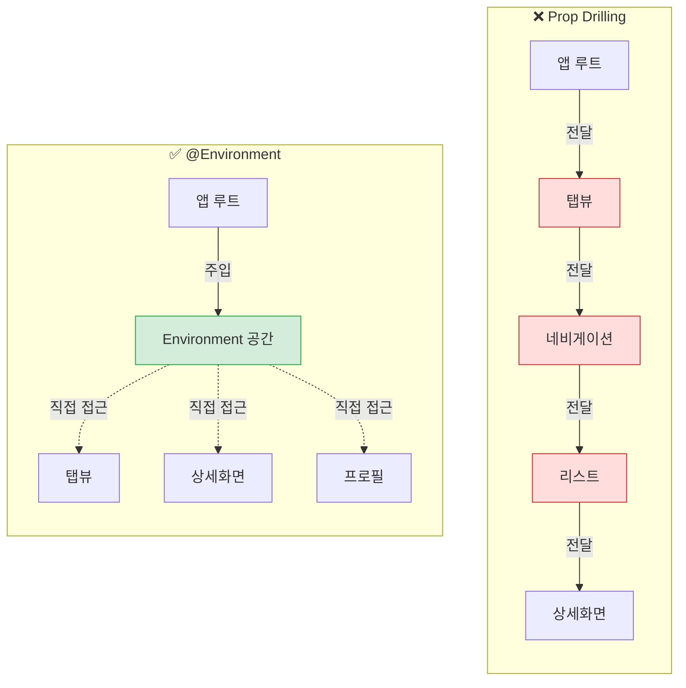
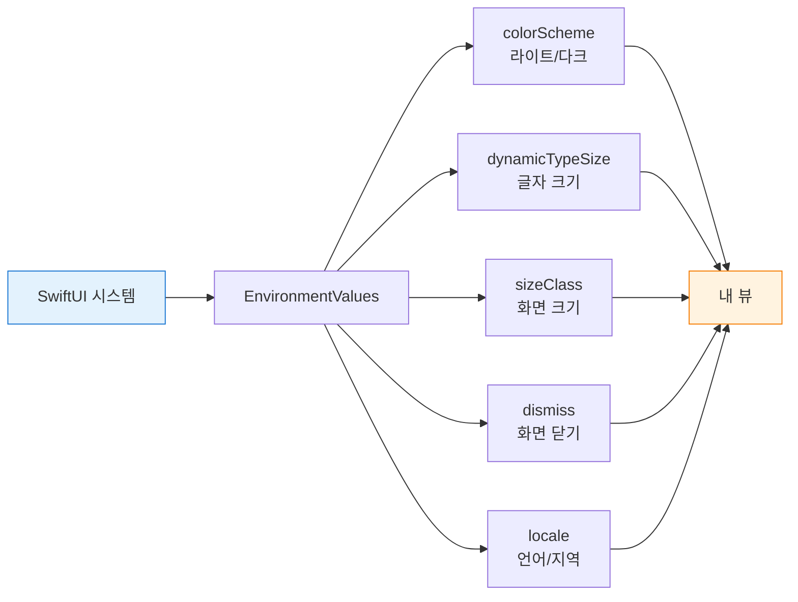
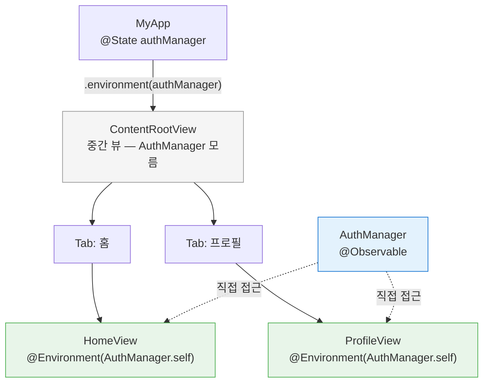
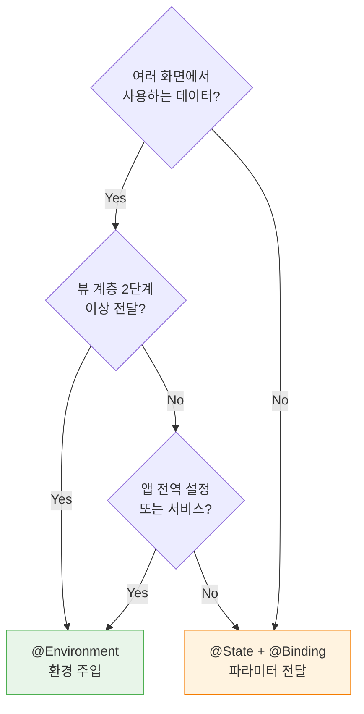

# @Environment와 앱 전역 상태

> @Environment, custom EnvironmentKey, 앱 설정 관리

## 개요

앞서 `@State`와 `@Binding`으로 부모-자식 간 데이터를 전달하고, `@Observable`로 데이터 모델을 만들었습니다. 그런데 앱이 커지면 문제가 생겨요 — 로그인 정보, 테마 설정, 앱 전체 설정 같은 데이터를 **모든 화면에서** 써야 하는데, 매번 파라미터로 전달하기엔 너무 번거롭죠. 이 문제를 해결하는 것이 바로 `@Environment`입니다.

**선수 지식**: [02. @Observable 매크로](./02-observable.md)에서 배운 @Observable 클래스 만들기
**학습 목표**:
- @Environment로 시스템 제공 환경 값 읽기
- @Observable 객체를 Environment로 주입하고 읽기
- @Entry 매크로로 커스텀 환경 값 쉽게 만들기
- 전통적인 EnvironmentKey 방식 이해하기
- Environment 활용 패턴과 주의사항 파악하기

## 왜 알아야 할까?

실제 앱을 생각해보세요. 로그인 화면, 프로필 화면, 설정 화면, 장바구니 화면... 이 모든 곳에서 "현재 로그인한 사용자 정보"가 필요합니다. 이걸 화면마다 `@Binding`으로 전달하면 어떻게 될까요?

**앱 → 탭뷰 → 네비게이션 → 리스트 → 상세화면 → 프로필 버튼**

이렇게 5단계를 거쳐야 하는데, 중간 화면들은 사용자 정보를 쓰지도 않으면서 그냥 **전달만** 하고 있어요. 이걸 **"Prop Drilling"** 이라고 부르는데, 코드를 복잡하고 유지보수하기 어렵게 만드는 주범이죠.

> 📊 **그림 1**: Prop Drilling vs @Environment — 데이터 전달 방식 비교




`@Environment`는 이 문제를 우아하게 해결합니다. 데이터를 뷰 계층의 **상위에서 한 번만 주입**하면, 하위의 어떤 뷰든 중간 단계 없이 바로 접근할 수 있어요.

## 핵심 개념

### 개념 1: @Environment로 시스템 값 읽기

> 💡 **비유**: `@Environment`는 **건물의 중앙 냉난방 시스템**과 같아요. 각 방(뷰)에서 온도 조절기를 확인하면 현재 건물의 냉난방 상태를 알 수 있죠. 방마다 따로 보일러를 설치할 필요 없이, 건물 전체에서 관리하는 설정을 각 방에서 읽어올 수 있습니다.

SwiftUI는 `@Environment`를 통해 수많은 시스템 값을 제공합니다. 시스템이 알아서 관리하는 값들이에요.

> 📊 **그림 2**: @Environment 시스템 값의 흐름 — SwiftUI가 자동으로 관리하는 환경 값




```swift
import SwiftUI

struct EnvironmentDemoView: View {
    // 시스템이 제공하는 환경 값들
    @Environment(\.colorScheme) private var colorScheme       // 라이트/다크 모드
    @Environment(\.dynamicTypeSize) private var typeSize       // 글자 크기 설정
    @Environment(\.horizontalSizeClass) private var sizeClass  // 화면 크기 (compact/regular)
    @Environment(\.dismiss) private var dismiss                // 화면 닫기 액션
    @Environment(\.openURL) private var openURL                // URL 열기 액션

    var body: some View {
        List {
            Section("현재 환경") {
                HStack {
                    Text("다크 모드")
                    Spacer()
                    Text(colorScheme == .dark ? "켜짐" : "꺼짐")
                        .foregroundStyle(.secondary)
                }

                HStack {
                    Text("글자 크기")
                    Spacer()
                    Text("\(typeSize)")
                        .foregroundStyle(.secondary)
                }

                HStack {
                    Text("화면 크기")
                    Spacer()
                    Text(sizeClass == .compact ? "Compact" : "Regular")
                        .foregroundStyle(.secondary)
                }
            }

            Section("액션") {
                Button("화면 닫기") {
                    dismiss()
                }

                Button("Apple 홈페이지 열기") {
                    openURL(URL(string: "https://apple.com")!)
                }
            }
        }
    }
}

#Preview {
    NavigationStack {
        EnvironmentDemoView()
            .navigationTitle("Environment 데모")
    }
}
```

자주 쓰는 시스템 환경 값들:

| 키패스 | 타입 | 용도 |
|--------|------|------|
| `\.colorScheme` | `ColorScheme` | 라이트/다크 모드 감지 |
| `\.dynamicTypeSize` | `DynamicTypeSize` | 사용자 글자 크기 설정 |
| `\.dismiss` | `DismissAction` | 현재 화면 닫기 |
| `\.locale` | `Locale` | 사용자 언어/지역 설정 |
| `\.isSearching` | `Bool` | 검색 바 활성 상태 |
| `\.horizontalSizeClass` | `UserInterfaceSizeClass?` | 화면 너비 카테고리 |

### 개념 2: @Observable 객체를 Environment로 주입하기

> 💡 **비유**: 이건 **회사의 공용 게시판**과 같아요. 사장(루트 뷰)이 게시판에 "오늘의 공지사항"을 붙이면, 어떤 부서(자식 뷰)든 게시판을 확인해서 읽을 수 있어요. 중간 관리자가 일일이 전달할 필요가 없죠.

iOS 17부터 `@Observable` 객체를 `.environment()` 수정자로 뷰 계층에 주입할 수 있습니다. 이전의 `.environmentObject()` 대신 사용하는 현대적인 방식이에요.

```swift
import SwiftUI
import Observation

// 앱 전역 인증 상태를 관리하는 모델
@Observable
class AuthManager {
    var currentUser: String?
    var isLoggedIn: Bool { currentUser != nil }

    func login(username: String) {
        currentUser = username
    }

    func logout() {
        currentUser = nil
    }
}

// 앱의 루트 — AuthManager를 environment로 주입
struct MyApp: View {
    @State private var authManager = AuthManager()

    var body: some View {
        ContentRootView()
            .environment(authManager)  // 여기서 한 번만 주입!
    }
}

// 중간 뷰 — AuthManager를 전혀 몰라도 됨
struct ContentRootView: View {
    var body: some View {
        TabView {
            Tab("홈", systemImage: "house") {
                HomeView()  // AuthManager를 파라미터로 전달하지 않음!
            }
            Tab("프로필", systemImage: "person") {
                ProfileView()  // 여기도 마찬가지!
            }
        }
    }
}

// 하위 뷰 — @Environment로 직접 접근
struct HomeView: View {
    @Environment(AuthManager.self) private var authManager

    var body: some View {
        VStack(spacing: 20) {
            if authManager.isLoggedIn {
                Text("환영합니다, \(authManager.currentUser!)님!")
                    .font(.title)
            } else {
                Text("로그인이 필요합니다")
                    .font(.title)
                    .foregroundStyle(.secondary)

                Button("로그인") {
                    authManager.login(username: "김개발")
                }
                .buttonStyle(.borderedProminent)
            }
        }
        .padding()
    }
}

struct ProfileView: View {
    @Environment(AuthManager.self) private var authManager

    var body: some View {
        VStack(spacing: 20) {
            if authManager.isLoggedIn {
                Image(systemName: "person.circle.fill")
                    .font(.system(size: 80))
                    .foregroundStyle(.blue)

                Text(authManager.currentUser ?? "")
                    .font(.title)

                Button("로그아웃") {
                    authManager.logout()
                }
                .foregroundStyle(.red)
            } else {
                Text("로그인 후 이용해주세요")
            }
        }
        .padding()
    }
}

#Preview {
    MyApp()
}
```

`ContentRootView`는 `AuthManager`에 대해 **전혀 모릅니다**. 그런데도 `HomeView`와 `ProfileView`는 `@Environment`로 직접 접근할 수 있어요. 이것이 prop drilling을 해결하는 핵심입니다.

> 📊 **그림 3**: @Observable 객체의 Environment 주입 흐름




> ⚠️ **흔한 오해**: "`@Environment`로 읽으려면 반드시 상위에서 `.environment()`로 주입해야 한다" — 맞습니다! 주입하지 않고 읽으려 하면 **런타임 크래시**가 발생해요. 항상 루트 뷰나 적절한 상위 뷰에서 주입했는지 확인하세요. Preview에서도 `.environment()`를 넣어줘야 합니다.

### 개념 3: @Environment에서 바인딩 만들기

`@Environment`로 받은 `@Observable` 객체의 프로퍼티를 `TextField`나 `Toggle`에 연결하려면, `body` 안에서 `@Bindable`을 사용합니다.

```swift
@Observable
class AppSettings {
    var username = ""
    var isDarkMode = false
    var fontSize = 16.0
    var language = "한국어"
}

struct SettingsFormView: View {
    @Environment(AppSettings.self) private var settings

    var body: some View {
        // body 안에서 @Bindable로 바인딩 생성
        @Bindable var settings = settings

        Form {
            Section("프로필") {
                TextField("사용자 이름", text: $settings.username)
            }

            Section("화면 설정") {
                Toggle("다크 모드", isOn: $settings.isDarkMode)

                VStack(alignment: .leading) {
                    Text("글자 크기: \(Int(settings.fontSize))pt")
                    Slider(value: $settings.fontSize, in: 12...28, step: 1)
                }
            }

            Section("언어") {
                Picker("언어", selection: $settings.language) {
                    Text("한국어").tag("한국어")
                    Text("English").tag("English")
                    Text("日本語").tag("日本語")
                }
            }
        }
    }
}

#Preview {
    SettingsFormView()
        .environment(AppSettings())
}
```

> 🔥 **실무 팁**: `@Bindable var settings = settings` 이 한 줄이 처음엔 어색하게 보일 수 있어요. `@Environment`는 읽기 전용으로 가져오는 것처럼 보이지만, 실제로 `@Observable` 객체는 참조 타입이라 내부 프로퍼티를 수정할 수 있습니다. `@Bindable`은 그 수정을 `$` 구문으로 할 수 있게 해주는 도구일 뿐이에요.

### 개념 4: @Entry 매크로로 커스텀 환경 값 만들기

Apple이 제공하는 시스템 환경 값 외에, **나만의 환경 값**을 만들 수도 있습니다. Xcode 16(Swift 5.10)부터 `@Entry` 매크로로 아주 간결하게 만들 수 있어요.

```swift
import SwiftUI

// @Entry로 커스텀 환경 값 정의 — 단 2줄!
extension EnvironmentValues {
    @Entry var accentTheme: Color = .blue
    @Entry var isCompactMode: Bool = false
    @Entry var appVersion: String = "1.0.0"
}

// 커스텀 환경 값을 사용하는 뷰
struct ThemedCardView: View {
    @Environment(\.accentTheme) private var accentTheme
    @Environment(\.isCompactMode) private var isCompactMode

    let title: String
    let description: String

    var body: some View {
        VStack(alignment: .leading, spacing: isCompactMode ? 4 : 12) {
            Text(title)
                .font(isCompactMode ? .subheadline : .headline)
                .foregroundStyle(accentTheme)

            Text(description)
                .font(isCompactMode ? .caption : .body)
                .foregroundStyle(.secondary)
        }
        .padding(isCompactMode ? 8 : 16)
        .background(.ultraThinMaterial)
        .clipShape(RoundedRectangle(cornerRadius: 12))
    }
}

// 사용하는 뷰
struct ThemedAppView: View {
    @State private var useOrangeTheme = false
    @State private var compactMode = false

    var body: some View {
        VStack(spacing: 20) {
            Toggle("오렌지 테마", isOn: $useOrangeTheme)
            Toggle("컴팩트 모드", isOn: $compactMode)

            // 하위 뷰 전체에 커스텀 환경 값 주입
            VStack(spacing: 12) {
                ThemedCardView(
                    title: "SwiftUI 마스터",
                    description: "상태 관리의 모든 것을 배워보세요"
                )
                ThemedCardView(
                    title: "iOS 26 새 기능",
                    description: "Liquid Glass와 새로운 API들"
                )
            }
            .environment(\.accentTheme, useOrangeTheme ? .orange : .blue)
            .environment(\.isCompactMode, compactMode)
        }
        .padding()
    }
}

#Preview {
    ThemedAppView()
}
```

### 개념 5: 전통적인 EnvironmentKey 방식

`@Entry` 매크로가 없던 시절에는 `EnvironmentKey` 프로토콜을 직접 구현해야 했습니다. 레거시 코드에서 이 패턴을 만날 수 있으니 알아두면 좋아요.

```swift
// 전통 방식: EnvironmentKey 프로토콜 구현 (참고용)
struct MaxItemCountKey: EnvironmentKey {
    static let defaultValue: Int = 10  // 기본값 필수
}

extension EnvironmentValues {
    var maxItemCount: Int {
        get { self[MaxItemCountKey.self] }
        set { self[MaxItemCountKey.self] = newValue }
    }
}

// 사용법은 동일
struct ItemListView: View {
    @Environment(\.maxItemCount) private var maxCount

    var body: some View {
        Text("최대 \(maxCount)개까지 표시")
    }
}
```

`@Entry`와 전통 방식의 비교:

| 항목 | @Entry (현대) | EnvironmentKey (전통) |
|------|--------------|---------------------|
| 코드량 | 2줄 | 10줄+ |
| 보일러플레이트 | 없음 | Key 구조체, get/set 필요 |
| 최소 지원 | Xcode 16+ | 모든 버전 |
| 기능 차이 | 동일 | 동일 |

> 💡 **알고 계셨나요?**: `@Entry` 매크로는 WWDC 2024에서 소개되었는데, 내부적으로는 전통 방식의 코드를 **자동 생성**합니다. 컴파일 타임에 `EnvironmentKey` 구조체, `EnvironmentValues` extension의 getter/setter를 모두 만들어주는 거예요. 디플로이먼트 타겟과 관계없이 iOS 13까지도 지원됩니다!

### 개념 6: Environment 사용 패턴과 가이드라인

> 📊 **그림 4**: Environment vs 파라미터 전달 — 판단 기준




`@Environment`는 강력하지만, 모든 데이터를 Environment로 만들면 오히려 코드가 혼란스러워질 수 있어요.

**Environment에 넣기 좋은 데이터:**
- 인증/세션 상태 (AuthManager)
- 앱 전역 설정 (테마, 언어, 폰트 크기)
- 공유 서비스 (NetworkManager, DataStore)
- 앱 수준의 네비게이션 상태

**그냥 파라미터로 전달하는 게 나은 데이터:**
- 특정 화면에서만 쓰는 로컬 데이터
- 부모-자식 1단계 전달
- 뷰의 구성 옵션 (색상, 크기 등 단순 값)

```swift
// ✅ 좋은 예: 앱 전체에서 쓰는 인증 상태
@Observable class AuthService { ... }
// .environment(authService)로 루트에서 주입

// ❌ 나쁜 예: 특정 리스트의 선택된 아이템
// 이건 그냥 @State + @Binding으로 충분
```

## 실습: 직접 해보기

앱 전역 설정과 인증을 Environment로 관리하는 미니 앱을 만들어봅시다.

```swift
import SwiftUI
import Observation

// 앱 전역 테마 관리
@Observable
class ThemeManager {
    var primaryColor: Color = .blue
    var isDarkMode = false
    var cornerRadius: CGFloat = 12
}

// 사용자 프로필 관리
@Observable
class UserStore {
    var name = ""
    var isLoggedIn = false

    func login(name: String) {
        self.name = name
        isLoggedIn = true
    }

    func logout() {
        name = ""
        isLoggedIn = false
    }
}

// 로그인 화면
struct LoginView: View {
    @Environment(UserStore.self) private var userStore
    @State private var inputName = ""

    var body: some View {
        VStack(spacing: 24) {
            Image(systemName: "person.circle")
                .font(.system(size: 80))
                .foregroundStyle(.blue)

            TextField("이름을 입력하세요", text: $inputName)
                .textFieldStyle(.roundedBorder)
                .padding(.horizontal, 40)

            Button("로그인") {
                userStore.login(name: inputName)
            }
            .buttonStyle(.borderedProminent)
            .disabled(inputName.isEmpty)
        }
    }
}

// 홈 화면
struct MainHomeView: View {
    @Environment(UserStore.self) private var userStore
    @Environment(ThemeManager.self) private var theme

    var body: some View {
        VStack(spacing: 20) {
            Text("안녕하세요, \(userStore.name)님!")
                .font(.title)

            // 테마 색상을 활용한 카드
            RoundedRectangle(cornerRadius: theme.cornerRadius)
                .fill(theme.primaryColor.opacity(0.2))
                .frame(height: 120)
                .overlay {
                    Text("오늘의 추천")
                        .font(.headline)
                        .foregroundStyle(theme.primaryColor)
                }
                .padding(.horizontal)
        }
    }
}

// 설정 화면
struct AppSettingsView: View {
    @Environment(UserStore.self) private var userStore
    @Environment(ThemeManager.self) private var theme

    var body: some View {
        @Bindable var theme = theme

        Form {
            Section("테마") {
                ColorPicker("메인 색상", selection: $theme.primaryColor)

                VStack(alignment: .leading) {
                    Text("모서리 둥글기: \(Int(theme.cornerRadius))")
                    Slider(value: $theme.cornerRadius, in: 0...30, step: 2)
                }
            }

            Section("계정") {
                HStack {
                    Text("사용자")
                    Spacer()
                    Text(userStore.name)
                        .foregroundStyle(.secondary)
                }

                Button("로그아웃") {
                    userStore.logout()
                }
                .foregroundStyle(.red)
            }
        }
    }
}

// 루트 뷰: Environment 주입의 중심
struct EnvironmentDemoApp: View {
    @State private var userStore = UserStore()
    @State private var themeManager = ThemeManager()

    var body: some View {
        Group {
            if userStore.isLoggedIn {
                TabView {
                    Tab("홈", systemImage: "house") {
                        NavigationStack {
                            MainHomeView()
                                .navigationTitle("홈")
                        }
                    }
                    Tab("설정", systemImage: "gear") {
                        NavigationStack {
                            AppSettingsView()
                                .navigationTitle("설정")
                        }
                    }
                }
            } else {
                LoginView()
            }
        }
        // 루트에서 한 번만 주입하면, 하위 모든 뷰에서 접근 가능
        .environment(userStore)
        .environment(themeManager)
    }
}

#Preview {
    EnvironmentDemoApp()
}
```

## 더 깊이 알아보기

`@Environment`의 설계는 SwiftUI 팀이 **React의 Context API**와 **의존성 주입(Dependency Injection)** 패턴에서 영감을 받았다고 알려져 있습니다. 하지만 SwiftUI는 이를 Swift의 타입 시스템과 결합해서 더 안전하게 만들었죠.

WWDC 2019에서 SwiftUI가 처음 발표되었을 때, 환경 시스템은 `@EnvironmentObject`와 `@Environment(\.keyPath)` 두 가지로 나뉘어 있었습니다. 전자는 커스텀 `ObservableObject`를 위한 것이었고, 후자는 시스템 값 전용이었어요. 이 구분이 많은 개발자에게 혼란을 주었는데, WWDC 2023에서 `@Observable`이 등장하면서 둘이 `@Environment` 하나로 **통합**되었습니다. `@Environment(MyType.self)`로 커스텀 객체를, `@Environment(\.keyPath)`로 시스템 값을 — 같은 문법 체계 안에서 모두 다룰 수 있게 된 거죠.

WWDC 2025에서 소개된 SwiftUI Instrument의 **Cause & Effect 그래프**는 Environment 변경이 어떤 뷰 업데이트를 유발하는지 시각화해줍니다. Apple 엔지니어의 조언: "Environment 값이 바뀌면, 그 값에 의존하는 **모든 뷰**가 알림을 받습니다. 따라서 자주 바뀌는 데이터를 Environment에 넣을 때는 주의하세요."

## 흔한 오해와 팁

> ⚠️ **흔한 오해**: "`@Environment`로 주입한 객체를 안 넣어도 기본값이 있을 거야" — `@Observable` 객체를 `@Environment(MyType.self)`로 읽을 때, 상위에서 `.environment(instance)`로 주입하지 않았다면 **런타임 크래시**가 발생합니다. `@Environment(\.keyPath)` 방식은 기본값이 있지만, 타입 기반 방식은 기본값이 없으니 주의하세요.

> 🔥 **실무 팁**: Preview에서 Environment 크래시를 막으려면, `#Preview`에서도 `.environment()`를 꼭 넣어주세요. 실무에서는 Preview용 mock 데이터를 static 프로퍼티로 만들어두면 편리합니다.

```swift
// Preview 헬퍼 예시
extension UserStore {
    static var preview: UserStore {
        let store = UserStore()
        store.login(name: "미리보기 유저")
        return store
    }
}

#Preview {
    ProfileView()
        .environment(UserStore.preview)
}
```

> 💡 **알고 계셨나요?**: `.environment()` 수정자는 해당 뷰의 **하위 계층 전체**에 영향을 줍니다. 하위 뷰에서 같은 타입의 `.environment()`를 다시 호출하면 **덮어쓰기**가 됩니다. 이를 활용해 특정 화면에서만 다른 설정을 적용할 수도 있어요.

## 핵심 정리

| 개념 | 설명 |
|------|------|
| `@Environment(\.keyPath)` | 시스템 제공 환경 값 읽기 (colorScheme, dismiss 등) |
| `@Environment(Type.self)` | @Observable 객체를 타입으로 읽기 (iOS 17+) |
| `.environment(object)` | @Observable 객체를 하위 뷰 계층에 주입 |
| `@Entry` 매크로 | 커스텀 환경 값을 2줄로 간결하게 정의 (Xcode 16+) |
| `EnvironmentKey` | 커스텀 환경 값 정의의 전통 방식 |
| `@Bindable` in body | @Environment로 받은 객체에 바인딩 생성 시 사용 |
| Prop Drilling 해결 | 중간 뷰를 거치지 않고 데이터 직접 접근 |

## 다음 섹션 미리보기

`@State`, `@Binding`, `@Observable`, `@Environment` — 네 가지 도구를 모두 배웠습니다! 하지만 "언제 어떤 걸 써야 해?"라는 질문이 남아있죠. 다음 섹션 [04. 데이터 흐름 설계](./04-data-flow.md)에서는 이 모든 도구를 **어떤 상황에서 선택**하고 **어떻게 조합**하는지, SwiftUI 앱의 데이터 아키텍처를 설계하는 방법을 배웁니다.

## 참고 자료

- [Environment | Apple Developer Documentation](https://developer.apple.com/documentation/swiftui/environment) - @Environment 공식 레퍼런스
- [EnvironmentValues | Apple Developer Documentation](https://developer.apple.com/documentation/swiftui/environmentvalues) - 사용 가능한 환경 값 전체 목록
- [Discover Observation in SwiftUI (WWDC 2023)](https://developer.apple.com/videos/play/wwdc2023/10149/) - @Environment + @Observable 통합 사용법
- [Adding values to the SwiftUI environment with @Entry macro](https://www.donnywals.com/adding-values-to-the-swiftui-environment-with-xcode-16s-entry-macro/) - @Entry 매크로 상세 해설
- [SwiftUI Environment — Concepts and Practice](https://fatbobman.com/en/posts/swiftui-environment-concepts-and-practice/) - Environment 패턴의 깊이 있는 분석
- [Optimize SwiftUI performance with Instruments (WWDC 2025)](https://developer.apple.com/videos/play/wwdc2025/306/) - Environment 변경이 뷰 업데이트에 미치는 영향 분석
