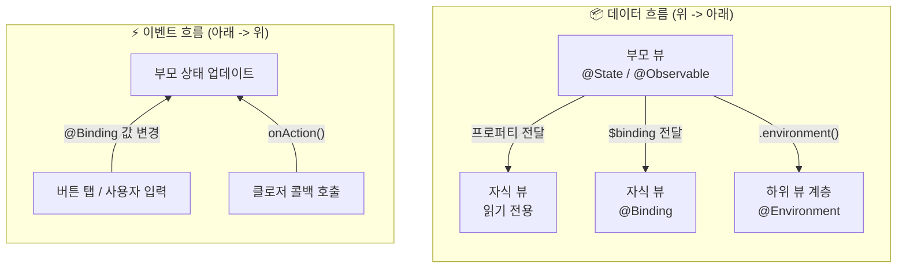
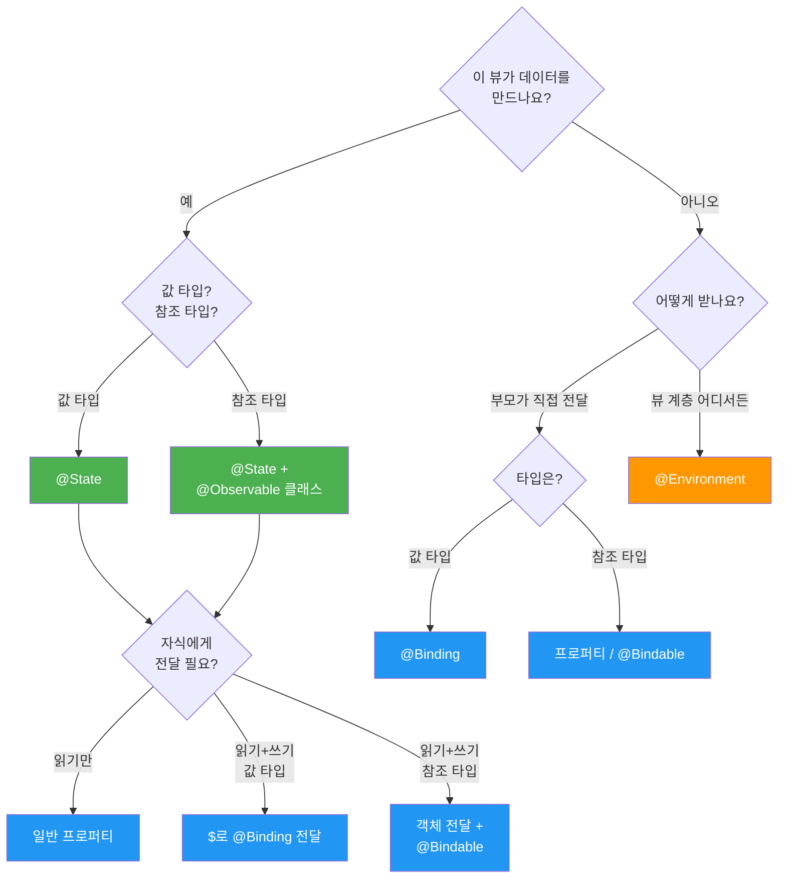
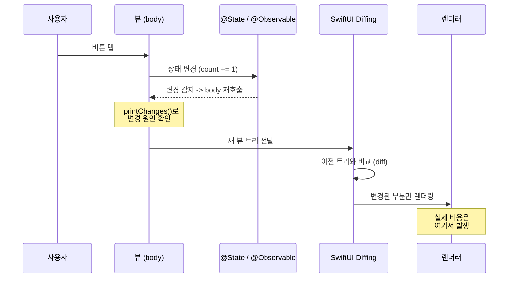
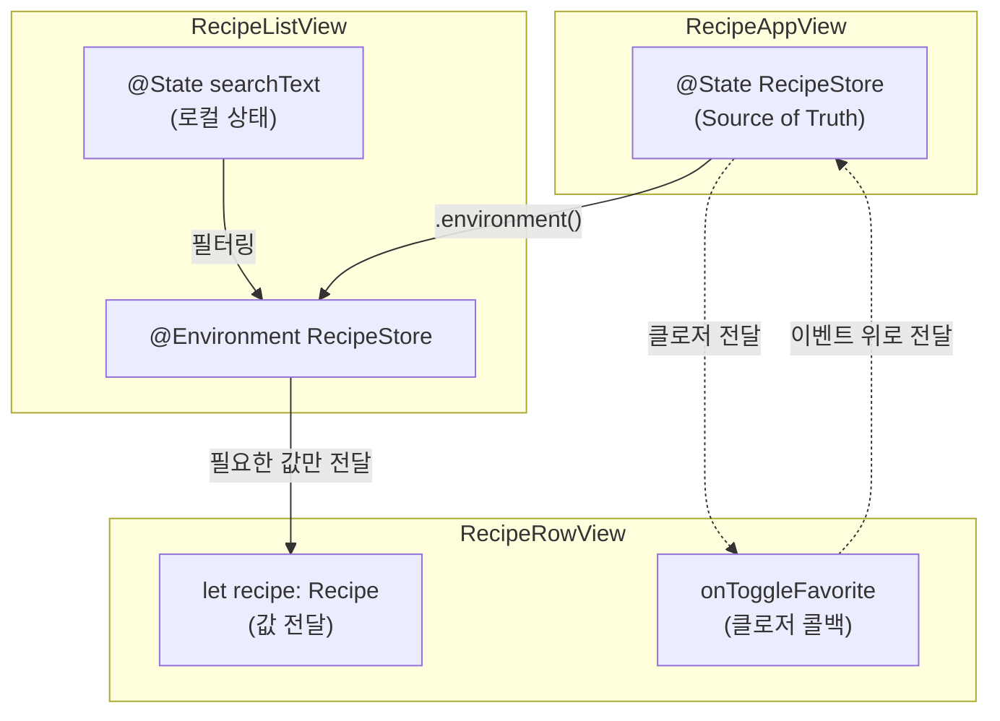
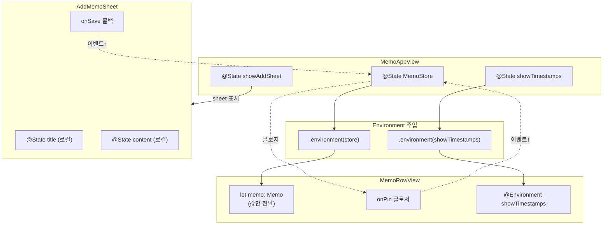

# 데이터 흐름 설계

> 단방향 데이터 흐름, Source of Truth, 상태 디버깅

## 개요

이번 챕터에서 `@State`, `@Binding`, `@Observable`, `@Environment`를 모두 배웠습니다. 도구는 갖췄는데, 이제 진짜 중요한 질문이 남았어요 — **"이 상황에서 어떤 도구를 써야 하지?"** 이번 섹션에서는 SwiftUI 앱의 데이터가 어떻게 흘러야 하는지, 그 설계 원칙과 실전 판단 기준을 정리합니다.

**선수 지식**: [03. @Environment와 앱 전역 상태](./03-environment.md)까지의 Ch5 전체 내용
**학습 목표**:
- Source of Truth(진실의 원천) 원칙을 명확히 이해하기
- 단방향 데이터 흐름의 개념과 이점 파악하기
- 상황별 프로퍼티 래퍼 선택 기준 정립하기
- SwiftUI 상태 디버깅 기법 익히기
- 실제 앱 설계에 적용하는 사고 과정 체험하기

## 왜 알아야 할까?

도구를 아는 것과 **잘 쓰는 것**은 전혀 다른 이야기입니다. 망치, 드라이버, 렌치를 다 가지고 있어도, 나사를 박는 데 망치를 쓰면 안 되잖아요?

SwiftUI 프로퍼티 래퍼도 마찬가지예요. 잘못 선택하면 **데이터가 꼬이고**, **뷰가 불필요하게 업데이트**되고, **버그 찾기가 지옥**이 됩니다. 반대로 올바른 설계를 하면, 앱이 커져도 데이터 흐름이 예측 가능하고 유지보수가 쉬워집니다.

이 섹션은 **"생각하는 법"** 을 배우는 시간입니다. 코드를 많이 쓰기보다는, 올바른 판단을 내리는 프레임워크를 머릿속에 세우는 게 목표예요.

## 핵심 개념

### 개념 1: Source of Truth — 데이터의 유일한 주인

> 💡 **비유**: Source of Truth는 **원본 계약서**입니다. 계약서 원본은 금고(하나)에만 보관하고, 필요한 사람에게는 사본(Binding)이나 열람 권한(Environment)을 줍니다. 만약 원본이 여러 곳에 있으면? "진짜 계약 내용이 뭐지?"라는 혼란이 생기겠죠.

SwiftUI 데이터 설계의 **제1 원칙**: **모든 데이터에는 유일한 주인(Source of Truth)이 있어야 합니다.**

```swift
// ❌ 잘못된 예: 같은 데이터에 Source of Truth가 2개
struct BadExampleView: View {
    @State private var username = "김개발"  // Source of Truth 1

    var body: some View {
        VStack {
            Text(username)
            // ChildView도 자체적으로 username을 @State로 가지고 있다면?
            // → 두 값이 따로 놀게 됩니다!
            BadChildView()
        }
    }
}

struct BadChildView: View {
    @State private var username = "김개발"  // Source of Truth 2 ← 문제!
    var body: some View {
        TextField("이름", text: $username)
    }
}
```

```swift
// ✅ 올바른 예: Source of Truth는 하나, 나머지는 참조
struct GoodExampleView: View {
    @State private var username = "김개발"  // 유일한 Source of Truth

    var body: some View {
        VStack {
            Text(username)
            // Binding으로 참조를 전달
            GoodChildView(username: $username)
        }
    }
}

struct GoodChildView: View {
    @Binding var username: String  // 참조만 — 주인이 아님
    var body: some View {
        TextField("이름", text: $username)
    }
}
```

Source of Truth를 결정하는 핵심 질문: **"이 데이터를 누가 만들고, 누가 소유하는가?"**

- 이 뷰에서 만든 데이터 → `@State`
- 부모가 만든 데이터 → `@Binding` 또는 그냥 프로퍼티
- 앱 전체에서 공유하는 데이터 → `@Environment`

### 개념 2: 단방향 데이터 흐름

> 💡 **비유**: 단방향 데이터 흐름은 **폭포수**와 같습니다. 물(데이터)은 위에서 아래로만 흐르고, 아래에서 위로 올리려면 **특별한 펌프(액션/이벤트)** 가 필요해요. 물이 아무 방향으로나 흐르면 혼란스럽지만, 한 방향으로 흐르면 예측 가능하죠.

SwiftUI의 데이터 흐름은 기본적으로 **위에서 아래로** 흐릅니다.

> 📊 **그림 1**: SwiftUI 단방향 데이터 흐름 — 데이터는 아래로, 이벤트는 위로




**데이터 흐름** → 부모에서 자식으로 (아래로)
- `@State` → `@Binding`
- `@Observable` → 프로퍼티 전달
- `.environment()` → `@Environment`

**이벤트(액션) 흐름** → 자식에서 부모로 (위로)
- 버튼 탭 → `@Binding`을 통한 값 변경
- 클로저 콜백 → 부모가 전달한 액션 실행

이 패턴을 지키면 데이터 흐름이 **예측 가능**해지고, 버그가 생겨도 추적이 쉬워집니다.

```swift
import SwiftUI
import Observation

// 데이터 모델 (Source of Truth)
@Observable
class TodoStore {
    var items: [String] = ["Swift 공부", "프로젝트 시작"]

    // 액션은 모델에서 정의 → 비즈니스 로직 집중화
    func addItem(_ title: String) {
        items.append(title)
    }

    func removeItem(at index: Int) {
        items.remove(at: index)
    }
}

// 읽기 전용 뷰 — 데이터가 위에서 아래로 흐름
struct TodoSummaryView: View {
    let itemCount: Int  // 단순 값 전달 (Source of Truth 아님)

    var body: some View {
        Text("할 일 \(itemCount)개")
            .font(.headline)
    }
}

// 입력 뷰 — 이벤트가 아래에서 위로 흐름
struct TodoInputView: View {
    @State private var newTitle = ""  // 입력 필드의 로컬 상태
    var onAdd: (String) -> Void       // 부모에게 전달할 액션

    var body: some View {
        HStack {
            TextField("할 일 입력", text: $newTitle)
                .textFieldStyle(.roundedBorder)

            Button("추가") {
                guard !newTitle.isEmpty else { return }
                onAdd(newTitle)  // 이벤트를 위로 전달!
                newTitle = ""
            }
            .buttonStyle(.borderedProminent)
        }
    }
}

// 부모 뷰 — 데이터의 주인
struct TodoAppView: View {
    @State private var store = TodoStore()

    var body: some View {
        VStack(spacing: 16) {
            // 데이터를 아래로 전달
            TodoSummaryView(itemCount: store.items.count)

            List {
                ForEach(store.items, id: \.self) { item in
                    Text(item)
                }
                .onDelete { indexSet in
                    for index in indexSet {
                        store.removeItem(at: index)
                    }
                }
            }

            // 액션 클로저를 아래로 전달, 이벤트가 위로 올라옴
            TodoInputView { title in
                store.addItem(title)
            }
            .padding(.horizontal)
        }
    }
}

#Preview {
    TodoAppView()
}
```

### 개념 3: 프로퍼티 래퍼 선택 의사결정 트리

상황에 따라 어떤 프로퍼티 래퍼를 써야 하는지, 의사결정 흐름을 정리해볼게요.

> 📊 **그림 2**: 프로퍼티 래퍼 선택 의사결정 트리




**질문 1: 이 데이터를 이 뷰가 만드나요?**
- **예** → 질문 2로
- **아니오** → 질문 4로

**질문 2: 값 타입(struct, Int, String)인가요, 참조 타입(class)인가요?**
- **값 타입** → `@State`
- **참조 타입** → `@State` + `@Observable` 클래스

**질문 3: 자식 뷰에 이 데이터를 전달해야 하나요?**
- **읽기만** → 그냥 프로퍼티로 전달
- **읽기+쓰기 (값 타입)** → `$`로 `@Binding` 전달
- **읽기+쓰기 (참조 타입)** → 객체 자체를 전달 + 자식에서 `@Bindable`

**질문 4: 데이터를 어떻게 받나요?**
- **부모가 직접 전달** → `@Binding` (값 타입) 또는 일반 프로퍼티 / `@Bindable` (참조 타입)
- **뷰 계층 어디서든 접근** → `@Environment`

결과를 표로 정리하면:

| 상황 | 프로퍼티 래퍼 |
|------|-------------|
| 뷰 내부의 간단한 값 상태 | `@State private var value = ...` |
| 뷰가 소유하는 @Observable 모델 | `@State private var model = MyModel()` |
| 부모의 값 타입 데이터를 읽기/쓰기 | `@Binding var value: Type` |
| 부모의 @Observable 모델 바인딩 | `@Bindable var model: MyModel` |
| 부모의 @Observable 모델 읽기만 | `var model: MyModel` (래퍼 불필요) |
| 앱 전역 공유 데이터 | `@Environment(MyType.self) var model` |
| 시스템 환경 값 읽기 | `@Environment(\.keyPath) var value` |

> ⚠️ **흔한 오해**: "@ObservedObject를 아직 써도 되지 않나?" — iOS 17+ 타겟이라면 쓸 필요가 없습니다. `@ObservedObject`는 `@Observable` 도입 이전의 레거시 패턴이에요. `@Observable` 객체를 자식 뷰에서 받을 때는 아무 프로퍼티 래퍼 없이 일반 프로퍼티로 받거나, 바인딩이 필요하면 `@Bindable`을 쓰면 됩니다.

### 개념 4: 상태 디버깅 — 뭐가 뷰를 다시 그리게 했을까?

앱이 커지면 "왜 이 뷰가 갑자기 업데이트되지?"라는 의문이 생깁니다. SwiftUI는 이를 디버깅하는 도구를 제공해요.

**방법 1: `Self._printChanges()` (개발 전용)**

```swift
struct DebuggableView: View {
    @State private var name = ""
    @State private var count = 0

    var body: some View {
        // 이 한 줄을 넣으면 콘솔에 어떤 프로퍼티가 변경을 유발했는지 출력
        let _ = Self._printChanges()

        VStack {
            TextField("이름", text: $name)
            Text("카운트: \(count)")
            Button("+1") { count += 1 }
        }
    }
}

// 콘솔 출력 예시:
// DebuggableView: _name changed.
// DebuggableView: _count changed.
// DebuggableView: @self changed.  ← 뷰 구조체 자체가 재생성됨
```

**방법 2: 시각적 디버깅**

```swift
struct VisualDebugView: View {
    @State private var count = 0

    var body: some View {
        VStack {
            // 업데이트될 때마다 랜덤 배경색이 바뀜
            Text("카운트: \(count)")
                .background(Color(
                    red: .random(in: 0...1),
                    green: .random(in: 0...1),
                    blue: .random(in: 0...1)
                ).opacity(0.3))

            Button("+1") { count += 1 }
        }
    }
}
```

**방법 3: Xcode 26 SwiftUI Instrument**

WWDC 2025에서 소개된 SwiftUI Instrument는 **Cause & Effect 그래프**를 제공합니다:
- 어떤 상태 변경이 어떤 뷰 업데이트를 유발했는지 시각화

> 📊 **그림 5**: SwiftUI 상태 변경 → 뷰 업데이트 디버깅 흐름



- 불필요한 업데이트를 주황색/빨간색으로 표시
- `@Observable`, `@Environment` 의존성 추적 가능

> 🔥 **실무 팁**: `Self._printChanges()`는 언더스코어(`_`)로 시작하는 **프라이빗 API**입니다. 디버깅에만 쓰고 프로덕션 코드에는 절대 포함하지 마세요. 릴리스 빌드에서는 제거해야 합니다.

### 개념 5: 불필요한 뷰 업데이트 줄이기

`@Observable`의 프로퍼티 수준 추적 덕분에 대부분의 경우 최적화가 자동이지만, 알아두면 좋은 패턴이 있어요.

```swift
@Observable
class AppState {
    var userName = "김개발"
    var itemCount = 0
    var lastUpdated = Date()  // 자주 바뀌는 프로퍼티

    @ObservationIgnored
    var internalCounter = 0  // UI와 무관한 값은 추적 제외
}

// ✅ 좋은 패턴: 필요한 데이터만 전달
struct ItemBadgeView: View {
    let count: Int  // @Observable 객체 대신 필요한 값만 받음

    var body: some View {
        Text("\(count)")
            .badge(count)
    }
}

// 사용: ItemBadgeView(count: appState.itemCount)
// → appState.userName이 바뀌어도 이 뷰는 업데이트되지 않음
```

핵심 원칙:
- **필요한 최소한의 데이터만 전달**: `@Observable` 객체 전체보다 필요한 프로퍼티만 전달
- **`@ObservationIgnored` 활용**: UI와 무관한 프로퍼티는 추적 제외
- **연산 프로퍼티 활용**: 자주 바뀌는 raw 데이터 대신 가공된 결과만 노출

### 개념 6: 실전 앱 설계 — 데이터 흐름 그려보기

실제 앱을 설계할 때의 사고 과정을 따라가볼게요. **레시피 앱**을 예로 들어봅시다.

**1단계: 어떤 데이터가 필요한가?**
- 레시피 목록 (앱 전역)
- 현재 사용자 (앱 전역)
- 검색어 (검색 화면 로컬)
- 선택된 레시피 (상세 화면)
- 즐겨찾기 상태 (앱 전역)

**2단계: 각 데이터의 Source of Truth는?**

| 데이터 | 범위 | Source of Truth | 프로퍼티 래퍼 |
|--------|------|----------------|-------------|
| 레시피 목록 | 앱 전역 | `RecipeStore` | `@State` (App) + `@Environment` |
| 현재 사용자 | 앱 전역 | `AuthManager` | `@State` (App) + `@Environment` |
| 검색어 | 검색 화면 | `SearchView` | `@State` (local) |
| 선택된 레시피 | 상세 화면 | NavigationStack | `navigationDestination`으로 전달 |
| 즐겨찾기 | 앱 전역 | `RecipeStore` 안의 프로퍼티 | `@Environment`로 접근 |

**3단계: 구조를 코드로 스케치**

```swift
import SwiftUI
import Observation

// 데이터 모델
struct Recipe: Identifiable {
    let id = UUID()
    let name: String
    let emoji: String
    var isFavorite: Bool = false
}

// 앱 전역 데이터 스토어
@Observable
class RecipeStore {
    var recipes: [Recipe] = [
        Recipe(name: "김치찌개", emoji: "🍲"),
        Recipe(name: "파스타", emoji: "🍝"),
        Recipe(name: "샐러드", emoji: "🥗"),
        Recipe(name: "스테이크", emoji: "🥩"),
        Recipe(name: "초밥", emoji: "🍣")
    ]

    var favoriteCount: Int {
        recipes.filter { $0.isFavorite }.count
    }

    func toggleFavorite(for id: UUID) {
        if let index = recipes.firstIndex(where: { $0.id == id }) {
            recipes[index].isFavorite.toggle()
        }
    }
}

// 검색 가능한 레시피 목록
struct RecipeListView: View {
    @Environment(RecipeStore.self) private var store
    @State private var searchText = ""  // 로컬 상태!

    var filteredRecipes: [Recipe] {
        if searchText.isEmpty {
            return store.recipes
        }
        return store.recipes.filter {
            $0.name.localizedCaseInsensitiveContains(searchText)
        }
    }

    var body: some View {
        List(filteredRecipes) { recipe in
            RecipeRowView(recipe: recipe) {
                store.toggleFavorite(for: recipe.id)
            }
        }
        .searchable(text: $searchText, prompt: "레시피 검색")
    }
}

// 레시피 한 줄 — 필요한 데이터만 받음
struct RecipeRowView: View {
    let recipe: Recipe
    var onToggleFavorite: () -> Void

    var body: some View {
        HStack {
            Text(recipe.emoji)
                .font(.largeTitle)
            Text(recipe.name)
                .font(.headline)
            Spacer()
            Button {
                onToggleFavorite()
            } label: {
                Image(systemName: recipe.isFavorite ? "heart.fill" : "heart")
                    .foregroundStyle(recipe.isFavorite ? .red : .gray)
            }
            .buttonStyle(.plain)
        }
    }
}

// 앱 루트
struct RecipeAppView: View {
    @State private var store = RecipeStore()

    var body: some View {
        NavigationStack {
            RecipeListView()
                .navigationTitle("레시피 (\(store.favoriteCount) 즐겨찾기)")
        }
        .environment(store)
    }
}

#Preview {
    RecipeAppView()
}
```

이 설계에서의 핵심 판단들:

> 📊 **그림 3**: 레시피 앱의 데이터 흐름 아키텍처



- **`RecipeStore`**: 앱 전역 → `@Environment`로 주입
- **`searchText`**: 검색 화면에서만 필요 → `@State` 로컬
- **`RecipeRowView`**: `@Observable` 전체가 아니라 **필요한 `Recipe` 값만** 전달
- **즐겨찾기 토글**: 클로저 콜백으로 이벤트를 위로 전달

## 실습: 직접 해보기

지금까지 배운 모든 개념을 총동원해서, 데이터 흐름이 깔끔한 **메모 앱**을 만들어봅시다.

```swift
import SwiftUI
import Observation

// 값 타입 모델
struct Memo: Identifiable {
    let id = UUID()
    var title: String
    var content: String
    var createdAt = Date()
    var isPinned = false
}

// @Observable 스토어 — Source of Truth
@Observable
class MemoStore {
    var memos: [Memo] = [
        Memo(title: "SwiftUI 학습 노트", content: "@State는 뷰가 소유하는 상태"),
        Memo(title: "쇼핑 리스트", content: "우유, 빵, 커피")
    ]

    var pinnedMemos: [Memo] { memos.filter { $0.isPinned } }
    var unpinnedMemos: [Memo] { memos.filter { !$0.isPinned } }

    func addMemo(title: String, content: String) {
        memos.insert(Memo(title: title, content: content), at: 0)
    }

    func deleteMemo(id: UUID) {
        memos.removeAll { $0.id == id }
    }

    func togglePin(id: UUID) {
        if let index = memos.firstIndex(where: { $0.id == id }) {
            memos[index].isPinned.toggle()
        }
    }
}

// 커스텀 환경 값
extension EnvironmentValues {
    @Entry var showTimestamps: Bool = true
}

// 메모 행 뷰 — 값만 전달받음
struct MemoRowView: View {
    let memo: Memo
    var onPin: () -> Void
    @Environment(\.showTimestamps) private var showTimestamps

    var body: some View {
        VStack(alignment: .leading, spacing: 4) {
            HStack {
                if memo.isPinned {
                    Image(systemName: "pin.fill")
                        .foregroundStyle(.orange)
                        .font(.caption)
                }
                Text(memo.title)
                    .font(.headline)
            }
            Text(memo.content)
                .font(.subheadline)
                .foregroundStyle(.secondary)
                .lineLimit(1)

            if showTimestamps {
                Text(memo.createdAt, style: .relative)
                    .font(.caption2)
                    .foregroundStyle(.tertiary)
            }
        }
        .swipeActions(edge: .leading) {
            Button {
                onPin()
            } label: {
                Label(
                    memo.isPinned ? "고정 해제" : "고정",
                    systemImage: memo.isPinned ? "pin.slash" : "pin"
                )
            }
            .tint(.orange)
        }
    }
}

// 메모 추가 시트 — 로컬 상태 + 콜백
struct AddMemoSheet: View {
    @State private var title = ""      // 로컬 상태
    @State private var content = ""    // 로컬 상태
    var onSave: (String, String) -> Void
    @Environment(\.dismiss) private var dismiss

    var body: some View {
        NavigationStack {
            Form {
                TextField("제목", text: $title)
                TextEditor(text: $content)
                    .frame(minHeight: 100)
            }
            .navigationTitle("새 메모")
            .toolbar {
                ToolbarItem(placement: .cancellationAction) {
                    Button("취소") { dismiss() }
                }
                ToolbarItem(placement: .confirmationAction) {
                    Button("저장") {
                        onSave(title, content)
                        dismiss()
                    }
                    .disabled(title.isEmpty)
                }
            }
        }
    }
}

// 메인 뷰
struct MemoAppView: View {
    @State private var store = MemoStore()
    @State private var showAddSheet = false
    @State private var showTimestamps = true

    var body: some View {
        NavigationStack {
            List {
                if !store.pinnedMemos.isEmpty {
                    Section("고정됨") {
                        ForEach(store.pinnedMemos) { memo in
                            MemoRowView(memo: memo) {
                                store.togglePin(id: memo.id)
                            }
                        }
                    }
                }

                Section("메모") {
                    ForEach(store.unpinnedMemos) { memo in
                        MemoRowView(memo: memo) {
                            store.togglePin(id: memo.id)
                        }
                    }
                    .onDelete { offsets in
                        let ids = offsets.map { store.unpinnedMemos[$0].id }
                        ids.forEach { store.deleteMemo(id: $0) }
                    }
                }
            }
            .navigationTitle("메모 (\(store.memos.count))")
            .toolbar {
                ToolbarItem(placement: .primaryAction) {
                    Button {
                        showAddSheet = true
                    } label: {
                        Image(systemName: "square.and.pencil")
                    }
                }
                ToolbarItem(placement: .secondaryAction) {
                    Toggle("시간 표시", isOn: $showTimestamps)
                }
            }
            .sheet(isPresented: $showAddSheet) {
                AddMemoSheet { title, content in
                    store.addMemo(title: title, content: content)
                }
            }
        }
        .environment(store)
        .environment(\.showTimestamps, showTimestamps)
    }
}

#Preview {
    MemoAppView()
}
```

이 앱의 데이터 흐름 정리:

> 📊 **그림 4**: 메모 앱 전체 데이터 흐름 설계



- **`MemoStore`** → `@State` (루트) + `@Environment` (하위 뷰)
- **`showAddSheet`**, **`showTimestamps`** → `@State` (로컬 UI 상태)
- **`title`**, **`content`** (AddMemoSheet) → `@State` (시트 로컬)
- **`showTimestamps`** → 커스텀 `@Environment` 값으로 하위 전달
- **이벤트** → 클로저 콜백(`onSave`, `onPin`)으로 위로 전달

## 더 깊이 알아보기

SwiftUI의 단방향 데이터 흐름 설계는 **React**와 **Elm Architecture**에서 큰 영향을 받았습니다. 2013년에 Facebook이 발표한 **Flux 아키텍처**가 "UI의 데이터는 한 방향으로만 흘러야 한다"는 개념을 대중화했는데, SwiftUI는 이를 Swift의 값 타입 시스템과 결합해 더 안전하게 구현한 셈이에요.

WWDC 2020의 **"Data Essentials in SwiftUI"** 에서 Apple 엔지니어 Luca Bernardi가 말한 유명한 원칙이 있습니다: *"Every piece of data in your app has a single source of truth."* 이 한 문장이 SwiftUI 데이터 설계의 모든 것을 담고 있어요.

2025년의 SwiftUI 생태계에서 흥미로운 트렌드가 있습니다. 예전에는 MVVM 패턴으로 ViewModel 클래스를 만드는 것이 당연했는데, `@Observable` 매크로 도입 이후 **"ViewModel이 꼭 필요한가?"** 라는 논의가 활발해졌어요. Apple 스스로도 공식 샘플 코드에서 ViewModel 없이 `@Observable` 모델을 직접 뷰에 연결하는 패턴을 보여주고 있습니다. 이 주제는 [Ch8. 아키텍처 패턴](08-architecture/01-mvvm.md)에서 깊이 다룹니다.

## 흔한 오해와 팁

> ⚠️ **흔한 오해**: "모든 데이터를 @Environment에 넣으면 편하겠다" — 과도한 Environment 사용은 오히려 코드 가독성을 떨어뜨립니다. 어디서 데이터가 주입되는지 추적하기 어려워지거든요. 1-2단계만 전달하면 되는 데이터는 그냥 파라미터로 넘기세요.

> 🔥 **실무 팁**: 데이터 흐름 설계에 확신이 없을 때는 **가장 단순한 방법부터** 시작하세요. `@State`로 시작 → 공유 필요하면 `@Binding` → 여러 계층이면 `@Environment`. 처음부터 복잡하게 설계하지 말고, **필요할 때 확장**하는 게 SwiftUI의 철학이에요.

> 💡 **알고 계셨나요?**: SwiftUI 뷰의 `body`가 호출되는 것은 화면에 **실제로 다시 그려지는 것과 다릅니다**. SwiftUI는 `body`를 호출한 뒤, 이전 결과와 비교(diffing)해서 **바뀐 부분만** 실제 렌더링에 반영합니다. 그래서 `body`가 자주 호출되는 것 자체는 큰 문제가 아니에요 — 진짜 비용은 렌더링에서 발생합니다.

## 핵심 정리

| 개념 | 설명 |
|------|------|
| Source of Truth | 모든 데이터에는 유일한 주인이 있어야 함. 중복 금지 |
| 단방향 데이터 흐름 | 데이터는 위→아래, 이벤트는 아래→위 |
| `@State` | 뷰 내부 상태. Source of Truth |
| `@Binding` | 부모 상태의 양방향 참조. 소유하지 않음 |
| `@Observable` | 클래스 모델에 프로퍼티 수준 관찰 부여 |
| `@Environment` | 뷰 계층 전체에 데이터 주입. Prop Drilling 해결 |
| `Self._printChanges()` | 어떤 프로퍼티가 뷰 업데이트를 유발했는지 디버깅 (개발 전용) |
| 설계 원칙 | 가장 단순한 방법부터 시작 → 필요할 때 확장 |

## 다음 섹션 미리보기

축하합니다! Ch5 상태 관리를 모두 마쳤습니다. SwiftUI에서 데이터를 다루는 핵심 도구를 모두 익혔어요. 다음 챕터 [Ch6. SwiftData](06-swiftdata/01-swiftdata-intro.md)에서는 이 데이터를 **영구적으로 저장**하는 방법을 배웁니다. 앱을 껐다가 켜도 데이터가 살아있는 진짜 앱을 만들어봐요!

## 참고 자료

- [Managing user interface state | Apple Developer Documentation](https://developer.apple.com/documentation/swiftui/managing-user-interface-state) - Apple의 상태 관리 종합 가이드
- [Data Essentials in SwiftUI (WWDC 2020)](https://developer.apple.com/videos/play/wwdc2020/10040/) - Source of Truth 개념의 원전
- [Demystify SwiftUI performance (WWDC 2023)](https://developer.apple.com/videos/play/wwdc2023/10160/) - 뷰 업데이트 최적화 원리
- [Optimize SwiftUI performance with Instruments (WWDC 2025)](https://developer.apple.com/videos/play/wwdc2025/306/) - Cause & Effect 그래프로 상태 디버깅
- [Exploring Key Property Wrappers in SwiftUI](https://fatbobman.com/en/posts/exploring-key-property-wrappers-in-swiftui/) - 프로퍼티 래퍼 선택 가이드 심층 분석
- [Defining the source of truth using a custom binding](https://developer.apple.com/tutorials/swiftui-concepts/defining-the-source-of-truth-using-a-custom-binding) - Apple 공식 튜토리얼
