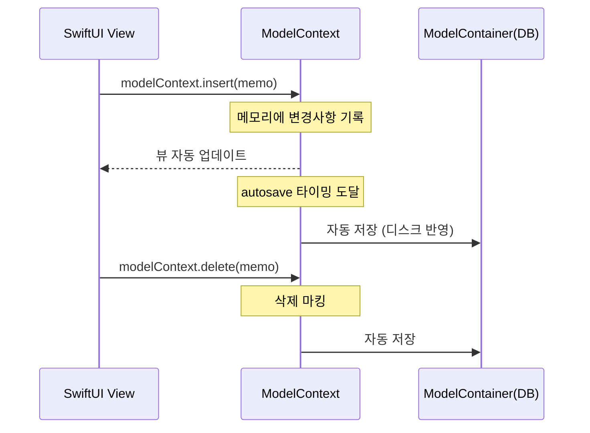

# SwiftData 시작하기

> @Model, ModelContainer, ModelContext 기초

## 개요

앱을 만들다 보면 반드시 부딪히는 질문이 있습니다 — **"사용자가 앱을 껐다가 다시 켜면, 데이터는 어떻게 되는 거지?"** 이번 섹션에서는 Apple의 최신 데이터 영속성(Persistence) 프레임워크인 SwiftData를 처음부터 배워봅니다. `@Model` 매크로로 모델을 선언하고, `ModelContainer`로 저장소를 설정하고, `ModelContext`로 데이터를 다루는 기초를 익힙니다.

**선수 지식**: [Ch5. 상태 관리](../05-state-management/04-data-flow.md)까지의 SwiftUI 기본 지식, 특히 `@State`와 `@Environment`
**학습 목표**:
- `@Model` 매크로로 영속 모델을 선언하는 방법 이해
- `ModelContainer`와 `ModelConfiguration`으로 저장소를 설정하는 방법 습득
- `ModelContext`의 역할과 자동 저장(autosave) 동작 이해
- SwiftData와 SwiftUI의 통합 방식 파악

## 왜 알아야 할까?

거의 모든 앱은 데이터를 저장합니다. 메모 앱의 노트, 할 일 앱의 태스크, 쇼핑 앱의 장바구니... 이 데이터를 앱이 꺼져도 유지하려면 **영속성 프레임워크**가 필요합니다. Apple 생태계에서 이 역할을 30년 가까이 해온 것이 Core Data인데, 솔직히 말하면 초보자에게 Core Data는 진입 장벽이 상당했습니다. `NSManagedObjectContext`, `NSFetchRequest`, `.xcdatamodeld` 파일... 배워야 할 개념이 너무 많았죠.

SwiftData는 이 모든 복잡함을 Swift 네이티브 코드로 감싸서, **평범한 Swift 클래스를 작성하는 것만으로** 데이터베이스를 사용할 수 있게 만들어줍니다. SwiftUI와의 통합도 놀라울 정도로 자연스럽습니다.

> 📊 **그림 1**: SwiftData의 3대 핵심 컴포넌트 관계

```mermaid
graph TD
    A["@Model\n영속 모델 정의"] -->|저장 대상| B["ModelContainer\n데이터베이스 관리"]
    B -->|작업 공간 제공| C["ModelContext\nCRUD 수행"]
    C -->|insert / delete / save| B
    D["SwiftUI View"] -->|@Environment| C
    D -->|.modelContainer(for:)| B
    A -->|@Query 자동 조회| D
```


## 핵심 개념

### 개념 1: @Model — 스마트 노트

> 💡 **비유**: `@Model`은 **스마트 노트**와 같습니다. 일반 노트에 적으면 그냥 글자일 뿐이지만, 스마트 노트에 적으면 자동으로 저장되고, 검색도 되고, 다른 기기와 동기화까지 됩니다. `@Model`을 붙이면 평범한 Swift 클래스가 이런 스마트 노트로 변신합니다.

`@Model`은 Swift 매크로(macro)로, 일반 Swift 클래스를 SwiftData가 관리하는 **영속 모델(Persistent Model)**로 만들어줍니다. Core Data에서 `.xcdatamodeld` 파일에 엔티티를 그래픽으로 그려야 했던 것과 달리, SwiftData에서는 그냥 Swift 코드를 작성하면 됩니다.

```swift
import SwiftData

// @Model 매크로 하나로 영속 모델 선언 완료!
@Model
class Memo {
    var title: String          // 메모 제목
    var content: String        // 메모 내용
    var createdAt: Date        // 생성 일시
    var isPinned: Bool         // 고정 여부

    // 일반 Swift 이니셜라이저
    init(title: String, content: String, isPinned: Bool = false) {
        self.title = title
        self.content = content
        self.createdAt = .now
        self.isPinned = isPinned
    }
}
```

놀랍게도, 이게 전부입니다! `@Model`이 컴파일 타임에 내부적으로 해주는 일을 살펴보면:

- `PersistentModel` 프로토콜 자동 채택 (SwiftData가 관리할 수 있는 모델임을 선언)
- `Observable` 프로토콜 자동 채택 (SwiftUI와 연동 — Ch5에서 배운 것처럼!)
- 각 프로퍼티에 대한 **변경 추적(change tracking)** 코드 생성
- 데이터베이스 스키마 자동 생성

> 📊 **그림 2**: @Model 매크로가 컴파일 타임에 생성하는 것들

```mermaid
flowchart LR
    A["일반 Swift 클래스"] -->|@Model 매크로| B["컴파일 타임 변환"]
    B --> C["PersistentModel\n프로토콜 채택"]
    B --> D["Observable\n프로토콜 채택"]
    B --> E["변경 추적\n코드 생성"]
    B --> F["DB 스키마\n자동 생성"]
    C --> G["SwiftData가\n관리 가능"]
    D --> H["SwiftUI 뷰\n자동 업데이트"]
```


> ⚠️ **흔한 오해**: "SwiftData 모델은 struct로도 만들 수 있다" — 아닙니다! `@Model`은 반드시 **class**에만 사용할 수 있습니다. 이는 SwiftData가 내부적으로 참조를 통해 변경을 추적하기 때문이에요. 하지만 걱정하지 마세요, `@Model` 클래스는 자동으로 `Observable`을 채택하므로 SwiftUI와 완벽하게 연동됩니다.

#### 지원되는 타입

SwiftData는 다양한 Swift 네이티브 타입을 지원합니다:

| 카테고리 | 지원 타입 |
|----------|-----------|
| 기본 타입 | `String`, `Int`, `Double`, `Float`, `Bool` |
| 날짜/데이터 | `Date`, `Data`, `URL`, `UUID` |
| 컬렉션 | `Array`, `Dictionary`, `Set` (Codable 요소) |
| 커스텀 타입 | `Codable`을 채택한 struct/enum |
| 관계 | 다른 `@Model` 클래스 (다음 섹션에서 다룸) |

#### @Attribute로 세밀한 제어

프로퍼티에 특별한 동작을 부여하고 싶다면 `@Attribute` 매크로를 사용합니다:

```swift
@Model
class User {
    // 유니크 제약 조건 — 같은 값이면 기존 레코드를 업데이트
    @Attribute(.unique) var email: String

    var name: String

    // 큰 데이터는 외부 파일로 저장 (DB 성능 향상)
    @Attribute(.externalStorage) var profileImage: Data?

    // Spotlight 검색에 노출
    @Attribute(.spotlight) var bio: String?

    init(email: String, name: String) {
        self.email = email
        self.name = name
    }
}
```

| 옵션 | 설명 |
|------|------|
| `.unique` | 유니크 제약 — 같은 값 삽입 시 기존 데이터 업데이트 (upsert) |
| `.externalStorage` | 큰 바이너리 데이터를 DB 외부 파일로 저장 |
| `.spotlight` | Spotlight 검색 인덱싱에 포함 |
| `.preserveValueOnDeletion` | 삭제 시에도 히스토리에 값 보존 |
| `.transformable` | 커스텀 인코딩/디코딩 적용 |

### 개념 2: ModelContainer — 데이터 창고

> 💡 **비유**: `ModelContainer`는 **데이터 창고**입니다. 물건(데이터)을 보관하는 건물 자체인 거죠. 창고가 있어야 물건을 넣고 뺄 수 있듯이, `ModelContainer`가 있어야 데이터를 저장하고 불러올 수 있습니다. 설정에 따라 실제 디스크에 저장하는 영구 창고가 될 수도 있고, 메모리에만 유지하는 임시 창고가 될 수도 있습니다.

`ModelContainer`는 데이터베이스 자체를 관리하는 객체입니다. 어떤 모델을 저장할지, 어디에 저장할지, 어떤 옵션을 적용할지를 정합니다.

SwiftUI에서 가장 간단한 설정 방법은 `.modelContainer` 수정자를 사용하는 것입니다:

```swift
import SwiftUI
import SwiftData

@main
struct MemoApp: App {
    var body: some Scene {
        WindowGroup {
            ContentView()
        }
        // 이 한 줄로 Memo 모델을 위한 데이터베이스가 설정됩니다
        .modelContainer(for: Memo.self)
    }
}
```

여러 모델을 한꺼번에 등록하려면 배열로 전달합니다:

```swift
.modelContainer(for: [Memo.self, User.self, Tag.self])
```

#### ModelConfiguration으로 세밀하게 설정하기

기본 설정 외에 더 세밀한 제어가 필요하다면 `ModelConfiguration`을 사용합니다:

```swift
@main
struct MemoApp: App {
    var body: some Scene {
        WindowGroup {
            ContentView()
        }
        .modelContainer(for: Memo.self) {
            // 커스텀 설정이 필요한 경우
            let config = ModelConfiguration(
                "MemoStore",                    // 저장소 이름
                schema: Schema([Memo.self]),     // 스키마 정의
                isStoredInMemoryOnly: false,     // 디스크에 영구 저장
                allowsSave: true                 // 저장 허용
            )
            return try ModelContainer(
                for: Memo.self,
                configurations: config
            )
        }
    }
}
```

> 🔥 **실무 팁**: Xcode Preview나 테스트에서는 `isStoredInMemoryOnly: true`를 사용하세요. 매번 실행할 때마다 깨끗한 상태에서 시작할 수 있어 디버깅이 훨씬 편합니다.

```swift
// Preview용 인메모리 컨테이너
#Preview {
    ContentView()
        .modelContainer(for: Memo.self, inMemory: true)
}
```

### 개념 3: ModelContext — 작업 책상

> 💡 **비유**: `ModelContainer`가 창고라면, `ModelContext`는 **작업 책상**입니다. 창고에서 물건을 꺼내서 책상 위에 올려놓고 작업하듯이, `ModelContext`는 데이터를 가져와서 생성, 수정, 삭제하는 작업 공간이에요. 작업이 끝나면 변경사항이 창고(데이터베이스)에 반영됩니다.

> 📊 **그림 3**: ModelContext의 데이터 조작 흐름




`ModelContext`는 실제로 데이터를 생성, 읽기, 수정, 삭제하는 인터페이스입니다. SwiftUI에서는 `@Environment`를 통해 자동으로 주입됩니다:

```swift
struct MemoListView: View {
    // modelContainer를 설정하면 자동으로 주입되는 ModelContext
    @Environment(\.modelContext) private var modelContext

    var body: some View {
        // modelContext를 사용해 데이터 조작
        Button("새 메모 추가") {
            let memo = Memo(title: "새 메모", content: "내용을 입력하세요")
            modelContext.insert(memo)  // 데이터베이스에 삽입
        }
    }
}
```

#### 자동 저장(Autosave)

SwiftData의 메인 컨텍스트(`mainContext`)에는 **자동 저장(autosave)**이 기본으로 켜져 있습니다. 이 말은 `modelContext.insert(memo)` 후에 별도로 `save()`를 호출하지 않아도, SwiftData가 적절한 시점(앱이 백그라운드로 가거나, UI 이벤트가 끝나는 시점 등)에 자동으로 저장해준다는 뜻입니다.

```swift
// 대부분의 경우 이렇게만 해도 충분합니다
let newMemo = Memo(title: "자동 저장 테스트", content: "save() 안 불러도 저장됩니다")
modelContext.insert(newMemo)
// 자동 저장! 별도의 save() 호출 불필요

// 하지만 즉시 저장이 필요하다면 명시적으로 호출
try modelContext.save()
```

> ⚠️ **흔한 오해**: "insert만 하면 바로 디스크에 저장된다" — 정확히는 아닙니다. 자동 저장은 즉시가 아니라, **시스템이 적절하다고 판단하는 시점**(UI 이벤트 루프 끝, 앱 라이프사이클 전환 등)에 일어납니다. 중요한 데이터라면 `try modelContext.save()`를 명시적으로 호출하는 것이 안전합니다.

## 실습: 간단한 메모 앱 만들기

지금까지 배운 `@Model`, `ModelContainer`, `ModelContext`를 모두 활용해서 간단한 메모 앱을 만들어봅시다:

```swift
import SwiftUI
import SwiftData

// 1. 모델 정의
@Model
class Memo {
    var title: String
    var content: String
    var createdAt: Date
    var isPinned: Bool

    init(title: String, content: String, isPinned: Bool = false) {
        self.title = title
        self.content = content
        self.createdAt = .now
        self.isPinned = isPinned
    }
}

// 2. 메모 목록 뷰
struct MemoListView: View {
    @Environment(\.modelContext) private var modelContext

    // @Query로 데이터 자동 조회 (다음 섹션에서 자세히!)
    @Query(sort: \Memo.createdAt, order: .reverse)
    private var memos: [Memo]

    var body: some View {
        NavigationStack {
            List {
                ForEach(memos) { memo in
                    VStack(alignment: .leading, spacing: 4) {
                        HStack {
                            // 고정된 메모에는 핀 아이콘 표시
                            if memo.isPinned {
                                Image(systemName: "pin.fill")
                                    .foregroundStyle(.orange)
                                    .font(.caption)
                            }
                            Text(memo.title)
                                .font(.headline)
                        }
                        Text(memo.content)
                            .font(.subheadline)
                            .foregroundStyle(.secondary)
                            .lineLimit(2)
                        Text(memo.createdAt, style: .relative)
                            .font(.caption2)
                            .foregroundStyle(.tertiary)
                    }
                    .padding(.vertical, 2)
                }
                .onDelete(perform: deleteMemos)
            }
            .navigationTitle("메모")
            .toolbar {
                ToolbarItem(placement: .primaryAction) {
                    Button(action: addMemo) {
                        Image(systemName: "plus")
                    }
                }
            }
            .overlay {
                if memos.isEmpty {
                    ContentUnavailableView(
                        "메모가 없습니다",
                        systemImage: "note.text",
                        description: Text("+ 버튼을 눌러 새 메모를 추가하세요")
                    )
                }
            }
        }
    }

    // 새 메모 추가
    private func addMemo() {
        let memo = Memo(
            title: "새 메모 #\(memos.count + 1)",
            content: "여기에 내용을 작성하세요"
        )
        modelContext.insert(memo)
        // autosave가 자동으로 저장해줍니다
    }

    // 메모 삭제
    private func deleteMemos(at offsets: IndexSet) {
        for index in offsets {
            modelContext.delete(memos[index])
        }
    }
}

// 3. 앱 진입점
@main
struct MemoApp: App {
    var body: some Scene {
        WindowGroup {
            MemoListView()
        }
        .modelContainer(for: Memo.self)  // 이 한 줄이 모든 설정!
    }
}

// 4. Preview
#Preview {
    MemoListView()
        .modelContainer(for: Memo.self, inMemory: true)
}
```

이 코드에서 주목할 점:

> 📊 **그림 4**: 메모 앱의 SwiftData 계층 구조

```mermaid
flowchart TD
    A["MemoApp\n(@main)"] -->|.modelContainer for: Memo.self| B["ModelContainer"]
    B -->|자동 주입| C["ModelContext"]
    A --> D["MemoListView"]
    D -->|@Environment 접근| C
    D -->|@Query 자동 조회| E["[Memo] 배열"]
    C -->|insert| F["새 메모 생성"]
    C -->|delete| G["메모 삭제"]
    C -->|autosave| B
```


**→ App 레벨**: `.modelContainer(for: Memo.self)` — 단 한 줄로 데이터베이스 설정 완료

**→ View 레벨**: `@Environment(\.modelContext)` — 자동 주입된 컨텍스트 사용

**→ 모델 레벨**: `@Model class Memo` — 평범한 Swift 클래스처럼 작성

**→ 쿼리**: `@Query` — 데이터가 변경되면 뷰 자동 업데이트 (다음 섹션에서 상세히!)

## 더 깊이 알아보기

### SwiftData의 탄생 이야기

SwiftData는 **WWDC 2023**에서 처음 공개되었습니다. 사실 Core Data는 2005년 Mac OS X Tiger 시절부터 있었으니, Apple은 거의 **18년 만에** 새로운 데이터 영속성 프레임워크를 내놓은 셈이에요.

Core Data는 원래 Objective-C 시절에 만들어진 프레임워크라서, Swift의 타입 안전성이나 SwiftUI의 선언적 패턴과는 어울리지 않는 부분이 많았습니다. XML 기반의 모델 에디터를 사용해야 했고, 타입이 안전하지 않은 `NSFetchRequest`를 작성해야 했죠.

SwiftData 팀은 이 모든 것을 Swift 매크로 시스템 위에 새로 설계했습니다. **"Swift 개발자가 생각하는 대로 코드를 작성하면 그것이 곧 데이터 모델이 되도록"** 하는 것이 핵심 철학이었습니다.

WWDC 2024에서는 `#Index`, `#Unique`, 커스텀 데이터 스토어, 히스토리 추적 등 강력한 기능이 추가되었고, **WWDC 2025(iOS 26)**에서는 드디어 `@Model` 클래스의 **상속(inheritance)**이 지원되면서 더 유연한 데이터 모델링이 가능해졌습니다.

### SwiftData vs Core Data 한눈에 비교

| 항목 | Core Data | SwiftData |
|------|-----------|-----------|
| 모델 정의 | `.xcdatamodeld` 파일 (GUI) | `@Model` 매크로 (코드) |
| 기반 언어 | Objective-C (NSObject) | Swift 네이티브 |
| 타입 안전성 | 약함 (NSManagedObject) | 강함 (Swift 타입 시스템) |
| SwiftUI 통합 | `@FetchRequest` | `@Query` |
| 최소 지원 | iOS 3+ | iOS 17+ |
| 관계 | GUI에서 설정 | `@Relationship` 매크로 |
| 마이그레이션 | 복잡한 매핑 모델 | `VersionedSchema` |
| 내부 구현 | 독립 프레임워크 | Core Data 위에 구축 |

> 💡 **알고 계셨나요?**: SwiftData는 완전히 새로운 프레임워크가 아니라, 내부적으로는 **Core Data 위에 구축**되어 있습니다. 즉, 검증된 Core Data의 안정성을 유지하면서 Swift 친화적인 API를 제공하는 "Swift 껍데기"인 셈이에요. 기존 Core Data 앱을 SwiftData로 점진적으로 마이그레이션할 수 있는 것도 이 때문입니다.

## 흔한 오해와 팁

> ⚠️ **흔한 오해**: "`@Model`을 struct에 붙여도 된다" — 안 됩니다! `@Model`은 class 전용 매크로입니다. SwiftData는 참조 타입의 변경 추적 메커니즘을 사용하므로 반드시 class여야 합니다.

> 🔥 **실무 팁**: 개발 중에 모델 스키마를 자주 바꾸면 "이전 스키마와 호환되지 않는다"는 에러를 만날 수 있습니다. 빠른 해결법은 시뮬레이터의 앱을 삭제하고 다시 실행하는 것이지만, 정식 앱에서는 반드시 `VersionedSchema`를 사용한 마이그레이션을 설정해야 합니다 (Ch6-04에서 다룹니다).

> 💡 **알고 계셨나요?**: `@Model`이 자동으로 `Observable`을 채택하기 때문에, SwiftData 모델 객체의 프로퍼티가 변경되면 해당 데이터를 사용하는 SwiftUI 뷰가 **자동으로** 다시 그려집니다. Ch5에서 배운 Observation 프레임워크와 정확히 같은 원리입니다!

## 핵심 정리

| 개념 | 설명 |
|------|------|
| `@Model` | Swift 클래스를 영속 모델로 변환하는 매크로. `PersistentModel`과 `Observable` 자동 채택 |
| `ModelContainer` | 데이터베이스를 관리하는 객체. `.modelContainer(for:)`로 SwiftUI에 설정 |
| `ModelContext` | 데이터 CRUD 작업을 수행하는 인터페이스. `@Environment(\.modelContext)`로 접근 |
| `ModelConfiguration` | 저장소 옵션 설정 (인메모리, 파일 경로, CloudKit 등) |
| `@Attribute` | 프로퍼티에 특별 옵션 부여 (`.unique`, `.externalStorage`, `.spotlight` 등) |
| Autosave | 메인 컨텍스트는 자동 저장 기본 활성화. 즉시 저장은 `try context.save()` |

## 다음 섹션 미리보기

모델을 만들고 컨테이너를 설정하는 법을 배웠으니, 다음은 실제로 데이터를 **생성, 읽기, 수정, 삭제(CRUD)**하는 방법입니다. 특히 `@Query` 매크로의 강력한 기능을 [02. CRUD 구현](./02-crud.md)에서 자세히 알아봅니다.

## 참고 자료

- [Apple SwiftData 공식 문서](https://developer.apple.com/documentation/swiftdata) - SwiftData 프레임워크 전체 레퍼런스
- [Meet SwiftData - WWDC23](https://developer.apple.com/videos/play/wwdc2023/10187/) - SwiftData 첫 소개 세션
- [Model your schema with SwiftData - WWDC23](https://developer.apple.com/videos/play/wwdc2023/10195/) - @Model과 스키마 설계 상세 세션
- [What's new in SwiftData - WWDC24](https://developer.apple.com/videos/play/wwdc2024/10137/) - #Index, 커스텀 데이터 스토어 등 업데이트
- [SwiftData: Dive into inheritance and schema migration - WWDC25](https://developer.apple.com/videos/play/wwdc2025/291/) - iOS 26 모델 상속 지원
- [Hacking with Swift - SwiftData by Example](https://www.hackingwithswift.com/quick-start/swiftdata) - 실전 튜토리얼
