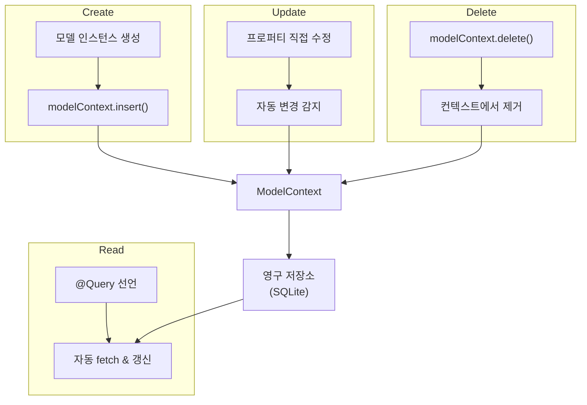
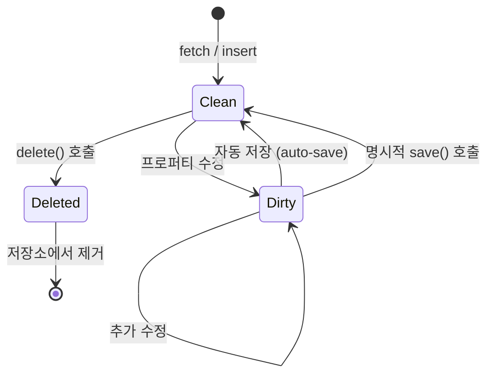
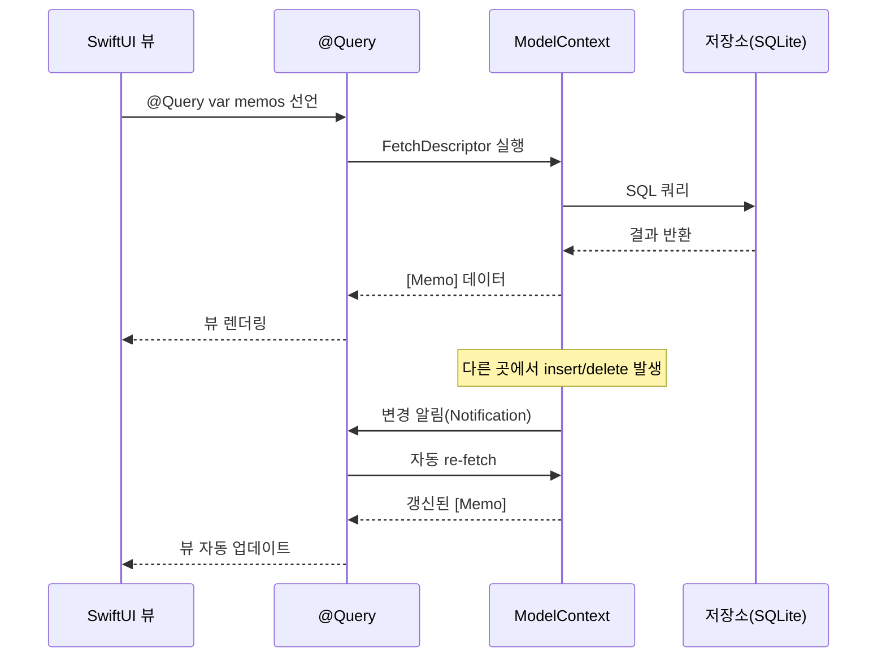

# CRUD 구현

> 데이터 생성, 읽기(@Query), 수정, 삭제

## 개요

앞서 `@Model`, `ModelContainer`, `ModelContext`의 기본을 배웠으니, 이제 실제로 데이터를 다루는 네 가지 핵심 작업 — **CRUD(Create, Read, Update, Delete)**를 본격적으로 익혀봅니다. 특히 SwiftData의 `@Query` 매크로는 Core Data의 `@FetchRequest`를 완전히 대체하는 강력한 도구인데요, SwiftUI와의 통합이 정말 매끄럽습니다.

**선수 지식**: [01. SwiftData 시작하기](./01-swiftdata-intro.md)에서 배운 `@Model`, `ModelContainer`, `ModelContext`
**학습 목표**:
- `@Query` 매크로로 데이터를 조회하고 정렬/필터링하는 방법
- `ModelContext`로 데이터를 생성, 수정, 삭제하는 방법
- SwiftData의 자동 변경 추적(dirty tracking) 원리
- `#Predicate`를 활용한 기본 필터링

## 왜 알아야 할까?

앱의 핵심은 데이터를 보여주고(Read), 사용자가 추가하고(Create), 편집하고(Update), 필요 없으면 삭제(Delete)하는 것입니다. 어떤 앱을 만들든 이 네 가지 작업은 반드시 필요하죠. SwiftData는 이 CRUD 작업을 놀라울 정도로 적은 코드로 처리할 수 있게 해주는데, 특히 `@Query`는 한 줄로 "실시간 반응형 데이터 조회"를 구현합니다.

## 핵심 개념

> 📊 **그림 1**: SwiftData CRUD 작업과 ModelContext의 역할




### 개념 1: Create — 데이터 생성

> 💡 **비유**: 도서관에 새 책을 기증하는 것과 같습니다. 책(모델 인스턴스)을 만들고, 도서관(ModelContext)에 등록하면 카탈로그에 자동으로 추가됩니다.

데이터 생성은 두 단계입니다: **인스턴스 생성** → **컨텍스트에 삽입**.

```swift
struct AddMemoView: View {
    @Environment(\.modelContext) private var modelContext
    @Environment(\.dismiss) private var dismiss
    @State private var title = ""
    @State private var content = ""

    var body: some View {
        NavigationStack {
            Form {
                TextField("제목", text: $title)
                TextEditor(text: $content)
                    .frame(minHeight: 200)
            }
            .navigationTitle("새 메모")
            .toolbar {
                ToolbarItem(placement: .confirmationAction) {
                    Button("저장") {
                        // 1. 모델 인스턴스 생성
                        let memo = Memo(title: title, content: content)
                        // 2. 컨텍스트에 삽입 → 자동 저장!
                        modelContext.insert(memo)
                        dismiss()
                    }
                    .disabled(title.isEmpty)
                }
                ToolbarItem(placement: .cancellationAction) {
                    Button("취소") { dismiss() }
                }
            }
        }
    }
}
```

> 🔥 **실무 팁**: `insert()` 후에 `save()`를 명시적으로 호출하지 않아도 자동 저장됩니다. 하지만 사용자에게 "저장 완료" 피드백을 주는 시점에 `try modelContext.save()`를 명시적으로 호출하면, 실제 저장이 보장되어 더 안전합니다.

### 개념 2: Read — @Query로 데이터 읽기

> 💡 **비유**: `@Query`는 **라이브 검색 창**과 같습니다. 일반 검색은 검색 버튼을 눌러야 결과가 나오지만, 라이브 검색은 데이터가 변할 때마다 자동으로 결과가 갱신되죠. `@Query`도 마찬가지로, 데이터가 추가·수정·삭제되면 뷰가 자동으로 업데이트됩니다.

`@Query`는 SwiftUI 프로퍼티 래퍼로, SwiftData 컨테이너에서 데이터를 가져오고 **변경사항을 실시간으로 반영**합니다.

```swift
struct MemoListView: View {
    // 가장 기본적인 @Query — 모든 Memo를 가져옴
    @Query private var memos: [Memo]

    var body: some View {
        List(memos) { memo in
            Text(memo.title)
        }
    }
}
```

#### 정렬하기 (SortDescriptor)

```swift
// 생성일 기준 최신순 정렬
@Query(sort: \Memo.createdAt, order: .reverse)
private var memos: [Memo]

// 여러 기준으로 정렬: 고정 → 최신순
@Query(sort: [
    SortDescriptor(\Memo.isPinned, order: .reverse),  // 고정된 것 먼저
    SortDescriptor(\Memo.createdAt, order: .reverse)   // 그 안에서 최신순
])
private var memos: [Memo]
```

#### 필터링하기 (#Predicate)

`#Predicate` 매크로를 사용하면 타입 안전한 필터 조건을 작성할 수 있습니다:

```swift
// 고정된 메모만 가져오기
@Query(filter: #Predicate<Memo> { memo in
    memo.isPinned == true
})
private var pinnedMemos: [Memo]

// 제목에 특정 문자열이 포함된 메모
@Query(filter: #Predicate<Memo> { memo in
    memo.title.localizedStandardContains("Swift")
})
private var swiftMemos: [Memo]
```

#### 동적 필터링

검색어가 바뀔 때마다 쿼리를 바꿔야 한다면? `init`에서 `@Query`를 동적으로 설정할 수 있습니다:

```swift
struct SearchableMemoList: View {
    @Query private var memos: [Memo]

    // 검색어에 따라 동적으로 쿼리 변경
    init(searchText: String) {
        if searchText.isEmpty {
            _memos = Query(
                sort: \Memo.createdAt,
                order: .reverse
            )
        } else {
            _memos = Query(
                filter: #Predicate<Memo> { memo in
                    memo.title.localizedStandardContains(searchText)
                },
                sort: \Memo.createdAt,
                order: .reverse
            )
        }
    }

    var body: some View {
        List(memos) { memo in
            VStack(alignment: .leading) {
                Text(memo.title).font(.headline)
                Text(memo.content)
                    .font(.subheadline)
                    .foregroundStyle(.secondary)
                    .lineLimit(1)
            }
        }
    }
}

// 부모 뷰에서 사용
struct MemoSearchView: View {
    @State private var searchText = ""

    var body: some View {
        NavigationStack {
            // searchText가 변하면 SearchableMemoList가 새 쿼리로 재생성
            SearchableMemoList(searchText: searchText)
                .searchable(text: $searchText, prompt: "메모 검색")
                .navigationTitle("메모")
        }
    }
}
```

#### FetchDescriptor로 더 세밀한 제어

`@Query` 대신 `ModelContext`에서 직접 조회할 수도 있습니다:

```swift
// 최근 메모 5개만 가져오기
var descriptor = FetchDescriptor<Memo>(
    predicate: #Predicate { $0.isPinned == false },
    sortBy: [SortDescriptor(\.createdAt, order: .reverse)]
)
descriptor.fetchLimit = 5

let recentMemos = try modelContext.fetch(descriptor)
```

### 개념 3: Update — 데이터 수정

> 💡 **비유**: SwiftData의 업데이트는 **구글 문서**처럼 작동합니다. 문서를 열고 내용을 수정하면 자동으로 저장되잖아요? SwiftData도 마찬가지입니다. 모델의 프로퍼티를 그냥 바꾸면, SwiftData가 변경을 자동으로 감지하고 저장합니다.

> 📊 **그림 3**: SwiftData 자동 변경 추적(Dirty Tracking) 원리




SwiftData의 **자동 변경 추적(dirty tracking)**은 정말 강력합니다. 모델 프로퍼티를 직접 수정하기만 하면, 별도의 "업데이트 함수" 없이 변경이 자동으로 반영됩니다:

```swift
struct MemoDetailView: View {
    // SwiftData 모델을 직접 @Bindable로 바인딩
    @Bindable var memo: Memo

    var body: some View {
        Form {
            // TextField에 직접 바인딩하면 수정 즉시 자동 반영
            TextField("제목", text: $memo.title)
            TextEditor(text: $memo.content)
                .frame(minHeight: 200)

            Toggle("고정", isOn: $memo.isPinned)

            Section("정보") {
                LabeledContent("생성일") {
                    Text(memo.createdAt, style: .date)
                }
            }
        }
        .navigationTitle("메모 편집")
    }
}
```

위 코드에서 `$memo.title`처럼 바인딩하면, 사용자가 텍스트를 수정하는 즉시 `memo.title` 프로퍼티가 변경되고, SwiftData가 이를 감지해서 자동으로 저장합니다. **update 메서드 같은 건 따로 없습니다!**

> ⚠️ **흔한 오해**: "업데이트하려면 별도의 save 메서드를 호출해야 한다" — SwiftData에서는 프로퍼티를 직접 수정하면 자동 저장됩니다. `@Model`이 각 프로퍼티에 변경 감지 코드를 주입하기 때문이에요. 이것이 Core Data의 `NSManagedObject`와 본질적으로 같은 원리지만, Swift 매크로 덕분에 훨씬 깔끔하게 작동합니다.

### 개념 4: Delete — 데이터 삭제

삭제는 `ModelContext`의 `delete()` 메서드를 사용합니다:

```swift
// 단일 항목 삭제
modelContext.delete(memo)

// SwiftUI List에서 스와이프 삭제
.onDelete { indexSet in
    for index in indexSet {
        modelContext.delete(memos[index])
    }
}
```

전체 삭제나 조건부 삭제가 필요한 경우:

```swift
// 특정 모델의 모든 데이터 삭제
try modelContext.delete(model: Memo.self)

// 조건부 삭제 — 고정되지 않은 메모만 삭제
try modelContext.delete(
    model: Memo.self,
    where: #Predicate { $0.isPinned == false }
)
```

## 실습: 완성형 메모 앱

CRUD 전체를 통합한 완성형 메모 앱입니다:

```swift
import SwiftUI
import SwiftData

// 모델 정의
@Model
class Memo {
    var title: String
    var content: String
    var createdAt: Date
    var isPinned: Bool

    init(title: String, content: String, isPinned: Bool = false) {
        self.title = title
        self.content = content
        self.createdAt = .now
        self.isPinned = isPinned
    }
}

// 메모 행 뷰
struct MemoRow: View {
    let memo: Memo

    var body: some View {
        HStack {
            VStack(alignment: .leading, spacing: 4) {
                HStack(spacing: 4) {
                    if memo.isPinned {
                        Image(systemName: "pin.fill")
                            .foregroundStyle(.orange)
                            .font(.caption)
                    }
                    Text(memo.title)
                        .font(.headline)
                        .lineLimit(1)
                }
                Text(memo.content)
                    .font(.subheadline)
                    .foregroundStyle(.secondary)
                    .lineLimit(2)
            }
            Spacer()
            Text(memo.createdAt, style: .relative)
                .font(.caption2)
                .foregroundStyle(.tertiary)
        }
        .padding(.vertical, 2)
    }
}

// 메인 목록 뷰 (Read + Delete)
struct MemoMainView: View {
    @Environment(\.modelContext) private var modelContext

    @Query(sort: [
        SortDescriptor(\Memo.isPinned, order: .reverse),
        SortDescriptor(\Memo.createdAt, order: .reverse)
    ])
    private var memos: [Memo]

    @State private var showAddSheet = false
    @State private var searchText = ""

    var body: some View {
        NavigationStack {
            List {
                ForEach(filteredMemos) { memo in
                    NavigationLink(value: memo) {
                        MemoRow(memo: memo)
                    }
                    // 왼쪽 스와이프: 고정/해제 (Update)
                    .swipeActions(edge: .leading) {
                        Button {
                            memo.isPinned.toggle()
                        } label: {
                            Label(
                                memo.isPinned ? "해제" : "고정",
                                systemImage: memo.isPinned ? "pin.slash" : "pin"
                            )
                        }
                        .tint(.orange)
                    }
                }
                .onDelete(perform: deleteMemos)
            }
            .navigationTitle("메모")
            .navigationDestination(for: Memo.self) { memo in
                MemoEditView(memo: memo)
            }
            .searchable(text: $searchText, prompt: "메모 검색")
            .toolbar {
                ToolbarItem(placement: .primaryAction) {
                    Button(action: { showAddSheet = true }) {
                        Image(systemName: "plus")
                    }
                }
            }
            .sheet(isPresented: $showAddSheet) {
                MemoAddView()
            }
            .overlay {
                if memos.isEmpty {
                    ContentUnavailableView(
                        "메모가 없습니다",
                        systemImage: "note.text",
                        description: Text("+ 버튼을 눌러 첫 메모를 추가하세요")
                    )
                }
            }
        }
    }

    private var filteredMemos: [Memo] {
        if searchText.isEmpty { return memos }
        return memos.filter {
            $0.title.localizedStandardContains(searchText) ||
            $0.content.localizedStandardContains(searchText)
        }
    }

    private func deleteMemos(at offsets: IndexSet) {
        for index in offsets {
            modelContext.delete(filteredMemos[index])
        }
    }
}

// Create 뷰
struct MemoAddView: View {
    @Environment(\.modelContext) private var modelContext
    @Environment(\.dismiss) private var dismiss
    @State private var title = ""
    @State private var content = ""

    var body: some View {
        NavigationStack {
            Form {
                TextField("제목", text: $title)
                Section("내용") {
                    TextEditor(text: $content)
                        .frame(minHeight: 150)
                }
            }
            .navigationTitle("새 메모")
            .toolbar {
                ToolbarItem(placement: .confirmationAction) {
                    Button("저장") {
                        let memo = Memo(title: title, content: content)
                        modelContext.insert(memo)
                        dismiss()
                    }
                    .disabled(title.isEmpty)
                }
                ToolbarItem(placement: .cancellationAction) {
                    Button("취소") { dismiss() }
                }
            }
        }
    }
}

// Update 뷰
struct MemoEditView: View {
    @Bindable var memo: Memo

    var body: some View {
        Form {
            TextField("제목", text: $memo.title)
            Section("내용") {
                TextEditor(text: $memo.content)
                    .frame(minHeight: 200)
            }
            Toggle("고정", isOn: $memo.isPinned)
            Section("정보") {
                LabeledContent("생성일") {
                    Text(memo.createdAt, format: .dateTime)
                }
            }
        }
        .navigationTitle("편집")
    }
}
```

```swift
// 앱 진입점
@main
struct MemoApp: App {
    var body: some Scene {
        WindowGroup {
            MemoMainView()
        }
        .modelContainer(for: Memo.self)
    }
}

#Preview {
    MemoMainView()
        .modelContainer(for: Memo.self, inMemory: true)
}
```

## 더 깊이 알아보기

### @Query의 내부 동작

> 📊 **그림 2**: @Query의 반응형 데이터 갱신 흐름




`@Query`가 어떻게 데이터 변경을 감지할까요? 내부적으로 `@Query`는:

1. `ModelContext`에서 `FetchDescriptor`를 실행하여 초기 데이터를 가져옵니다
2. SwiftData의 변경 알림을 구독하여, 삽입/수정/삭제가 발생하면 자동으로 다시 fetch합니다
3. 결과가 변경되면 SwiftUI에 알려서 뷰를 다시 렌더링합니다

이 모든 것이 `@Query` 한 줄로 이루어지니, Core Data 시절의 `NSFetchedResultsController`에 비하면 놀라운 간소화입니다.

### WWDC 2023에서의 시연

Apple은 WWDC 2023 "Meet SwiftData" 세션에서 Core Data 코드와 SwiftData 코드를 나란히 비교했습니다. `@FetchRequest`에서는 정렬, 필터, 애니메이션, 에러 핸들링을 모두 설정해야 했지만, `@Query`는 Swift 네이티브 문법으로 훨씬 직관적이었죠. 코드량이 **절반 이하**로 줄어드는 것을 보고 많은 개발자들이 환호했습니다.

## 흔한 오해와 팁

> ⚠️ **흔한 오해**: "`@Query`는 매 프레임마다 데이터베이스를 조회한다" — 아닙니다! `@Query`는 데이터가 **실제로 변경되었을 때만** 다시 fetch합니다. SwiftData가 변경 알림(notification) 기반으로 동작하기 때문에 성능 걱정은 불필요합니다.

> 🔥 **실무 팁**: `#Predicate`에서 사용할 수 있는 연산은 제한이 있습니다. Swift의 모든 메서드를 쓸 수 있는 게 아니라, SwiftData가 SQL로 변환 가능한 것만 지원해요. `localizedStandardContains`, `==`, `!=`, `>`, `<`, `&&`, `||` 등은 되지만, 커스텀 함수 호출은 안 됩니다.

> 💡 **알고 계셨나요?**: `@Query`에 `animation` 파라미터를 추가하면 데이터 변경 시 리스트 애니메이션이 자동 적용됩니다 — `@Query(sort: \Memo.createdAt, animation: .smooth) private var memos: [Memo]`

## 핵심 정리

| 작업 | 코드 | 설명 |
|------|------|------|
| Create | `modelContext.insert(item)` | 새 모델 인스턴스를 컨텍스트에 삽입 |
| Read | `@Query var items: [Item]` | 선언형 데이터 조회, 변경 시 자동 갱신 |
| Update | `item.name = "새 이름"` | 프로퍼티 직접 수정, 자동 변경 감지 |
| Delete | `modelContext.delete(item)` | 컨텍스트에서 삭제 |
| 정렬 | `SortDescriptor(\Item.name)` | `@Query`의 `sort` 파라미터에 전달 |
| 필터 | `#Predicate { $0.isActive }` | `@Query`의 `filter` 파라미터에 전달 |
| 일괄 삭제 | `modelContext.delete(model:where:)` | 조건에 맞는 데이터 일괄 삭제 |

## 다음 섹션 미리보기

단일 모델의 CRUD를 마스터했으니, 다음은 모델 간의 **관계(Relationship)**와 더 복잡한 쿼리를 다룹니다. 메모에 태그를 붙이거나, 폴더로 분류하는 것처럼 모델끼리 연결하는 방법을 [03. 관계와 고급 쿼리](./03-relationships-query.md)에서 알아봅시다.

## 참고 자료

- [Apple SwiftData 공식 문서 - ModelContext](https://developer.apple.com/documentation/swiftdata/modelcontext) - CRUD 메서드 전체 레퍼런스
- [Meet SwiftData - WWDC23](https://developer.apple.com/videos/play/wwdc2023/10187/) - SwiftData 소개와 CRUD 시연
- [Hacking with Swift - SwiftData CRUD](https://www.hackingwithswift.com/quick-start/swiftdata/how-to-save-a-swiftdata-object) - 실전 CRUD 튜토리얼
- [Fatbobman - Practical SwiftData](https://fatbobman.com/en/posts/practical-swiftdata-building-swiftui-applications-with-modern-approaches/) - SwiftData 실전 가이드
