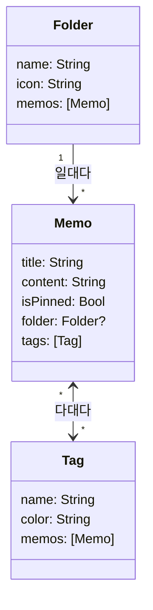
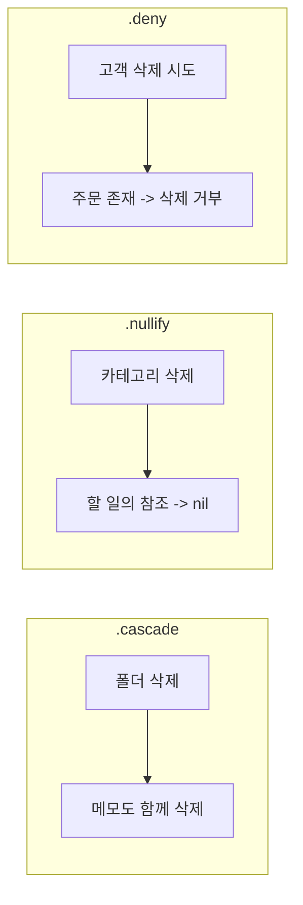
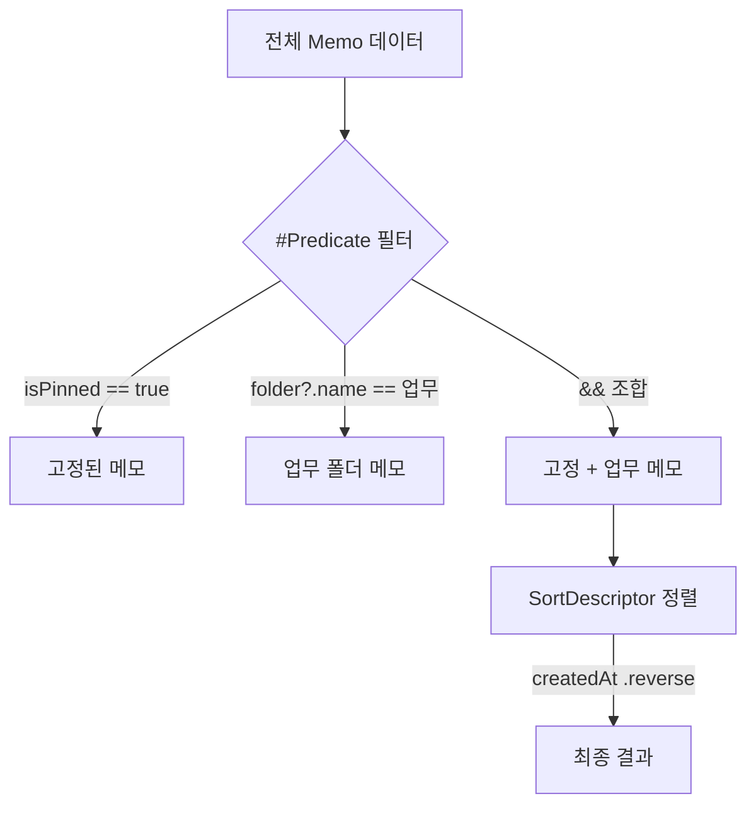
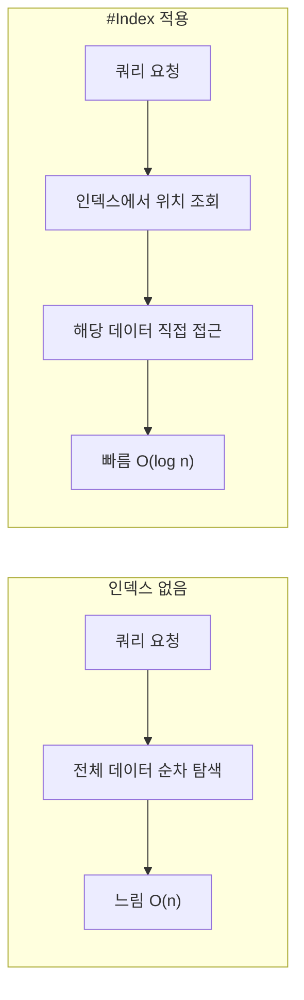

# 관계와 고급 쿼리

> @Relationship, Predicate, SortDescriptor, 필터링

## 개요

현실의 데이터는 혼자 존재하지 않습니다. 메모에는 태그가 붙고, 폴더에는 여러 메모가 담기고, 사용자에게는 여러 프로젝트가 있죠. 이렇게 **모델 간의 연결**을 다루는 것이 "관계(Relationship)"입니다. 이번 섹션에서는 `@Relationship`으로 모델을 연결하고, `#Predicate`와 `SortDescriptor`로 더 정교한 쿼리를 작성하는 방법을 배웁니다.

> 📊 **그림 1**: Folder-Memo-Tag 관계 구조 전체도




**선수 지식**: [02. CRUD 구현](./02-crud.md)에서 배운 `@Query`, `#Predicate` 기초
**학습 목표**:
- 일대다(one-to-many), 다대다(many-to-many) 관계를 설정하는 방법
- `@Relationship`의 삭제 규칙(delete rule)과 역관계(inverse) 이해
- `#Predicate`로 복합 조건 필터링
- `#Index`와 `#Unique` 매크로로 쿼리 성능 최적화

## 왜 알아야 할까?

단일 모델만으로는 실제 앱을 만들기 어렵습니다. 할 일 앱에서 "할 일"과 "카테고리"의 관계, 쇼핑 앱에서 "주문"과 "상품"의 관계, 노트 앱에서 "폴더"와 "노트"의 관계... 모든 앱은 모델 간의 관계를 필요로 합니다. SwiftData는 이런 관계를 Swift 코드로 자연스럽게 표현할 수 있게 해줍니다.

## 핵심 개념

### 개념 1: 일대다 관계 (One-to-Many)

> 💡 **비유**: 일대다 관계는 **폴더와 파일**의 관계입니다. 하나의 폴더에 여러 파일이 들어갈 수 있지만, 각 파일은 하나의 폴더에만 속하죠.

가장 흔한 관계 패턴입니다. "한 폴더에 여러 메모"를 예로 들어볼게요:

```swift
import SwiftData

// "하나"쪽: 폴더
@Model
class Folder {
    var name: String
    var icon: String
    var createdAt: Date

    // 이 폴더에 속한 메모들 (일대다)
    // 폴더를 삭제하면 안의 메모도 함께 삭제 (.cascade)
    @Relationship(deleteRule: .cascade, inverse: \Memo.folder)
    var memos: [Memo] = []

    init(name: String, icon: String = "folder") {
        self.name = name
        self.icon = icon
        self.createdAt = .now
    }
}

// "다"쪽: 메모
@Model
class Memo {
    var title: String
    var content: String
    var createdAt: Date
    var isPinned: Bool

    // 이 메모가 속한 폴더 (옵셔널 — 폴더 없는 메모도 가능)
    var folder: Folder?

    init(title: String, content: String, folder: Folder? = nil) {
        self.title = title
        self.content = content
        self.createdAt = .now
        self.isPinned = false
        self.folder = folder
    }
}
```

사용법은 일반 Swift 코드와 동일합니다:

```swift
// 폴더 생성
let workFolder = Folder(name: "업무", icon: "briefcase")
modelContext.insert(workFolder)

// 메모를 폴더에 추가하는 방법 1: 메모 생성 시 폴더 지정
let memo1 = Memo(title: "회의록", content: "...", folder: workFolder)
modelContext.insert(memo1)

// 방법 2: 폴더의 배열에 직접 추가
let memo2 = Memo(title: "주간 보고", content: "...")
modelContext.insert(memo2)
workFolder.memos.append(memo2)  // 양쪽 관계가 자동으로 설정됨
```

#### 삭제 규칙 (Delete Rule)

> 📊 **그림 2**: 삭제 규칙(Delete Rule)별 동작 비교




`@Relationship`의 `deleteRule`은 부모가 삭제될 때 자식들을 어떻게 처리할지 결정합니다:

| 규칙 | 동작 | 사용 시나리오 |
|------|------|--------------|
| `.cascade` | 부모 삭제 시 자식도 함께 삭제 | 폴더 삭제 시 안의 메모도 삭제 |
| `.nullify` | 부모 삭제 시 자식의 참조를 nil로 설정 | 카테고리 삭제 시 할 일은 유지 (기본값) |
| `.deny` | 자식이 있으면 부모 삭제 거부 | 주문이 있는 고객은 삭제 불가 |
| `.noAction` | 아무 것도 안 함 (직접 관리) | 특수한 경우만 사용 |

> ⚠️ **흔한 오해**: "역관계(inverse)를 설정하지 않아도 된다" — 양쪽이 모두 Optional일 때는 SwiftData가 자동으로 역관계를 추론하지만, **한쪽이 Non-optional이면 반드시 `inverse`를 명시**해야 합니다. 명시하지 않으면 런타임 에러가 발생할 수 있습니다.

### 개념 2: 다대다 관계 (Many-to-Many)

> 💡 **비유**: 다대다 관계는 **학생과 수업**의 관계입니다. 한 학생이 여러 수업을 듣고, 한 수업에 여러 학생이 있죠.

메모에 태그를 붙이는 기능을 예로 들어봅시다. 하나의 메모에 여러 태그, 하나의 태그에 여러 메모가 연결됩니다:

```swift
@Model
class Tag {
    var name: String
    var color: String

    // 이 태그가 달린 메모들
    var memos: [Memo] = []

    init(name: String, color: String = "blue") {
        self.name = name
        self.color = color
    }
}

@Model
class Memo {
    var title: String
    var content: String
    var createdAt: Date

    var folder: Folder?

    // 이 메모에 달린 태그들 (다대다)
    @Relationship(inverse: \Tag.memos)
    var tags: [Tag] = []

    init(title: String, content: String) {
        self.title = title
        self.content = content
        self.createdAt = .now
    }
}
```

```swift
// 태그 생성
let swiftTag = Tag(name: "Swift", color: "orange")
let uiTag = Tag(name: "SwiftUI", color: "blue")
modelContext.insert(swiftTag)
modelContext.insert(uiTag)

// 메모에 태그 추가
let memo = Memo(title: "SwiftUI 정리", content: "...")
modelContext.insert(memo)
memo.tags.append(contentsOf: [swiftTag, uiTag])
```

> 🔥 **실무 팁**: 다대다 관계에서 태그를 하나씩 `append`하는 것보다, `append(contentsOf:)`로 한꺼번에 추가하는 것이 **수십 배** 빠릅니다. SwiftData 내부에서 배열 변경마다 관계 동기화가 일어나기 때문이에요.

### 개념 3: #Predicate 복합 조건

> 📊 **그림 3**: #Predicate 복합 조건 쿼리 흐름




이전 섹션에서 기본 `#Predicate`를 배웠는데, 여러 조건을 조합하면 더 강력한 쿼리를 만들 수 있습니다:

```swift
// AND 조건: 고정되었고 + 특정 폴더에 속한 메모
@Query(filter: #Predicate<Memo> { memo in
    memo.isPinned == true && memo.folder?.name == "업무"
})
private var pinnedWorkMemos: [Memo]

// OR 조건: 제목 또는 내용에 검색어 포함
let searchText = "Swift"
let predicate = #Predicate<Memo> { memo in
    memo.title.localizedStandardContains(searchText) ||
    memo.content.localizedStandardContains(searchText)
}

// 날짜 범위 필터
let oneWeekAgo = Calendar.current.date(byAdding: .day, value: -7, to: .now)!
@Query(filter: #Predicate<Memo> { memo in
    memo.createdAt >= oneWeekAgo
})
private var recentMemos: [Memo]
```

#### iOS 17.4+: Predicate 조합

iOS 17.4부터 `#Predicate` 안에서 다른 Predicate의 `evaluate()`를 호출할 수 있습니다:

```swift
// 기본 필터를 미리 정의
let pinnedFilter = #Predicate<Memo> { $0.isPinned == true }
let recentFilter = #Predicate<Memo> { $0.createdAt >= oneWeekAgo }

// 조합: 고정된 것 OR 최근 것
let combinedFilter = #Predicate<Memo> { memo in
    pinnedFilter.evaluate(memo) || recentFilter.evaluate(memo)
}
```

### 개념 4: #Index와 #Unique (WWDC 2024)

WWDC 2024에서 추가된 매크로로, 쿼리 성능을 크게 향상시킬 수 있습니다.

> 📊 **그림 4**: 인덱스 유무에 따른 쿼리 탐색 비교




#### #Index — 자주 검색하는 프로퍼티에 인덱스 추가

```swift
@Model
class Memo {
    var title: String
    var content: String
    var createdAt: Date
    var isPinned: Bool
    var folder: Folder?
    var tags: [Tag] = []

    init(title: String, content: String) {
        self.title = title
        self.content = content
        self.createdAt = .now
        self.isPinned = false
    }
}

// 모델 외부에서 인덱스 선언
// createdAt으로 자주 정렬/필터하므로 인덱스 추가
extension Memo {
    static let indexes: [[IndexColumn<Memo>]] = [
        [.init(\.createdAt)],
        [.init(\.isPinned), .init(\.createdAt)]  // 복합 인덱스
    ]
}
```

> 💡 **알고 계셨나요?**: 데이터베이스 인덱스는 책의 색인과 같습니다. 색인이 없으면 원하는 내용을 찾기 위해 책 전체를 넘겨야 하지만, 색인이 있으면 바로 해당 페이지로 갈 수 있죠. 데이터가 수천 개 이상일 때 인덱스의 효과가 극적으로 나타납니다.

#### #Unique — 유니크 제약 조건

```swift
@Model
class Tag {
    // 같은 이름의 태그가 중복 생성되지 않도록
    @Attribute(.unique) var name: String
    var color: String
    var memos: [Memo] = []

    init(name: String, color: String = "blue") {
        self.name = name
        self.color = color
    }
}
```

`.unique`로 지정된 프로퍼티에 같은 값을 가진 모델을 `insert`하면, 새로 생성하지 않고 **기존 데이터를 업데이트**합니다 (upsert 동작).

## 실습: 폴더와 태그가 있는 메모 앱

관계를 활용한 더 완성도 높은 메모 앱을 만들어봅시다:

```swift
import SwiftUI
import SwiftData

// 모델 정의
@Model
class Folder {
    var name: String
    var icon: String
    var createdAt: Date

    @Relationship(deleteRule: .nullify, inverse: \Memo.folder)
    var memos: [Memo] = []

    init(name: String, icon: String = "folder") {
        self.name = name
        self.icon = icon
        self.createdAt = .now
    }
}

@Model
class Tag {
    @Attribute(.unique) var name: String
    var color: String
    var memos: [Memo] = []

    init(name: String, color: String = "blue") {
        self.name = name
        self.color = color
    }
}

@Model
class Memo {
    var title: String
    var content: String
    var createdAt: Date
    var isPinned: Bool
    var folder: Folder?

    @Relationship(inverse: \Tag.memos)
    var tags: [Tag] = []

    init(title: String, content: String, folder: Folder? = nil) {
        self.title = title
        self.content = content
        self.createdAt = .now
        self.isPinned = false
        self.folder = folder
    }
}

// 폴더별 메모 보기
struct FolderListView: View {
    @Environment(\.modelContext) private var modelContext
    @Query(sort: \Folder.name) private var folders: [Folder]
    @Query private var allMemos: [Memo]
    @State private var showAddFolder = false

    var body: some View {
        NavigationStack {
            List {
                // "전체" 섹션
                NavigationLink {
                    AllMemosView()
                } label: {
                    Label("전체 메모", systemImage: "tray.full")
                        .badge(allMemos.count)
                }

                // 미분류 메모
                NavigationLink {
                    UncategorizedMemosView()
                } label: {
                    Label("미분류", systemImage: "tray")
                        .badge(allMemos.filter { $0.folder == nil }.count)
                }

                // 폴더 목록
                Section("폴더") {
                    ForEach(folders) { folder in
                        NavigationLink {
                            FolderMemosView(folder: folder)
                        } label: {
                            Label(folder.name, systemImage: folder.icon)
                                .badge(folder.memos.count)
                        }
                    }
                    .onDelete { indexSet in
                        for index in indexSet {
                            modelContext.delete(folders[index])
                        }
                    }
                }
            }
            .navigationTitle("메모")
            .toolbar {
                Button("폴더 추가", systemImage: "folder.badge.plus") {
                    showAddFolder = true
                }
            }
            .alert("새 폴더", isPresented: $showAddFolder) {
                AddFolderAlert()
            }
        }
    }
}

// 특정 폴더의 메모 목록
struct FolderMemosView: View {
    let folder: Folder

    @Query private var memos: [Memo]

    init(folder: Folder) {
        self.folder = folder
        let folderName = folder.name
        _memos = Query(
            filter: #Predicate<Memo> {
                $0.folder?.name == folderName
            },
            sort: [
                SortDescriptor(\Memo.isPinned, order: .reverse),
                SortDescriptor(\Memo.createdAt, order: .reverse)
            ]
        )
    }

    var body: some View {
        List(memos) { memo in
            VStack(alignment: .leading) {
                Text(memo.title).font(.headline)
                // 태그 표시
                if !memo.tags.isEmpty {
                    HStack(spacing: 4) {
                        ForEach(memo.tags) { tag in
                            Text(tag.name)
                                .font(.caption2)
                                .padding(.horizontal, 6)
                                .padding(.vertical, 2)
                                .background(.blue.opacity(0.15))
                                .clipShape(Capsule())
                        }
                    }
                }
            }
        }
        .navigationTitle(folder.name)
    }
}
```

```swift
// 미분류 메모 뷰
struct UncategorizedMemosView: View {
    @Query(filter: #Predicate<Memo> { $0.folder == nil },
           sort: \Memo.createdAt, order: .reverse)
    private var memos: [Memo]

    var body: some View {
        List(memos) { memo in
            Text(memo.title)
        }
        .navigationTitle("미분류")
    }
}

// 전체 메모 뷰
struct AllMemosView: View {
    @Query(sort: [
        SortDescriptor(\Memo.isPinned, order: .reverse),
        SortDescriptor(\Memo.createdAt, order: .reverse)
    ])
    private var memos: [Memo]

    var body: some View {
        List(memos) { memo in
            VStack(alignment: .leading, spacing: 4) {
                Text(memo.title).font(.headline)
                if let folder = memo.folder {
                    Label(folder.name, systemImage: folder.icon)
                        .font(.caption)
                        .foregroundStyle(.secondary)
                }
            }
        }
        .navigationTitle("전체 메모")
    }
}

// 폴더 추가 Alert용 뷰
struct AddFolderAlert: View {
    @Environment(\.modelContext) private var modelContext
    @State private var folderName = ""

    var body: some View {
        TextField("폴더 이름", text: $folderName)
        Button("추가") {
            guard !folderName.isEmpty else { return }
            let folder = Folder(name: folderName)
            modelContext.insert(folder)
        }
        Button("취소", role: .cancel) {}
    }
}
```

## 더 깊이 알아보기

### iOS 26: 모델 상속 (Model Inheritance)

WWDC 2025에서 SwiftData에 **모델 상속**이 추가되었습니다. 공통 프로퍼티를 가진 모델들을 상속 관계로 표현할 수 있어요:

```swift
// 기본 이벤트 클래스
@Model
class Event {
    var title: String
    var scheduledDate: Date
    var duration: TimeInterval

    init(title: String, scheduledDate: Date, duration: TimeInterval) {
        self.title = title
        self.scheduledDate = scheduledDate
        self.duration = duration
    }
}

// 업무 이벤트 (iOS 26+)
@available(iOS 26, *)
@Model
class WorkEvent: Event {
    var budget: Decimal = 0.0
    var departmentCode: String = ""
}

// 소셜 이벤트 (iOS 26+)
@available(iOS 26, *)
@Model
class SocialEvent: Event {
    var guestCount: Int = 0
}
```

> 💡 **알고 계셨나요?**: SwiftData의 모델 상속은 Apple 개발자 커뮤니티에서 가장 요청이 많았던 기능 중 하나였습니다. Core Data는 처음부터 엔티티 상속을 지원했지만, SwiftData 초기 버전(iOS 17)에서는 빠져 있었거든요. WWDC 2025에서 드디어 추가되면서 데이터 모델링의 유연성이 크게 높아졌습니다.

### 관계 성능 최적화

관계가 많은 모델을 다룰 때 알아두면 좋은 팁입니다:

- **Lazy Loading**: SwiftData는 기본적으로 관계를 **지연 로드**합니다. `folder.memos`에 접근할 때 비로소 메모 데이터를 불러옵니다
- **Batch Append**: 배열에 여러 항목을 추가할 때 `append(contentsOf:)`가 개별 `append`보다 30배 이상 빠릅니다
- **fetchLimit**: 모든 데이터가 필요하지 않다면 `FetchDescriptor`의 `fetchLimit`으로 가져오는 양을 제한하세요

## 흔한 오해와 팁

> ⚠️ **흔한 오해**: "관계 프로퍼티에 기본값으로 새 인스턴스를 넣을 수 있다" — `var folder: Folder = Folder(name: "기본")`처럼 작성하면 **컴파일은 되지만 런타임에 크래시**합니다. "Failed to find any currently loaded container for Folder" 에러가 발생해요. 관계 프로퍼티의 기본값은 항상 `nil`(옵셔널) 또는 빈 배열(`[]`)을 사용하세요.

> 🔥 **실무 팁**: CloudKit 동기화를 계획하고 있다면, 모든 관계를 **Optional**로 선언하고 `.unique` 속성은 사용하지 마세요. CloudKit은 기기 간 유니크 제약을 지원하지 않습니다 (Ch6-05에서 자세히 다룸).

> ⚠️ **흔한 오해**: "`#Predicate` 안에서 관계를 타고 들어가면 항상 잘 된다" — `#Predicate`에서 옵셔널 관계를 탐색할 때는 옵셔널 체이닝(`?.`)을 반드시 사용해야 합니다. `$0.folder.name`이 아니라 `$0.folder?.name`이에요.

## 핵심 정리

| 개념 | 설명 |
|------|------|
| 일대다 관계 | `var memos: [Memo] = []` + `var folder: Folder?` |
| 다대다 관계 | 양쪽 모두 `[Model] = []` 배열로 선언 |
| `@Relationship` | `deleteRule`, `inverse` 설정. 역관계 명시 권장 |
| Delete Rule | `.cascade` (함께 삭제), `.nullify` (참조 해제), `.deny` (삭제 거부) |
| `#Predicate` 복합 | `&&`, `||`, `?.` 조합으로 복잡한 필터 작성 |
| `#Index` | 자주 검색/정렬하는 프로퍼티에 인덱스 추가 (WWDC 2024) |
| `.unique` | 유니크 제약 — 중복 삽입 시 upsert 동작 |

## 다음 섹션 미리보기

관계와 고급 쿼리를 마스터했다면, 앱이 업데이트될 때 기존 데이터를 어떻게 유지할지가 궁금해질 겁니다. 모델 구조가 바뀌면 이전 버전의 데이터는 어떻게 되는 걸까요? [04. 마이그레이션과 버전 관리](./04-migration.md)에서 `VersionedSchema`와 `SchemaMigrationPlan`을 알아봅시다.

## 참고 자료

- [Apple SwiftData - Relationship](https://developer.apple.com/documentation/swiftdata/relationship) - @Relationship 매크로 공식 문서
- [Model your schema with SwiftData - WWDC23](https://developer.apple.com/videos/play/wwdc2023/10195/) - 관계 설정 상세 세션
- [What's new in SwiftData - WWDC24](https://developer.apple.com/videos/play/wwdc2024/10137/) - #Index, 커스텀 데이터 스토어 등
- [SwiftData: Dive into inheritance - WWDC25](https://developer.apple.com/videos/play/wwdc2025/291/) - 모델 상속
- [Fatbobman - Relationships in SwiftData](https://fatbobman.com/en/posts/relationships-in-swiftdata-changes-and-considerations/) - 관계 설정 시 주의사항 상세 가이드
