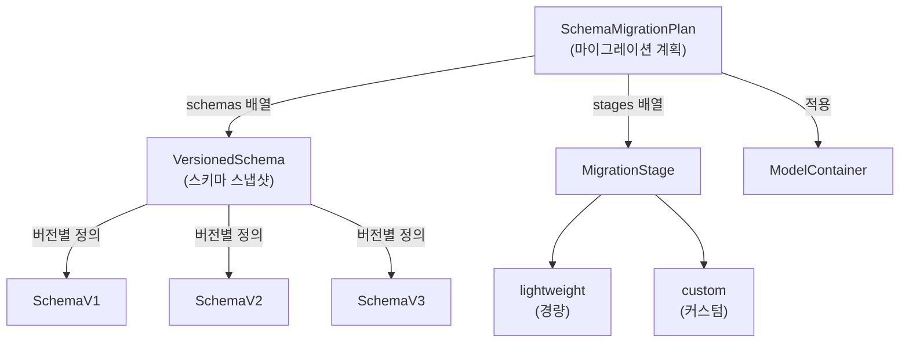
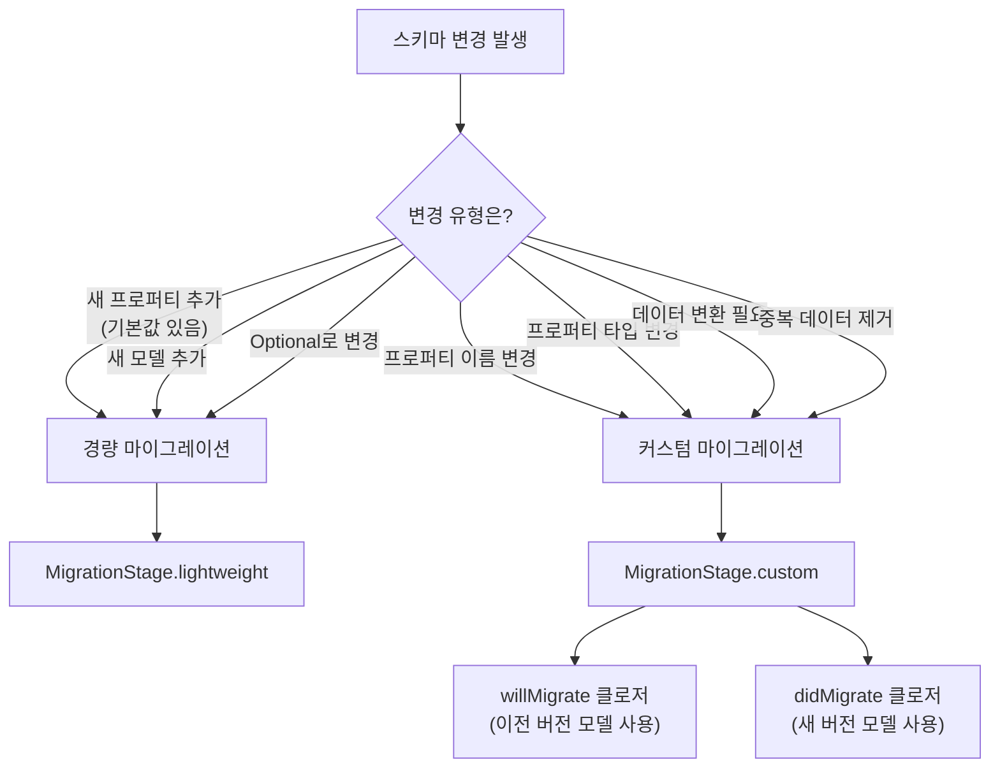
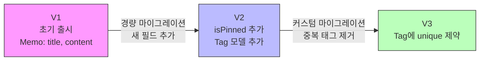

# 마이그레이션과 버전 관리

> VersionedSchema, SchemaMigrationPlan

## 개요

앱을 출시한 후 기능을 추가하거나 데이터 구조를 변경해야 할 때, 기존 사용자의 데이터는 어떻게 될까요? "앱 업데이트했더니 데이터가 다 날아갔어요"라는 리뷰는 개발자의 악몽이죠. 이번 섹션에서는 **마이그레이션(Migration)** — 스키마가 변경되어도 기존 데이터를 안전하게 유지하는 방법을 배웁니다.

**선수 지식**: [03. 관계와 고급 쿼리](./03-relationships-query.md)에서 배운 `@Model`, `@Relationship`
**학습 목표**:
- `VersionedSchema`로 스키마 버전을 정의하는 방법
- `SchemaMigrationPlan`으로 마이그레이션 계획을 수립하는 방법
- 경량(Lightweight) 마이그레이션과 커스텀(Custom) 마이그레이션의 차이
- 실전에서 안전하게 마이그레이션을 수행하는 전략

## 왜 알아야 할까?

앱이 출시되면 사용자들의 기기에 데이터가 쌓입니다. 그런데 v2.0에서 "메모에 태그 기능 추가", v3.0에서 "메모 제목을 title에서 headline으로 변경" 같은 스키마 변경이 일어나면, 이전 버전의 데이터를 새 스키마에 맞게 **변환**해야 합니다. 이 과정이 마이그레이션입니다.

마이그레이션을 제대로 하지 않으면 앱이 크래시하거나 데이터가 소실됩니다. 하지만 SwiftData는 `VersionedSchema`와 `SchemaMigrationPlan`으로 이 과정을 체계적으로 관리할 수 있게 해줍니다.

> 📊 **그림 1**: SwiftData 마이그레이션 시스템의 핵심 구성 요소




## 핵심 개념

### 개념 1: VersionedSchema — 스키마의 타임캡슐

> 💡 **비유**: `VersionedSchema`는 **타임캡슐**과 같습니다. "2024년 1월의 데이터 구조는 이랬고, 2024년 6월의 구조는 이렇게 바뀌었다"를 캡슐에 담아 보관하는 것이죠. 나중에 이전 버전에서 새 버전으로 데이터를 변환할 때, 각 시점의 구조를 정확히 알 수 있습니다.

`VersionedSchema`는 특정 시점의 데이터 모델 구조를 "스냅샷"으로 저장하는 프로토콜입니다:

```swift
import SwiftData

// 버전 1: 초기 출시
enum MemoSchemaV1: VersionedSchema {
    // 버전 식별자 (Major.Minor.Patch)
    static var versionIdentifier = Schema.Version(1, 0, 0)

    // 이 버전에 포함된 모든 모델
    static var models: [any PersistentModel.Type] {
        [Memo.self]
    }

    // 버전 1의 Memo 모델 정의
    @Model
    class Memo {
        var title: String
        var content: String
        var createdAt: Date

        init(title: String, content: String) {
            self.title = title
            self.content = content
            self.createdAt = .now
        }
    }
}
```

앱이 업데이트되어 새 필드가 추가된다면:

```swift
// 버전 2: 고정(pin) 기능과 태그 추가
enum MemoSchemaV2: VersionedSchema {
    static var versionIdentifier = Schema.Version(2, 0, 0)

    static var models: [any PersistentModel.Type] {
        [Memo.self, Tag.self]
    }

    @Model
    class Memo {
        var title: String
        var content: String
        var createdAt: Date
        var isPinned: Bool      // 새로 추가된 필드
        var tags: [Tag] = []    // 새로 추가된 관계

        init(title: String, content: String) {
            self.title = title
            self.content = content
            self.createdAt = .now
            self.isPinned = false
        }
    }

    @Model
    class Tag {
        @Attribute(.unique) var name: String
        var memos: [Memo] = []

        init(name: String) {
            self.name = name
        }
    }
}

// 현재 사용 중인 모델은 최신 버전을 가리킴
typealias Memo = MemoSchemaV2.Memo
typealias Tag = MemoSchemaV2.Tag
```

### 개념 2: SchemaMigrationPlan — 이사 계획서

> 💡 **비유**: `SchemaMigrationPlan`은 **이사 계획서**입니다. "1호 집(v1)에서 2호 집(v2)으로 이사할 때, 가구는 이렇게 옮기고, 새 방에는 이런 가구를 추가하고..." 하는 단계별 계획을 작성하는 것이죠.

`SchemaMigrationPlan`은 버전 간의 전환 방법을 정의합니다:

```swift
enum MemoMigrationPlan: SchemaMigrationPlan {
    // 모든 스키마 버전을 순서대로 나열
    static var schemas: [any VersionedSchema.Type] {
        [MemoSchemaV1.self, MemoSchemaV2.self]
    }

    // 각 버전 간 마이그레이션 단계
    static var stages: [MigrationStage] {
        [migrateV1toV2]
    }

    // V1 → V2: 새 필드 추가 (기본값이 있으므로 경량 마이그레이션)
    static let migrateV1toV2 = MigrationStage.lightweight(
        fromVersion: MemoSchemaV1.self,
        toVersion: MemoSchemaV2.self
    )
}
```

마이그레이션 플랜을 앱에 적용하는 방법:

```swift
@main
struct MemoApp: App {
    let container: ModelContainer

    init() {
        do {
            container = try ModelContainer(
                for: Memo.self, Tag.self,
                migrationPlan: MemoMigrationPlan.self
            )
        } catch {
            fatalError("ModelContainer 초기화 실패: \(error)")
        }
    }

    var body: some Scene {
        WindowGroup {
            MemoListView()
        }
        .modelContainer(container)
    }
}
```

### 개념 3: 경량 vs 커스텀 마이그레이션

> 📊 **그림 2**: 경량 마이그레이션 vs 커스텀 마이그레이션 판단 흐름




SwiftData는 두 종류의 마이그레이션을 지원합니다.

#### 경량 마이그레이션 (Lightweight)

**자동으로 처리 가능**한 변경에 사용합니다:

- 새 프로퍼티 추가 (기본값 필수)
- 새 모델 추가
- 프로퍼티를 Optional로 변경
- `@Attribute` 옵션 변경

```swift
// 기본값이 있는 새 프로퍼티 추가 → 경량 마이그레이션 OK
static let migrateV1toV2 = MigrationStage.lightweight(
    fromVersion: MemoSchemaV1.self,
    toVersion: MemoSchemaV2.self
)
```

#### 커스텀 마이그레이션 (Custom)

**데이터 변환 로직이 필요**한 경우에 사용합니다:

- 프로퍼티 이름 변경
- 프로퍼티 타입 변경
- 기존 데이터를 기반으로 새 프로퍼티 값 계산
- 중복 데이터 제거

```swift
// 예: V2에서 V3로 — name 필드에 unique 제약 추가 전에 중복 제거
enum MemoSchemaV3: VersionedSchema {
    static var versionIdentifier = Schema.Version(3, 0, 0)

    static var models: [any PersistentModel.Type] {
        [Memo.self, Tag.self]
    }

    // Tag에 unique 제약이 추가된 버전
    @Model
    class Tag {
        @Attribute(.unique) var name: String
        var memos: [Memo] = []

        init(name: String) {
            self.name = name
        }
    }

    // Memo는 V2와 동일...
    @Model
    class Memo {
        var title: String
        var content: String
        var createdAt: Date
        var isPinned: Bool
        var tags: [Tag] = []

        init(title: String, content: String) {
            self.title = title
            self.content = content
            self.createdAt = .now
            self.isPinned = false
        }
    }
}

// 커스텀 마이그레이션: unique 적용 전에 중복 태그 제거
static let migrateV2toV3 = MigrationStage.custom(
    fromVersion: MemoSchemaV2.self,
    toVersion: MemoSchemaV3.self,
    willMigrate: { context in
        // 마이그레이션 전에 실행되는 코드
        let tags = try context.fetch(
            FetchDescriptor<MemoSchemaV2.Tag>()
        )

        // 중복 태그 이름 찾아서 제거
        var seenNames = Set<String>()
        for tag in tags {
            if seenNames.contains(tag.name) {
                context.delete(tag)  // 중복 삭제
            }
            seenNames.insert(tag.name)
        }

        try context.save()
    },
    didMigrate: nil  // 마이그레이션 후 실행할 코드 (필요시)
)
```

> ⚠️ **흔한 오해**: "커스텀 마이그레이션의 `willMigrate`에서는 새 버전의 모델을 사용해야 한다" — 아닙니다! `willMigrate`는 마이그레이션 **전**에 실행되므로, **이전 버전(fromVersion)**의 모델 타입을 사용해서 데이터를 가져와야 합니다.

### 전체 마이그레이션 플랜 조합

> 📊 **그림 3**: V1→V2→V3 순차적 마이그레이션 흐름




여러 버전에 걸친 마이그레이션 플랜:

```swift
enum MemoMigrationPlan: SchemaMigrationPlan {
    static var schemas: [any VersionedSchema.Type] {
        [MemoSchemaV1.self, MemoSchemaV2.self, MemoSchemaV3.self]
    }

    static var stages: [MigrationStage] {
        [migrateV1toV2, migrateV2toV3]
    }

    // V1 → V2: 경량 (새 필드 추가)
    static let migrateV1toV2 = MigrationStage.lightweight(
        fromVersion: MemoSchemaV1.self,
        toVersion: MemoSchemaV2.self
    )

    // V2 → V3: 커스텀 (중복 태그 제거 후 unique 적용)
    static let migrateV2toV3 = MigrationStage.custom(
        fromVersion: MemoSchemaV2.self,
        toVersion: MemoSchemaV3.self,
        willMigrate: { context in
            // 중복 태그 제거 로직...
            let tags = try context.fetch(
                FetchDescriptor<MemoSchemaV2.Tag>()
            )
            var seenNames = Set<String>()
            for tag in tags {
                if seenNames.contains(tag.name) {
                    context.delete(tag)
                }
                seenNames.insert(tag.name)
            }
            try context.save()
        },
        didMigrate: nil
    )
}

// 최신 모델을 위한 typealias
typealias Memo = MemoSchemaV3.Memo
typealias Tag = MemoSchemaV3.Tag
```

> 🔥 **실무 팁**: V1 사용자가 V3으로 업데이트하면 SwiftData가 자동으로 V1→V2→V3 순서로 마이그레이션을 실행합니다. 중간 단계를 건너뛰지 않으므로, 각 단계가 올바르게 동작하는지 개별적으로 테스트하세요.

## 실습: 마이그레이션 테스트하기

마이그레이션이 올바르게 동작하는지 확인하는 단위 테스트를 작성해봅시다:

```swift
import XCTest
import SwiftData

final class MigrationTests: XCTestCase {

    func testV1ToV2Migration() throws {
        // 1. V1 스키마로 임시 컨테이너 생성
        let config = ModelConfiguration(isStoredInMemoryOnly: true)
        let container = try ModelContainer(
            for: MemoSchemaV1.Memo.self,
            configurations: config
        )

        // 2. V1 데이터 삽입
        let context = container.mainContext
        let memo = MemoSchemaV1.Memo(title: "테스트", content: "내용")
        context.insert(memo)
        try context.save()

        // 3. 데이터가 올바르게 저장되었는지 확인
        let fetchedMemos = try context.fetch(
            FetchDescriptor<MemoSchemaV1.Memo>()
        )
        XCTAssertEqual(fetchedMemos.count, 1)
        XCTAssertEqual(fetchedMemos.first?.title, "테스트")
    }
}
```

## 더 깊이 알아보기

### Core Data에서 SwiftData로의 마이그레이션

기존에 Core Data를 사용하던 앱을 SwiftData로 전환할 수도 있습니다. SwiftData는 내부적으로 Core Data 위에 구축되어 있으므로, 기존 `.sqlite` 파일을 그대로 읽을 수 있습니다. WWDC 2023 "Migrate to SwiftData" 세션에서 이 과정을 상세히 설명하고 있습니다.

핵심은 SwiftData의 `@Model` 클래스가 Core Data 엔티티와 **동일한 이름과 프로퍼티**를 가지면 자동으로 매핑된다는 것입니다.

### 마이그레이션 디버깅

마이그레이션이 실패하면 원인을 찾기 어려울 수 있습니다. Xcode의 실행 인자에 다음을 추가하면 더 자세한 로그를 볼 수 있습니다:

**-com.apple.CoreData.SQLDebug 1** → SQL 쿼리 로그
**-com.apple.CoreData.MigrationDebug 1** → 마이그레이션 과정 로그

> 💡 **알고 계셨나요?**: Core Data의 마이그레이션 시스템은 2005년부터 18년 넘게 발전해온 것입니다. SwiftData의 `VersionedSchema`는 Core Data의 복잡한 "매핑 모델(Mapping Model)" 시스템을 대체하기 위해 설계되었어요. Core Data에서는 GUI 에디터에서 매핑 모델을 그려야 했지만, SwiftData에서는 코드로 간결하게 표현합니다.

## 흔한 오해와 팁

> ⚠️ **흔한 오해**: "개발 중에는 마이그레이션을 신경 쓰지 않아도 된다" — 개발 중에는 시뮬레이터 앱을 삭제하면 되지만, **출시 전에 반드시 마이그레이션 전략을 세워야** 합니다. 첫 출시 버전부터 `VersionedSchema`를 설정해두면 이후 업데이트가 훨씬 수월합니다.

> 🔥 **실무 팁**: 새 프로퍼티를 추가할 때는 항상 **기본값**을 제공하세요. 기본값이 있으면 경량 마이그레이션으로 처리되어 별도의 커스텀 코드가 필요 없습니다. `var isPinned: Bool = false` 처럼요.

> ⚠️ **흔한 오해**: "프로퍼티 이름을 바꾸면 경량 마이그레이션으로 처리된다" — 아닙니다! 프로퍼티 이름 변경은 SwiftData가 "이전 프로퍼티 삭제 + 새 프로퍼티 추가"로 해석합니다. 반드시 커스텀 마이그레이션에서 데이터를 수동으로 옮겨야 합니다.

## 핵심 정리

| 개념 | 설명 |
|------|------|
| `VersionedSchema` | 특정 시점의 스키마를 정의하는 프로토콜 |
| `SchemaMigrationPlan` | 버전 간 전환 방법을 정의하는 프로토콜 |
| 경량 마이그레이션 | 기본값이 있는 새 필드 추가 등 자동 처리 가능한 변경 |
| 커스텀 마이그레이션 | `willMigrate`/`didMigrate` 클로저로 데이터 변환 로직 작성 |
| `typealias` | 최신 버전 모델을 편리하게 참조: `typealias Memo = SchemaV3.Memo` |
| 버전 순서 | `schemas` 배열에 순서대로 나열, 중간 단계를 건너뛰지 않음 |

## 다음 섹션 미리보기

데이터를 안전하게 관리하는 법을 배웠다면, 이제 그 데이터를 여러 기기에서 동기화하는 방법이 궁금해질 겁니다. SwiftData와 CloudKit의 통합으로 iCloud 동기화를 구현하는 방법을 [05. CloudKit 동기화](./05-cloudkit.md)에서 알아봅시다.

## 참고 자료

- [Model your schema with SwiftData - WWDC23](https://developer.apple.com/videos/play/wwdc2023/10195/) - VersionedSchema 소개
- [Migrate to SwiftData - WWDC23](https://developer.apple.com/videos/play/wwdc2023/10189/) - Core Data에서 SwiftData로
- [Hacking with Swift - Complex Migration](https://www.hackingwithswift.com/quick-start/swiftdata/how-to-create-a-complex-migration-using-versionedschema) - 커스텀 마이그레이션 상세 튜토리얼
- [SwiftData: Dive into inheritance and schema migration - WWDC25](https://developer.apple.com/videos/play/wwdc2025/291/) - iOS 26 마이그레이션 업데이트
- [Atomic Robot - Unauthorized Guide to Migrations](https://atomicrobot.com/blog/an-unauthorized-guide-to-swiftdata-migrations/) - 마이그레이션 실전 가이드
