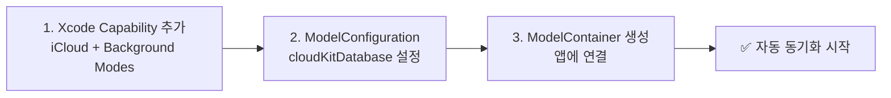
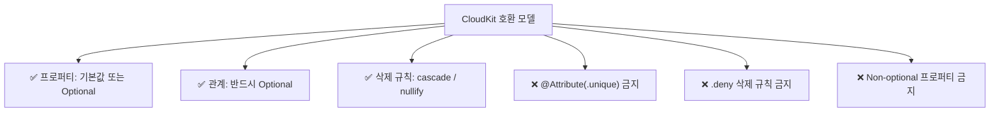
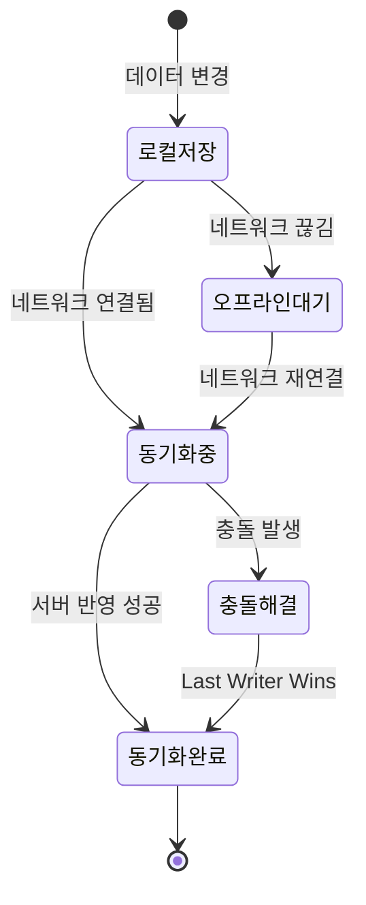
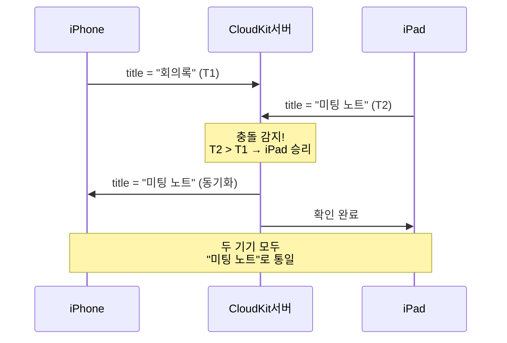

# CloudKit 동기화

> iCloud 자동 동기화, 충돌 해결, 오프라인 대응

## 개요

사용자가 iPhone에서 메모를 작성하고, iPad에서 이어서 편집하고, Mac에서 확인한다 — 이런 멀티 디바이스 경험은 현대 앱에서 거의 필수가 되었습니다. SwiftData는 Apple의 클라우드 서비스인 **CloudKit**과 자연스럽게 통합되어, 놀라울 정도로 적은 코드로 iCloud 동기화를 구현할 수 있습니다.

**선수 지식**: [04. 마이그레이션과 버전 관리](./04-migration.md)까지의 SwiftData 전체 내용
**학습 목표**:
- SwiftData에서 CloudKit 동기화를 활성화하는 방법
- CloudKit 호환을 위한 데이터 모델 설계 규칙
- 충돌 해결과 오프라인 대응 전략
- CloudKit 동기화 디버깅 방법

## 왜 알아야 할까?

Apple 생태계의 가장 큰 장점 중 하나는 기기 간 연속성입니다. 사용자들은 iCloud 동기화를 **당연하게** 기대합니다. SwiftData + CloudKit 조합을 사용하면 별도의 서버 인프라 없이, Apple이 제공하는 무료 클라우드 저장소로 동기화를 구현할 수 있습니다.

하지만 CloudKit에는 몇 가지 **엄격한 규칙**이 있어서, 이를 모르고 개발하면 동기화가 실패하거나 앱이 크래시할 수 있습니다. 미리 알고 설계하면 간단하지만, 나중에 바꾸려면 고통스럽기 때문에, Part 3 마지막에 이 내용을 다룹니다.

## 핵심 개념

### 개념 1: CloudKit 동기화 활성화

> 💡 **비유**: CloudKit 동기화를 활성화하는 것은 **구글 드라이브 자동 동기화를 켜는 것**과 비슷합니다. 스위치 하나로 켜면 파일이 자동으로 클라우드에 올라가고, 다른 기기에서도 볼 수 있죠. SwiftData + CloudKit도 설정만 해주면 나머지는 시스템이 알아서 처리합니다.

> 📊 **그림 1**: CloudKit 동기화 활성화 3단계




SwiftData에서 CloudKit을 사용하려면 세 가지 설정이 필요합니다.

#### 1단계: Xcode 프로젝트 설정

Xcode에서 프로젝트 설정 → **Signing & Capabilities** → **+ Capability**를 눌러 다음 두 가지를 추가합니다:

- **iCloud** → CloudKit 체크, 컨테이너 추가 (예: `iCloud.com.yourname.MemoApp`)
- **Background Modes** → Remote notifications 체크 (백그라운드 동기화용)

#### 2단계: ModelConfiguration 설정

```swift
import SwiftUI
import SwiftData

@main
struct MemoApp: App {
    var body: some Scene {
        WindowGroup {
            MemoListView()
        }
        .modelContainer(for: Memo.self, isAutosaveEnabled: true)
        // 기본 설정으로도 iCloud 동기화가 활성화됩니다!
    }
}
```

기본 `.modelContainer(for:)`를 사용하면 SwiftData가 자동으로 CloudKit 동기화를 활성화합니다 (프로젝트에 iCloud capability가 설정되어 있을 때). 더 세밀한 제어가 필요하면:

```swift
@main
struct MemoApp: App {
    let container: ModelContainer

    init() {
        do {
            let config = ModelConfiguration(
                "MemoStore",
                schema: Schema([Memo.self, Folder.self, Tag.self]),
                // CloudKit 동기화를 명시적으로 지정
                cloudKitDatabase: .private("iCloud.com.yourname.MemoApp")
            )
            container = try ModelContainer(
                for: Memo.self, Folder.self, Tag.self,
                configurations: config
            )
        } catch {
            fatalError("ModelContainer 초기화 실패: \(error)")
        }
    }

    var body: some Scene {
        WindowGroup {
            MemoListView()
        }
        .modelContainer(container)
    }
}
```

`cloudKitDatabase` 옵션:

| 옵션 | 설명 |
|------|------|
| `.private("containerID")` | 사용자 개인 데이터 (기본, 가장 일반적) |
| `.public("containerID")` | 모든 사용자가 읽을 수 있는 공유 데이터 |
| `.none` | CloudKit 동기화 비활성화 |

### 개념 2: CloudKit 호환 모델 설계 규칙

> 💡 **비유**: CloudKit과 함께 작동하는 모델을 설계하는 것은 **국제 택배를 보내는 것**과 비슷합니다. 국내 택배는 아무 상자나 써도 되지만, 국제 택배는 세관 규정에 맞는 포장이 필요하죠. CloudKit도 마찬가지로, 기기 간 데이터를 안전하게 전송하기 위한 "규정"이 있습니다.

> 📊 **그림 2**: CloudKit 호환 모델 설계 규칙 요약




CloudKit 동기화를 사용하려면 데이터 모델을 설계할 때 반드시 지켜야 할 규칙들이 있습니다. 이 규칙을 어기면 동기화가 실패하거나 앱이 크래시합니다:

#### 규칙 1: 모든 프로퍼티는 Optional이거나 기본값이 있어야 합니다

CloudKit은 기기 간 데이터 전송 시 일부 필드가 누락될 수 있습니다 (네트워크 지연, 부분 동기화 등). 따라서 모든 프로퍼티가 데이터 없이도 유효한 상태를 가져야 합니다:

```swift
// CloudKit 호환 모델
@Model
class Memo {
    var title: String = ""          // 기본값 제공
    var content: String = ""        // 기본값 제공
    var createdAt: Date = .now      // 기본값 제공
    var isPinned: Bool = false      // 기본값 제공
    var folder: Folder?             // Optional

    init(title: String, content: String) {
        self.title = title
        self.content = content
    }
}
```

```swift
// CloudKit 비호환! — Non-optional에 기본값 없음
@Model
class Memo {
    var title: String       // 기본값 없음 → 동기화 실패 가능!
    var content: String     // 기본값 없음

    init(title: String, content: String) {
        self.title = title
        self.content = content
    }
}
```

#### 규칙 2: `@Attribute(.unique)` 사용 금지

CloudKit은 기기 간 원자적(atomic) 유니크 검사를 지원하지 않습니다:

```swift
// CloudKit 비호환!
@Attribute(.unique) var email: String   // 다른 기기에서 같은 이메일로 생성 가능

// 대안: 앱 로직에서 중복 검사
var email: String = ""
```

#### 규칙 3: 모든 관계는 Optional이어야 합니다

```swift
// CloudKit 호환
var folder: Folder?              // Optional 관계
var tags: [Tag] = []             // 빈 배열 (실질적 Optional)

// CloudKit 비호환!
var folder: Folder               // Non-optional 관계
```

#### 규칙 4: 삭제 규칙에 `.deny` 사용 금지

```swift
// CloudKit 호환
@Relationship(deleteRule: .cascade) var memos: [Memo] = []
@Relationship(deleteRule: .nullify) var memos: [Memo] = []

// CloudKit 비호환!
@Relationship(deleteRule: .deny) var memos: [Memo] = []
```

> ⚠️ **흔한 오해**: "개발 중에는 CloudKit 규칙을 무시하고, 나중에 고치면 된다" — **절대 그렇지 않습니다!** CloudKit 스키마가 한번 프로덕션에 배포되면, 엔티티나 속성을 삭제하거나 이름을 변경할 수 없습니다. 오직 **추가만** 가능합니다. 처음부터 CloudKit 호환으로 설계하는 것이 훨씬 경제적입니다.

### 개념 3: 스키마 변경의 황금 규칙 — "추가만, 삭제/변경 절대 금지"

CloudKit 프로덕션 스키마가 배포된 후에는:

**할 수 있는 것:**
- 새 프로퍼티 추가 (기본값 필수)
- 새 모델(엔티티) 추가
- 새 관계 추가 (Optional만)

**절대 하면 안 되는 것:**
- 기존 프로퍼티 삭제 (코드에서 안 쓰더라도 모델 정의는 유지)
- 프로퍼티 이름 변경 (삭제 + 추가로 해석되어 데이터 소실)
- 프로퍼티 타입 변경 (String → Int 등)
- 엔티티 삭제

### 개념 4: 충돌 해결과 오프라인 대응

#### 오프라인 동작

> 📊 **그림 3**: 오프라인 우선 동기화 흐름




SwiftData + CloudKit은 **오프라인 우선(offline-first)**으로 동작합니다:

1. 데이터 변경은 항상 **로컬 데이터베이스에 먼저** 저장
2. 네트워크가 연결되면 **백그라운드에서 자동 동기화**
3. 네트워크가 끊겨도 앱은 정상 동작 (로컬 데이터 사용)
4. 재연결 시 밀린 변경사항을 순차적으로 동기화

#### 충돌 해결

같은 데이터를 여러 기기에서 동시에 수정하면 충돌이 발생합니다. CloudKit의 기본 전략은 **"마지막 쓰기 우선(Last Writer Wins)"**입니다:

- 서버에 먼저 도착한 변경이 저장됨
- 이후 도착한 변경과 충돌하면, 더 최근 변경이 이김
- 개별 필드 단위로 병합 (전체 레코드가 아닌 변경된 필드만)

> 📊 **그림 4**: 멀티 디바이스 충돌 해결 과정




> 🔥 **실무 팁**: 충돌을 최소화하는 가장 좋은 방법은 **모델을 잘게 나누는 것**입니다. 하나의 거대한 모델보다, 여러 작은 모델로 분리하면 같은 레코드를 동시에 수정할 확률이 줄어듭니다.

## 실습: CloudKit 호환 메모 앱

앞서 만든 메모 앱을 CloudKit 호환으로 수정해봅시다:

```swift
import SwiftUI
import SwiftData

// CloudKit 호환 모델 — 모든 프로퍼티에 기본값 설정
@Model
class Memo {
    var title: String = ""
    var content: String = ""
    var createdAt: Date = .now
    var isPinned: Bool = false

    // CloudKit: 관계는 Optional
    var folder: Folder?

    // CloudKit: .unique 사용 금지, 빈 배열로 초기화
    var tags: [Tag] = []

    init(title: String, content: String, folder: Folder? = nil) {
        self.title = title
        self.content = content
        self.folder = folder
    }
}

@Model
class Folder {
    var name: String = ""
    var icon: String = "folder"
    var createdAt: Date = .now

    // CloudKit: .deny 대신 .nullify 사용
    @Relationship(deleteRule: .nullify, inverse: \Memo.folder)
    var memos: [Memo] = []

    init(name: String, icon: String = "folder") {
        self.name = name
        self.icon = icon
    }
}

@Model
class Tag {
    // CloudKit: .unique 사용 불가! 앱 로직에서 중복 관리
    var name: String = ""
    var color: String = "blue"
    var memos: [Memo] = []

    init(name: String, color: String = "blue") {
        self.name = name
        self.color = color
    }
}

// 앱 진입점 — CloudKit 동기화 활성화
@main
struct MemoApp: App {
    let container: ModelContainer

    init() {
        do {
            let config = ModelConfiguration(
                cloudKitDatabase: .private("iCloud.com.yourname.MemoApp")
            )
            container = try ModelContainer(
                for: Memo.self, Folder.self, Tag.self,
                configurations: config
            )
        } catch {
            fatalError("ModelContainer 초기화 실패: \(error)")
        }
    }

    var body: some Scene {
        WindowGroup {
            MemoListView()
        }
        .modelContainer(container)
    }
}

// 동기화 상태 표시 (선택적)
struct SyncStatusView: View {
    @Environment(\.modelContext) private var modelContext

    var body: some View {
        HStack(spacing: 6) {
            Image(systemName: "icloud")
                .foregroundStyle(.secondary)
            Text("iCloud 동기화 활성")
                .font(.caption)
                .foregroundStyle(.secondary)
        }
    }
}
```

## 더 깊이 알아보기

### CloudKit의 역사

CloudKit은 **WWDC 2014**에서 처음 발표되었습니다. 당시 Apple은 iCloud Core Data의 불안정한 동기화 문제로 많은 비판을 받고 있었는데, CloudKit은 이를 대체하는 더 안정적인 클라우드 인프라로 설계되었습니다.

2019년 WWDC에서 `NSPersistentCloudKitContainer`가 소개되면서 Core Data + CloudKit 통합이 크게 간소화되었고, 2023년 SwiftData가 등장하면서 이 통합이 더욱 자연스러워졌습니다.

흥미로운 점은, Apple의 자체 앱들(메모, 미리 알림, Freeform 등)도 모두 CloudKit 기반으로 동기화한다는 것입니다. 우리가 쓰는 것과 동일한 인프라를 Apple 자체도 사용하고 있는 셈이에요.

### CKSyncEngine — 고급 동기화 제어

SwiftData의 자동 동기화만으로는 부족한 고급 시나리오에서는 `CKSyncEngine`(iOS 17+)을 사용할 수 있습니다. `CKSyncEngine`은 동기화의 각 단계(보내기, 받기, 충돌 해결)를 직접 제어할 수 있는 저수준 API입니다.

대부분의 앱에서는 SwiftData의 자동 동기화면 충분하지만, 다음과 같은 경우에 `CKSyncEngine`을 고려해볼 수 있습니다:
- 커스텀 충돌 해결 로직이 필요한 경우
- 동기화 진행 상태를 사용자에게 상세히 보여줘야 하는 경우
- 특정 데이터만 선택적으로 동기화해야 하는 경우

### WWDC 2024: 히스토리 추적 (History Tracking)

WWDC 2024에서 추가된 **SwiftData History**는 데이터의 변경 이력을 추적하는 기능입니다. `HistoryDescriptor`와 `HistoryTransaction`을 사용해서 "언제, 누가, 무엇을" 변경했는지 알 수 있습니다. 이는 위젯 업데이트나 앱 익스텐션과의 데이터 동기화에 특히 유용합니다.

## 흔한 오해와 팁

> ⚠️ **흔한 오해**: "CloudKit 동기화는 실시간이다" — CloudKit 동기화에는 약간의 **지연**이 있습니다 (보통 수 초에서 수십 초). 네트워크 상태, 데이터 크기, 서버 부하에 따라 달라집니다. 실시간 협업이 필요하다면 별도의 실시간 동기화 솔루션을 고려하세요.

> 🔥 **실무 팁**: CloudKit 동기화를 **시뮬레이터에서 테스트**할 때는 iCloud 계정으로 로그인해야 합니다. 시뮬레이터 → Settings → Apple Account에서 로그인하세요. 두 개의 시뮬레이터를 동시에 실행하면 동기화가 실제로 작동하는지 확인할 수 있습니다.

> 💡 **알고 계셨나요?**: CloudKit의 무료 할당량은 상당히 넉넉합니다. 각 사용자의 개인 데이터(Private Database)는 iCloud 저장 공간을 사용하지만, 개발자 앱의 Public Database는 **앱당 1PB(페타바이트)** 저장 공간과 월 10TB 전송량이 무료입니다!

## 핵심 정리

| 개념 | 설명 |
|------|------|
| CloudKit 활성화 | `ModelConfiguration(cloudKitDatabase: .private("container"))` |
| 프로퍼티 규칙 | 모든 프로퍼티에 기본값 또는 Optional 필수 |
| 관계 규칙 | 모든 관계 Optional, `.deny` 삭제 규칙 금지 |
| Unique 금지 | `@Attribute(.unique)` 사용 불가 → 앱 로직으로 대체 |
| 스키마 변경 | 프로덕션 배포 후엔 "추가만" 가능, 삭제/변경 금지 |
| 충돌 해결 | Last Writer Wins (마지막 쓰기 우선) 기본 전략 |
| 오프라인 | 로컬 우선 저장, 재연결 시 자동 동기화 |

## 다음 섹션 미리보기

Ch6. SwiftData를 모두 마쳤습니다! 데이터를 영속적으로 저장하고, CRUD로 다루고, 관계를 설정하고, 마이그레이션으로 안전하게 업데이트하고, CloudKit으로 기기 간 동기화까지 — 데이터 관리의 A to Z를 다뤘습니다.

다음 챕터에서는 앱이 외부 세계와 소통하는 방법을 배웁니다. 서버에서 데이터를 가져오고, API를 호출하는 **네트워킹**을 [Ch7. 네트워킹과 동시성](../07-networking/01-async-await.md)에서 시작합니다.

## 참고 자료

- [Apple - Syncing model data across devices](https://developer.apple.com/documentation/swiftdata/syncing-model-data-across-a-persons-devices) - 공식 CloudKit + SwiftData 가이드
- [Track model changes with SwiftData history - WWDC24](https://developer.apple.com/videos/play/wwdc2024/10075/) - 히스토리 추적 세션
- [Fatbobman - Rules for Adapting Data Models to CloudKit](https://fatbobman.com/en/snippet/rules-for-adapting-data-models-to-cloudkit/) - CloudKit 모델 설계 규칙 상세 가이드
- [Fatbobman - Key Considerations Before Using SwiftData](https://fatbobman.com/en/posts/key-considerations-before-using-swiftdata/) - SwiftData 사용 전 고려사항
- [Superwall - CKSyncEngine Guide](https://superwall.com/blog/syncing-data-with-cloudkit-in-your-ios-app-using-cksyncengine-and-swift-and-swiftui/) - CKSyncEngine 실전 가이드
