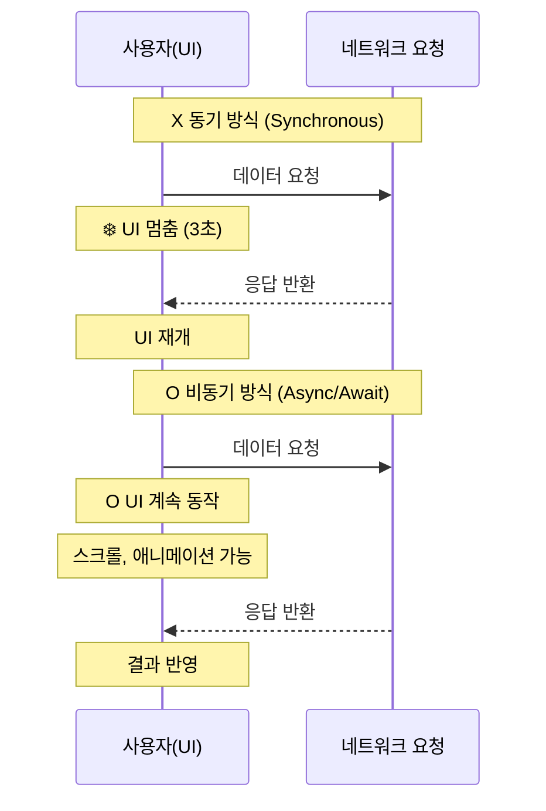
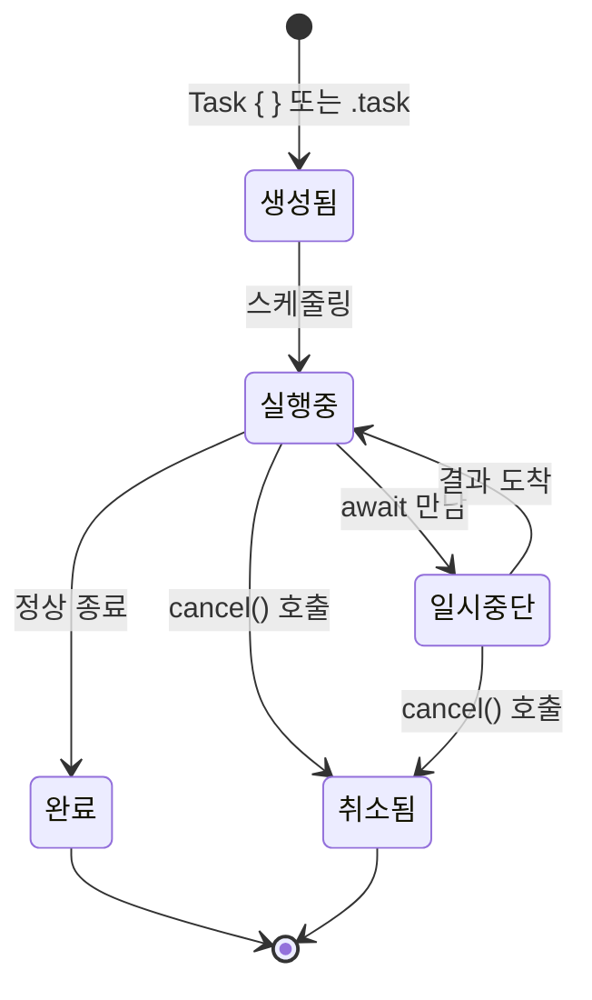
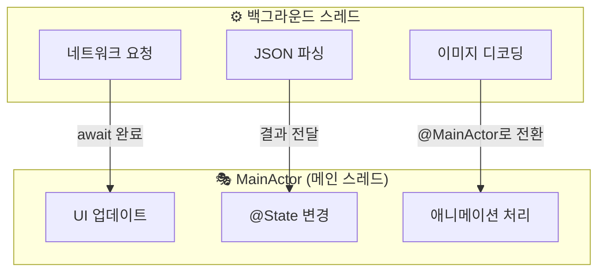

# async/await 기초

> Swift Concurrency, Task, 구조적 동시성

## 개요

지금까지 우리가 만든 앱은 데이터를 로컬에서만 다뤘습니다. 하지만 현실의 앱은 서버에서 날씨를 가져오고, 이미지를 다운로드하고, 사용자 인증을 처리하죠. 이런 **네트워크 작업**은 시간이 걸리는데, 그 동안 앱이 멈추면 안 됩니다. 이번 섹션에서는 Swift의 **async/await**를 배워서, 시간이 걸리는 작업을 우아하게 처리하는 방법을 익힙니다.

**선수 지식**: [Ch5. 상태 관리](../05-state-management/04-data-flow.md)까지의 SwiftUI 기본 지식
**학습 목표**:
- `async`/`await` 키워드의 의미와 사용법 이해
- `Task`를 사용해서 비동기 작업을 시작하는 방법
- `async let`과 `TaskGroup`으로 병렬 작업 수행
- `@MainActor`와 스레드 안전성의 기초

## 왜 알아야 할까?

앱스토어의 거의 모든 앱은 네트워크 통신을 합니다. 서버에서 데이터를 가져오고, 이미지를 다운로드하고, 파일을 업로드하죠. 이런 작업은 수 밀리초에서 수 초까지 걸릴 수 있는데, 만약 이 작업이 진행되는 동안 화면이 멈추면(frozen) 사용자는 앱이 고장났다고 생각합니다.

Swift의 `async/await`는 이 문제를 해결하는 현대적이고 안전한 방법입니다. 2021년 Swift 5.5에서 도입된 이후, iOS 개발의 **비동기 프로그래밍 표준**이 되었습니다.

## 핵심 개념

### 개념 1: 동기 vs 비동기 — 카페 주문

> 💡 **비유**: **동기(synchronous)** 작업은 카운터에서 커피가 나올 때까지 **줄 서서 기다리는 것**입니다. 내 뒤에 있는 사람들도 모두 멈춰요. **비동기(asynchronous)** 작업은 진동벨을 받고 자리에 앉아 **다른 일을 하다가**, 벨이 울리면 커피를 받아가는 것입니다. 줄은 계속 진행되죠.

> 📊 **그림 1**: 동기 vs 비동기 실행 흐름 비교




```swift
// 동기 함수 — 결과가 올 때까지 멈춤 (앱이 얼어버림!)
func fetchDataSync() -> Data {
    // 네트워크 요청... 3초 대기...
    // 이 동안 UI가 완전히 멈춤
    return data
}

// 비동기 함수 — await 지점에서 다른 일을 할 수 있음
func fetchData() async -> Data {
    // 네트워크 요청을 보내고...
    // await: "여기서 잠깐 양보할게요, 결과 오면 다시 이어서 할게요"
    let data = await networkRequest()
    return data
}
```

`async`는 "이 함수는 비동기적으로 동작할 수 있습니다"라는 선언이고, `await`는 "여기서 결과를 기다립니다 — 하지만 그동안 다른 일이 진행될 수 있어요"라는 표시입니다.

### 개념 2: async/await 기본 문법

비동기 함수를 선언하고 호출하는 방법:

```run:swift
// 1. async 함수 선언 — 반환 타입 앞에 async 키워드
func fetchUserName() async -> String {
    // 시간이 걸리는 작업을 시뮬레이션
    try? await Task.sleep(for: .seconds(1))
    return "김스위프트"
}

// 2. async throws 함수 — 에러를 던질 수 있는 비동기 함수
func fetchWeather(city: String) async throws -> String {
    // 실패할 수 있는 네트워크 요청
    guard city != "" else {
        throw URLError(.badURL)
    }
    try await Task.sleep(for: .seconds(1))
    return "맑음 ☀️ 22°C"
}

// 3. 호출 — await 키워드로 결과 대기
func loadProfile() async {
    let name = await fetchUserName()  // await로 기다림
    print("이름: \(name)")

    do {
        let weather = try await fetchWeather(city: "서울")  // try await
        print("날씨: \(weather)")
    } catch {
        print("날씨 조회 실패: \(error)")
    }
}
```

```output
이름: 김스위프트
날씨: 맑음 ☀️ 22°C
```

> ⚠️ **흔한 오해**: "`await`를 쓰면 스레드가 멈춘다" — 아닙니다! `await`는 현재 함수의 실행을 **일시 중단(suspend)**하지만, 해당 스레드는 **다른 작업을 계속 처리**합니다. 이것이 전통적인 `sleep()`과의 결정적 차이입니다. UI 스레드에서 `await`를 써도 화면이 멈추지 않아요.

### 개념 3: Task — 비동기 작업의 시작점

> 📊 **그림 2**: Task의 생명주기와 상태 전이




SwiftUI의 `body`나 일반 동기 함수에서는 `await`를 직접 쓸 수 없습니다. 비동기 세계로 진입하려면 `Task`가 필요합니다:

```swift
struct WeatherView: View {
    @State private var weather = "로딩 중..."

    var body: some View {
        Text(weather)
            .font(.title)
            .task {
                // .task 수정자: 뷰가 나타날 때 자동 실행,
                // 뷰가 사라지면 자동 취소
                do {
                    weather = try await fetchWeather(city: "서울")
                } catch {
                    weather = "조회 실패"
                }
            }
    }
}
```

`.task` 수정자 외에 `Task { }` 클로저로 직접 생성할 수도 있습니다:

```swift
struct ProfileView: View {
    @State private var userName = ""

    var body: some View {
        VStack {
            Text("안녕하세요, \(userName)님!")
            Button("프로필 새로고침") {
                // 버튼 탭 → Task로 비동기 작업 시작
                Task {
                    userName = await fetchUserName()
                }
            }
        }
    }
}
```

#### Task 취소

`Task`는 취소할 수 있습니다. `.task` 수정자는 뷰가 사라지면 자동 취소되고, 직접 생성한 Task는 `cancel()`로 취소합니다:

```swift
struct SearchView: View {
    @State private var results: [String] = []
    @State private var searchTask: Task<Void, Never>?

    func search(query: String) {
        // 이전 검색 취소
        searchTask?.cancel()

        // 새 검색 시작
        searchTask = Task {
            try? await Task.sleep(for: .milliseconds(300))  // 디바운스

            // 취소 여부 확인
            guard !Task.isCancelled else { return }

            // 검색 실행
            results = await performSearch(query)
        }
    }
}
```

> 🔥 **실무 팁**: SwiftUI에서 비동기 작업은 가능하면 `.task` 수정자를 사용하세요. 뷰 라이프사이클에 맞춰 자동으로 시작/취소되어 메모리 누수를 방지합니다. `Task { }`를 직접 쓸 때는 반드시 취소 관리를 해야 합니다.

### 개념 4: async let — 동시에 여러 작업 실행

여러 비동기 작업을 **순차적**이 아닌 **동시에** 실행하고 싶다면 `async let`을 사용합니다:

```run:swift
// 순차 실행 — 총 3초 소요
func loadSequentially() async {
    let user = await fetchUser()       // 1초
    let posts = await fetchPosts()     // 1초
    let photos = await fetchPhotos()   // 1초
    // 총 3초
}

// 동시 실행 — 총 1초 소요 (가장 느린 것 기준)
func loadConcurrently() async {
    async let user = fetchUser()       // 동시에 시작
    async let posts = fetchPosts()     // 동시에 시작
    async let photos = fetchPhotos()   // 동시에 시작

    // 모든 결과가 준비될 때까지 대기
    let (u, p, ph) = await (user, posts, photos)
    print("유저: \(u), 게시물: \(p.count)개, 사진: \(ph.count)장")
}
```

```output
유저: 김스위프트, 게시물: 3개, 사진: 2장
```

> 💡 **비유**: 순차 실행은 라면 끓이고 → 밥 짓고 → 반찬 준비하는 것. `async let`은 라면, 밥, 반찬을 **동시에** 시작해서 모두 준비되면 식사하는 것입니다. 당연히 후자가 훨씬 빠르죠!

> 📊 **그림 3**: 순차 실행 vs async let 동시 실행 시간 비교

```mermaid
gantt
    title 실행 시간 비교
    dateFormat X
    axisFormat %s초

    section 순차 실행 (3초)
    fetchUser()    :a1, 0, 1
    fetchPosts()   :a2, after a1, 1
    fetchPhotos()  :a3, after a2, 1

    section async let (1초)
    fetchUser()    :b1, 0, 1
    fetchPosts()   :b2, 0, 1
    fetchPhotos()  :b3, 0, 1
```




### 개념 5: @MainActor — UI 업데이트의 안전장치

> 💡 **비유**: `@MainActor`는 **극장의 무대**와 같습니다. 배우(코드)가 무대(메인 스레드)에서만 연기(UI 업데이트)를 해야 관객(사용자)이 제대로 볼 수 있어요. 백스테이지(백그라운드 스레드)에서 하면 관객에게 보이지 않거나 혼란이 생깁니다.

> 📊 **그림 4**: @MainActor와 스레드 간 작업 분리




SwiftUI의 모든 뷰 업데이트는 **메인 스레드**에서 일어나야 합니다. `@MainActor`는 이를 보장해주는 어노테이션입니다:

```swift
// @Observable 클래스에서 @MainActor 사용
@MainActor
@Observable
class WeatherViewModel {
    var temperature = "--"
    var isLoading = false
    var errorMessage: String?

    func loadWeather() async {
        isLoading = true         // UI 업데이트 → 메인 스레드에서 안전하게
        defer { isLoading = false }

        do {
            let weather = try await fetchWeather(city: "서울")
            temperature = weather  // 메인 스레드에서 실행됨
        } catch {
            errorMessage = error.localizedDescription
        }
    }
}

struct WeatherView: View {
    @State private var viewModel = WeatherViewModel()

    var body: some View {
        VStack(spacing: 16) {
            if viewModel.isLoading {
                ProgressView("날씨 조회 중...")
            } else {
                Text(viewModel.temperature)
                    .font(.largeTitle)
            }

            if let error = viewModel.errorMessage {
                Text(error)
                    .foregroundStyle(.red)
                    .font(.caption)
            }
        }
        .task {
            await viewModel.loadWeather()
        }
    }
}
```

> 💡 **알고 계셨나요?**: Swift 6.2 (Xcode 26)에서는 **"Approachable Concurrency"** 개념이 도입되어, `@MainActor`가 더 많은 코드에 기본 적용됩니다. 이전에는 `@MainActor`를 명시적으로 붙여야 했지만, 새로운 모드에서는 UI 관련 코드가 기본적으로 메인 액터에서 실행됩니다. 백그라운드에서 실행해야 하는 무거운 작업에만 `nonisolated`를 명시하면 됩니다.

## 실습: 비동기 프로필 로더

async/await의 핵심 패턴을 모두 활용한 프로필 로딩 화면을 만들어봅시다:

```swift
import SwiftUI

// 모델
struct UserProfile {
    let name: String
    let bio: String
    let followerCount: Int
}

// 비동기 데이터 로드 함수 (시뮬레이션)
func fetchProfile() async throws -> UserProfile {
    // 네트워크 지연 시뮬레이션
    try await Task.sleep(for: .seconds(1))
    return UserProfile(
        name: "김스위프트",
        bio: "iOS 개발자 | Swift 마스터",
        followerCount: 1234
    )
}

func fetchRecentPosts() async throws -> [String] {
    try await Task.sleep(for: .milliseconds(800))
    return ["SwiftUI 팁 공유", "async/await 정리", "SwiftData 튜토리얼"]
}

// 뷰 모델
@MainActor
@Observable
class ProfileViewModel {
    var profile: UserProfile?
    var posts: [String] = []
    var isLoading = false
    var errorMessage: String?

    func load() async {
        isLoading = true
        errorMessage = nil
        defer { isLoading = false }

        do {
            // async let으로 동시 로드
            async let profileResult = fetchProfile()
            async let postsResult = fetchRecentPosts()

            // 둘 다 완료될 때까지 대기
            profile = try await profileResult
            posts = try await postsResult
        } catch {
            errorMessage = "데이터를 불러올 수 없습니다: \(error.localizedDescription)"
        }
    }
}

// 뷰
struct ProfileView: View {
    @State private var viewModel = ProfileViewModel()

    var body: some View {
        NavigationStack {
            Group {
                if viewModel.isLoading {
                    ProgressView("프로필 로딩 중...")
                } else if let error = viewModel.errorMessage {
                    ContentUnavailableView {
                        Label("오류 발생", systemImage: "exclamationmark.triangle")
                    } description: {
                        Text(error)
                    } actions: {
                        Button("다시 시도") {
                            Task { await viewModel.load() }
                        }
                    }
                } else if let profile = viewModel.profile {
                    List {
                        // 프로필 헤더
                        Section {
                            VStack(alignment: .leading, spacing: 8) {
                                Text(profile.name)
                                    .font(.title2.bold())
                                Text(profile.bio)
                                    .foregroundStyle(.secondary)
                                Text("팔로워 \(profile.followerCount)명")
                                    .font(.caption)
                                    .foregroundStyle(.blue)
                            }
                            .padding(.vertical, 4)
                        }

                        // 최근 게시물
                        Section("최근 게시물") {
                            ForEach(viewModel.posts, id: \.self) { post in
                                Label(post, systemImage: "doc.text")
                            }
                        }
                    }
                }
            }
            .navigationTitle("프로필")
            .refreshable {
                // 당겨서 새로고침
                await viewModel.load()
            }
        }
        .task {
            await viewModel.load()
        }
    }
}

#Preview {
    ProfileView()
}
```

## 더 깊이 알아보기

### Swift Concurrency의 탄생 이야기

Swift Concurrency는 하루아침에 만들어진 것이 아닙니다. 2017년, Swift의 창시자 **Chris Lattner**가 "Swift Concurrency Manifesto"라는 문서를 작성하면서 비전을 제시했습니다. 그는 Swift가 **언어 수준에서** 안전한 동시성을 지원해야 한다고 주장했죠.

이후 4년의 설계 끝에, WWDC 2021에서 `async/await`(SE-0296), 구조적 동시성(SE-0304), Actor(SE-0306)가 한꺼번에 공개되었습니다. Apple은 이를 "Swift의 가장 큰 변화"라고 소개했습니다.

이전에는 **Completion Handler(콜백)**가 비동기 코드의 표준이었습니다:

```swift
// 옛날 방식: 콜백 지옥 (Callback Hell)
fetchUser { user in
    fetchPosts(for: user) { posts in
        fetchComments(for: posts.first!) { comments in
            // 깊어지는 중첩... 에러 처리는 더 복잡...
        }
    }
}

// 현대 방식: async/await
let user = try await fetchUser()
let posts = try await fetchPosts(for: user)
let comments = try await fetchComments(for: posts.first!)
// 위에서 아래로 읽기만 하면 됩니다!
```

### TaskGroup — 동적 개수의 병렬 작업

`async let`은 개수가 고정된 병렬 작업에 적합합니다. 하지만 "N개의 이미지를 동시에 다운로드"처럼 개수가 유동적인 경우에는 `TaskGroup`을 사용합니다:

```swift
func downloadAllImages(urls: [URL]) async throws -> [Data] {
    try await withThrowingTaskGroup(of: Data.self) { group in
        for url in urls {
            group.addTask {
                let (data, _) = try await URLSession.shared.data(from: url)
                return data
            }
        }

        var results: [Data] = []
        for try await data in group {
            results.append(data)
        }
        return results
    }
}
```

## 흔한 오해와 팁

> ⚠️ **흔한 오해**: "`async` 함수는 항상 백그라운드 스레드에서 실행된다" — 아닙니다! `@MainActor`가 붙은 컨텍스트에서 호출하면 메인 스레드에서 실행됩니다. `async`는 "일시 중단될 수 있다"는 뜻이지, "다른 스레드에서 실행된다"는 뜻이 아닙니다.

> 🔥 **실무 팁**: SwiftUI에서 네트워크 호출은 `.task` 수정자를 사용하세요. `onAppear`에서 `Task { }`를 쓰는 것보다 **자동 취소** 기능이 있어 메모리 관리가 안전합니다. iOS 17+에서는 `.task(id:)` 로 파라미터 변경 시 자동으로 이전 작업 취소 + 새 작업 시작도 가능합니다.

> 💡 **알고 계셨나요?**: `Task.sleep()`은 전통적인 `Thread.sleep()`과 다릅니다. `Thread.sleep()`은 스레드를 차지한 채 아무것도 안 하지만, `Task.sleep()`은 스레드를 양보하여 다른 작업이 실행될 수 있게 합니다. 또한 `Task.sleep()`은 취소를 지원합니다!

## 핵심 정리

| 개념 | 설명 |
|------|------|
| `async` | 함수가 비동기적으로 동작할 수 있음을 선언 |
| `await` | 비동기 함수의 결과를 기다림 (스레드를 블록하지 않음) |
| `Task { }` | 동기 컨텍스트에서 비동기 세계로 진입하는 시작점 |
| `.task` | SwiftUI 뷰 수정자. 뷰 라이프사이클에 따라 자동 시작/취소 |
| `async let` | 여러 비동기 작업을 동시에 시작 (정적 개수) |
| `TaskGroup` | 동적 개수의 병렬 작업을 관리 |
| `@MainActor` | UI 업데이트가 메인 스레드에서 실행되도록 보장 |
| `Task.isCancelled` | 현재 Task가 취소되었는지 확인 |

## 다음 섹션 미리보기

async/await의 기초를 배웠으니, 이제 실제로 서버와 통신하는 방법을 배울 차례입니다. Apple이 제공하는 네트워크 API인 `URLSession`을 사용해서 REST API를 호출하는 방법을 [02. URLSession과 REST API](./02-urlsession.md)에서 알아봅시다.

## 참고 자료

- [Apple 공식 문서 - Swift Concurrency](https://developer.apple.com/documentation/swift/concurrency) - 전체 Concurrency 레퍼런스
- [Meet async/await in Swift - WWDC21](https://developer.apple.com/videos/play/wwdc2021/10132/) - async/await 최초 소개 세션
- [Explore structured concurrency in Swift - WWDC21](https://developer.apple.com/videos/play/wwdc2021/10134/) - TaskGroup, async let 상세 세션
- [Swift Concurrency: Update a sample app - WWDC21](https://developer.apple.com/videos/play/wwdc2021/10194/) - 실전 마이그레이션 예제
- [Swift concurrency: Behind the scenes - WWDC21](https://developer.apple.com/videos/play/wwdc2021/10254/) - 내부 동작 원리
- [Hacking with Swift - Concurrency](https://www.hackingwithswift.com/swift/5.5/async-await) - 실전 튜토리얼
