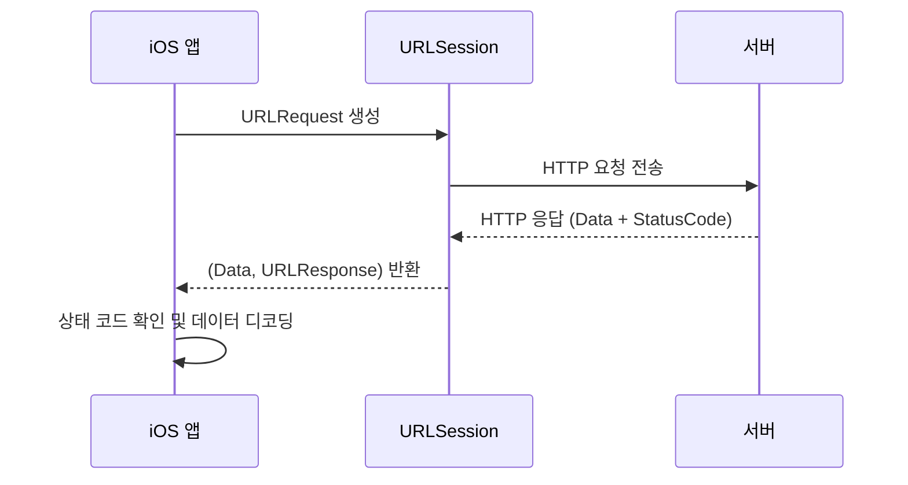
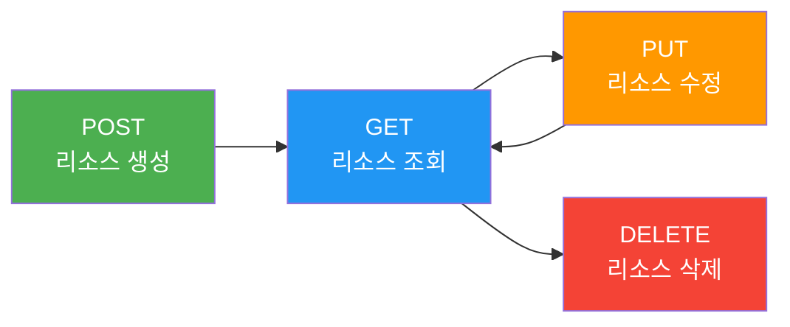
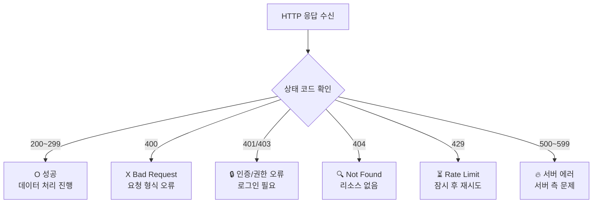
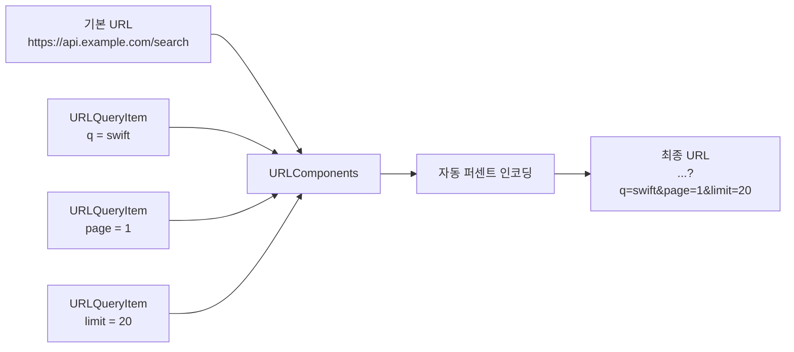

# URLSession과 REST API

> GET/POST 요청, HTTP 상태 코드, 헤더 설정

## 개요

이전 섹션에서 async/await의 기본 개념을 배웠다면, 이번에는 실제로 **서버와 통신하는 방법**을 다룹니다. Apple이 제공하는 `URLSession`은 iOS 앱에서 네트워크 통신을 담당하는 핵심 프레임워크인데요, HTTP 요청을 보내고 응답을 받는 모든 과정을 처리합니다.

**선수 지식**: [async/await 기초](./01-async-await.md)에서 배운 비동기 프로그래밍 개념
**학습 목표**:
- `URLSession`으로 GET/POST 요청을 보내는 방법 이해
- `URLRequest`를 사용해 HTTP 메서드, 헤더, 바디를 구성하는 방법
- HTTP 상태 코드를 확인하고 응답을 처리하는 패턴

## 왜 알아야 할까?

앱스토어에 있는 거의 모든 앱은 서버와 통신합니다. 인스타그램은 사진을 업로드하고, 카카오톡은 메시지를 주고받고, 배달의민족은 메뉴 데이터를 가져오죠. 이 모든 통신의 기반이 되는 것이 **HTTP 프로토콜**이고, iOS에서 이를 구현하는 도구가 바로 `URLSession`입니다. 서버와 대화하는 방법을 모르면 앱은 고립된 섬과 같습니다.

## 핵심 개념

### 개념 1: URLSession — 앱의 우체국

> 📊 **그림 1**: URLSession의 HTTP 요청-응답 흐름




> 💡 **비유**: `URLSession`은 **우체국**과 같습니다. 편지(요청)를 쓰면 우체국이 배달하고, 답장(응답)이 오면 전달해줍니다. 우체국에는 일반 우편(shared), 등기 우편(커스텀 설정) 등 다양한 옵션이 있죠.

`URLSession.shared`는 가장 기본적인 세션으로, 별도 설정 없이 바로 사용할 수 있습니다:

```swift
import Foundation

// 가장 간단한 GET 요청 — URL에서 데이터 가져오기
func fetchData() async throws -> Data {
    let url = URL(string: "https://jsonplaceholder.typicode.com/posts/1")!

    // URLSession.shared.data(from:)는 (Data, URLResponse) 튜플을 반환
    let (data, response) = try await URLSession.shared.data(from: url)

    // HTTP 상태 코드 확인
    guard let httpResponse = response as? HTTPURLResponse,
          httpResponse.statusCode == 200 else {
        throw URLError(.badServerResponse)
    }

    return data
}
```

`URLSession`에는 네 가지 주요 비동기 메서드가 있습니다:

| 메서드 | 용도 | 반환값 |
|--------|------|--------|
| `data(from:)` | URL에서 데이터를 메모리로 가져옴 | `(Data, URLResponse)` |
| `data(for:)` | URLRequest로 데이터를 가져옴 | `(Data, URLResponse)` |
| `upload(for:from:)` | 데이터를 서버에 업로드 | `(Data, URLResponse)` |
| `download(from:)` | 파일을 디스크에 다운로드 | `(URL, URLResponse)` |

### 개념 2: HTTP 메서드 — 서버에게 보내는 동사

> 📊 **그림 2**: HTTP CRUD 메서드와 리소스 생명주기




> 💡 **비유**: HTTP 메서드는 식당에서의 **행동**과 같습니다. GET은 "메뉴 보여주세요"(조회), POST는 "이거 주문할게요"(생성), PUT은 "주문 변경해주세요"(수정), DELETE는 "주문 취소해주세요"(삭제)입니다.

**GET 요청** — 데이터를 가져올 때 (기본값):

```swift
// GET 요청은 URL만으로 충분합니다
func getPost(id: Int) async throws -> Data {
    let url = URL(string: "https://jsonplaceholder.typicode.com/posts/\(id)")!
    let (data, _) = try await URLSession.shared.data(from: url)
    return data
}
```

**POST 요청** — 데이터를 서버에 보낼 때:

```swift
// POST 요청은 URLRequest를 구성해야 합니다
func createPost(title: String, body: String) async throws -> Data {
    let url = URL(string: "https://jsonplaceholder.typicode.com/posts")!

    // URLRequest 생성 및 설정
    var request = URLRequest(url: url)
    request.httpMethod = "POST"  // HTTP 메서드 지정
    request.setValue("application/json", forHTTPHeaderField: "Content-Type")  // JSON 전송 명시

    // 보낼 데이터를 JSON으로 인코딩
    let postData = ["title": title, "body": body, "userId": "1"]
    request.httpBody = try JSONEncoder().encode(postData)

    // data(for:)는 URLRequest를 받는 버전
    let (data, response) = try await URLSession.shared.data(for: request)

    guard let httpResponse = response as? HTTPURLResponse,
          (200...299).contains(httpResponse.statusCode) else {
        throw URLError(.badServerResponse)
    }

    return data
}
```

**PUT 요청** — 기존 데이터를 수정할 때:

```swift
func updatePost(id: Int, title: String) async throws -> Data {
    let url = URL(string: "https://jsonplaceholder.typicode.com/posts/\(id)")!

    var request = URLRequest(url: url)
    request.httpMethod = "PUT"  // 전체 교체
    request.setValue("application/json", forHTTPHeaderField: "Content-Type")

    let updateData = ["title": title, "body": "수정된 내용", "userId": "1"]
    request.httpBody = try JSONEncoder().encode(updateData)

    let (data, _) = try await URLSession.shared.data(for: request)
    return data
}
```

**DELETE 요청** — 데이터를 삭제할 때:

```swift
func deletePost(id: Int) async throws {
    let url = URL(string: "https://jsonplaceholder.typicode.com/posts/\(id)")!

    var request = URLRequest(url: url)
    request.httpMethod = "DELETE"

    let (_, response) = try await URLSession.shared.data(for: request)

    guard let httpResponse = response as? HTTPURLResponse,
          (200...299).contains(httpResponse.statusCode) else {
        throw URLError(.badServerResponse)
    }
}
```

### 개념 3: HTTP 상태 코드 — 서버의 대답

> 📊 **그림 3**: HTTP 상태 코드 분류 체계




> 💡 **비유**: HTTP 상태 코드는 **택배 배송 상태**와 같습니다. 200번대는 "배송 완료!", 400번대는 "주소가 잘못됐어요"(클라이언트 잘못), 500번대는 "물류센터에 문제가 있어요"(서버 잘못)입니다.

```swift
func handleResponse(_ response: URLResponse) throws {
    guard let httpResponse = response as? HTTPURLResponse else {
        throw URLError(.badServerResponse)
    }

    switch httpResponse.statusCode {
    case 200...299:
        // 성공 — 아무 처리 불필요
        break
    case 401:
        // 인증 실패 — 로그인 필요
        throw NetworkError.unauthorized
    case 404:
        // 리소스를 찾을 수 없음
        throw NetworkError.notFound
    case 429:
        // 요청 너무 많음 — 잠시 후 재시도
        throw NetworkError.tooManyRequests
    case 500...599:
        // 서버 에러 — 서버 쪽 문제
        throw NetworkError.serverError(httpResponse.statusCode)
    default:
        throw NetworkError.unknown(httpResponse.statusCode)
    }
}

// 네트워크 에러 타입 정의
enum NetworkError: Error {
    case unauthorized
    case notFound
    case tooManyRequests
    case serverError(Int)
    case unknown(Int)
}
```

자주 만나는 상태 코드를 정리하면:

| 코드 | 의미 | 설명 |
|------|------|------|
| 200 | OK | 요청 성공 |
| 201 | Created | 리소스 생성 성공 (POST) |
| 204 | No Content | 성공했지만 반환 데이터 없음 (DELETE) |
| 400 | Bad Request | 잘못된 요청 형식 |
| 401 | Unauthorized | 인증 필요 |
| 403 | Forbidden | 권한 없음 |
| 404 | Not Found | 리소스 없음 |
| 429 | Too Many Requests | 요청 제한 초과 |
| 500 | Internal Server Error | 서버 내부 오류 |

### 개념 4: URLRequest 설정 — 편지 봉투 꾸미기

`URLRequest`는 요청의 모든 세부 사항을 담는 객체입니다. HTTP 메서드, 헤더, 바디, 타임아웃 등을 설정할 수 있죠:

```swift
func configuredRequest() -> URLRequest {
    let url = URL(string: "https://api.example.com/data")!
    var request = URLRequest(url: url)

    // HTTP 메서드 설정
    request.httpMethod = "POST"

    // 헤더 설정 — 서버에게 추가 정보 전달
    request.setValue("application/json", forHTTPHeaderField: "Content-Type")
    request.setValue("Bearer your-token-here", forHTTPHeaderField: "Authorization")
    request.setValue("ko-KR", forHTTPHeaderField: "Accept-Language")

    // 타임아웃 설정 (초 단위)
    request.timeoutInterval = 30

    // 캐시 정책
    request.cachePolicy = .reloadIgnoringLocalCacheData

    return request
}
```

> ⚠️ **흔한 오해**: "GET 요청에는 항상 `URL`만 쓰고, POST 요청에는 `URLRequest`를 써야 한다" — 아닙니다! GET 요청에도 `URLRequest`를 사용할 수 있고, 인증 헤더나 캐시 정책을 설정하려면 GET에서도 `URLRequest`가 필요합니다. `URL`만 쓰는 것은 가장 간단한 GET 요청의 단축 표현일 뿐이에요.

### 개념 5: 쿼리 파라미터 — URL에 검색 조건 붙이기

> 📊 **그림 4**: URLComponents로 안전한 URL 구성 과정




API 호출 시 검색어나 필터 조건을 URL에 전달하려면 `URLComponents`를 사용합니다:

```swift
func searchPosts(query: String, page: Int) async throws -> Data {
    // URLComponents로 URL을 안전하게 구성
    var components = URLComponents(string: "https://api.example.com/search")!

    // 쿼리 파라미터 추가 — 특수 문자도 자동 인코딩
    components.queryItems = [
        URLQueryItem(name: "q", value: query),       // 검색어
        URLQueryItem(name: "page", value: "\(page)"), // 페이지 번호
        URLQueryItem(name: "limit", value: "20")      // 페이지당 결과 수
    ]

    // 결과 URL: https://api.example.com/search?q=swift&page=1&limit=20
    guard let url = components.url else {
        throw URLError(.badURL)
    }

    let (data, _) = try await URLSession.shared.data(from: url)
    return data
}
```

> 🔥 **실무 팁**: URL 문자열에 쿼리 파라미터를 직접 붙이지 마세요(`"...?q=\(query)"` 처럼). 한글이나 특수 문자(`&`, `=`, 공백 등)가 포함되면 URL이 깨집니다. `URLComponents`와 `URLQueryItem`을 쓰면 자동으로 퍼센트 인코딩을 처리해줍니다.

## 실습: 게시물 CRUD 앱

URLSession의 GET/POST/DELETE를 모두 활용하는 SwiftUI 앱을 만들어봅시다:

```swift
import SwiftUI

// 게시물 모델
struct Post: Codable, Identifiable {
    let id: Int
    let title: String
    let body: String
    let userId: Int
}

// API 서비스
@MainActor
@Observable
class PostService {
    var posts: [Post] = []
    var isLoading = false
    var errorMessage: String?

    // GET — 게시물 목록 조회
    func fetchPosts() async {
        isLoading = true
        errorMessage = nil
        defer { isLoading = false }

        do {
            let url = URL(string: "https://jsonplaceholder.typicode.com/posts?_limit=10")!
            let (data, response) = try await URLSession.shared.data(from: url)

            guard let httpResponse = response as? HTTPURLResponse,
                  httpResponse.statusCode == 200 else {
                throw URLError(.badServerResponse)
            }

            posts = try JSONDecoder().decode([Post].self, from: data)
        } catch {
            errorMessage = "게시물을 불러올 수 없습니다: \(error.localizedDescription)"
        }
    }

    // POST — 새 게시물 생성
    func createPost(title: String, body: String) async {
        let url = URL(string: "https://jsonplaceholder.typicode.com/posts")!
        var request = URLRequest(url: url)
        request.httpMethod = "POST"
        request.setValue("application/json", forHTTPHeaderField: "Content-Type")

        let newPost = ["title": title, "body": body, "userId": "1"]
        request.httpBody = try? JSONEncoder().encode(newPost)

        do {
            let (data, _) = try await URLSession.shared.data(for: request)
            let created = try JSONDecoder().decode(Post.self, from: data)
            posts.insert(created, at: 0) // 목록 맨 앞에 추가
        } catch {
            errorMessage = "게시물 생성 실패"
        }
    }

    // DELETE — 게시물 삭제
    func deletePost(id: Int) async {
        let url = URL(string: "https://jsonplaceholder.typicode.com/posts/\(id)")!
        var request = URLRequest(url: url)
        request.httpMethod = "DELETE"

        do {
            let (_, response) = try await URLSession.shared.data(for: request)
            guard let httpResponse = response as? HTTPURLResponse,
                  (200...299).contains(httpResponse.statusCode) else {
                throw URLError(.badServerResponse)
            }
            posts.removeAll { $0.id == id }
        } catch {
            errorMessage = "삭제 실패"
        }
    }
}

// 뷰
struct PostListView: View {
    @State private var service = PostService()
    @State private var showingCreateSheet = false

    var body: some View {
        NavigationStack {
            Group {
                if service.isLoading {
                    ProgressView("게시물 로딩 중...")
                } else if let error = service.errorMessage {
                    ContentUnavailableView {
                        Label("오류 발생", systemImage: "wifi.exclamationmark")
                    } description: {
                        Text(error)
                    } actions: {
                        Button("다시 시도") {
                            Task { await service.fetchPosts() }
                        }
                    }
                } else {
                    List {
                        ForEach(service.posts) { post in
                            VStack(alignment: .leading, spacing: 4) {
                                Text(post.title)
                                    .font(.headline)
                                    .lineLimit(1)
                                Text(post.body)
                                    .font(.caption)
                                    .foregroundStyle(.secondary)
                                    .lineLimit(2)
                            }
                            .padding(.vertical, 2)
                        }
                        .onDelete { indexSet in
                            for index in indexSet {
                                let post = service.posts[index]
                                Task { await service.deletePost(id: post.id) }
                            }
                        }
                    }
                }
            }
            .navigationTitle("게시물")
            .toolbar {
                Button("작성", systemImage: "plus") {
                    showingCreateSheet = true
                }
            }
            .sheet(isPresented: $showingCreateSheet) {
                CreatePostView(service: service)
            }
            .refreshable {
                await service.fetchPosts()
            }
        }
        .task {
            await service.fetchPosts()
        }
    }
}

// 게시물 작성 뷰
struct CreatePostView: View {
    let service: PostService
    @Environment(\.dismiss) private var dismiss
    @State private var title = ""
    @State private var body = ""

    var bodyView: some View {
        NavigationStack {
            Form {
                TextField("제목", text: $title)
                TextField("내용", text: $body, axis: .vertical)
                    .lineLimit(5...10)
            }
            .navigationTitle("새 게시물")
            .navigationBarTitleDisplayMode(.inline)
            .toolbar {
                ToolbarItem(placement: .cancellationAction) {
                    Button("취소") { dismiss() }
                }
                ToolbarItem(placement: .confirmationAction) {
                    Button("작성") {
                        Task {
                            await service.createPost(title: title, body: body)
                            dismiss()
                        }
                    }
                    .disabled(title.isEmpty)
                }
            }
        }
    }
}

#Preview {
    PostListView()
}
```

## 더 깊이 알아보기

### URLSession의 진화 이야기

iOS의 네트워킹 역사는 꽤 흥미롭습니다. 처음에는 **NSURLConnection**이라는 API가 있었는데, 2003년 Safari 출시와 함께 등장했습니다. 하지만 NSURLConnection은 delegate 패턴이 복잡하고 취소/재개가 어려웠죠.

2013년 iOS 7에서 Apple은 이를 대체하는 **NSURLSession**(Swift에서는 `URLSession`)을 발표했습니다. 이름에서 "Session"이 붙은 이유는, 하나의 세션 안에서 여러 요청을 관리하는 개념을 도입했기 때문입니다.

그리고 2021년 WWDC에서 async/await 지원이 추가되면서, 콜백 지옥 없이 깔끔한 네트워킹 코드를 작성할 수 있게 되었습니다. 불과 몇 년 사이에 iOS 네트워킹의 모습이 완전히 바뀐 거죠.

### URLSession 설정 커스터마이징

기본 `URLSession.shared` 외에도 커스텀 세션을 만들 수 있습니다:

```swift
// 커스텀 설정으로 URLSession 생성
let configuration = URLSessionConfiguration.default
configuration.timeoutIntervalForRequest = 15       // 요청 타임아웃 15초
configuration.waitsForConnectivity = true           // 연결 대기 (오프라인 시 바로 실패하지 않음)
configuration.httpAdditionalHeaders = [             // 모든 요청에 공통 헤더 추가
    "Accept": "application/json",
    "X-App-Version": "1.0.0"
]

let session = URLSession(configuration: configuration)

// 이 세션으로 요청 보내기
let (data, _) = try await session.data(from: url)
```

## 흔한 오해와 팁

> ⚠️ **흔한 오해**: "`URLSession.shared`는 느리니까 항상 커스텀 세션을 만들어야 한다" — 아닙니다! `shared` 세션은 대부분의 경우에 충분하고 성능도 좋습니다. 커스텀 세션은 특수한 설정(인증서 핀닝, 백그라운드 다운로드 등)이 필요할 때만 만드세요.

> 🔥 **실무 팁**: `response as? HTTPURLResponse` 캐스팅을 절대 빼먹지 마세요! `URLResponse`에는 상태 코드가 없고, `HTTPURLResponse`로 캐스팅해야 `statusCode`에 접근할 수 있습니다. 캐스팅 없이 응답을 무시하면 서버 에러를 놓칠 수 있어요.

> 💡 **알고 계셨나요?**: `URLSession`은 기본적으로 HTTP 응답을 캐시합니다. `URLSessionConfiguration.default`는 디스크와 메모리 캐시를 모두 사용하죠. API 데이터가 항상 최신이어야 한다면 `cachePolicy`를 `.reloadIgnoringLocalCacheData`로 설정하세요.

## 핵심 정리

| 개념 | 설명 |
|------|------|
| `URLSession.shared` | 기본 공유 세션. 대부분의 네트워크 요청에 사용 |
| `data(from: URL)` | 간단한 GET 요청. URL만으로 데이터 가져오기 |
| `data(for: URLRequest)` | 커스텀 요청. 메서드/헤더/바디 설정 가능 |
| `URLRequest` | HTTP 요청의 세부 설정을 담는 객체 |
| `httpMethod` | GET, POST, PUT, DELETE 등 HTTP 동사 |
| `HTTPURLResponse` | 상태 코드와 응답 헤더를 포함하는 응답 객체 |
| `URLComponents` | URL과 쿼리 파라미터를 안전하게 구성 |
| `200...299` | 성공을 나타내는 HTTP 상태 코드 범위 |

## 다음 섹션 미리보기

서버에서 데이터를 가져오는 방법을 배웠는데, 받아온 JSON 데이터를 Swift 모델로 어떻게 변환할까요? 다음 [03. Codable과 JSON 파싱](./03-codable.md)에서 Swift의 강력한 `Codable` 프로토콜을 깊이 있게 다뤄봅니다.

## 참고 자료

- [Apple 공식 문서 - URLSession](https://developer.apple.com/documentation/foundation/urlsession) - URLSession 전체 레퍼런스
- [Use async/await with URLSession - WWDC21](https://developer.apple.com/videos/play/wwdc2021/10095/) - async/await URLSession 최초 소개
- [Hacking with Swift - URLSession](https://www.hackingwithswift.com/quick-start/concurrency/how-to-download-json-from-the-internet-and-decode-it-into-any-codable-type) - 실전 튜토리얼
- [Swift by Sundell - HTTP POST and file upload](https://www.swiftbysundell.com/articles/http-post-and-file-upload-requests-using-urlsession/) - POST 요청 심화
