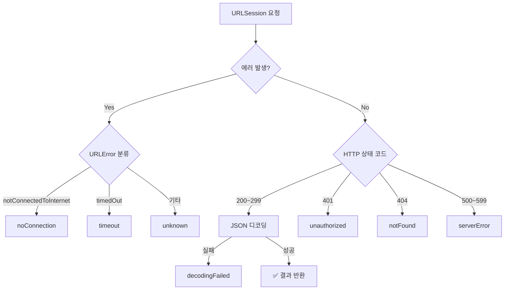
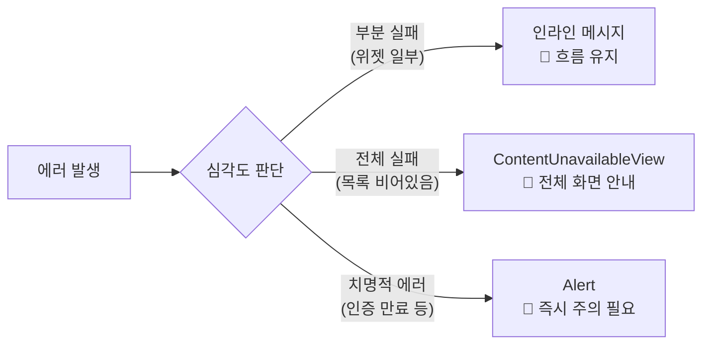
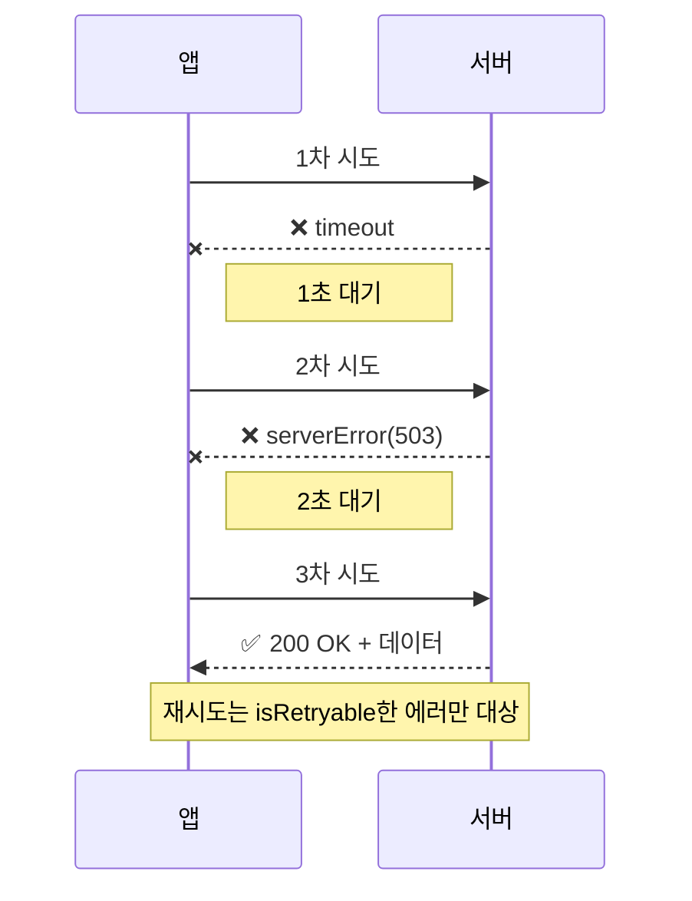
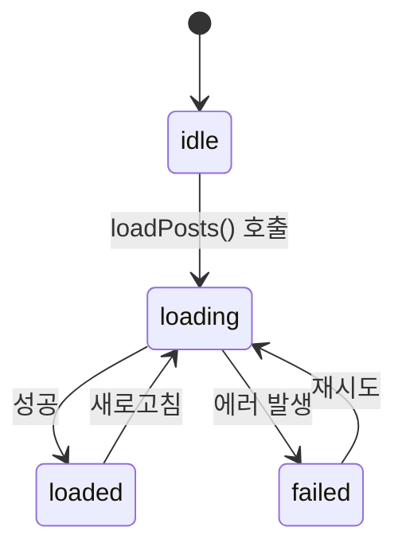

# 네트워크 에러 핸들링

> 에러 타입 설계, 사용자 피드백, 재시도 로직

## 개요

네트워크는 본질적으로 **불안정**합니다. 와이파이가 끊기고, 서버가 다운되고, JSON 형식이 바뀌기도 하죠. 이런 상황에서 앱이 그냥 크래시되거나 아무 반응 없이 멈춰있으면 사용자는 떠나버립니다. 이번 섹션에서는 네트워크 에러를 **체계적으로 설계하고**, 사용자에게 **의미 있는 피드백**을 제공하며, **자동 재시도**까지 구현하는 방법을 배웁니다.

**선수 지식**: [Codable과 JSON 파싱](./03-codable.md)에서 배운 JSON 디코딩 패턴
**학습 목표**:
- 네트워크용 커스텀 에러 타입을 설계하는 방법
- `LocalizedError` 프로토콜로 사용자 친화적 에러 메시지 제공
- SwiftUI에서 에러 상태를 표시하고 재시도하는 UI 패턴

## 왜 알아야 할까?

개발할 때는 네트워크가 항상 잘 되니까 에러 처리를 대충 넘기기 쉽습니다. 하지만 실제 사용자의 환경은 다릅니다. 지하철에서 터널에 들어가고, 엘리베이터 안에서 신호가 약해지고, 카페 와이파이가 갑자기 끊기죠. **에러 처리의 품질이 곧 앱의 품질**입니다. 잘 만든 에러 처리는 사용자가 "이 앱 괜찮은데?"라고 느끼게 만들어줍니다.

## 핵심 개념

### 개념 1: 커스텀 네트워크 에러 타입 — 에러에도 이름을 붙여주세요

> 📊 **그림 1**: URLError에서 커스텀 NetworkError로의 변환 흐름




> 💡 **비유**: 병원에 가면 의사가 "어디가 아프세요?"라고 묻고 진단명을 내리죠. 네트워크 에러도 마찬가지입니다. "뭔가 잘못됨" 대신 "서버 연결 실패", "인증 만료", "데이터 형식 오류"처럼 **구체적인 진단명**을 붙여야 적절한 처방(복구)이 가능합니다.

```swift
import Foundation

// 네트워크 전용 에러 타입
enum NetworkError: Error {
    case invalidURL
    case noConnection
    case timeout
    case serverError(statusCode: Int)
    case unauthorized
    case notFound
    case decodingFailed(Error)
    case unknown(Error)
}
```

에러 타입을 정의했다면, 실제 네트워크 요청에서 적절한 에러로 변환합니다:

```swift
func request<T: Decodable>(url: URL) async throws -> T {
    let data: Data
    let response: URLResponse

    do {
        (data, response) = try await URLSession.shared.data(from: url)
    } catch let urlError as URLError {
        // URLError를 우리의 에러 타입으로 변환
        switch urlError.code {
        case .notConnectedToInternet, .networkConnectionLost:
            throw NetworkError.noConnection
        case .timedOut:
            throw NetworkError.timeout
        default:
            throw NetworkError.unknown(urlError)
        }
    }

    // HTTP 상태 코드 확인
    guard let httpResponse = response as? HTTPURLResponse else {
        throw NetworkError.unknown(URLError(.badServerResponse))
    }

    switch httpResponse.statusCode {
    case 200...299:
        break  // 성공
    case 401:
        throw NetworkError.unauthorized
    case 404:
        throw NetworkError.notFound
    case 500...599:
        throw NetworkError.serverError(statusCode: httpResponse.statusCode)
    default:
        throw NetworkError.serverError(statusCode: httpResponse.statusCode)
    }

    // JSON 디코딩
    do {
        return try JSONDecoder().decode(T.self, from: data)
    } catch {
        throw NetworkError.decodingFailed(error)
    }
}
```

### 개념 2: LocalizedError — 사용자가 이해하는 말로

> 💡 **비유**: 외국어를 모르는 사람에게 영어로 에러 메시지를 보여주면 당황하겠죠? `LocalizedError`는 기술적인 에러를 **사용자의 언어**로 번역해주는 프로토콜입니다.

```swift
extension NetworkError: LocalizedError {
    // 사용자에게 보여줄 에러 제목
    var errorDescription: String? {
        switch self {
        case .invalidURL:
            return "잘못된 요청입니다"
        case .noConnection:
            return "인터넷 연결을 확인해주세요"
        case .timeout:
            return "서버 응답이 너무 느립니다"
        case .serverError:
            return "서버에 문제가 발생했습니다"
        case .unauthorized:
            return "로그인이 필요합니다"
        case .notFound:
            return "요청한 정보를 찾을 수 없습니다"
        case .decodingFailed:
            return "데이터를 처리할 수 없습니다"
        case .unknown:
            return "알 수 없는 오류가 발생했습니다"
        }
    }

    // 에러 복구 방법 안내
    var recoverySuggestion: String? {
        switch self {
        case .noConnection:
            return "Wi-Fi 또는 셀룰러 데이터 연결을 확인한 후 다시 시도해주세요."
        case .timeout:
            return "잠시 후 다시 시도해주세요."
        case .serverError:
            return "서버 점검 중일 수 있습니다. 잠시 후 다시 시도해주세요."
        case .unauthorized:
            return "설정에서 다시 로그인해주세요."
        default:
            return "문제가 계속되면 앱을 재시작해주세요."
        }
    }

    // 재시도 가능 여부
    var isRetryable: Bool {
        switch self {
        case .noConnection, .timeout, .serverError:
            return true
        case .invalidURL, .unauthorized, .notFound, .decodingFailed, .unknown:
            return false
        }
    }
}
```

### 개념 3: SwiftUI에서 에러 표시 — 세 가지 패턴

> 📊 **그림 4**: 에러 심각도에 따른 UI 패턴 선택




**패턴 1: Alert — 간단한 에러 알림**

```swift
struct AlertErrorView: View {
    @State private var data: [String] = []
    @State private var error: NetworkError?
    @State private var showingError = false

    var body: some View {
        List(data, id: \.self) { item in
            Text(item)
        }
        .task { await loadData() }
        .alert(
            "오류 발생",
            isPresented: $showingError,
            presenting: error
        ) { error in
            if error.isRetryable {
                Button("다시 시도") {
                    Task { await loadData() }
                }
            }
            Button("확인", role: .cancel) {}
        } message: { error in
            Text(error.localizedDescription)
        }
    }

    func loadData() async {
        do {
            data = try await fetchItems()
        } catch let networkError as NetworkError {
            error = networkError
            showingError = true
        } catch {
            self.error = .unknown(error)
            showingError = true
        }
    }

    func fetchItems() async throws -> [String] {
        // 네트워크 요청...
        return ["항목 1", "항목 2"]
    }
}
```

**패턴 2: ContentUnavailableView — 전체 화면 에러**

```swift
struct FullScreenErrorView: View {
    @State private var posts: [Post] = []
    @State private var isLoading = false
    @State private var error: NetworkError?

    var body: some View {
        Group {
            if isLoading {
                ProgressView("로딩 중...")
            } else if let error {
                // iOS 17+의 전체 화면 에러 뷰
                ContentUnavailableView {
                    Label(
                        error == .noConnection ? "오프라인" : "오류 발생",
                        systemImage: error == .noConnection
                            ? "wifi.slash" : "exclamationmark.triangle"
                    )
                } description: {
                    Text(error.localizedDescription)
                    if let suggestion = error.recoverySuggestion {
                        Text(suggestion)
                            .font(.caption)
                    }
                } actions: {
                    if error.isRetryable {
                        Button("다시 시도") {
                            Task { await loadPosts() }
                        }
                        .buttonStyle(.borderedProminent)
                    }
                }
            } else {
                List(posts) { post in
                    Text(post.title)
                }
            }
        }
        .task { await loadPosts() }
    }

    func loadPosts() async {
        isLoading = true
        error = nil
        defer { isLoading = false }

        do {
            let url = URL(string: "https://jsonplaceholder.typicode.com/posts")!
            posts = try await request(url: url)
        } catch let networkError as NetworkError {
            error = networkError
        } catch {
            self.error = .unknown(error)
        }
    }
}
```

**패턴 3: 인라인 에러 — 부분 실패 표시**

```swift
struct InlineErrorView: View {
    @State private var weather: String?
    @State private var errorMessage: String?

    var body: some View {
        VStack(spacing: 16) {
            if let weather {
                Text(weather)
                    .font(.largeTitle)
            }

            // 에러를 인라인으로 표시
            if let errorMessage {
                HStack {
                    Image(systemName: "exclamationmark.circle.fill")
                        .foregroundStyle(.red)
                    Text(errorMessage)
                        .font(.caption)
                        .foregroundStyle(.secondary)
                    Button("재시도") {
                        Task { await loadWeather() }
                    }
                    .font(.caption)
                }
                .padding(8)
                .background(.red.opacity(0.1), in: RoundedRectangle(cornerRadius: 8))
            }
        }
        .task { await loadWeather() }
    }

    func loadWeather() async {
        errorMessage = nil
        do {
            let url = URL(string: "https://api.example.com/weather")!
            weather = try await request(url: url)
        } catch let error as NetworkError {
            errorMessage = error.localizedDescription
        } catch {
            errorMessage = "알 수 없는 오류"
        }
    }
}
```

### 개념 4: 재시도 로직 — 한 번 실패했다고 포기하지 않기

> 📊 **그림 2**: 지수 백오프(Exponential Backoff) 재시도 흐름




> 💡 **비유**: 전화가 안 될 때 한 번만 걸고 포기하진 않죠? 잠깐 기다렸다가 다시 걸어보고, 또 안 되면 조금 더 기다렸다가 다시 시도합니다. 이것이 바로 **지수 백오프(Exponential Backoff)** 전략입니다.

```swift
// 재시도가 가능한 네트워크 요청
func requestWithRetry<T: Decodable>(
    url: URL,
    maxRetries: Int = 3,
    initialDelay: Duration = .seconds(1)
) async throws -> T {
    var lastError: Error?
    var delay = initialDelay

    for attempt in 0...maxRetries {
        // 첫 시도가 아니면 대기
        if attempt > 0 {
            try await Task.sleep(for: delay)
            delay *= 2  // 지수 백오프: 1초 → 2초 → 4초

            // 취소 확인
            guard !Task.isCancelled else {
                throw CancellationError()
            }
        }

        do {
            return try await request(url: url)
        } catch let error as NetworkError where error.isRetryable {
            lastError = error
            // 재시도 가능한 에러면 계속 반복
            continue
        } catch {
            // 재시도 불가능한 에러면 즉시 종료
            throw error
        }
    }

    throw lastError ?? NetworkError.unknown(URLError(.unknown))
}
```

> ⚠️ **흔한 오해**: "에러가 나면 무조건 재시도하면 된다" — 아닙니다! 인증 실패(401)나 잘못된 URL(400) 같은 에러는 아무리 재시도해도 결과가 같습니다. 재시도는 **일시적인 에러**(네트워크 끊김, 서버 과부하, 타임아웃)에만 의미가 있어요. 무분별한 재시도는 서버에 불필요한 부하만 줍니다.

### 개념 5: Loadable 패턴 — 상태를 타입으로 표현하기

> 📊 **그림 3**: Loadable<T> 상태 전이 다이어그램




로딩/성공/실패 상태를 enum으로 관리하면 뷰 코드가 깔끔해집니다:

```swift
// 로딩 상태를 표현하는 제네릭 enum
enum Loadable<T> {
    case idle               // 아직 로드 안 함
    case loading            // 로딩 중
    case loaded(T)          // 성공
    case failed(NetworkError) // 실패
}

@MainActor
@Observable
class PostListViewModel {
    var state: Loadable<[Post]> = .idle

    func loadPosts() async {
        state = .loading

        do {
            let url = URL(string: "https://jsonplaceholder.typicode.com/posts?_limit=10")!
            let posts: [Post] = try await request(url: url)
            state = .loaded(posts)
        } catch let error as NetworkError {
            state = .failed(error)
        } catch {
            state = .failed(.unknown(error))
        }
    }
}

// 뷰에서 깔끔하게 분기
struct LoadablePostList: View {
    @State private var viewModel = PostListViewModel()

    var body: some View {
        Group {
            switch viewModel.state {
            case .idle:
                Color.clear

            case .loading:
                ProgressView("게시물 로딩 중...")

            case .loaded(let posts):
                List(posts) { post in
                    Text(post.title)
                }

            case .failed(let error):
                ContentUnavailableView {
                    Label("오류", systemImage: "exclamationmark.triangle")
                } description: {
                    Text(error.localizedDescription)
                } actions: {
                    if error.isRetryable {
                        Button("다시 시도") {
                            Task { await viewModel.loadPosts() }
                        }
                    }
                }
            }
        }
        .task { await viewModel.loadPosts() }
    }
}
```

## 실습: 견고한 뉴스 리더

에러 핸들링이 잘 갖춰진 뉴스 리더 앱을 만들어봅시다:

```swift
import SwiftUI

struct NewsArticle: Codable, Identifiable {
    let id: Int
    let title: String
    let body: String
}

@MainActor
@Observable
class NewsViewModel {
    var state: Loadable<[NewsArticle]> = .idle
    var retryCount = 0

    func loadNews() async {
        state = .loading
        retryCount = 0

        do {
            let url = URL(string: "https://jsonplaceholder.typicode.com/posts?_limit=15")!
            let articles: [NewsArticle] = try await requestWithRetry(
                url: url,
                maxRetries: 2
            )
            state = .loaded(articles)
        } catch let error as NetworkError {
            state = .failed(error)
        } catch {
            state = .failed(.unknown(error))
        }
    }
}

struct NewsReaderView: View {
    @State private var viewModel = NewsViewModel()

    var body: some View {
        NavigationStack {
            Group {
                switch viewModel.state {
                case .idle:
                    Color.clear

                case .loading:
                    VStack(spacing: 12) {
                        ProgressView()
                        Text("뉴스를 가져오는 중...")
                            .font(.subheadline)
                            .foregroundStyle(.secondary)
                    }

                case .loaded(let articles):
                    List(articles) { article in
                        NavigationLink {
                            ScrollView {
                                Text(article.body)
                                    .padding()
                            }
                            .navigationTitle(article.title)
                        } label: {
                            VStack(alignment: .leading, spacing: 4) {
                                Text(article.title)
                                    .font(.headline)
                                    .lineLimit(2)
                                Text(article.body)
                                    .font(.caption)
                                    .foregroundStyle(.secondary)
                                    .lineLimit(2)
                            }
                        }
                    }

                case .failed(let error):
                    ContentUnavailableView {
                        Label(
                            error == .noConnection ? "오프라인" : "오류",
                            systemImage: error == .noConnection
                                ? "wifi.slash" : "exclamationmark.triangle"
                        )
                    } description: {
                        VStack(spacing: 4) {
                            Text(error.localizedDescription)
                            if let suggestion = error.recoverySuggestion {
                                Text(suggestion)
                                    .font(.caption)
                            }
                        }
                    } actions: {
                        if error.isRetryable {
                            Button("다시 시도") {
                                Task { await viewModel.loadNews() }
                            }
                            .buttonStyle(.borderedProminent)
                        }
                    }
                }
            }
            .navigationTitle("뉴스")
            .refreshable {
                await viewModel.loadNews()
            }
        }
        .task {
            await viewModel.loadNews()
        }
    }
}

#Preview {
    NewsReaderView()
}
```

## 더 깊이 알아보기

### Swift 6의 Typed Throws

Swift 6.0에서 도입된 **Typed Throws**(SE-0413)를 사용하면 함수가 던질 수 있는 에러의 타입을 명시할 수 있습니다:

```swift
// Swift 6+ 타입이 지정된 throws
func fetchUser(id: Int) async throws(NetworkError) -> User {
    // 이 함수는 반드시 NetworkError만 던짐
    let url = URL(string: "https://api.example.com/users/\(id)")!
    return try await request(url: url)
}

// 호출부에서 catch 블록의 error 타입이 명확해짐
do {
    let user = try await fetchUser(id: 1)
} catch {
    // error의 타입이 자동으로 NetworkError
    switch error {
    case .noConnection:
        print("오프라인입니다")
    case .unauthorized:
        print("로그인이 필요합니다")
    default:
        print(error.localizedDescription)
    }
}
```

기존의 `throws`는 `any Error`를 던지기 때문에 catch 블록에서 타입 캐스팅이 필요했지만, `throws(NetworkError)`를 쓰면 컴파일러가 에러 타입을 알고 있어서 switch 문에서 바로 패턴 매칭이 가능합니다.

### 에러 처리 철학

Apple의 Human Interface Guidelines에 따르면, 좋은 에러 처리는 세 가지를 포함해야 합니다:

1. **무엇이 잘못되었는지** — "인터넷 연결이 끊겼습니다"
2. **왜 잘못되었는지** — "Wi-Fi 신호가 약합니다"
3. **어떻게 해결하는지** — "Wi-Fi 설정을 확인하거나 셀룰러 데이터를 켜주세요"

## 흔한 오해와 팁

> ⚠️ **흔한 오해**: "모든 에러에 alert을 띄워야 한다" — 아닙니다! alert은 사용자의 흐름을 강제로 중단시키므로 **정말 중요한 에러**에만 사용하세요. 목록이 비었을 때는 `ContentUnavailableView`, 부분 실패는 인라인 메시지, 치명적 에러만 alert이 적절합니다.

> 🔥 **실무 팁**: 재시도 로직에는 반드시 **최대 횟수 제한**과 **지수 백오프**를 적용하세요. 제한 없이 재시도하면 서버에 DDoS 공격과 다를 바 없는 부하를 줄 수 있습니다. 보통 3회 정도면 충분합니다.

> 💡 **알고 계셨나요?**: URLSession의 `waitsForConnectivity` 설정을 켜면, 오프라인 상태에서 바로 실패하는 대신 **연결이 복구될 때까지 자동으로 대기**합니다. `URLSessionConfiguration.default`에 `waitsForConnectivity = true`를 설정하면 됩니다.

## 핵심 정리

| 개념 | 설명 |
|------|------|
| 커스텀 에러 타입 | `enum`으로 앱에 맞는 에러 케이스 정의 |
| `LocalizedError` | 사용자에게 보여줄 에러 메시지를 제공하는 프로토콜 |
| `isRetryable` | 에러별 재시도 가능 여부 판단 |
| 지수 백오프 | 재시도 간격을 점점 늘리는 전략 (1초→2초→4초) |
| `Loadable<T>` | idle/loading/loaded/failed 상태를 enum으로 관리 |
| `ContentUnavailableView` | 전체 화면 에러 표시 (iOS 17+) |
| Typed Throws | `throws(ErrorType)`으로 에러 타입 명시 (Swift 6+) |
| `waitsForConnectivity` | 오프라인 시 연결 복구까지 자동 대기 |

## 다음 섹션 미리보기

지금까지 async/await, URLSession, Codable, 에러 핸들링을 각각 배웠습니다. 마지막 섹션에서는 이 모든 것을 하나로 합쳐서 **완성된 네트워크 앱**을 만들어봅니다. [05. 실전 API 프로젝트](./05-api-project.md)에서 검색, 페이징, 캐싱까지 갖춘 실전 앱을 구축해봅시다!

## 참고 자료

- [Apple 공식 문서 - Error Handling](https://developer.apple.com/documentation/swift/error-handling) - Swift 에러 처리 가이드
- [SE-0413: Typed Throws](https://github.com/swiftlang/swift-evolution/blob/main/proposals/0413-typed-throws.md) - Swift 6 Typed Throws 프로포절
- [Swift by Sundell - User-facing errors](https://www.swiftbysundell.com/articles/propagating-user-facing-errors-in-swift/) - 사용자 친화적 에러 패턴
- [NSHipster - Swift Error Protocols](https://nshipster.com/swift-foundation-error-protocols/) - LocalizedError, RecoverableError 심화
- [Swift by Sundell - Retrying async Task](https://www.swiftbysundell.com/articles/retrying-an-async-swift-task/) - 재시도 패턴 구현
