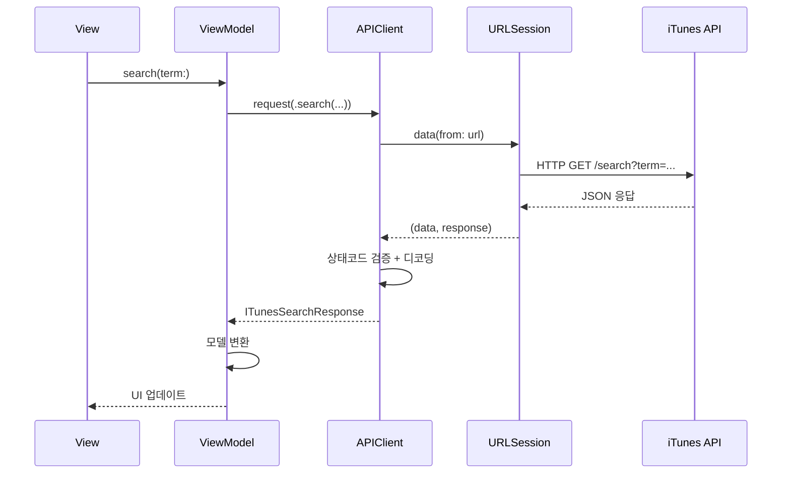
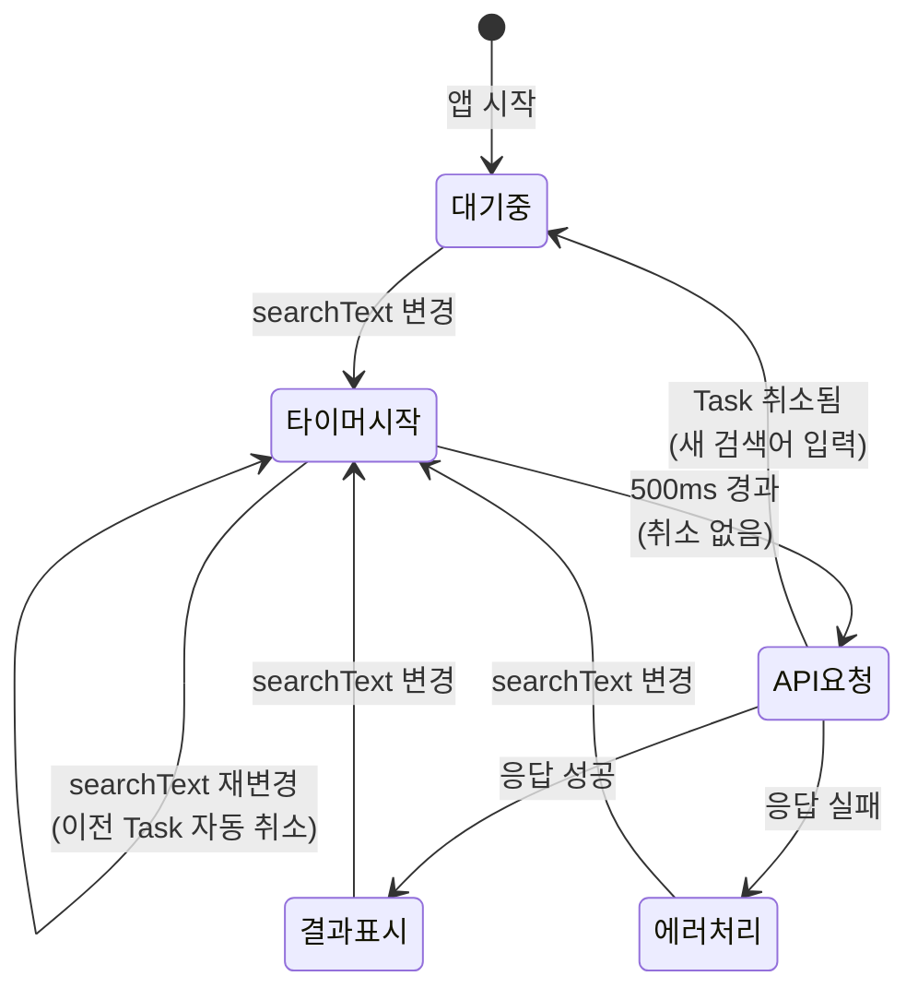
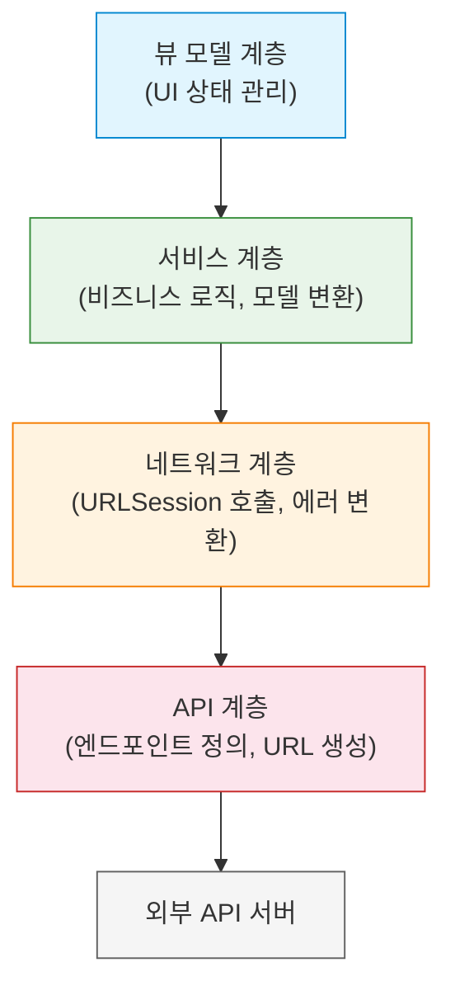

# 실전 API 프로젝트

> 공개 API로 완성하는 네트워크 앱 (검색, 페이징, 캐싱)

## 개요

이번 챕터에서 배운 async/await, URLSession, Codable, 에러 핸들링을 **모두 통합**해서 실전에서 바로 사용할 수 있는 네트워크 앱을 만들어봅니다. Apple의 iTunes Search API를 활용해 음악을 검색하고, 검색 디바운싱, 무한 스크롤 페이징, 이미지 캐싱까지 갖춘 완성도 높은 앱을 구현합니다.

**선수 지식**: Ch7의 모든 이전 섹션 ([async/await](./01-async-await.md), [URLSession](./02-urlsession.md), [Codable](./03-codable.md), [에러 핸들링](./04-error-handling.md))
**학습 목표**:
- API 클라이언트를 체계적으로 설계하는 방법
- `.searchable`과 `.task(id:)`를 결합한 검색 디바운싱 구현
- 무한 스크롤 페이징 패턴
- `AsyncImage`로 이미지 비동기 로딩

## 왜 알아야 할까?

지금까지 개별 기술을 하나씩 배웠는데, 실전에서는 이것들이 **동시에 어우러져야** 합니다. 검색할 때 이전 요청이 자동으로 취소되어야 하고, 스크롤을 내리면 다음 페이지가 로드되어야 하고, 에러가 나면 사용자에게 적절히 안내해야 하죠. 이 섹션은 이 챕터의 **졸업 프로젝트**이자, 다음 챕터(아키텍처 패턴)로 가기 전의 실전 훈련입니다.

## 핵심 개념

### 개념 1: API 클라이언트 설계 — 네트워크의 관문

> 📊 **그림 1**: API 클라이언트를 통한 네트워크 요청 흐름




> 💡 **비유**: API 클라이언트는 회사의 **접수 창구**와 같습니다. 모든 외부 요청이 이 창구를 통과하니까, 인증 처리, 에러 변환, 로깅 등을 한 곳에서 관리할 수 있죠. 각 화면에서 직접 URLSession을 부르는 것은, 직원들이 각자 알아서 외부 업체에 전화하는 것과 같습니다.

```swift
import Foundation

// API 엔드포인트 정의
enum ITunesEndpoint {
    case search(term: String, media: String, limit: Int, offset: Int)

    var url: URL {
        var components = URLComponents(string: "https://itunes.apple.com")!

        switch self {
        case .search(let term, let media, let limit, let offset):
            components.path = "/search"
            components.queryItems = [
                URLQueryItem(name: "term", value: term),
                URLQueryItem(name: "media", value: media),
                URLQueryItem(name: "country", value: "kr"),
                URLQueryItem(name: "limit", value: "\(limit)"),
                URLQueryItem(name: "offset", value: "\(offset)")
            ]
        }

        return components.url!
    }
}

// API 클라이언트 — 모든 네트워크 요청의 관문
actor APIClient {
    static let shared = APIClient()
    private let session: URLSession
    private let decoder: JSONDecoder

    private init() {
        let config = URLSessionConfiguration.default
        config.timeoutIntervalForRequest = 15
        config.waitsForConnectivity = true
        session = URLSession(configuration: config)

        decoder = JSONDecoder()
    }

    // 제네릭 요청 메서드
    func request<T: Decodable & Sendable>(_ endpoint: ITunesEndpoint) async throws -> T {
        let (data, response) = try await session.data(from: endpoint.url)

        guard let httpResponse = response as? HTTPURLResponse else {
            throw NetworkError.unknown(URLError(.badServerResponse))
        }

        guard (200...299).contains(httpResponse.statusCode) else {
            throw NetworkError.serverError(statusCode: httpResponse.statusCode)
        }

        do {
            return try decoder.decode(T.self, from: data)
        } catch {
            throw NetworkError.decodingFailed(error)
        }
    }
}
```

### 개념 2: 모델 설계 — 서버 응답과 앱 모델 분리

> 📊 **그림 2**: 서버 응답 모델과 앱 모델의 분리 구조


서버 응답 모델과 앱에서 사용하는 모델을 분리하면 유지보수가 편해집니다:

```swift
// 서버 응답 모델 (API 스펙 그대로)
struct ITunesSearchResponse: Codable, Sendable {
    let resultCount: Int
    let results: [ITunesTrack]
}

struct ITunesTrack: Codable, Sendable {
    let trackId: Int?
    let trackName: String?
    let artistName: String?
    let collectionName: String?
    let artworkUrl100: String?
    let previewUrl: String?
    let trackPrice: Double?
    let currency: String?
    let primaryGenreName: String?
    let releaseDate: String?
}

// 앱 모델 (화면에서 사용)
struct MusicItem: Identifiable, Sendable {
    let id: Int
    let title: String
    let artist: String
    let album: String
    let artworkURL: URL?
    let genre: String
    let price: String

    // 서버 모델 → 앱 모델 변환
    init(from track: ITunesTrack) {
        self.id = track.trackId ?? UUID().hashValue
        self.title = track.trackName ?? "알 수 없는 곡"
        self.artist = track.artistName ?? "알 수 없는 아티스트"
        self.album = track.collectionName ?? ""
        self.artworkURL = track.artworkUrl100.flatMap { URL(string: $0) }
        self.genre = track.primaryGenreName ?? ""

        if let price = track.trackPrice, let currency = track.currency {
            self.price = price < 0 ? "스트리밍" : "\(currency) \(price)"
        } else {
            self.price = ""
        }
    }
}
```

### 개념 3: 검색 + 디바운싱 — 타이핑할 때마다 요청하지 않기

> 📊 **그림 3**: .task(id:)를 활용한 디바운싱 동작 원리




> 💡 **비유**: 엘리베이터 문이 닫히려 할 때 누군가 뛰어오면 다시 열어주죠? 그리고 사람이 안 오면 그제야 문을 닫습니다. **디바운싱**도 비슷합니다. 사용자가 타이핑을 멈출 때까지 기다렸다가, 최종 입력에 대해서만 검색을 실행하는 것이죠.

```swift
@MainActor
@Observable
class MusicSearchViewModel {
    var items: [MusicItem] = []
    var state: Loadable<[MusicItem]> = .idle
    private let pageSize = 20

    func search(term: String) async {
        guard !term.trimmingCharacters(in: .whitespaces).isEmpty else {
            items = []
            state = .idle
            return
        }

        state = .loading

        do {
            let response: ITunesSearchResponse = try await APIClient.shared.request(
                .search(term: term, media: "music", limit: pageSize, offset: 0)
            )
            items = response.results.map { MusicItem(from: $0) }
            state = .loaded(items)
        } catch let error as NetworkError {
            state = .failed(error)
        } catch {
            state = .failed(.unknown(error))
        }
    }

    // 페이징: 다음 페이지 로드
    func loadMore(currentTerm: String) async {
        guard case .loaded = state else { return }

        do {
            let response: ITunesSearchResponse = try await APIClient.shared.request(
                .search(
                    term: currentTerm,
                    media: "music",
                    limit: pageSize,
                    offset: items.count
                )
            )
            let newItems = response.results.map { MusicItem(from: $0) }

            guard !newItems.isEmpty else { return }  // 더 이상 결과 없음
            items.append(contentsOf: newItems)
            state = .loaded(items)
        } catch {
            // 페이징 실패는 조용히 처리 (기존 목록은 유지)
        }
    }
}
```

### 개념 4: AsyncImage — 이미지 비동기 로딩

SwiftUI의 `AsyncImage`는 URL에서 이미지를 비동기로 로딩하고, 자동으로 캐싱까지 처리해줍니다:

```swift
struct ArtworkView: View {
    let url: URL?
    let size: CGFloat

    var body: some View {
        AsyncImage(url: url) { phase in
            switch phase {
            case .empty:
                // 로딩 중 — 플레이스홀더
                RoundedRectangle(cornerRadius: 8)
                    .fill(.gray.opacity(0.2))
                    .overlay {
                        ProgressView()
                    }

            case .success(let image):
                // 성공 — 이미지 표시
                image
                    .resizable()
                    .aspectRatio(contentMode: .fill)

            case .failure:
                // 실패 — 기본 아이콘
                RoundedRectangle(cornerRadius: 8)
                    .fill(.gray.opacity(0.2))
                    .overlay {
                        Image(systemName: "music.note")
                            .foregroundStyle(.gray)
                    }

            @unknown default:
                EmptyView()
            }
        }
        .frame(width: size, height: size)
        .clipShape(RoundedRectangle(cornerRadius: 8))
    }
}
```

> 🔥 **실무 팁**: `AsyncImage`는 URLSession의 기본 캐시를 활용하므로, 같은 URL의 이미지는 자동으로 캐싱됩니다. 하지만 메모리 캐시만 사용하기 때문에, 디스크 캐시가 필요하다면 별도의 이미지 캐싱 라이브러리(Kingfisher, Nuke 등)를 고려하세요.

## 실습: 음악 검색 앱 완성본

이 챕터의 모든 개념을 통합한 완성된 앱입니다:

```swift
import SwiftUI

// ─── 에러 타입 ───
enum NetworkError: Error, Equatable {
    case invalidURL
    case noConnection
    case timeout
    case serverError(statusCode: Int)
    case unauthorized
    case notFound
    case decodingFailed(Error)
    case unknown(Error)

    static func == (lhs: NetworkError, rhs: NetworkError) -> Bool {
        switch (lhs, rhs) {
        case (.noConnection, .noConnection),
             (.timeout, .timeout),
             (.unauthorized, .unauthorized),
             (.notFound, .notFound):
            return true
        case (.serverError(let a), .serverError(let b)):
            return a == b
        default:
            return false
        }
    }

    var isRetryable: Bool {
        switch self {
        case .noConnection, .timeout, .serverError: return true
        default: return false
        }
    }
}

extension NetworkError: LocalizedError {
    var errorDescription: String? {
        switch self {
        case .noConnection: return "인터넷 연결을 확인해주세요"
        case .timeout: return "서버 응답이 느립니다"
        case .serverError: return "서버에 문제가 발생했습니다"
        case .decodingFailed: return "데이터를 처리할 수 없습니다"
        default: return "알 수 없는 오류가 발생했습니다"
        case .invalidURL: return "잘못된 요청입니다"
        case .unauthorized: return "인증이 필요합니다"
        case .notFound: return "결과를 찾을 수 없습니다"
        }
    }
}

// ─── 로딩 상태 ───
enum Loadable<T> {
    case idle, loading, loaded(T), failed(NetworkError)
}

// ─── 모델 ───
struct ITunesResponse: Codable, Sendable {
    let resultCount: Int
    let results: [Track]
}

struct Track: Codable, Identifiable, Sendable {
    let trackId: Int?
    let trackName: String?
    let artistName: String?
    let collectionName: String?
    let artworkUrl100: String?
    let primaryGenreName: String?

    var id: Int { trackId ?? UUID().hashValue }
    var displayTitle: String { trackName ?? "알 수 없는 곡" }
    var displayArtist: String { artistName ?? "알 수 없는 아티스트" }
    var displayAlbum: String { collectionName ?? "" }
    var artworkURL: URL? { artworkUrl100.flatMap { URL(string: $0) } }
}

// ─── 뷰 모델 ───
@MainActor
@Observable
class SearchViewModel {
    var tracks: [Track] = []
    var state: Loadable<[Track]> = .idle
    private let pageSize = 25
    private var hasMore = true

    func search(term: String) async {
        let trimmed = term.trimmingCharacters(in: .whitespaces)
        guard !trimmed.isEmpty else {
            tracks = []
            state = .idle
            hasMore = true
            return
        }

        state = .loading
        hasMore = true

        do {
            var components = URLComponents(string: "https://itunes.apple.com/search")!
            components.queryItems = [
                URLQueryItem(name: "term", value: trimmed),
                URLQueryItem(name: "media", value: "music"),
                URLQueryItem(name: "country", value: "kr"),
                URLQueryItem(name: "limit", value: "\(pageSize)")
            ]

            let (data, response) = try await URLSession.shared.data(from: components.url!)

            guard let http = response as? HTTPURLResponse,
                  (200...299).contains(http.statusCode) else {
                throw NetworkError.serverError(statusCode: 0)
            }

            let result = try JSONDecoder().decode(ITunesResponse.self, from: data)
            tracks = result.results
            hasMore = result.results.count >= pageSize
            state = .loaded(tracks)
        } catch let error as NetworkError {
            state = .failed(error)
        } catch is CancellationError {
            // 검색어 변경으로 인한 취소 — 무시
        } catch {
            state = .failed(.unknown(error))
        }
    }

    func loadMoreIfNeeded(currentItem: Track, term: String) async {
        guard hasMore,
              case .loaded = state,
              let index = tracks.firstIndex(where: { $0.id == currentItem.id }),
              index >= tracks.count - 5 else { return }

        do {
            var components = URLComponents(string: "https://itunes.apple.com/search")!
            components.queryItems = [
                URLQueryItem(name: "term", value: term),
                URLQueryItem(name: "media", value: "music"),
                URLQueryItem(name: "country", value: "kr"),
                URLQueryItem(name: "limit", value: "\(pageSize)"),
                URLQueryItem(name: "offset", value: "\(tracks.count)")
            ]

            let (data, _) = try await URLSession.shared.data(from: components.url!)
            let result = try JSONDecoder().decode(ITunesResponse.self, from: data)

            if result.results.isEmpty {
                hasMore = false
            } else {
                tracks.append(contentsOf: result.results)
                state = .loaded(tracks)
            }
        } catch {
            // 페이징 실패는 조용히 처리
        }
    }
}

// ─── 메인 뷰 ───
struct MusicExplorerView: View {
    @State private var viewModel = SearchViewModel()
    @State private var searchText = ""

    var body: some View {
        NavigationStack {
            Group {
                switch viewModel.state {
                case .idle:
                    ContentUnavailableView(
                        "음악 검색",
                        systemImage: "music.magnifyingglass",
                        description: Text("아티스트, 곡, 앨범을 검색해보세요")
                    )

                case .loading:
                    ProgressView("검색 중...")

                case .loaded(let tracks):
                    if tracks.isEmpty {
                        ContentUnavailableView.search(text: searchText)
                    } else {
                        trackListView(tracks)
                    }

                case .failed(let error):
                    ContentUnavailableView {
                        Label("검색 실패", systemImage: "exclamationmark.triangle")
                    } description: {
                        Text(error.localizedDescription)
                    } actions: {
                        if error.isRetryable {
                            Button("다시 시도") {
                                Task { await viewModel.search(term: searchText) }
                            }
                            .buttonStyle(.borderedProminent)
                        }
                    }
                }
            }
            .navigationTitle("음악 탐색기")
            .searchable(text: $searchText, prompt: "검색어를 입력하세요")
        }
        .task(id: searchText) {
            // 디바운싱: 500ms 동안 입력이 없으면 검색 실행
            try? await Task.sleep(for: .milliseconds(500))
            guard !Task.isCancelled else { return }
            await viewModel.search(term: searchText)
        }
    }

    private func trackListView(_ tracks: [Track]) -> some View {
        List(tracks) { track in
            HStack(spacing: 12) {
                // 앨범 아트
                AsyncImage(url: track.artworkURL) { image in
                    image.resizable().aspectRatio(contentMode: .fill)
                } placeholder: {
                    RoundedRectangle(cornerRadius: 8)
                        .fill(.gray.opacity(0.2))
                        .overlay { Image(systemName: "music.note").foregroundStyle(.gray) }
                }
                .frame(width: 56, height: 56)
                .clipShape(RoundedRectangle(cornerRadius: 8))

                // 곡 정보
                VStack(alignment: .leading, spacing: 3) {
                    Text(track.displayTitle)
                        .font(.headline)
                        .lineLimit(1)
                    Text(track.displayArtist)
                        .font(.subheadline)
                        .foregroundStyle(.secondary)
                        .lineLimit(1)
                    if !track.displayAlbum.isEmpty {
                        Text(track.displayAlbum)
                            .font(.caption)
                            .foregroundStyle(.tertiary)
                            .lineLimit(1)
                    }
                }

                Spacer()

                // 장르 배지
                if let genre = track.primaryGenreName {
                    Text(genre)
                        .font(.caption2)
                        .padding(.horizontal, 6)
                        .padding(.vertical, 2)
                        .background(.blue.opacity(0.1), in: Capsule())
                        .foregroundStyle(.blue)
                }
            }
            .padding(.vertical, 2)
            .task {
                // 무한 스크롤 — 끝에 가까워지면 다음 페이지 로드
                await viewModel.loadMoreIfNeeded(
                    currentItem: track,
                    term: searchText
                )
            }
        }
        .listStyle(.plain)
    }
}

#Preview {
    MusicExplorerView()
}
```

## 더 깊이 알아보기

### 네트워크 계층 아키텍처

> 📊 **그림 4**: 실전 네트워크 계층 분리 구조




실전 프로젝트에서는 네트워크 코드를 계층별로 분리하는 것이 좋습니다:

**1. API 계층** — 엔드포인트 정의, URL 생성
**2. 네트워크 계층** — URLSession 호출, 에러 변환
**3. 서비스 계층** — 비즈니스 로직, 모델 변환
**4. 뷰 모델** — UI 상태 관리

이런 계층 분리는 다음 챕터인 [아키텍처 패턴](../08-architecture/01-mvvm.md)에서 더 자세히 다룹니다.

### iTunes Search API 활용 팁

이 실습에서 사용한 **iTunes Search API**는 Apple이 무료로 제공하는 공개 API로, API 키 없이 사용할 수 있습니다. 튜토리얼이나 포트폴리오 프로젝트에 안성맞춤이죠:

- 음악, 영화, 앱, 팟캐스트, 전자책 등 다양한 미디어 검색 가능
- `country` 파라미터로 한국 콘텐츠 검색 가능 (`kr`)
- 별도 인증 없이 즉시 사용 가능
- 요청 제한이 비교적 넉넉함 (분당 약 20회)

## 흔한 오해와 팁

> ⚠️ **흔한 오해**: "검색할 때마다 즉시 API를 호출해야 응답성이 좋다" — 오히려 반대입니다! 글자 하나하나마다 API를 호출하면 서버에 불필요한 부하를 주고, 이전 응답이 이후 응답보다 늦게 도착하는 **경합 조건(Race Condition)** 문제가 생깁니다. `.task(id:)`와 디바운싱을 활용하면 이전 요청이 자동 취소되어 항상 최신 결과만 표시됩니다.

> 🔥 **실무 팁**: 무한 스크롤을 구현할 때, 맨 마지막 항목이 보일 때 로드하면 이미 늦습니다. 마지막에서 **5개 정도 앞**의 항목이 보일 때 미리 로드를 시작하세요. 사용자에게 끊김 없는 경험을 줄 수 있습니다.

> 💡 **알고 계셨나요?**: SwiftUI의 `.task(id:)` 수정자는 `id` 값이 바뀔 때 **이전 Task를 자동으로 취소**하고 새 Task를 시작합니다. 이 덕분에 검색어가 바뀔 때마다 수동으로 이전 요청을 취소할 필요가 없어요. iOS 17+에서 사용 가능한 이 기능은 검색 구현의 필수 도구입니다.

## 핵심 정리

| 개념 | 설명 |
|------|------|
| API 클라이언트 | 네트워크 요청을 중앙에서 관리하는 구조 |
| 엔드포인트 enum | API URL을 타입 안전하게 정의 |
| 모델 분리 | 서버 응답 모델과 앱 모델을 분리하여 유지보수성 향상 |
| 디바운싱 | 빠른 입력 시 마지막 입력만 실행 (`.task(id:)` + `Task.sleep`) |
| 무한 스크롤 | 목록 끝에 가까워지면 다음 페이지를 자동 로드 |
| `AsyncImage` | URL에서 이미지를 비동기로 로드하는 SwiftUI 뷰 |
| `.searchable` | 네비게이션 바에 검색 UI를 추가하는 수정자 |
| `.task(id:)` | id 변경 시 이전 작업 취소 + 새 작업 시작 |

## 다음 섹션 미리보기

Ch7에서 네트워크 앱의 핵심 기술을 모두 익혔습니다! 다음 챕터에서는 이런 코드를 더 체계적으로 구조화하는 방법을 배웁니다. [Ch8. 아키텍처 패턴](../08-architecture/01-mvvm.md)에서 MVVM, Repository 패턴, 의존성 주입 등 실전 아키텍처를 다뤄봅시다.

## 참고 자료

- [iTunes Search API 공식 문서](https://developer.apple.com/library/archive/documentation/AudioVideo/Conceptual/iTuneSearchAPI/index.html) - API 전체 레퍼런스
- [Apple 공식 문서 - AsyncImage](https://developer.apple.com/documentation/swiftui/asyncimage) - AsyncImage 레퍼런스
- [Apple 공식 문서 - searchable](https://developer.apple.com/documentation/swiftui/view/searchable(text:placement:prompt:)) - searchable 수정자
- [Hacking with Swift - Sending and receiving Codable data](https://www.hackingwithswift.com/books/ios-swiftui/sending-and-receiving-codable-data-with-urlsession-and-swiftui) - URLSession + Codable 튜토리얼
- [Matteo Manferdini - REST API Calls in Swift](https://matteomanferdini.com/swift-rest-api/) - 네트워크 아키텍처 가이드
