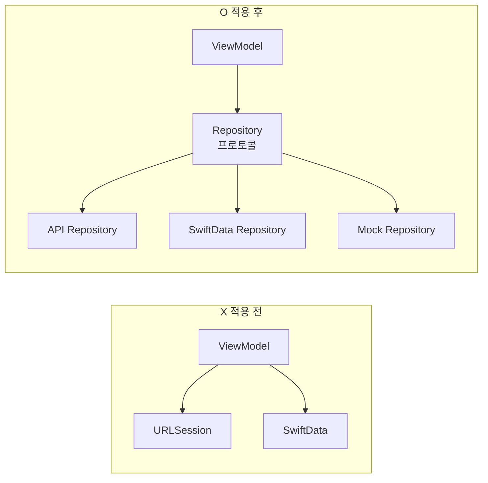
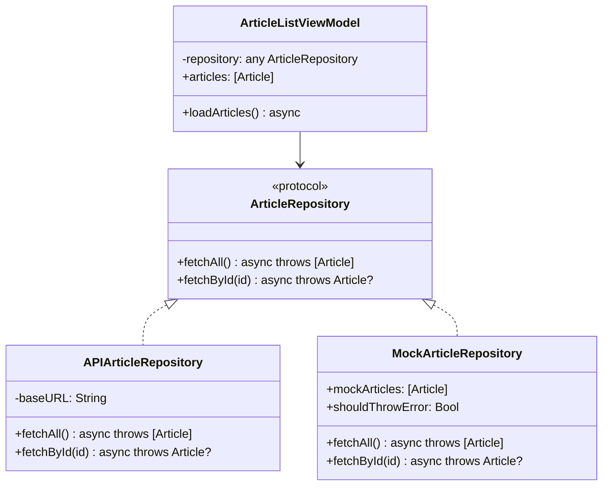
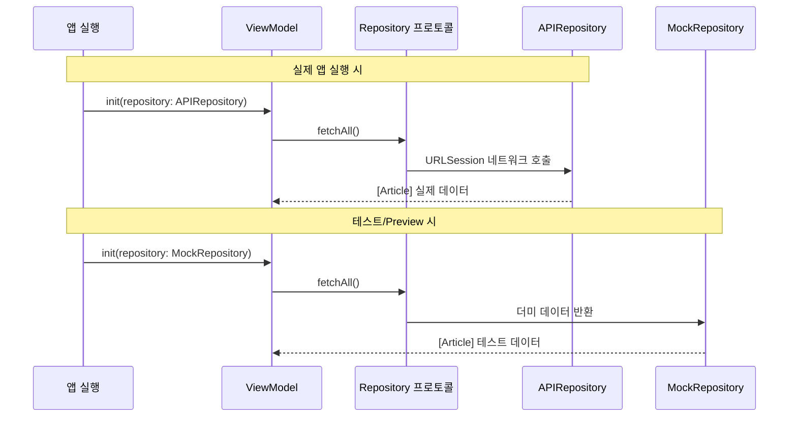

# Repository 패턴

> 데이터 소스 추상화, 프로토콜 기반 설계

## 개요

앞서 MVVM에서 ViewModel이 직접 `URLSession`을 호출하고 데이터를 가져왔습니다. 작동은 하지만, 한 가지 문제가 있어요 — ViewModel이 **어디서 데이터를 가져오는지** 너무 잘 알고 있다는 겁니다. API가 바뀌면 ViewModel을 고쳐야 하고, 테스트할 때도 실제 네트워크가 필요하죠. Repository 패턴은 이 의존성을 **프로토콜 뒤에 숨기는** 기법입니다.

> 📊 **그림 1**: Repository 패턴 적용 전후 비교




**선수 지식**: [01. MVVM 패턴](./01-mvvm.md)에서 배운 ViewModel 구현, [프로토콜과 익스텐션](../02-swift-types/03-protocols-extensions.md)
**학습 목표**:
- Repository 패턴의 목적과 구조 이해
- 프로토콜로 데이터 소스를 추상화하는 방법
- 네트워크와 로컬 저장소를 교체 가능하게 설계하기
- Mock Repository로 ViewModel을 테스트하기

## 왜 알아야 할까?

ViewModel이 `URLSession.shared.data(from: url)`을 직접 호출하고 있다고 상상해보세요. 이 ViewModel을 테스트하려면 **실제 서버가 돌아가야** 합니다. 서버가 죽으면 테스트도 실패하고, 네트워크가 느리면 테스트도 느려지죠. 이건 신뢰할 수 없는 테스트입니다.

Repository 패턴을 적용하면, 테스트할 때는 가짜 데이터를 반환하는 Mock Repository를 넣고, 실제 앱에서는 진짜 API를 호출하는 Repository를 넣을 수 있습니다. ViewModel 코드는 **한 글자도 바꾸지 않고요**.

## 핵심 개념

### 개념 1: Repository란 무엇인가?

> 💡 **비유**: Repository는 **도서관 사서**와 같습니다. 여러분이 "Swift 책 주세요"라고 요청하면, 사서는 서고에서 가져올 수도 있고, 다른 도서관에서 대출할 수도 있고, 전자책을 찾아줄 수도 있어요. 여러분은 **책이 어디에 있었는지 몰라도 됩니다**. 그냥 사서에게 요청하면 책을 받을 수 있으면 되는 거죠.

Repository는 데이터의 **출처를 숨기는 계층**입니다:

| ViewModel이 보는 것 | 실제 뒤에서 일어나는 일 |
|---------------------|------------------------|
| `repository.fetchArticles()` | REST API 호출 |
| `repository.fetchArticles()` | SwiftData에서 로컬 조회 |
| `repository.fetchArticles()` | 캐시에서 반환 |
| `repository.fetchArticles()` | 테스트용 더미 데이터 반환 |

호출하는 쪽(ViewModel)은 **항상 같은 메서드**를 호출합니다. 뒤에서 무슨 일이 일어나는지는 관심사가 아닌 거죠.

> 📊 **그림 2**: Repository 패턴의 계층 구조




### 개념 2: 프로토콜로 추상화하기

핵심은 프로토콜입니다. 데이터에 접근하는 **인터페이스(약속)**를 먼저 정의하고, 실제 구현은 나중에 갈아 끼웁니다.

```swift
import Foundation

// MARK: - Model
struct Article: Identifiable, Codable {
    let id: Int
    let title: String
    let body: String
}

// MARK: - Repository 프로토콜 (약속)
// "기사 데이터를 가져올 수 있다"는 능력을 정의
protocol ArticleRepository: Sendable {
    func fetchAll() async throws -> [Article]
    func fetchById(_ id: Int) async throws -> Article?
}
```

### 개념 3: 실제 구현 — API Repository

```swift
// MARK: - API Repository (실제 네트워크 호출)
struct APIArticleRepository: ArticleRepository {
    private let baseURL = "https://jsonplaceholder.typicode.com"

    func fetchAll() async throws -> [Article] {
        let url = URL(string: "\(baseURL)/posts")!
        let (data, _) = try await URLSession.shared.data(from: url)
        return try JSONDecoder().decode([Article].self, from: data)
    }

    func fetchById(_ id: Int) async throws -> Article? {
        let url = URL(string: "\(baseURL)/posts/\(id)")!
        let (data, _) = try await URLSession.shared.data(from: url)
        return try JSONDecoder().decode(Article.self, from: data)
    }
}
```

### 개념 4: Mock Repository — 테스트의 핵심

```swift
// MARK: - Mock Repository (테스트용 가짜 데이터)
struct MockArticleRepository: ArticleRepository {
    // 테스트 시나리오에 맞게 동작을 설정할 수 있습니다
    var mockArticles: [Article] = [
        Article(id: 1, title: "테스트 기사 1", body: "내용 1"),
        Article(id: 2, title: "테스트 기사 2", body: "내용 2"),
    ]
    var shouldThrowError = false

    func fetchAll() async throws -> [Article] {
        if shouldThrowError {
            throw URLError(.notConnectedToInternet)
        }
        return mockArticles
    }

    func fetchById(_ id: Int) async throws -> Article? {
        if shouldThrowError {
            throw URLError(.notConnectedToInternet)
        }
        return mockArticles.first { $0.id == id }
    }
}
```

### 개념 5: ViewModel에서 Repository 사용하기

ViewModel은 **구체적인 구현이 아닌 프로토콜에 의존**합니다.

> 📊 **그림 3**: 앱 실행 vs 테스트 시 의존성 주입 흐름




```swift
import SwiftUI

// ViewModel은 프로토콜 타입만 알고 있습니다
@Observable
@MainActor
class ArticleListViewModel {
    var articles: [Article] = []
    var isLoading = false
    var errorMessage: String?

    // 어떤 Repository든 받을 수 있습니다
    private let repository: any ArticleRepository

    init(repository: any ArticleRepository = APIArticleRepository()) {
        self.repository = repository
    }

    func loadArticles() async {
        isLoading = true
        errorMessage = nil

        do {
            articles = try await repository.fetchAll()
        } catch {
            errorMessage = error.localizedDescription
        }

        isLoading = false
    }
}
```

이렇게 하면 테스트에서는 `MockArticleRepository`를, 실제 앱에서는 `APIArticleRepository`를 주입할 수 있습니다.

## 실습: 직접 해보기

Repository 패턴을 적용한 전체 앱을 만들어봅시다.

```swift
import SwiftUI

// MARK: - Model
struct Todo: Identifiable, Codable {
    let id: Int
    let title: String
    let completed: Bool
    let userId: Int
}

// MARK: - Repository 프로토콜
protocol TodoRepository: Sendable {
    func fetchTodos() async throws -> [Todo]
}

// MARK: - API 구현
struct APITodoRepository: TodoRepository {
    func fetchTodos() async throws -> [Todo] {
        let url = URL(string: "https://jsonplaceholder.typicode.com/todos")!
        let (data, _) = try await URLSession.shared.data(from: url)
        return try JSONDecoder().decode([Todo].self, from: data)
    }
}

// MARK: - Mock 구현 (Preview & 테스트용)
struct MockTodoRepository: TodoRepository {
    func fetchTodos() async throws -> [Todo] {
        // 약간의 지연을 시뮬레이션
        try await Task.sleep(for: .milliseconds(500))
        return [
            Todo(id: 1, title: "SwiftUI 공부하기", completed: true, userId: 1),
            Todo(id: 2, title: "Repository 패턴 익히기", completed: false, userId: 1),
            Todo(id: 3, title: "테스트 작성하기", completed: false, userId: 1),
        ]
    }
}

// MARK: - ViewModel
@Observable
@MainActor
class TodoListViewModel {
    var todos: [Todo] = []
    var isLoading = false
    var showCompletedOnly = false

    private let repository: any TodoRepository

    init(repository: any TodoRepository = APITodoRepository()) {
        self.repository = repository
    }

    // 필터링된 목록
    var filteredTodos: [Todo] {
        showCompletedOnly ? todos.filter(\.completed) : todos
    }

    var completionRate: String {
        guard !todos.isEmpty else { return "0%" }
        let done = todos.filter(\.completed).count
        let percent = Int(Double(done) / Double(todos.count) * 100)
        return "\(percent)% 완료"
    }

    func load() async {
        isLoading = true
        do {
            todos = try await repository.fetchTodos()
        } catch {
            print("할 일 로드 실패: \(error)")
        }
        isLoading = false
    }
}

// MARK: - View
struct TodoListView: View {
    @State private var viewModel: TodoListViewModel

    init(repository: any TodoRepository = APITodoRepository()) {
        _viewModel = State(initialValue: TodoListViewModel(repository: repository))
    }

    var body: some View {
        NavigationStack {
            List(viewModel.filteredTodos) { todo in
                HStack {
                    Image(systemName: todo.completed ? "checkmark.circle.fill" : "circle")
                        .foregroundStyle(todo.completed ? .green : .secondary)
                    Text(todo.title)
                        .strikethrough(todo.completed)
                }
            }
            .navigationTitle("할 일 목록")
            .toolbar {
                ToolbarItem(placement: .topBarTrailing) {
                    Text(viewModel.completionRate)
                        .font(.caption)
                        .foregroundStyle(.secondary)
                }
                ToolbarItem(placement: .topBarLeading) {
                    Toggle("완료만", isOn: $viewModel.showCompletedOnly)
                        .toggleStyle(.switch)
                        .labelsHidden()
                }
            }
            .overlay {
                if viewModel.isLoading {
                    ProgressView()
                }
            }
            .task {
                await viewModel.load()
            }
        }
    }
}

// Preview에서는 Mock Repository 사용!
#Preview {
    TodoListView(repository: MockTodoRepository())
}
```

## 더 깊이 알아보기

### Repository 패턴의 기원

Repository 패턴은 Eric Evans의 2003년 저서 **"Domain-Driven Design"**에서 처음 소개되었습니다. Evans는 Repository를 "객체의 컬렉션을 흉내 내는 저장소 캡슐화"라고 정의했어요. 원래는 Java와 .NET 세계의 엔터프라이즈 패턴이었지만, 모바일 앱에서도 **데이터 소스 추상화**라는 핵심 가치는 동일합니다.

> 💡 **알고 계셨나요?**: 2025년 기준 GitHub에서 인기 있는 SwiftUI 오픈소스 앱들(IceCubes, Mastodon 클라이언트 등)을 보면, 대부분 Repository 또는 Service 계층을 두어 네트워크 코드를 View/ViewModel에서 분리하고 있습니다.

### SwiftData와 Repository

SwiftData를 사용할 때도 Repository 패턴이 유용합니다. `@ModelActor`를 활용하면 스레드 안전한 데이터 접근 계층을 만들 수 있어요. `@Query`는 읽기에, `@ModelActor`로 만든 Repository는 쓰기(CRUD) 작업에 활용하는 구조가 현대적인 SwiftData 아키텍처의 정석입니다.

## 흔한 오해와 팁

> ⚠️ **흔한 오해**: "모든 데이터 접근에 Repository가 필요하다" — 간단한 UserDefaults 읽기나 단순 @Query 조회까지 Repository로 감쌀 필요는 없습니다. **교체 가능성**이나 **테스트 필요성**이 있을 때 도입하세요.

> 🔥 **실무 팁**: Repository 프로토콜에 `Sendable`을 명시하면 Swift 6의 엄격한 동시성 검사를 통과할 수 있습니다. `struct`로 구현하면 자동으로 `Sendable`이 되니 참고하세요.

## 핵심 정리

| 개념 | 설명 |
|------|------|
| Repository 프로토콜 | 데이터 접근 인터페이스를 정의하는 약속 |
| API Repository | 실제 네트워크 호출을 수행하는 구현체 |
| Mock Repository | 테스트/Preview용 가짜 데이터를 반환하는 구현체 |
| `any Protocol` | 프로토콜 타입으로 다형성을 활용하는 Swift 문법 |
| 의존성 역전 | ViewModel이 구체 타입이 아닌 프로토콜에 의존하는 원칙 |
| `Sendable` | Swift 6 동시성 안전을 위해 Repository에 명시하는 프로토콜 |

## 다음 섹션 미리보기

앱의 화면이 늘어나면 화면 간 이동(네비게이션)도 복잡해집니다. 다음 [03. 네비게이션 설계](./03-navigation-design.md)에서는 Router 패턴으로 네비게이션을 중앙에서 관리하고, 딥링크까지 대응하는 설계를 배웁니다.

## 참고 자료

- [SwiftData - Apple 공식 문서](https://developer.apple.com/documentation/swiftdata) — @ModelActor와 데이터 접근 계층
- [Dive deeper into SwiftData - WWDC 2023](https://developer.apple.com/videos/play/wwdc2023/10196/) — FetchDescriptor와 ModelContext 활용
- [How to use SwiftData outside SwiftUI - Jacob Bartlett](https://blog.jacobstechtavern.com/p/swiftdata-outside-swiftui) — SwiftData Repository 패턴 구현
- [Practical Swift Concurrency - Petrachkov](https://medium.com/@petrachkovsergey/practical-swift-concurrency-actors-isolation-sendability-a51343c2e4db) — Sendable과 Actor 기반 데이터 계층
