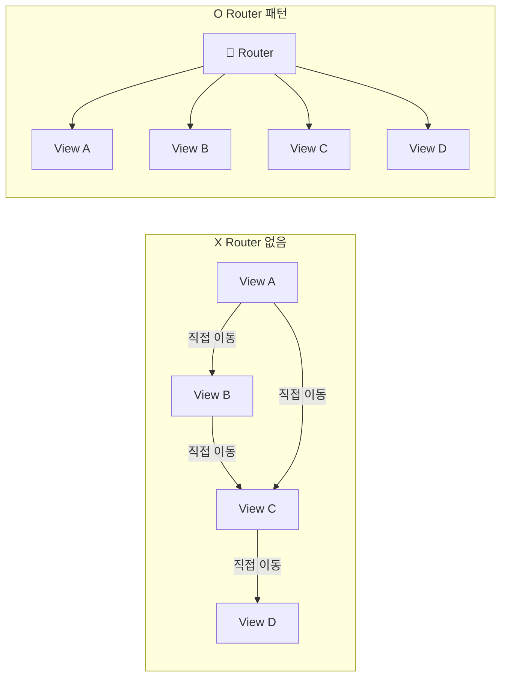
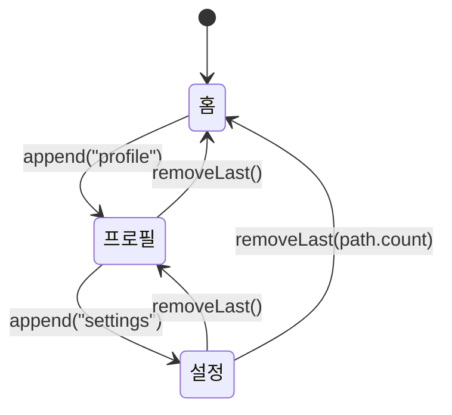
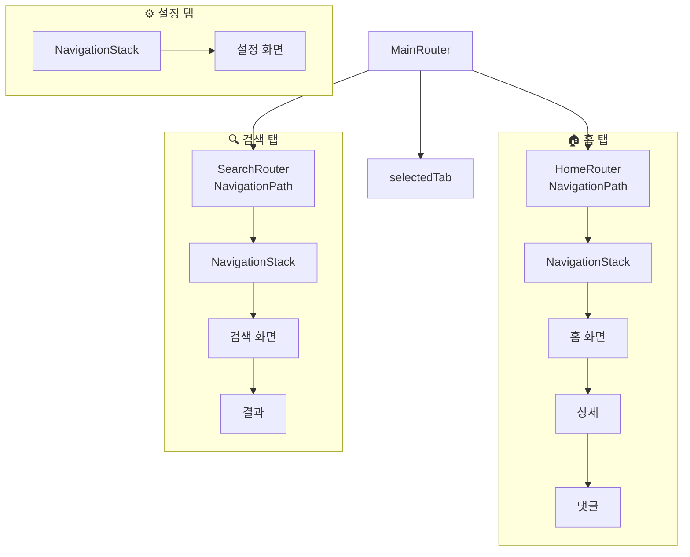
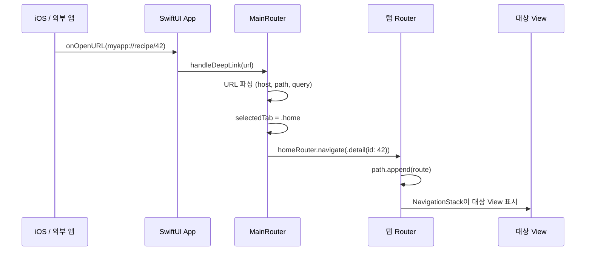

# 네비게이션 설계

> Router 패턴, NavigationPath, 딥링크 대응

## 개요

앱 화면이 10개, 20개로 늘어나면 "어디서 어디로 이동하는지"가 점점 복잡해집니다. 각 View가 자기만의 `NavigationLink`를 가지고 있으면, 화면 이동 흐름을 파악하기 어렵고 딥링크 대응도 힘들어지죠. Router 패턴은 **네비게이션 로직을 한 곳에 모아** 이 혼란을 해결합니다.

> 📊 **그림 1**: Router 패턴 전후 비교 — 분산 vs 중앙 관리




**선수 지식**: [NavigationStack](../04-navigation-design/01-navigation-stack.md), [01. MVVM 패턴](./01-mvvm.md)
**학습 목표**:
- NavigationPath로 프로그래밍 방식의 네비게이션 구현하기
- Router 패턴으로 화면 이동을 중앙 관리하기
- TabView에서 탭별 독립 네비게이션 설계하기
- 딥링크(URL)로 특정 화면에 직접 진입하기

## 왜 알아야 할까?

"로그인하면 홈 화면으로, 알림을 탭하면 상세 화면으로, 공유 링크를 열면 특정 게시물로..." 이런 복잡한 화면 전환을 각 View에 흩어놓으면 어떻게 될까요? 한 화면의 이동 경로를 바꾸려면 여러 파일을 찾아다녀야 하고, "이 화면에서 저 화면으로 갈 수 있나?"를 파악하기 어렵습니다.

Router 패턴을 적용하면 **모든 화면 이동 경로를 한 곳에서** 관리할 수 있어요. 마치 공항의 관제탑처럼요.

## 핵심 개념

### 개념 1: NavigationPath 이해하기

> 📊 **그림 2**: NavigationPath 스택 동작 — append와 removeLast




> 💡 **비유**: `NavigationPath`는 **빵 부스러기 길(bread crumb trail)**과 같습니다. 숲속을 걸으며 빵 부스러기를 떨어뜨리고, 돌아갈 때는 부스러기를 하나씩 주우며 되돌아가죠. `append()`로 새 화면을 쌓고, `removeLast()`로 뒤로 가는 겁니다.

`NavigationPath`는 타입에 상관없이 다양한 화면 경로를 하나의 스택으로 관리하는 SwiftUI의 핵심 도구입니다.

```swift
import SwiftUI

// NavigationPath의 기본 사용법
struct BasicNavigationExample: View {
    @State private var path = NavigationPath()

    var body: some View {
        NavigationStack(path: $path) {
            List {
                // 버튼으로 프로그래밍 방식 네비게이션
                Button("프로필로 이동") {
                    path.append("profile")    // 문자열 값 push
                }
                Button("설정으로 이동") {
                    path.append(42)           // 정수 값 push
                }
                Button("루트로 돌아가기") {
                    path.removeLast(path.count) // 전체 pop
                }
            }
            .navigationTitle("홈")
            .navigationDestination(for: String.self) { value in
                Text("문자열 화면: \(value)")
            }
            .navigationDestination(for: Int.self) { value in
                Text("숫자 화면: \(value)")
            }
        }
    }
}
```

### 개념 2: Route enum으로 타입 안전한 네비게이션

화면 경로를 enum으로 정의하면 **컴파일 타임에 잘못된 화면 이동을 방지**할 수 있습니다.

```swift
import SwiftUI

// 앱의 모든 화면을 열거형으로 정의
enum AppRoute: Hashable {
    case articleDetail(id: Int)
    case userProfile(userId: Int)
    case settings
    case search
}
```

### 개념 3: Router 패턴 구현

> 📊 **그림 3**: Router 패턴 아키텍처 — View와 Router의 관계

```mermaid
graph TD
    ROOT["RecipeAppView"] -->|소유| ROUTER["AppRouter<br/>(@Observable)"]
    ROUTER -->|path: NavigationPath| NAV["NavigationStack"]
    ROOT -->|.environment| HOME["RecipeHomeView"]
    ROOT -->|.environment| DETAIL["RecipeDetailView"]
    ROOT -->|.environment| SEARCH["RecipeSearchView"]
    HOME -->|router.navigateTo()| ROUTER
    DETAIL -->|router.goBack()| ROUTER
    ROUTER -->|navigationDestination<br/>switch route| DETAIL
    ROUTER -->|navigationDestination<br/>switch route| SEARCH
```


Router는 `@Observable` 클래스로 만들어 네비게이션 상태를 중앙 관리합니다.

```swift
import SwiftUI

// MARK: - Route 정의
enum Route: Hashable {
    case recipeDetail(id: Int)
    case search
    case favorites
    case profile(userId: String)
}

// MARK: - Router (네비게이션 관제탑)
@Observable
class AppRouter {
    var path = NavigationPath()

    // 화면 이동
    func navigateTo(_ route: Route) {
        path.append(route)
    }

    // 뒤로 가기
    func goBack() {
        guard !path.isEmpty else { return }
        path.removeLast()
    }

    // 루트로 돌아가기
    func goToRoot() {
        path.removeLast(path.count)
    }
}

// MARK: - Root View
struct RecipeAppView: View {
    @State private var router = AppRouter()

    var body: some View {
        NavigationStack(path: $router.path) {
            RecipeHomeView()
                .environment(router) // 하위 뷰에 Router 주입
                .navigationDestination(for: Route.self) { route in
                    // 모든 화면 전환을 한 곳에서 관리!
                    switch route {
                    case .recipeDetail(let id):
                        RecipeDetailView(recipeId: id)
                            .environment(router)
                    case .search:
                        RecipeSearchView()
                            .environment(router)
                    case .favorites:
                        FavoritesView()
                            .environment(router)
                    case .profile(let userId):
                        ProfileView(userId: userId)
                            .environment(router)
                    }
                }
        }
    }
}

// MARK: - 하위 View에서 Router 사용
struct RecipeHomeView: View {
    @Environment(AppRouter.self) private var router

    var body: some View {
        List {
            Button("레시피 상세") {
                router.navigateTo(.recipeDetail(id: 1))
            }
            Button("검색") {
                router.navigateTo(.search)
            }
            Button("즐겨찾기") {
                router.navigateTo(.favorites)
            }
        }
        .navigationTitle("레시피")
    }
}

// 각 하위 View 정의
struct RecipeDetailView: View {
    let recipeId: Int
    var body: some View {
        Text("레시피 #\(recipeId) 상세")
            .navigationTitle("레시피 상세")
    }
}

struct RecipeSearchView: View {
    var body: some View {
        Text("검색 화면")
            .navigationTitle("검색")
    }
}

struct FavoritesView: View {
    var body: some View {
        Text("즐겨찾기 화면")
            .navigationTitle("즐겨찾기")
    }
}

struct ProfileView: View {
    let userId: String
    var body: some View {
        Text("프로필: \(userId)")
            .navigationTitle("프로필")
    }
}
```

> 🔥 **실무 팁**: `navigationDestination(for:)`는 NavigationStack당 **타입별로 한 번만** 등록해야 합니다. 같은 타입을 여러 곳에서 등록하면 예기치 않은 동작이 발생할 수 있어요. 루트 View에서 한 번만 등록하는 것이 가장 안전합니다.

### 개념 4: TabView와 탭별 독립 네비게이션

> 📊 **그림 4**: TabView 탭별 독립 네비게이션 스택 구조




실제 앱은 대부분 TabView를 사용합니다. 각 탭이 **독립적인 네비게이션 스택**을 가져야 탭을 전환해도 이전 화면 상태가 유지됩니다.

```swift
import SwiftUI

// 탭 정의
enum AppTab: Int {
    case home = 0
    case search = 1
    case settings = 2
}

// 탭별 독립 Router
@Observable
class HomeRouter {
    var path = NavigationPath()

    enum Route: Hashable {
        case detail(id: Int)
        case comments(articleId: Int)
    }

    func navigate(to route: Route) {
        path.append(route)
    }

    func popToRoot() {
        path.removeLast(path.count)
    }
}

@Observable
class SearchRouter {
    var path = NavigationPath()

    enum Route: Hashable {
        case result(query: String)
        case detail(id: Int)
    }

    func navigate(to route: Route) {
        path.append(route)
    }
}

// 앱 전체 Router
@Observable
class MainRouter {
    var selectedTab: AppTab = .home
    var homeRouter = HomeRouter()
    var searchRouter = SearchRouter()
}

// 루트 TabView
struct MainTabView: View {
    @State private var router = MainRouter()

    var body: some View {
        TabView(selection: Binding(
            get: { router.selectedTab.rawValue },
            set: { router.selectedTab = AppTab(rawValue: $0) ?? .home }
        )) {
            // 각 탭이 독립적인 NavigationStack을 소유
            Tab("홈", systemImage: "house", value: AppTab.home.rawValue) {
                NavigationStack(path: $router.homeRouter.path) {
                    Text("홈 화면")
                        .navigationTitle("홈")
                }
            }

            Tab("검색", systemImage: "magnifyingglass", value: AppTab.search.rawValue) {
                NavigationStack(path: $router.searchRouter.path) {
                    Text("검색 화면")
                        .navigationTitle("검색")
                }
            }

            Tab("설정", systemImage: "gearshape", value: AppTab.settings.rawValue) {
                NavigationStack {
                    Text("설정 화면")
                        .navigationTitle("설정")
                }
            }
        }
    }
}
```

### 개념 5: 딥링크 처리

> 📊 **그림 5**: 딥링크 처리 흐름 — URL에서 화면 전환까지




외부 URL로 앱의 특정 화면에 직접 진입하는 딥링크를 Router와 연동할 수 있습니다.

```swift
import SwiftUI

// 딥링크 URL을 Route로 변환
extension MainRouter {
    func handleDeepLink(_ url: URL) {
        // myapp://recipe/42 형태의 URL 파싱
        guard let components = URLComponents(url: url, resolvingAgainstBaseURL: false),
              let host = components.host else { return }

        switch host {
        case "recipe":
            // 레시피 상세로 이동
            if let idString = components.path.split(separator: "/").first,
               let id = Int(idString) {
                selectedTab = .home
                homeRouter.navigate(to: .detail(id: id))
            }
        case "search":
            // 검색 탭으로 이동
            let query = components.queryItems?.first(where: { $0.name == "q" })?.value ?? ""
            selectedTab = .search
            searchRouter.navigate(to: .result(query: query))
        default:
            break
        }
    }
}

// App에서 딥링크 수신
// .onOpenURL { url in
//     router.handleDeepLink(url)
// }
```

## 더 깊이 알아보기

### Coordinator 패턴의 역사

네비게이션을 중앙 관리하는 아이디어는 UIKit 시절의 **Coordinator 패턴**에서 왔습니다. 2015년 Soroush Khanlou가 발표한 이 패턴은 UIKit의 `UINavigationController`를 Coordinator 객체가 관리하는 구조였어요. SwiftUI에서는 NavigationPath 덕분에 이 패턴이 훨씬 간결하게 구현됩니다.

WWDC 2022에서 Apple이 `NavigationStack`과 `NavigationPath`를 소개하면서 "프로그래밍 방식 네비게이션"이 공식적으로 지원되기 시작했고, 이전의 `NavigationView` + `NavigationLink(isActive:)`보다 훨씬 깔끔한 구조가 가능해졌습니다.

> 💡 **알고 계셨나요?**: iOS 26에서 TabView는 Liquid Glass 스타일의 떠 있는 탭바로 변경되었습니다. `tabItem(_:)` 수정자가 deprecated되고, 구조적 `Tab` 뷰를 사용하는 새로운 API가 도입되었어요. 스크롤 시 탭바가 자동으로 축소되는 동작도 추가되었습니다.

## 흔한 오해와 팁

> ⚠️ **흔한 오해**: "NavigationLink만으로도 충분하다" — 작은 앱에서는 맞지만, 딥링크, 조건부 네비게이션(로그인 필요), 프로그래밍 방식 이동(타이머 후 자동 이동 등)이 필요하면 NavigationPath 기반 Router가 필수입니다.

> 🔥 **실무 팁**: NavigationPath의 상태를 저장하고 복원하려면 Route enum에 `Codable`을 채택하세요. `NavigationPath`를 JSON으로 인코딩/디코딩하여 앱 재시작 후에도 마지막 화면 상태를 복원할 수 있습니다.

## 핵심 정리

| 개념 | 설명 |
|------|------|
| NavigationPath | 타입에 무관하게 화면 경로를 스택으로 관리하는 도구 |
| Route enum | 앱의 모든 화면 경로를 타입 안전하게 정의하는 열거형 |
| Router | NavigationPath를 소유하고 네비게이션 로직을 중앙 관리하는 @Observable 클래스 |
| 탭별 독립 Router | 각 Tab이 독립적인 NavigationPath를 가져 상태가 보존됨 |
| 딥링크 | URL을 파싱하여 Route로 변환한 뒤 Router로 네비게이션 |
| `Codable` Route | 네비게이션 상태를 저장/복원하기 위한 직렬화 지원 |

## 다음 섹션 미리보기

Router, Repository, ViewModel을 만들었지만, 이것들을 **어떻게 조립**해야 할까요? 다음 [04. 의존성 주입](./04-dependency-injection.md)에서는 SwiftUI의 Environment 시스템을 활용한 의존성 주입(DI)으로 이 모든 것을 우아하게 연결하는 방법을 배웁니다.

## 참고 자료

- [NavigationStack - Apple 공식 문서](https://developer.apple.com/documentation/swiftui/navigationstack) — NavigationStack과 NavigationPath API
- [The SwiftUI cookbook for navigation - WWDC 2022](https://developer.apple.com/videos/play/wwdc2022/10054/) — NavigationPath 기반 프로그래밍 네비게이션
- [NavigationPath with Router pattern - tanaschita.com](https://tanaschita.com/swiftui-navigationpath/) — Observable Router 구현 패턴
- [NavigationPath with TabView - tanaschita.com](https://tanaschita.com/swiftui-navigation-path-with-tabview/) — 탭별 독립 네비게이션 설계
