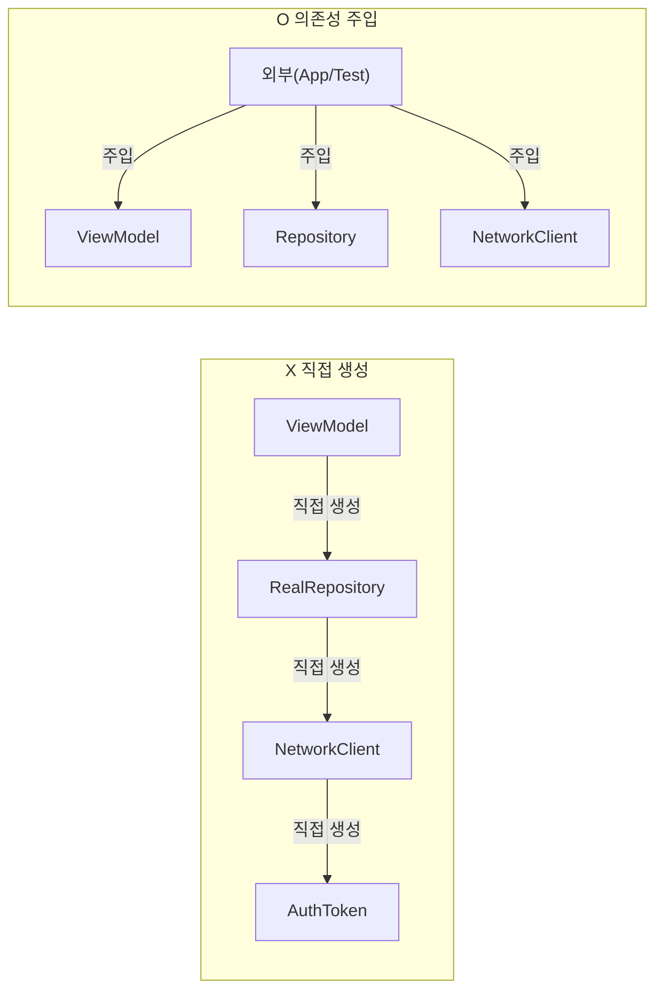
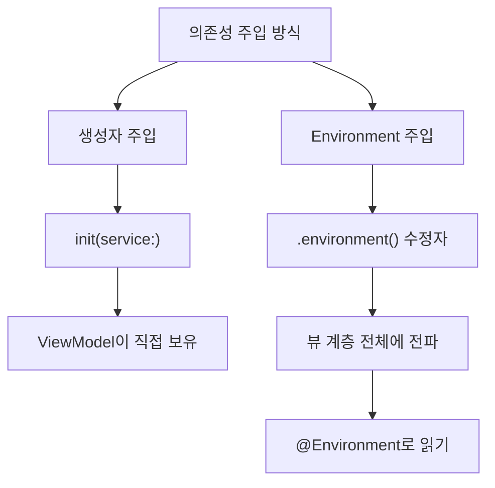
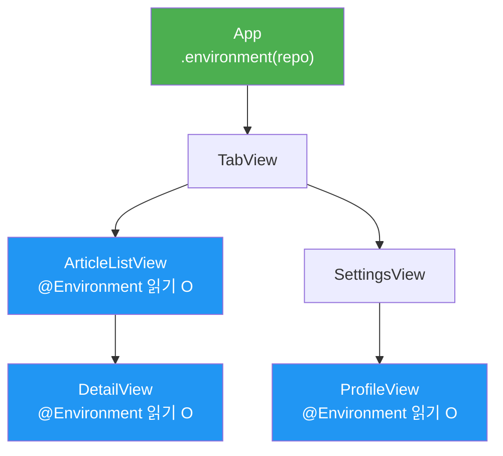
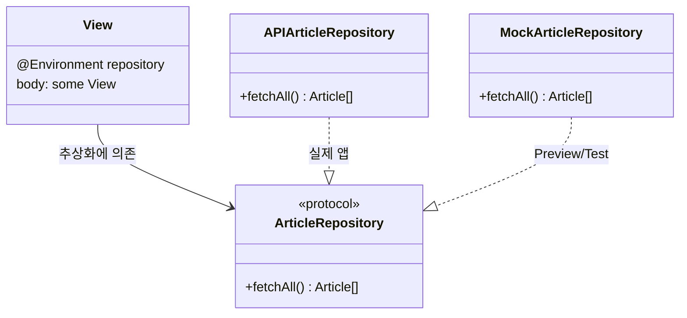

# 의존성 주입

> DI 원칙, Environment 활용, 테스트 용이성 확보

## 개요

지금까지 ViewModel에 Repository를 `init`으로 전달하고, Router를 `.environment()`로 주입했습니다. 이런 것들이 모두 **의존성 주입(Dependency Injection, DI)**이에요. 이번 섹션에서는 DI의 원칙을 정리하고, SwiftUI가 제공하는 강력한 DI 시스템인 `@Environment`를 본격적으로 활용하는 방법을 배웁니다.

**선수 지식**: [02. Repository 패턴](./02-repository.md), [@Environment와 앱 전역 상태](../05-state-management/03-environment.md)
**학습 목표**:
- 의존성 주입이 무엇이고 왜 필요한지 이해
- 생성자 주입과 Environment 주입의 차이점 파악
- `@Entry` 매크로로 커스텀 Environment 값 만들기
- DI를 활용한 Preview와 테스트 환경 설정

## 왜 알아야 할까?

앱이 커지면 객체들이 서로 복잡하게 얽힙니다. ViewModel은 Repository가 필요하고, Repository는 네트워크 클라이언트가 필요하고, 네트워크 클라이언트는 인증 토큰이 필요하죠. 이 의존성들을 각 객체가 **스스로 생성**하면 두 가지 문제가 생겨요:

1. **테스트 불가**: 실제 네트워크 클라이언트를 가짜로 바꿀 수 없음
2. **결합도 증가**: 하나를 바꾸면 연쇄적으로 다른 것도 수정해야 함

의존성 주입은 "필요한 것을 직접 만들지 말고, **외부에서 받아라**"라는 간단한 원칙으로 이 문제를 해결합니다.

> 📊 **그림 1**: 직접 생성 vs 의존성 주입 비교




## 핵심 개념

### 개념 1: 의존성 주입이란?

> 💡 **비유**: 의존성 주입은 **레고 조립**과 같습니다. 레고 블록은 어떤 바닥판 위에 꽂히든 작동합니다. 블록이 "나는 특정 바닥판에서만 동작해!"라고 하지 않죠. 블록에게 바닥판을 **건네주면(주입하면)** 그 위에서 동작합니다. 빨간 바닥판이든, 파란 바닥판이든 상관없이요.

의존성 주입에는 크게 세 가지 방식이 있습니다:

| 방식 | 설명 | SwiftUI에서 |
|------|------|-------------|
| **생성자 주입** | `init`에서 의존성을 받음 | ViewModel `init(repository:)` |
| **Environment 주입** | 뷰 계층을 통해 주입 | `.environment()` 수정자 |
| **프로퍼티 주입** | 프로퍼티에 직접 할당 | 거의 사용하지 않음 |

> 📊 **그림 2**: SwiftUI에서의 DI 방식 흐름




### 개념 2: 생성자 주입 — 가장 명확한 방법

앞서 Repository 패턴에서 이미 사용했던 방식입니다. 가장 명확하고 추적하기 쉬운 DI 방법이에요.

```swift
import SwiftUI

// 프로토콜 정의
protocol WeatherService: Sendable {
    func fetchTemperature(for city: String) async throws -> Double
}

// 실제 구현
struct RealWeatherService: WeatherService {
    func fetchTemperature(for city: String) async throws -> Double {
        // 실제 API 호출
        let url = URL(string: "https://api.example.com/weather?city=\(city)")!
        let (data, _) = try await URLSession.shared.data(from: url)
        let result = try JSONDecoder().decode(WeatherResponse.self, from: data)
        return result.temperature
    }
}

struct WeatherResponse: Codable {
    let temperature: Double
}

// Mock 구현 (테스트용)
struct MockWeatherService: WeatherService {
    var temperature: Double = 23.5

    func fetchTemperature(for city: String) async throws -> Double {
        return temperature
    }
}

// ViewModel — 생성자로 의존성을 주입받습니다
@Observable
@MainActor
class WeatherViewModel {
    var temperature: Double?
    var isLoading = false

    // 프로토콜 타입으로 받으므로 어떤 구현이든 OK
    private let service: any WeatherService

    init(service: any WeatherService = RealWeatherService()) {
        self.service = service
    }

    func loadWeather(for city: String) async {
        isLoading = true
        temperature = try? await service.fetchTemperature(for: city)
        isLoading = false
    }
}
```

### 개념 3: Environment 주입 — SwiftUI의 네이티브 DI

SwiftUI의 `@Environment`는 뷰 계층 어디서든 의존성에 접근할 수 있게 해주는 **내장 DI 컨테이너**입니다. 중간 뷰들이 의존성을 전달할 필요 없이, 필요한 곳에서 바로 꺼내 쓸 수 있어요.

> 📊 **그림 3**: Environment 주입의 뷰 계층 전파




```swift
import SwiftUI

// MARK: - @Entry 매크로로 커스텀 Environment 값 정의
// iOS 18+ / Xcode 16+에서 사용 가능한 간편 문법
extension EnvironmentValues {
    @Entry var articleRepository: any ArticleRepository = APIArticleRepository()
}

// MARK: - 사용할 프로토콜과 구현
protocol ArticleRepository: Sendable {
    func fetchAll() async throws -> [Article]
}

struct Article: Identifiable, Codable {
    let id: Int
    let title: String
    let body: String
}

struct APIArticleRepository: ArticleRepository {
    func fetchAll() async throws -> [Article] {
        let url = URL(string: "https://jsonplaceholder.typicode.com/posts")!
        let (data, _) = try await URLSession.shared.data(from: url)
        return try JSONDecoder().decode([Article].self, from: data)
    }
}

struct MockArticleRepository: ArticleRepository {
    func fetchAll() async throws -> [Article] {
        [
            Article(id: 1, title: "테스트 기사", body: "내용"),
            Article(id: 2, title: "두 번째 기사", body: "내용 2"),
        ]
    }
}
```

> 💡 **알고 계셨나요?**: `@Entry` 매크로는 WWDC 2024에서 소개되었습니다. 이전에는 `EnvironmentKey` 프로토콜을 채택하고 `defaultValue`를 정의하는 보일러플레이트 코드가 필요했는데, `@Entry` 한 줄로 줄어들었어요.

### 개념 4: Environment에서 의존성 읽기

```swift
// MARK: - View에서 Environment 의존성 사용
struct ArticleListView: View {
    // Environment에서 Repository를 꺼내옵니다
    @Environment(\.articleRepository) private var repository
    @State private var articles: [Article] = []
    @State private var isLoading = false

    var body: some View {
        NavigationStack {
            List(articles) { article in
                VStack(alignment: .leading) {
                    Text(article.title)
                        .font(.headline)
                    Text(article.body)
                        .font(.subheadline)
                        .foregroundStyle(.secondary)
                        .lineLimit(2)
                }
            }
            .navigationTitle("기사 목록")
            .overlay {
                if isLoading { ProgressView() }
            }
            .task {
                isLoading = true
                articles = (try? await repository.fetchAll()) ?? []
                isLoading = false
            }
        }
    }
}

// 앱 루트에서 의존성 주입
struct MyApp: View {
    var body: some View {
        ArticleListView()
            .environment(\.articleRepository, APIArticleRepository())
    }
}

// Preview에서는 Mock 주입!
#Preview {
    ArticleListView()
        .environment(\.articleRepository, MockArticleRepository())
}
```

### 개념 5: 전통적인 EnvironmentKey 방식

`@Entry`를 사용할 수 없는 환경(iOS 17 이하)에서는 이 방식을 씁니다.

```swift
import SwiftUI

// 1. 키 정의
struct ThemeKey: EnvironmentKey {
    static let defaultValue: AppTheme = .system
}

// 2. EnvironmentValues에 프로퍼티 추가
extension EnvironmentValues {
    var appTheme: AppTheme {
        get { self[ThemeKey.self] }
        set { self[ThemeKey.self] = newValue }
    }
}

// 3. 테마 열거형
enum AppTheme {
    case light, dark, system
}

// 4. 사용
struct ThemeAwareView: View {
    @Environment(\.appTheme) private var theme

    var body: some View {
        Text("현재 테마: \(String(describing: theme))")
    }
}
```

> ⚠️ **흔한 오해**: "`@Environment`는 시스템 값만 읽는 것" — 아닙니다! `@Entry`나 `EnvironmentKey`로 커스텀 값을 얼마든지 만들 수 있고, 이것이 SwiftUI의 공식 DI 메커니즘입니다.

## 실습: 직접 해보기

여러 의존성을 조합하는 실전 예제를 만들어봅시다.

```swift
import SwiftUI

// MARK: - 서비스 프로토콜들
protocol UserService: Sendable {
    func fetchCurrentUser() async throws -> AppUser
}

protocol NotificationService: Sendable {
    func getUnreadCount() async throws -> Int
}

// MARK: - Model
struct AppUser: Codable {
    let id: String
    let name: String
    let email: String
}

// MARK: - Mock 구현
struct MockUserService: UserService {
    func fetchCurrentUser() async throws -> AppUser {
        AppUser(id: "1", name: "김스위프트", email: "swift@example.com")
    }
}

struct MockNotificationService: NotificationService {
    func getUnreadCount() async throws -> Int { 5 }
}

// MARK: - Environment 등록
extension EnvironmentValues {
    @Entry var userService: any UserService = MockUserService()
    @Entry var notificationService: any NotificationService = MockNotificationService()
}

// MARK: - ViewModel
@Observable
@MainActor
class ProfileViewModel {
    var user: AppUser?
    var unreadCount = 0
    var isLoading = false

    private let userService: any UserService
    private let notificationService: any NotificationService

    init(
        userService: any UserService,
        notificationService: any NotificationService
    ) {
        self.userService = userService
        self.notificationService = notificationService
    }

    func load() async {
        isLoading = true
        async let fetchedUser = userService.fetchCurrentUser()
        async let fetchedCount = notificationService.getUnreadCount()

        do {
            user = try await fetchedUser
            unreadCount = try await fetchedCount
        } catch {
            print("로드 실패: \(error)")
        }
        isLoading = false
    }
}

// MARK: - View
struct ProfileView: View {
    // Environment에서 서비스를 꺼내서 ViewModel에 전달
    @Environment(\.userService) private var userService
    @Environment(\.notificationService) private var notificationService
    @State private var viewModel: ProfileViewModel?

    var body: some View {
        NavigationStack {
            Group {
                if let vm = viewModel, let user = vm.user {
                    List {
                        Section("프로필") {
                            Label(user.name, systemImage: "person.fill")
                            Label(user.email, systemImage: "envelope.fill")
                        }
                        Section("알림") {
                            Label("읽지 않은 알림: \(vm.unreadCount)개",
                                  systemImage: "bell.badge")
                        }
                    }
                } else {
                    ProgressView("로딩 중...")
                }
            }
            .navigationTitle("내 프로필")
            .task {
                let vm = ProfileViewModel(
                    userService: userService,
                    notificationService: notificationService
                )
                viewModel = vm
                await vm.load()
            }
        }
    }
}

#Preview {
    ProfileView()
    // 기본값이 Mock이므로 별도 주입 없이 Preview 동작!
}
```

## 더 깊이 알아보기

### DI의 역사

의존성 주입이라는 용어는 2004년 Martin Fowler가 "Inversion of Control Containers and the Dependency Injection pattern"이라는 글에서 처음 사용했습니다. 하지만 그 원리는 SOLID 원칙의 **D(Dependency Inversion Principle)** — "상위 모듈은 하위 모듈에 의존하지 않고, 둘 다 추상화에 의존한다"에서 비롯되었어요.

SwiftUI에서는 `@Environment`가 이 원칙을 자연스럽게 구현합니다. View(상위)도 Service(하위)도 구체적인 구현이 아닌 **프로토콜(추상화)**에 의존하고, `.environment()` 수정자로 실제 구현을 주입하죠.

> 📊 **그림 4**: 의존성 역전 원칙 (DIP) 구조




> 🔥 **실무 팁**: DI Container 라이브러리(Swinject 등)를 무리해서 도입하지 마세요. SwiftUI의 `@Environment`만으로도 대부분의 DI 요구사항을 충족할 수 있습니다. 외부 라이브러리는 **SwiftUI를 쓸 수 없는 계층**에서만 고려하세요.

## 흔한 오해와 팁

> ⚠️ **흔한 오해**: "DI는 대규모 엔터프라이즈 앱에서나 필요하다" — Preview에서 Mock 데이터를 쓰는 것도 DI입니다. 이미 여러분은 DI를 하고 있어요!

> 💡 **알고 계셨나요?**: SwiftUI의 `.environment()` 수정자는 **해당 뷰와 모든 하위 뷰**에 영향을 줍니다. 하위 뷰에서 다시 `.environment()`를 호출하면 그 지점부터 값이 덮어씌워져요. 이를 활용하면 특정 화면만 다른 의존성을 사용하게 만들 수 있습니다.

> 🔥 **실무 팁**: `@Entry`의 기본값을 Mock으로 설정하면, Preview에서 별도 `.environment()` 없이도 바로 동작합니다. 실제 앱에서만 진짜 구현을 주입하면 되죠.

## 핵심 정리

| 개념 | 설명 |
|------|------|
| 의존성 주입(DI) | 필요한 객체를 직접 만들지 않고 외부에서 받는 설계 원칙 |
| 생성자 주입 | `init(service:)`로 의존성을 전달 — 가장 명확한 방식 |
| Environment 주입 | `.environment()` 수정자로 뷰 계층을 통해 전달 |
| `@Entry` 매크로 | 커스텀 Environment 값을 한 줄로 정의하는 간편 문법 |
| EnvironmentKey | 전통적인 커스텀 Environment 값 정의 방식 |
| 의존성 역전 원칙 | 구체 타입이 아닌 프로토콜(추상화)에 의존하는 SOLID 원칙 |

## 다음 섹션 미리보기

Ch8 아키텍처 패턴을 모두 마쳤습니다! MVVM, Repository, Router, DI — 이 네 가지를 조합하면 **유지보수 가능하고 테스트 가능한** 앱 구조를 설계할 수 있습니다. 다음 [Ch9. 애니메이션과 인터랙션](../09-animation/01-basic-animation.md)에서는 앱에 **생동감**을 불어넣는 방법을 배웁니다.

## 참고 자료

- [Environment Values - Apple 공식 문서](https://developer.apple.com/documentation/swiftui/environmentvalues) — SwiftUI Environment 시스템 전체 레퍼런스
- [Entry 매크로 - Apple 공식 문서](https://developer.apple.com/documentation/swiftui/entry()) — 커스텀 Environment 값 정의
- [Inversion of Control Containers and the Dependency Injection pattern - Martin Fowler](https://martinfowler.com/articles/injection.html) — DI의 원조 글
- [Approachable Concurrency in Swift 6.2 - avanderlee.com](https://www.avanderlee.com/concurrency/approachable-concurrency-in-swift-6-2-a-clear-guide/) — Swift 6 동시성과 DI 호환성
