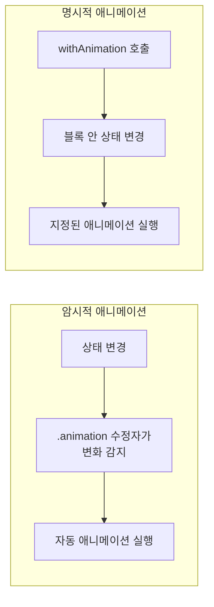
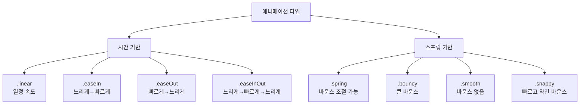
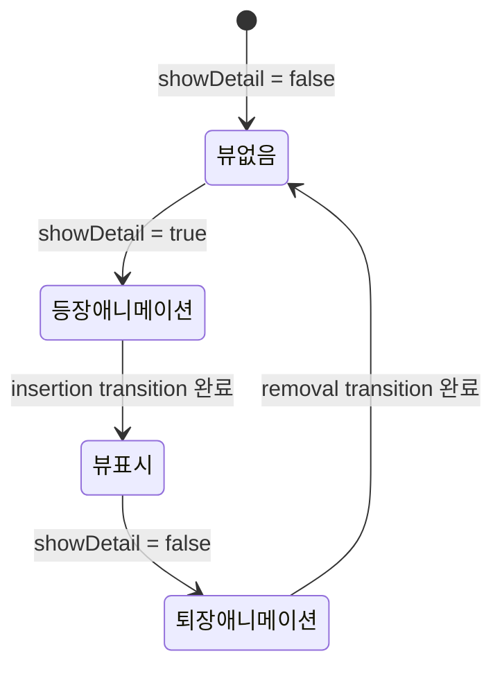

# 기본 애니메이션

> withAnimation, 암시적/명시적 애니메이션, transition

## 개요

SwiftUI에서 애니메이션은 상태 변화를 시각적으로 부드럽게 표현하는 방법입니다. 복잡한 타이머나 프레임 계산 없이, 단 한 줄의 코드로 전문적인 애니메이션을 만들 수 있죠. 이 섹션에서는 SwiftUI 애니메이션의 두 가지 핵심 축인 **암시적 애니메이션**과 **명시적 애니메이션**, 그리고 뷰의 등장/퇴장을 다루는 **Transition**을 배웁니다.

**선수 지식**: [@State와 @Binding](../05-state-management/01-state-binding.md), [버튼과 인터랙션](../03-swiftui-start/03-button-interaction.md)
**학습 목표**:
- 암시적 애니메이션(`.animation`)과 명시적 애니메이션(`withAnimation`)의 차이 이해하기
- 다양한 애니메이션 타입(linear, easeIn, spring 등) 사용하기
- `transition`으로 뷰의 등장/퇴장 효과 구현하기
- 애니메이션 완료 콜백 활용하기 (iOS 17+)

## 왜 알아야 할까?

"좋은 앱"과 "훌륭한 앱"의 차이는 종종 애니메이션에 있습니다. 버튼을 탭했을 때 화면이 갑자기 바뀌는 것보다, 부드럽게 전환되는 것이 훨씬 자연스럽죠. Apple은 iOS의 모든 곳에서 애니메이션을 사용합니다. 앱 열기, 화면 전환, 키보드 등장까지요. SwiftUI는 이런 애니메이션을 놀라울 정도로 쉽게 구현할 수 있게 해줍니다.

## 핵심 개념

> 📊 **그림 1**: SwiftUI 애니메이션의 두 가지 방식 비교




### 개념 1: 암시적 애니메이션 — `.animation(_:value:)`

> 💡 **비유**: 암시적 애니메이션은 **자동문**과 같습니다. 문 앞에 서기만 하면(상태가 바뀌면) 문이 알아서 부드럽게 열리죠. "열려라"고 말할 필요 없이, 변화가 감지되면 자동으로 애니메이션됩니다.

`.animation(_:value:)` 수정자를 뷰에 붙이면, 지정한 `value`가 변경될 때마다 그 뷰의 변화가 자동으로 애니메이션됩니다.

```swift
import SwiftUI

struct ImplicitAnimationView: View {
    @State private var scale: CGFloat = 1.0

    var body: some View {
        VStack(spacing: 30) {
            // 하트가 커졌다 작아졌다 하는 애니메이션
            Image(systemName: "heart.fill")
                .font(.system(size: 80))
                .foregroundStyle(.red)
                .scaleEffect(scale)
                // scale 값이 바뀔 때마다 자동으로 애니메이션 적용
                .animation(.easeInOut(duration: 0.3), value: scale)

            Button("두근두근") {
                // 상태만 바꾸면 애니메이션은 자동!
                scale = scale == 1.0 ? 1.5 : 1.0
            }
            .buttonStyle(.borderedProminent)
        }
    }
}

#Preview {
    ImplicitAnimationView()
}
```

> ⚠️ **흔한 오해**: `.animation(.easeInOut)` 처럼 `value` 파라미터 없이 쓰는 방식은 iOS 15에서 deprecated되었습니다. 반드시 `.animation(.easeInOut, value: someValue)` 형태로 **어떤 값의 변화에 반응할지** 명시해야 합니다. 이렇게 해야 의도하지 않은 애니메이션이 발생하는 것을 막을 수 있어요.

### 개념 2: 명시적 애니메이션 — `withAnimation`

> 💡 **비유**: 명시적 애니메이션은 **리모컨**과 같습니다. "지금 이 동작을 부드럽게 실행해!"라고 직접 명령하는 거죠. 어떤 상태 변화를 애니메이션할지 정확히 제어할 수 있습니다.

`withAnimation` 함수로 감싼 상태 변경은 모두 애니메이션됩니다. 암시적 방식보다 **어떤 변화를 애니메이션할지** 더 정확하게 제어할 수 있어요.

```swift
import SwiftUI

struct ExplicitAnimationView: View {
    @State private var isExpanded = false
    @State private var rotation: Double = 0

    var body: some View {
        VStack(spacing: 30) {
            // 회전하는 별
            Image(systemName: "star.fill")
                .font(.system(size: 60))
                .foregroundStyle(.yellow)
                .rotationEffect(.degrees(rotation))

            // 확장되는 박스
            RoundedRectangle(cornerRadius: 16)
                .fill(.blue.gradient)
                .frame(
                    width: isExpanded ? 300 : 150,
                    height: isExpanded ? 200 : 100
                )

            Button("변환") {
                // withAnimation 블록 안의 모든 상태 변경이 애니메이션됨
                withAnimation(.spring(duration: 0.5, bounce: 0.3)) {
                    isExpanded.toggle()
                    rotation += 72
                }
            }
            .buttonStyle(.borderedProminent)
        }
    }
}

#Preview {
    ExplicitAnimationView()
}
```

iOS 17부터는 `withAnimation`에 **완료 콜백**을 추가할 수 있습니다. 애니메이션이 끝난 후 다음 동작을 이어서 실행할 수 있죠.

```swift
// 애니메이션 체이닝 — 첫 번째 애니메이션이 끝나면 두 번째 실행
withAnimation(.easeIn(duration: 0.3)) {
    scale = 1.5
} completion: {
    // 첫 번째 애니메이션 완료 후 실행
    withAnimation(.easeOut(duration: 0.2)) {
        scale = 1.0
    }
}
```

### 개념 3: 애니메이션 타입

> 📊 **그림 2**: 애니메이션 타입별 속도 곡선 특성




SwiftUI는 다양한 내장 애니메이션 타입을 제공합니다.

| 애니메이션 | 설명 | 용도 |
|-----------|------|------|
| `.linear` | 일정한 속도로 움직임 | 로딩 인디케이터, 반복 회전 |
| `.easeIn` | 느리게 시작해서 빠르게 끝남 | 화면 퇴장 |
| `.easeOut` | 빠르게 시작해서 느리게 끝남 | 화면 등장 |
| `.easeInOut` | 느리게 시작하고 끝남 | 일반적인 전환 |
| `.spring` | 스프링 물리 기반, 자연스러운 움직임 | **iOS 17+ 기본값**, 대부분의 UI |
| `.bouncy` | 바운스가 있는 스프링 | 장난스러운 인터랙션 |
| `.smooth` | 바운스 없는 부드러운 스프링 | 차분한 전환 |
| `.snappy` | 약간의 바운스가 있는 빠른 스프링 | 버튼 반응 |

> 💡 **알고 계셨나요?**: iOS 17부터 `withAnimation`의 기본 애니메이션이 `.easeInOut`에서 **`.smooth` 스프링**으로 변경되었습니다. Apple은 스프링 애니메이션이 현실 세계의 물리 법칙을 반영하기 때문에 더 자연스럽다고 판단한 거예요. 그래서 `withAnimation { }` 만 쓰면 자동으로 부드러운 스프링이 적용됩니다.

```swift
import SwiftUI

struct AnimationTypesView: View {
    @State private var move = false

    var body: some View {
        VStack(spacing: 16) {
            // 각 애니메이션 타입을 비교해 볼 수 있는 뷰
            ForEach(animationTypes, id: \.name) { item in
                HStack {
                    Text(item.name)
                        .frame(width: 80, alignment: .leading)
                        .font(.caption)

                    Circle()
                        .fill(item.color)
                        .frame(width: 30, height: 30)
                        // 각각 다른 애니메이션 타입 적용
                        .offset(x: move ? 150 : 0)
                        .animation(item.animation, value: move)
                }
            }

            Button("이동") {
                move.toggle()
            }
            .buttonStyle(.borderedProminent)
            .padding(.top)
        }
        .padding()
    }

    // 애니메이션 타입 비교 데이터
    var animationTypes: [(name: String, animation: Animation, color: Color)] {
        [
            ("linear", .linear(duration: 1), .red),
            ("easeIn", .easeIn(duration: 1), .orange),
            ("easeOut", .easeOut(duration: 1), .yellow),
            ("spring", .spring(duration: 1, bounce: 0.5), .green),
            ("bouncy", .bouncy, .blue),
            ("smooth", .smooth, .purple),
        ]
    }
}

#Preview {
    AnimationTypesView()
}
```

### 개념 4: Transition — 뷰의 등장과 퇴장

> 📊 **그림 3**: Transition의 동작 원리 — 조건부 뷰의 등장과 퇴장




> 💡 **비유**: Transition은 **무대 등장 방식**입니다. 배우가 왼쪽에서 걸어 나올 수도, 조명이 서서히 밝아지며 나타날 수도, 위에서 내려올 수도 있죠. SwiftUI의 Transition은 `if` 문으로 뷰가 나타나거나 사라질 때의 **등장/퇴장 연출**을 정합니다.

```swift
import SwiftUI

struct TransitionView: View {
    @State private var showDetail = false

    var body: some View {
        VStack(spacing: 20) {
            Button(showDetail ? "숨기기" : "보여주기") {
                withAnimation(.spring(duration: 0.4, bounce: 0.2)) {
                    showDetail.toggle()
                }
            }
            .buttonStyle(.borderedProminent)

            if showDetail {
                // 뷰가 나타날 때 아래에서 슬라이드 + 페이드
                VStack(spacing: 12) {
                    Image(systemName: "sparkles")
                        .font(.largeTitle)
                    Text("안녕하세요!")
                        .font(.title2)
                    Text("Transition으로 등장했습니다")
                        .foregroundStyle(.secondary)
                }
                .padding(24)
                .background(.blue.opacity(0.1), in: .rect(cornerRadius: 16))
                .transition(.move(edge: .bottom).combined(with: .opacity))
            }
        }
        .padding()
    }
}

#Preview {
    TransitionView()
}
```

주요 Transition 타입:

| Transition | 효과 |
|-----------|------|
| `.opacity` | 페이드 인/아웃 |
| `.slide` | 좌에서 등장, 우로 퇴장 |
| `.scale` | 작아지며 사라짐/커지며 등장 |
| `.move(edge:)` | 지정한 방향에서 슬라이드 |
| `.push(from:)` | 밀어내기 (iOS 17+) |
| `.blurReplace` | 블러와 함께 교체 (iOS 17+) |
| `.combined(with:)` | 두 Transition 조합 |

### 개념 5: 범위 지정 애니메이션 (iOS 17+)

iOS 17에서 도입된 `.animation(_:body:)` 수정자는 **어떤 속성만 애니메이션할지** 정밀하게 지정할 수 있습니다.

```swift
import SwiftUI

struct ScopedAnimationView: View {
    @State private var isActive = false

    var body: some View {
        Circle()
            .fill(isActive ? .green : .red)
            .frame(width: 100, height: 100)
            // body 클로저 안의 수정자만 애니메이션 적용
            .animation(.smooth) {
                $0.scaleEffect(isActive ? 1.5 : 1.0) // 크기만 애니메이션
            }
            // 색상 변화는 애니메이션 범위 밖 → 즉시 변경
            .onTapGesture {
                isActive.toggle()
            }
    }
}

#Preview {
    ScopedAnimationView()
}
```

## 더 깊이 알아보기

### SwiftUI 애니메이션의 탄생

SwiftUI가 WWDC 2019에서 처음 공개되었을 때, 개발자들은 애니메이션의 단순함에 놀랐습니다. UIKit에서는 `UIView.animate(withDuration:animations:completion:)`이라는 긴 클로저 체인으로 애니메이션을 만들어야 했거든요. SwiftUI는 **상태 변화 → 자동 애니메이션**이라는 선언적 패러다임을 도입했습니다.

WWDC 2023에서는 "Explore SwiftUI animation" 세션을 통해 스프링 기반 기본 애니메이션, `PhaseAnimator`, `KeyframeAnimator`, 그리고 `withAnimation` 완료 콜백이 소개되었습니다. 이때부터 SwiftUI 애니메이션은 UIKit의 기능을 대부분 따라잡았다는 평가를 받게 됩니다.

iOS 26에서는 `@Animatable` 매크로가 추가되어 커스텀 뷰나 Shape의 프로퍼티를 자동으로 보간(interpolate)해 주는 기능이 등장했습니다. 더 이상 `animatableData`를 수동으로 구현할 필요가 없어진 거죠.

## 흔한 오해와 팁

> ⚠️ **흔한 오해**: "애니메이션은 body가 호출될 때마다 실행된다" — 아닙니다. 애니메이션은 **상태가 변경될 때만** 트리거됩니다. `body`가 재계산되더라도 관련 상태가 바뀌지 않으면 애니메이션은 발생하지 않아요.

> 🔥 **실무 팁**: `withAnimation`과 `.animation(value:)`를 동시에 사용하면 충돌할 수 있습니다. 한 뷰에 대해서는 **한 가지 방식**으로 통일하세요. 일반적으로 `withAnimation`(명시적)이 더 예측 가능하고 제어하기 쉬워서 실무에서 선호됩니다.

> 🔥 **실무 팁**: 애니메이션 반복이 필요하면 `.repeatForever()`를 사용하세요. 로딩 인디케이터 같은 무한 반복 애니메이션에 유용합니다: `.animation(.linear(duration: 1).repeatForever(autoreverses: false), value: rotation)`

## 핵심 정리

| 개념 | 설명 |
|------|------|
| 암시적 애니메이션 | `.animation(_:value:)` — 값 변경 시 자동 애니메이션 |
| 명시적 애니메이션 | `withAnimation { }` — 블록 안 상태 변경을 애니메이션 |
| 애니메이션 타입 | `.linear`, `.easeInOut`, `.spring`, `.bouncy`, `.smooth`, `.snappy` |
| Transition | `.opacity`, `.slide`, `.scale`, `.move(edge:)` — 뷰 등장/퇴장 연출 |
| 완료 콜백 (iOS 17+) | `withAnimation { } completion: { }` — 연쇄 애니메이션 |
| 범위 지정 (iOS 17+) | `.animation(_:body:)` — 특정 속성만 애니메이션 |
| 기본 스프링 (iOS 17+) | `withAnimation { }` 의 기본값이 `.smooth` 스프링으로 변경 |

## 다음 섹션 미리보기

기본 애니메이션을 마스터했다면, 이제 더 역동적인 표현이 가능합니다. 다음 [02. 고급 애니메이션](./02-advanced-animation.md)에서는 스프링 물리학을 정밀하게 제어하고, `KeyframeAnimator`로 영화같은 다단계 애니메이션을, `PhaseAnimator`로 자동 반복 애니메이션을 만드는 방법을 배웁니다.

## 참고 자료

- [Animations - Apple 공식 문서](https://developer.apple.com/documentation/swiftui/animations) — SwiftUI 애니메이션 전체 개요
- [Explore SwiftUI animation - WWDC 2023](https://developer.apple.com/videos/play/wwdc2023/10156/) — iOS 17 애니메이션 신기능 총정리
- [withAnimation 완료 콜백 - Apple 공식 문서](https://developer.apple.com/documentation/swiftui/withanimation(_:completioncriteria:_:completion:)) — 애니메이션 완료 후 동작 실행
- [Animating views and transitions - Apple 튜토리얼](https://developer.apple.com/tutorials/swiftui/animating-views-and-transitions) — 공식 SwiftUI 애니메이션 튜토리얼
