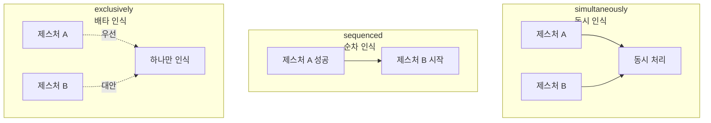
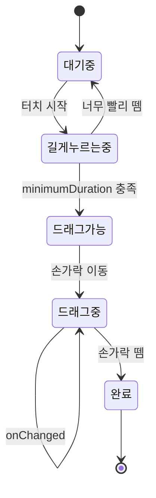
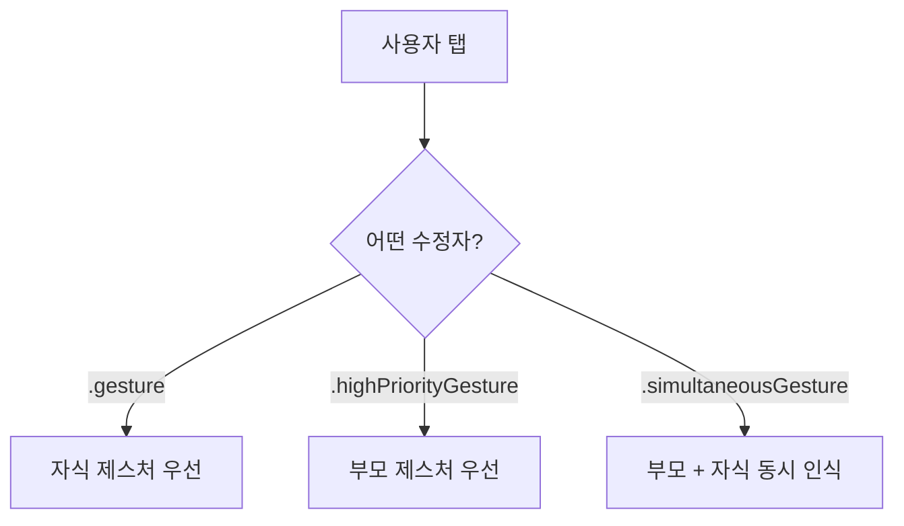

# 제스처

> TapGesture, DragGesture, MagnifyGesture, 제스처 조합

## 개요

터치스크린의 진짜 매력은 **직접 만지는 느낌**이죠. 탭, 드래그, 핀치, 회전 — 이런 제스처를 인식하고 반응하는 것이 모바일 앱의 핵심입니다. SwiftUI는 제스처를 뷰에 **선언적으로** 붙일 수 있게 해주고, 앞서 배운 애니메이션과 결합하면 정말 인터랙티브한 UI를 만들 수 있습니다.

**선수 지식**: [01. 기본 애니메이션](./01-basic-animation.md), [@State와 @Binding](../05-state-management/01-state-binding.md)
**학습 목표**:
- `TapGesture`, `LongPressGesture`로 탭/길게 누르기 인식하기
- `DragGesture`로 드래그 가능한 UI 만들기
- `MagnifyGesture`, `RotateGesture`로 핀치/회전 구현하기
- `simultaneously`, `sequenced`, `exclusively`로 제스처 조합하기
- `@GestureState`로 제스처 중 임시 상태 관리하기

## 왜 알아야 할까?

사진 앱에서 두 손가락으로 확대하기, 지도 앱에서 드래그하여 이동하기, 메일 앱에서 밀어서 삭제하기 — 이 모든 것이 제스처입니다. 사용자는 이런 직관적인 상호작용을 기대하고, 제스처가 자연스럽게 동작하면 앱의 품질이 확연히 달라집니다. SwiftUI의 제스처 시스템을 이해하면 이 모든 것을 몇 줄의 코드로 구현할 수 있어요.

## 핵심 개념

### 개념 1: TapGesture와 LongPressGesture

> 💡 **비유**: `TapGesture`는 **초인종 버튼**이고, `LongPressGesture`는 **엘리베이터 문 열림 버튼**입니다. 초인종은 살짝 누르면 되지만, 엘리베이터 버튼은 문이 열릴 때까지 꾹 누르고 있어야 하죠.

```swift
import SwiftUI

struct TapGestureView: View {
    @State private var tapCount = 0
    @State private var backgroundColor = Color.blue
    @State private var isPressed = false

    var body: some View {
        VStack(spacing: 30) {
            // 싱글 탭 제스처
            Circle()
                .fill(backgroundColor)
                .frame(width: 120, height: 120)
                .overlay(Text("\(tapCount)").font(.title).foregroundStyle(.white))
                .onTapGesture {
                    tapCount += 1
                    backgroundColor = Color(
                        hue: Double(tapCount) * 0.1,
                        saturation: 0.8,
                        brightness: 0.9
                    )
                }

            // 더블 탭 제스처
            Text("더블 탭하세요")
                .padding()
                .background(.yellow.opacity(0.3), in: .rect(cornerRadius: 12))
                .onTapGesture(count: 2) {
                    // 2번 연속 탭 시 실행
                    tapCount = 0
                    backgroundColor = .blue
                }

            // 롱 프레스 제스처
            Circle()
                .fill(isPressed ? .green : .gray)
                .frame(width: 80, height: 80)
                .scaleEffect(isPressed ? 1.2 : 1.0)
                .animation(.spring, value: isPressed)
                .gesture(
                    LongPressGesture(minimumDuration: 0.5)
                        .onChanged { _ in
                            isPressed = true
                        }
                        .onEnded { _ in
                            isPressed = false
                        }
                )
        }
    }
}

#Preview {
    TapGestureView()
}
```

### 개념 2: DragGesture — 드래그 가능한 UI

> 💡 **비유**: `DragGesture`는 **포스트잇**과 같습니다. 손가락으로 집어서(onChanged) 원하는 곳으로 옮기고(translation), 놓으면(onEnded) 그 자리에 붙습니다. 드래그 중에는 속도와 방향까지 알 수 있죠.

```swift
import SwiftUI

struct DraggableCardView: View {
    // 현재 드래그 위치
    @State private var offset = CGSize.zero
    // 드래그 중 임시 상태 (놓으면 자동 리셋)
    @GestureState private var dragAmount = CGSize.zero

    var body: some View {
        RoundedRectangle(cornerRadius: 20)
            .fill(.blue.gradient)
            .frame(width: 200, height: 130)
            .overlay {
                VStack {
                    Image(systemName: "hand.draw.fill")
                        .font(.title)
                    Text("드래그하세요!")
                }
                .foregroundStyle(.white)
            }
            // 최종 위치 + 드래그 중 이동량
            .offset(
                x: offset.width + dragAmount.width,
                y: offset.height + dragAmount.height
            )
            .gesture(
                DragGesture()
                    // 드래그 중: @GestureState 업데이트
                    .updating($dragAmount) { value, state, _ in
                        state = value.translation
                    }
                    // 드래그 완료: 최종 위치 저장
                    .onEnded { value in
                        offset.width += value.translation.width
                        offset.height += value.translation.height
                    }
            )
            // 드래그 중 부드러운 따라오기 효과
            .animation(.spring(duration: 0.3), value: dragAmount)
    }
}

#Preview {
    DraggableCardView()
}
```

> 💡 **알고 계셨나요?**: `@GestureState`는 제스처가 끝나면 **자동으로 초기값으로 리셋**됩니다. 일반 `@State`와 달리 직접 값을 되돌릴 필요가 없어요. 드래그 중 "손가락을 떼면 원래 위치로" 같은 패턴에 완벽합니다.

### 개념 3: MagnifyGesture와 RotateGesture

두 손가락 제스처로 핀치 줌(확대/축소)과 회전을 구현할 수 있습니다.

> ⚠️ **흔한 오해**: iOS 17 이전에는 `MagnificationGesture`와 `RotationGesture`라는 이름이었습니다. iOS 17부터 `MagnifyGesture`와 `RotateGesture`로 이름이 바뀌었어요. 이전 이름도 아직 동작하지만 deprecated이므로 새 이름을 사용하세요.

```swift
import SwiftUI

struct PinchAndRotateView: View {
    @State private var scale: CGFloat = 1.0
    @State private var rotation: Angle = .zero

    // 제스처 중 임시 상태
    @GestureState private var gestureScale: CGFloat = 1.0
    @GestureState private var gestureRotation: Angle = .zero

    var body: some View {
        Image(systemName: "photo.fill")
            .font(.system(size: 100))
            .foregroundStyle(.blue.gradient)
            // 최종값 × 제스처 중 값
            .scaleEffect(scale * gestureScale)
            .rotationEffect(rotation + gestureRotation)
            .gesture(
                // 핀치와 회전을 동시에 인식
                MagnifyGesture()
                    .updating($gestureScale) { value, state, _ in
                        state = value.magnification
                    }
                    .onEnded { value in
                        scale *= value.magnification
                    }
                    .simultaneously(with:
                        RotateGesture()
                            .updating($gestureRotation) { value, state, _ in
                                state = value.rotation
                            }
                            .onEnded { value in
                                rotation += value.rotation
                            }
                    )
            )
            .animation(.spring, value: scale)
    }
}

#Preview {
    PinchAndRotateView()
}
```

### 개념 4: 제스처 조합

SwiftUI는 여러 제스처를 세 가지 방식으로 조합할 수 있습니다.

| 조합 방식 | 설명 | 사용 예 |
|----------|------|--------|
| `.simultaneously(with:)` | 두 제스처를 동시에 인식 | 핀치 + 회전 동시 처리 |

> 📊 **그림 1**: 세 가지 제스처 조합 방식 비교



| `.sequenced(before:)` | 첫 번째가 성공해야 두 번째 시작 | 길게 누른 후 드래그 |

> 📊 **그림 3**: sequenced 제스처 상태 전이 — LongPress → Drag 흐름



| `.exclusively(before:)` | 둘 중 하나만 인식 | 탭 또는 길게 누르기 |

```swift
import SwiftUI

struct SequencedGestureView: View {
    @State private var offset = CGSize.zero
    @State private var isDragging = false

    var body: some View {
        Circle()
            .fill(isDragging ? .green : .blue)
            .frame(width: 100, height: 100)
            .offset(offset)
            .gesture(
                // 1단계: 길게 누르기 → 2단계: 드래그
                LongPressGesture(minimumDuration: 0.5)
                    .sequenced(before: DragGesture())
                    .onChanged { value in
                        switch value {
                        case .first(true):
                            // 길게 누르기 인식됨
                            isDragging = true
                        case .second(true, let drag):
                            // 드래그 중
                            if let drag {
                                offset = drag.translation
                            }
                        default:
                            break
                        }
                    }
                    .onEnded { _ in
                        isDragging = false
                    }
            )
            .animation(.spring, value: isDragging)
            .animation(.spring, value: offset)
    }
}

#Preview {
    SequencedGestureView()
}
```

### 개념 5: 제스처 우선순위

> 📊 **그림 2**: 제스처 우선순위 — 부모와 자식 뷰의 제스처 충돌 해결




부모와 자식 뷰에 같은 종류의 제스처가 있을 때, 기본적으로 **자식 뷰의 제스처가 우선**합니다. 이 순서를 제어하는 수정자가 있습니다.

```swift
import SwiftUI

struct GesturePriorityView: View {
    @State private var message = "탭해보세요"

    var body: some View {
        VStack(spacing: 20) {
            Text(message)
                .font(.headline)

            ZStack {
                // 부모 뷰
                RoundedRectangle(cornerRadius: 20)
                    .fill(.blue.opacity(0.3))
                    .frame(width: 250, height: 200)

                // 자식 뷰
                Circle()
                    .fill(.red)
                    .frame(width: 80, height: 80)
                    .onTapGesture {
                        message = "원을 탭했습니다! (자식 우선)"
                    }
            }
            // highPriorityGesture: 부모 제스처가 우선
            .highPriorityGesture(
                TapGesture()
                    .onEnded {
                        message = "사각형을 탭했습니다! (부모 우선)"
                    }
            )
        }
    }
}

#Preview {
    GesturePriorityView()
}
```

| 수정자 | 동작 |
|--------|------|
| `.gesture()` | 자식 제스처 우선 (기본) |
| `.highPriorityGesture()` | 부모 제스처 우선 |
| `.simultaneousGesture()` | 부모와 자식 제스처 동시 인식 |

## 더 깊이 알아보기

### 제스처의 역사 — 멀티터치 혁명

2007년 스티브 잡스가 첫 iPhone을 공개할 때 가장 인상적이었던 순간은 **두 손가락으로 사진을 확대하는 핀치 제스처**였습니다. 당시 대부분의 터치스크린은 단일 터치만 지원했는데, Apple이 멀티터치를 상용화하면서 모바일 인터랙션의 패러다임이 완전히 바뀌었죠.

UIKit에서는 `UIGestureRecognizer` 서브클래스를 만들고, delegate를 설정하고, 여러 제스처 간 충돌을 수동으로 해결해야 했습니다. SwiftUI는 이 복잡성을 `.gesture()` 수정자 하나로 압축했고, iOS 18에서는 `UIGestureRecognizerRepresentable` 프로토콜을 도입하여 UIKit의 고급 제스처도 SwiftUI에서 직접 사용할 수 있게 되었습니다.

## 흔한 오해와 팁

> ⚠️ **흔한 오해**: "DragGesture는 ScrollView 안에서 잘 작동한다" — 실제로 `DragGesture`와 `ScrollView`의 스크롤 제스처가 충돌할 수 있습니다. `minimumDistance` 파라미터를 조절하거나, `.simultaneousGesture()`를 사용해야 할 수 있어요.

> 🔥 **실무 팁**: 드래그 후 "놓으면 가장 가까운 위치에 스냅"하는 효과를 구현하려면, `onEnded`에서 `value.predictedEndTranslation`을 활용하세요. 사용자의 드래그 **속도와 방향**을 기반으로 최종 위치를 예측해 줍니다.

## 핵심 정리

| 개념 | 설명 |
|------|------|
| `TapGesture` | 탭 인식 (count로 더블/트리플 탭 가능) |
| `LongPressGesture` | 길게 누르기 (minimumDuration 설정) |
| `DragGesture` | 드래그 (translation, velocity, predictedEnd) |
| `MagnifyGesture` | 핀치 줌 (magnification 배율) |
| `RotateGesture` | 두 손가락 회전 (rotation 각도) |
| `@GestureState` | 제스처 중 임시 상태, 끝나면 자동 리셋 |
| `.simultaneously` | 두 제스처 동시 인식 |
| `.sequenced` | 순차 제스처 (첫 번째 성공 → 두 번째) |
| `.highPriorityGesture` | 부모 제스처를 자식보다 우선 |

## 다음 섹션 미리보기

제스처로 사용자 입력을 받는 방법을 배웠으니, 이제 화면에 **나만의 그래픽**을 그려볼 차례입니다. 다음 [04. Shape과 Canvas](./04-shapes-canvas.md)에서는 `Path`로 커스텀 도형을 그리고, `Canvas`로 고성능 2D 렌더링을 구현하는 방법을 배웁니다.

## 참고 자료

- [Gestures - Apple 공식 문서](https://developer.apple.com/documentation/swiftui/gestures) — SwiftUI 제스처 전체 개요
- [Composing SwiftUI gestures - Apple 공식 문서](https://developer.apple.com/documentation/swiftui/composing-swiftui-gestures) — 제스처 조합 가이드
- [UIGestureRecognizerRepresentable - Apple 공식 문서](https://developer.apple.com/documentation/swiftui/uigesturerecognizerrepresentable) — iOS 18+ UIKit 제스처 브릿지
- [Customizing Gestures in SwiftUI - fatbobman](https://fatbobman.com/en/posts/swiftuigesture/) — 제스처 커스터마이징 심화
