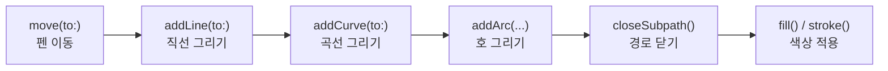
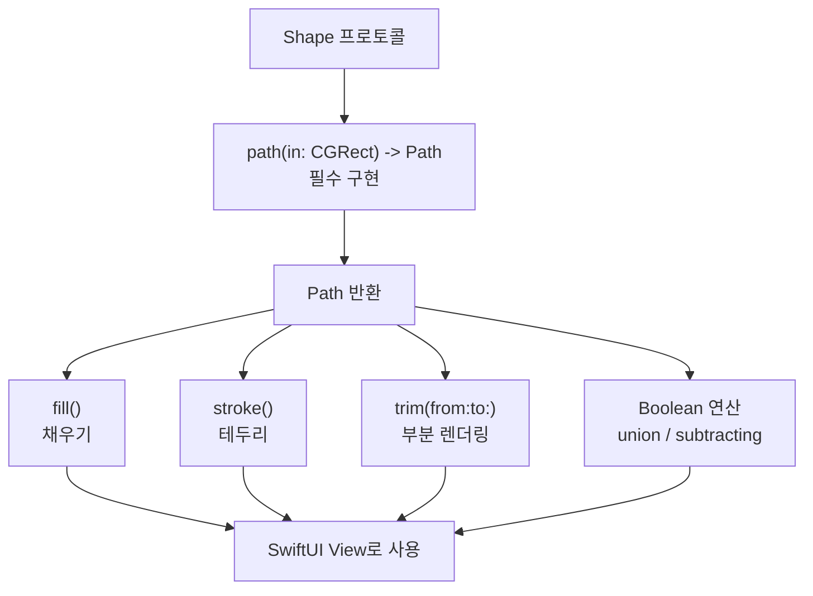
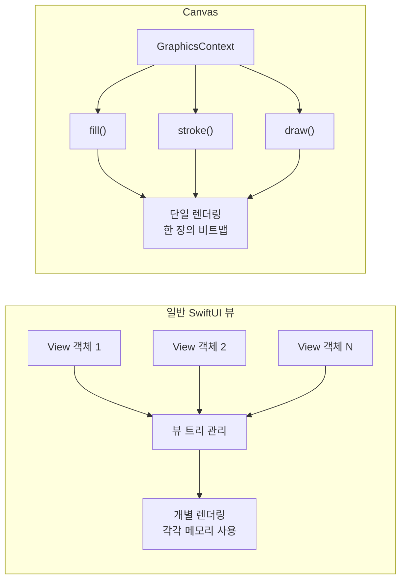
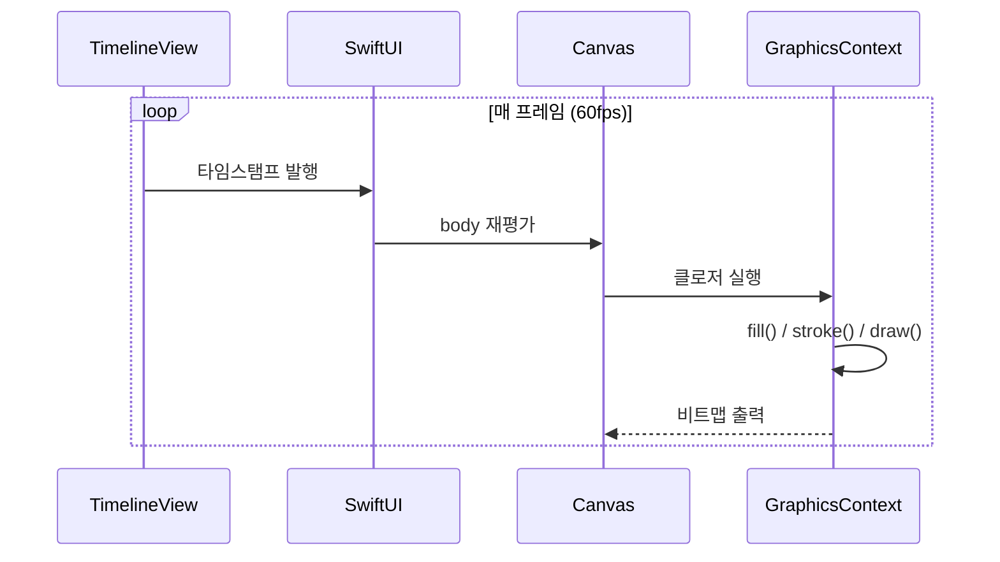

# Shape과 Canvas

> Path, 커스텀 Shape, Canvas 2D 렌더링

## 개요

SwiftUI의 내장 뷰(`Rectangle`, `Circle` 등)만으로는 표현할 수 없는 UI가 있습니다. 별 모양 버튼, 물결 효과, 원형 프로그레스 바, 커스텀 차트 — 이런 것들을 그리려면 `Path`와 `Shape` 프로토콜이 필요합니다. 그리고 수백 개의 도형을 동시에 렌더링해야 할 때는 `Canvas`가 최적의 선택이죠.

**선수 지식**: [01. 기본 애니메이션](./01-basic-animation.md), [레이아웃 시스템](../03-swiftui-start/04-layout.md)
**학습 목표**:
- `Path`로 선, 곡선, 호를 그려 커스텀 도형 만들기
- `Shape` 프로토콜을 구현하여 재사용 가능한 도형 만들기
- `trim()`으로 도형 그리기 애니메이션 구현하기
- `Canvas`와 `GraphicsContext`로 고성능 2D 그래픽 렌더링하기

## 왜 알아야 할까?

대부분의 앱은 내장 뷰만으로도 충분하지만, 앱의 **차별화된 시각적 아이덴티티**를 만들려면 커스텀 드로잉이 필요합니다. 운동 앱의 원형 프로그레스 링, 금융 앱의 실시간 차트, 게임의 파티클 이펙트 — 이 모든 것이 `Shape`과 `Canvas`로 가능합니다. 특히 `Canvas`는 수천 개의 요소를 60fps로 렌더링할 수 있어, 기존 SwiftUI 뷰로는 감당할 수 없는 성능을 제공합니다.

## 핵심 개념

### 개념 1: Path — 그리기의 기본 도구

> 📊 **그림 1**: Path 드로잉 명령 흐름 — 펜의 이동 순서




> 💡 **비유**: `Path`는 **연필과 자**입니다. "여기서 시작해서(move), 여기까지 선을 긋고(addLine), 여기서 커브를 돌아(addCurve), 시작점으로 돌아와(closeSubpath)" — 이렇게 순서대로 명령하면 원하는 모양이 그려집니다.

```swift
import SwiftUI

struct BasicPathView: View {
    var body: some View {
        VStack(spacing: 30) {
            // 삼각형 그리기
            Path { path in
                path.move(to: CGPoint(x: 100, y: 0))      // 꼭짓점
                path.addLine(to: CGPoint(x: 200, y: 150))  // 오른쪽 아래
                path.addLine(to: CGPoint(x: 0, y: 150))    // 왼쪽 아래
                path.closeSubpath()                         // 시작점으로 연결
            }
            .fill(.blue.gradient)
            .frame(width: 200, height: 150)

            // 곡선이 있는 Path
            Path { path in
                path.move(to: CGPoint(x: 0, y: 100))
                // 2차 베지에 곡선 (control point 1개)
                path.addQuadCurve(
                    to: CGPoint(x: 200, y: 100),
                    control: CGPoint(x: 100, y: -50)
                )
            }
            .stroke(.red, lineWidth: 3)
            .frame(width: 200, height: 100)
        }
    }
}

#Preview {
    BasicPathView()
}
```

주요 Path 명령:

| 명령 | 설명 |
|------|------|
| `move(to:)` | 펜을 들어 이동 (선 없이) |
| `addLine(to:)` | 현재 위치에서 직선 그리기 |
| `addQuadCurve(to:control:)` | 2차 베지에 곡선 (제어점 1개) |
| `addCurve(to:control1:control2:)` | 3차 베지에 곡선 (제어점 2개) |
| `addArc(center:radius:startAngle:endAngle:)` | 호(arc) 그리기 |
| `addEllipse(in:)` | 사각형 안에 타원 그리기 |
| `closeSubpath()` | 현재 위치에서 시작점으로 선 연결 |

### 개념 2: Shape 프로토콜 — 재사용 가능한 도형

> 📊 **그림 2**: Shape 프로토콜의 구조와 활용 흐름




`Shape` 프로토콜을 구현하면 `fill()`, `stroke()`, `trim()` 같은 SwiftUI 수정자를 사용할 수 있는 재사용 가능한 커스텀 도형을 만들 수 있습니다.

```swift
import SwiftUI

// 별 모양 커스텀 Shape
struct Star: Shape {
    let points: Int      // 꼭짓점 수
    let smoothness: CGFloat  // 안쪽 반지름 비율

    func path(in rect: CGRect) -> Path {
        // 별을 그릴 중심과 반지름 계산
        let center = CGPoint(x: rect.midX, y: rect.midY)
        let outerRadius = min(rect.width, rect.height) / 2
        let innerRadius = outerRadius * smoothness

        var path = Path()
        let totalPoints = points * 2  // 바깥 + 안쪽 꼭짓점

        for i in 0..<totalPoints {
            let angle = (Double(i) * .pi / Double(points)) - .pi / 2
            let radius = i.isMultiple(of: 2) ? outerRadius : innerRadius
            let point = CGPoint(
                x: center.x + CGFloat(cos(angle)) * radius,
                y: center.y + CGFloat(sin(angle)) * radius
            )

            if i == 0 {
                path.move(to: point)
            } else {
                path.addLine(to: point)
            }
        }
        path.closeSubpath()
        return path
    }
}

struct StarView: View {
    var body: some View {
        VStack(spacing: 20) {
            // fill, stroke 모두 사용 가능
            Star(points: 5, smoothness: 0.45)
                .fill(.yellow.gradient)
                .frame(width: 150, height: 150)

            // stroke와 함께 사용
            Star(points: 6, smoothness: 0.5)
                .stroke(.blue, lineWidth: 3)
                .frame(width: 120, height: 120)
        }
    }
}

#Preview {
    StarView()
}
```

### 개념 3: trim()으로 그리기 애니메이션

`trim(from:to:)`는 Shape의 경로 중 **일부분만 그리는** 수정자입니다. 이 값을 애니메이션하면 "선이 그려지는" 효과를 만들 수 있어요.

> 💡 **비유**: `trim()`은 **줄자에 테이프를 붙이는 것**과 같습니다. 0부터 1까지의 범위에서 어디부터 어디까지 보여줄지 정하는 거죠. `from: 0, to: 0.5`이면 절반만 보입니다.

```swift
import SwiftUI

struct CircularProgressView: View {
    @State private var progress: CGFloat = 0

    var body: some View {
        VStack(spacing: 30) {
            ZStack {
                // 배경 원
                Circle()
                    .stroke(.gray.opacity(0.2), lineWidth: 12)

                // 프로그레스 원
                Circle()
                    .trim(from: 0, to: progress)
                    .stroke(
                        .blue.gradient,
                        style: StrokeStyle(lineWidth: 12, lineCap: .round)
                    )
                    // 12시 방향에서 시작하도록 회전
                    .rotationEffect(.degrees(-90))

                // 퍼센트 텍스트
                Text("\(Int(progress * 100))%")
                    .font(.system(size: 32, weight: .bold, design: .rounded))
                    .contentTransition(.numericText())
            }
            .frame(width: 150, height: 150)

            Button("진행") {
                withAnimation(.spring(duration: 0.8, bounce: 0.2)) {
                    progress = progress >= 1.0 ? 0 : progress + 0.25
                }
            }
            .buttonStyle(.borderedProminent)
        }
    }
}

#Preview {
    CircularProgressView()
}
```

> 🔥 **실무 팁**: iOS 17부터 Shape에 `.union()`, `.subtracting()`, `.intersection()` 등 **Boolean 연산**이 추가되었습니다. 두 도형의 합집합, 차집합, 교집합을 만들 수 있어요.

### 개념 4: Canvas — 고성능 2D 렌더링

> 📊 **그림 3**: SwiftUI View 계층 vs Canvas 즉시 모드 렌더링 비교




> 💡 **비유**: 일반 SwiftUI 뷰가 **레고 블록**(각각 독립적인 객체)이라면, `Canvas`는 **그림 도구**(한 장의 캔버스에 직접 그리기)입니다. 레고는 블록마다 관리 비용이 있지만, 그림은 아무리 복잡해도 한 장이에요. 수백 개의 요소를 렌더링할 때 `Canvas`가 압도적으로 빠른 이유입니다.

```swift
import SwiftUI

struct CanvasDrawingView: View {
    var body: some View {
        Canvas { context, size in
            // 배경 그라데이션
            let backgroundRect = CGRect(origin: .zero, size: size)
            context.fill(
                Path(backgroundRect),
                with: .linearGradient(
                    Gradient(colors: [.blue.opacity(0.1), .purple.opacity(0.1)]),
                    startPoint: .zero,
                    endPoint: CGPoint(x: size.width, y: size.height)
                )
            )

            // 랜덤 별 그리기
            for i in 0..<50 {
                let x = CGFloat(i * 7 % Int(size.width))
                let y = CGFloat(i * 13 % Int(size.height))
                let starSize = CGFloat(3 + i % 5)

                let starRect = CGRect(
                    x: x - starSize/2,
                    y: y - starSize/2,
                    width: starSize,
                    height: starSize
                )

                // 원 그리기 — 뷰가 아닌 즉시 모드 렌더링
                context.fill(
                    Path(ellipseIn: starRect),
                    with: .color(.white.opacity(0.8))
                )
            }

            // 텍스트 렌더링
            let text = Text("Canvas!")
                .font(.system(size: 40, weight: .bold))
                .foregroundStyle(.white)
            let resolvedText = context.resolve(text)
            context.draw(
                resolvedText,
                at: CGPoint(x: size.width / 2, y: size.height / 2)
            )
        }
        .frame(height: 300)
        .clipShape(.rect(cornerRadius: 20))
    }
}

#Preview {
    CanvasDrawingView()
}
```

### 개념 5: TimelineView + Canvas — 실시간 애니메이션

> 📊 **그림 4**: TimelineView + Canvas 실시간 렌더링 루프




`TimelineView`와 `Canvas`를 결합하면 60fps로 업데이트되는 실시간 그래픽을 만들 수 있습니다.

```swift
import SwiftUI

struct AnimatedCanvasView: View {
    var body: some View {
        // .animation 스케줄: 매 프레임 업데이트
        TimelineView(.animation) { timeline in
            Canvas { context, size in
                // 현재 시간을 기반으로 애니메이션 계산
                let time = timeline.date.timeIntervalSinceReferenceDate

                // 물결 효과 그리기
                for i in 0..<3 {
                    var path = Path()
                    let amplitude: CGFloat = 20 + CGFloat(i) * 10
                    let frequency: CGFloat = 2 + CGFloat(i) * 0.5
                    let phase = time * (1.5 + Double(i) * 0.3)

                    path.move(to: CGPoint(x: 0, y: size.height / 2))

                    for x in stride(from: 0, to: size.width, by: 2) {
                        let y = size.height / 2
                            + amplitude * sin(frequency * x / size.width * .pi * 2 + phase)
                        path.addLine(to: CGPoint(x: x, y: y))
                    }

                    context.stroke(
                        path,
                        with: .color(.blue.opacity(0.3 + Double(i) * 0.2)),
                        lineWidth: 2
                    )
                }
            }
        }
        .frame(height: 200)
        .background(.black)
        .clipShape(.rect(cornerRadius: 16))
    }
}

#Preview {
    AnimatedCanvasView()
}
```

## 더 깊이 알아보기

### Canvas의 탄생 — WWDC 2021

`Canvas`는 WWDC 2021의 "Add rich graphics to your SwiftUI app" 세션에서 소개되었습니다. 당시 SwiftUI의 가장 큰 약점 중 하나가 **대량 그래픽 렌더링 성능**이었어요. 수백 개의 뷰를 그리면 각각이 독립적인 뷰 객체로 관리되어 메모리와 CPU를 많이 사용했거든요.

`Canvas`는 이 문제를 **즉시 모드(immediate mode) 렌더링**으로 해결했습니다. 일반 SwiftUI가 "선언적(뭘 그릴지 말하기)"이라면, Canvas는 "명령적(직접 그리기)"입니다. HTML5의 `<canvas>` 요소나 Core Graphics(`CGContext`)와 비슷한 접근이에요.

> 💡 **알고 계셨나요?**: iOS 26의 `@Animatable` 매크로를 사용하면 커스텀 Shape의 프로퍼티를 자동으로 애니메이션할 수 있습니다. 이전에는 `animatableData`를 수동으로 구현해야 했지만, 이제 `@Animatable`을 Shape에 붙이기만 하면 됩니다.

## 흔한 오해와 팁

> ⚠️ **흔한 오해**: "Canvas가 항상 Shape보다 좋다" — Canvas는 접근성(VoiceOver)을 자동 지원하지 않고, 개별 요소에 제스처를 붙일 수 없습니다. 인터랙티브한 UI에는 여전히 일반 SwiftUI 뷰/Shape가 적합합니다. Canvas는 "그리기만 하는" 용도에 최적이에요.

> 🔥 **실무 팁**: 원형 프로그레스 바를 만들 때 `.rotationEffect(.degrees(-90))`을 잊지 마세요. SwiftUI의 0도는 **3시 방향**(오른쪽)이므로, 시계 앱처럼 12시에서 시작하려면 -90도 회전이 필요합니다.

## 핵심 정리

| 개념 | 설명 |
|------|------|
| `Path` | 선, 곡선, 호를 조합한 커스텀 경로 |
| `Shape` 프로토콜 | `path(in:)` 구현으로 재사용 가능한 도형 생성 |
| `.fill()` / `.stroke()` | Shape에 색상 채우기 / 테두리 그리기 |
| `.trim(from:to:)` | 경로의 일부분만 렌더링 (그리기 애니메이션) |
| `Canvas` | 즉시 모드 2D 렌더링, 대량 요소에 고성능 |
| `GraphicsContext` | Canvas의 드로잉 컨텍스트 (fill, stroke, draw) |
| `TimelineView` + `Canvas` | 실시간 60fps 애니메이션 렌더링 |
| `@Animatable` (iOS 26) | 커스텀 Shape 프로퍼티 자동 보간 매크로 |

## 다음 섹션 미리보기

커스텀 도형과 고성능 그래픽을 마스터했으니, 이제 뷰 간의 **매끄러운 전환**을 만들 차례입니다. 다음 [05. 전환 효과와 매칭](./05-transitions.md)에서는 `matchedGeometryEffect`로 히어로 애니메이션을, `scrollTransition`으로 스크롤 효과를, `symbolEffect`로 SF Symbol 애니메이션을 구현합니다.

## 참고 자료

- [Shape - Apple 공식 문서](https://developer.apple.com/documentation/swiftui/shape) — Shape 프로토콜 레퍼런스
- [Canvas - Apple 공식 문서](https://developer.apple.com/documentation/swiftui/canvas) — Canvas 뷰 API
- [Add rich graphics to your SwiftUI app - WWDC 2021](https://developer.apple.com/videos/play/wwdc2021/10021/) — Canvas 소개 세션
- [How to draw a custom path - Hacking with Swift](https://www.hackingwithswift.com/quick-start/swiftui/how-to-draw-a-custom-path) — Path 기초 튜토리얼
- [@Animatable 매크로 - Apple 공식 문서](https://developer.apple.com/documentation/swiftui/animatable()) — iOS 26 자동 보간 매크로
