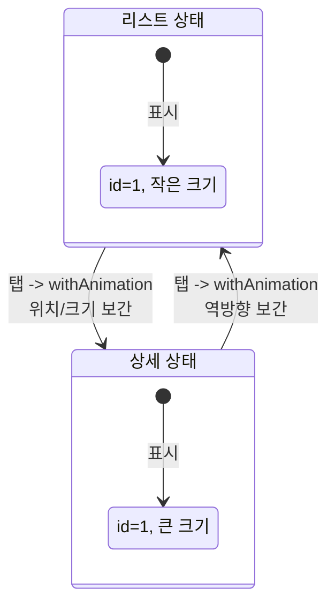
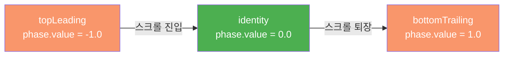
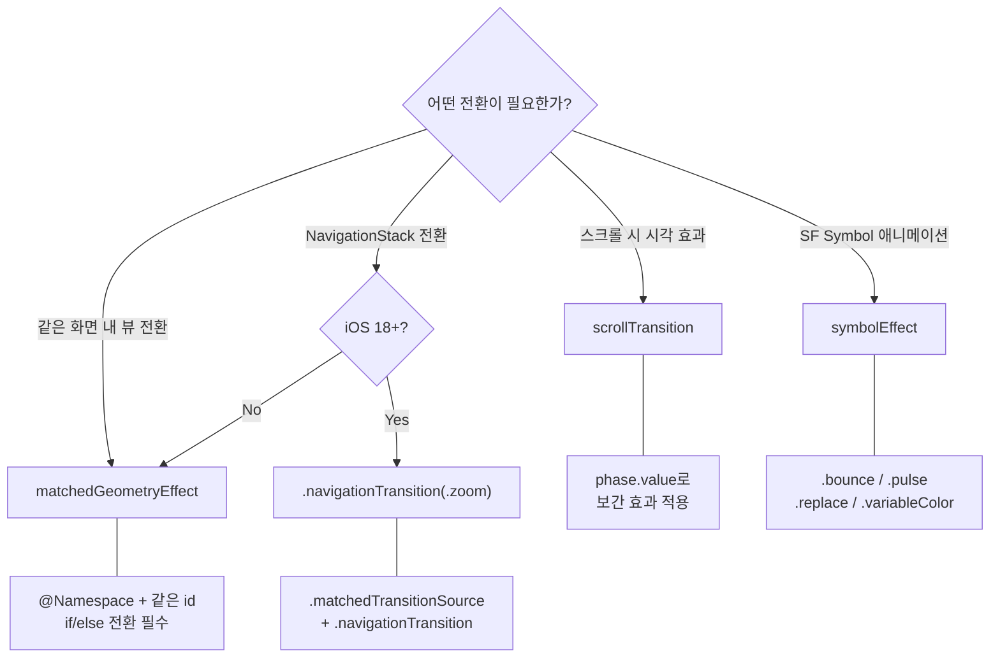

# 전환 효과와 매칭

> matchedGeometryEffect, scrollTransition, 화면 전환

## 개요

앱에서 가장 인상적인 순간은 화면 간 전환입니다. 리스트에서 상세 화면으로 넘어갈 때 썸네일이 부드럽게 확대되거나, 스크롤하면서 카드가 역동적으로 변하는 — 이런 효과가 앱에 "마법 같은" 느낌을 줍니다. 이 섹션에서는 SwiftUI가 제공하는 강력한 전환 도구들을 배웁니다.

**선수 지식**: [01. 기본 애니메이션](./01-basic-animation.md), [NavigationStack](../04-navigation-design/01-navigation-stack.md)
**학습 목표**:
- `matchedGeometryEffect`로 뷰 간 히어로 전환 구현하기
- `scrollTransition`으로 스크롤 기반 시각 효과 만들기
- `.navigationTransition(.zoom)`으로 네비게이션 줌 전환 사용하기
- `.symbolEffect`로 SF Symbol 애니메이션 활용하기

## 왜 알아야 할까?

Apple의 사진 앱에서 사진을 탭하면 그 사진이 제자리에서 확대되는 효과를 본 적 있죠? 앱스토어에서 카드를 탭하면 카드가 화면 전체로 펼쳐지는 전환은요? 이런 효과를 **히어로 애니메이션(Hero Animation)**이라고 부르는데, 사용자에게 "이 화면과 저 화면이 연결되어 있다"는 시각적 맥락을 제공합니다. SwiftUI는 이를 놀라울 정도로 간단하게 구현할 수 있게 해줍니다.

## 핵심 개념

### 개념 1: matchedGeometryEffect — 히어로 애니메이션

> 💡 **비유**: `matchedGeometryEffect`는 **변신 마술**입니다. 관객(사용자)이 보는 앞에서 작은 카드(리스트 아이템)가 큰 포스터(상세 화면)로 부드럽게 변하죠. 사실은 두 개의 다른 뷰인데, 같은 `id`를 부여하면 SwiftUI가 위치와 크기를 매칭하여 자연스러운 전환을 만들어 줍니다.

> 📊 **그림 1**: matchedGeometryEffect의 동작 원리 — 두 독립 뷰 간 보간




```swift
import SwiftUI

struct HeroAnimationView: View {
    @Namespace private var animation  // 네임스페이스 선언
    @State private var selectedId: Int? = nil

    let colors: [Color] = [.blue, .green, .orange, .purple, .pink]

    var body: some View {
        ZStack {
            // 카드 그리드
            if selectedId == nil {
                LazyVGrid(columns: [GridItem(.adaptive(minimum: 100))], spacing: 16) {
                    ForEach(0..<5, id: \.self) { index in
                        RoundedRectangle(cornerRadius: 16)
                            .fill(colors[index].gradient)
                            .frame(height: 100)
                            .overlay(Text("카드 \(index + 1)").foregroundStyle(.white))
                            // 이 뷰를 id로 매칭
                            .matchedGeometryEffect(id: index, in: animation)
                            .onTapGesture {
                                withAnimation(.spring(duration: 0.4, bounce: 0.2)) {
                                    selectedId = index
                                }
                            }
                    }
                }
                .padding()
            }

            // 확대된 상세 뷰
            if let id = selectedId {
                RoundedRectangle(cornerRadius: 24)
                    .fill(colors[id].gradient)
                    .overlay {
                        VStack {
                            Text("카드 \(id + 1) 상세")
                                .font(.title)
                                .foregroundStyle(.white)
                            Text("탭하여 닫기")
                                .foregroundStyle(.white.opacity(0.7))
                        }
                    }
                    // 같은 id로 매칭 → 자동 전환 애니메이션
                    .matchedGeometryEffect(id: id, in: animation)
                    .padding(20)
                    .onTapGesture {
                        withAnimation(.spring(duration: 0.4, bounce: 0.2)) {
                            selectedId = nil
                        }
                    }
            }
        }
    }
}

#Preview {
    HeroAnimationView()
}
```

`matchedGeometryEffect`의 `properties` 파라미터:

| 값 | 매칭 대상 |
|----|----------|
| `.frame` | 위치 + 크기 (기본값) |
| `.position` | 위치만 매칭 |
| `.size` | 크기만 매칭 |

> ⚠️ **흔한 오해**: `matchedGeometryEffect`가 뷰를 "이동시키는" 것은 아닙니다. 실제로는 두 개의 **독립적인 뷰**가 각각 존재하고, SwiftUI가 하나의 위치/크기에서 다른 위치/크기로 **보간(interpolation)**하는 것이에요. 그래서 `if/else`로 뷰를 전환할 때 가장 잘 동작합니다.

### 개념 2: navigationTransition(.zoom) — 네비게이션 줌 전환 (iOS 18+)

iOS 18부터 `NavigationLink` 전환 시 **줌 효과**를 간단하게 적용할 수 있습니다. `matchedGeometryEffect`보다 훨씬 간단한 API로 동일한 효과를 구현할 수 있죠.

```swift
import SwiftUI

struct ZoomTransitionView: View {
    @Namespace private var namespace

    var body: some View {
        NavigationStack {
            ScrollView {
                LazyVGrid(columns: [GridItem(.adaptive(minimum: 150))], spacing: 16) {
                    ForEach(1...6, id: \.self) { index in
                        NavigationLink(value: index) {
                            RoundedRectangle(cornerRadius: 16)
                                .fill(Color.blue.opacity(0.3 + Double(index) * 0.1))
                                .frame(height: 150)
                                .overlay(Text("아이템 \(index)"))
                        }
                        // 소스 뷰 지정
                        .matchedTransitionSource(id: index, in: namespace)
                    }
                }
                .padding()
            }
            .navigationTitle("갤러리")
            .navigationDestination(for: Int.self) { index in
                DetailZoomView(index: index)
                    // 줌 전환 적용
                    .navigationTransition(.zoom(sourceID: index, in: namespace))
            }
        }
    }
}

struct DetailZoomView: View {
    let index: Int

    var body: some View {
        VStack {
            RoundedRectangle(cornerRadius: 24)
                .fill(Color.blue.opacity(0.3 + Double(index) * 0.1))
                .frame(height: 300)
            Text("아이템 \(index) 상세")
                .font(.title)
        }
        .padding()
        .navigationTitle("상세")
    }
}

#Preview {
    ZoomTransitionView()
}
```

### 개념 3: scrollTransition — 스크롤 기반 효과

> 📊 **그림 2**: ScrollTransitionPhase의 값 변화 흐름




`scrollTransition`은 뷰가 스크롤 영역에 들어오고 나갈 때 **자동으로 시각 효과**를 적용합니다.

```swift
import SwiftUI

struct ScrollTransitionView: View {
    var body: some View {
        ScrollView {
            LazyVStack(spacing: 16) {
                ForEach(0..<20, id: \.self) { index in
                    RoundedRectangle(cornerRadius: 16)
                        .fill(Color(
                            hue: Double(index) / 20,
                            saturation: 0.7,
                            brightness: 0.9
                        ).gradient)
                        .frame(height: 120)
                        .overlay(
                            Text("카드 \(index + 1)")
                                .font(.title2.bold())
                                .foregroundStyle(.white)
                        )
                        .padding(.horizontal)
                        // 스크롤 전환 효과
                        .scrollTransition { content, phase in
                            content
                                // phase.value: -1(위에서 나감) ~ 0(보임) ~ 1(아래로 나감)
                                .opacity(phase.isIdentity ? 1 : 0.5)
                                .scaleEffect(phase.isIdentity ? 1 : 0.85)
                                .offset(x: phase.isIdentity ? 0 : phase.value * 50)
                        }
                }
            }
            .padding(.vertical)
        }
    }
}

#Preview {
    ScrollTransitionView()
}
```

`ScrollTransitionPhase`의 주요 프로퍼티:

| 프로퍼티 | 설명 |
|---------|------|
| `.isIdentity` | 뷰가 완전히 화면에 보이는 상태 |
| `.value` | -1.0 ~ 1.0 사이의 보간 값 |
| `.topLeading` | 위쪽(또는 왼쪽)으로 사라지는 중 |
| `.bottomTrailing` | 아래쪽(또는 오른쪽)으로 사라지는 중 |

### 개념 4: symbolEffect — SF Symbol 애니메이션

iOS 17부터 SF Symbol에 전용 애니메이션 효과를 적용할 수 있습니다.

```swift
import SwiftUI

struct SymbolEffectView: View {
    @State private var isFavorite = false
    @State private var bellCount = 0

    var body: some View {
        VStack(spacing: 40) {
            // 바운스 효과
            Image(systemName: "bell.fill")
                .font(.system(size: 50))
                .foregroundStyle(.yellow)
                // 값이 바뀔 때마다 바운스
                .symbolEffect(.bounce, value: bellCount)
                .onTapGesture { bellCount += 1 }

            // 교체 효과 — 심볼이 부드럽게 교체됨
            Image(systemName: isFavorite ? "heart.fill" : "heart")
                .font(.system(size: 50))
                .foregroundStyle(isFavorite ? .red : .gray)
                .contentTransition(.symbolEffect(.replace))
                .onTapGesture {
                    withAnimation {
                        isFavorite.toggle()
                    }
                }

            // 펄스 효과 — 지속적인 주의 끌기
            Image(systemName: "wifi")
                .font(.system(size: 50))
                .foregroundStyle(.blue)
                .symbolEffect(.pulse)

            // 가변 컬러 — 레이어가 순차적으로 빛남
            Image(systemName: "wifi")
                .font(.system(size: 50))
                .foregroundStyle(.green)
                .symbolEffect(.variableColor.iterative)
        }
    }
}

#Preview {
    SymbolEffectView()
}
```

주요 Symbol 효과:

| 효과 | 설명 |
|------|------|
| `.bounce` | 통통 튀는 효과 |
| `.pulse` | 부드럽게 깜빡이는 효과 |
| `.variableColor` | 레이어별 순차 색상 변화 |
| `.replace` | 심볼 간 부드러운 교체 전환 |
| `.wiggle` | 좌우 흔들림 (iOS 18+) |
| `.breathe` | 숨 쉬는 듯한 크기 변화 (iOS 18+) |
| `.rotate` | 회전 효과 (iOS 18+) |

## 더 깊이 알아보기

### matchedGeometryEffect의 진화

`matchedGeometryEffect`는 WWDC 2020에서 처음 소개되었습니다. 당시 iOS 개발자들은 UIKit의 `UIViewControllerAnimatedTransitioning` 프로토콜을 구현하여 화면 전환을 만들어야 했는데, 이 과정이 상당히 복잡했어요. 프레임 계산, 스냅샷 생성, 애니메이션 조율을 모두 수동으로 해야 했거든요.

SwiftUI는 `@Namespace`와 `matchedGeometryEffect`라는 단 두 가지 도구로 이 복잡성을 획기적으로 줄였습니다. 그리고 iOS 18에서 `.navigationTransition(.zoom)`이 추가되면서, 네비게이션 전환은 더욱 간단해졌죠.

> 💡 **알고 계셨나요?**: `@Namespace`는 뷰의 라이프사이클에 연결된 고유한 식별 공간입니다. 같은 Namespace 안에서 같은 id를 가진 뷰끼리만 매칭이 됩니다. 서로 다른 Namespace의 같은 id는 매칭되지 않아서, 복잡한 화면에서도 충돌 없이 여러 매칭 그룹을 운영할 수 있어요.

## 흔한 오해와 팁

> ⚠️ **흔한 오해**: "`matchedGeometryEffect`를 `NavigationLink`와 함께 쓸 수 있다" — `matchedGeometryEffect`는 같은 뷰 계층 안에서 `if/else`로 전환할 때 가장 잘 동작합니다. NavigationStack의 push/pop과는 잘 맞지 않아요. 네비게이션 전환에는 iOS 18의 `.navigationTransition(.zoom)`을 사용하세요.

> 🔥 **실무 팁**: `scrollTransition`에서 `.opacity` 효과를 줄 때, 완전히 0으로 만들면 접근성(VoiceOver) 문제가 생길 수 있습니다. 최소 0.3 이상을 유지하거나, 접근성을 위한 별도 처리를 추가하세요.

> 🔥 **실무 팁**: `symbolEffect`의 `.bounce`는 값이 변할 때마다 한 번 트리거됩니다. 계속 반복하려면 `.pulse`나 `.variableColor`를 사용하세요. 알림 배지처럼 "한 번만 주의를 끌기"에는 `.bounce`가 적합합니다.

## 핵심 정리

> 📊 **그림 3**: SwiftUI 전환 API 선택 가이드




| 개념 | 설명 |
|------|------|
| `matchedGeometryEffect` | 같은 id의 뷰 간 위치/크기 보간 (히어로 애니메이션) |
| `@Namespace` | 매칭 그룹을 식별하는 고유 공간 |
| `.navigationTransition(.zoom)` | iOS 18+ 네비게이션 줌 전환 |
| `.matchedTransitionSource` | 줌 전환의 소스 뷰 지정 |
| `scrollTransition` | 스크롤 위치 기반 시각 효과 |
| `ScrollTransitionPhase` | 스크롤 상태 (.isIdentity, .value) |
| `.symbolEffect` | SF Symbol 전용 애니메이션 (.bounce, .pulse, .replace) |
| `.contentTransition` | 콘텐츠 교체 전환 (.numericText, .symbolEffect) |

## 다음 섹션 미리보기

Ch9 애니메이션과 인터랙션 챕터를 마쳤습니다! 이제 앱에 생동감을 불어넣는 도구를 모두 갖추었네요. 다음 [Ch10. 시스템 프레임워크 활용](../10-system-frameworks/01-image-camera.md)에서는 카메라, 지도, 알림, 공유 등 iOS의 시스템 프레임워크를 SwiftUI에서 활용하는 방법을 배웁니다.

## 참고 자료

- [matchedGeometryEffect - Apple 공식 문서](https://developer.apple.com/documentation/swiftui/view/matchedgeometryeffect(id:in:properties:anchor:issource:)) — 히어로 애니메이션 API
- [Enhance your UI animations and transitions - WWDC 2024](https://developer.apple.com/videos/play/wwdc2024/10145/) — navigationTransition, symbolEffect 소개
- [scrollTransition - Apple 공식 문서](https://developer.apple.com/documentation/swiftui/view/scrolltransition(_:axis:transition:)) — 스크롤 전환 API
- [Animate symbols in your app - WWDC 2023](https://developer.apple.com/videos/play/wwdc2023/10257/) — SF Symbol 애니메이션 효과
- [MatchedGeometryEffect — Part 1 - The SwiftUI Lab](https://swiftui-lab.com/matchedgeometryeffect-part1/) — matchedGeometryEffect 심화 분석
