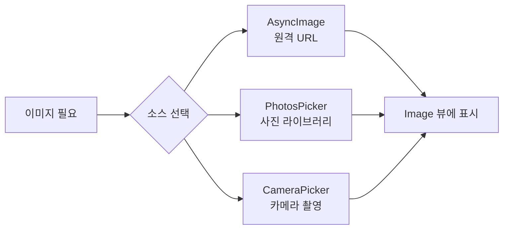
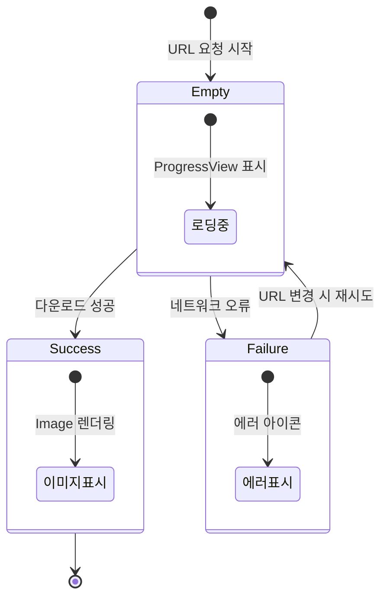
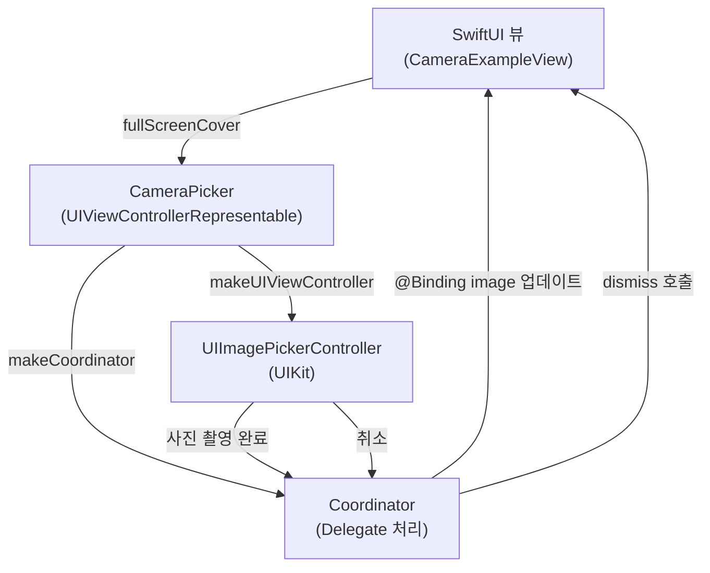

# 01. 이미지와 카메라

> AsyncImage, PhotosPicker, 카메라 캡처

## 개요

앱에서 이미지를 다루는 건 거의 모든 iOS 프로젝트의 기본이죠. 원격 URL에서 이미지를 불러오고, 사용자의 사진 라이브러리에서 사진을 선택하고, 카메라로 직접 촬영하는 방법까지 — 이 섹션에서 한 번에 다룹니다.

**선수 지식**: [async/await 기초](../07-networking/01-async-await.md), [SwiftUI 기본 뷰](../03-swiftui-start/01-hello-swiftui.md)
**학습 목표**:
- AsyncImage로 원격 이미지를 로드하고 상태별 UI를 처리할 수 있다
- PhotosPicker로 사진 라이브러리에서 이미지를 선택할 수 있다
- UIImagePickerController 브릿지를 통해 카메라 캡처를 구현할 수 있다

## 왜 알아야 할까?

Instagram, 당근마켓, 배달의민족 — 이미지가 없는 앱을 떠올리기 어렵죠? 프로필 사진 설정, 상품 사진 업로드, 리뷰 이미지 첨부 등 이미지는 앱의 핵심 기능입니다. SwiftUI는 이런 작업을 놀라울 만큼 간결하게 처리할 수 있는 도구를 제공합니다.

## 핵심 개념

> 📊 **그림 1**: SwiftUI 이미지 소스 3가지 경로




### 개념 1: AsyncImage — URL로 이미지 불러오기

> 💡 **비유**: AsyncImage는 **온라인 쇼핑몰의 상품 사진**과 같습니다. 페이지를 열면 잠깐 로딩 스피너가 돌다가 사진이 나타나고, 네트워크가 끊기면 "이미지를 불러올 수 없습니다"가 표시되죠.

AsyncImage는 iOS 15(WWDC 2021)에서 도입된 SwiftUI 뷰로, URL만 넘기면 자동으로 이미지를 다운로드하고 표시해줍니다.

> 📊 **그림 2**: AsyncImage의 3가지 상태 전이




**가장 간단한 사용법:**

```swift
import SwiftUI

struct RemoteImageView: View {
    var body: some View {
        // URL만 넘기면 자동으로 이미지를 다운로드합니다
        AsyncImage(url: URL(string: "https://picsum.photos/300"))
    }
}

#Preview {
    RemoteImageView()
}
```

하지만 실무에서는 로딩 중, 성공, 실패 상태를 각각 처리해야 하죠. `AsyncImagePhase`를 활용하면 됩니다:

```swift
import SwiftUI

struct PhaseImageView: View {
    let imageURL = URL(string: "https://picsum.photos/300/200")

    var body: some View {
        AsyncImage(url: imageURL) { phase in
            switch phase {
            case .empty:
                // 로딩 중 — 플레이스홀더 표시
                ProgressView()
                    .frame(width: 300, height: 200)

            case .success(let image):
                // 성공 — 이미지를 원하는 크기로 표시
                image
                    .resizable()
                    .aspectRatio(contentMode: .fill)
                    .frame(width: 300, height: 200)
                    .clipped()

            case .failure:
                // 실패 — 에러 아이콘 표시
                Image(systemName: "photo.badge.exclamationmark")
                    .font(.largeTitle)
                    .foregroundStyle(.secondary)
                    .frame(width: 300, height: 200)

            @unknown default:
                EmptyView()
            }
        }
    }
}

#Preview {
    PhaseImageView()
}
```

> ⚠️ **흔한 오해**: "AsyncImage가 이미지를 캐싱해준다"고 생각하기 쉽지만, **AsyncImage는 자체 캐싱을 제공하지 않습니다**. 스크롤해서 셀이 재생성될 때마다 다시 다운로드할 수 있어요. 프로덕션 앱에서는 NSCache를 활용한 커스텀 캐싱이나 서드파티 라이브러리(Kingfisher, Nuke 등)를 고려하세요.

### 개념 2: PhotosPicker — 사진 라이브러리에서 선택하기

> 💡 **비유**: PhotosPicker는 **도서관의 셀프 대출 시스템**입니다. 사용자가 직접 원하는 책(사진)을 골라서 빌려가되, 도서관(Photos 앱) 전체에 접근하는 것이 아니라 선택한 것만 앱에 전달됩니다. 개인정보 보호가 기본인 거죠.

PhotosPicker는 WWDC 2022에서 도입된 SwiftUI 네이티브 사진 선택기입니다. 기존의 UIImagePickerController와 달리, 사진 라이브러리 접근 권한을 요청하지 않아도 됩니다 — 사용자가 선택한 사진만 앱에 전달되니까요.

**단일 사진 선택:**

```swift
import SwiftUI
import PhotosUI

struct SinglePhotoPickerView: View {
    // 선택된 PhotosPickerItem을 저장합니다
    @State private var selectedItem: PhotosPickerItem?
    // 변환된 이미지를 저장합니다
    @State private var selectedImage: Image?

    var body: some View {
        VStack(spacing: 20) {
            // 선택된 이미지가 있으면 표시
            if let selectedImage {
                selectedImage
                    .resizable()
                    .scaledToFit()
                    .frame(maxHeight: 300)
                    .clipShape(RoundedRectangle(cornerRadius: 12))
            }

            // PhotosPicker 버튼 — matching으로 필터링
            PhotosPicker(
                selection: $selectedItem,
                matching: .images  // 이미지만 표시
            ) {
                Label("사진 선택", systemImage: "photo.on.rectangle")
            }
            .buttonStyle(.borderedProminent)
        }
        .padding()
        // 선택이 변경되면 이미지를 로드합니다
        .onChange(of: selectedItem) {
            Task {
                // loadTransferable로 Image 타입으로 변환
                selectedImage = try? await selectedItem?
                    .loadTransferable(type: Image.self)
            }
        }
    }
}

#Preview {
    SinglePhotoPickerView()
}
```

**여러 사진 선택:**

```swift
import SwiftUI
import PhotosUI

struct MultiPhotoPickerView: View {
    @State private var selectedItems: [PhotosPickerItem] = []
    @State private var selectedImages: [Image] = []

    var body: some View {
        NavigationStack {
            ScrollView {
                LazyVGrid(
                    columns: [GridItem(.adaptive(minimum: 100))],
                    spacing: 8
                ) {
                    ForEach(0..<selectedImages.count, id: \.self) { index in
                        selectedImages[index]
                            .resizable()
                            .scaledToFill()
                            .frame(width: 100, height: 100)
                            .clipped()
                            .clipShape(RoundedRectangle(cornerRadius: 8))
                    }
                }
                .padding()
            }
            .toolbar {
                // 최대 5장까지 선택 가능
                PhotosPicker(
                    selection: $selectedItems,
                    maxSelectionCount: 5,
                    matching: .images
                ) {
                    Label("사진 추가", systemImage: "plus.circle")
                }
            }
            .navigationTitle("내 사진들")
            .onChange(of: selectedItems) {
                Task {
                    selectedImages.removeAll()
                    for item in selectedItems {
                        if let image = try? await item
                            .loadTransferable(type: Image.self) {
                            selectedImages.append(image)
                        }
                    }
                }
            }
        }
    }
}

#Preview {
    MultiPhotoPickerView()
}
```

**필터링 옵션**: `matching` 파라미터로 다양한 미디어 타입을 필터링할 수 있습니다:

| 필터 | 설명 |
|------|------|
| `.images` | 모든 이미지 |
| `.videos` | 모든 동영상 |
| `.screenshots` | 스크린샷만 |
| `.not(.videos)` | 동영상 제외 모든 것 |
| `.any(of: [.images, .videos])` | 이미지 또는 동영상 |
| `.all(of: [.images, .screenshots])` | 이미지이면서 스크린샷인 것 |

> 💡 **알고 계셨나요?**: iOS 17부터 PhotosPicker에 `.photosPickerStyle(.inline)` 수정자를 적용하면, 시트 대신 **뷰 안에 직접 사진 선택기를 임베드**할 수 있습니다. `.compact` 스타일로 한 줄짜리 가로 스크롤 형태도 가능하죠.

### 개념 3: 카메라 캡처 — UIImagePickerController 브릿지

> 💡 **비유**: SwiftUI에서 카메라를 사용하는 건 **통역사를 고용하는 것**과 비슷합니다. SwiftUI(한국어)와 UIKit의 카메라(영어)가 직접 대화할 수 없으니, UIViewControllerRepresentable이라는 통역사가 중간에서 번역해줍니다.

현재 SwiftUI에는 네이티브 카메라 캡처 뷰가 없습니다. 그래서 UIKit의 UIImagePickerController를 SwiftUI에서 사용할 수 있도록 래핑해야 합니다:

> 📊 **그림 3**: UIViewControllerRepresentable 브릿지 구조




```swift
import SwiftUI

// UIImagePickerController를 SwiftUI에서 사용하기 위한 래퍼
struct CameraPicker: UIViewControllerRepresentable {
    @Environment(\.dismiss) private var dismiss
    @Binding var image: UIImage?

    func makeUIViewController(context: Context) -> UIImagePickerController {
        let picker = UIImagePickerController()
        picker.sourceType = .camera       // 카메라 모드
        picker.delegate = context.coordinator
        return picker
    }

    func updateUIViewController(
        _ uiViewController: UIImagePickerController,
        context: Context
    ) {}

    // Coordinator가 UIKit 델리게이트 역할을 합니다
    func makeCoordinator() -> Coordinator {
        Coordinator(self)
    }

    class Coordinator: NSObject,
        UIImagePickerControllerDelegate,
        UINavigationControllerDelegate {

        let parent: CameraPicker

        init(_ parent: CameraPicker) {
            self.parent = parent
        }

        // 사진 촬영 완료 시 호출됩니다
        func imagePickerController(
            _ picker: UIImagePickerController,
            didFinishPickingMediaWithInfo info: [UIImagePickerController.InfoKey: Any]
        ) {
            if let uiImage = info[.originalImage] as? UIImage {
                parent.image = uiImage
            }
            parent.dismiss()
        }

        // 취소 시 호출됩니다
        func imagePickerControllerDidCancel(
            _ picker: UIImagePickerController
        ) {
            parent.dismiss()
        }
    }
}
```

**카메라 뷰 사용하기:**

```swift
import SwiftUI

struct CameraExampleView: View {
    @State private var capturedImage: UIImage?
    @State private var showCamera = false

    var body: some View {
        VStack(spacing: 20) {
            if let capturedImage {
                Image(uiImage: capturedImage)
                    .resizable()
                    .scaledToFit()
                    .frame(maxHeight: 300)
                    .clipShape(RoundedRectangle(cornerRadius: 12))
            }

            Button("카메라 열기") {
                showCamera = true
            }
            .buttonStyle(.borderedProminent)
        }
        .padding()
        .fullScreenCover(isPresented: $showCamera) {
            CameraPicker(image: $capturedImage)
                .ignoresSafeArea()
        }
    }
}

#Preview {
    CameraExampleView()
}
```

> 🔥 **실무 팁**: 카메라를 사용하려면 `Info.plist`에 `NSCameraUsageDescription` 키를 추가해야 합니다. 이 설명은 사용자에게 "이 앱이 왜 카메라가 필요한지" 보여주는 것이므로, "프로필 사진 촬영을 위해 카메라를 사용합니다"처럼 구체적으로 작성하세요.

## 실습: 프로필 사진 설정기

카메라와 사진 라이브러리를 모두 지원하는 프로필 사진 설정 화면을 만들어봅시다:

```swift
import SwiftUI
import PhotosUI

struct ProfilePhotoView: View {
    @State private var selectedItem: PhotosPickerItem?
    @State private var profileImage: Image?
    @State private var cameraImage: UIImage?
    @State private var showCamera = false

    var body: some View {
        VStack(spacing: 24) {
            // 프로필 이미지 표시 영역
            Group {
                if let profileImage {
                    profileImage
                        .resizable()
                        .scaledToFill()
                } else {
                    Image(systemName: "person.circle.fill")
                        .resizable()
                        .foregroundStyle(.gray.opacity(0.3))
                }
            }
            .frame(width: 150, height: 150)
            .clipShape(Circle())
            .overlay(Circle().stroke(.gray.opacity(0.3), lineWidth: 1))

            // 버튼 영역
            HStack(spacing: 16) {
                // 사진 라이브러리에서 선택
                PhotosPicker(
                    selection: $selectedItem,
                    matching: .images
                ) {
                    Label("앨범", systemImage: "photo.on.rectangle")
                }
                .buttonStyle(.bordered)

                // 카메라로 촬영
                Button {
                    showCamera = true
                } label: {
                    Label("카메라", systemImage: "camera")
                }
                .buttonStyle(.bordered)
            }
        }
        .padding()
        // 앨범에서 선택 시 이미지 로드
        .onChange(of: selectedItem) {
            Task {
                profileImage = try? await selectedItem?
                    .loadTransferable(type: Image.self)
            }
        }
        // 카메라 촬영 이미지를 Image로 변환
        .onChange(of: cameraImage) {
            if let cameraImage {
                profileImage = Image(uiImage: cameraImage)
            }
        }
        .fullScreenCover(isPresented: $showCamera) {
            CameraPicker(image: $cameraImage)
                .ignoresSafeArea()
        }
    }
}

#Preview {
    ProfilePhotoView()
}
```

## 더 깊이 알아보기

SwiftUI에서 이미지를 다루는 방식은 매년 진화하고 있습니다. AsyncImage는 iOS 15(WWDC 2021)에서 등장했는데, 그 이전에는 원격 이미지를 불러오려면 URLSession + UIImage + ObservableObject를 조합해서 수십 줄의 코드를 직접 작성해야 했습니다. 한 줄로 가능하게 만든 건 혁명적이었죠.

PhotosPicker는 iOS 16(WWDC 2022)에서 등장했고, 기존 PHPickerViewController의 SwiftUI 네이티브 버전입니다. 가장 큰 차이점은 **사진 라이브러리 접근 권한이 필요 없다는 것** — 사용자가 선택한 사진만 앱에 전달되는 "프라이버시 우선" 설계입니다.

iOS 18에서는 **Capture Controls** API가 추가되어, iPhone의 물리 카메라 버튼(Camera Control)과 AirPods의 스템 클릭으로 사진 촬영을 트리거할 수 있게 되었습니다. SwiftUI에서는 `onCameraCaptureEvent` 수정자로 이를 간단히 처리합니다.

## 흔한 오해와 팁

> ⚠️ **흔한 오해**: "PhotosPicker를 쓰려면 사진 접근 권한(NSPhotoLibraryUsageDescription)이 필요하다" — 아닙니다! PhotosPicker는 시스템 프로세스가 사진 선택을 처리하므로 별도의 권한 요청이 필요 없습니다. 단, PHAsset에 직접 접근하거나 전체 라이브러리를 탐색하려면 권한이 필요합니다.

> 🔥 **실무 팁**: `loadTransferable(type: Image.self)`로 받은 이미지는 메타데이터(위치 정보, EXIF)가 제거됩니다. 원본 데이터가 필요하면 `loadTransferable(type: Data.self)`로 받아서 직접 처리하세요.

> 💡 **알고 계셨나요?**: AsyncImage가 WWDC 2021에서 발표되기 전에는, SwiftUI 커뮤니티에서 가장 많이 요청된 기능 중 하나가 바로 "URL에서 이미지 로딩"이었습니다. 그래서 Kingfisher, SDWebImage 같은 서드파티 라이브러리가 SwiftUI 래퍼를 빠르게 제공했죠.

## 핵심 정리

| 개념 | 설명 |
|------|------|
| AsyncImage | URL에서 이미지를 비동기로 다운로드하는 SwiftUI 뷰 (iOS 15+) |
| AsyncImagePhase | 로딩(.empty), 성공(.success), 실패(.failure) 상태를 구분하는 열거형 |
| PhotosPicker | 사진 라이브러리에서 이미지/동영상을 선택하는 SwiftUI 네이티브 뷰 (iOS 16+) |
| PhotosPickerItem | 선택된 미디어를 나타내는 타입, loadTransferable로 변환 |
| matching | 미디어 필터링: `.images`, `.videos`, `.not()`, `.any(of:)`, `.all(of:)` |
| UIViewControllerRepresentable | UIKit 뷰 컨트롤러를 SwiftUI에서 사용하기 위한 프로토콜 |
| Coordinator | UIKit 델리게이트를 SwiftUI와 연결하는 중재자 패턴 |

## 다음 섹션 미리보기

사진을 다뤘으니, 이제 위치 정보를 활용할 차례입니다. 다음 [02. 지도와 위치](./02-mapkit-location.md)에서는 SwiftUI의 Map 뷰로 지도를 표시하고, CoreLocation으로 사용자 위치를 추적하는 방법을 배웁니다.

## 참고 자료

- [AsyncImage - Apple Developer Documentation](https://developer.apple.com/documentation/swiftui/asyncimage) - 공식 API 레퍼런스
- [PhotosPicker - Apple Developer Documentation](https://developer.apple.com/documentation/photosui/photospicker) - PhotosPicker 전체 API
- [What's new in SwiftUI - WWDC21](https://developer.apple.com/videos/play/wwdc2021/10018/) - AsyncImage 최초 소개 세션
- [What's new in the Photos picker - WWDC22](https://developer.apple.com/videos/play/wwdc2022/10023/) - PhotosPicker 소개 세션
- [Embed the Photos Picker in your app - WWDC23](https://developer.apple.com/videos/play/wwdc2023/10107/) - 인라인/컴팩트 스타일 등 고급 기능
- [Enhancing your camera experience with capture controls - WWDC25](https://developer.apple.com/videos/play/wwdc2025/253/) - 카메라 캡처 컨트롤 최신 API
