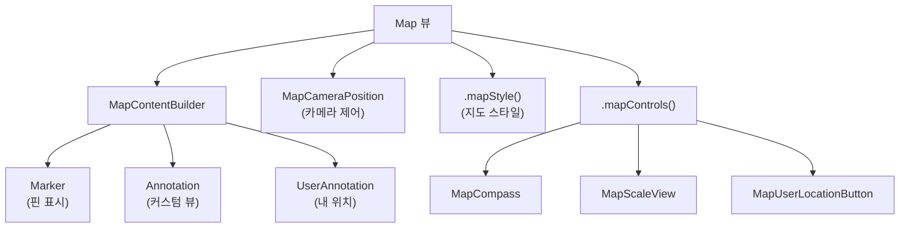
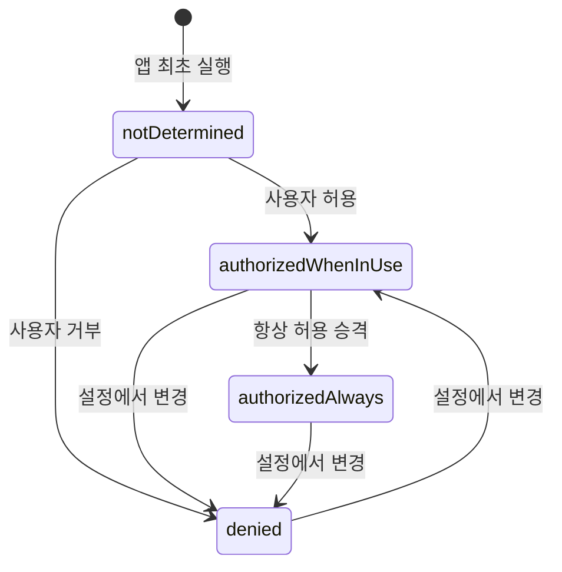
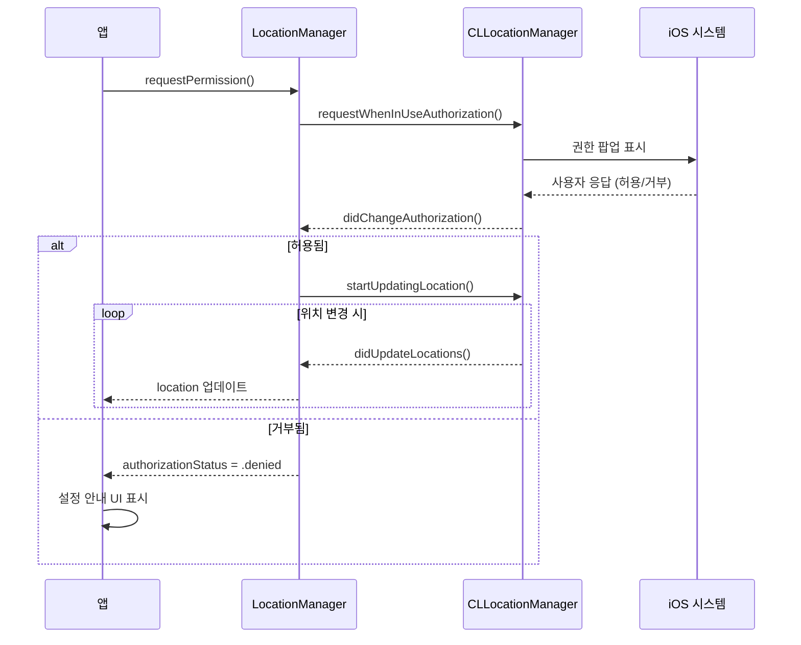

# 02. 지도와 위치

> Map 뷰, CoreLocation, 위치 권한 처리

## 개요

지도와 위치 정보는 배달 앱, 택시 앱, 부동산 앱 등 수많은 iOS 앱의 핵심입니다. iOS 17에서 SwiftUI용 MapKit이 완전히 새로워졌는데요, 이 섹션에서는 새로운 Map API부터 사용자 위치 추적, 권한 처리까지 한 번에 다룹니다.

**선수 지식**: [SwiftUI 기본 뷰](../03-swiftui-start/01-hello-swiftui.md), [@State와 @Binding](../05-state-management/01-state-binding.md)
**학습 목표**:
- SwiftUI Map 뷰로 지도를 표시하고 Marker/Annotation을 추가할 수 있다
- CoreLocation으로 사용자 위치를 추적할 수 있다
- 위치 권한 요청 흐름을 이해하고 구현할 수 있다

## 왜 알아야 할까?

앱스토어 상위 앱의 상당수가 위치 기반 기능을 포함하고 있습니다. 맛집 검색, 러닝 트래커, 날씨 앱, 배달 추적 — 사용자의 현재 위치를 알면 완전히 다른 차원의 UX를 만들 수 있거든요. 그리고 SwiftUI의 새로운 Map API는 이전보다 훨씬 직관적입니다.

## 핵심 개념

> 📊 **그림 1**: SwiftUI Map 구성 요소 전체 구조




### 개념 1: SwiftUI Map 뷰 — 지도 표시하기

> 💡 **비유**: 새로운 SwiftUI Map은 **레고 블록**과 같습니다. 지도라는 판 위에 Marker(핀), Annotation(커스텀 뷰), MapCircle(원) 같은 블록을 `MapContentBuilder`로 하나씩 올려놓는 방식이죠. 뷰 빌더와 같은 패턴이라 SwiftUI 개발자에게 매우 자연스럽습니다.

iOS 17에서 도입된 새로운 Map API는 `MapContentBuilder`를 사용합니다. SwiftUI의 `@ViewBuilder`와 비슷한 패턴이죠:

```swift
import SwiftUI
import MapKit

struct BasicMapView: View {
    var body: some View {
        // 기본 지도 — 아무 설정 없이도 동작합니다
        Map {
            // Marker로 위치를 표시합니다
            Marker(
                "서울 타워",
                coordinate: CLLocationCoordinate2D(
                    latitude: 37.5512,
                    longitude: 126.9882
                )
            )

            Marker(
                "경복궁",
                systemImage: "building.columns",
                coordinate: CLLocationCoordinate2D(
                    latitude: 37.5796,
                    longitude: 126.9770
                )
            )
        }
    }
}

#Preview {
    BasicMapView()
}
```

**커스텀 Annotation으로 더 풍부한 UI:**

```swift
import SwiftUI
import MapKit

struct AnnotationMapView: View {
    // 카메라 위치를 바인딩으로 제어합니다
    @State private var position: MapCameraPosition = .region(
        MKCoordinateRegion(
            center: CLLocationCoordinate2D(
                latitude: 37.5665,
                longitude: 126.9780
            ),
            span: MKCoordinateSpan(
                latitudeDelta: 0.05,
                longitudeDelta: 0.05
            )
        )
    )

    var body: some View {
        Map(position: $position) {
            // Annotation으로 커스텀 SwiftUI 뷰를 표시합니다
            Annotation(
                "맛집",
                coordinate: CLLocationCoordinate2D(
                    latitude: 37.5665,
                    longitude: 126.9780
                )
            ) {
                VStack {
                    Image(systemName: "fork.knife.circle.fill")
                        .font(.title)
                        .foregroundStyle(.orange)
                    Text("맛집")
                        .font(.caption2)
                        .bold()
                }
                .padding(4)
            }

            // 사용자 위치를 표시합니다
            UserAnnotation()
        }
        // 지도 스타일 설정
        .mapStyle(.standard(elevation: .realistic))
        // 지도 컨트롤 설정
        .mapControls {
            MapCompass()          // 나침반
            MapScaleView()        // 축척 표시
            MapUserLocationButton() // 내 위치 버튼
        }
    }
}

#Preview {
    AnnotationMapView()
}
```

**지도 스타일 비교:**

| 스타일 | 코드 | 설명 |
|--------|------|------|
| 기본 | `.mapStyle(.standard)` | 일반 도로 지도 |
| 위성 | `.mapStyle(.imagery)` | 위성 사진 |
| 하이브리드 | `.mapStyle(.hybrid)` | 위성 + 도로 레이블 |
| 3D 지형 | `.mapStyle(.standard(elevation: .realistic))` | 입체 지형 렌더링 |

### 개념 2: MapCameraPosition — 지도 카메라 제어

> 💡 **비유**: MapCameraPosition은 **드론 카메라의 리모컨**입니다. 특정 좌표 위로 날아가거나, 사용자를 따라다니거나, 여러 핀이 모두 보이게 줌 조절하는 것이 가능합니다.

```swift
import SwiftUI
import MapKit

struct CameraControlView: View {
    @State private var position: MapCameraPosition = .automatic

    var body: some View {
        VStack {
            Map(position: $position) {
                Marker("서울", coordinate: .init(
                    latitude: 37.5665, longitude: 126.9780))
                Marker("부산", coordinate: .init(
                    latitude: 35.1796, longitude: 129.0756))
            }

            // 카메라 위치 변경 버튼들
            HStack {
                Button("서울") {
                    withAnimation {
                        position = .region(MKCoordinateRegion(
                            center: .init(
                                latitude: 37.5665,
                                longitude: 126.9780
                            ),
                            span: .init(
                                latitudeDelta: 0.1,
                                longitudeDelta: 0.1
                            )
                        ))
                    }
                }

                Button("전체 보기") {
                    withAnimation {
                        // .automatic은 모든 콘텐츠가 보이게 자동 조절
                        position = .automatic
                    }
                }

                Button("내 위치") {
                    withAnimation {
                        position = .userLocation(
                            fallback: .automatic
                        )
                    }
                }
            }
            .buttonStyle(.bordered)
        }
    }
}

#Preview {
    CameraControlView()
}
```

**카메라 변경 감지:**

```swift
Map(position: $position) {
    // 콘텐츠...
}
.onMapCameraChange(frequency: .onEnd) { context in
    // 사용자가 지도를 움직인 후 호출됩니다
    print("중심 좌표: \(context.region.center)")
    print("줌 레벨: \(context.camera.distance)")
}
```

### 개념 3: CoreLocation — 사용자 위치 추적

> 📊 **그림 2**: 위치 권한 상태 전이 다이어그램




> 💡 **비유**: CoreLocation은 **GPS 내비게이션의 엔진**입니다. 위성 신호, Wi-Fi, 셀룰러 데이터를 조합해서 현재 위치를 알려주는데, 사용하기 전에 반드시 "목적지 검색을 위해 위치를 사용해도 될까요?"라고 허락을 구해야 합니다.

위치 권한 요청과 위치 추적을 담당하는 LocationManager를 만들어봅시다:

```swift
import CoreLocation
import SwiftUI

// 위치 관리를 담당하는 매니저
@Observable
class LocationManager: NSObject, CLLocationManagerDelegate {
    private let manager = CLLocationManager()

    var location: CLLocation?
    var authorizationStatus: CLAuthorizationStatus = .notDetermined

    override init() {
        super.init()
        manager.delegate = self
        manager.desiredAccuracy = kCLLocationAccuracyBest
    }

    // 위치 권한을 요청합니다
    func requestPermission() {
        manager.requestWhenInUseAuthorization()
    }

    // 위치 업데이트를 시작합니다
    func startUpdating() {
        manager.startUpdatingLocation()
    }

    // 위치 업데이트를 중지합니다
    func stopUpdating() {
        manager.stopUpdatingLocation()
    }

    // 권한 상태 변경 시 호출됩니다
    func locationManagerDidChangeAuthorization(
        _ manager: CLLocationManager
    ) {
        authorizationStatus = manager.authorizationStatus
        if authorizationStatus == .authorizedWhenInUse {
            startUpdating()
        }
    }

    // 위치가 업데이트되면 호출됩니다
    func locationManager(
        _ manager: CLLocationManager,
        didUpdateLocations locations: [CLLocation]
    ) {
        location = locations.last
    }

    // 에러 발생 시 호출됩니다
    func locationManager(
        _ manager: CLLocationManager,
        didFailWithError error: Error
    ) {
        print("위치 오류: \(error.localizedDescription)")
    }
}
```

> ⚠️ **흔한 오해**: "위치 권한을 한 번 거부하면 끝"이라고 생각하기 쉽지만, **설정 앱에서 언제든 변경**할 수 있습니다. 그래서 앱은 항상 현재 권한 상태를 확인하고, 거부 상태일 때는 설정으로 안내하는 UI를 제공해야 합니다.

**Info.plist 필수 키:**

| 키 | 설명 |
|-----|------|
| `NSLocationWhenInUseUsageDescription` | 앱 사용 중 위치 접근 이유 |
| `NSLocationAlwaysAndWhenInUseUsageDescription` | 백그라운드 위치 접근 이유 |

## 실습: 내 위치 지도 앱

위치 권한 요청부터 현재 위치 표시까지 한 번에 구현해봅시다:

```swift
import SwiftUI
import MapKit

struct MyLocationMapView: View {
    @State private var locationManager = LocationManager()
    @State private var position: MapCameraPosition = .userLocation(
        fallback: .automatic
    )

    var body: some View {
        ZStack {
            Map(position: $position) {
                UserAnnotation()
            }
            .mapStyle(.standard(elevation: .realistic))
            .mapControls {
                MapCompass()
                MapScaleView()
                MapUserLocationButton()
            }

            // 권한이 없으면 안내 메시지 표시
            if locationManager.authorizationStatus == .denied {
                VStack {
                    Spacer()
                    HStack {
                        Image(systemName: "location.slash")
                        Text("위치 권한이 필요합니다")
                        Button("설정 열기") {
                            if let url = URL(
                                string: UIApplication
                                    .openSettingsURLString
                            ) {
                                UIApplication.shared.open(url)
                            }
                        }
                        .buttonStyle(.borderedProminent)
                    }
                    .padding()
                    .background(.ultraThinMaterial)
                    .clipShape(RoundedRectangle(cornerRadius: 12))
                    .padding()
                }
            }
        }
        .onAppear {
            locationManager.requestPermission()
        }
    }
}

#Preview {
    MyLocationMapView()
}
```

## 더 깊이 알아보기

MapKit은 2012년 iOS 6에서 Apple Maps와 함께 처음 등장했습니다. 당시 Google Maps에서 자체 지도로의 전환은 많은 논란을 불렀지만, Apple은 꾸준히 MapKit을 개선해왔죠.

큰 전환점은 **WWDC 2023**이었습니다. "Meet MapKit for SwiftUI" 세션에서 Map API가 완전히 재설계되었는데, 기존의 `Map(coordinateRegion:)` 방식에서 `MapContentBuilder`를 사용하는 선언적 방식으로 바뀌었습니다. Marker, Annotation, MapPolyline, MapCircle 같은 콘텐츠를 SwiftUI 뷰처럼 선언적으로 추가할 수 있게 된 것이 가장 큰 변화입니다.

CoreLocation도 iOS 17에서 `CLLocationUpdate`라는 새로운 API를 도입하여, AsyncSequence 기반으로 위치 업데이트를 받을 수 있게 되었습니다. 기존의 델리게이트 패턴보다 Swift Concurrency와 자연스럽게 어우러집니다.

> 📊 **그림 3**: CoreLocation 위치 추적 흐름




## 흔한 오해와 팁

> ⚠️ **흔한 오해**: "`requestWhenInUseAuthorization()`을 호출하면 항상 권한 팝업이 뜬다" — 아닙니다! **처음 한 번만** 팝업이 표시됩니다. 이미 허용 또는 거부한 사용자에게는 팝업이 다시 뜨지 않으므로, 거부 상태를 감지해서 설정 앱으로 안내해야 합니다.

> 🔥 **실무 팁**: 지도에서 마커 선택을 구현하려면 `Map(selection:)` 바인딩을 사용하세요. 각 Marker에 `.tag()`을 붙이면 어떤 마커가 선택되었는지 추적할 수 있습니다.

> 💡 **알고 계셨나요?**: iOS 17의 `mapStyle(.standard(elevation: .realistic))`를 사용하면 서울의 남산타워, 뉴욕의 엠파이어스테이트 빌딩 같은 랜드마크가 3D로 렌더링됩니다. 기존 UIKit의 MKMapView로는 구현이 복잡했던 기능이 수정자 하나로 가능해진 거죠.

## 핵심 정리

| 개념 | 설명 |
|------|------|
| Map | SwiftUI 네이티브 지도 뷰, MapContentBuilder로 콘텐츠 구성 |
| Marker | 지도 위에 표시하는 핀 (시스템 아이콘, 모노그램 지원) |
| Annotation | 지도 위에 커스텀 SwiftUI 뷰를 배치 |
| MapCameraPosition | 지도 카메라 위치 (.automatic, .region, .userLocation 등) |
| mapStyle | 지도 스타일 (.standard, .imagery, .hybrid + elevation) |
| CLLocationManager | 위치 서비스의 핵심 클래스, 권한 요청과 위치 업데이트 담당 |
| CLAuthorizationStatus | 위치 권한 상태 (notDetermined, authorizedWhenInUse, denied 등) |
| onMapCameraChange | 카메라 이동 완료 시 콜백 (.onEnd 또는 .continuous) |

## 다음 섹션 미리보기

지도와 위치를 마스터했으니, 다음은 사용자에게 시의적절한 정보를 전달하는 **알림**입니다. [03. 알림](./03-notifications.md)에서 로컬 알림 생성, 예약, 액션 처리를 배웁니다.

## 참고 자료

- [Map - Apple Developer Documentation](https://developer.apple.com/documentation/mapkit/map) - Map 뷰 공식 API
- [CoreLocation - Apple Developer Documentation](https://developer.apple.com/documentation/corelocation) - 위치 서비스 프레임워크
- [Meet MapKit for SwiftUI - WWDC23](https://developer.apple.com/videos/play/wwdc2023/10043/) - 새로운 Map API 소개
- [Mastering MapKit in SwiftUI - Swift with Majid](https://swiftwithmajid.com/2023/11/28/mastering-mapkit-in-swiftui-basics/) - MapKit 실전 가이드
- [Selecting Photos and Videos in iOS - Apple Developer Documentation](https://developer.apple.com/documentation/photokit/selecting-photos-and-videos-in-ios) - 사진 선택 가이드
