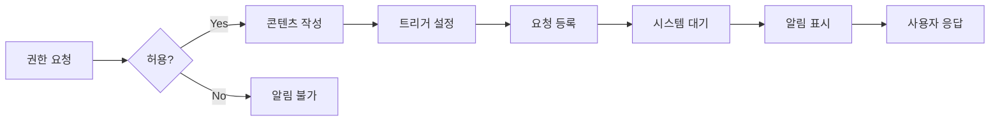
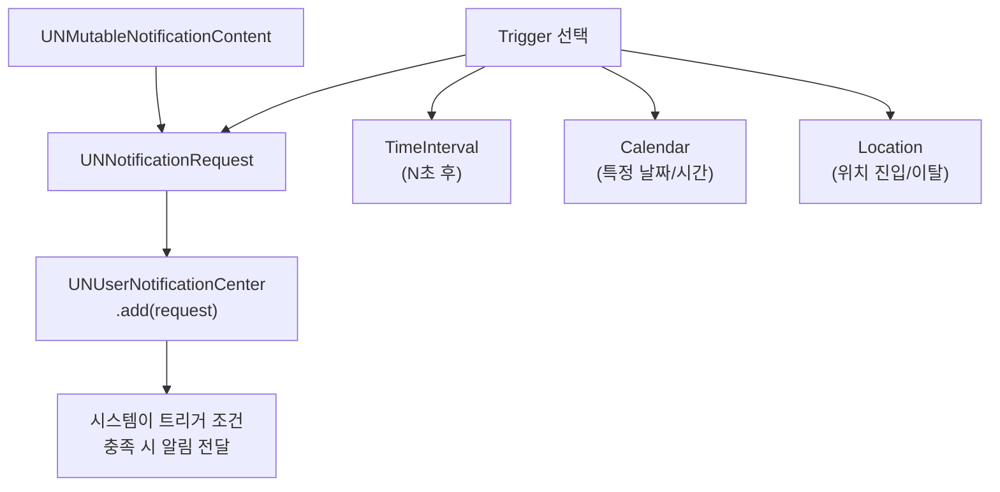
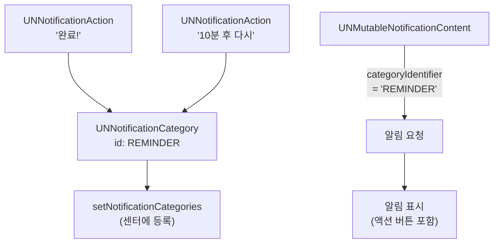
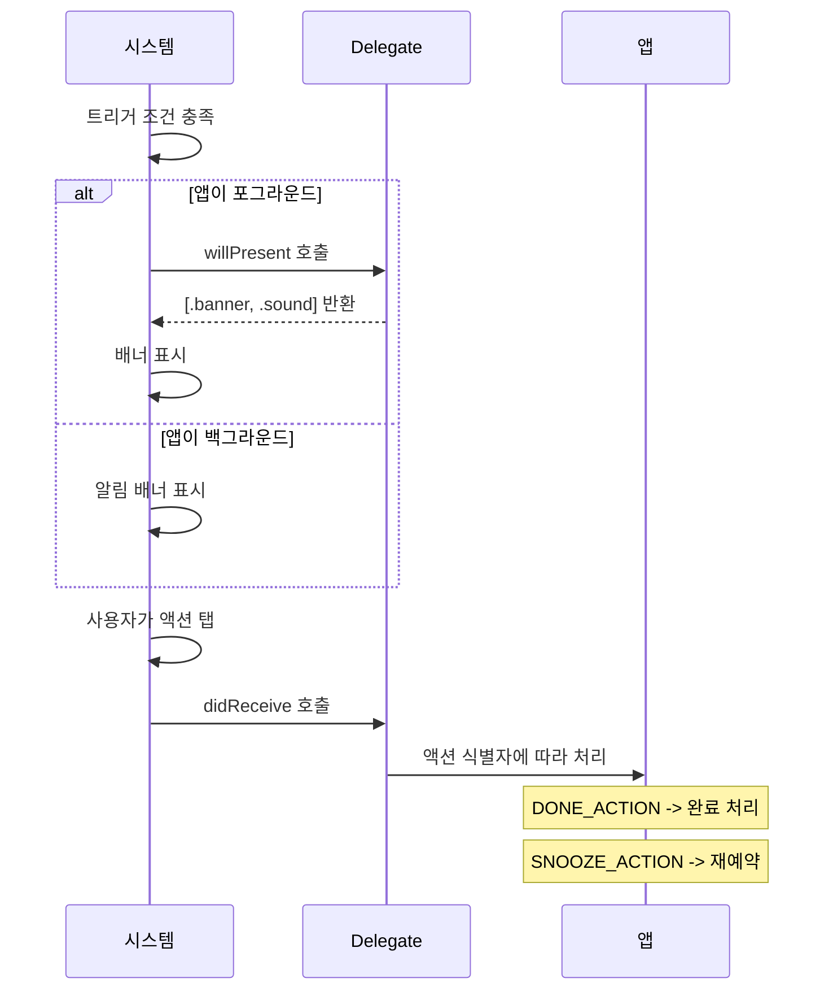

# 03. 알림

> 로컬 알림, 예약 알림, 알림 액션과 카테고리

## 개요

"물 마실 시간이에요!" "내일 오전 10시 미팅이 있습니다" — 앱이 닫혀 있어도 사용자에게 메시지를 전달할 수 있는 강력한 도구가 바로 알림(Notification)입니다. 이 섹션에서는 서버 없이도 구현할 수 있는 **로컬 알림**에 집중합니다.

**선수 지식**: [async/await 기초](../07-networking/01-async-await.md), [SwiftUI 기본 뷰](../03-swiftui-start/01-hello-swiftui.md)
**학습 목표**:
- 로컬 알림의 권한 요청부터 생성까지 전체 흐름을 구현할 수 있다
- 시간 기반, 날짜 기반, 위치 기반 트리거를 사용할 수 있다
- 알림에 액션 버튼을 추가하고 사용자 응답을 처리할 수 있다

## 왜 알아야 할까?

알림은 사용자 리텐션의 핵심입니다. 할 일 앱의 리마인더, 운동 앱의 동기부여 메시지, 습관 트래커의 체크 알림 — 이 모든 것이 로컬 알림으로 구현됩니다. 서버나 APNs 설정 없이도 바로 시작할 수 있어서, iOS 개발자가 가장 먼저 배워야 할 시스템 기능 중 하나죠.

## 핵심 개념

> 📊 **그림 1**: 로컬 알림의 전체 흐름 — 권한 요청부터 사용자 응답까지




### 개념 1: 알림 권한 요청

> 💡 **비유**: 알림 권한은 **초인종 설치 허가**와 같습니다. 아무리 중요한 소식이 있어도, 집주인(사용자)이 "초인종을 달아도 좋다"고 허락하지 않으면 문 앞에서 기다리는 수밖에 없죠.

알림을 보내려면 먼저 사용자에게 권한을 요청해야 합니다. `UNUserNotificationCenter`가 알림의 모든 것을 관리합니다:

```swift
import UserNotifications

// 알림 권한을 요청하는 함수
func requestNotificationPermission() async -> Bool {
    let center = UNUserNotificationCenter.current()

    do {
        // .alert: 배너, .badge: 앱 아이콘 뱃지, .sound: 소리
        let granted = try await center.requestAuthorization(
            options: [.alert, .badge, .sound]
        )
        return granted
    } catch {
        print("권한 요청 실패: \(error)")
        return false
    }
}
```

> ⚠️ **흔한 오해**: "권한 팝업은 원하는 때에 몇 번이든 띄울 수 있다" — 아닙니다! **시스템 권한 팝업은 딱 한 번만** 표시됩니다. 거부하면 다시 뜨지 않으니, 권한 요청 **타이밍**이 매우 중요합니다. 앱 첫 실행 시 바로 요청하기보다는, 알림의 가치를 먼저 보여준 후 적절한 시점에 요청하세요.

### 개념 2: 로컬 알림 만들기

> 💡 **비유**: 로컬 알림은 **예약 문자**와 같습니다. 내용(Content)을 작성하고, 발송 시간(Trigger)을 정하고, 발송 요청(Request)을 넣으면 시스템이 알아서 전달합니다.

알림은 세 가지 조각으로 구성됩니다: **콘텐츠 + 트리거 + 요청**

> 📊 **그림 2**: 알림의 세 가지 구성 요소가 합쳐져 요청이 되는 구조




```swift
import UserNotifications

// 5초 후 알림을 보내는 함수
func scheduleSimpleNotification() async {
    let center = UNUserNotificationCenter.current()

    // 1. 콘텐츠: 알림에 표시할 내용
    let content = UNMutableNotificationContent()
    content.title = "물 마실 시간!"
    content.body = "건강을 위해 한 잔 마셔보세요 💧"
    content.sound = .default

    // 2. 트리거: 언제 보낼지 (5초 후)
    let trigger = UNTimeIntervalNotificationTrigger(
        timeInterval: 5,
        repeats: false  // 반복 여부
    )

    // 3. 요청: 고유 ID + 콘텐츠 + 트리거
    let request = UNNotificationRequest(
        identifier: UUID().uuidString,
        content: content,
        trigger: trigger
    )

    // 알림 등록
    do {
        try await center.add(request)
        print("알림이 등록되었습니다!")
    } catch {
        print("알림 등록 실패: \(error)")
    }
}
```

**세 가지 트리거 유형:**

| 트리거 | 용도 | 예시 |
|--------|------|------|
| `UNTimeIntervalNotificationTrigger` | N초 후 | 타이머, 쿨타임 |
| `UNCalendarNotificationTrigger` | 특정 날짜/시간 | 매일 아침 8시, 생일 알림 |
| `UNLocationNotificationTrigger` | 특정 위치 진입/이탈 | 집 근처 도착 시 알림 |

**매일 반복 알림 (캘린더 트리거):**

```swift
import UserNotifications

// 매일 오전 8시에 알림
func scheduleDailyReminder() async {
    let content = UNMutableNotificationContent()
    content.title = "좋은 아침이에요!"
    content.body = "오늘도 코딩 할 준비 되셨나요?"
    content.sound = .default

    // 날짜 컴포넌트로 시간 지정
    var dateComponents = DateComponents()
    dateComponents.hour = 8    // 오전 8시
    dateComponents.minute = 0  // 정각

    let trigger = UNCalendarNotificationTrigger(
        dateMatching: dateComponents,
        repeats: true  // 매일 반복
    )

    let request = UNNotificationRequest(
        identifier: "daily-morning",  // 같은 ID로 덮어쓰기 가능
        content: content,
        trigger: trigger
    )

    try? await UNUserNotificationCenter.current().add(request)
}
```

### 개념 3: 알림 액션과 카테고리

> 💡 **비유**: 알림 액션은 **인터폰 버튼**과 같습니다. 단순히 "딩동" 소리만 나는 초인종이 아니라, "문 열기", "통화하기", "무시하기" 버튼이 달린 스마트 인터폰인 거죠. 사용자가 앱을 열지 않고도 바로 반응할 수 있습니다.

알림에 커스텀 버튼을 추가하면 사용자가 앱을 열지 않고도 바로 행동할 수 있습니다:

> 📊 **그림 3**: 알림 액션과 카테고리의 등록 및 연결 구조




```swift
import UserNotifications
import SwiftUI

// 알림 카테고리와 액션을 등록하는 클래스
@MainActor
class NotificationManager: NSObject, ObservableObject,
    @preconcurrency UNUserNotificationCenterDelegate {

    override init() {
        super.init()
        registerCategories()
        UNUserNotificationCenter.current().delegate = self
    }

    // 카테고리와 액션을 등록합니다
    private func registerCategories() {
        // 액션 정의
        let doneAction = UNNotificationAction(
            identifier: "DONE_ACTION",
            title: "완료!",
            options: []
        )

        let snoozeAction = UNNotificationAction(
            identifier: "SNOOZE_ACTION",
            title: "10분 후 다시",
            options: []
        )

        // 카테고리에 액션 묶기
        let reminderCategory = UNNotificationCategory(
            identifier: "REMINDER",
            actions: [doneAction, snoozeAction],
            intentIdentifiers: [],
            options: .customDismissAction
        )

        UNUserNotificationCenter.current()
            .setNotificationCategories([reminderCategory])
    }

    // 알림 전송 (카테고리 포함)
    func sendReminderNotification() async {
        let content = UNMutableNotificationContent()
        content.title = "물 마시기 리마인더"
        content.body = "한 잔 마셨으면 '완료'를, 나중에 하려면 '10분 후 다시'를 눌러주세요."
        content.sound = .default
        // 카테고리 ID를 연결합니다
        content.categoryIdentifier = "REMINDER"

        let trigger = UNTimeIntervalNotificationTrigger(
            timeInterval: 5, repeats: false
        )
        let request = UNNotificationRequest(
            identifier: UUID().uuidString,
            content: content,
            trigger: trigger
        )

        try? await UNUserNotificationCenter.current().add(request)
    }

    // 앱이 포그라운드일 때도 알림을 표시합니다
    nonisolated func userNotificationCenter(
        _ center: UNUserNotificationCenter,
        willPresent notification: UNNotification
    ) async -> UNNotificationPresentationOptions {
        // 앱이 열려있어도 배너와 소리를 재생
        return [.banner, .sound]
    }

    // 사용자가 알림의 액션 버튼을 탭했을 때 호출됩니다
    nonisolated func userNotificationCenter(
        _ center: UNUserNotificationCenter,
        didReceive response: UNNotificationResponse
    ) async {
        switch response.actionIdentifier {
        case "DONE_ACTION":
            print("사용자가 '완료'를 선택했습니다!")

        case "SNOOZE_ACTION":
            print("10분 후 다시 알림을 보냅니다")
            // 10분 후 다시 알림 전송
            let content = response.notification.request.content
                .mutableCopy() as! UNMutableNotificationContent
            let trigger = UNTimeIntervalNotificationTrigger(
                timeInterval: 600, repeats: false
            )
            let request = UNNotificationRequest(
                identifier: UUID().uuidString,
                content: content,
                trigger: trigger
            )
            try? await center.add(request)

        default:
            // 알림 본문을 탭한 경우
            print("알림을 탭하여 앱을 열었습니다")
        }
    }
}
```

## 실습: 알림 테스트 앱

> 📊 **그림 4**: 알림 수신 시 델리게이트 콜백 흐름




권한 요청, 알림 전송, 액션 처리를 모두 포함한 앱을 만들어봅시다:

```swift
import SwiftUI

struct NotificationDemoView: View {
    @StateObject private var notificationManager
        = NotificationManager()
    @State private var permissionGranted = false

    var body: some View {
        NavigationStack {
            VStack(spacing: 24) {
                // 권한 상태 표시
                HStack {
                    Image(systemName: permissionGranted
                        ? "bell.badge.fill" : "bell.slash")
                        .foregroundStyle(
                            permissionGranted ? .green : .red
                        )
                    Text(permissionGranted
                        ? "알림 권한 허용됨"
                        : "알림 권한 필요")
                }
                .font(.headline)

                // 권한 요청 버튼
                if !permissionGranted {
                    Button("알림 권한 요청") {
                        Task {
                            let center = UNUserNotificationCenter
                                .current()
                            let granted = try? await center
                                .requestAuthorization(
                                    options: [.alert, .badge, .sound]
                                )
                            permissionGranted = granted ?? false
                        }
                    }
                    .buttonStyle(.borderedProminent)
                }

                Divider()

                // 알림 전송 버튼들
                VStack(spacing: 12) {
                    Button("5초 후 간단한 알림") {
                        Task {
                            await scheduleSimpleNotification()
                        }
                    }

                    Button("액션 버튼이 있는 알림") {
                        Task {
                            await notificationManager
                                .sendReminderNotification()
                        }
                    }

                    Button("대기 중인 알림 모두 취소") {
                        UNUserNotificationCenter.current()
                            .removeAllPendingNotificationRequests()
                    }
                    .foregroundStyle(.red)
                }
                .buttonStyle(.bordered)

                Spacer()
            }
            .padding()
            .navigationTitle("알림 테스트")
        }
        .task {
            let settings = await UNUserNotificationCenter
                .current().notificationSettings()
            permissionGranted
                = settings.authorizationStatus == .authorized
        }
    }
}

#Preview {
    NotificationDemoView()
}
```

> 🔥 **실무 팁**: 알림 테스트할 때는 앱을 백그라운드로 보내야 합니다. 기본적으로 앱이 포그라운드일 때는 알림이 표시되지 않거든요. `UNUserNotificationCenterDelegate`의 `willPresent` 메서드에서 `.banner`를 반환해야 포그라운드에서도 알림이 보입니다.

## 더 깊이 알아보기

iOS의 알림 시스템은 긴 역사를 가지고 있습니다. Apple은 2009년 iOS 3.0에서 APNs(Apple Push Notification service)를 최초로 출시했는데, 이는 모바일 플랫폼에서 푸시 알림을 구현한 초기 사례 중 하나였습니다.

하지만 초기의 알림은 매우 단순했습니다 — 텍스트와 뱃지 숫자가 전부였죠. 큰 변화는 **iOS 10(2016년)**에서 왔습니다. UserNotifications 프레임워크가 도입되면서 리치 알림(이미지, GIF, 비디오)이 가능해졌고, 알림 액션과 카테고리도 이때 현대적인 형태를 갖추었습니다.

iOS 12에서는 `provisional` 권한이 추가되어, 사용자에게 물어보지 않고도 알림 센터에 조용히 알림을 보낼 수 있게 되었습니다. iOS 15에서는 Focus 모드가 도입되며 알림 관리의 패러다임이 바뀌었고, iOS 18에서는 Apple Intelligence가 알림을 지능적으로 요약하고 우선순위를 매기는 기능이 추가되었습니다.

## 흔한 오해와 팁

> ⚠️ **흔한 오해**: "로컬 알림은 앱이 꺼져도 항상 정확한 시간에 온다" — 대부분 맞지만, 시스템이 알림 전달 시점을 약간 지연시킬 수 있습니다. 특히 저전력 모드나 Focus 모드에서는 알림이 묶여서 나중에 한꺼번에 전달될 수 있어요.

> 🔥 **실무 팁**: `UNTimeIntervalNotificationTrigger`에서 `repeats: true`를 사용하려면 **최소 60초** 이상이어야 합니다. 60초 미만으로 반복 알림을 설정하면 런타임 에러가 발생합니다.

> 💡 **알고 계셨나요?**: Swift 6의 Strict Concurrency에서 `UNUserNotificationCenterDelegate`를 사용하면 Sendable 관련 경고가 발생할 수 있습니다. `@preconcurrency` 어트리뷰트를 프로토콜 적합성에 추가하면 해결됩니다.

## 핵심 정리

| 개념 | 설명 |
|------|------|
| UNUserNotificationCenter | 알림 시스템의 중앙 관리자 (권한 요청, 알림 등록/취소) |
| UNMutableNotificationContent | 알림 내용 (title, body, sound, badge, categoryIdentifier) |
| UNTimeIntervalNotificationTrigger | N초 후 발동하는 트리거 (repeats: true면 최소 60초) |
| UNCalendarNotificationTrigger | 특정 날짜/시간에 발동 (DateComponents 기반) |
| UNLocationNotificationTrigger | 특정 위치 진입/이탈 시 발동 (CLRegion 기반) |
| UNNotificationAction | 알림에 추가하는 커스텀 버튼 |
| UNNotificationCategory | 액션들을 그룹으로 묶어 카테고리로 등록 |
| willPresent 델리게이트 | 앱 포그라운드에서 알림 표시 여부 결정 |
| didReceive 델리게이트 | 사용자의 알림 액션 응답 처리 |

## 다음 섹션 미리보기

이제 앱 내부의 콘텐츠를 외부와 연결할 차례입니다. [04. 공유와 딥링크](./04-sharing-deeplink.md)에서 ShareLink로 콘텐츠를 공유하고, Universal Links와 URL Scheme으로 외부에서 앱의 특정 화면으로 바로 진입하는 딥링크를 구현합니다.

## 참고 자료

- [User Notifications - Apple Developer Documentation](https://developer.apple.com/documentation/usernotifications) - 공식 프레임워크 문서
- [Asking permission to use notifications - Apple Developer Documentation](https://developer.apple.com/documentation/usernotifications/asking-permission-to-use-notifications) - 권한 요청 가이드
- [Scheduling local notifications - Hacking with Swift](https://www.hackingwithswift.com/books/ios-swiftui/scheduling-local-notifications) - 실습 중심 튜토리얼
- [Introduction to Notifications - WWDC16](https://developer.apple.com/videos/play/wwdc2016/707/) - UserNotifications 프레임워크 소개
- [The Evolution of Push Notifications - Braze](https://www.braze.com/resources/articles/push-notification-evolution-2009-to-now) - 알림 시스템 역사
