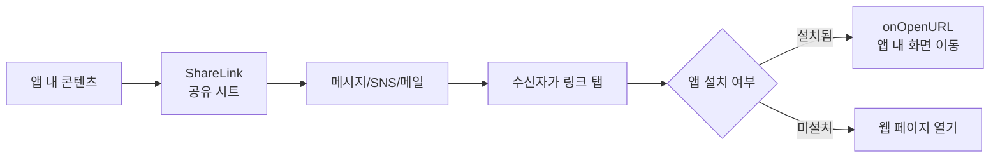
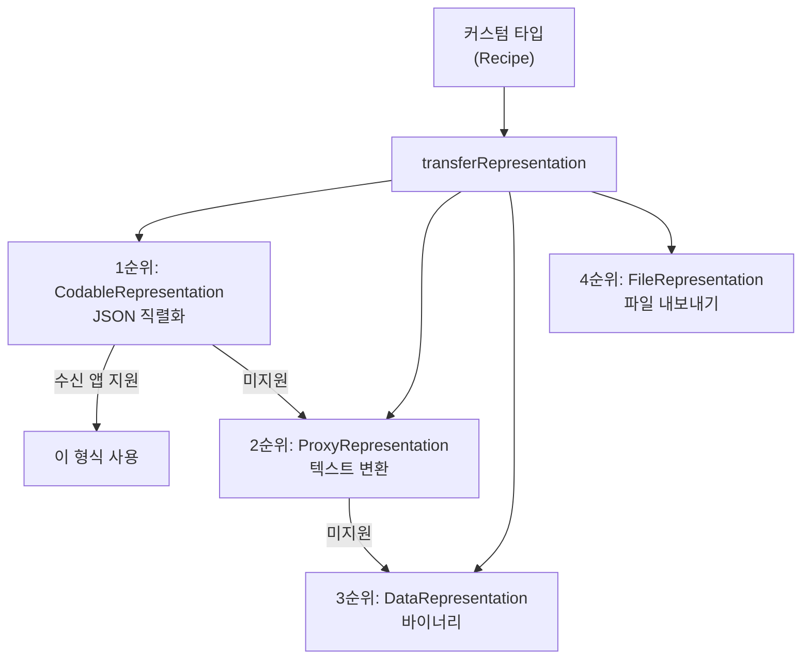
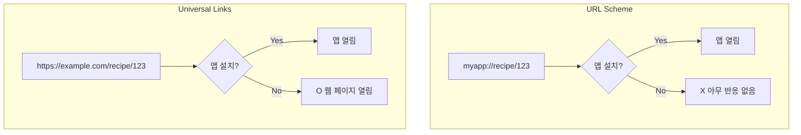
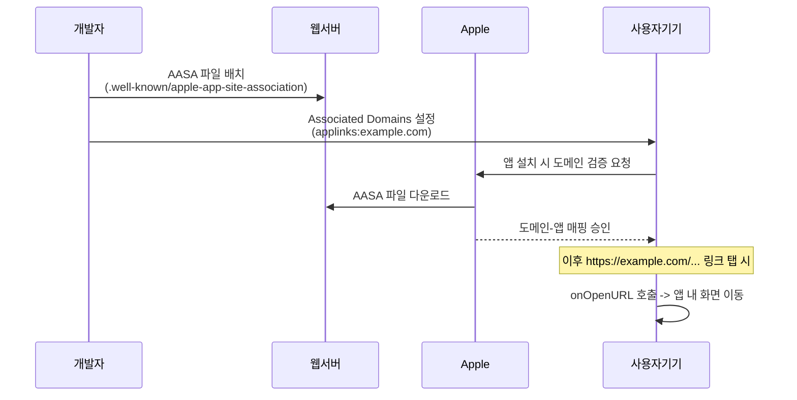
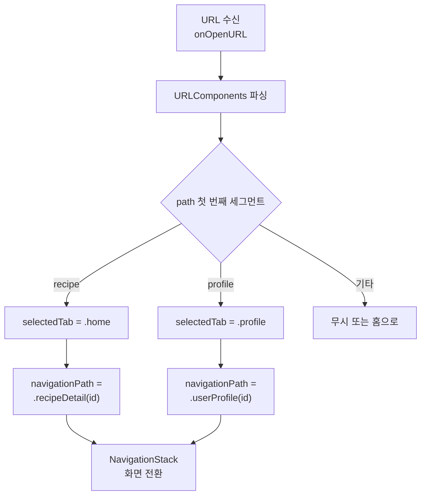

# 04. 공유와 딥링크

> ShareLink, Universal Links, URL Scheme, Transferable

## 개요

친구에게 맛집 정보를 공유하고, 카카오톡에서 링크를 탭하면 앱의 해당 페이지로 바로 이동하는 경험 — 이것이 공유와 딥링크입니다. 이 섹션에서는 SwiftUI의 네이티브 공유 기능인 ShareLink부터, 앱 외부에서 내부 화면으로 직접 연결하는 딥링크까지 다룹니다.

**선수 지식**: [NavigationStack](../04-navigation-design/01-navigation-stack.md), [네비게이션 설계](../08-architecture/03-navigation-design.md)
**학습 목표**:
- ShareLink와 Transferable 프로토콜로 콘텐츠를 공유할 수 있다
- URL Scheme과 Universal Links의 차이를 이해하고 구현할 수 있다
- onOpenURL로 딥링크를 받아 앱 내 화면 전환을 처리할 수 있다

## 왜 알아야 할까?

> 📊 **그림 1**: 공유와 딥링크의 전체 흐름 — 콘텐츠가 앱 밖으로 나가고 다시 돌아오는 순환




공유 기능이 없는 앱은 섬과 같습니다. 사용자가 좋은 콘텐츠를 발견해도 친구에게 전달할 방법이 없으니까요. 그리고 딥링크가 없으면, 마케팅 캠페인에서 "이 링크를 탭하면 특정 상품 페이지로 이동"하는 자연스러운 사용자 경험을 만들 수 없습니다. 공유는 앱의 성장을, 딥링크는 사용자 경험을 책임집니다.

## 핵심 개념

### 개념 1: ShareLink — SwiftUI 네이티브 공유

> 💡 **비유**: ShareLink는 **레스토랑의 "친구에게 추천하기" 카드**와 같습니다. 메뉴 이름, 사진, 한 줄 설명이 적힌 카드를 만들어서 건네면, 받는 사람이 카카오톡으로든 메시지로든 원하는 방법으로 전달할 수 있죠.

ShareLink는 iOS 16(WWDC 2022)에서 도입된 SwiftUI 뷰로, 기존의 UIActivityViewController를 대체합니다. 한 줄로 공유 시트를 띄울 수 있어요:

**기본 텍스트 공유:**

```swift
import SwiftUI

struct BasicShareView: View {
    var body: some View {
        VStack(spacing: 20) {
            // 가장 간단한 형태 — 문자열 공유
            ShareLink(item: "2026: Swift 완전 정복으로 iOS 개발 배우는 중!")

            // 커스텀 레이블로 버튼 꾸미기
            ShareLink(
                item: "https://example.com/recipe/123"
            ) {
                Label("레시피 공유하기", systemImage: "square.and.arrow.up")
            }
            .buttonStyle(.borderedProminent)
        }
        .padding()
    }
}

#Preview {
    BasicShareView()
}
```

**미리보기와 함께 공유:**

```swift
import SwiftUI

struct PreviewShareView: View {
    let recipeTitle = "김치찌개 황금 레시피"
    let recipeURL = URL(string: "https://example.com/recipe/kimchi")!

    var body: some View {
        ShareLink(
            item: recipeURL,
            subject: Text("맛있는 레시피 발견!"),
            message: Text("이 김치찌개 레시피 꼭 해봐!"),
            preview: SharePreview(
                recipeTitle,
                image: Image(systemName: "fork.knife")
            )
        ) {
            Label("레시피 공유", systemImage: "square.and.arrow.up")
        }
        .buttonStyle(.bordered)
    }
}

#Preview {
    PreviewShareView()
}
```

### 개념 2: Transferable — 커스텀 타입 공유하기

> 📊 **그림 2**: Transferable 표현 방식의 우선순위와 폴백 구조




> 💡 **비유**: Transferable은 **택배 포장 규격**과 같습니다. 물건(데이터)을 보내려면 표준 박스(표현 방식)에 넣어야 택배 시스템(공유 시트)이 처리할 수 있죠. CodableRepresentation은 JSON 포장, DataRepresentation은 바이너리 포장, FileRepresentation은 파일 포장입니다.

ShareLink에서 커스텀 타입을 공유하려면 `Transferable` 프로토콜을 채택해야 합니다:

```swift
import SwiftUI
import CoreTransferable
import UniformTypeIdentifiers

// 커스텀 UTType 정의
extension UTType {
    static var recipe: UTType {
        UTType(exportedAs: "com.example.recipe")
    }
}

// Transferable을 채택한 레시피 모델
struct Recipe: Codable, Transferable {
    var title: String
    var ingredients: [String]
    var instructions: String

    // 공유할 때 어떤 형식으로 내보낼지 정의
    static var transferRepresentation: some TransferRepresentation {
        // 1순위: Codable(JSON)로 내보내기
        CodableRepresentation(contentType: .recipe)

        // 2순위: 일반 텍스트로 내보내기
        ProxyRepresentation { recipe in
            "\(recipe.title)\n재료: \(recipe.ingredients.joined(separator: ", "))"
        }
    }
}
```

**커스텀 타입 공유 사용:**

```swift
import SwiftUI

struct RecipeShareView: View {
    let recipe = Recipe(
        title: "김치찌개",
        ingredients: ["김치", "돼지고기", "두부", "대파"],
        instructions: "1. 김치를 볶는다 2. 물을 붓는다 3. 끓인다"
    )

    var body: some View {
        VStack(spacing: 16) {
            Text(recipe.title)
                .font(.title.bold())

            Text("재료: \(recipe.ingredients.joined(separator: ", "))")
                .foregroundStyle(.secondary)

            ShareLink(
                item: recipe,
                preview: SharePreview(
                    recipe.title,
                    image: Image(systemName: "fork.knife")
                )
            ) {
                Label("레시피 공유", systemImage: "square.and.arrow.up")
            }
            .buttonStyle(.borderedProminent)
        }
        .padding()
    }
}

#Preview {
    RecipeShareView()
}
```

**Transferable 표현 방식 비교:**

| 표현 방식 | 용도 | 적합한 경우 |
|-----------|------|-------------|
| `CodableRepresentation` | JSON/Plist 직렬화 | Codable을 채택한 모델 |
| `DataRepresentation` | 바이너리 데이터 | 이미지, 커스텀 바이너리 |
| `FileRepresentation` | 파일 기반 | 문서, 대용량 데이터 |
| `ProxyRepresentation` | 다른 Transferable로 변환 | 문자열/이미지로 간단 변환 |

### 개념 3: URL Scheme — 커스텀 URL로 앱 열기

> 📊 **그림 3**: URL Scheme vs Universal Links 비교




> 💡 **비유**: URL Scheme은 **앱 전용 전화번호**와 같습니다. "myapp://"이라는 번호로 전화하면 바로 우리 앱이 받는 거죠. 단, 같은 번호를 다른 앱이 쓸 수도 있다는 문제가 있어서, 중요한 통화는 Universal Links(검증된 번호)를 쓰는 것이 좋습니다.

URL Scheme을 설정하면 다른 앱이나 웹에서 `myapp://path` 형태의 URL로 앱을 열 수 있습니다:

**1단계: Xcode 프로젝트 설정**

Xcode → Target → Info → URL Types에서 추가:
- Identifier: `com.example.myapp`
- URL Schemes: `myapp`

**2단계: SwiftUI에서 URL 처리:**

```swift
import SwiftUI

@main
struct MyApp: App {
    var body: some Scene {
        WindowGroup {
            ContentView()
                // URL Scheme으로 앱이 열릴 때 호출됩니다
                .onOpenURL { url in
                    handleDeepLink(url)
                }
        }
    }

    func handleDeepLink(_ url: URL) {
        // myapp://recipe/123 형태의 URL 파싱
        guard url.scheme == "myapp" else { return }

        let host = url.host()       // "recipe"
        let pathComponents = url.pathComponents  // ["123"]

        print("딥링크: host=\(host ?? ""), path=\(pathComponents)")
    }
}
```

### 개념 4: Universal Links — 검증된 딥링크

> 📊 **그림 4**: Universal Links 설정 및 검증 흐름




> 💡 **비유**: Universal Links는 **정부 인증 전화번호**와 같습니다. URL Scheme이 누구나 등록할 수 있는 일반 번호라면, Universal Links는 도메인 소유권을 증명해야 하는 인증된 번호입니다. 중복이 없고, 앱이 설치되지 않았으면 웹 페이지로 자동 연결되죠.

Universal Links는 `https://yourapp.com/recipe/123` 같은 일반 웹 URL을 앱에서 바로 열 수 있게 합니다:

**설정 단계:**

1. **웹 서버**: `/.well-known/apple-app-site-association` 파일 배치
2. **Xcode**: Associated Domains capability에 `applinks:yourapp.com` 추가
3. **SwiftUI**: `.onOpenURL`로 URL 처리

```swift
import SwiftUI

// 딥링크를 처리하는 라우터
@Observable
class DeepLinkRouter {
    var selectedTab: Tab = .home
    var navigationPath: [Route] = []

    enum Tab {
        case home, search, profile
    }

    enum Route: Hashable {
        case recipeDetail(id: String)
        case userProfile(id: String)
        case settings
    }

    // URL을 파싱하여 앱 내 화면으로 라우팅합니다
    func handle(_ url: URL) {
        // myapp://recipe/123 또는
        // https://example.com/recipe/123 처리
        guard let components = URLComponents(
            url: url, resolvingAgainstBaseURL: true
        ) else { return }

        let path = components.path
        let pathParts = path.split(separator: "/")
            .map(String.init)

        if pathParts.first == "recipe",
           let id = pathParts.dropFirst().first {
            selectedTab = .home
            navigationPath = [.recipeDetail(id: id)]
        } else if pathParts.first == "profile",
                  let id = pathParts.dropFirst().first {
            selectedTab = .profile
            navigationPath = [.userProfile(id: id)]
        }
    }
}
```

**딥링크 라우터를 앱에 연결:**

```swift
import SwiftUI

struct DeepLinkDemoView: View {
    @State private var router = DeepLinkRouter()

    var body: some View {
        TabView(selection: $router.selectedTab) {
            Tab("홈", systemImage: "house",
                value: DeepLinkRouter.Tab.home) {
                NavigationStack(path: $router.navigationPath) {
                    Text("홈 화면")
                        .navigationDestination(
                            for: DeepLinkRouter.Route.self
                        ) { route in
                            switch route {
                            case .recipeDetail(let id):
                                Text("레시피 상세: \(id)")
                            case .userProfile(let id):
                                Text("프로필: \(id)")
                            case .settings:
                                Text("설정")
                            }
                        }
                }
            }

            Tab("검색", systemImage: "magnifyingglass",
                value: DeepLinkRouter.Tab.search) {
                Text("검색 화면")
            }

            Tab("프로필", systemImage: "person",
                value: DeepLinkRouter.Tab.profile) {
                Text("프로필 화면")
            }
        }
        .onOpenURL { url in
            router.handle(url)
        }
    }
}

#Preview {
    DeepLinkDemoView()
}
```

## 실습: 공유 + 딥링크 통합

> 📊 **그림 5**: 딥링크 라우터의 URL 파싱 및 화면 전환 흐름




레시피를 공유하고, 공유된 링크를 통해 앱으로 돌아오는 전체 흐름을 구현합니다:

```swift
import SwiftUI

struct RecipeCardView: View {
    let id: String = "kimchi-123"
    let title: String = "김치찌개"
    let description: String = "집에서 만드는 정통 김치찌개 레시피"

    // 공유할 딥링크 URL
    var shareURL: URL {
        URL(string: "https://example.com/recipe/\(id)")!
    }

    var body: some View {
        VStack(alignment: .leading, spacing: 12) {
            Text(title)
                .font(.title2.bold())

            Text(description)
                .foregroundStyle(.secondary)

            HStack {
                // ShareLink로 공유
                ShareLink(
                    item: shareURL,
                    preview: SharePreview(
                        title,
                        image: Image(systemName: "fork.knife")
                    )
                ) {
                    Label("공유", systemImage: "square.and.arrow.up")
                        .font(.callout)
                }
                .buttonStyle(.bordered)

                Spacer()

                // 복사 버튼
                Button {
                    UIPasteboard.general.url = shareURL
                } label: {
                    Label("링크 복사", systemImage: "doc.on.doc")
                        .font(.callout)
                }
                .buttonStyle(.bordered)
            }
        }
        .padding()
        .background(.background)
        .clipShape(RoundedRectangle(cornerRadius: 12))
        .shadow(radius: 2)
    }
}

#Preview {
    RecipeCardView()
        .padding()
}
```

## 더 깊이 알아보기

공유 기능의 역사는 iOS 6(2012년)으로 거슬러 올라갑니다. 당시 `UIActivityViewController`가 도입되면서 처음으로 통합 공유 시트가 등장했죠. 이전에는 각 서비스(Twitter, Facebook 등)별로 개별 SDK를 연동해야 했습니다.

WWDC 2022에서 Apple은 `ShareLink`와 `Transferable` 프로토콜을 함께 발표했습니다. Transferable은 기존의 `NSItemProvider` 기반 시스템을 대체하는 현대적인 API로, Swift의 타입 시스템과 자연스럽게 통합됩니다. 단일 프로토콜로 **공유, 드래그 앤 드롭, 복사/붙여넣기, PasteButton**을 모두 처리할 수 있게 된 것이 핵심이죠.

Universal Links는 iOS 9(2015년)에서 도입되었으며, 웹과 앱 사이의 심리스한 전환을 가능하게 한 중요한 기술입니다. `apple-app-site-association` 파일을 통해 Apple 서버가 도메인 소유권을 검증하기 때문에, URL Scheme과 달리 다른 앱에 의한 하이재킹이 불가능합니다.

iOS 26에서는 공유 시트도 Liquid Glass 디자인이 적용되어, 반투명 유리 효과가 기본으로 적용됩니다. 작은 높이의 시트에서는 모서리가 둥글게 안쪽으로 들어오고, 전체 높이로 전환하면 불투명하게 바뀌는 부드러운 애니메이션이 적용됩니다.

## 흔한 오해와 팁

> ⚠️ **흔한 오해**: "URL Scheme만 있으면 딥링크 완성이다" — URL Scheme(`myapp://`)은 앱이 설치되어 있을 때만 동작합니다. 앱이 없으면 아무 반응이 없죠. 프로덕션에서는 **Universal Links**를 사용해야 앱이 없을 때 웹 페이지로 자동 전환됩니다.

> 🔥 **실무 팁**: `SharePreview`에 이미지를 넣으면 공유 시트에서 미리보기가 훨씬 매력적으로 보입니다. 이미지 없이 텍스트만 공유하는 것보다 전환율이 높아지니, 가능하면 항상 미리보기를 포함하세요.

> 💡 **알고 계셨나요?**: Transferable 프로토콜의 `transferRepresentation`에서 여러 표현을 정의할 때, **위에 있는 것이 우선순위가 높습니다**. 수신 앱이 첫 번째 형식을 지원하면 그것을 사용하고, 아니면 다음 형식으로 폴백하는 방식이에요.

## 핵심 정리

| 개념 | 설명 |
|------|------|
| ShareLink | SwiftUI 네이티브 공유 뷰, UIActivityViewController 대체 (iOS 16+) |
| SharePreview | 공유 시트에 표시되는 미리보기 (제목 + 이미지) |
| Transferable | 공유/드래그/붙여넣기를 위한 데이터 표현 프로토콜 |
| CodableRepresentation | Codable 타입을 JSON으로 직렬화하는 표현 |
| ProxyRepresentation | 다른 Transferable 타입으로 변환하는 표현 |
| URL Scheme | `myapp://` 형태의 커스텀 URL (앱 미설치 시 동작 안 함) |
| Universal Links | `https://` 기반 검증된 딥링크 (앱 미설치 시 웹으로 전환) |
| onOpenURL | SwiftUI에서 딥링크 URL을 수신하는 수정자 |

## 다음 섹션 미리보기

Ch10 시스템 프레임워크 활용을 모두 마쳤습니다! 이미지, 지도, 알림, 공유라는 iOS의 핵심 기능을 SwiftUI로 다루는 방법을 배웠죠. 다음 [Ch11. 고급 SwiftUI](../11-advanced-swiftui/01-custom-layout.md)에서는 Custom Layout, ViewBuilder, PreferenceKey 같은 SwiftUI의 숨겨진 고급 기능들을 탐험합니다.

## 참고 자료

- [ShareLink - Apple Developer Documentation](https://developer.apple.com/documentation/swiftui/sharelink) - ShareLink 공식 API
- [Transferable - Apple Developer Documentation](https://developer.apple.com/documentation/coretransferable/transferable) - Transferable 프로토콜
- [Meet Transferable - WWDC22](https://developer.apple.com/videos/play/wwdc2022/10062/) - Transferable 소개 세션
- [Supporting Universal Links in Your App - Apple Developer Documentation](https://developer.apple.com/documentation/xcode/supporting-universal-links-in-your-app) - Universal Links 설정 가이드
- [Mastering NavigationStack in SwiftUI. Deep Linking - Swift with Majid](https://swiftwithmajid.com/2022/06/21/mastering-navigationstack-in-swiftui-deep-linking/) - NavigationStack 딥링크 실전
