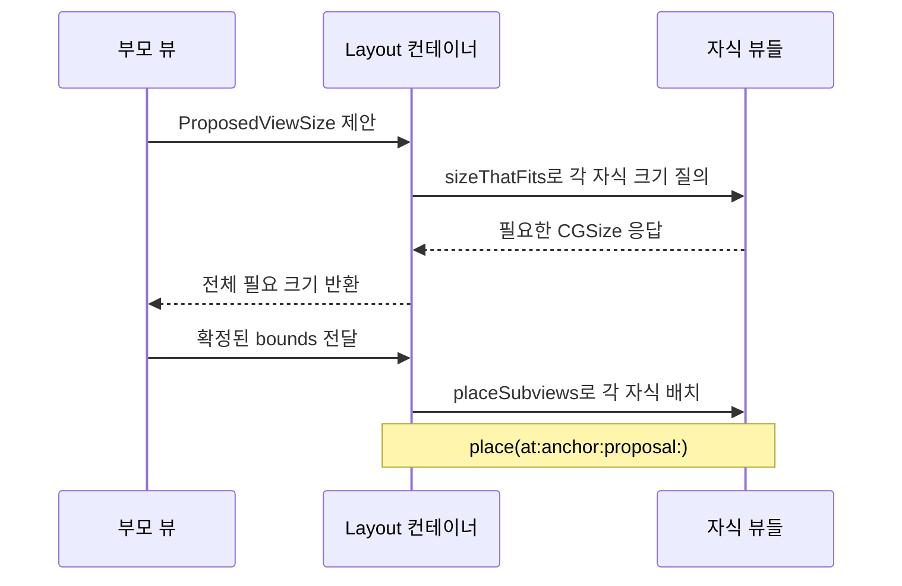
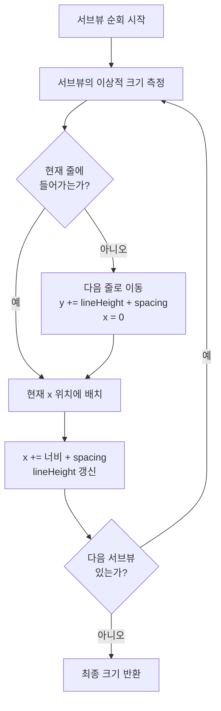
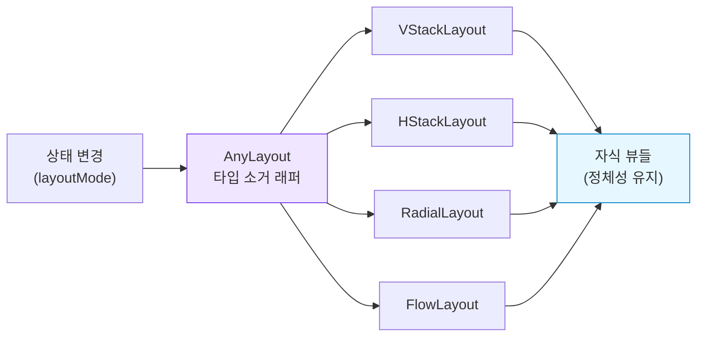
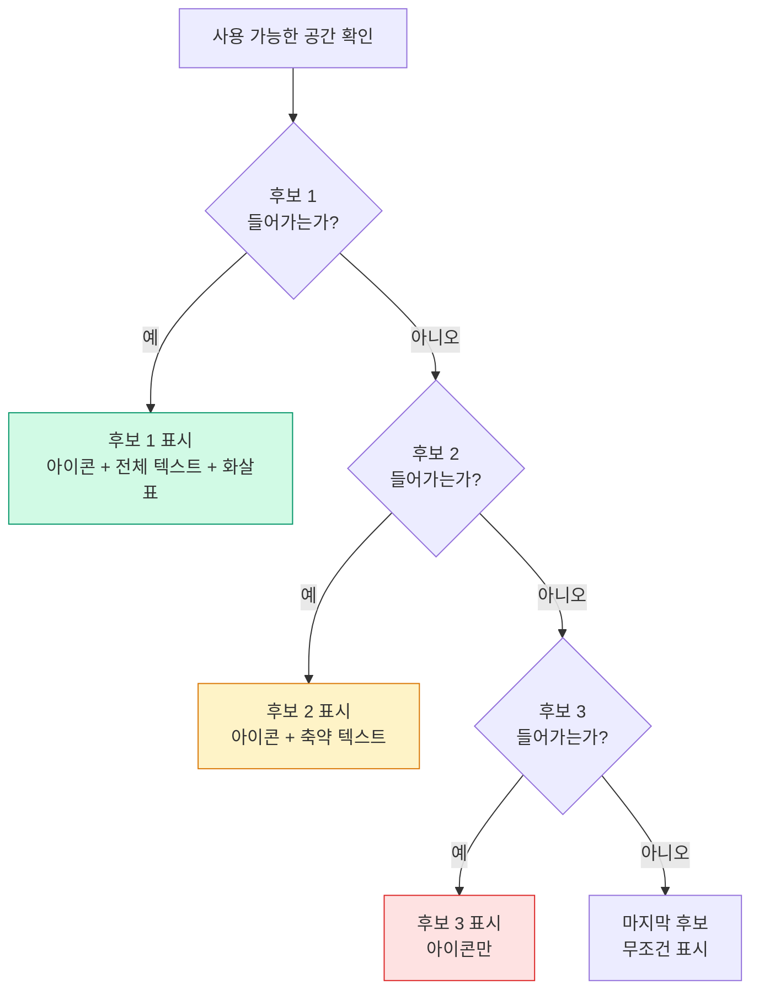

# 01. Custom Layout

> Layout 프로토콜, 플로우 레이아웃, 적응형 배치

## 개요

SwiftUI의 `VStack`, `HStack`만으로는 표현할 수 없는 레이아웃이 있습니다. 태그 클라우드처럼 자동으로 줄바꿈되는 배치, 원형으로 배치되는 메뉴, 화면 크기에 따라 가로/세로가 전환되는 적응형 레이아웃 — 이런 것들을 직접 만들 수 있는 강력한 도구가 바로 `Layout` 프로토콜입니다.

**선수 지식**: [레이아웃 시스템](../03-swiftui-start/04-layout.md)의 VStack/HStack/ZStack 기본 개념
**학습 목표**:
- Layout 프로토콜의 두 가지 필수 메서드를 이해하고 구현할 수 있다
- 플로우 레이아웃(태그 클라우드)을 직접 만들 수 있다
- AnyLayout과 ViewThatFits로 적응형 배치를 구현할 수 있다

## 왜 알아야 할까?

앱을 만들다 보면 "이 태그들이 화면 너비에 맞춰서 자동으로 줄바꿈되면 좋겠는데…"라는 생각을 하게 됩니다. 인스타그램의 해시태그, 쇼핑 앱의 필터 칩, 설정 화면의 카테고리 배지 — 이런 UI는 `HStack`으로는 만들 수 없거든요. 넘치면 잘려버리니까요.

iOS 16 이전에는 `GeometryReader`와 `PreferenceKey`를 조합하는 복잡한 해킹이 필요했습니다. 하지만 WWDC 2022에서 Apple이 `Layout` 프로토콜을 발표하면서, SwiftUI의 레이아웃 엔진에 직접 접근할 수 있는 공식 경로가 열렸죠.

## 핵심 개념

### 개념 1: Layout 프로토콜의 구조

> 💡 **비유**: Layout 프로토콜은 **이벤트 기획자**와 같습니다. "테이블이 몇 개 필요한가요?"(sizeThatFits)라고 물어보고, "각 테이블을 여기에 놓아주세요"(placeSubviews)라고 배치하는 거죠.

SwiftUI의 레이아웃은 **3단계 협상** 과정을 거칩니다:

1. **부모가 크기를 제안** → `ProposedViewSize`로 "이만큼 공간이 있어"라고 알림
2. **자식이 원하는 크기를 응답** → `sizeThatFits`에서 "나는 이만큼 필요해"라고 반환
3. **부모가 자식을 배치** → `placeSubviews`에서 각 자식의 좌표를 결정

> 📊 **그림 1**: SwiftUI Layout 프로토콜의 3단계 크기 협상 과정




Layout 프로토콜에서 반드시 구현해야 하는 메서드는 딱 **두 개**입니다:

```swift
import SwiftUI

// 원형으로 자식 뷰를 배치하는 커스텀 레이아웃
struct RadialLayout: Layout {
    // 1단계: 전체 레이아웃이 필요한 크기를 계산
    func sizeThatFits(
        proposal: ProposedViewSize,  // 부모가 제안하는 크기
        subviews: Subviews,          // 자식 뷰들의 프록시
        cache: inout ()              // 캐시 (기본은 Void)
    ) -> CGSize {
        // 제안된 크기를 그대로 사용 (nil이면 기본값으로 대체)
        proposal.replacingUnspecifiedDimensions()
    }

    // 2단계: 각 자식 뷰의 위치를 결정
    func placeSubviews(
        in bounds: CGRect,           // 배치 가능한 영역
        proposal: ProposedViewSize,
        subviews: Subviews,
        cache: inout ()
    ) {
        let radius = min(bounds.size.width, bounds.size.height) / 2
        let angle = Angle.degrees(360 / Double(subviews.count)).radians

        for (index, subview) in subviews.enumerated() {
            // 각 서브뷰의 이상적인 크기를 질의
            let viewSize = subview.sizeThatFits(.unspecified)
            // 원 위의 좌표 계산
            let xPos = cos(angle * Double(index) - .pi / 2) * (radius - viewSize.width / 2)
            let yPos = sin(angle * Double(index) - .pi / 2) * (radius - viewSize.height / 2)
            let point = CGPoint(x: bounds.midX + xPos, y: bounds.midY + yPos)
            // 서브뷰를 계산된 위치에 배치
            subview.place(at: point, anchor: .center, proposal: .unspecified)
        }
    }
}

// 사용 예시
#Preview {
    RadialLayout {
        ForEach(0..<8) { index in
            Circle()
                .fill(Color.blue.opacity(0.3 + Double(index) * 0.08))
                .frame(width: 50, height: 50)
                .overlay(Text("\(index)").font(.caption))
        }
    }
    .frame(width: 300, height: 300)
}
```

### 개념 2: ProposedViewSize — 크기 협상의 언어

> 💡 **비유**: ProposedViewSize는 **부모가 자식에게 보내는 식사 예산 메모**입니다. "3만원 안에서 골라"(구체적 값), "마음껏 먹어"(.infinity), "최소한만"(.zero), "네 입맛대로"(.unspecified) — 네 가지 방식으로 제안할 수 있죠.

`ProposedViewSize`는 너비와 높이가 각각 `CGFloat?`인 구조체입니다. `nil`이 특별한 의미를 가집니다:

| 제안 값 | 의미 | 자식의 응답 |
|---------|------|-----------|
| 구체적 숫자 (예: `200`) | "200pt를 줄게" | 해당 공간 내에서 필요한 크기 |
| `0` (`.zero`) | "최소한만 차지해" | 가능한 최소 크기 |
| `nil` (`.unspecified`) | "이상적인 크기로 해" | 고유 크기(intrinsic size) |
| `.infinity` | "무한히 넓어" | 가능한 최대 크기 |

`replacingUnspecifiedDimensions(by:)` 메서드를 사용하면 `nil` 값을 기본값으로 대체할 수 있습니다:

```swift
// nil 값을 10으로 대체
let concreteSize = proposal.replacingUnspecifiedDimensions(by: CGSize(width: 10, height: 10))
```

### 개념 3: 플로우 레이아웃 만들기

> 💡 **비유**: 플로우 레이아웃은 **책장에 책을 꽂는 것**과 같습니다. 한 줄에 들어가면 옆에 놓고, 더 이상 안 들어가면 다음 줄로 내려가는 거죠.

태그 클라우드나 칩 뷰에서 가장 많이 쓰이는 패턴입니다:

> 📊 **그림 2**: FlowLayout의 자동 줄바꿈 배치 알고리즘




```swift
import SwiftUI

// 자동 줄바꿈 플로우 레이아웃
struct FlowLayout: Layout {
    var spacing: CGFloat = 8

    func sizeThatFits(
        proposal: ProposedViewSize,
        subviews: Subviews,
        cache: inout ()
    ) -> CGSize {
        let containerWidth = proposal.replacingUnspecifiedDimensions().width
        var currentX: CGFloat = 0
        var currentY: CGFloat = 0
        var lineHeight: CGFloat = 0
        var maxWidth: CGFloat = 0

        for subview in subviews {
            let size = subview.sizeThatFits(.unspecified)

            // 현재 줄에 안 들어가면 다음 줄로
            if currentX + size.width > containerWidth, currentX > 0 {
                currentY += lineHeight + spacing
                currentX = 0
                lineHeight = 0
            }

            currentX += size.width + spacing
            lineHeight = max(lineHeight, size.height)
            maxWidth = max(maxWidth, currentX - spacing)
        }

        return CGSize(width: maxWidth, height: currentY + lineHeight)
    }

    func placeSubviews(
        in bounds: CGRect,
        proposal: ProposedViewSize,
        subviews: Subviews,
        cache: inout ()
    ) {
        let containerWidth = bounds.width
        var currentX: CGFloat = bounds.minX
        var currentY: CGFloat = bounds.minY
        var lineHeight: CGFloat = 0

        for subview in subviews {
            let size = subview.sizeThatFits(.unspecified)

            if currentX + size.width > bounds.minX + containerWidth,
               currentX > bounds.minX {
                currentY += lineHeight + spacing
                currentX = bounds.minX
                lineHeight = 0
            }

            subview.place(
                at: CGPoint(x: currentX, y: currentY),
                anchor: .topLeading,
                proposal: ProposedViewSize(size)
            )

            currentX += size.width + spacing
            lineHeight = max(lineHeight, size.height)
        }
    }
}

// 태그 칩 뷰
struct TagChip: View {
    let text: String
    let color: Color

    var body: some View {
        Text(text)
            .font(.subheadline)
            .padding(.horizontal, 12)
            .padding(.vertical, 6)
            .background(color.opacity(0.15))
            .foregroundStyle(color)
            .clipShape(Capsule())
    }
}

#Preview {
    FlowLayout(spacing: 8) {
        TagChip(text: "SwiftUI", color: .blue)
        TagChip(text: "iOS 26", color: .orange)
        TagChip(text: "Layout Protocol", color: .purple)
        TagChip(text: "WWDC 2022", color: .green)
        TagChip(text: "커스텀 레이아웃", color: .red)
        TagChip(text: "플로우", color: .teal)
        TagChip(text: "태그 클라우드", color: .indigo)
        TagChip(text: "Swift 6", color: .pink)
    }
    .padding()
}
```

### 개념 4: AnyLayout으로 동적 레이아웃 전환

> 💡 **비유**: AnyLayout은 **변신 로봇**입니다. 상황에 따라 세로 모드, 가로 모드, 원형 모드로 부드럽게 변신하죠. 그리고 놀랍게도 변신 중에도 내부 상태가 유지됩니다!

`AnyLayout`은 Layout 프로토콜을 타입 소거(type erasure)한 래퍼입니다. `AnyView`와 달리 **성능 손해가 전혀 없고**, 자식 뷰의 **상태와 정체성이 보존**됩니다:

> 📊 **그림 3**: AnyLayout을 통한 동적 레이아웃 전환 구조




```swift
import SwiftUI

struct AdaptiveLayoutDemo: View {
    @State private var layoutMode = 0
    @Environment(\.horizontalSizeClass) var sizeClass

    // 현재 모드에 따라 레이아웃 선택
    var currentLayout: AnyLayout {
        switch layoutMode {
        case 0: AnyLayout(VStackLayout(spacing: 16))
        case 1: AnyLayout(HStackLayout(spacing: 16))
        case 2: AnyLayout(RadialLayout())
        default: AnyLayout(FlowLayout(spacing: 12))
        }
    }

    var body: some View {
        VStack(spacing: 20) {
            // 레이아웃 전환 버튼
            Picker("레이아웃", selection: $layoutMode) {
                Text("세로").tag(0)
                Text("가로").tag(1)
                Text("원형").tag(2)
                Text("플로우").tag(3)
            }
            .pickerStyle(.segmented)
            .padding(.horizontal)

            // 같은 자식 뷰, 다른 레이아웃 — 애니메이션으로 전환!
            currentLayout {
                ForEach(0..<6) { i in
                    RoundedRectangle(cornerRadius: 12)
                        .fill(Color.accentColor.opacity(0.2 + Double(i) * 0.1))
                        .frame(width: 60, height: 60)
                        .overlay(Text("\(i + 1)").fontWeight(.bold))
                }
            }
            .animation(.spring(duration: 0.5), value: layoutMode)
            .frame(height: 300)
        }
    }
}

#Preview {
    AdaptiveLayoutDemo()
}
```

### 개념 5: ViewThatFits — 자동 적응형 레이아웃

`ViewThatFits`는 여러 후보 뷰 중에서 **현재 공간에 맞는 첫 번째 뷰**를 자동으로 선택합니다. 반응형 UI를 만드는 가장 간결한 방법이죠:

> 📊 **그림 4**: ViewThatFits의 후보 뷰 선택 과정




```swift
import SwiftUI

struct ResponsiveButton: View {
    var body: some View {
        ViewThatFits(in: .horizontal) {
            // 가장 선호하는 레이아웃 (공간 충분할 때)
            HStack {
                Image(systemName: "star.fill")
                Text("즐겨찾기에 추가")
                Spacer()
                Image(systemName: "chevron.right")
            }
            .padding()
            .background(.thinMaterial)
            .clipShape(RoundedRectangle(cornerRadius: 12))

            // 중간 크기 (텍스트 축약)
            HStack {
                Image(systemName: "star.fill")
                Text("즐겨찾기")
            }
            .padding()
            .background(.thinMaterial)
            .clipShape(RoundedRectangle(cornerRadius: 12))

            // 최소 크기 (아이콘만)
            Image(systemName: "star.fill")
                .padding()
                .background(.thinMaterial)
                .clipShape(Circle())
        }
    }
}

#Preview {
    VStack(spacing: 20) {
        ResponsiveButton()
            .frame(width: 350)
        ResponsiveButton()
            .frame(width: 180)
        ResponsiveButton()
            .frame(width: 80)
    }
    .padding()
}
```

## 실습: 직접 해보기

등폭 버튼 그룹을 만들어봅시다 — 모든 버튼이 가장 넓은 버튼의 너비에 맞춰지는 레이아웃입니다:

```swift
import SwiftUI

// 모든 자식을 가장 넓은 자식의 너비로 통일하는 레이아웃
struct EqualWidthLayout: Layout {
    var spacing: CGFloat = 8

    func sizeThatFits(
        proposal: ProposedViewSize,
        subviews: Subviews,
        cache: inout ()
    ) -> CGSize {
        guard !subviews.isEmpty else { return .zero }

        // 모든 서브뷰의 이상적인 크기 수집
        let sizes = subviews.map { $0.sizeThatFits(.unspecified) }
        // 가장 넓은 너비를 최대 너비로 설정
        let maxWidth = sizes.map(\.width).max() ?? 0
        // 전체 높이 = 각 높이의 합 + 간격
        let totalHeight = sizes.map(\.height).reduce(0, +) + spacing * CGFloat(subviews.count - 1)

        return CGSize(width: maxWidth, height: totalHeight)
    }

    func placeSubviews(
        in bounds: CGRect,
        proposal: ProposedViewSize,
        subviews: Subviews,
        cache: inout ()
    ) {
        guard !subviews.isEmpty else { return }

        let sizes = subviews.map { $0.sizeThatFits(.unspecified) }
        let maxWidth = sizes.map(\.width).max() ?? 0
        var y = bounds.minY

        for (index, subview) in subviews.enumerated() {
            // 모든 서브뷰에게 동일한 너비를 제안
            subview.place(
                at: CGPoint(x: bounds.midX, y: y),
                anchor: .top,
                proposal: ProposedViewSize(width: maxWidth, height: sizes[index].height)
            )
            y += sizes[index].height + spacing
        }
    }
}

struct EqualWidthDemo: View {
    var body: some View {
        EqualWidthLayout(spacing: 12) {
            Button("확인") { }
                .buttonStyle(.borderedProminent)
            Button("나중에 하기") { }
                .buttonStyle(.bordered)
            Button("설정으로 이동") { }
                .buttonStyle(.bordered)
        }
        .padding()
    }
}

#Preview {
    EqualWidthDemo()
}
```

## 더 깊이 알아보기

### Layout 프로토콜의 탄생 배경

Layout 프로토콜은 WWDC 2022에서 Apple의 SwiftUI 팀이 발표한 핵심 기능 중 하나입니다. 이 세션의 이름은 "Compose custom layouts with SwiftUI"(세션 10056)였는데요, 발표 전까지 개발자들은 커스텀 레이아웃을 만들려면 `GeometryReader` + `PreferenceKey` + `.frame()` 수정자를 복잡하게 조합해야 했습니다.

SwiftUI Lab의 Javier라는 개발자는 이렇게 표현했죠: "Layout, Grid, ViewThatFits가 등장하면서 야생에서 보이는 GeometryReader의 대부분이 불필요해졌다." 실제로 이 세 가지가 같은 WWDC 2022에서 함께 소개되었고, 이것은 SwiftUI 레이아웃 시스템의 가장 큰 도약이었습니다.

### LayoutValueKey — 커스텀 레이아웃 값

자식 뷰가 레이아웃에 힌트를 전달할 수 있는 메커니즘도 있습니다:

```swift
// 커스텀 레이아웃 값 정의
struct IsHighlighted: LayoutValueKey {
    static let defaultValue: Bool = false
}

// 뷰에서 사용
Text("중요!")
    .layoutValue(key: IsHighlighted.self, value: true)

// 레이아웃에서 읽기
func placeSubviews(...) {
    for subview in subviews {
        let highlighted = subview[IsHighlighted.self]
        // highlighted 여부에 따라 배치 로직 변경
    }
}
```

## 흔한 오해와 팁

> ⚠️ **흔한 오해**: "AnyLayout은 AnyView처럼 성능이 나쁘다" — 아닙니다! AnyLayout은 타입 소거 래퍼이지만, 자식 뷰의 정체성이 유지되기 때문에 AnyView와 달리 **성능 저하가 거의 없고** 애니메이션도 매끄럽게 동작합니다.

> 🔥 **실무 팁**: `sizeThatFits`는 한 번의 레이아웃 패스에서 **여러 번 호출**될 수 있습니다. 부모가 `.zero`, `.unspecified`, `.infinity` 등 다양한 제안으로 자식의 유연성을 탐색하기 때문이죠. 비용이 큰 계산은 `makeCache(subviews:)`에서 한 번만 수행하세요.

> 💡 **알고 계셨나요?**: Apple의 공식 FoodTruck 샘플 앱에도 재료 태그를 보여주기 위해 FlowLayout이 사용되어 있습니다. Layout 프로토콜의 실전 사용 사례를 보고 싶다면 이 앱을 참고하세요.

## 핵심 정리

| 개념 | 설명 |
|------|------|
| Layout 프로토콜 | 커스텀 레이아웃 컨테이너를 정의하는 프로토콜 (iOS 16+) |
| sizeThatFits | 레이아웃에 필요한 전체 크기를 계산하는 필수 메서드 |
| placeSubviews | 각 자식 뷰의 위치를 결정하는 필수 메서드 |
| ProposedViewSize | 부모가 자식에게 제안하는 크기 (nil/zero/infinity/구체값) |
| FlowLayout | 자동 줄바꿈되는 태그 클라우드 스타일 레이아웃 |
| AnyLayout | 레이아웃 타입 소거 래퍼 — 동적 레이아웃 전환에 사용 |
| ViewThatFits | 공간에 맞는 첫 번째 뷰를 자동 선택하는 컨테이너 |
| LayoutValueKey | 자식 뷰가 레이아웃에 커스텀 데이터를 전달하는 메커니즘 |

## 다음 섹션 미리보기

Layout 프로토콜로 뷰의 **배치**를 자유롭게 만들 수 있게 되었다면, 다음으로 배울 것은 뷰의 **구성** 자체를 유연하게 만드는 방법입니다. [02. ViewBuilder와 제네릭 뷰](./02-viewbuilder.md)에서는 `@ViewBuilder`와 Result Builder를 활용해 재사용 가능한 커스텀 컨테이너 뷰를 만드는 법을 배웁니다.

## 참고 자료

- [Apple 공식 문서 - Layout Protocol](https://developer.apple.com/documentation/SwiftUI/Layout) - Layout 프로토콜의 전체 API 레퍼런스
- [WWDC 2022 - Compose custom layouts with SwiftUI](https://developer.apple.com/videos/play/wwdc2022/10056/) - Layout 프로토콜을 소개한 원본 세션
- [The SwiftUI Lab - Layout Protocol Part 1](https://swiftui-lab.com/layout-protocol-part-1/) - 가장 심도 깊은 Layout 프로토콜 해설
- [Swift with Majid - Building Custom Layout](https://swiftwithmajid.com/2022/11/16/building-custom-layout-in-swiftui-basics/) - 단계별 실습 가이드
- [Hacking with Swift - How to create a custom layout](https://www.hackingwithswift.com/quick-start/swiftui/how-to-create-a-custom-layout-using-the-layout-protocol) - 간결한 예제 중심 튜토리얼
