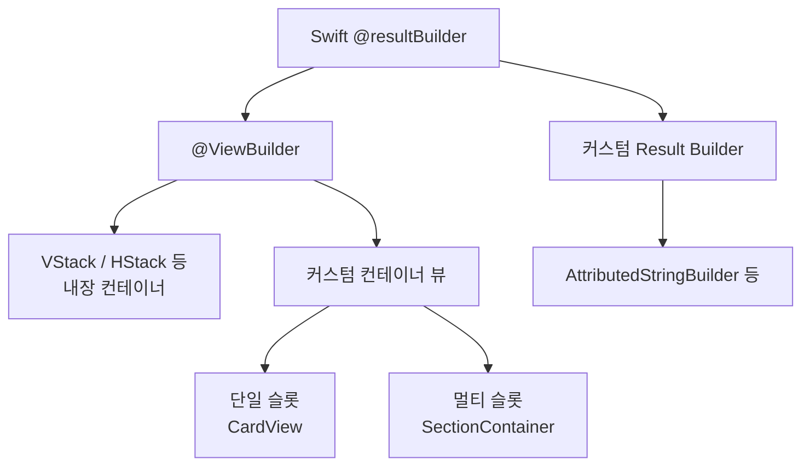
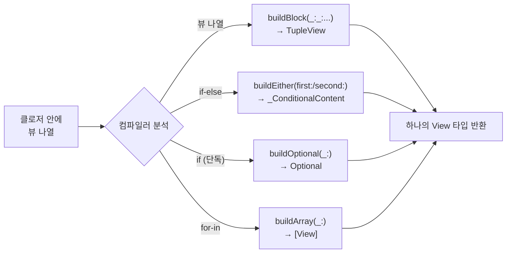
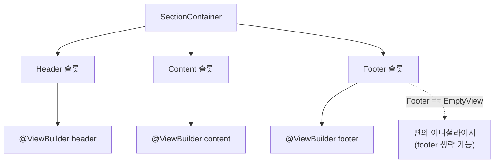

# 02. ViewBuilder와 제네릭 뷰

> @ViewBuilder, 커스텀 컨테이너, Result Builder

## 개요

SwiftUI에서 `VStack { ... }` 안에 여러 뷰를 나열할 수 있는 비밀은 바로 `@ViewBuilder`입니다. 이 섹션에서는 이 마법 같은 기능의 원리를 파악하고, 직접 재사용 가능한 컨테이너 뷰를 만들어봅니다. 더 나아가 `@ViewBuilder`를 가능하게 하는 Swift 언어 기능인 Result Builder까지 알아봅니다.

**선수 지식**: [Custom Layout](./01-custom-layout.md)의 레이아웃 개념, [프로토콜과 익스텐션](../02-swift-types/03-protocols-extensions.md), [제네릭](../02-swift-types/05-generics-errors.md)
**학습 목표**:
- @ViewBuilder가 내부적으로 어떻게 동작하는지 이해한다
- 제네릭을 활용한 커스텀 컨테이너 뷰를 만들 수 있다
- Result Builder의 기본 원리를 파악하고 간단한 커스텀 빌더를 만들 수 있다

## 왜 알아야 할까?

> 📊 **그림 1**: @ViewBuilder와 커스텀 컨테이너의 전체 구조




같은 스타일의 카드 뷰를 앱 전체에서 반복해서 만들고 있지는 않나요? 매번 `RoundedRectangle` + `shadow` + `padding`을 조합하는 대신, `CardView { ... }` 한 줄로 해결할 수 있다면 어떨까요?

@ViewBuilder를 이해하면 SwiftUI의 선언적 문법이 **왜** 그렇게 작동하는지 깨닫게 됩니다. 그리고 커스텀 컨테이너를 만들 수 있으면, 디자인 시스템을 구축하고 코드 중복을 대폭 줄일 수 있죠.

## 핵심 개념

### 개념 1: @ViewBuilder의 마법

> 📊 **그림 2**: @ViewBuilder의 컴파일러 변환 과정




> 💡 **비유**: @ViewBuilder는 **자동 포장 기계**입니다. 여러 개의 물건(뷰)을 넣으면, 자동으로 상자(TupleView)에 포장해서 하나의 물건으로 만들어주죠. if문을 넣으면 "둘 중 하나"(_ConditionalContent) 상자를, for문을 넣으면 "여러 개"(배열) 상자를 사용합니다.

`@ViewBuilder`는 `@resultBuilder` 속성이 붙은 구조체입니다. 클로저 안에 여러 뷰를 나열하면, 컴파일러가 자동으로 적절한 `buildBlock` 메서드를 호출하여 하나의 뷰로 결합합니다:

```swift
import SwiftUI

// 우리가 작성하는 코드
VStack {
    Text("안녕")     // 첫 번째 뷰
    Text("세계")     // 두 번째 뷰
}

// 컴파일러가 내부적으로 변환하는 코드
// VStack {
//     ViewBuilder.buildBlock(Text("안녕"), Text("세계"))
//     → TupleView<(Text, Text)>
// }
```

조건문과 반복문도 자동 변환됩니다:

| Swift 구문 | ViewBuilder가 호출하는 메서드 | 결과 타입 |
|-----------|---------------------------|----------|
| 뷰 나열 | `buildBlock(_:_:...)` | `TupleView<(...)>` |
| `if` (else 없음) | `buildOptional(_:)` | `_ConditionalContent<뷰, EmptyView>` |
| `if-else` | `buildEither(first:)` / `buildEither(second:)` | `_ConditionalContent<뷰A, 뷰B>` |
| `for-in` | `buildArray(_:)` | `[뷰]` |
| 빈 클로저 | `buildBlock()` | `EmptyView` |

> ⚠️ **흔한 오해**: "SwiftUI body에 뷰가 10개까지만 들어간다" — 이건 `buildBlock`의 오버로드가 10개짜리 튜플까지만 정의되어 있기 때문입니다. `Group`이나 `ForEach`로 감싸면 이 제한을 우회할 수 있어요.

### 개념 2: 커스텀 컨테이너 뷰 만들기

> 💡 **비유**: 커스텀 컨테이너는 **맞춤 액자**와 같습니다. 안에 어떤 그림(뷰)이 들어와도 동일한 프레임과 장식을 씌워주죠.

제네릭과 `@ViewBuilder`를 조합하면 강력한 재사용 컨테이너를 만들 수 있습니다:

```swift
import SwiftUI

// 카드 스타일 컨테이너
struct CardView<Content: View>: View {
    let title: String
    @ViewBuilder let content: Content

    var body: some View {
        VStack(alignment: .leading, spacing: 12) {
            Text(title)
                .font(.headline)
                .foregroundStyle(.secondary)

            content  // @ViewBuilder로 받은 콘텐츠
        }
        .padding()
        .background(.background)
        .clipShape(RoundedRectangle(cornerRadius: 16))
        .shadow(color: .black.opacity(0.1), radius: 8, y: 4)
    }
}

// 사용법 — 마치 SwiftUI 내장 뷰처럼!
#Preview {
    VStack(spacing: 20) {
        CardView(title: "프로필") {
            HStack {
                Image(systemName: "person.circle.fill")
                    .font(.largeTitle)
                Text("홍길동")
                    .font(.title2)
            }
        }

        CardView(title: "통계") {
            HStack(spacing: 30) {
                VStack {
                    Text("42").font(.title).bold()
                    Text("게시물").font(.caption)
                }
                VStack {
                    Text("1.2K").font(.title).bold()
                    Text("팔로워").font(.caption)
                }
            }
        }
    }
    .padding()
    .background(Color(.systemGroupedBackground))
}
```

### 개념 3: 여러 슬롯을 가진 컨테이너

> 📊 **그림 3**: 멀티 슬롯 컨테이너의 구조




실전에서는 하나가 아닌 여러 영역(슬롯)에 뷰를 받는 컨테이너가 필요합니다:

```swift
import SwiftUI

// 헤더, 콘텐츠, 푸터 세 영역을 가진 섹션 컨테이너
struct SectionContainer<Header: View, Content: View, Footer: View>: View {
    @ViewBuilder let header: Header
    @ViewBuilder let content: Content
    @ViewBuilder let footer: Footer

    var body: some View {
        VStack(alignment: .leading, spacing: 0) {
            // 헤더 영역
            header
                .font(.subheadline.weight(.semibold))
                .foregroundStyle(.secondary)
                .padding(.horizontal)
                .padding(.bottom, 8)

            // 콘텐츠 영역
            VStack(alignment: .leading, spacing: 0) {
                content
            }
            .padding()
            .background(.background)
            .clipShape(RoundedRectangle(cornerRadius: 12))

            // 푸터 영역
            footer
                .font(.caption)
                .foregroundStyle(.tertiary)
                .padding(.horizontal)
                .padding(.top, 8)
        }
    }
}

// 푸터 없이 사용하고 싶을 때를 위한 편의 이니셜라이저
extension SectionContainer where Footer == EmptyView {
    init(
        @ViewBuilder header: () -> Header,
        @ViewBuilder content: () -> Content
    ) {
        self.header = header()
        self.content = content()
        self.footer = EmptyView()
    }
}

#Preview {
    VStack(spacing: 24) {
        // 세 영역 모두 사용
        SectionContainer {
            Text("알림 설정")
        } content: {
            Toggle("푸시 알림", isOn: .constant(true))
            Toggle("이메일 알림", isOn: .constant(false))
        } footer: {
            Text("알림은 언제든 변경할 수 있습니다")
        }

        // 푸터 없이 사용
        SectionContainer {
            Text("계정")
        } content: {
            Text("홍길동")
            Text("hong@example.com")
                .foregroundStyle(.secondary)
        }
    }
    .padding()
    .background(Color(.systemGroupedBackground))
}
```

### 개념 4: Result Builder 직접 만들기

> 📊 **그림 4**: Result Builder의 메서드 호출 흐름

```mermaid
sequenceDiagram
    participant U as 사용자 코드
    participant C as 컴파일러
    participant RB as ResultBuilder
    U->>C: 클로저 { 표현식1; if조건 { 표현식2 }; 표현식3 }
    C->>RB: buildBlock(표현식1)
    C->>C: 조건 평가
    alt 조건 true
        C->>RB: buildEither(first: 표현식2)
    else 조건 false
        C->>RB: buildEither(second: 대체값)
    end
    C->>RB: buildBlock(결과1, 분기결과, 표현식3)
    RB-->>U: 최종 결합 결과 반환
```


> 💡 **비유**: Result Builder는 **레시피 작성 도구**입니다. 재료(표현식)를 하나씩 넣으면 자동으로 요리법(최종 결과)을 만들어주죠. if/else로 대체 재료를 지정하거나, for문으로 반복 재료를 넣을 수도 있습니다.

`@ViewBuilder`는 사실 Swift의 `@resultBuilder` 기능의 한 활용 사례일 뿐입니다. 직접 만들어볼까요?

```swift
import SwiftUI

// 문자열을 선언적으로 조합하는 커스텀 Result Builder
@resultBuilder
struct AttributedStringBuilder {
    // 기본: 여러 문자열을 줄바꿈으로 결합
    static func buildBlock(_ components: String...) -> String {
        components.joined(separator: "\n")
    }

    // if-else 지원
    static func buildEither(first component: String) -> String {
        component
    }

    static func buildEither(second component: String) -> String {
        component
    }

    // if (else 없음) 지원
    static func buildOptional(_ component: String?) -> String {
        component ?? ""
    }

    // for-in 루프 지원
    static func buildArray(_ components: [String]) -> String {
        components.joined(separator: "\n")
    }
}

// Builder를 사용하는 함수
func buildMessage(
    isVIP: Bool,
    @AttributedStringBuilder content: () -> String
) -> String {
    content()
}

// 사용 예시
let message = buildMessage(isVIP: true) {
    "안녕하세요!"
    if isVIP {
        "VIP 고객님, 환영합니다"
    } else {
        "가입을 환영합니다"
    }
    "좋은 하루 되세요"
}
// 결과: "안녕하세요!\nVIP 고객님, 환영합니다\n좋은 하루 되세요"
```

### 개념 5: iOS 18의 커스텀 컨테이너 API

iOS 18(WWDC 2024)에서는 `ForEach(subviewOf:)`와 `Group(subviewsOf:)` API가 추가되어 커스텀 컨테이너를 더 쉽게 만들 수 있게 되었습니다:

```swift
import SwiftUI

// iOS 18+: 서브뷰를 자동으로 해석하는 카드 리스트
struct CardList<Content: View>: View {
    @ViewBuilder var content: Content

    var body: some View {
        VStack(spacing: 12) {
            // ForEach(subviewOf:)가 content의 서브뷰를 자동 분해
            ForEach(subviewOf: content) { subview in
                subview
                    .padding()
                    .background(.background)
                    .clipShape(RoundedRectangle(cornerRadius: 12))
                    .shadow(radius: 2)
            }
        }
    }
}

#Preview {
    CardList {
        Text("첫 번째 카드")
        Text("두 번째 카드")
        Text("세 번째 카드")
    }
    .padding()
    .background(Color(.systemGroupedBackground))
}
```

## 더 깊이 알아보기

### Result Builder의 탄생 이야기

Result Builder는 원래 **"Function Builder"**라는 이름으로 Swift 5.1에서 비공식(`@_functionBuilder`) 기능으로 도입되었습니다. SwiftUI를 가능하게 하기 위해 급히 추가된 거죠.

이후 SE-0289 프로포절을 통해 Swift 5.4에서 `@resultBuilder`로 정식 이름을 바꿔 공식 기능이 되었습니다. "함수를 빌드하는 것이 아니라 **결과를 빌드**하는 것"이라는 의미를 더 정확히 반영한 이름 변경이었죠.

이후에도 계속 진화했는데, SE-0348(Swift 5.7)에서 `buildPartialBlock`이 추가되어 오버로드 수를 수백만 개에서 수백 개로 줄였고, SE-0373(Swift 5.8)에서는 결과 빌더 안에서 변수 선언, 프로퍼티 래퍼 등 거의 모든 Swift 구문을 사용할 수 있게 되었습니다.

> 💡 **알고 계셨나요?**: pointfreeco의 swift-parsing 라이브러리는 `buildPartialBlock` 덕분에 **21,000줄의 생성 코드를 삭제**하고, 컴파일 시간을 20초에서 2초 미만으로 줄였습니다!

## 흔한 오해와 팁

> ⚠️ **흔한 오해**: "@ViewBuilder 클로저에서는 변수를 선언할 수 없다" — Swift 5.8(SE-0373) 이후로는 Result Builder 안에서 `var`, `let`, 프로퍼티 래퍼 등 거의 모든 Swift 구문을 자유롭게 사용할 수 있습니다.

> 🔥 **실무 팁**: 커스텀 컨테이너에서 선택적 슬롯(footer 없는 경우 등)을 지원하려면, `where Footer == EmptyView` 제약의 extension에 편의 이니셜라이저를 추가하세요. SwiftUI 내장 뷰도 이 패턴을 사용합니다.

> 🔥 **실무 팁**: `@ViewBuilder`를 저장 프로퍼티에 직접 붙일 수 있습니다(`@ViewBuilder let content: Content`). 이렇게 하면 이니셜라이저에서 `@ViewBuilder`를 붙일 필요가 없어서 코드가 깔끔해집니다.

## 핵심 정리

| 개념 | 설명 |
|------|------|
| @ViewBuilder | 여러 뷰를 하나의 뷰로 결합하는 Result Builder |
| TupleView | buildBlock이 여러 뷰를 감싸는 컨테이너 타입 |
| _ConditionalContent | if-else 분기를 표현하는 내부 타입 |
| Result Builder (SE-0289) | @ViewBuilder의 기반인 Swift 언어 기능 |
| buildBlock | 여러 표현식을 하나로 결합하는 핵심 메서드 |
| buildEither | if-else 분기를 처리하는 메서드 |
| buildOptional | else 없는 if를 처리하는 메서드 |
| ForEach(subviewOf:) | iOS 18+ 서브뷰 자동 분해 API |

## 다음 섹션 미리보기

커스텀 컨테이너 뷰를 만들 수 있게 되었다면, 이제 자식 뷰의 크기와 위치 정보를 부모에게 **역방향으로 전달**하는 방법이 궁금해질 겁니다. [03. PreferenceKey와 GeometryReader](./03-preference-geometry.md)에서는 SwiftUI의 단방향 데이터 흐름을 뒤집는 고급 기법을 배웁니다.

## 참고 자료

- [Apple 공식 문서 - ViewBuilder](https://developer.apple.com/documentation/swiftui/viewbuilder) - ViewBuilder API 레퍼런스
- [WWDC 2021 - Write a DSL in Swift using result builders](https://developer.apple.com/videos/play/wwdc2021/10253/) - Result Builder의 원리와 활용
- [WWDC 2024 - Demystify SwiftUI containers](https://developer.apple.com/videos/play/wwdc2024/10146/) - ForEach(subviewOf:) 등 새 컨테이너 API
- [SE-0289 Result Builders](https://github.com/swiftlang/swift-evolution/blob/main/proposals/0289-result-builders.md) - Result Builder 공식 프로포절
- [Swift by Sundell - ViewBuilder tips and tricks](https://www.swiftbysundell.com/articles/swiftui-viewbuilder-tips-and-tricks/) - 실전 ViewBuilder 패턴 모음
- [Fatbobman - ViewBuilder 내부 동작](https://fatbobman.com/en/posts/viewbuilder2/) - TupleView, ConditionalContent 내부 해설
