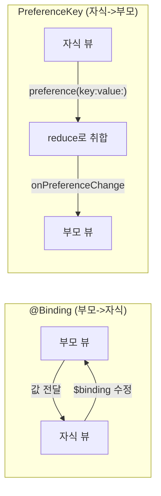
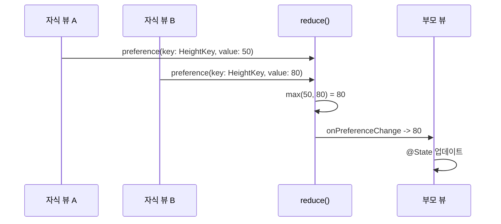
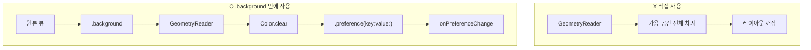
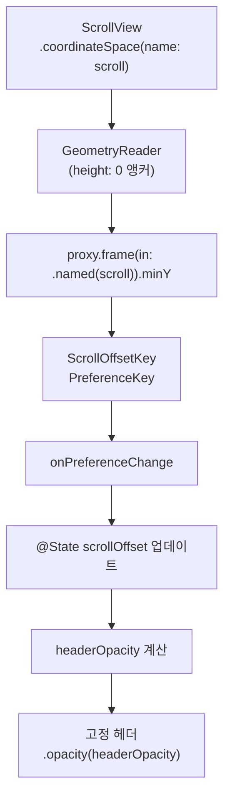

# 03. PreferenceKey와 GeometryReader

> 자식→부모 데이터 전달, 레이아웃 측정, 스크롤 감지

## 개요

SwiftUI의 데이터는 보통 부모에서 자식으로 흐릅니다. 하지만 때로는 **자식 뷰의 크기나 위치 정보를 부모가 알아야** 하는 경우가 있죠. 네비게이션 바의 타이틀이 자식 뷰에서 설정되는 것, 스크롤 위치에 따라 헤더가 변하는 것 — 이 모든 것이 PreferenceKey와 GeometryReader로 가능합니다.

**선수 지식**: [ViewBuilder와 제네릭 뷰](./02-viewbuilder.md), [@State와 @Binding](../05-state-management/01-state-binding.md)
**학습 목표**:
- PreferenceKey로 자식→부모 방향의 데이터 전달을 구현할 수 있다
- GeometryReader로 뷰의 크기와 위치를 측정할 수 있다
- onGeometryChange(iOS 16+)와 visualEffect(iOS 17+) 등 최신 대안을 활용할 수 있다

## 왜 알아야 할까?

"스크롤하면 네비게이션 바 색이 바뀌는 효과", "가장 긴 텍스트에 맞춰 모든 열의 너비를 통일", "자식 뷰의 높이에 따라 부모 뷰 높이 조절" — 이런 UI를 구현하려면 자식의 정보를 부모가 알아야 합니다.

SwiftUI의 `@Binding`은 부모가 **미리 알고 있는** 값을 공유할 때 쓰지만, 자식의 레이아웃 결과처럼 **렌더링 후에야 알 수 있는** 정보는 다른 메커니즘이 필요합니다. 바로 PreferenceKey죠.

> 📊 **그림 1**: SwiftUI 데이터 흐름 — @Binding vs PreferenceKey




## 핵심 개념

### 개념 1: PreferenceKey — 자식에서 부모로 편지 보내기

> 📊 **그림 2**: PreferenceKey 동작 흐름 — 보고 체계처럼 값이 올라간다




> 💡 **비유**: PreferenceKey는 **회사의 보고 체계**와 같습니다. 사원(자식 뷰)이 보고서(Preference 값)를 작성하면, 과장 → 부장 → 사장(부모 뷰)으로 올라가면서 취합됩니다. `reduce` 메서드가 바로 이 취합 로직이죠.

사실 `.navigationTitle("제목")`도 내부적으로 PreferenceKey를 사용합니다. 자식 뷰에서 설정한 제목이 NavigationStack(부모)까지 전달되는 거죠.

```swift
import SwiftUI

// 1단계: PreferenceKey 프로토콜 구현
struct ViewHeightKey: PreferenceKey {
    // 기본값 (아무 자식도 보고하지 않았을 때)
    static var defaultValue: CGFloat = 0

    // 여러 자식의 값을 취합하는 방법
    static func reduce(value: inout CGFloat, nextValue: () -> CGFloat) {
        value = max(value, nextValue())  // 가장 큰 높이를 사용
    }
}

struct PreferenceKeyDemo: View {
    @State private var childHeight: CGFloat = 0

    var body: some View {
        VStack(spacing: 20) {
            // 부모: 자식의 높이를 표시
            Text("자식 뷰 높이: \(childHeight, specifier: "%.0f")pt")
                .font(.headline)

            // 자식: 자신의 높이를 부모에게 보고
            Text("동적으로 크기가 변하는 콘텐츠입니다. 텍스트가 길어지면 높이도 함께 늘어나죠.")
                .padding()
                .background(.blue.opacity(0.1))
                .clipShape(RoundedRectangle(cornerRadius: 12))
                .background(
                    // GeometryReader를 background에 넣어 크기 측정
                    GeometryReader { proxy in
                        Color.clear
                            .preference(key: ViewHeightKey.self, value: proxy.size.height)
                    }
                )
        }
        .padding()
        // 3단계: 부모에서 Preference 값을 수신
        .onPreferenceChange(ViewHeightKey.self) { newHeight in
            childHeight = newHeight
        }
    }
}

#Preview {
    PreferenceKeyDemo()
}
```

### 개념 2: GeometryReader — 뷰의 치수를 재는 줄자

> 💡 **비유**: GeometryReader는 **건축 현장의 줄자**입니다. 벽(부모 뷰)의 크기를 재서 가구(자식 뷰)를 정확히 맞출 수 있게 해주죠. 다만 줄자 자체가 공간을 차지한다는 점에 주의해야 합니다!

GeometryReader는 자신에게 제안된 크기와 좌표계 정보를 `GeometryProxy`로 제공합니다:

```swift
import SwiftUI

struct GeometryReaderDemo: View {
    var body: some View {
        VStack(spacing: 20) {
            // GeometryReader로 부모 크기의 비율 사용
            GeometryReader { proxy in
                HStack(spacing: 0) {
                    // 왼쪽: 전체 너비의 1/3
                    Rectangle()
                        .fill(.blue.opacity(0.3))
                        .frame(width: proxy.size.width / 3)
                        .overlay(Text("1/3").font(.caption))

                    // 오른쪽: 전체 너비의 2/3
                    Rectangle()
                        .fill(.orange.opacity(0.3))
                        .overlay(Text("2/3").font(.caption))
                }
            }
            .frame(height: 80)

            // GeometryProxy가 제공하는 정보
            GeometryReader { proxy in
                VStack(alignment: .leading, spacing: 8) {
                    Text("크기: \(proxy.size.width, specifier: "%.0f") × \(proxy.size.height, specifier: "%.0f")")
                    Text("안전 영역: \(proxy.safeAreaInsets.top, specifier: "%.0f")pt (상단)")
                }
                .font(.caption)
                .padding()
            }
            .frame(height: 80)
            .background(.green.opacity(0.1))
        }
        .padding()
    }
}

#Preview {
    GeometryReaderDemo()
}
```

> ⚠️ **흔한 오해**: "GeometryReader는 크기를 잘 재니까 어디서든 쓰면 된다" — GeometryReader는 **가용 공간을 모두 차지**합니다. 레이아웃을 깨뜨리는 주범이 될 수 있으므로, `.background` 또는 `.overlay` 안에 넣어서 사용하는 것이 안전합니다.

### 개념 3: 안전한 크기 측정 패턴

> 📊 **그림 3**: GeometryReader 배치 위치에 따른 레이아웃 영향




GeometryReader를 `.background`에 넣으면 원래 뷰의 레이아웃에 영향을 주지 않고 크기를 측정할 수 있습니다:

```swift
import SwiftUI

// 자신의 크기를 측정하는 뷰 수정자
struct SizeReaderModifier: ViewModifier {
    @Binding var size: CGSize

    func body(content: Content) -> some View {
        content
            .background(
                GeometryReader { proxy in
                    Color.clear
                        .preference(key: SizePreferenceKey.self, value: proxy.size)
                }
            )
            .onPreferenceChange(SizePreferenceKey.self) { newSize in
                size = newSize
            }
    }
}

struct SizePreferenceKey: PreferenceKey {
    static var defaultValue: CGSize = .zero
    static func reduce(value: inout CGSize, nextValue: () -> CGSize) {
        value = nextValue()
    }
}

// 편리한 확장
extension View {
    func readSize(into binding: Binding<CGSize>) -> some View {
        modifier(SizeReaderModifier(size: binding))
    }
}

// 사용 예시
struct SafeMeasureDemo: View {
    @State private var textSize: CGSize = .zero

    var body: some View {
        VStack(spacing: 16) {
            Text("이 텍스트의 크기를 측정합니다")
                .font(.title2)
                .padding()
                .background(.yellow.opacity(0.2))
                .clipShape(RoundedRectangle(cornerRadius: 8))
                .readSize(into: $textSize)

            Text("측정 결과: \(textSize.width, specifier: "%.0f") × \(textSize.height, specifier: "%.0f")")
                .font(.caption)
                .foregroundStyle(.secondary)
        }
    }
}

#Preview {
    SafeMeasureDemo()
}
```

### 개념 4: onGeometryChange — 현대적 대안 (iOS 16+)

iOS 16에서 도입되고 iOS 18에서 강화된 `onGeometryChange`는 GeometryReader의 레이아웃 부작용 없이 크기를 모니터링할 수 있는 수정자입니다:

```swift
import SwiftUI

struct ModernGeometryDemo: View {
    @State private var cardSize: CGSize = .zero
    @State private var scrollOffset: CGFloat = 0

    var body: some View {
        VStack(spacing: 20) {
            // 크기 표시
            Text("카드 크기: \(cardSize.width, specifier: "%.0f") × \(cardSize.height, specifier: "%.0f")")
                .font(.caption)

            // onGeometryChange로 크기 모니터링 (iOS 16+)
            Text("크기가 자동으로 추적되는 카드입니다. Dynamic Type 크기에 따라 달라질 수 있어요.")
                .padding()
                .background(.blue.opacity(0.1))
                .clipShape(RoundedRectangle(cornerRadius: 12))
                .onGeometryChange(for: CGSize.self) { proxy in
                    proxy.size
                } action: { newSize in
                    cardSize = newSize
                }
        }
        .padding()
    }
}

#Preview {
    ModernGeometryDemo()
}
```

### 개념 5: 실전 패턴 — 스크롤에 따른 헤더 효과

> 📊 **그림 4**: 스크롤 오프셋 감지 파이프라인




PreferenceKey와 GeometryReader를 조합한 가장 대표적인 실전 패턴입니다:

```swift
import SwiftUI

// 스크롤 오프셋 감지용 PreferenceKey
struct ScrollOffsetKey: PreferenceKey {
    static var defaultValue: CGFloat = 0
    static func reduce(value: inout CGFloat, nextValue: () -> CGFloat) {
        value = nextValue()
    }
}

struct StickyHeaderDemo: View {
    @State private var scrollOffset: CGFloat = 0

    // 스크롤에 따라 헤더 불투명도 변경
    var headerOpacity: Double {
        min(1, max(0, -scrollOffset / 100))
    }

    var body: some View {
        ZStack(alignment: .top) {
            // 스크롤 콘텐츠
            ScrollView {
                VStack(spacing: 0) {
                    // 오프셋 감지용 투명 앵커
                    GeometryReader { proxy in
                        Color.clear
                            .preference(
                                key: ScrollOffsetKey.self,
                                value: proxy.frame(in: .named("scroll")).minY
                            )
                    }
                    .frame(height: 0)

                    // 실제 콘텐츠
                    VStack(spacing: 16) {
                        ForEach(0..<20) { index in
                            Text("아이템 \(index + 1)")
                                .frame(maxWidth: .infinity, alignment: .leading)
                                .padding()
                                .background(.background)
                                .clipShape(RoundedRectangle(cornerRadius: 8))
                        }
                    }
                    .padding()
                }
            }
            .coordinateSpace(name: "scroll")
            .onPreferenceChange(ScrollOffsetKey.self) { offset in
                scrollOffset = offset
            }

            // 고정 헤더 (스크롤하면 나타남)
            Text("고정 헤더")
                .font(.headline)
                .frame(maxWidth: .infinity)
                .padding()
                .background(.ultraThinMaterial.opacity(headerOpacity))
        }
    }
}

#Preview {
    StickyHeaderDemo()
}
```

## 더 깊이 알아보기

### PreferenceKey의 숨겨진 역사

PreferenceKey는 SwiftUI 1.0(WWDC 2019)부터 존재했지만, Apple은 이 기능을 거의 문서화하지 않았습니다. WWDC 세션에서도 단 20초 정도 언급했을 뿐이죠.

그럼에도 불구하고 SwiftUI 내부에서는 핵심적으로 사용됩니다. `.navigationTitle()`, `.tabItem()`, `.toolbar()` 등이 모두 내부적으로 PreferenceKey를 활용하여 자식 뷰의 설정을 부모 컨테이너에 전달합니다. "공식적으로 잘 알려지지 않았지만 SwiftUI 아키텍처의 핵심 기둥"이라 할 수 있죠.

SwiftUI Lab의 Javier가 2019년에 작성한 "Inspecting the View Tree with PreferenceKey"라는 블로그 시리즈가 이 분야의 바이블로 통합니다.

## 흔한 오해와 팁

> ⚠️ **흔한 오해**: "onPreferenceChange에서 @State를 업데이트하면 무한 루프가 생긴다" — **항상 그런 건 아닙니다.** 무한 루프는 State 업데이트가 Preference 값 자체를 변경할 때만 발생합니다. 예를 들어 자식 높이를 읽어서 부모 높이를 설정하는데, 그 부모 높이가 다시 자식 높이에 영향을 주면 루프에 빠지죠. SwiftUI는 이를 감지하면 "Modifying state during view update" 경고를 출력하고 무한 루프를 차단합니다.

> 🔥 **실무 팁**: iOS 16+ 타겟이라면 GeometryReader 대신 `onGeometryChange`를 사용하세요. 레이아웃에 영향을 주지 않으면서 크기 변화를 모니터링할 수 있습니다. GeometryReader는 정말 `proxy`의 다양한 속성이 필요할 때만 사용하세요.

> 💡 **알고 계셨나요?**: `coordinateSpace(name:)`으로 이름 붙인 좌표계를 만들면, 그 안의 아무 뷰에서나 `proxy.frame(in: .named("scroll"))`로 해당 좌표계 기준의 위치를 얻을 수 있습니다. 스크롤 오프셋 감지의 핵심 기법이에요.

## 핵심 정리

| 개념 | 설명 |
|------|------|
| PreferenceKey | 자식→부모 방향으로 데이터를 전달하는 프로토콜 |
| preference(key:value:) | 자식 뷰에서 Preference 값을 설정하는 수정자 |
| onPreferenceChange | 부모 뷰에서 Preference 값 변화를 수신하는 수정자 |
| reduce(value:nextValue:) | 여러 자식의 값을 하나로 취합하는 메서드 |
| GeometryReader | 뷰의 크기와 좌표 정보를 제공하는 컨테이너 |
| GeometryProxy | size, safeAreaInsets, frame(in:) 등 기하 정보 |
| onGeometryChange | iOS 16+ 레이아웃 부작용 없는 크기 모니터링 수정자 |
| coordinateSpace | 커스텀 좌표계를 정의하여 상대 위치 계산에 활용 |

## 다음 섹션 미리보기

SwiftUI의 고급 레이아웃과 데이터 전달 기법을 모두 배웠으니, 이제 마지막 퍼즐이 남았습니다. SwiftUI만으로는 아직 지원되지 않는 UIKit 전용 기능이 있을 때 어떻게 할까요? [04. UIKit 브릿지](./04-uikit-bridge.md)에서는 `UIViewRepresentable`과 `Coordinator` 패턴으로 두 세계를 연결하는 방법을 배웁니다.

## 참고 자료

- [Apple 공식 문서 - PreferenceKey](https://developer.apple.com/documentation/swiftui/preferencekey) - PreferenceKey 프로토콜 레퍼런스
- [Apple 공식 문서 - GeometryReader](https://developer.apple.com/documentation/swiftui/geometryreader) - GeometryReader 뷰 레퍼런스
- [The SwiftUI Lab - Inspecting the View Tree Part 1](https://swiftui-lab.com/communicating-with-the-view-tree-part-1/) - PreferenceKey의 바이블 (심층 해설)
- [Fatbobman - 4 Ways to Get View Size](https://fatbobman.com/en/snippet/how-to-obtain-view-dimensions-in-swiftui/) - GeometryReader부터 onGeometryChange까지 비교
- [Peter Friese - Understanding SwiftUI Preferences](https://peterfriese.dev/blog/2025/swiftui-preferences-swift6/) - Swift 6 시대의 PreferenceKey 활용
- [FIVE STARS - How Preference Keys are propagated](https://www.fivestars.blog/articles/preferencekey-reduce/) - reduce 메서드의 동작 원리
