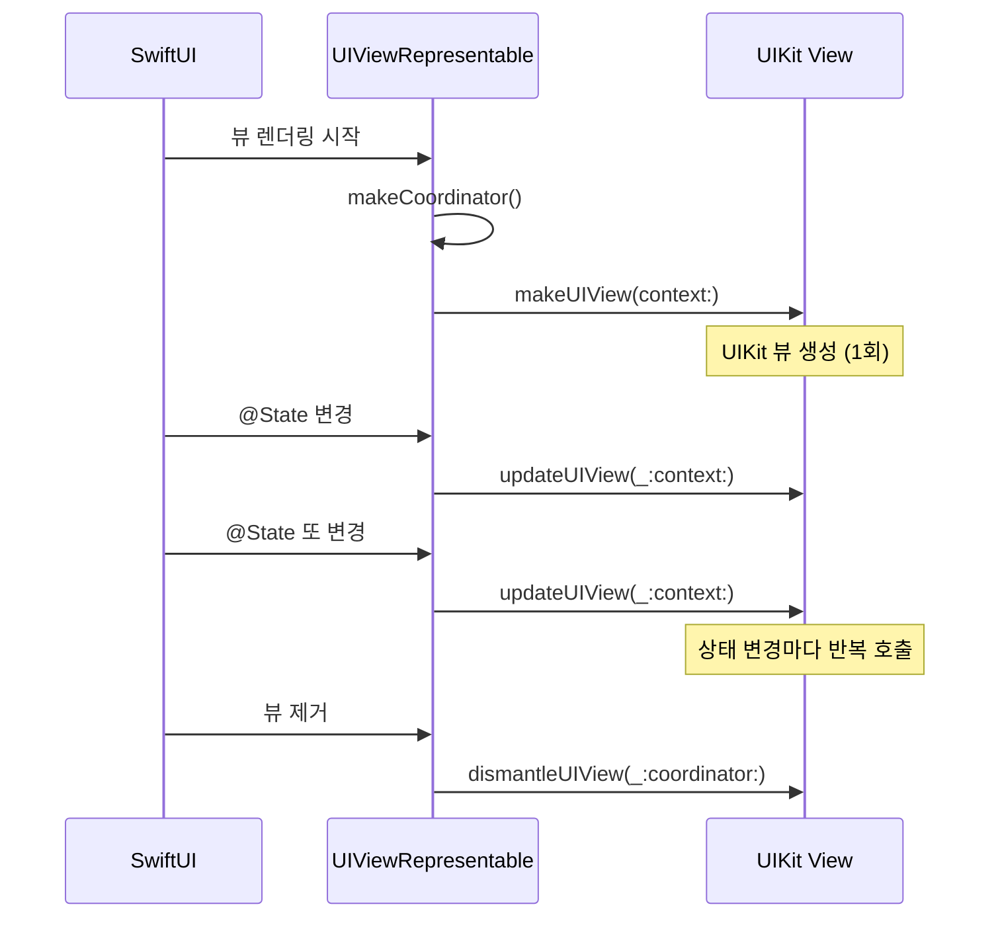
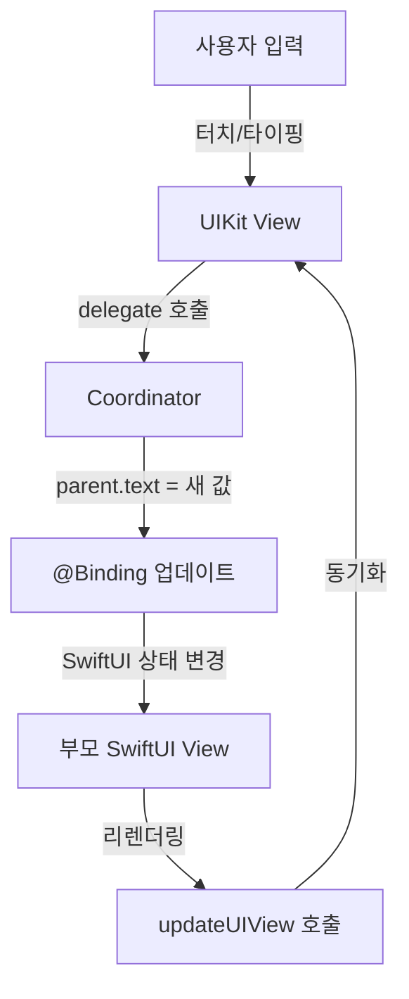
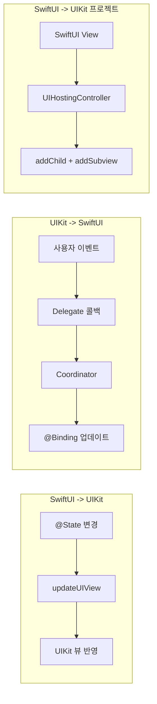

# 04. UIKit 브릿지

> UIViewRepresentable, UIViewControllerRepresentable, Coordinator

## 개요

SwiftUI가 아무리 강력해도, 아직 네이티브로 지원하지 않는 UIKit 컴포넌트가 있습니다. WKWebView, MKMapView의 고급 기능, UITextView의 풍부한 텍스트 편집, 카메라 커스텀 UI 등이 대표적이죠. UIKit 브릿지를 배우면 15년간 축적된 UIKit 생태계의 모든 것을 SwiftUI 앱에 자연스럽게 통합할 수 있습니다.

**선수 지식**: [PreferenceKey와 GeometryReader](./03-preference-geometry.md), [@State와 @Binding](../05-state-management/01-state-binding.md), [프로토콜](../02-swift-types/03-protocols-extensions.md)
**학습 목표**:
- UIViewRepresentable로 UIKit 뷰를 SwiftUI에 통합할 수 있다
- Coordinator 패턴으로 UIKit 델리게이트를 SwiftUI 데이터와 연결할 수 있다
- UIHostingController로 SwiftUI 뷰를 UIKit에 임베딩할 수 있다

## 왜 알아야 할까?

앱을 만들다 보면 결국 UIKit이 필요한 순간이 옵니다. "Swift 6 시대에 UIKit이 왜 필요해?"라고 생각할 수 있지만, 현실은 이렇습니다:

- 리치 텍스트 편집기 → `UITextView` (SwiftUI의 `TextEditor`는 기능이 제한적)
- 웹 콘텐츠 표시 → `WKWebView` (iOS 26에서 SwiftUI 네이티브 WebView 추가됨)
- 카메라 커스텀 UI → `AVCaptureVideoPreviewLayer`
- 기존 UIKit 코드베이스를 점진적으로 SwiftUI로 마이그레이션할 때

UIKit 브릿지는 "SwiftUI가 아직 못하는 것"을 해결하는 실용적 도구이면서, 동시에 기존 앱을 현대화하는 마이그레이션 전략의 핵심입니다.

## 핵심 개념

> 📊 **그림 1**: UIKit ↔ SwiftUI 브릿지 전체 구조

```mermaid
flowchart LR
    subgraph SwiftUI["SwiftUI 세계"]
        A["SwiftUI View"]
        B["@State / @Binding"]
    end
    subgraph Bridge["브릿지 계층"]
        C["UIViewRepresentable"]
        D["Coordinator"]
        E["UIHostingController"]
    end
    subgraph UIKit["UIKit 세계"]
        F["UIView"]
        G["UIViewController"]
    end
    A --> C --> F
    B -->|updateUIView| C
    F -->|delegate| D -->|@Binding 업데이트| B
    A --> E --> G
```


### 개념 1: UIViewRepresentable — UIKit 뷰를 SwiftUI에 포장하기

> 💡 **비유**: UIViewRepresentable은 **통역사**입니다. UIKit 뷰(외국인)가 SwiftUI 세계(한국)에서 소통할 수 있게 양쪽의 언어를 번역해주죠. "뷰를 만들어주세요"(makeUIView) → "상태가 바뀌었으니 업데이트하세요"(updateUIView) → "다 끝났으니 정리하세요"(dismantleUIView) 순서로 통역합니다.

UIViewRepresentable 프로토콜의 핵심은 두 가지 메서드입니다:

```swift
import SwiftUI
import WebKit

// UIKit의 WKWebView를 SwiftUI에서 사용하기
struct WebView: UIViewRepresentable {
    let url: URL

    // 1. UIKit 뷰 생성 (한 번만 호출)
    func makeUIView(context: Context) -> WKWebView {
        let webView = WKWebView()
        webView.load(URLRequest(url: url))
        return webView
    }

    // 2. SwiftUI 상태 변경 시 UIKit 뷰 업데이트 (여러 번 호출)
    func updateUIView(_ webView: WKWebView, context: Context) {
        // url이 변경되면 새 페이지 로드
        if webView.url != url {
            webView.load(URLRequest(url: url))
        }
    }
}

#Preview {
    WebView(url: URL(string: "https://developer.apple.com")!)
        .ignoresSafeArea()
}
```

라이프사이클을 정리하면:

| 단계 | 메서드 | 호출 시점 |
|------|--------|----------|
| 생성 | `makeUIView(context:)` | SwiftUI 뷰가 처음 나타날 때 (1회) |
| 업데이트 | `updateUIView(_:context:)` | SwiftUI의 @State/@Binding이 변경될 때 (N회) |
| 소멸 | `dismantleUIView(_:coordinator:)` | 뷰가 화면에서 제거될 때 (선택) |

> 📊 **그림 2**: UIViewRepresentable 라이프사이클




### 개념 2: Coordinator — UIKit 델리게이트와 SwiftUI의 다리

> 📊 **그림 3**: Coordinator 패턴의 데이터 흐름




> 💡 **비유**: Coordinator는 **비서**입니다. UIKit 뷰(상사)가 "사용자가 텍스트를 입력했어!"라고 말하면(delegate 호출), 비서가 SwiftUI의 `@Binding` 변수를 업데이트해서 부모 뷰에 알려주는 거죠.

UIKit은 델리게이트 패턴으로 이벤트를 처리합니다. SwiftUI와 연결하려면 `Coordinator` 클래스가 필요합니다:

```swift
import SwiftUI
import UIKit

// UITextView를 SwiftUI에서 사용 — Coordinator로 텍스트 변경 감지
struct RichTextEditor: UIViewRepresentable {
    @Binding var text: String
    var placeholder: String = "입력하세요..."

    // Coordinator 생성
    func makeCoordinator() -> Coordinator {
        Coordinator(parent: self)
    }

    func makeUIView(context: Context) -> UITextView {
        let textView = UITextView()
        textView.font = .preferredFont(forTextStyle: .body)
        textView.textContainerInset = UIEdgeInsets(top: 12, left: 8, bottom: 12, right: 8)
        // 델리게이트를 Coordinator로 설정
        textView.delegate = context.coordinator
        return textView
    }

    func updateUIView(_ textView: UITextView, context: Context) {
        // SwiftUI 상태 → UIKit 뷰 동기화
        if textView.text != text {
            textView.text = text
        }
    }

    // Coordinator: UIKit 델리게이트 ↔ SwiftUI @Binding 연결
    class Coordinator: NSObject, UITextViewDelegate {
        var parent: RichTextEditor

        init(parent: RichTextEditor) {
            self.parent = parent
        }

        // UIKit 이벤트 → SwiftUI @Binding 업데이트
        func textViewDidChange(_ textView: UITextView) {
            parent.text = textView.text
        }

        func textViewDidBeginEditing(_ textView: UITextView) {
            // 플레이스홀더 제거 등 추가 로직
            if textView.text == parent.placeholder {
                textView.text = ""
            }
        }
    }
}

struct RichTextEditorDemo: View {
    @State private var content = ""

    var body: some View {
        VStack(alignment: .leading, spacing: 12) {
            Text("메모")
                .font(.headline)

            RichTextEditor(text: $content, placeholder: "여기에 입력하세요...")
                .frame(height: 200)
                .overlay(
                    RoundedRectangle(cornerRadius: 12)
                        .stroke(.secondary.opacity(0.3))
                )
                .clipShape(RoundedRectangle(cornerRadius: 12))

            Text("글자 수: \(content.count)")
                .font(.caption)
                .foregroundStyle(.secondary)
        }
        .padding()
    }
}

#Preview {
    RichTextEditorDemo()
}
```

### 개념 3: UIViewControllerRepresentable — UIKit 뷰 컨트롤러 통합

전체 UIViewController를 SwiftUI에 통합할 때 사용합니다. 카메라, 문서 피커 등 시스템 뷰 컨트롤러를 연결할 때 특히 유용합니다:

```swift
import SwiftUI
import UIKit
import SafariServices

// Safari 뷰 컨트롤러를 SwiftUI에서 사용
struct SafariView: UIViewControllerRepresentable {
    let url: URL

    func makeUIViewController(context: Context) -> SFSafariViewController {
        let config = SFSafariViewController.Configuration()
        config.entersReaderIfAvailable = true
        return SFSafariViewController(url: url, configuration: config)
    }

    func updateUIViewController(_ uiViewController: SFSafariViewController, context: Context) {
        // SFSafariViewController는 URL 변경을 지원하지 않음
    }
}

// 사용 예시
struct SafariDemo: View {
    @State private var showSafari = false

    var body: some View {
        Button("Apple Developer 열기") {
            showSafari = true
        }
        .buttonStyle(.borderedProminent)
        .sheet(isPresented: $showSafari) {
            SafariView(url: URL(string: "https://developer.apple.com")!)
                .ignoresSafeArea()
        }
    }
}

#Preview {
    SafariDemo()
}
```

### 개념 4: UIHostingController — SwiftUI를 UIKit에 넣기

반대 방향도 가능합니다! `UIHostingController`를 사용하면 SwiftUI 뷰를 UIKit 프로젝트에 임베딩할 수 있습니다. 기존 UIKit 앱을 점진적으로 SwiftUI로 마이그레이션할 때 핵심 도구죠:

```swift
import SwiftUI
import UIKit

// SwiftUI 뷰
struct ProfileBadge: View {
    let name: String
    let level: Int

    var body: some View {
        HStack {
            Image(systemName: "person.circle.fill")
                .font(.title)
                .foregroundStyle(.blue)
            VStack(alignment: .leading) {
                Text(name).font(.headline)
                Text("레벨 \(level)").font(.caption).foregroundStyle(.secondary)
            }
        }
        .padding()
        .background(.blue.opacity(0.1))
        .clipShape(RoundedRectangle(cornerRadius: 12))
    }
}

// UIKit 뷰 컨트롤러에서 SwiftUI 뷰 사용
class ProfileViewController: UIViewController {
    override func viewDidLoad() {
        super.viewDidLoad()

        // SwiftUI 뷰를 UIHostingController로 감싸기
        let swiftUIView = ProfileBadge(name: "홍길동", level: 42)
        let hostingController = UIHostingController(rootView: swiftUIView)

        // 자식 뷰 컨트롤러로 추가
        addChild(hostingController)
        view.addSubview(hostingController.view)
        hostingController.didMove(toParent: self)

        // Auto Layout 설정
        hostingController.view.translatesAutoresizingMaskIntoConstraints = false
        NSLayoutConstraint.activate([
            hostingController.view.centerXAnchor.constraint(equalTo: view.centerXAnchor),
            hostingController.view.centerYAnchor.constraint(equalTo: view.centerYAnchor)
        ])
    }
}
```

### 개념 5: 데이터 흐름 정리

> 📊 **그림 4**: SwiftUI ↔ UIKit 양방향 데이터 흐름




SwiftUI ↔ UIKit 간 데이터 흐름을 정리하면:

| 방향 | 메커니즘 | 예시 |
|------|---------|------|
| SwiftUI → UIKit | `updateUIView` 메서드 | @State 변경 → UIKit 뷰 업데이트 |
| UIKit → SwiftUI | Coordinator + @Binding | 델리게이트 콜백 → @Binding 업데이트 |
| SwiftUI → UIKit 프로젝트 | UIHostingController | SwiftUI 뷰를 UIKit에 임베딩 |
| 환경 값 전달 | context.environment | UIKit에서 SwiftUI 환경 값 접근 |

## 실습: 직접 해보기

커스텀 색상 피커를 UIKit의 `UIColorPickerViewController`로 만들어봅시다:

```swift
import SwiftUI
import UIKit

struct ColorPickerBridge: UIViewControllerRepresentable {
    @Binding var selectedColor: Color

    func makeCoordinator() -> Coordinator {
        Coordinator(parent: self)
    }

    func makeUIViewController(context: Context) -> UIColorPickerViewController {
        let picker = UIColorPickerViewController()
        picker.delegate = context.coordinator
        picker.supportsAlpha = true
        return picker
    }

    func updateUIViewController(_ picker: UIColorPickerViewController, context: Context) {
        picker.selectedColor = UIColor(selectedColor)
    }

    class Coordinator: NSObject, UIColorPickerViewControllerDelegate {
        var parent: ColorPickerBridge

        init(parent: ColorPickerBridge) {
            self.parent = parent
        }

        func colorPickerViewController(
            _ viewController: UIColorPickerViewController,
            didSelect color: UIColor,
            continuously: Bool
        ) {
            parent.selectedColor = Color(color)
        }
    }
}

struct ColorPickerDemo: View {
    @State private var color = Color.blue
    @State private var showPicker = false

    var body: some View {
        VStack(spacing: 20) {
            RoundedRectangle(cornerRadius: 20)
                .fill(color)
                .frame(width: 200, height: 200)
                .shadow(color: color.opacity(0.5), radius: 10)

            Button("색상 선택") {
                showPicker = true
            }
            .buttonStyle(.borderedProminent)
            .tint(color)
        }
        .sheet(isPresented: $showPicker) {
            ColorPickerBridge(selectedColor: $color)
        }
    }
}

#Preview {
    ColorPickerDemo()
}
```

## 더 깊이 알아보기

### UIKit와 SwiftUI의 공존 역사

SwiftUI가 WWDC 2019에서 발표되었을 때, Apple은 이미 UIKit과의 브릿지를 함께 소개했습니다. `UIViewRepresentable`은 SwiftUI 1.0부터 있었는데, 이는 Apple이 **"SwiftUI가 UIKit을 완전히 대체하는 것이 아니라 공존한다"**는 철학을 가지고 있었기 때문입니다.

실제로 Apple의 자체 앱(설정, 메시지 등)도 UIKit과 SwiftUI를 혼합하여 구현되어 있습니다. iOS 26에서 SwiftUI 네이티브 `WebView`가 추가된 것처럼, 매년 WWDC에서 UIKit 브릿지가 필요했던 영역이 하나씩 SwiftUI 네이티브로 전환되고 있죠. 하지만 UIKit 브릿지 능력은 앞으로도 오랫동안 유용할 것입니다.

## 흔한 오해와 팁

> ⚠️ **흔한 오해**: "UIViewRepresentable에서 만든 UIKit 뷰는 SwiftUI 애니메이션이 안 된다" — `updateUIView` 안에서 `UIView.animate`를 사용하거나, SwiftUI 쪽에서 `withAnimation`과 함께 상태를 변경하면 `context.transaction.animation`을 통해 애니메이션 의도를 UIKit에 전달할 수 있습니다.

> 🔥 **실무 팁**: Coordinator 클래스에서 `parent` 프로퍼티를 통해 SwiftUI 뷰의 프로퍼티에 접근하는데, `updateUIView`가 호출될 때마다 Coordinator의 `parent`도 갱신해주세요. 오래된 값을 참조하는 버그를 방지합니다:

```swift
func updateUIView(_ uiView: UITextView, context: Context) {
    context.coordinator.parent = self  // 항상 최신 parent로 갱신
}
```

> 💡 **알고 계셨나요?**: `context.environment`를 통해 UIKit 뷰에서도 SwiftUI의 `@Environment` 값(colorScheme, sizeCategory 등)에 접근할 수 있습니다. 다크 모드 대응이나 Dynamic Type 지원에 유용해요.

## 핵심 정리

| 개념 | 설명 |
|------|------|
| UIViewRepresentable | UIKit 뷰를 SwiftUI에 통합하는 프로토콜 |
| UIViewControllerRepresentable | UIKit 뷰 컨트롤러를 SwiftUI에 통합하는 프로토콜 |
| makeUIView / makeUIViewController | UIKit 객체를 생성하는 메서드 (1회 호출) |
| updateUIView / updateUIViewController | SwiftUI 상태 변경 시 UIKit 업데이트 (N회 호출) |
| Coordinator | UIKit 델리게이트와 SwiftUI @Binding을 연결하는 클래스 |
| makeCoordinator | Coordinator 인스턴스를 생성하는 메서드 |
| UIHostingController | SwiftUI 뷰를 UIKit에 임베딩하는 컨트롤러 |
| context.environment | UIKit에서 SwiftUI 환경 값에 접근하는 경로 |

## 다음 섹션 미리보기

Ch11 고급 SwiftUI를 모두 마쳤습니다! Custom Layout, ViewBuilder, PreferenceKey, UIKit 브릿지까지 — SwiftUI의 숨겨진 힘을 모두 탐험했죠. 다음 [Ch12. 테스트와 품질](../12-testing-quality/01-unit-test.md)에서는 지금까지 만든 코드의 **품질을 보장**하는 방법, Unit Test와 Swift Testing 프레임워크를 배웁니다. Part 5 "출시와 확장" 여정의 시작입니다!

## 참고 자료

- [Apple 공식 문서 - UIViewRepresentable](https://developer.apple.com/documentation/swiftui/uiviewrepresentable) - UIViewRepresentable 전체 API 레퍼런스
- [Apple 공식 문서 - UIViewControllerRepresentable](https://developer.apple.com/documentation/swiftui/uiviewcontrollerrepresentable) - 뷰 컨트롤러 통합 가이드
- [Apple 공식 문서 - UIHostingController](https://developer.apple.com/documentation/swiftui/uihostingcontroller) - SwiftUI → UIKit 임베딩
- [WWDC 2022 - Use SwiftUI with UIKit](https://developer.apple.com/videos/play/wwdc2022/10072/) - SwiftUI와 UIKit 통합 실전 가이드
- [Swift by Sundell - Interfacing with UIKit](https://www.swiftbysundell.com/articles/swiftui-and-uikit-interoperability-part-1/) - 브릿지 패턴 실전 예제
- [Hacking with Swift - UIViewRepresentable tutorial](https://www.hackingwithswift.com/books/ios-swiftui/wrapping-a-uiviewcontroller-in-a-swiftui-view) - 단계별 실습 가이드
