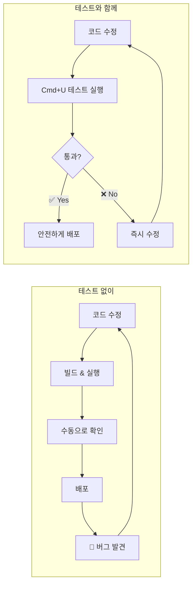
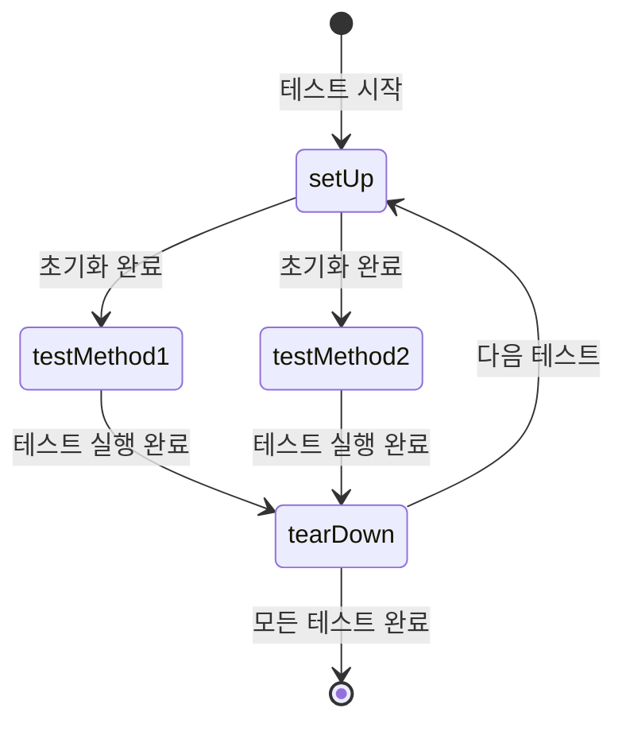
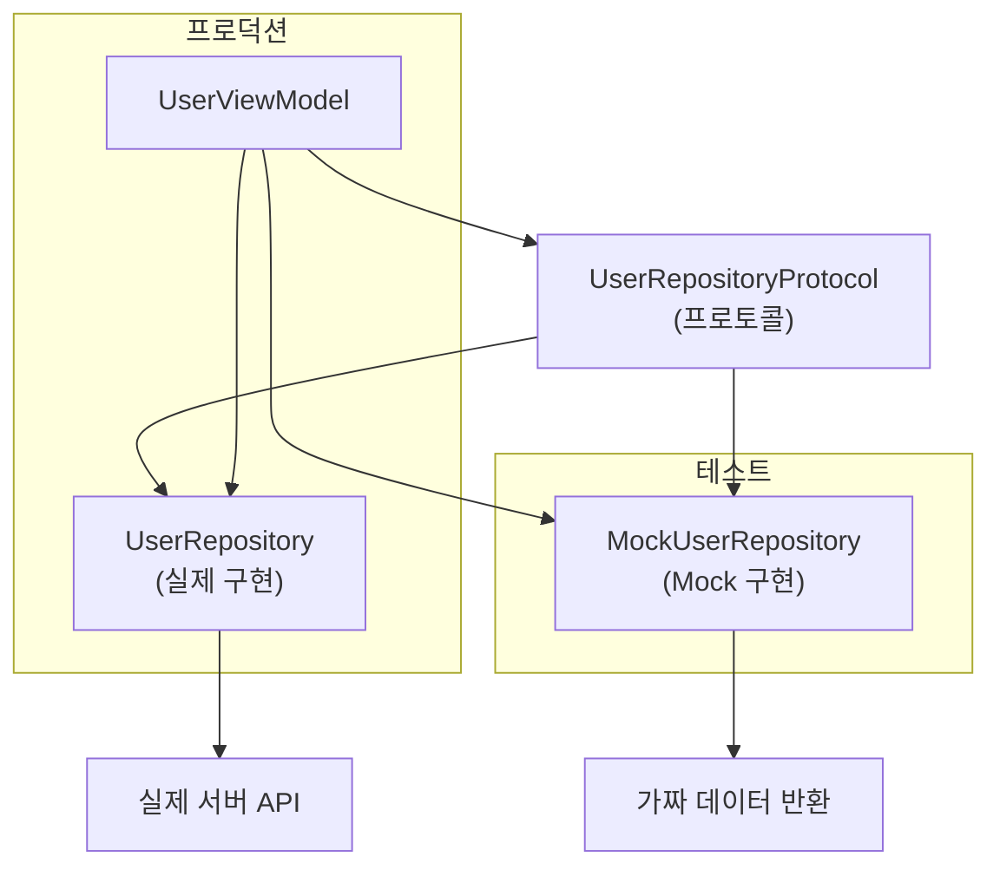

# Unit Test

> XCTest 기초, 테스트 작성법, Mocking

## 개요

"코드가 잘 동작한다"는 확신, 어디서 오나요? 눈으로 확인하는 건 한계가 있습니다. Unit Test는 코드의 가장 작은 단위를 자동으로 검증해서, 변경할 때마다 기존 기능이 깨지지 않았는지 확인해주는 안전망이에요.

**선수 지식**: [프로토콜과 익스텐션](../02-swift-types/03-protocols-extensions.md), [async/await 기초](../07-networking/01-async-await.md), [MVVM 패턴](../08-architecture/01-mvvm.md)
**학습 목표**:
- XCTest 프레임워크로 Unit Test를 작성하고 실행할 수 있다
- 다양한 Assertion 메서드를 상황에 맞게 사용할 수 있다
- 프로토콜 기반 Mocking으로 외부 의존성을 격리할 수 있다

## 왜 알아야 할까?

> 📊 **그림 3**: Unit Test가 있는 개발 워크플로 vs 없는 워크플로




앱이 커질수록 "여기 고치면 저기가 깨지는" 상황이 빈번해집니다. Unit Test가 있으면 코드를 수정한 뒤 Cmd+U 한 번으로 전체 기능이 정상인지 바로 확인할 수 있죠. 실제로 많은 기업에서 테스트 커버리지를 채용 기준으로 삼을 만큼, 테스트 작성 능력은 프로 개발자의 필수 역량입니다.

## 핵심 개념

### 개념 1: XCTest 프레임워크 기초

> 💡 **비유**: Unit Test는 **자동차 출고 전 검수 라인**과 같습니다. 엔진, 브레이크, 에어백을 각각 따로 테스트해서, 조립 후에도 개별 부품이 제대로 동작하는지 확인하는 거죠.

XCTest는 Apple이 제공하는 테스트 프레임워크입니다. Xcode에서 프로젝트를 만들 때 "Include Tests"를 체크하면 자동으로 테스트 타겟이 생성됩니다.

> 📊 **그림 1**: XCTest 테스트 메서드 실행 라이프사이클




```swift
import XCTest
@testable import MyApp  // 앱 모듈을 테스트에서 접근

// XCTestCase를 상속받아 테스트 클래스 작성
final class CalculatorTests: XCTestCase {

    var calculator: Calculator!

    // 각 테스트 메서드 실행 전 호출
    override func setUp() {
        super.setUp()
        calculator = Calculator()
    }

    // 각 테스트 메서드 실행 후 호출
    override func tearDown() {
        calculator = nil
        super.tearDown()
    }

    // "test"로 시작하는 메서드가 테스트로 인식됨
    func testAddition() {
        let result = calculator.add(2, 3)
        XCTAssertEqual(result, 5, "2 + 3은 5여야 합니다")
    }

    func testDivisionByZero() {
        let result = calculator.divide(10, by: 0)
        XCTAssertNil(result, "0으로 나누면 nil을 반환해야 합니다")
    }
}
```

> ⚠️ **흔한 오해**: "테스트 메서드 이름에 `test` 접두사를 안 붙이면 안 돼요!" — XCTest는 `test`로 시작하는 메서드만 자동으로 테스트로 인식합니다. 실수로 빼먹으면 테스트가 실행되지 않아요.

### 개념 2: 다양한 Assertion 메서드

XCTest는 40여 개의 Assertion 메서드를 제공합니다. 자주 쓰는 것들을 정리하면:

| Assertion | 용도 | 예시 |
|-----------|------|------|
| `XCTAssertEqual(a, b)` | 두 값이 같은지 | `XCTAssertEqual(name, "Swift")` |
| `XCTAssertNotEqual(a, b)` | 두 값이 다른지 | `XCTAssertNotEqual(count, 0)` |
| `XCTAssertTrue(expr)` | 참인지 | `XCTAssertTrue(user.isActive)` |
| `XCTAssertFalse(expr)` | 거짓인지 | `XCTAssertFalse(list.isEmpty)` |
| `XCTAssertNil(expr)` | nil인지 | `XCTAssertNil(error)` |
| `XCTAssertNotNil(expr)` | nil이 아닌지 | `XCTAssertNotNil(result)` |
| `XCTAssertThrowsError(expr)` | 에러를 던지는지 | 에러 발생 검증 |
| `XCTAssertNoThrow(expr)` | 에러 없이 실행되는지 | 정상 실행 검증 |
| `XCTFail()` | 무조건 실패 | 도달하면 안 되는 분기 표시 |

```swift
func testUserValidation() {
    let user = User(name: "Kim", age: 25)

    XCTAssertEqual(user.name, "Kim")
    XCTAssertTrue(user.isAdult)       // age >= 18
    XCTAssertGreaterThan(user.age, 0) // 양수 확인
}

func testInvalidEmailThrows() {
    XCTAssertThrowsError(try validateEmail("invalid")) { error in
        // 던져진 에러의 타입까지 검증
        XCTAssertEqual(error as? ValidationError, .invalidFormat)
    }
}
```

### 개념 3: async/await 테스트

Swift Concurrency 코드를 테스트할 때는 테스트 메서드에 `async`를 붙이면 됩니다.

```swift
func testFetchUser() async throws {
    let service = UserService()

    // async 함수를 await로 호출
    let user = try await service.fetchUser(id: "123")

    XCTAssertEqual(user.name, "홍길동")
    XCTAssertNotNil(user.email)
}
```

### 개념 4: 프로토콜 기반 Mocking

> 💡 **비유**: 영화 촬영에서 **스턴트 더블**이 위험한 장면을 대신하듯, Mock 객체는 실제 네트워크나 데이터베이스 대신 테스트에서 "대역"을 맡습니다.

실제 서버에 요청을 보내면 테스트가 느려지고 불안정해집니다. 프로토콜로 의존성을 추상화하고, 테스트에서는 가짜(Mock) 구현을 주입하세요.

> 📊 **그림 2**: 프로토콜 기반 Mocking — 프로덕션 vs 테스트 의존성 주입




```swift
// 1. 프로토콜로 인터페이스 정의
protocol UserRepositoryProtocol {
    func fetchUser(id: String) async throws -> User
}

// 2. 실제 구현 (프로덕션 코드)
struct UserRepository: UserRepositoryProtocol {
    func fetchUser(id: String) async throws -> User {
        // 실제 네트워크 요청
        let url = URL(string: "https://api.example.com/users/\(id)")!
        let (data, _) = try await URLSession.shared.data(from: url)
        return try JSONDecoder().decode(User.self, from: data)
    }
}

// 3. Mock 구현 (테스트 코드)
struct MockUserRepository: UserRepositoryProtocol {
    var mockUser: User?
    var mockError: Error?

    func fetchUser(id: String) async throws -> User {
        if let error = mockError { throw error }
        return mockUser ?? User(id: id, name: "테스트 유저", email: "test@test.com")
    }
}

// 4. ViewModel은 프로토콜에 의존
@Observable
class UserViewModel {
    var user: User?
    var errorMessage: String?
    private let repository: UserRepositoryProtocol

    init(repository: UserRepositoryProtocol) {
        self.repository = repository
    }

    func loadUser(id: String) async {
        do {
            user = try await repository.fetchUser(id: id)
        } catch {
            errorMessage = error.localizedDescription
        }
    }
}

// 5. 테스트에서 Mock 주입
final class UserViewModelTests: XCTestCase {
    func testLoadUserSuccess() async {
        // Given: Mock에 성공 데이터 설정
        let expectedUser = User(id: "1", name: "김철수", email: "kim@test.com")
        let mock = MockUserRepository(mockUser: expectedUser)
        let viewModel = UserViewModel(repository: mock)

        // When: 유저 로드
        await viewModel.loadUser(id: "1")

        // Then: 결과 검증
        XCTAssertEqual(viewModel.user?.name, "김철수")
        XCTAssertNil(viewModel.errorMessage)
    }

    func testLoadUserFailure() async {
        // Given: Mock에 에러 설정
        let mock = MockUserRepository(mockError: URLError(.notConnectedToInternet))
        let viewModel = UserViewModel(repository: mock)

        // When
        await viewModel.loadUser(id: "1")

        // Then
        XCTAssertNil(viewModel.user)
        XCTAssertNotNil(viewModel.errorMessage)
    }
}
```

> 🔥 **실무 팁**: 테스트 코드는 **Given-When-Then** 패턴으로 구조화하세요. 준비(Given) → 실행(When) → 검증(Then)으로 나누면 테스트의 의도가 명확해집니다.

## 실습: 직접 해보기

간단한 `TodoManager`를 만들고 테스트해봅시다.

```swift
// 앱 코드: TodoManager.swift
struct Todo: Equatable, Identifiable {
    let id: UUID
    var title: String
    var isCompleted: Bool
}

@Observable
class TodoManager {
    private(set) var todos: [Todo] = []

    // 할 일 추가
    func add(title: String) {
        let todo = Todo(id: UUID(), title: title, isCompleted: false)
        todos.append(todo)
    }

    // 완료 토글
    func toggleComplete(id: UUID) {
        guard let index = todos.firstIndex(where: { $0.id == id }) else { return }
        todos[index].isCompleted.toggle()
    }

    // 완료된 항목 삭제
    func removeCompleted() {
        todos.removeAll { $0.isCompleted }
    }

    // 미완료 개수
    var pendingCount: Int {
        todos.filter { !$0.isCompleted }.count
    }
}
```

```swift
// 테스트 코드: TodoManagerTests.swift
import XCTest
@testable import MyApp

final class TodoManagerTests: XCTestCase {
    var manager: TodoManager!

    override func setUp() {
        super.setUp()
        manager = TodoManager()
    }

    func testAddTodo() {
        manager.add(title: "Swift 공부")
        XCTAssertEqual(manager.todos.count, 1)
        XCTAssertEqual(manager.todos.first?.title, "Swift 공부")
        XCTAssertFalse(manager.todos.first?.isCompleted ?? true)
    }

    func testToggleComplete() {
        manager.add(title: "테스트 작성")
        let id = manager.todos[0].id

        manager.toggleComplete(id: id)
        XCTAssertTrue(manager.todos[0].isCompleted)

        manager.toggleComplete(id: id)
        XCTAssertFalse(manager.todos[0].isCompleted)
    }

    func testRemoveCompleted() {
        manager.add(title: "할 일 1")
        manager.add(title: "할 일 2")
        manager.add(title: "할 일 3")

        manager.toggleComplete(id: manager.todos[0].id)
        manager.toggleComplete(id: manager.todos[2].id)
        manager.removeCompleted()

        XCTAssertEqual(manager.todos.count, 1)
        XCTAssertEqual(manager.todos[0].title, "할 일 2")
    }

    func testPendingCount() {
        manager.add(title: "A")
        manager.add(title: "B")
        manager.add(title: "C")
        manager.toggleComplete(id: manager.todos[1].id)

        XCTAssertEqual(manager.pendingCount, 2)
    }
}
```

## 더 깊이 알아보기

XCTest의 역사는 생각보다 깁니다. 원래 NeXT 시절의 **SenTestingKit**에서 시작했는데, Steve Jobs가 Apple에 돌아오면서 함께 넘어왔죠. 2013년 Xcode 5에서 XCTest로 이름을 바꾸고 현대적인 API를 갖추게 되었습니다. 재미있는 건, 소프트웨어 테스트의 아버지라 불리는 **Kent Beck**이 만든 SUnit(Smalltalk)과 JUnit(Java)의 영향을 받아 xUnit 패밀리의 일원이라는 점이에요. 그래서 `setUp`/`tearDown` 같은 패턴이 JUnit과 거의 같습니다.

## 흔한 오해와 팁

> ⚠️ **흔한 오해**: "테스트는 시간 낭비다" — 테스트 작성에 시간이 들지만, 버그를 나중에 잡는 비용이 훨씬 큽니다. 특히 앱스토어 심사 후 크래시가 발견되면 리젝과 재심사로 며칠이 날아갈 수 있어요.

> 🔥 **실무 팁**: 테스트 이름은 `test_무엇을_어떤조건에서_기대결과()` 패턴으로 짓세요. 예: `test_fetchUser_whenOffline_returnsError()`. 실패 시 어떤 시나리오가 깨졌는지 바로 알 수 있습니다.

> 💡 **알고 계셨나요?**: Xcode에서 테스트 메서드 왼쪽의 다이아몬드를 클릭하면 해당 테스트만 단독 실행할 수 있습니다. 전체 테스트(Cmd+U)를 돌리기 전에 작성 중인 테스트만 빠르게 확인할 때 편리하죠.

## 핵심 정리

| 개념 | 설명 |
|------|------|
| XCTestCase | 테스트 클래스의 기본 클래스, setUp/tearDown 라이프사이클 제공 |
| Assertion | XCTAssertEqual, XCTAssertTrue 등 결과 검증 메서드 |
| @testable import | 앱 모듈의 internal 접근 수준을 테스트에서 접근 가능하게 함 |
| Mock | 프로토콜 기반 가짜 객체로 외부 의존성 격리 |
| Given-When-Then | 테스트 구조화 패턴: 준비 → 실행 → 검증 |
| async 테스트 | 테스트 메서드에 async throws를 붙여 비동기 코드 테스트 |

## 다음 섹션 미리보기

XCTest가 오래된 방식이라면, 다음에 배울 [Swift Testing 프레임워크](./02-swift-testing.md)는 Apple이 새롭게 설계한 차세대 테스트 프레임워크입니다. `#expect` 하나로 40개 Assertion을 대체하고, 매크로 기반의 더 깔끔한 문법을 경험해보세요.

## 참고 자료

- [XCTest - Apple Developer Documentation](https://developer.apple.com/documentation/xctest) - XCTest 프레임워크의 공식 레퍼런스
- [Testing Your Apps in Xcode - WWDC](https://developer.apple.com/videos/play/wwdc2019/413/) - Xcode 테스트의 기초를 다루는 세션
- [Writing Test Classes and Methods - Apple Archive](https://developer.apple.com/library/archive/documentation/DeveloperTools/Conceptual/testing_with_xcode/chapters/04-writing_tests.html) - 테스트 작성 가이드
- [Hacking with Swift - Creating our first unit test](https://www.hackingwithswift.com/read/39/2/creating-our-first-unit-test-using-xctest) - 실전 XCTest 튜토리얼
