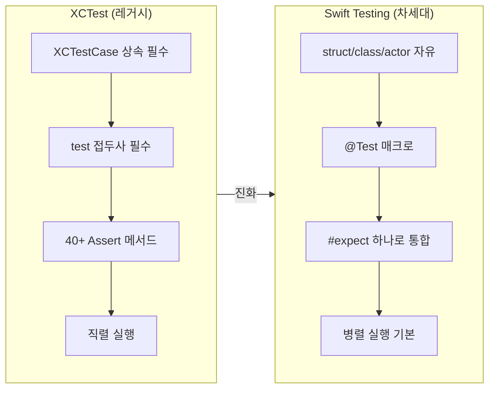
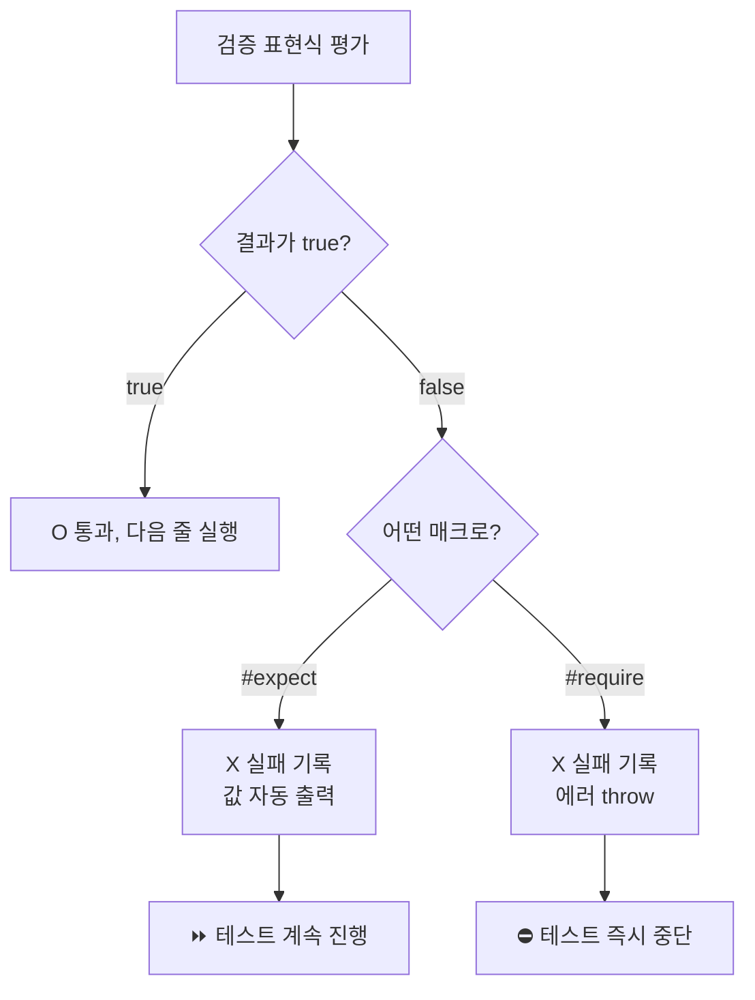
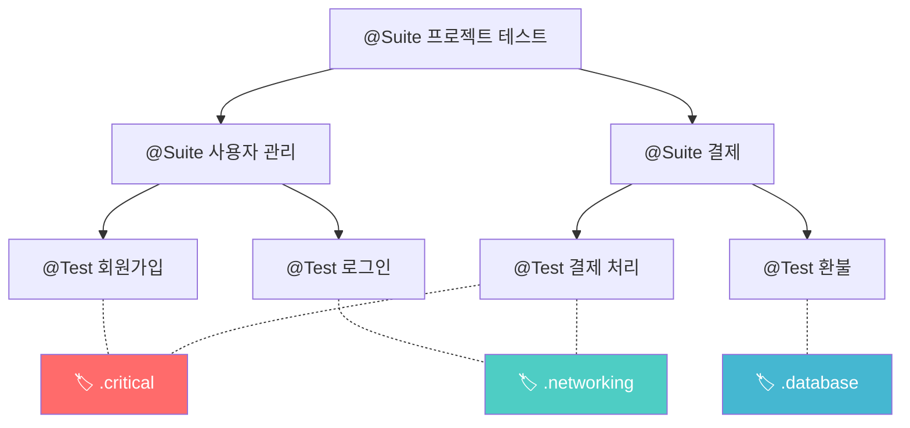

# Swift Testing 프레임워크

> #expect, @Test, @Suite, 차세대 테스트

## 개요

Apple이 WWDC 2024에서 발표한 Swift Testing은 XCTest의 40여 개 Assertion을 `#expect` 하나로 대체하는 차세대 테스트 프레임워크입니다. Swift 매크로의 힘을 활용해 더 적은 코드로 더 명확한 테스트를 작성할 수 있죠.

**선수 지식**: [Unit Test](./01-unit-test.md)에서 배운 XCTest 기본 개념
**학습 목표**:
- @Test와 @Suite 매크로로 테스트를 구조화할 수 있다
- #expect와 #require로 다양한 조건을 검증할 수 있다
- 매개변수화 테스트로 여러 입력을 한 번에 검증할 수 있다

## 왜 알아야 할까?

XCTest는 Objective-C 시대에 설계되었습니다. `XCTestCase`를 상속해야 하고, 메서드 이름을 `test`로 시작해야 하며, 40개가 넘는 Assertion 중 뭘 써야 할지 고민해야 하죠. Swift Testing은 이런 레거시를 걷어내고, Swift 언어의 장점을 100% 활용하도록 처음부터 새로 설계되었습니다. Apple은 새 프로젝트에서 Swift Testing을 기본으로 권장하고 있어요.

> 📊 **그림 1**: XCTest vs Swift Testing — 패러다임 변화




## 핵심 개념

### 개념 1: @Test와 @Suite — 테스트 선언

> 💡 **비유**: XCTest가 **지정된 양식에 맞춰 작성하는 공문서**라면, Swift Testing은 **자유 형식 메모**입니다. 핵심만 적으면 되죠.

Swift Testing에서는 `XCTestCase` 상속 없이, `@Test` 매크로만 붙이면 테스트가 됩니다.

```swift
import Testing

// struct, class, actor 모두 사용 가능 (XCTestCase 상속 불필요!)
struct CalculatorTests {
    let calculator = Calculator()

    // @Test 매크로로 테스트 선언
    @Test("두 수의 덧셈")
    func addition() {
        #expect(calculator.add(2, 3) == 5)
    }

    @Test("0으로 나누면 nil 반환")
    func divisionByZero() {
        #expect(calculator.divide(10, by: 0) == nil)
    }
}
```

`@Suite`로 테스트를 그룹화하고, 중첩 구조도 만들 수 있습니다.

```swift
@Suite("사용자 관리")
struct UserTests {

    @Suite("회원가입")
    struct SignUpTests {
        @Test("유효한 이메일로 가입 성공")
        func validEmail() throws {
            let user = try User.create(email: "test@example.com")
            #expect(user.isActive)
        }
    }

    @Suite("로그인")
    struct LoginTests {
        @Test("올바른 비밀번호로 로그인")
        func correctPassword() { /* ... */ }
    }
}
```

### 개념 2: #expect와 #require — 단 두 개의 매크로

> 💡 **비유**: XCTest의 Assertion이 **용도별 칼 40자루**라면, `#expect`는 **만능 스위스 아미 나이프** 하나입니다.

`#expect`는 Swift 표현식을 그대로 받아들입니다. 실패 시 변수의 실제 값까지 자동으로 보여줘서 디버깅이 쉽습니다.

```swift
import Testing

@Test func expectations() {
    let name = "Swift"
    let count = 42

    // 동등 비교 — XCTAssertEqual 대체
    #expect(name == "Swift")

    // 부등 비교 — XCTAssertNotEqual 대체
    #expect(count != 0)

    // 크기 비교 — XCTAssertGreaterThan 대체
    #expect(count > 10)

    // Bool 검증 — XCTAssertTrue 대체
    #expect(name.hasPrefix("Sw"))

    // 실패 시 출력 예: "Expectation failed: (count → 42) < 10"
}
```

`#require`는 실패 시 테스트를 즉시 중단합니다. 옵셔널 언래핑에 특히 유용하죠.

> 📊 **그림 2**: #expect vs #require 실패 시 동작 흐름




```swift
@Test func optionalUnwrapping() throws {
    let data: [String: Any] = ["name": "Kim", "age": 30]

    // #require는 nil이면 테스트 즉시 중단 (XCTUnwrap 대체)
    let name = try #require(data["name"] as? String)
    #expect(name == "Kim")

    let age = try #require(data["age"] as? Int)
    #expect(age >= 18)
}
```

**에러 검증**도 자연스럽습니다.

```swift
@Test("잘못된 이메일은 에러를 던진다")
func invalidEmailThrows() {
    // 특정 에러 타입 검증
    #expect(throws: ValidationError.self) {
        try validateEmail("not-an-email")
    }

    // 특정 에러 값 검증
    #expect(throws: ValidationError.invalidFormat) {
        try validateEmail("@missing")
    }
}
```

### 개념 3: 매개변수화 테스트(Parameterized Tests)

반복적인 테스트를 획기적으로 줄여주는 기능입니다.

```swift
// 하나의 테스트로 여러 입력을 검증
@Test("유효한 이메일 형식", arguments: [
    "user@example.com",
    "admin@company.co.kr",
    "test.name+tag@domain.org"
])
func validEmails(email: String) throws {
    let result = try validateEmail(email)
    #expect(result.isValid)
}

// 두 개의 인자를 zip으로 짝지어 테스트
@Test("비밀번호 강도 검증", arguments: zip(
    ["1234", "abcdef", "Abc123!@"],
    [PasswordStrength.weak, .medium, .strong]
))
func passwordStrength(password: String, expected: PasswordStrength) {
    #expect(checkStrength(password) == expected)
}
```

> ⚠️ **흔한 오해**: `arguments`에 배열 두 개를 `zip` 없이 넘기면 **모든 조합(카르테시안 곱)**이 실행됩니다. 1:1 매칭을 원하면 반드시 `zip`을 사용하세요.

### 개념 4: Tags와 Traits — 테스트 관리

> 📊 **그림 3**: @Suite, @Test, Tags를 활용한 테스트 조직화 구조




Tags로 테스트를 분류하면, Xcode에서 특정 태그만 골라 실행할 수 있습니다.

```swift
// 태그 정의
extension Tag {
    @Tag static var networking: Self
    @Tag static var database: Self
    @Tag static var critical: Self
}

// 태그 적용
@Test("API 호출 테스트", .tags(.networking, .critical))
func apiCall() async throws { /* ... */ }

// 조건부 실행
@Test("iOS에서만 실행", .enabled(if: ProcessInfo.processInfo.environment["CI"] != nil))
func ciOnlyTest() { /* ... */ }

// 비활성화 (사유 기록)
@Test("리팩토링 후 재활성화 예정", .disabled("서버 API 변경 대응 중"))
func temporarilyDisabled() { /* ... */ }

// 시간 제한
@Test("3초 내 완료", .timeLimit(.minutes(1)))
func performanceTest() async { /* ... */ }
```

### 개념 5: confirmation — 비동기 이벤트 검증

콜백이나 델리게이트처럼 이벤트 기반 코드를 테스트할 때 사용합니다.

```swift
@Test("알림이 정확히 3번 전달됨")
func notificationCount() async {
    await confirmation("didReceive 호출", expectedCount: 3) { confirm in
        let handler = NotificationHandler { _ in
            confirm()  // 이벤트 발생 시 호출
        }
        handler.processNotifications(count: 3)
    }
}

// 이벤트가 발생하지 않아야 할 때
@Test("로그아웃 후 동기화 안 됨")
func noSyncAfterLogout() async {
    await confirmation(expectedCount: 0) { confirm in
        let sync = MockSyncEngine { confirm() }
        let manager = AccountManager(syncEngine: sync)
        manager.logout()
    }
}
```

## 실습: 직접 해보기

앞 섹션의 `TodoManager`를 Swift Testing으로 다시 작성해봅시다.

```swift
import Testing
@testable import MyApp

@Suite("할 일 관리")
struct TodoManagerTests {
    let manager = TodoManager()  // 매 테스트마다 새 인스턴스 생성

    @Test("할 일 추가")
    func addTodo() {
        manager.add(title: "Swift Testing 배우기")
        #expect(manager.todos.count == 1)
        #expect(manager.todos.first?.title == "Swift Testing 배우기")
    }

    @Test("완료 토글")
    func toggleComplete() {
        manager.add(title: "테스트")
        let id = manager.todos[0].id

        manager.toggleComplete(id: id)
        #expect(manager.todos[0].isCompleted)
    }

    @Test("미완료 개수 계산", arguments: [
        (added: 3, completed: 1, expected: 2),
        (added: 5, completed: 5, expected: 0),
        (added: 2, completed: 0, expected: 2),
    ])
    func pendingCount(added: Int, completed: Int, expected: Int) {
        for i in 0..<added {
            manager.add(title: "할 일 \(i)")
        }
        for i in 0..<completed {
            manager.toggleComplete(id: manager.todos[i].id)
        }
        #expect(manager.pendingCount == expected)
    }
}
```

## 더 깊이 알아보기

Swift Testing은 WWDC 2024에서 처음 공개되었을 때 개발자 커뮤니티의 큰 환영을 받았습니다. 40개가 넘는 XCTAssert 변형을 `#expect` 하나로 대체한다는 발상은 사실 **Swift 매크로**(SE-0389)가 있었기에 가능했죠. 매크로가 컴파일 타임에 표현식을 분석해서 실패 시 각 변수의 값을 자동으로 출력해주는 마법을 부리는 겁니다.

Xcode 26(Swift 6.2)에서는 **Exit Test**와 **Attachment**가 추가되었습니다. Exit Test는 `fatalError()`나 `precondition()` 같은 크래시 코드를 안전하게 테스트할 수 있게 해주고, Attachment는 테스트 실패 시 진단 데이터(스크린샷, JSON 응답 등)를 첨부할 수 있게 합니다.

> 💡 **알고 계셨나요?**: Swift Testing은 기본적으로 테스트를 **병렬 실행**합니다. XCTest는 직렬이 기본이었죠. 덕분에 테스트 속도가 획기적으로 빨라지지만, 테스트 간 상태 공유에 주의해야 합니다.

## 흔한 오해와 팁

> ⚠️ **흔한 오해**: "Swift Testing이 나왔으니 XCTest는 버려야 한다" — 아닙니다! UI 테스트(XCUITest)와 성능 테스트(XCTMetric)는 아직 Swift Testing에서 지원하지 않습니다. 두 프레임워크는 같은 타겟에서 공존할 수 있어요.

> 🔥 **실무 팁**: `#require`는 꼭 필요한 전제 조건에만 사용하세요. 대부분의 검증은 `#expect`로 충분합니다. `#require`를 남발하면 첫 번째 실패에서 테스트가 멈춰, 한 번 실행으로 여러 문제를 찾을 기회를 놓칩니다.

| XCTest | Swift Testing |
|--------|---------------|
| `class MyTests: XCTestCase` | `struct MyTests` (상속 불필요) |
| `func testSomething()` | `@Test func something()` |
| `XCTAssertEqual(a, b)` | `#expect(a == b)` |
| `XCTUnwrap(optional)` | `try #require(optional)` |
| `setUpWithError()` | `init() throws` |
| `tearDown()` | `deinit` (class 사용 시) |
| `XCTestExpectation` | `await confirmation { }` |

## 핵심 정리

| 개념 | 설명 |
|------|------|
| @Test | 매크로로 테스트 함수를 선언, 설명 문자열 추가 가능 |
| @Suite | 테스트를 그룹화하고 중첩 구조 생성 |
| #expect | Swift 표현식으로 조건 검증, 실패 시 값 자동 출력 |
| #require | 필수 전제 조건 검증, 실패 시 즉시 중단 |
| arguments | 매개변수화 테스트로 여러 입력 한 번에 검증 |
| Tags | 테스트를 분류하고 선택적으로 실행 |
| confirmation | 비동기 이벤트 발생 횟수 검증 |

## 다음 섹션 미리보기

코드 레벨의 테스트를 마쳤으니, 다음은 사용자 관점에서 앱을 검증하는 [UI Test](./03-ui-test.md)입니다. 실제 화면을 자동으로 탭하고 스와이프하면서 사용자 시나리오를 검증하는 방법을 배워봅시다.

## 참고 자료

- [Swift Testing - Apple Developer](https://developer.apple.com/xcode/swift-testing) - 공식 소개 페이지
- [Meet Swift Testing - WWDC24](https://developer.apple.com/videos/play/wwdc2024/10179/) - Swift Testing 소개 세션
- [Go further with Swift Testing - WWDC24](https://developer.apple.com/videos/play/wwdc2024/10195/) - 고급 기능 세션
- [Mastering the Swift Testing Framework - Fatbobman](https://fatbobman.com/en/posts/mastering-the-swift-testing-framework/) - 심층 가이드
- [Swift Testing Playbook](https://gist.github.com/steipete/84a5952c22e1ff9b6fe274ab079e3a95) - 패턴과 모범 사례 모음
