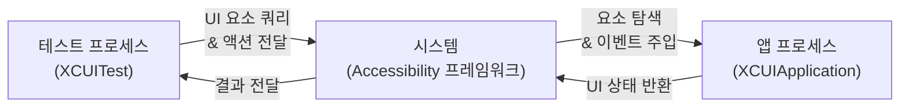
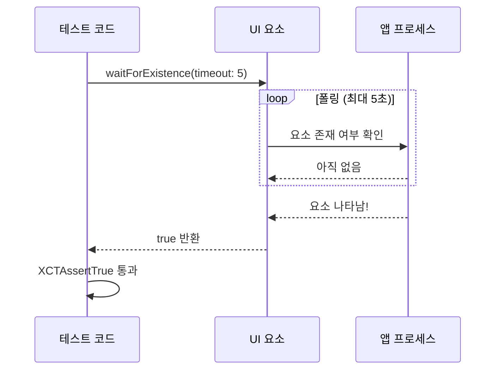
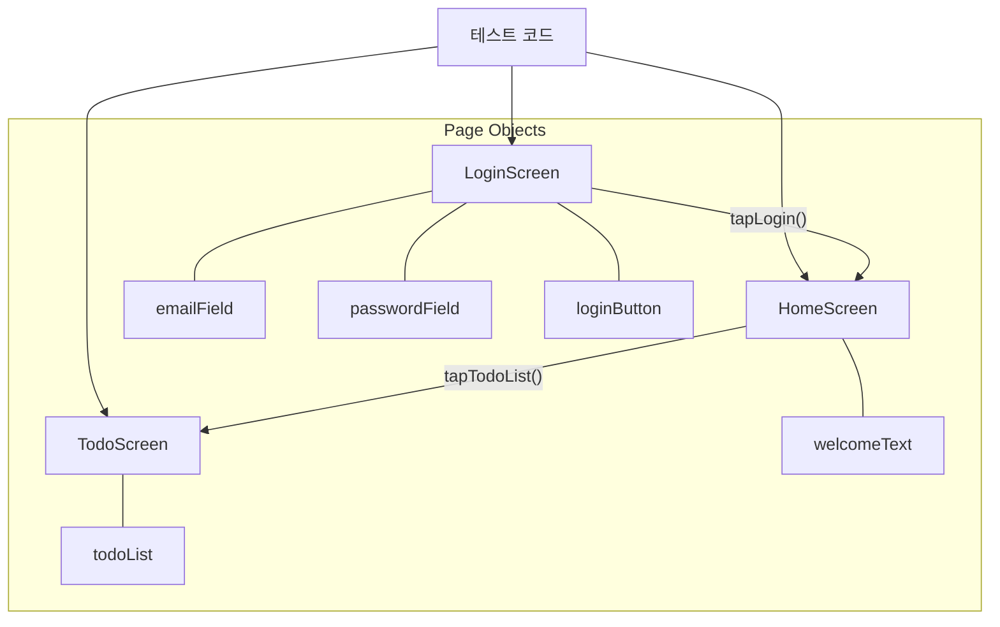

# UI Test

> XCUITest, 자동화 시나리오, 접근성 ID 활용

## 개요

Unit Test가 코드 한 줄 한 줄을 검증한다면, UI Test는 실제 사용자처럼 화면을 탭하고, 텍스트를 입력하고, 결과를 확인합니다. "버튼을 눌렀는데 화면이 안 바뀌는" 문제를 배포 전에 잡을 수 있는 강력한 도구죠.

**선수 지식**: [Unit Test](./01-unit-test.md), [Swift Testing 프레임워크](./02-swift-testing.md)
**학습 목표**:
- XCUITest로 SwiftUI 앱의 UI 테스트를 작성할 수 있다
- accessibilityIdentifier를 활용해 안정적으로 UI 요소를 찾을 수 있다
- Page Object 패턴으로 유지보수하기 좋은 UI 테스트를 설계할 수 있다

## 왜 알아야 할까?

"내 폰에서는 잘 되는데?"라는 말을 해본 적 있나요? UI Test는 다양한 시나리오를 자동으로 반복 실행해서, 사람이 놓치기 쉬운 UI 버그를 잡아줍니다. 특히 회원가입이나 결제처럼 **한 번 실패하면 사용자를 잃는 핵심 플로우**를 보호하는 데 필수적입니다.

## 핵심 개념

### 개념 1: XCUITest 기초

> 💡 **비유**: UI Test는 **로봇 사용자**입니다. 여러분이 작성한 대본(테스트 코드)대로 앱을 조작하고, 기대한 결과가 나오는지 확인해주죠.

UI 테스트 타겟은 앱과 별도 프로세스에서 실행됩니다. 앱의 코드를 직접 접근할 수 없고, 오직 화면의 요소를 통해서만 상호작용합니다.

> 📊 **그림 1**: XCUITest 실행 구조 — 테스트와 앱은 별도 프로세스




```swift
import XCTest

final class LoginUITests: XCTestCase {
    let app = XCUIApplication()

    override func setUp() {
        super.setUp()
        continueAfterFailure = false  // 실패 시 즉시 중단
        app.launchArguments = ["isRunningUITests"]  // 테스트 모드 플래그
        app.launch()
    }

    func testLoginFlow() {
        // 텍스트 필드 찾기 & 텍스트 입력
        let emailField = app.textFields["emailTextField"]
        XCTAssertTrue(emailField.waitForExistence(timeout: 3))
        emailField.tap()
        emailField.typeText("user@example.com")

        // 시큐어 필드에 비밀번호 입력
        let passwordField = app.secureTextFields["passwordTextField"]
        passwordField.tap()
        passwordField.typeText("password123")

        // 로그인 버튼 탭
        app.buttons["loginButton"].tap()

        // 로그인 성공 후 환영 메시지 확인
        let welcomeText = app.staticTexts["환영합니다!"]
        XCTAssertTrue(welcomeText.waitForExistence(timeout: 5))
    }
}
```

앱 코드에서는 `launchArguments`를 확인해 테스트용 환경을 설정할 수 있습니다.

```swift
// 앱 코드에서 테스트 모드 감지
@main
struct MyApp: App {
    var body: some Scene {
        WindowGroup {
            ContentView()
                .onAppear {
                    if ProcessInfo.processInfo.arguments.contains("isRunningUITests") {
                        // 테스트용 Mock 데이터 사용
                    }
                }
        }
    }
}
```

### 개념 2: accessibilityIdentifier — 안정적인 요소 탐색

> 💡 **비유**: `accessibilityIdentifier`는 UI 요소에 붙이는 **이름표**입니다. 화면 텍스트가 바뀌어도 이름표는 그대로여서, 테스트가 깨지지 않죠.

UI 요소를 찾는 방법은 여러 가지지만, `accessibilityIdentifier`가 가장 안정적입니다.

```swift
// SwiftUI 뷰에서 식별자 설정
struct LoginView: View {
    @State private var email = ""
    @State private var password = ""

    var body: some View {
        VStack(spacing: 16) {
            TextField("이메일", text: $email)
                .accessibilityIdentifier("emailTextField")
                // 사용자에게는 보이지 않고, 테스트에서만 사용

            SecureField("비밀번호", text: $password)
                .accessibilityIdentifier("passwordTextField")

            Button("로그인") { /* 로그인 로직 */ }
                .accessibilityIdentifier("loginButton")
        }
        .padding()
    }
}
```

UI 요소를 찾는 주요 쿼리 방식:

| 쿼리 | 용도 | 예시 |
|------|------|------|
| `app.buttons["id"]` | 버튼 | `app.buttons["loginButton"]` |
| `app.textFields["id"]` | 텍스트 필드 | `app.textFields["emailTextField"]` |
| `app.staticTexts["text"]` | 텍스트 레이블 | `app.staticTexts["환영합니다"]` |
| `app.secureTextFields["id"]` | 비밀번호 필드 | `app.secureTextFields["pwField"]` |
| `app.switches["id"]` | 토글 스위치 | `app.switches["darkModeToggle"]` |
| `app.navigationBars` | 네비게이션 바 | `app.navigationBars["설정"]` |

> ⚠️ **흔한 오해**: "`accessibilityIdentifier`를 쓰면 VoiceOver에 영향을 준다" — 아닙니다! `accessibilityIdentifier`는 **오직 테스트 자동화용**이고, VoiceOver가 읽는 건 `accessibilityLabel`입니다. 두 가지는 완전히 별개예요.

### 개념 3: 비동기 UI 대기

> 📊 **그림 3**: waitForExistence 동작 흐름




화면 전환이나 네트워크 응답을 기다려야 할 때 `waitForExistence`를 사용합니다.

```swift
func testSearchResults() {
    let searchField = app.searchFields.firstMatch
    searchField.tap()
    searchField.typeText("Swift")

    // 검색 결과가 나타날 때까지 최대 5초 대기
    let firstResult = app.cells["searchResult_0"]
    XCTAssertTrue(firstResult.waitForExistence(timeout: 5))

    // 결과 개수 확인
    XCTAssertGreaterThan(app.cells.matching(identifier: "searchResult").count, 0)
}

func testAlertDismissal() {
    app.buttons["deleteButton"].tap()

    // Alert이 나타나길 기다림
    let alert = app.alerts["삭제 확인"]
    XCTAssertTrue(alert.waitForExistence(timeout: 3))

    // Alert의 확인 버튼 탭
    alert.buttons["삭제"].tap()

    // Alert이 사라졌는지 확인
    XCTAssertFalse(alert.exists)
}
```

### 개념 4: Page Object 패턴

> 📊 **그림 2**: Page Object 패턴 — 화면별 캡슐화와 화면 전환




테스트가 많아지면 UI 요소 탐색 코드가 중복됩니다. Page Object 패턴으로 화면별 객체를 만들면 유지보수가 쉬워집니다.

```swift
// Page Object 기본 프로토콜
protocol Screen {
    var app: XCUIApplication { get }
}

// 로그인 화면 Page Object
struct LoginScreen: Screen {
    let app: XCUIApplication

    // UI 요소 정의 (한 곳에서 관리)
    private var emailField: XCUIElement {
        app.textFields["emailTextField"]
    }
    private var passwordField: XCUIElement {
        app.secureTextFields["passwordTextField"]
    }
    private var loginButton: XCUIElement {
        app.buttons["loginButton"]
    }

    // 액션 메서드 (체이닝 지원)
    @discardableResult
    func typeEmail(_ email: String) -> Self {
        emailField.tap()
        emailField.typeText(email)
        return self
    }

    @discardableResult
    func typePassword(_ password: String) -> Self {
        passwordField.tap()
        passwordField.typeText(password)
        return self
    }

    // 화면 전환 시 다음 Screen 반환
    func tapLogin() -> HomeScreen {
        loginButton.tap()
        return HomeScreen(app: app)
    }
}

// 홈 화면 Page Object
struct HomeScreen: Screen {
    let app: XCUIApplication

    func verifyWelcomeMessage(_ message: String) -> Self {
        let text = app.staticTexts[message]
        XCTAssertTrue(text.waitForExistence(timeout: 5))
        return self
    }
}
```

테스트 코드가 훨씬 읽기 좋아집니다.

```swift
final class LoginFlowTests: XCTestCase {
    func testSuccessfulLogin() {
        let app = XCUIApplication()
        app.launch()

        // 체이닝으로 자연스러운 시나리오 표현
        LoginScreen(app: app)
            .typeEmail("user@example.com")
            .typePassword("password123")
            .tapLogin()
            .verifyWelcomeMessage("환영합니다!")
    }
}
```

> 🔥 **실무 팁**: UI가 변경되면 해당 Page Object만 수정하면 됩니다. 테스트 로직은 그대로 유지되죠. 이것이 Page Object 패턴의 핵심 가치입니다.

## 실습: 직접 해보기

간단한 할 일 앱의 UI 테스트를 작성해봅시다.

```swift
// SwiftUI 뷰 (테스트 대상)
struct TodoListView: View {
    @State private var todos = ["장보기", "운동하기"]
    @State private var newTodo = ""

    var body: some View {
        NavigationStack {
            VStack {
                HStack {
                    TextField("새 할 일", text: $newTodo)
                        .accessibilityIdentifier("newTodoField")
                    Button("추가") {
                        guard !newTodo.isEmpty else { return }
                        todos.append(newTodo)
                        newTodo = ""
                    }
                    .accessibilityIdentifier("addButton")
                }
                .padding()

                List(todos, id: \.self) { todo in
                    Text(todo)
                }
                .accessibilityIdentifier("todoList")
            }
            .navigationTitle("할 일 목록")
        }
    }
}
```

```swift
// UI 테스트
final class TodoListUITests: XCTestCase {
    let app = XCUIApplication()

    override func setUp() {
        continueAfterFailure = false
        app.launch()
    }

    func testAddNewTodo() {
        // 새 할 일 입력
        let textField = app.textFields["newTodoField"]
        XCTAssertTrue(textField.waitForExistence(timeout: 3))
        textField.tap()
        textField.typeText("Swift 공부")

        // 추가 버튼 탭
        app.buttons["addButton"].tap()

        // 리스트에 새 항목이 나타나는지 확인
        let newItem = app.staticTexts["Swift 공부"]
        XCTAssertTrue(newItem.waitForExistence(timeout: 2))
    }

    func testInitialTodosExist() {
        // 초기 데이터가 화면에 표시되는지 확인
        XCTAssertTrue(app.staticTexts["장보기"].exists)
        XCTAssertTrue(app.staticTexts["운동하기"].exists)
    }
}
```

## 더 깊이 알아보기

XCUITest는 2015년 Xcode 7에서 처음 등장했습니다. 그 전에는 UIAutomation이라는 JavaScript 기반 도구를 썼는데, 디버깅이 극도로 어려웠죠. XCUITest가 Swift/Objective-C로 네이티브 테스트를 작성할 수 있게 해준 것은 혁명적인 변화였습니다.

Xcode 26에서는 UI 테스트 경험이 크게 개선되었습니다. **녹화 기능**이 강화되어 앱을 직접 조작하면 Xcode가 테스트 코드를 자동 생성해줍니다. 또한 테스트 실패 시 **비디오 녹화**를 제공해서, 정확히 어느 시점에서 문제가 발생했는지 타임라인으로 확인할 수 있게 되었어요. **XCTHitchMetric**도 새로 추가되어 스크롤링과 애니메이션의 부드러움까지 측정할 수 있습니다.

## 흔한 오해와 팁

> ⚠️ **흔한 오해**: "UI Test는 느리니까 안 짜도 된다" — 모든 화면을 테스트할 필요는 없습니다. **핵심 사용자 플로우**(로그인, 회원가입, 결제)만 테스트해도 큰 효과를 볼 수 있어요.

> 🔥 **실무 팁**: `continueAfterFailure = false`를 항상 설정하세요. UI 테스트에서 한 단계가 실패하면 이후 단계는 의미가 없습니다. 빠르게 실패하고 원인을 찾는 게 효율적이에요.

> 💡 **알고 계셨나요?**: Xcode의 **Accessibility Inspector**(Xcode → Open Developer Tool → Accessibility Inspector)를 사용하면 시뮬레이터에서 각 UI 요소의 식별자, 레이블, 타입을 실시간으로 확인할 수 있습니다. UI 테스트 작성 시 어떤 쿼리를 써야 할지 바로 알 수 있죠.

## 핵심 정리

| 개념 | 설명 |
|------|------|
| XCUIApplication | 테스트 대상 앱을 실행하고 제어하는 진입점 |
| XCUIElement | 화면의 UI 요소(버튼, 텍스트 필드 등)를 나타내는 객체 |
| accessibilityIdentifier | 테스트 자동화용 고유 식별자 (VoiceOver와 무관) |
| waitForExistence | 비동기 UI 변화를 기다리는 메서드 |
| Page Object 패턴 | 화면별 UI 요소와 액션을 캡슐화하는 디자인 패턴 |
| launchArguments | 테스트 모드를 앱에 전달하는 방법 |

## 다음 섹션 미리보기

UI Test에서 `accessibilityIdentifier`를 사용해봤죠? 다음 [접근성과 국제화](./04-accessibility.md) 섹션에서는 VoiceOver, Dynamic Type, String Catalogs 등 앱을 **모든 사용자**가 사용할 수 있게 만드는 방법을 배웁니다.

## 참고 자료

- [XCTest UI Testing - Apple Developer](https://developer.apple.com/documentation/xctest/user_interface_tests) - XCUITest 공식 문서
- [UI Testing in SwiftUI - tanaschita.com](https://tanaschita.com/testing-ui-swiftui-xctest-framework/) - SwiftUI UI 테스트 가이드
- [UI testing using Page Object pattern in Swift - Swift with Majid](https://swiftwithmajid.com/2021/03/24/ui-testing-using-page-object-pattern-in-swift/) - Page Object 패턴 구현
- [What's new in Testing 2025 - Rachel Brindle](https://rachelbrindle.com/2025/06/26/whats-new-in-testing-swift-6-2/) - Xcode 26 테스트 신기능 정리
