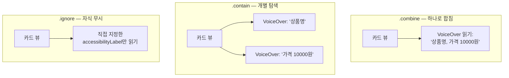
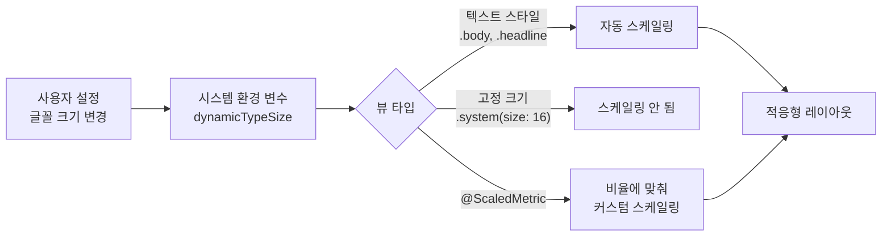
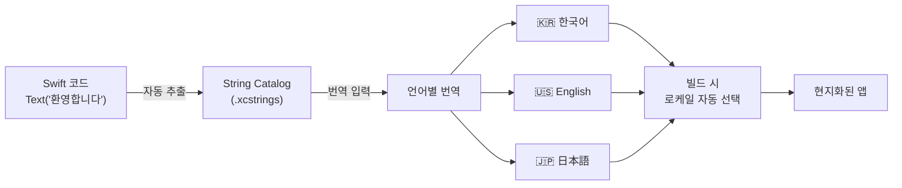
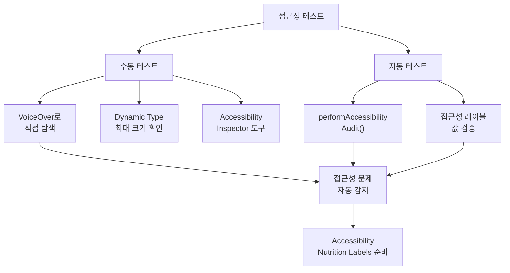

# 접근성과 국제화

> VoiceOver, Dynamic Type, String Catalogs, 현지화

## 개요

여러분의 앱이 시력이 불편한 분, 손 사용이 어려운 분, 다른 나라 사용자 모두에게 동일한 경험을 줄 수 있다면 얼마나 좋을까요? 접근성(Accessibility)과 국제화(Internationalization)는 단순히 "있으면 좋은" 기능이 아니라, **더 많은 사용자에게 다가가는 필수 전략**입니다.

**선수 지식**: [텍스트와 이미지](../03-swiftui-start/02-text-image.md), [레이아웃 시스템](../03-swiftui-start/04-layout.md)
**학습 목표**:
- SwiftUI에서 VoiceOver를 지원하는 접근성 수정자를 사용할 수 있다
- Dynamic Type으로 다양한 글꼴 크기에 대응할 수 있다
- String Catalogs로 앱을 다국어 지원할 수 있다

## 왜 알아야 할까?

전 세계적으로 약 **13억 명**이 중대한 장애를 가지고 있습니다(WHO 통계). 또한 한국어만 지원하는 앱은 전체 스마트폰 사용자의 약 1%만 대상으로 하는 셈이죠. iOS 26부터는 App Store에 **접근성 영양 라벨**(Accessibility Nutrition Labels)이 도입되어, 앱이 어떤 접근성 기능을 지원하는지 사용자가 다운로드 전에 확인할 수 있습니다. 향후에는 이 정보 제공이 필수가 될 예정이에요.

## 핵심 개념

### 개념 1: VoiceOver와 접근성 수정자

> 💡 **비유**: VoiceOver는 시각 장애인을 위한 **오디오 가이드**입니다. 박물관에서 작품 옆 설명을 읽어주듯, 화면의 요소를 하나씩 읽어주죠. 개발자인 여러분은 이 "설명문"을 작성하는 큐레이터 역할입니다.

SwiftUI는 기본적으로 뛰어난 접근성을 제공합니다. `Text`, `Button`, `Image` 같은 기본 뷰는 자동으로 VoiceOver에 대응하죠. 하지만 커스텀 뷰나 복합 요소에는 직접 정보를 제공해야 합니다.

```swift
struct ProductCard: View {
    let product: Product

    var body: some View {
        VStack {
            // 장식용 이미지는 VoiceOver에서 건너뜀
            Image(product.imageName)
                .accessibilityHidden(true)

            Text(product.name)
            Text("₩\(product.price)")
        }
        // 여러 자식 요소를 하나의 접근성 요소로 묶기
        .accessibilityElement(children: .combine)
        // VoiceOver가 읽을 레이블
        .accessibilityLabel("\(product.name), 가격 \(product.price)원")
        // 추가 힌트 (선택 사항)
        .accessibilityHint("두 번 탭하면 상세 정보를 봅니다")
    }
}
```

주요 접근성 수정자:

| 수정자 | 용도 | 예시 |
|--------|------|------|
| `.accessibilityLabel(_:)` | VoiceOver가 읽는 텍스트 | "좋아요 버튼" |
| `.accessibilityHint(_:)` | 동작 설명 (선택적) | "두 번 탭하면 좋아요 표시" |
| `.accessibilityValue(_:)` | 현재 값 | "5개 중 3개 선택됨" |
| `.accessibilityHidden(_:)` | VoiceOver에서 숨김 | 장식용 이미지 |
| `.accessibilityElement(children:)` | 자식 요소 처리 방식 | `.combine`, `.contain`, `.ignore` |
| `.accessibilityIdentifier(_:)` | 테스트 자동화용 ID | UI 테스트에서만 사용 |

> 📊 **그림 1**: accessibilityElement(children:) 옵션별 VoiceOver 동작 비교




```swift
// 커스텀 별점 뷰의 접근성
struct RatingView: View {
    let rating: Int  // 1~5

    var body: some View {
        HStack {
            ForEach(1...5, id: \.self) { star in
                Image(systemName: star <= rating ? "star.fill" : "star")
                    .foregroundStyle(star <= rating ? .yellow : .gray)
            }
        }
        // 개별 별이 아니라, 전체를 하나의 요소로 읽기
        .accessibilityElement(children: .ignore)
        .accessibilityLabel("평점")
        .accessibilityValue("5점 만점에 \(rating)점")
    }
}
```

### 개념 2: Dynamic Type — 글꼴 크기 대응

> 📊 **그림 4**: Dynamic Type 스케일링 흐름 — 시스템 설정에서 뷰 렌더링까지




> 💡 **비유**: Dynamic Type은 **고무밴드 레이아웃**입니다. 글씨를 키워도 줄어도 레이아웃이 자연스럽게 늘어나거나 줄어들죠.

사용자가 설정에서 글꼴 크기를 변경하면, 앱도 함께 반응해야 합니다. SwiftUI의 기본 텍스트 스타일은 자동으로 Dynamic Type을 지원합니다.

```swift
struct AccessibleCardView: View {
    var body: some View {
        VStack(alignment: .leading, spacing: 8) {
            // 시스템 텍스트 스타일 사용 → 자동으로 Dynamic Type 대응
            Text("제목")
                .font(.headline)
            Text("본문 내용이 여기에 들어갑니다")
                .font(.body)
            Text("부가 정보")
                .font(.caption)
        }
    }
}

// 커스텀 크기도 Dynamic Type에 대응하려면 @ScaledMetric 사용
struct IconWithText: View {
    // 기본값 24pt, Dynamic Type에 따라 자동 스케일링
    @ScaledMetric(relativeTo: .body) private var iconSize = 24.0

    var body: some View {
        HStack {
            Image(systemName: "bell.fill")
                .frame(width: iconSize, height: iconSize)
            Text("알림 설정")
        }
    }
}

#Preview {
    IconWithText()
        .environment(\.dynamicTypeSize, .accessibility3)
}
```

> 🔥 **실무 팁**: 고정 크기(`.font(.system(size: 16))`)는 Dynamic Type이 무시됩니다. 가능하면 `.body`, `.headline` 같은 **텍스트 스타일**을 사용하세요. 커스텀 크기가 꼭 필요하면 `@ScaledMetric`으로 감싸세요.

### 개념 3: String Catalogs — 현대적 다국어 지원

> 📊 **그림 2**: String Catalogs 다국어 지원 워크플로우




> 💡 **비유**: String Catalog는 **자동 번역 노트**입니다. 코드에서 문자열을 쓰면 Xcode가 자동으로 번역이 필요한 목록을 만들어주고, 번역본을 언어별로 관리해줍니다.

Xcode 15부터 도입된 String Catalogs(`.xcstrings`)는 기존의 `.strings` 파일을 대체합니다. 코드에서 사용한 문자열을 자동으로 추출하고, 편리한 에디터로 번역을 관리할 수 있죠.

```swift
// SwiftUI에서 문자열은 기본적으로 LocalizedStringKey
struct GreetingView: View {
    let username: String
    let itemCount: Int

    var body: some View {
        VStack {
            // 자동으로 String Catalog에 추출됨
            Text("환영합니다")
            Text("안녕하세요, \(username)님!")

            // 복수형 처리도 String Catalog에서 관리
            Text("\(itemCount)개의 항목")
        }
    }
}
```

String Catalog 에디터에서는 각 언어별 번역을 입력합니다:

| Key | Korean | English | Japanese |
|-----|--------|---------|----------|
| 환영합니다 | 환영합니다 | Welcome | ようこそ |
| 안녕하세요, %@님! | 안녕하세요, %@님! | Hello, %@! | こんにちは、%@さん！ |

Xcode 26에서는 **타입 세이프 심볼**이 추가되었습니다. String Catalog의 키를 Swift 코드에서 자동완성으로 사용할 수 있어요.

```swift
// Xcode 26: Generate String Catalog Symbols 빌드 설정 활성화 시
// String Catalog에 "discoverTitle" 키가 있으면:
Text(.discoverTitle)  // 타입 세이프한 접근!

// 매개변수가 있는 문자열도 컴파일 타임에 검증
Text(.greeting(name: username))  // 안전하게 인자 전달
```

> 💡 **알고 계셨나요?**: Xcode 26에서는 **AI 기반 자동 코멘트 생성** 기능도 추가되었습니다. 설정에서 "Automatically generate string catalog comments"를 켜면, Xcode가 코드 문맥을 분석해 번역가를 위한 설명을 자동으로 작성해줍니다.

### 개념 4: 접근성 테스트

> 📊 **그림 3**: 접근성 테스트 전략 — 수동 + 자동 병행




접근성이 잘 구현되었는지 테스트하는 방법도 중요합니다.

```swift
// UI 테스트에서 접근성 감사(Audit) 실행
final class AccessibilityTests: XCTestCase {
    func testAccessibilityAudit() throws {
        let app = XCUIApplication()
        app.launch()

        // Xcode가 자동으로 접근성 문제를 검사
        try app.performAccessibilityAudit()
    }

    func testVoiceOverLabels() {
        let app = XCUIApplication()
        app.launch()

        // 특정 요소의 접근성 레이블 확인
        let ratingView = app.otherElements["평점"]
        XCTAssertTrue(ratingView.exists)
        XCTAssertEqual(ratingView.value as? String, "5점 만점에 4점")
    }
}
```

## 실습: 직접 해보기

접근성과 다국어를 모두 지원하는 프로필 카드를 만들어봅시다.

```swift
import SwiftUI

struct AccessibleProfileCard: View {
    let name: String
    let role: String
    let rating: Int
    @ScaledMetric(relativeTo: .title) private var avatarSize = 60.0

    var body: some View {
        HStack(spacing: 16) {
            // 프로필 이미지
            Image(systemName: "person.circle.fill")
                .resizable()
                .frame(width: avatarSize, height: avatarSize)
                .foregroundStyle(.blue)
                .accessibilityHidden(true)  // 장식용

            VStack(alignment: .leading, spacing: 4) {
                // 시스템 텍스트 스타일 → Dynamic Type 자동 대응
                Text(name)  // String Catalog에 자동 추출
                    .font(.headline)
                Text(role)
                    .font(.subheadline)
                    .foregroundStyle(.secondary)

                // 별점
                HStack(spacing: 2) {
                    ForEach(1...5, id: \.self) { star in
                        Image(systemName: star <= rating ? "star.fill" : "star")
                            .foregroundStyle(star <= rating ? .yellow : .gray)
                            .font(.caption)
                    }
                }
                .accessibilityElement(children: .ignore)
                .accessibilityLabel("평점")
                .accessibilityValue("5점 만점에 \(rating)점")
            }
        }
        .padding()
        // 전체 카드를 하나의 접근성 요소로
        .accessibilityElement(children: .combine)
        .accessibilityIdentifier("profileCard")
    }
}

#Preview {
    VStack {
        AccessibleProfileCard(name: "김개발", role: "iOS 개발자", rating: 4)
        AccessibleProfileCard(name: "이디자인", role: "UI 디자이너", rating: 5)
    }
}
```

## 더 깊이 알아보기

접근성은 Apple의 DNA에 깊이 새겨져 있습니다. 2009년 iPhone 3GS에 VoiceOver가 탑재되면서, iPhone은 **세계 최초로 완전한 접근성을 갖춘 터치스크린 스마트폰**이 되었죠. Steve Jobs는 "기술은 모든 사람을 위해 존재한다"고 강조했고, Tim Cook 역시 접근성을 Apple의 핵심 가치로 꼽고 있습니다.

iOS 26에서는 **Accessibility Nutrition Labels**이 App Store에 도입되었습니다. VoiceOver, Voice Control, 큰 텍스트, 다크 모드, 자막 등 9가지 접근성 기능에 대해 앱이 어떤 수준으로 지원하는지를 선언하고, 사용자가 다운로드 전에 확인할 수 있어요. 현재는 자발적이지만, Apple은 점진적으로 필수 제공으로 전환할 계획입니다.

## 흔한 오해와 팁

> ⚠️ **흔한 오해**: "접근성은 시각 장애인만을 위한 것이다" — 팔을 다쳐 한 손만 쓸 수 있거나, 밝은 햇빛 아래서 화면이 잘 안 보이는 상황도 접근성의 영역입니다. 높은 대비, 큰 탭 영역, 음성 제어는 **모든 사용자**의 경험을 개선합니다.

> 🔥 **실무 팁**: 접근성 테스트의 가장 쉬운 방법은 VoiceOver를 켜고(Siri에게 "VoiceOver 켜줘") 눈을 감은 채 앱의 핵심 기능을 사용해보는 것입니다. 놀라울 정도로 많은 문제를 발견할 수 있어요.

> 💡 **알고 계셨나요?**: SwiftUI의 `Text`에 직접 문자열을 넣으면 자동으로 `LocalizedStringKey`로 처리됩니다. 별도 설정 없이도 이미 다국어 지원의 기반이 갖춰져 있는 셈이죠!

## 핵심 정리

| 개념 | 설명 |
|------|------|
| accessibilityLabel | VoiceOver가 읽어주는 요소의 이름 |
| accessibilityHint | 요소의 동작을 설명하는 부가 정보 |
| accessibilityElement | 자식 뷰의 접근성 요소 처리 방식 제어 |
| Dynamic Type | 시스템 글꼴 크기 설정에 자동 반응 |
| @ScaledMetric | 커스텀 크기를 Dynamic Type에 맞춰 스케일링 |
| String Catalogs | .xcstrings 기반의 현대적 다국어 관리 시스템 |
| Accessibility Nutrition Labels | App Store에서 앱의 접근성 지원 수준을 표시 |

## 다음 섹션 미리보기

Ch12의 마지막 섹션을 마쳤습니다! 테스트와 품질의 기초를 단단히 다졌으니, 다음 [Ch13. 성능과 최적화](../13-performance/01-concurrency-deep.md)에서는 Swift Concurrency 심화, SwiftUI 렌더링 최적화, 메모리 관리 등 앱을 더 빠르고 안정적으로 만드는 방법을 배웁니다.

## 참고 자료

- [Accessibility - Apple Developer](https://developer.apple.com/accessibility/) - Apple 접근성 공식 페이지
- [Catch up on accessibility in SwiftUI - WWDC24](https://developer.apple.com/videos/play/wwdc2024/10073/) - SwiftUI 접근성 최신 세션
- [Explore localization with Xcode - WWDC25](https://developer.apple.com/videos/play/wwdc2025/225/) - Xcode 26 다국어 기능 코드어롱
- [Localizing and varying text with a string catalog - Apple Documentation](https://developer.apple.com/documentation/xcode/localizing-and-varying-text-with-a-string-catalog) - String Catalog 공식 가이드
- [Evaluate your app for Accessibility Nutrition Labels - WWDC25](https://developer.apple.com/videos/play/wwdc2025/258/) - 접근성 영양 라벨 평가 방법
