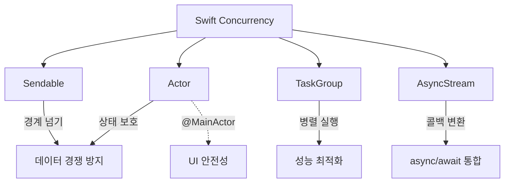
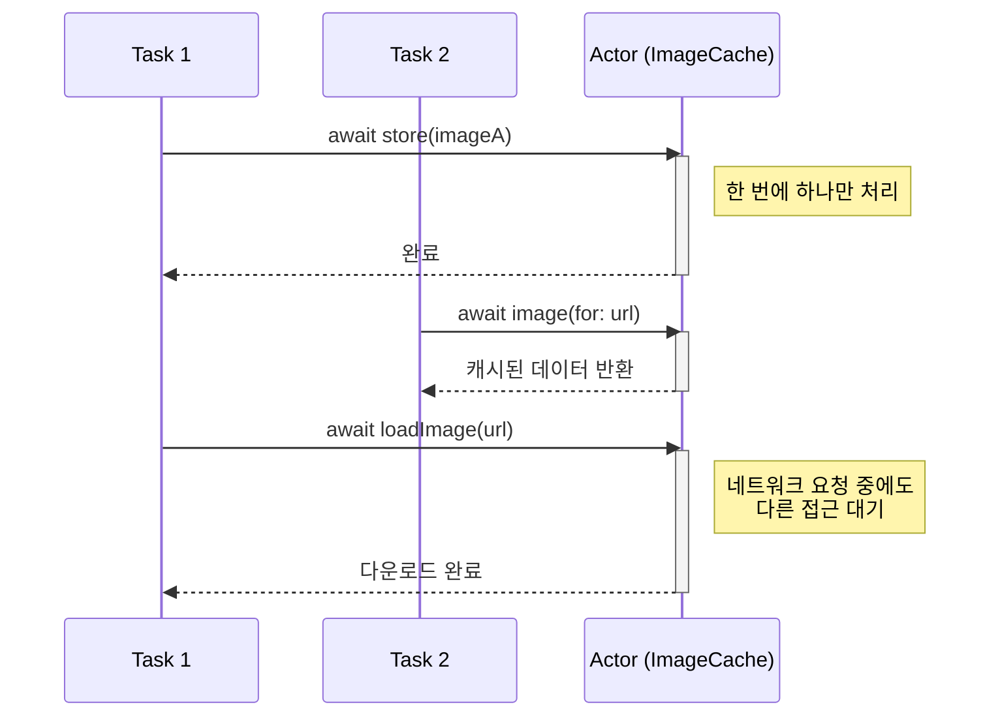
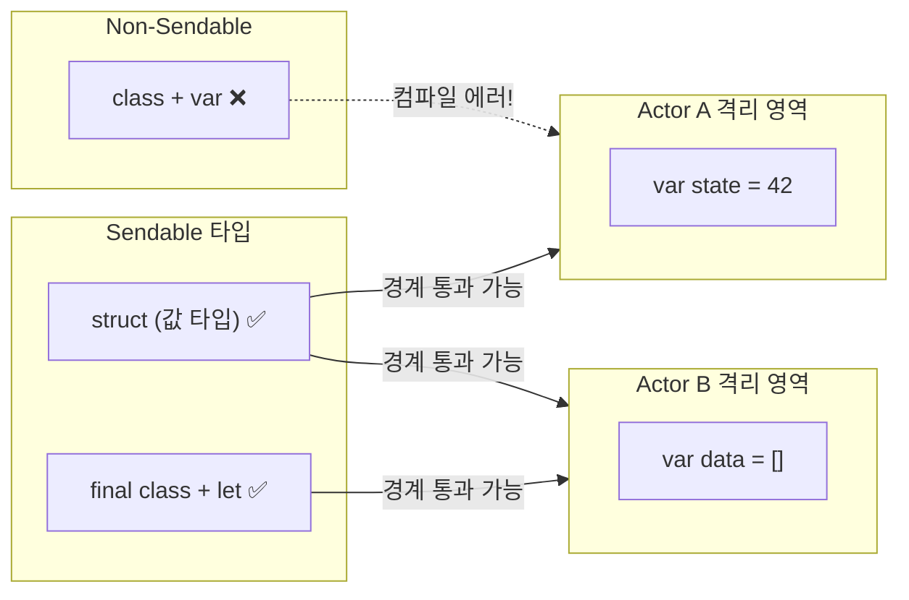
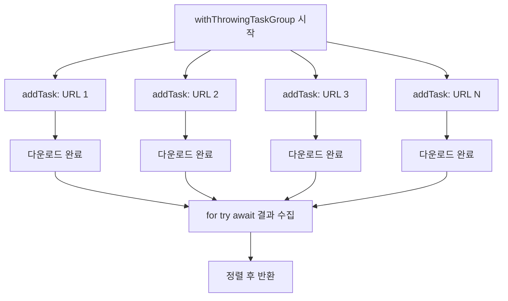
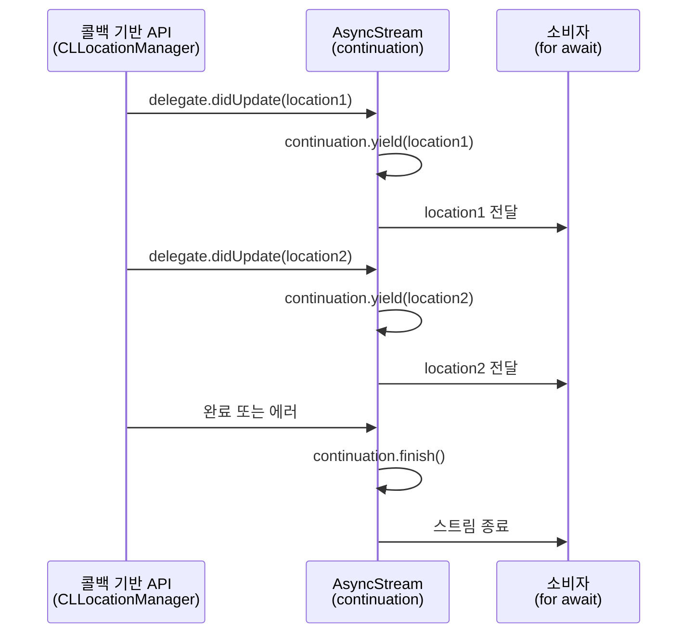

# Swift Concurrency 심화

> Actor, Sendable, TaskGroup, AsyncStream

## 개요

[async/await 기초](../07-networking/01-async-await.md)에서 비동기 프로그래밍의 기본을 배웠죠? 이제 한 단계 더 깊이 들어갑니다. Actor로 데이터 경쟁을 원천 차단하고, TaskGroup으로 병렬 작업을 관리하며, AsyncStream으로 이벤트 스트림을 다루는 고급 동시성 패턴을 익혀봅시다.

**선수 지식**: [async/await 기초](../07-networking/01-async-await.md), [프로토콜과 익스텐션](../02-swift-types/03-protocols-extensions.md)
**학습 목표**:
- Actor를 사용해 공유 상태를 안전하게 보호할 수 있다
- Sendable 프로토콜의 의미를 이해하고 적용할 수 있다
- TaskGroup으로 동적 병렬 작업을 구성할 수 있다
- AsyncStream으로 콜백 기반 API를 변환할 수 있다

## 왜 알아야 할까?

> 📊 **그림 1**: Swift Concurrency 핵심 개념 관계도




앱이 복잡해지면 여러 작업이 동시에 실행됩니다. 네트워크 요청, 데이터베이스 저장, UI 업데이트가 한꺼번에 일어나죠. 이때 같은 데이터를 여러 곳에서 동시에 수정하면 **데이터 경쟁(Data Race)**이 발생합니다. 앱이 예측 불가능하게 동작하거나, 간헐적으로 크래시가 나죠. Swift 6에서는 이런 문제를 **컴파일 타임에** 잡아줍니다. 더 이상 런타임에 크래시 나길 기다릴 필요가 없어요.

## 핵심 개념

### 개념 1: Actor — 데이터의 보디가드

> 💡 **비유**: Actor는 은행 창구의 **번호표 시스템**입니다. 여러 고객이 동시에 오더라도 한 번에 한 명만 처리하죠. 덕분에 잔고가 꼬일 일이 없습니다.

Actor는 자신의 상태에 대한 접근을 자동으로 직렬화합니다. 외부에서 actor의 프로퍼티나 메서드에 접근하려면 반드시 `await`를 써야 하죠.

> 📊 **그림 2**: Actor의 직렬화된 접근 방식




```swift
// 동시 접근으로부터 안전한 캐시
actor ImageCache {
    private var cache: [String: Data] = [:]

    // actor 내부에서는 자유롭게 접근
    func image(for url: String) -> Data? {
        cache[url]
    }

    func store(_ data: Data, for url: String) {
        cache[url] = data
    }

    // 외부 데이터를 가져와 저장하는 메서드
    func loadImage(from url: URL) async throws -> Data {
        let key = url.absoluteString

        // 캐시에 있으면 바로 반환
        if let cached = cache[key] {
            return cached
        }

        // 네트워크에서 다운로드
        let (data, _) = try await URLSession.shared.data(from: url)
        cache[key] = data  // actor 내부이므로 안전
        return data
    }
}

// 사용 시 await 필수
let cache = ImageCache()
let data = try await cache.loadImage(from: imageURL)
```

**@MainActor**는 UI 업데이트를 메인 스레드에서 보장하는 특별한 글로벌 actor입니다.

```swift
@MainActor
@Observable
class ViewModel {
    var items: [String] = []       // 메인 스레드에서만 접근
    var isLoading = false

    func loadItems() async {
        isLoading = true
        let fetched = await fetchFromServer()  // 백그라운드 작업
        items = fetched  // @MainActor이므로 UI 안전
        isLoading = false
    }
}
```

> ⚠️ **흔한 오해**: "Actor는 느리다" — Actor의 직렬화 오버헤드는 매우 작습니다. 락(Lock) 기반 동기화보다 훨씬 가볍고, 컴파일러가 불필요한 hop을 최적화해줍니다.

### 개념 2: Sendable — 격리 경계를 넘는 여권

> 💡 **비유**: Sendable은 **여권**입니다. 국경(격리 경계)을 넘으려면 여권이 있어야 하듯, 데이터가 actor 사이를 이동하려면 Sendable이어야 합니다.

Sendable은 "이 타입은 동시성 환경에서 안전하게 공유할 수 있다"는 것을 컴파일러에 약속하는 프로토콜입니다.

> 📊 **그림 3**: Sendable 격리 경계 개념




```swift
// 값 타입은 자동으로 Sendable (복사되니까 안전!)
struct UserProfile: Sendable {
    let name: String
    let age: Int
}

// 클래스는 조건이 필요: final + 불변 프로퍼티
final class APIConfig: Sendable {
    let baseURL: String    // let이라 안전
    let timeout: TimeInterval

    init(baseURL: String, timeout: TimeInterval) {
        self.baseURL = baseURL
        self.timeout = timeout
    }
}

// 클로저도 @Sendable로 표시
func processInBackground(_ work: @Sendable () async -> String) async {
    let result = await work()
    print(result)
}
```

Swift 6에서는 **Strict Concurrency** 모드가 기본이 되어, Sendable하지 않은 데이터를 격리 경계를 넘겨 보내면 컴파일 에러가 발생합니다.

```swift
// Swift 6에서 컴파일 에러!
class MutableState {  // Sendable을 준수하지 않음
    var count = 0
}

actor Counter {
    func process(_ state: MutableState) {
        // ❌ MutableState는 Sendable이 아니므로
        //    actor 경계를 넘을 수 없음
    }
}
```

### 개념 3: TaskGroup — 동적 병렬 작업

> 💡 **비유**: TaskGroup은 **분업하는 팀**입니다. "이미지 100장 다운로드해!" 같은 작업을 팀원들에게 나눠주고, 모두 끝나면 결과를 모으는 거죠.

`async let`은 작업 수가 정해져 있을 때 쓰고, TaskGroup은 **동적인 수의 작업**을 병렬 실행할 때 사용합니다.

> 📊 **그림 4**: TaskGroup 병렬 실행과 결과 수집 흐름




```swift
// 여러 URL에서 이미지를 동시에 다운로드
func downloadImages(urls: [URL]) async throws -> [Data] {
    try await withThrowingTaskGroup(of: (Int, Data).self) { group in
        // 각 URL마다 자식 태스크 생성
        for (index, url) in urls.enumerated() {
            group.addTask {
                let (data, _) = try await URLSession.shared.data(from: url)
                return (index, data)  // 인덱스로 순서 유지
            }
        }

        // 결과 수집
        var results = [(Int, Data)]()
        for try await result in group {
            results.append(result)
        }

        // 원래 순서대로 정렬
        return results.sorted { $0.0 < $1.0 }.map(\.1)
    }
}
```

동시 실행 수를 제한하려면 아래처럼 합니다.

```swift
// 최대 3개씩 병렬 처리
func downloadWithLimit(urls: [URL]) async throws -> [Data] {
    try await withThrowingTaskGroup(of: Data.self) { group in
        var results = [Data]()
        var iterator = urls.makeIterator()

        // 처음 3개 시작
        for _ in 0..<min(3, urls.count) {
            if let url = iterator.next() {
                group.addTask {
                    let (data, _) = try await URLSession.shared.data(from: url)
                    return data
                }
            }
        }

        // 하나가 끝나면 다음 하나를 시작
        for try await data in group {
            results.append(data)
            if let url = iterator.next() {
                group.addTask {
                    let (data, _) = try await URLSession.shared.data(from: url)
                    return data
                }
            }
        }

        return results
    }
}
```

### 개념 4: AsyncStream — 이벤트의 다리

> 📊 **그림 5**: AsyncStream이 콜백을 async/await으로 변환하는 흐름




> 💡 **비유**: AsyncStream은 콜백의 세계와 async/await의 세계를 연결하는 **다리**입니다. 레거시 API의 콜백을 `for await` 루프로 바꿔주죠.

```swift
import CoreLocation

// CLLocationManager의 콜백을 AsyncStream으로 변환
func locationUpdates() -> AsyncStream<CLLocation> {
    AsyncStream { continuation in
        let delegate = LocationDelegate { location in
            continuation.yield(location)  // 새 위치를 스트림에 전달
        }

        continuation.onTermination = { _ in
            delegate.stopUpdating()  // 정리 작업
        }

        delegate.startUpdating()
    }
}

// 사용: for await로 위치 업데이트 수신
func trackLocation() async {
    for await location in locationUpdates() {
        print("위도: \(location.coordinate.latitude)")
        print("경도: \(location.coordinate.longitude)")
    }
}
```

Swift 5.9부터 추가된 `makeStream`으로 더 간결하게 만들 수 있습니다.

```run:swift
// makeStream으로 continuation을 따로 관리
let (stream, continuation) = AsyncStream.makeStream(of: Int.self)

// 생산자: 값을 보냄
Task {
    for i in 1...5 {
        continuation.yield(i)
        try await Task.sleep(for: .seconds(1))
    }
    continuation.finish()  // 스트림 종료
}

// 소비자: 값을 받음
for await value in stream {
    print("받은 값: \(value)")
}
```

```output
받은 값: 1
받은 값: 2
받은 값: 3
받은 값: 4
받은 값: 5
```

## 실습: 직접 해보기

여러 API를 동시에 호출하고 결과를 합치는 대시보드를 만들어봅시다.

```swift
import SwiftUI

// 대시보드 데이터를 관리하는 actor
actor DashboardService {
    func fetchUserCount() async throws -> Int {
        try await Task.sleep(for: .seconds(1))
        return Int.random(in: 1000...5000)
    }

    func fetchRevenue() async throws -> Double {
        try await Task.sleep(for: .seconds(1.5))
        return Double.random(in: 10000...50000)
    }

    func fetchActiveUsers() async throws -> Int {
        try await Task.sleep(for: .seconds(0.8))
        return Int.random(in: 100...500)
    }
}

@MainActor
@Observable
class DashboardViewModel {
    var userCount = 0
    var revenue = 0.0
    var activeUsers = 0
    var isLoading = false

    private let service = DashboardService()

    func loadAll() async {
        isLoading = true

        // 세 API를 동시에 호출
        async let users = service.fetchUserCount()
        async let rev = service.fetchRevenue()
        async let active = service.fetchActiveUsers()

        // 모든 결과를 기다림
        do {
            let (u, r, a) = try await (users, rev, active)
            userCount = u
            revenue = r
            activeUsers = a
        } catch {
            print("에러: \(error)")
        }

        isLoading = false
    }
}

struct DashboardView: View {
    @State private var viewModel = DashboardViewModel()

    var body: some View {
        NavigationStack {
            List {
                Section("사용자") {
                    LabeledContent("전체 사용자", value: "\(viewModel.userCount)명")
                    LabeledContent("활성 사용자", value: "\(viewModel.activeUsers)명")
                }
                Section("매출") {
                    LabeledContent("총 매출", value: "₩\(Int(viewModel.revenue))")
                }
            }
            .navigationTitle("대시보드")
            .overlay {
                if viewModel.isLoading {
                    ProgressView()
                }
            }
            .task {
                await viewModel.loadAll()
            }
        }
    }
}

#Preview {
    DashboardView()
}
```

## 더 깊이 알아보기

Swift Concurrency는 2020년 Chris Lattner와 Joe Groff가 작성한 **Swift Concurrency Manifesto**에서 출발했습니다. Actor 모델 자체는 1973년 Carl Hewitt가 제안한 개념인데, 50년이 지나서야 Swift에 들어온 셈이죠. Erlang, Akka 같은 언어/프레임워크에서 이미 검증된 모델을 Swift의 타입 시스템에 맞게 재설계한 것이 특징입니다.

Swift 6.2(Xcode 26)에서는 **Approachable Concurrency**라는 이름으로 동시성이 크게 개선되었습니다. `nonisolated(nonsending)` 키워드가 추가되어 async 함수가 기본적으로 호출자의 actor 컨텍스트를 상속합니다. 또한 `@concurrent` 어트리뷰트로 명시적으로 백그라운드 실행을 지정할 수 있게 되었죠. 이전에는 `nonisolated async` 함수가 자동으로 글로벌 executor에서 실행되어 혼란을 주었는데, 이 문제가 해결된 겁니다.

## 흔한 오해와 팁

> ⚠️ **흔한 오해**: "Actor 안에서 `await`를 쓰면 안전하다" — Actor는 `await` 전후로 상태가 바뀔 수 있습니다(재진입, reentrancy). `await` 이후에 이전 상태가 유효하다고 가정하면 안 됩니다. 상태를 다시 확인하세요.

> 🔥 **실무 팁**: 모든 클래스를 Sendable로 만들 필요는 없습니다. `@unchecked Sendable`은 "내가 안전성을 보장할게"라는 뜻인데, 남발하면 Strict Concurrency의 의미가 없어집니다. 정말 필요한 경우에만 쓰세요.

> 💡 **알고 계셨나요?**: Swift 6.2에서는 패키지 레벨로 `DefaultIsolation(MainActor.self)` 설정이 가능해져서, UI 앱의 모든 코드를 기본적으로 @MainActor로 만들 수 있습니다. UI 중심 앱에서는 이 설정이 동시성 에러를 대폭 줄여줍니다.

## 핵심 정리

| 개념 | 설명 |
|------|------|
| Actor | 공유 상태에 대한 접근을 자동으로 직렬화하는 참조 타입 |
| @MainActor | UI 업데이트를 메인 스레드에서 보장하는 글로벌 actor |
| Sendable | 격리 경계를 안전하게 넘을 수 있음을 보증하는 프로토콜 |
| TaskGroup | 동적인 수의 자식 태스크를 병렬 실행하고 결과를 수집 |
| AsyncStream | 콜백/델리게이트 기반 API를 async/await으로 변환 |
| nonisolated | actor 격리에서 제외되는 메서드/프로퍼티 선언 |
| sending | 격리 경계를 넘는 파라미터/반환값 표시 (SE-0430) |

## 다음 섹션 미리보기

동시성으로 백그라운드 작업을 안전하게 만들었으니, 다음은 화면 자체의 성능입니다. [SwiftUI 렌더링 최적화](./02-swiftui-optimization.md)에서 불필요한 뷰 업데이트를 줄이고 60fps를 유지하는 방법을 배워봅시다.

## 참고 자료

- [Swift Concurrency - Apple Developer](https://developer.apple.com/documentation/swift/concurrency) - 공식 동시성 가이드
- [Migrate your app to Swift 6 - WWDC24](https://developer.apple.com/videos/play/wwdc2024/10169/) - Swift 6 마이그레이션 세션
- [Approachable Concurrency in Swift 6.2 - Antoine van der Lee](https://www.avanderlee.com/concurrency/approachable-concurrency-in-swift-6-2-a-clear-guide/) - Swift 6.2 동시성 변경 가이드
- [Actor Reentrancy - Swift Senpai](https://swiftsenpai.com/swift/actor-reentrancy-problem/) - Actor 재진입 문제 심층 분석
- [SE-0306: Actors](https://github.com/apple/swift-evolution/blob/main/proposals/0306-actors.md) - Actor 프로포절
