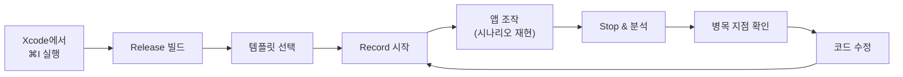
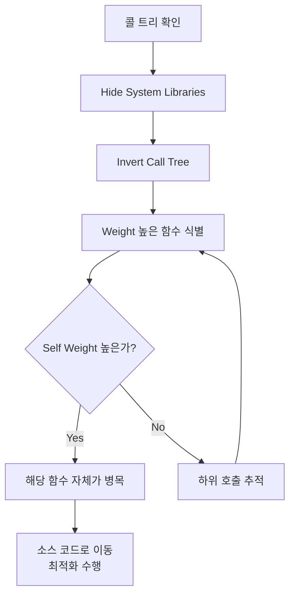
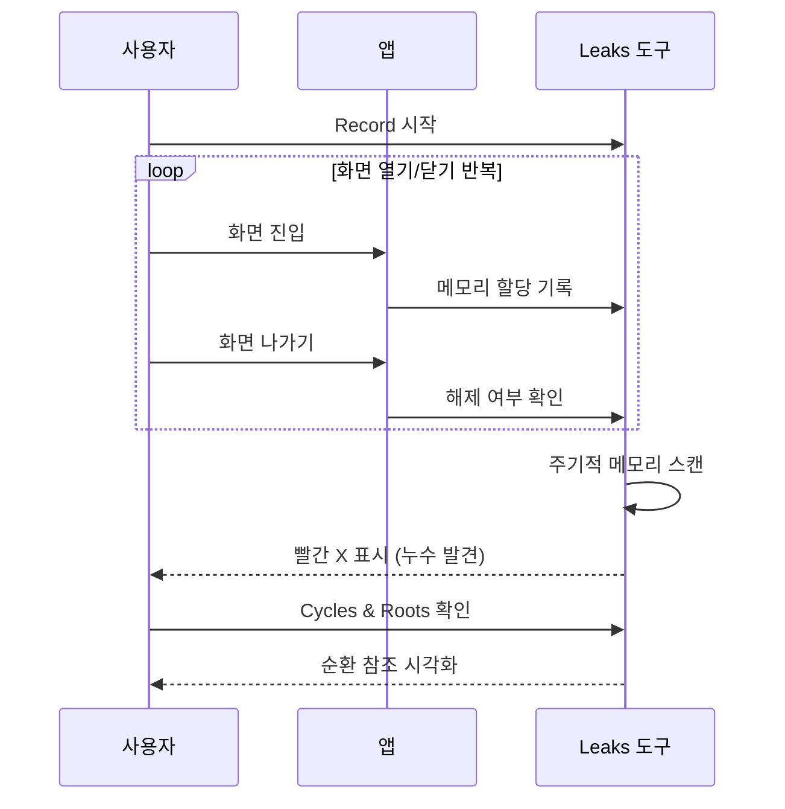
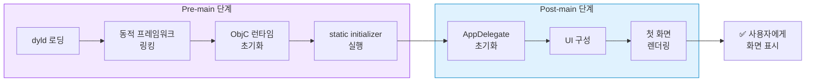

# Instruments 프로파일링

> Time Profiler, Allocations, Leaks, 앱 시작 시간 분석

## 개요

코드를 보면서 "여기가 느릴 것 같은데..."라고 **추측**하는 건 위험합니다. 실제 병목은 예상과 전혀 다른 곳에 있는 경우가 많거든요. Instruments는 앱의 성능을 **측정**해서 정확한 병목 지점을 알려주는 Xcode의 프로파일링 도구입니다.

**선수 지식**: [SwiftUI 렌더링 최적화](./02-swiftui-optimization.md), [메모리 관리와 ARC](./03-memory-arc.md)
**학습 목표**:
- Time Profiler로 CPU 병목 지점을 찾을 수 있다
- Allocations로 메모리 사용 패턴을 분석할 수 있다
- Leaks로 메모리 누수를 탐지할 수 있다
- 앱 시작 시간을 측정하고 최적화할 수 있다

## 왜 알아야 할까?

Donald Knuth의 유명한 격언이 있죠: **"섣부른 최적화는 모든 악의 근원이다."** 하지만 뒤집어 말하면, **"측정에 기반한 최적화는 좋은 엔지니어링이다"**입니다. Instruments를 쓰면 "느린 것 같아요"를 "이 함수가 전체 CPU 시간의 40%를 차지합니다"로 바꿀 수 있습니다. App Store 심사에서도 앱 시작 시간이 너무 길면 리젝될 수 있어서, 프로파일링은 실무 필수 스킬입니다.

## 핵심 개념

### 개념 1: Instruments 시작하기

> 💡 **비유**: Instruments는 앱의 **건강 검진 센터**입니다. CT, MRI, 혈액 검사처럼 다양한 검사 도구(템플릿)로 앱의 상태를 정밀하게 진단하죠.

**Instruments 실행 방법:**

1. Xcode에서 **Product → Profile** (또는 **⌘I**)
2. 빌드가 완료되면 Instruments 템플릿 선택 화면이 나타남
3. 목적에 맞는 템플릿 선택 후 **Record** 버튼 클릭

> 📊 **그림 1**: Instruments 프로파일링 기본 워크플로우




주요 템플릿:

| 템플릿 | 용도 | 핵심 지표 |
|--------|------|----------|
| **Time Profiler** | CPU 사용 분석 | 함수별 실행 시간 |
| **Allocations** | 메모리 할당 추적 | 힙 크기, 할당 횟수 |
| **Leaks** | 메모리 누수 탐지 | 누수된 객체 목록 |
| **Network** | HTTP 트래픽 분석 | 요청/응답 시간, 크기 |
| **SwiftUI** | 뷰 body 호출 추적 | body 호출 횟수 |
| **App Launch** | 앱 시작 시간 분석 | pre-main, post-main 시간 |

> 🔥 **실무 팁**: 프로파일링은 반드시 **Release 빌드** + **실제 디바이스**에서 하세요. Debug 빌드는 최적화가 꺼져 있고, 시뮬레이터는 Mac의 CPU/메모리를 사용하므로 실제 성능과 크게 다릅니다.

### 개념 2: Time Profiler — CPU 병목 찾기

> 💡 **비유**: Time Profiler는 앱의 **CCTV**입니다. 주기적으로(1ms마다) 스냅샷을 찍어서 "어떤 함수가 CPU를 가장 많이 쓰고 있는지" 알려줍니다.

Time Profiler를 실행하면 **콜 트리(Call Tree)**가 나타납니다.

**콜 트리 읽는 법:**

- **Weight**: 해당 함수가 CPU에서 차지한 시간 비율
- **Self Weight**: 하위 함수 호출을 제외한 순수 실행 시간
- **Symbol Name**: 함수 이름

**유용한 필터 옵션:**

- **Hide System Libraries**: 시스템 코드를 숨기고 내 코드만 표시
- **Invert Call Tree**: 가장 시간이 많이 걸린 함수를 위로 정렬
- **Separate by Thread**: 스레드별로 분리해서 메인 스레드 부하 확인

> 📊 **그림 2**: Time Profiler 콜 트리 분석 흐름




```swift
// Time Profiler로 발견할 수 있는 병목 예시
struct ProductListView: View {
    let products: [Product]

    var body: some View {
        // ❌ body 안에서 무거운 정렬 연산
        // Time Profiler에서 이 함수가 높은 Weight를 차지
        let sorted = products.sorted { $0.name < $1.name }

        List(sorted) { product in
            Text(product.name)
        }
    }
}

// ✅ 정렬을 캐싱하여 최적화
struct ProductListView: View {
    let products: [Product]

    // 한 번만 계산
    private var sortedProducts: [Product] {
        products.sorted { $0.name < $1.name }
    }

    var body: some View {
        List(sortedProducts) { product in
            Text(product.name)
        }
    }
}
```

### 개념 3: Allocations — 메모리 사용 분석

**Allocations**는 앱이 메모리를 얼마나, 어디서 할당하는지 보여줍니다.

**핵심 지표:**

- **All Heap Allocations**: 총 힙 메모리 할당량
- **Persistent**: 현재 살아있는 할당 (계속 증가하면 문제!)
- **Transient**: 생성 후 해제된 할당 (정상적인 패턴)

**메모리 증가 패턴 분석:**

- 화면을 열고 닫을 때마다 **Persistent**가 증가하면 → 누수 의심
- **Generation** 기능으로 특정 시점 사이의 할당만 확인 가능

```swift
// Allocations에서 발견할 수 있는 문제
class ImageProcessor {
    // ❌ 처리된 이미지를 계속 캐시에 쌓음
    private var processedImages: [String: UIImage] = [:]

    func process(name: String) -> UIImage {
        if let cached = processedImages[name] {
            return cached
        }
        let image = heavyProcessing(name)
        processedImages[name] = image  // 무한히 쌓임!
        return image
    }
}

// ✅ NSCache로 시스템이 메모리 압박 시 자동 정리
class ImageProcessor {
    private let cache = NSCache<NSString, UIImage>()

    init() {
        cache.countLimit = 50  // 최대 50개
        cache.totalCostLimit = 50 * 1024 * 1024  // 최대 50MB
    }

    func process(name: String) -> UIImage {
        if let cached = cache.object(forKey: name as NSString) {
            return cached
        }
        let image = heavyProcessing(name)
        cache.setObject(image, forKey: name as NSString)
        return image
    }
}
```

### 개념 4: Leaks — 메모리 누수 탐지

**Leaks** 템플릿은 주기적으로 메모리를 스캔해서 접근 불가능한(leak된) 객체를 찾아냅니다.

**누수 발견 시 워크플로우:**

1. Leaks 템플릿으로 Record 시작
2. 앱에서 의심되는 화면을 열고 닫기를 반복
3. 타임라인에 빨간 X 표시가 나타나면 누수 발견
4. 하단의 **Cycles & Roots**를 클릭하면 순환 참조 시각화

> 📊 **그림 3**: Leaks 탐지 워크플로우



5. 화살표를 따라가면 어떤 객체가 서로를 잡고 있는지 확인

> 💡 **알고 계셨나요?**: Xcode의 **Debug Navigator** (⌘6)에서 실시간 메모리 사용량을 모니터링할 수도 있습니다. 앱을 사용하면서 메모리가 계속 오르기만 하면 누수 신호예요.

### 개념 5: 앱 시작 시간 최적화

Apple은 WWDC 2019에서 앱의 첫 프레임을 **400ms 이내**에 렌더링할 것을 권장했습니다.

앱 시작 시간은 두 단계로 나뉩니다:

> 📊 **그림 4**: 앱 시작 시간의 두 단계




| 단계 | 내용 | 최적화 방법 |
|------|------|------------|
| **Pre-main** | dyld 로딩, 프레임워크 링킹 | 동적 프레임워크 수 줄이기, 정적 링킹 사용 |
| **Post-main** | AppDelegate/SceneDelegate 실행, 첫 화면 렌더링 | 초기화 지연, 무거운 작업 백그라운드로 |

```swift
// ❌ 앱 시작 시 모든 것을 한꺼번에 초기화
@main
struct MyApp: App {
    init() {
        setupAnalytics()     // 300ms
        loadUserDefaults()   // 100ms
        prefetchData()       // 500ms — 너무 느림!
    }

    var body: some Scene {
        WindowGroup { ContentView() }
    }
}

// ✅ 필수 초기화만 동기로, 나머지는 비동기
@main
struct MyApp: App {
    init() {
        // 앱 시작에 반드시 필요한 것만
        loadUserDefaults()
    }

    var body: some Scene {
        WindowGroup {
            ContentView()
                .task {
                    // 화면이 뜬 후 백그라운드에서 나머지 초기화
                    await setupAnalytics()
                    await prefetchData()
                }
        }
    }
}
```

### 개념 6: OSSignposter — 커스텀 성능 측정

Instruments의 기본 도구 외에, 코드에 직접 측정 포인트를 삽입할 수 있습니다.

```swift
import os

struct PerformanceTracker {
    private static let signposter = OSSignposter(
        subsystem: "com.myapp",
        category: "Performance"
    )

    // 특정 작업의 소요 시간 측정
    static func measure<T>(
        _ name: StaticString,
        _ work: () async throws -> T
    ) async rethrows -> T {
        let state = signposter.beginInterval(name)
        defer { signposter.endInterval(name, state) }
        return try await work()
    }
}

// 사용 예시
let images = await PerformanceTracker.measure("이미지 다운로드") {
    try await downloadImages(urls: imageURLs)
}
// Instruments의 os_signpost에서 "이미지 다운로드" 구간이 표시됨
```

## 실습: 직접 해보기

Instruments를 사용하지 않고도 코드 레벨에서 성능을 측정하는 유틸리티를 만들어봅시다.

```swift
import SwiftUI
import os

// 간단한 성능 측정 유틸리티
struct Benchmark {
    // 동기 작업 측정
    @discardableResult
    static func measure(_ label: String, _ block: () -> some Any) -> Duration {
        let clock = ContinuousClock()
        let result = clock.measure {
            _ = block()
        }
        print("⏱ \(label): \(result)")
        return result
    }
}

// 성능 비교 데모 뷰
struct BenchmarkView: View {
    @State private var results: [String] = []

    var body: some View {
        NavigationStack {
            List(results, id: \.self) { result in
                Text(result)
                    .font(.system(.body, design: .monospaced))
            }
            .navigationTitle("성능 벤치마크")
            .toolbar {
                Button("실행") { runBenchmarks() }
            }
        }
    }

    func runBenchmarks() {
        results = []
        let numbers = (1...10000).map { _ in Int.random(in: 1...100000) }

        // 정렬 알고리즘 비교
        let sortTime = Benchmark.measure("Array.sorted()") {
            numbers.sorted()
        }
        results.append("sorted(): \(sortTime)")

        // 필터 성능
        let filterTime = Benchmark.measure("filter") {
            numbers.filter { $0 > 50000 }
        }
        results.append("filter: \(filterTime)")

        // Dictionary 조회 vs Array 검색
        let dict = Dictionary(uniqueKeysWithValues: numbers.enumerated().map { ($0.element, $0.offset) })
        let target = numbers[5000]

        let dictTime = Benchmark.measure("Dictionary 조회") {
            dict[target]
        }
        results.append("Dict 조회: \(dictTime)")

        let arrayTime = Benchmark.measure("Array 검색") {
            numbers.firstIndex(of: target)
        }
        results.append("Array 검색: \(arrayTime)")
    }
}

#Preview {
    BenchmarkView()
}
```

## 더 깊이 알아보기

Instruments는 2007년 Xcode 3와 함께 등장했습니다. 원래 **DTrace**라는 Sun Microsystems의 커널 추적 기술을 기반으로 만들어졌는데, Apple이 이를 macOS에 포팅하고 GUI를 씌운 것이 Instruments의 시작이죠. 2018년 WWDC에서 Instruments가 완전히 재설계되었고, 그때부터 사용성이 크게 개선되었습니다.

WWDC 2023에서는 **"Analyze hangs with Instruments"** 세션이 공개되어, 메인 스레드 행(hang) 감지 기능이 강화되었습니다. iOS 16부터는 Xcode Organizer에서 실제 사용자 디바이스의 행 리포트를 받아볼 수 있게 되었고, WWDC 2025에서는 **"Optimize CPU performance with Instruments"** 세션에서 새로운 Flame Graph 시각화가 소개되었습니다.

프로덕션 환경에서는 **MetricKit**을 활용할 수 있습니다. MetricKit은 실제 사용자 디바이스에서 성능 지표(앱 시작 시간, 행 발생 횟수, 메모리 사용량 등)를 수집해 앱에 전달해줍니다. iOS 15부터는 크래시 리포트도 즉시 수신할 수 있어요.

## 흔한 오해와 팁

> ⚠️ **흔한 오해**: "시뮬레이터에서 프로파일링해도 된다" — 시뮬레이터는 Mac의 x86/ARM CPU와 수 GB의 메모리를 사용합니다. 실제 iPhone의 성능과 완전히 다릅니다. 메모리 누수 정도는 시뮬레이터에서 확인할 수 있지만, CPU/GPU 성능 분석은 반드시 실제 디바이스에서 하세요.

> 🔥 **실무 팁**: 최적화는 **측정 → 분석 → 수정 → 재측정** 순서로 진행하세요. 감으로 최적화하면 오히려 코드만 복잡해지고 성능은 그대로일 수 있습니다.

> 💡 **알고 계셨나요?**: Apple은 App Store 심사 시 앱 시작 시간이 너무 길면 리젝합니다. 특히 **워치독(Watchdog) 타이머**는 앱이 20초 이내에 첫 화면을 띄우지 못하면 강제 종료합니다. 이 기준은 디바이스 모델에 따라 다르지만, 400ms 이내를 목표로 하는 것이 안전합니다.

## 핵심 정리

| 개념 | 설명 |
|------|------|
| Time Profiler | CPU 사용 시간을 함수별로 분석하는 도구 |
| Allocations | 메모리 할당/해제 패턴을 추적하는 도구 |
| Leaks | 접근 불가능한 메모리(누수)를 탐지하는 도구 |
| App Launch | 앱 시작 시간(pre-main + post-main)을 분석 |
| OSSignposter | 코드에 커스텀 성능 측정 구간을 삽입하는 API |
| MetricKit | 프로덕션 환경에서 성능 지표를 수집하는 프레임워크 |
| Call Tree | 함수 호출 관계와 각 함수의 실행 시간을 트리로 표시 |

## 다음 섹션 미리보기

Ch13. 성능과 최적화를 모두 마쳤습니다! 동시성, 렌더링, 메모리, 프로파일링까지 앱 성능의 모든 측면을 다뤘죠. 다음 [Ch14. 앱스토어 출시](../14-appstore/01-app-icon-assets.md)에서는 완성된 앱을 세상에 내놓는 방법을 배웁니다.

## 참고 자료

- [Instruments - Apple Developer](https://developer.apple.com/instruments/) - 공식 Instruments 페이지
- [Reducing your app's launch time - Apple Developer](https://developer.apple.com/documentation/xcode/reducing-your-app-s-launch-time) - 앱 시작 시간 최적화 가이드
- [Analyze hangs with Instruments - WWDC23](https://developer.apple.com/videos/play/wwdc2023/10248/) - 행 분석 세션
- [Monitoring app performance with MetricKit - Swift with Majid](https://swiftwithmajid.com/2025/12/09/monitoring-app-performance-with-metrickit/) - MetricKit 실전 가이드
- [Optimize CPU performance with Instruments - WWDC25](https://developer.apple.com/videos/play/wwdc2025/308/) - 최신 CPU 프로파일링
