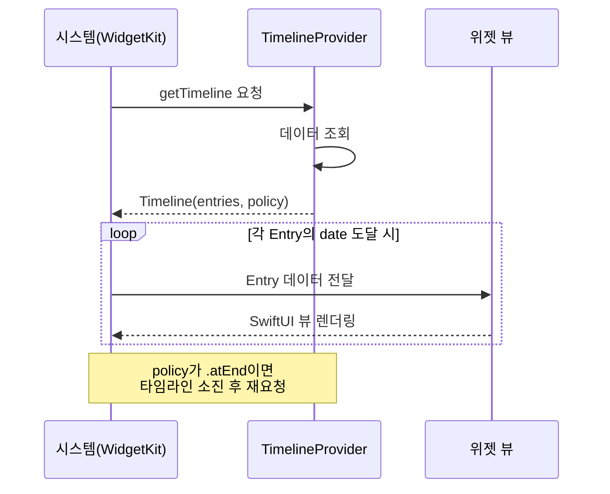
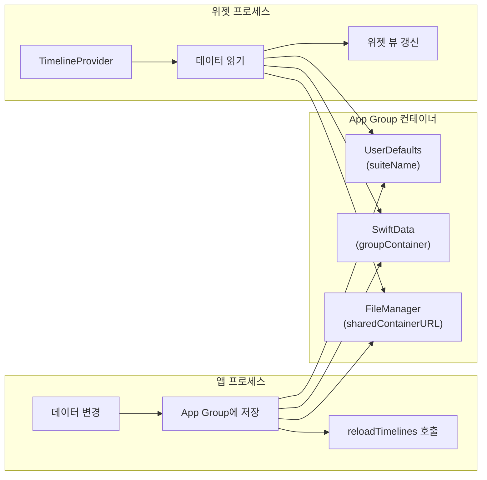
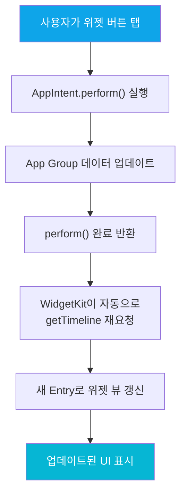
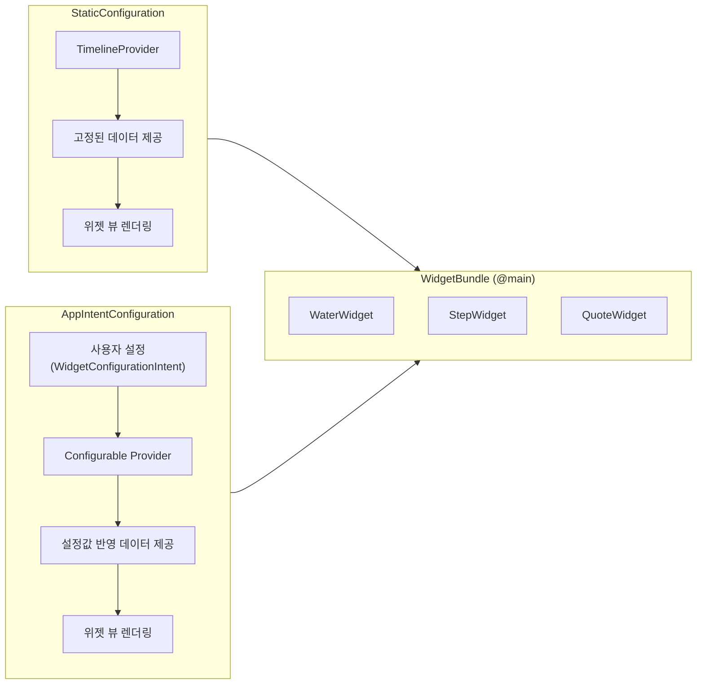

# WidgetKit

> 홈 화면 위젯, Timeline Provider, 인터랙티브 위젯

## 개요

홈 화면에 앱의 핵심 정보를 한눈에 보여주는 **위젯**을 만들어봅시다. WidgetKit은 SwiftUI 기반으로 위젯을 구축하는 프레임워크로, 타임라인 개념을 활용해 적절한 시점에 콘텐츠를 업데이트합니다. iOS 17부터는 위젯 안에서 버튼을 탭할 수도 있어요!

**선수 지식**: [출시 후 운영](../14-appstore/05-post-launch.md)
**학습 목표**:
- WidgetKit의 타임라인 기반 아키텍처를 이해할 수 있다
- 다양한 위젯 패밀리(크기)에 맞는 뷰를 구성할 수 있다
- 인터랙티브 위젯으로 앱과 상호작용할 수 있다

## 왜 알아야 할까?

사용자는 하루에도 수십 번 홈 화면을 봅니다. 그때마다 앱의 핵심 정보가 눈에 들어온다면? 앱을 열지 않아도 오늘의 날씨, 일정, 운동 기록을 확인할 수 있죠. 위젯은 앱의 **쇼윈도**입니다. 잘 만든 위젯 하나가 앱의 일일 활성 사용자를 크게 늘릴 수 있어요. iOS 17부터 인터랙티브 위젯이 가능해지면서, 위젯은 단순 정보 표시를 넘어 **미니 앱**으로 진화했습니다.

## 핵심 개념

### 개념 1: WidgetKit 아키텍처 — 타임라인의 마법

> 💡 **비유**: 위젯은 **전광판**입니다. 실시간으로 화면을 바꾸는 게 아니라, 미리 준비된 슬라이드를 정해진 시간에 보여주는 거죠. 시스템이 "다음 슬라이드 주세요"라고 요청하면, 앱이 앞으로 보여줄 슬라이드 묶음(타임라인)을 전달합니다.

> 📊 **그림 1**: WidgetKit 타임라인 기반 업데이트 흐름




WidgetKit은 세 가지 핵심 요소로 구성됩니다.

| 요소 | 역할 |
|------|------|
| **TimelineEntry** | 특정 시점에 표시할 데이터 (날짜 + 사용자 데이터) |
| **TimelineProvider** | 시스템에게 타임라인 항목 배열을 제공하는 객체 |
| **Widget** | 위젯의 설정과 뷰를 정의하는 프로토콜 |

```swift
import WidgetKit
import SwiftUI

// 1. TimelineEntry: 위젯이 특정 시점에 표시할 데이터
struct WaterEntry: TimelineEntry {
    let date: Date       // 필수: 이 항목이 표시될 시점
    let cups: Int        // 사용자 정의: 오늘 마신 물 잔 수
    let goal: Int        // 사용자 정의: 목표 잔 수
}

// 2. TimelineProvider: 시스템에게 데이터를 제공합니다
struct WaterProvider: TimelineProvider {
    // placeholder: 위젯 로딩 중 표시할 샘플 (즉시 반환해야 함)
    func placeholder(in context: Context) -> WaterEntry {
        WaterEntry(date: Date(), cups: 3, goal: 8)
    }

    // getSnapshot: 위젯 갤러리에서 미리보기로 표시
    func getSnapshot(in context: Context, completion: @escaping (WaterEntry) -> ()) {
        let entry = WaterEntry(date: Date(), cups: 5, goal: 8)
        completion(entry)
    }

    // getTimeline: 실제 위젯에 표시할 타임라인
    func getTimeline(in context: Context, completion: @escaping (Timeline<WaterEntry>) -> ()) {
        // App Group을 통해 공유 데이터를 읽어옵니다
        let defaults = UserDefaults(suiteName: "group.com.example.water")
        let cups = defaults?.integer(forKey: "todayCups") ?? 0

        let entry = WaterEntry(date: Date(), cups: cups, goal: 8)
        // .atEnd: 타임라인이 끝나면 시스템이 새 데이터를 요청합니다
        let timeline = Timeline(entries: [entry], policy: .atEnd)
        completion(timeline)
    }
}

// 3. Widget: 위젯의 설정을 정의합니다
struct WaterWidget: Widget {
    let kind: String = "WaterWidget" // 위젯 고유 식별자

    var body: some WidgetConfiguration {
        StaticConfiguration(kind: kind, provider: WaterProvider()) { entry in
            WaterWidgetView(entry: entry)
                .containerBackground(.fill.tertiary, for: .widget)
        }
        .configurationDisplayName("물 마시기")
        .description("오늘 마신 물 잔 수를 표시합니다")
        .supportedFamilies([.systemSmall, .systemMedium])
    }
}
```

### 개념 2: 위젯 패밀리 — 다양한 크기 지원

> 💡 **비유**: 위젯 패밀리는 **사진 인화 사이즈**와 같습니다. 같은 사진이라도 여권 사이즈와 A4 사이즈에서 보여줄 수 있는 정보의 양이 다르죠.

| 패밀리 | 플랫폼 | 용도 |
|--------|--------|------|
| `.systemSmall` | iOS, iPadOS, macOS | 소형 정사각형 (핵심 수치 1개) |
| `.systemMedium` | iOS, iPadOS, macOS | 중형 가로 (리스트 or 수치 + 차트) |
| `.systemLarge` | iOS, iPadOS, macOS | 대형 정사각형 (상세 정보) |
| `.systemExtraLarge` | iPadOS, macOS | 초대형 (iPad/Mac 전용) |
| `.accessoryCircular` | iOS 16+, watchOS | 잠금화면/워치 원형 위젯 |
| `.accessoryRectangular` | iOS 16+, watchOS | 잠금화면/워치 직사각형 위젯 |
| `.accessoryInline` | iOS 16+, watchOS | 시계 위 한 줄 텍스트 |

```swift
struct WaterWidgetView: View {
    // 현재 위젯 패밀리를 감지합니다
    @Environment(\.widgetFamily) var family
    let entry: WaterEntry

    var body: some View {
        switch family {
        case .systemSmall:
            // 소형: 핵심 수치만 크게 표시
            VStack(spacing: 8) {
                Image(systemName: "drop.fill")
                    .font(.title)
                    .foregroundStyle(.cyan)
                Text("\(entry.cups)/\(entry.goal)")
                    .font(.system(.title, design: .rounded, weight: .bold))
                Text("잔")
                    .font(.caption)
                    .foregroundStyle(.secondary)
            }

        case .systemMedium:
            // 중형: 아이콘 + 수치 + 진행률
            HStack(spacing: 16) {
                VStack(alignment: .leading) {
                    Label("물 마시기", systemImage: "drop.fill")
                        .font(.headline)
                        .foregroundStyle(.cyan)
                    Text("\(entry.cups)잔 / 목표 \(entry.goal)잔")
                        .font(.subheadline)
                        .foregroundStyle(.secondary)
                }
                Spacer()
                // 원형 진행률 게이지
                Gauge(value: Double(entry.cups), in: 0...Double(entry.goal)) {
                    Text("\(entry.cups)")
                }
                .gaugeStyle(.accessoryCircularCapacity)
                .tint(.cyan)
            }
            .padding()

        case .accessoryCircular:
            // 잠금화면 원형 위젯
            Gauge(value: Double(entry.cups), in: 0...Double(entry.goal)) {
                Image(systemName: "drop.fill")
            }
            .gaugeStyle(.accessoryCircularCapacity)

        default:
            Text("\(entry.cups)/\(entry.goal)")
        }
    }
}
```

### 개념 3: 앱과 위젯 간 데이터 공유 — App Groups

위젯은 **별도의 프로세스**에서 실행됩니다. 앱과 위젯이 데이터를 공유하려면 **App Groups**를 설정해야 해요.

> 📊 **그림 2**: App Groups를 통한 앱-위젯 데이터 공유 구조




| 방법 | 장점 | 용도 |
|------|------|------|
| **UserDefaults (suiteName)** | 간단, 가벼운 데이터에 적합 | 설정값, 카운터, 플래그 |
| **SwiftData (groupContainer)** | 구조화된 데이터, 관계 지원 | 복잡한 모델 데이터 |
| **FileManager (sharedContainerURL)** | 파일 단위 공유 | 이미지, 큰 데이터 |

```swift
// 앱에서 데이터 저장 후 위젯에 알리기
import WidgetKit

func drinkWater() {
    // 1. App Group UserDefaults에 데이터 저장
    let defaults = UserDefaults(suiteName: "group.com.example.water")!
    let current = defaults.integer(forKey: "todayCups")
    defaults.set(current + 1, forKey: "todayCups")

    // 2. 위젯 타임라인 새로고침 요청
    WidgetCenter.shared.reloadTimelines(ofKind: "WaterWidget")
}
```

> 🔥 **실무 팁**: `WidgetCenter.shared.reloadTimelines(ofKind:)`를 너무 자주 호출하면 시스템이 요청을 무시할 수 있습니다. Production 환경에서 위젯은 하루에 약 40~70회까지 새로고침이 가능해요. 카운트다운이 필요하면 `Text(date, style: .timer)`를 사용하세요 — 시스템이 타임라인 소비 없이 실시간으로 업데이트해줍니다.

### 개념 4: 인터랙티브 위젯 — 탭으로 동작 실행 (iOS 17+)

> 💡 **비유**: 기존 위젯이 **읽기 전용 게시판**이었다면, 인터랙티브 위젯은 **터치스크린 키오스크**입니다. 직접 버튼을 눌러 주문(액션)을 실행할 수 있죠.

인터랙티브 위젯은 `Button`과 `Toggle`만 지원하며, 반드시 `AppIntent`를 사용해야 합니다.

> 📊 **그림 3**: 인터랙티브 위젯의 동작 흐름 (iOS 17+)




```swift
import AppIntents
import WidgetKit

// 위젯에서 실행할 인텐트 정의
struct DrinkWaterIntent: AppIntent {
    static var title: LocalizedStringResource = "물 한 잔 마시기"
    static var description = IntentDescription("물 잔 수를 1 증가시킵니다")

    func perform() async throws -> some IntentResult {
        // App Group을 통해 공유 데이터 업데이트
        let defaults = UserDefaults(suiteName: "group.com.example.water")!
        var cups = defaults.integer(forKey: "todayCups")
        cups += 1
        defaults.set(cups, forKey: "todayCups")
        return .result()
        // perform() 완료 후 WidgetKit이 자동으로 타임라인을 새로 요청합니다
    }
}

// 인터랙티브 위젯 뷰
struct InteractiveWaterView: View {
    let entry: WaterEntry

    var body: some View {
        VStack(spacing: 12) {
            Text("물 마시기")
                .font(.headline)
            Text("\(entry.cups)잔")
                .font(.system(.largeTitle, design: .rounded, weight: .bold))
                .foregroundStyle(.cyan)

            // 위젯 내에서 직접 탭 가능한 버튼!
            Button(intent: DrinkWaterIntent()) {
                Label("한 잔 추가", systemImage: "plus.circle.fill")
                    .font(.caption)
            }
            .buttonStyle(.borderedProminent)
            .tint(.cyan)
        }
        .containerBackground(.fill.tertiary, for: .widget)
    }
}
```

### 개념 5: 위젯 번들과 설정 가능한 위젯

> 📊 **그림 4**: StaticConfiguration vs AppIntentConfiguration 비교




여러 위젯을 하나의 익스텐션에서 제공하려면 `WidgetBundle`을 사용합니다.

```swift
// 여러 위젯을 번들로 묶어 제공합니다
@main
struct MyWidgetBundle: WidgetBundle {
    var body: some Widget {
        WaterWidget()      // 물 마시기 위젯
        StepWidget()       // 걸음 수 위젯
        QuoteWidget()      // 오늘의 명언 위젯
    }
}
// 주의: @main은 WidgetBundle에만, 개별 Widget에서는 제거하세요
```

사용자가 위젯을 편집해서 설정을 바꿀 수 있는 **설정 가능한 위젯**도 만들 수 있습니다.

```swift
import AppIntents

// 위젯 설정 인텐트: 사용자가 목표 잔 수를 선택할 수 있습니다
struct WaterGoalIntent: WidgetConfigurationIntent {
    static var title: LocalizedStringResource = "물 목표 설정"
    static var description = IntentDescription("하루 목표 잔 수를 설정합니다")

    @Parameter(title: "목표 잔 수", default: 8)
    var goal: Int
}

// AppIntentConfiguration으로 설정 가능한 위젯 구성
struct ConfigurableWaterWidget: Widget {
    let kind = "ConfigurableWaterWidget"

    var body: some WidgetConfiguration {
        AppIntentConfiguration(
            kind: kind,
            intent: WaterGoalIntent.self,
            provider: ConfigurableWaterProvider()
        ) { entry in
            WaterWidgetView(entry: entry)
                .containerBackground(.fill.tertiary, for: .widget)
        }
        .configurationDisplayName("물 마시기 (설정)")
        .description("목표 잔 수를 직접 설정할 수 있습니다")
        .supportedFamilies([.systemSmall, .systemMedium])
    }
}
```

## 실습: 직접 해보기

위젯을 프로젝트에 추가하는 전체 흐름입니다.

**위젯 익스텐션 추가 체크리스트:**

- [ ] Xcode에서 File → New → Target → Widget Extension 선택
- [ ] "Include Live Activity" 체크 (필요 시)
- [ ] 앱 타겟과 위젯 타겟 모두에 App Groups Capability 추가
- [ ] 동일한 Group Identifier 설정 (예: `group.com.example.myapp`)
- [ ] 공유할 모델 파일을 양쪽 타겟에 추가
- [ ] `containerBackground(for: .widget)` 적용 (iOS 17+ 필수)
- [ ] 각 위젯 패밀리별 뷰 테스트
- [ ] Xcode Preview로 위젯 미리보기 확인

## 더 깊이 알아보기

WidgetKit 이전에 iOS는 **Today Extensions**(iOS 8, 2014년)을 사용했는데, UIKit 기반이라 디자인이 제한적이고 성능도 좋지 않았어요. 2020년 WWDC에서 WidgetKit이 등장하며 SwiftUI 기반, 타임라인 아키텍처로 완전히 재설계되었습니다. 2022년에는 잠금화면 위젯이 추가되어 watchOS 컴플리케이션과 통합되었고, 2023년에는 인터랙티브 위젯이 가능해졌죠. iOS 26에서는 **Liquid Glass** 스타일이 적용되어 위젯이 반투명 유리 질감으로 렌더링됩니다. `widgetAccentedRenderingMode(.fullColor)`로 원본 색상을 유지하거나, 시스템 틴트 컬러에 맞출 수 있어요.

iOS 26의 또 다른 혁신은 **위젯 푸시 업데이트**입니다. APNs를 통해 서버에서 직접 위젯 타임라인을 갱신할 수 있게 되어, 실시간성이 크게 향상되었습니다.

## 흔한 오해와 팁

> ⚠️ **흔한 오해**: "위젯은 실시간으로 업데이트된다" — 아닙니다. 위젯은 시스템이 정한 예산(하루 40~70회) 내에서 타임라인 기반으로 업데이트됩니다. 실시간 카운트다운이 필요하면 `Text(date, style: .timer)`를 사용하세요.

> 💡 **알고 계셨나요?**: `getSnapshot`에서 무거운 네트워크 호출을 하면 안 됩니다. 위젯 갤러리에서 미리보기를 표시할 때 호출되는데, 즉시 반환해야 하거든요. `context.isPreview`가 `true`이면 샘플 데이터를 반환하세요.

> 🔥 **실무 팁**: iOS 17부터 `.containerBackground(for: .widget)`가 필수입니다. 이걸 빠뜨리면 StandBy 모드와 잠금화면에서 위젯 배경이 제대로 표시되지 않아요.

## 핵심 정리

| 개념 | 설명 |
|------|------|
| TimelineEntry | 특정 시점에 표시할 데이터 (date + 사용자 데이터) |
| TimelineProvider | placeholder, getSnapshot, getTimeline 3개 메서드 제공 |
| TimelineReloadPolicy | `.atEnd`, `.after(Date)`, `.never` 중 선택 |
| Widget Family | systemSmall/Medium/Large, accessoryCircular 등 7종 |
| App Groups | 앱-위젯 간 데이터 공유 (UserDefaults suiteName) |
| 인터랙티브 위젯 | Button/Toggle + AppIntent (iOS 17+) |
| WidgetBundle | 여러 위젯을 하나의 익스텐션에서 제공 |
| containerBackground | iOS 17+ 필수, StandBy/잠금화면 대응 |

## 다음 섹션 미리보기

위젯이 홈 화면에서 정보를 보여준다면, **Live Activities**는 실시간으로 변하는 정보를 잠금화면과 Dynamic Island에 표시합니다. [Live Activities와 Dynamic Island](./02-live-activities.md)에서 배달 추적, 스포츠 점수 같은 실시간 UI를 만들어봅시다.

## 참고 자료

- [WidgetKit - Apple Developer](https://developer.apple.com/documentation/widgetkit) - WidgetKit 공식 문서
- [What's new in widgets - WWDC25](https://developer.apple.com/videos/play/wwdc2025/278/) - iOS 26 위젯 새 기능
- [Meet WidgetKit - WWDC20](https://developer.apple.com/videos/play/wwdc2020/10028/) - WidgetKit 소개 세션
- [Adding interactivity to widgets - Apple Developer](https://developer.apple.com/documentation/widgetkit/adding-interactivity-to-widgets-and-live-activities) - 인터랙티브 위젯 가이드
- [Making a configurable widget - Apple Developer](https://developer.apple.com/documentation/widgetkit/making-a-configurable-widget) - 설정 가능한 위젯
