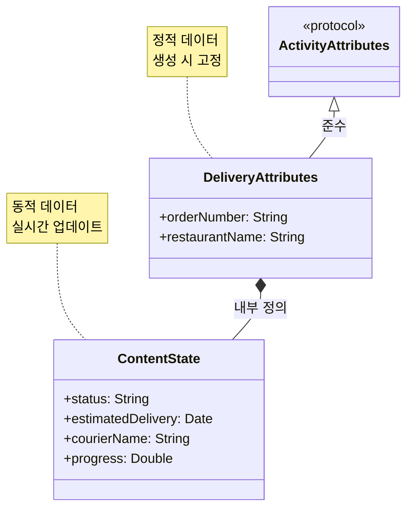
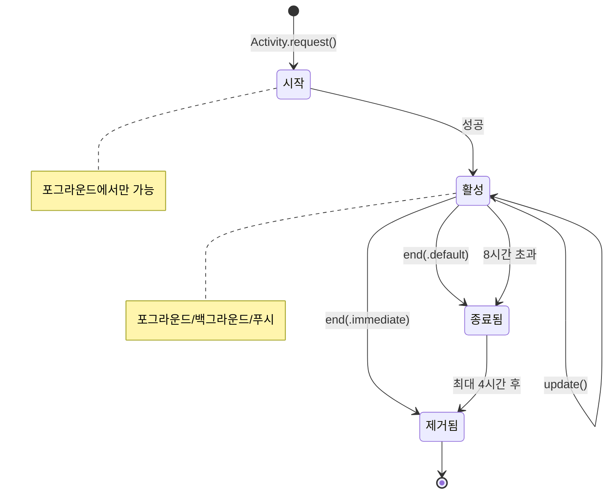
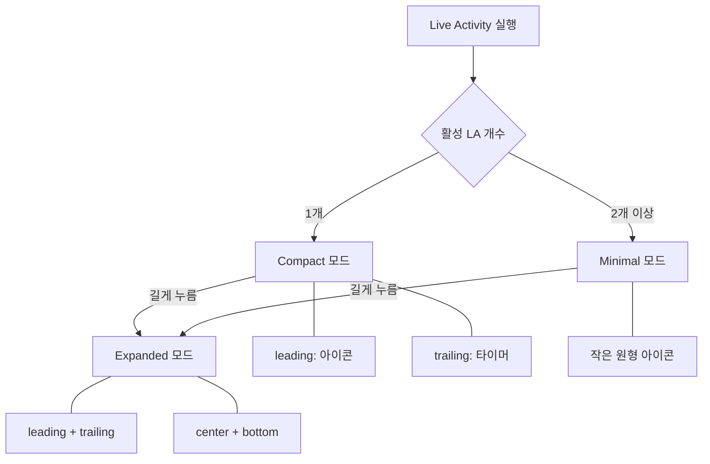
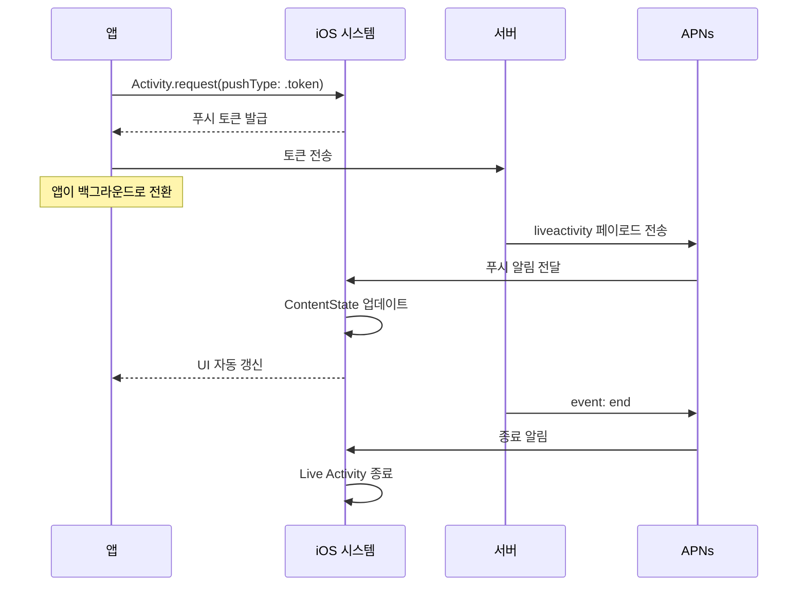

# Live Activities와 Dynamic Island

> 실시간 정보 표시, ActivityKit, 잠금화면 업데이트

## 개요

배달 주문의 진행 상황, 스포츠 경기 점수, 택시 도착 시간 — 이런 **실시간으로 변하는 정보**를 잠금화면과 Dynamic Island에 표시하는 것이 Live Activities입니다. ActivityKit 프레임워크를 사용해 Live Activity를 시작, 업데이트, 종료하는 방법을 배웁니다.

**선수 지식**: [WidgetKit](./01-widgetkit.md)
**학습 목표**:
- ActivityKit으로 Live Activity를 시작/업데이트/종료할 수 있다
- Dynamic Island의 3가지 표시 모드를 구성할 수 있다
- 푸시 알림으로 원격 업데이트를 구현할 수 있다

## 왜 알아야 할까?

사용자가 앱을 닫아도 중요한 정보를 계속 볼 수 있다면 얼마나 편할까요? Live Activities는 잠금화면에 **실시간 상태**를 보여주고, iPhone 14 Pro 이상에서는 **Dynamic Island**에 정보를 표시합니다. 배달 앱, 스포츠 앱, 타이머 앱 등에서 사용자 경험을 획기적으로 개선할 수 있는 기능이에요. iOS 18부터는 Apple Watch Smart Stack에도 자동으로 나타나고, iOS 26에서는 CarPlay와 iPad까지 지원합니다.

## 핵심 개념

### 개념 1: ActivityKit 아키텍처 — 정적 vs 동적 데이터

> 💡 **비유**: Live Activity는 **전광판 뉴스 속보**와 같습니다. 뉴스 채널 이름(정적 속성)은 변하지 않지만, 속보 내용(동적 상태)은 계속 업데이트되죠.

ActivityKit의 핵심은 `ActivityAttributes` 프로토콜입니다. 변하지 않는 **정적 데이터**와 실시간으로 변하는 **동적 데이터(ContentState)**를 분리합니다.

> 📊 **그림 1**: ActivityAttributes 아키텍처 — 정적 데이터와 동적 데이터 분리




```swift
import ActivityKit
import Foundation

// ActivityAttributes: 정적 데이터 (생성 시 설정, 이후 변경 불가)
struct DeliveryAttributes: ActivityAttributes {
    // ContentState: 동적 데이터 (실시간으로 업데이트 가능)
    public struct ContentState: Codable, Hashable {
        var status: String           // "준비중", "배달중", "도착"
        var estimatedDelivery: Date  // 예상 도착 시간
        var courierName: String      // 배달원 이름
        var progress: Double         // 진행률 (0.0 ~ 1.0)
    }

    // 정적 속성: 주문 내내 변하지 않는 정보
    var orderNumber: String      // 주문 번호
    var restaurantName: String   // 레스토랑 이름
}
```

### 개념 2: Live Activity 시작, 업데이트, 종료

Live Activity의 생명주기는 3단계입니다.

> 📊 **그림 2**: Live Activity 생명주기 — 시작, 업데이트, 종료




| 단계 | 메서드 | 호출 위치 |
|------|--------|----------|
| **시작** | `Activity.request()` | 앱이 포그라운드일 때만 |
| **업데이트** | `activity.update()` | 포그라운드/백그라운드/푸시 |
| **종료** | `activity.end()` | 포그라운드/백그라운드/푸시 |

```swift
// Live Activity 시작하기
func startDelivery() {
    let attributes = DeliveryAttributes(
        orderNumber: "ORD-2025-1234",
        restaurantName: "맛있는 피자"
    )

    let initialState = DeliveryAttributes.ContentState(
        status: "주문 접수",
        estimatedDelivery: .now.addingTimeInterval(2400),
        courierName: "배정 중",
        progress: 0.0
    )

    let content = ActivityContent(
        state: initialState,
        staleDate: .now.addingTimeInterval(900) // 15분 후 데이터가 "stale" 표시
    )

    do {
        // pushType: .token → 푸시 알림으로 원격 업데이트 가능
        let activity = try Activity.request(
            attributes: attributes,
            content: content,
            pushType: .token
        )
        print("Live Activity 시작됨: \(activity.id)")
    } catch {
        print("시작 실패: \(error)")
    }
}

// Live Activity 업데이트하기
func updateDelivery(activity: Activity<DeliveryAttributes>) async {
    let updatedState = DeliveryAttributes.ContentState(
        status: "배달 중 🚴",
        estimatedDelivery: .now.addingTimeInterval(600),
        courierName: "김민수",
        progress: 0.65
    )

    // 알림과 함께 업데이트 (잠금화면에 배너 표시)
    await activity.update(
        ActivityContent(state: updatedState, staleDate: nil),
        alertConfiguration: AlertConfiguration(
            title: "배달 업데이트",
            body: "배달원이 출발했습니다!",
            sound: .default
        )
    )
}

// Live Activity 종료하기
func endDelivery(activity: Activity<DeliveryAttributes>) async {
    let finalState = DeliveryAttributes.ContentState(
        status: "배달 완료!",
        estimatedDelivery: .now,
        courierName: "김민수",
        progress: 1.0
    )

    // .default: 종료 후 최대 4시간 동안 잠금화면에 유지
    // .immediate: 즉시 제거
    await activity.end(
        ActivityContent(state: finalState, staleDate: nil),
        dismissalPolicy: .default
    )
}
```

### 개념 3: Dynamic Island의 3가지 표시 모드

> 💡 **비유**: Dynamic Island는 **접이식 명함**입니다. 평소에는 접혀 있지만(컴팩트), 펼치면(확장) 더 많은 정보가 나타나죠. 명함이 여러 장이면 가장 중요한 것만 보여줍니다(최소).

| 모드 | 언제 표시 | 구성 |
|------|----------|------|
| **Compact** | Live Activity 1개일 때 | 왼쪽(leading) + 오른쪽(trailing) |
| **Expanded** | 사용자가 길게 누를 때 | leading + trailing + center + bottom |
| **Minimal** | Live Activity 여러 개일 때 | 작은 원형 아이콘 |

> 📊 **그림 3**: Dynamic Island 3가지 표시 모드와 전환 조건




```swift
import WidgetKit
import SwiftUI

struct DeliveryLiveActivity: Widget {
    var body: some WidgetConfiguration {
        ActivityConfiguration(for: DeliveryAttributes.self) { context in
            // === 잠금화면(Lock Screen) 뷰 ===
            VStack(alignment: .leading, spacing: 12) {
                HStack {
                    Image(systemName: "bag.fill")
                        .foregroundStyle(.orange)
                    Text(context.attributes.restaurantName)
                        .font(.headline)
                    Spacer()
                    Text(context.attributes.orderNumber)
                        .font(.caption)
                        .foregroundStyle(.secondary)
                }

                ProgressView(value: context.state.progress)
                    .tint(.green)

                HStack {
                    Label(context.state.status, systemImage: "info.circle")
                        .font(.subheadline)
                    Spacer()
                    // .timer 스타일로 자동 카운트다운
                    Text(context.state.estimatedDelivery, style: .relative)
                        .font(.subheadline)
                        .foregroundStyle(.secondary)
                }
            }
            .padding()
            .activityBackgroundTint(.blue.opacity(0.1))

        } dynamicIsland: { context in
            DynamicIsland {
                // === 확장(Expanded) 영역 ===
                DynamicIslandExpandedRegion(.leading) {
                    Image(systemName: "bag.fill")
                        .font(.title2)
                        .foregroundStyle(.orange)
                }

                DynamicIslandExpandedRegion(.trailing) {
                    Text(context.state.estimatedDelivery, style: .timer)
                        .font(.caption)
                        .foregroundStyle(.secondary)
                }

                DynamicIslandExpandedRegion(.center) {
                    Text(context.attributes.restaurantName)
                        .font(.headline)
                }

                DynamicIslandExpandedRegion(.bottom) {
                    VStack(spacing: 8) {
                        ProgressView(value: context.state.progress)
                            .tint(.green)
                        HStack {
                            Text(context.state.status)
                                .font(.caption)
                            Spacer()
                            Text(context.state.courierName)
                                .font(.caption2)
                                .foregroundStyle(.secondary)
                        }
                    }
                }

            } compactLeading: {
                // === 컴팩트 왼쪽 ===
                Image(systemName: "bicycle")
                    .foregroundStyle(.orange)

            } compactTrailing: {
                // === 컴팩트 오른쪽 ===
                Text(context.state.estimatedDelivery, style: .timer)
                    .font(.caption2)
                    .foregroundStyle(.cyan)

            } minimal: {
                // === 최소: 여러 Live Activity 동시 실행 시 ===
                Image(systemName: "bicycle")
                    .foregroundStyle(.orange)
            }
            .keylineTint(.orange) // 컴팩트/최소의 배경 틴트
        }
        // iOS 18+: Apple Watch Smart Stack 지원
        .supplementalActivityFamilies([.small])
    }
}
```

### 개념 4: 푸시 알림으로 원격 업데이트

앱이 백그라운드에 있어도 서버에서 **APNs(Apple Push Notification service)**를 통해 Live Activity를 업데이트할 수 있습니다.

> 📊 **그림 4**: APNs를 통한 Live Activity 원격 업데이트 흐름




```swift
// 앱 시작 시 푸시 토큰을 관찰합니다
func observePushToken(for activity: Activity<DeliveryAttributes>) {
    Task {
        for await pushToken in activity.pushTokenUpdates {
            let token = pushToken.map { String(format: "%02x", $0) }.joined()
            print("푸시 토큰: \(token)")
            // 서버에 토큰을 전송합니다
            await sendTokenToServer(token)
        }
    }
}
```

**서버에서 보내는 APNs 페이로드 (업데이트):**

| 필드 | 값 | 설명 |
|------|------|------|
| `apns-push-type` | `liveactivity` | 라이브 액티비티 전용 |
| `apns-topic` | `{bundleID}.push-type.liveactivity` | 토픽 형식 |
| `event` | `update` / `end` | 업데이트 또는 종료 |
| `content-state` | ContentState JSON | 새로운 동적 데이터 |
| `timestamp` | UNIX timestamp | 매 알림마다 변경 필수 |

> ⚠️ **흔한 오해**: "APNs에 p12 인증서를 쓸 수 있다" — Live Activity 푸시는 **Token 기반 인증(p8)**만 지원합니다. p12 인증서는 사용할 수 없어요.

### 개념 5: 제한 사항과 설정

| 제한 | 값 |
|------|------|
| 앱당 동시 활성 | 최대 **5개** |
| 최대 지속 시간 | **8시간** (자동 종료) |
| 종료 후 잠금화면 유지 | 최대 **4시간** |
| 시작 조건 | **포그라운드**에서만 (Push-to-Start 제외) |
| UI 프레임워크 | **SwiftUI만** (UIKit 불가) |

**Info.plist 필수 설정:**

앱 타겟의 Info.plist에 `NSSupportsLiveActivities`를 `YES`로 설정해야 합니다.

## 실습: 직접 해보기

Live Activity 구현 체크리스트입니다.

**구현 체크리스트:**

- [ ] Widget Extension 타겟 추가 시 "Include Live Activity" 체크
- [ ] 앱 Info.plist에 `NSSupportsLiveActivities = YES` 추가
- [ ] `ActivityAttributes` 구조체를 공유 위치에 정의 (앱 + 위젯 타겟 모두 접근 가능)
- [ ] 잠금화면 뷰 구현
- [ ] Dynamic Island 3가지 모드 구현 (compact, expanded, minimal)
- [ ] `Activity.request()`로 시작 로직 구현
- [ ] `activity.update()`로 업데이트 로직 구현
- [ ] `activity.end()`로 종료 로직 구현
- [ ] Dynamic Island 기기와 비-Dynamic Island 기기 모두 테스트

## 더 깊이 알아보기

Live Activities는 iOS 16.1(2022년 10월)에 **iPhone 14 Pro**와 함께 등장했습니다. Dynamic Island라는 하드웨어 디자인 — 노치를 대체하는 알약 모양의 컷아웃 — 이 소프트웨어와 결합한 혁신적인 사례였죠. 초기에는 Uber, 스포츠 앱 등 소수 파트너만 사용했지만, iOS 17에서 Push-to-Start가 추가되고, iOS 18에서 Apple Watch Smart Stack 지원이 되면서 활용 범위가 크게 넓어졌습니다.

iOS 26에서는 **CarPlay**, **iPadOS**, **macOS 메뉴바**까지 확장되었고, 미래 시점에 Live Activity를 예약 시작할 수 있는 **Scheduling API**도 추가되었습니다.

## 흔한 오해와 팁

> 🔥 **실무 팁**: 컴팩트 뷰는 매우 작은 공간입니다. 아이콘 하나 + 짧은 텍스트 정도만 넣으세요. `Text(date, style: .timer)`를 활용하면 실시간 카운트다운을 타임라인 소비 없이 표시할 수 있습니다.

> 💡 **알고 계셨나요?**: `staleDate`를 설정하면 데이터가 오래되었을 때 시스템이 다른 시각적 처리를 할 수 있습니다. 이것은 Live Activity를 **종료**하는 게 아니라, 데이터가 최신이 아닐 수 있다는 신호를 주는 겁니다.

## 핵심 정리

| 개념 | 설명 |
|------|------|
| ActivityAttributes | 정적(변하지 않는) + 동적(ContentState) 데이터 분리 |
| Activity.request() | 포그라운드에서 Live Activity 시작 |
| DynamicIsland | compact(1개), expanded(길게 누름), minimal(여러 개) |
| pushType: .token | APNs로 원격 업데이트 활성화 |
| dismissalPolicy | `.default`(4시간 유지), `.immediate`(즉시 제거) |
| supplementalActivityFamilies | Apple Watch / CarPlay 지원 (iOS 18+) |

## 다음 섹션 미리보기

Live Activities가 실시간 정보를 표시한다면, **App Intents**는 앱의 기능을 Siri와 Shortcuts에 노출시킵니다. [App Intents와 Shortcuts](./03-app-intents.md)에서 음성 명령과 자동화로 앱을 확장해봅시다.

## 참고 자료

- [ActivityKit - Apple Developer](https://developer.apple.com/documentation/activitykit) - ActivityKit 공식 문서
- [Displaying live data with Live Activities - Apple Developer](https://developer.apple.com/documentation/activitykit/displaying-live-data-with-live-activities) - Live Activities 구현 가이드
- [Bring your Live Activity to Apple Watch - WWDC24](https://developer.apple.com/videos/play/wwdc2024/10068/) - Apple Watch 연동
- [Human Interface Guidelines: Live Activities](https://developer.apple.com/design/human-interface-guidelines/live-activities) - 디자인 가이드라인
