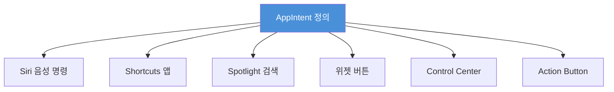
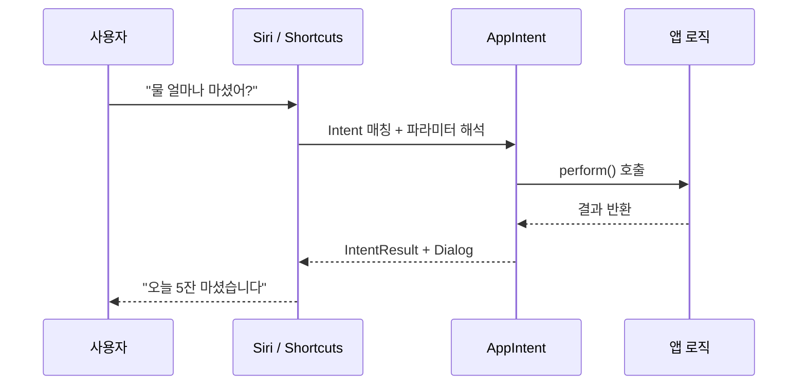
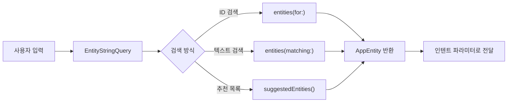
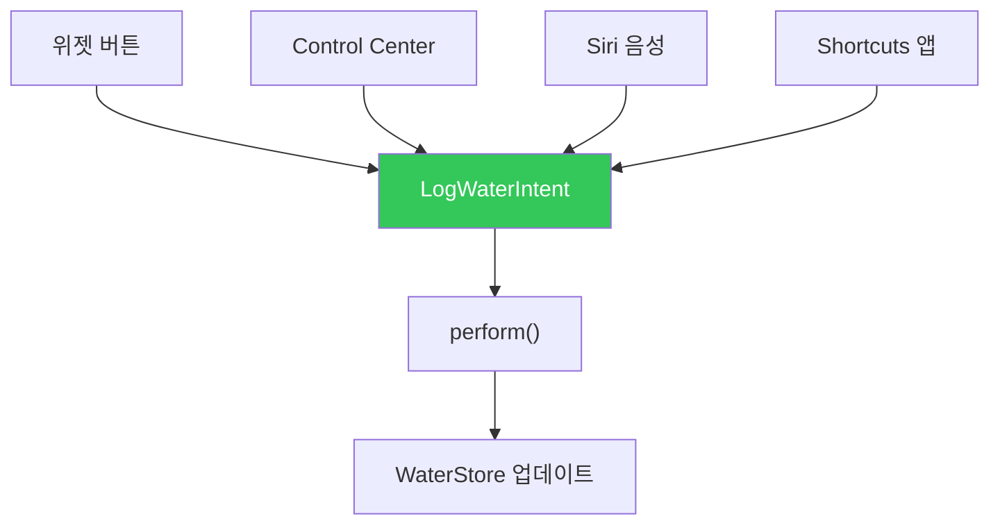

# App Intents와 Shortcuts

> Siri 통합, 단축어, 음성 명령 지원

## 개요

"Hey Siri, 오늘 물 몇 잔 마셨어?" — 이렇게 **음성으로 앱의 기능을 호출**할 수 있다면 어떨까요? App Intents 프레임워크는 앱의 핵심 기능을 Siri, Shortcuts 앱, Spotlight에 노출하는 Swift 네이티브 API입니다. 한 번 정의하면 여러 시스템 서비스에서 자동으로 활용됩니다.

**선수 지식**: [Live Activities와 Dynamic Island](./02-live-activities.md)
**학습 목표**:
- AppIntent 프로토콜로 앱 기능을 시스템에 노출할 수 있다
- AppShortcutsProvider로 Siri와 Shortcuts 앱에 단축어를 제공할 수 있다
- AppEntity로 앱의 데이터를 시스템 서비스에서 검색 가능하게 할 수 있다

## 왜 알아야 할까?

App Intents는 단순한 Siri 연동을 넘어서 앱의 **확장 전략**입니다. 한 번 작성한 인텐트가 Siri 음성 명령, Shortcuts 자동화, Spotlight 검색, 위젯 설정, Control Center 컨트롤에서 모두 동작합니다. iOS 26에서는 Apple Intelligence와의 통합이 더욱 깊어져서, Siri가 앱의 데이터를 이해하고 맥락에 맞는 응답을 제공합니다. 인텐트를 잘 설계하면 사용자가 앱을 열지 않고도 핵심 기능을 사용할 수 있어요.

> 📊 **그림 1**: App Intents — 한 번 정의하면 시스템 전반에서 활용




## 핵심 개념

### 개념 1: AppIntent — 앱 기능을 시스템에 노출하기

> 💡 **비유**: AppIntent는 **메뉴판**입니다. 레스토랑(앱)이 어떤 요리(기능)를 제공하는지 배달 플랫폼(시스템)에 등록하면, 고객(사용자)이 앱을 방문하지 않아도 주문(실행)할 수 있죠.

AppIntent 프로토콜에는 세 가지 핵심 요소가 있습니다.

> 📊 **그림 2**: AppIntent 실행 흐름




| 요소 | 역할 |
|------|------|
| `title` | 시스템 UI에 표시되는 인텐트 이름 |
| `@Parameter` | 사용자 입력을 받는 매개변수 |
| `perform()` | 인텐트가 실행될 때 호출되는 비동기 메서드 |

```swift
import AppIntents

// 가장 기본적인 AppIntent 예시
struct GetWaterIntakeIntent: AppIntent {
    // Shortcuts 앱과 Siri에 표시되는 제목
    static var title: LocalizedStringResource = "오늘의 물 섭취량 확인"
    static var description = IntentDescription("오늘 마신 물의 잔 수를 알려줍니다")

    // perform(): 인텐트 실행 로직
    // ReturnsValue → 다른 Shortcut에서 값을 사용 가능
    // ProvidesDialog → Siri가 음성으로 응답
    func perform() async throws -> some IntentResult & ReturnsValue<Int> & ProvidesDialog {
        let store = WaterStore.shared
        let cups = store.todayCups

        return .result(
            value: cups,
            dialog: "오늘 \(cups)잔 마셨습니다. 목표까지 \(8 - cups)잔 남았어요!"
        )
    }
}
```

### 개념 2: 파라미터와 사용자 입력

인텐트에 `@Parameter`를 추가하면 Siri나 Shortcuts에서 사용자 입력을 받을 수 있습니다.

```swift
// 파라미터가 있는 인텐트
struct LogWaterIntent: AppIntent {
    static var title: LocalizedStringResource = "물 마시기 기록"
    static var description = IntentDescription("마신 물 잔 수를 기록합니다")

    // @Parameter: 사용자에게 값을 요청합니다
    @Parameter(title: "잔 수", default: 1)
    var cups: Int

    // parameterSummary: Shortcuts 앱에서 보이는 요약 문장
    static var parameterSummary: some ParameterSummary {
        Summary("물 \(\.$cups)잔 기록하기")
    }

    func perform() async throws -> some IntentResult & ProvidesDialog {
        let store = WaterStore.shared
        store.addCups(cups)

        return .result(
            dialog: "물 \(cups)잔을 기록했습니다. 오늘 총 \(store.todayCups)잔이에요!"
        )
    }
}
```

**perform()의 반환 타입 프로토콜 조합:**

| 프로토콜 | 역할 |
|----------|------|
| `IntentResult` | 기본 반환 타입 (항상 필요) |
| `ReturnsValue<T>` | 값을 반환해 다른 Shortcut에서 사용 |
| `ProvidesDialog` | Siri가 말하거나 표시하는 텍스트 |
| `ShowsSnippetView` | SwiftUI 뷰를 스니펫으로 표시 |

### 개념 3: AppShortcutsProvider — Siri에 단축어 등록

> 💡 **비유**: AppShortcutsProvider는 **배달앱 추천 메뉴**입니다. 전체 메뉴판(모든 인텐트) 중 가장 인기 있는 메뉴를 앱 메인에 띄워놓는 것처럼, 핵심 인텐트를 Siri와 Spotlight에 미리 등록해둡니다.

```swift
// Siri와 Shortcuts에 단축어를 미리 등록합니다
struct WaterShortcutsProvider: AppShortcutsProvider {
    // Shortcuts 앱에서 표시되는 타일 색상
    static var shortcutTileColor: ShortcutTileColor = .cyan

    static var appShortcuts: [AppShortcut] {
        // 물 섭취량 확인 단축어
        AppShortcut(
            intent: GetWaterIntakeIntent(),
            phrases: [
                // \(.applicationName)은 필수! Siri가 앱을 식별합니다
                "\(.applicationName)에서 물 얼마나 마셨어?",
                "\(.applicationName) 물 섭취량 확인"
            ],
            shortTitle: "물 섭취량",
            systemImageName: "drop.fill"
        )

        // 물 마시기 기록 단축어
        AppShortcut(
            intent: LogWaterIntent(),
            phrases: [
                "\(.applicationName)에서 물 기록해",
                "\(.applicationName) 물 마셨어"
            ],
            shortTitle: "물 기록",
            systemImageName: "plus.circle"
        )
    }
}
```

**앱 내에서 Siri 단축어를 알려주는 UI:**

```swift
import SwiftUI
import AppIntents

struct WaterView: View {
    @State private var showSiriTip = true

    var body: some View {
        VStack {
            // SiriTipView: "Hey Siri, ..."로 할 수 있다고 알려줍니다
            SiriTipView(intent: LogWaterIntent(), isVisible: $showSiriTip)

            // ShortcutsLink: Shortcuts 앱의 내 앱 액션 목록으로 이동
            ShortcutsLink()
                .shortcutsLinkStyle(.automaticOutline)
        }
    }
}

#Preview {
    WaterView()
}
```

### 개념 4: AppEntity — 앱 데이터를 시스템에 노출하기

앱의 커스텀 데이터 타입을 Siri, Shortcuts, Spotlight에서 검색하고 선택할 수 있게 하려면 `AppEntity`를 사용합니다.

> 📊 **그림 3**: AppEntity와 EntityQuery 검색 구조




```swift
import AppIntents

// AppEntity: 앱의 데이터 타입을 시스템에 노출
struct DrinkEntity: AppEntity {
    // 타입 전체의 표시 이름
    static var typeDisplayRepresentation: TypeDisplayRepresentation = "음료"

    // 개별 엔티티의 표시 방법
    var displayRepresentation: DisplayRepresentation {
        DisplayRepresentation(title: "\(name)", subtitle: "\(calories)kcal")
    }

    // 기본 검색 쿼리
    static var defaultQuery = DrinkQuery()

    let id: UUID
    let name: String
    let calories: Int
    let volume: Int // ml
}

// EntityQuery: ID 또는 텍스트로 엔티티를 검색
struct DrinkQuery: EntityStringQuery {
    // ID로 검색
    func entities(for identifiers: [UUID]) async throws -> [DrinkEntity] {
        DrinkStore.shared.drinks.filter { identifiers.contains($0.id) }
    }

    // 텍스트로 검색 (Siri가 음성을 텍스트로 변환 후 호출)
    func entities(matching string: String) async throws -> [DrinkEntity] {
        DrinkStore.shared.drinks.filter { $0.name.contains(string) }
    }

    // 추천 목록 (기본 옵션으로 표시)
    func suggestedEntities() async throws -> [DrinkEntity] {
        Array(DrinkStore.shared.drinks.prefix(5))
    }
}

// AppEntity를 파라미터로 사용하는 인텐트
struct LogDrinkIntent: AppIntent {
    static var title: LocalizedStringResource = "음료 기록"

    @Parameter(title: "음료")
    var drink: DrinkEntity // 사용자가 음료를 선택할 수 있습니다

    func perform() async throws -> some IntentResult & ProvidesDialog {
        DrinkStore.shared.log(drink)
        return .result(dialog: "\(drink.name)을 기록했습니다!")
    }
}
```

### 개념 5: 위젯과 Control Center에서 인텐트 재사용

App Intents의 강력한 점은 **한 번 작성하면 여러 곳에서 재사용**된다는 것입니다.

> 📊 **그림 4**: 인텐트 재사용 — 하나의 인텐트, 다양한 진입점




```swift
import WidgetKit

// 인터랙티브 위젯에서 인텐트를 버튼으로 사용
struct WaterWidgetView: View {
    let entry: WaterEntry

    var body: some View {
        VStack {
            Text("\(entry.cups)잔")
                .font(.largeTitle)
            // 위젯 내 버튼이 LogWaterIntent를 실행합니다
            Button(intent: LogWaterIntent(cups: 1)) {
                Label("추가", systemImage: "plus")
            }
        }
        .containerBackground(.fill.tertiary, for: .widget)
    }
}

// Control Center 컨트롤에서 인텐트 사용 (iOS 18+)
struct WaterControl: ControlWidget {
    static let kind = "com.example.water-control"

    var body: some ControlWidgetConfiguration {
        StaticControlConfiguration(kind: Self.kind) {
            ControlWidgetButton(action: LogWaterIntent(cups: 1)) {
                Label("물 한 잔", systemImage: "drop.fill")
            }
        }
        .displayName("물 마시기")
    }
}
```

## 실습: 직접 해보기

App Intents 구현 체크리스트입니다.

**구현 체크리스트:**

- [ ] AppIntent 구조체 정의 (title, perform())
- [ ] 필요 시 @Parameter 추가
- [ ] AppShortcutsProvider 정의 (phrases에 `\(.applicationName)` 필수)
- [ ] 앱 초기화 시 `ShortcutsProvider.updateAppShortcutParameters()` 호출
- [ ] SiriTipView로 사용자에게 음성 명령 안내
- [ ] 데이터 노출이 필요하면 AppEntity + EntityQuery 구현
- [ ] Shortcuts 앱에서 인텐트 실행 테스트
- [ ] Siri 음성 명령으로 테스트 ("Hey Siri, [앱 이름]에서...")

## 더 깊이 알아보기

Siri와 앱의 통합은 긴 여정을 거쳤습니다. 2011년 iPhone 4s와 함께 Siri가 등장했을 때, 서드파티 앱 연동은 불가능했어요. 2016년 iOS 10에서 **SiriKit**이 출시되면서 7개 도메인(메시징, 결제 등)에서 Siri 연동이 가능해졌지만, `.intentdefinition` XML 파일과 별도 Intents Extension이 필요한 복잡한 구조였습니다.

2018년 iOS 12에서 **Siri Shortcuts**가 등장해 사용자가 직접 음성 트리거를 만들 수 있게 되었고, 2022년 WWDC에서 **App Intents 프레임워크**가 발표되며 Swift 코드만으로 모든 것을 정의할 수 있게 되었습니다. `.intentdefinition` 파일도, 별도 Extension 타겟도 필요 없어졌죠. iOS 26에서는 **Interactive Snippets**가 추가되어, Siri 응답에 SwiftUI 뷰와 버튼을 포함할 수 있게 되었습니다.

## 흔한 오해와 팁

> ⚠️ **흔한 오해**: "App Intents는 Siri 전용이다" — App Intents는 Siri뿐만 아니라 Shortcuts 앱, Spotlight 검색, 위젯 설정(AppIntentConfiguration), Control Center, Action Button 등 시스템 전반에서 사용됩니다.

> 🔥 **실무 팁**: `AppShortcutsProvider`의 phrases에 **반드시** `\(.applicationName)`을 포함하세요. 이걸 빠뜨리면 Siri가 어떤 앱의 기능인지 식별할 수 없어 단축어가 동작하지 않습니다.

> 💡 **알고 계셨나요?**: `openAppWhenRun = true`를 설정하면 인텐트 실행 시 앱이 열립니다. UI 조작이 필요한 인텐트(예: 특정 화면으로 이동)에 유용해요.

## 핵심 정리

| 개념 | 설명 |
|------|------|
| AppIntent | 앱 기능을 시스템에 노출하는 핵심 프로토콜 |
| @Parameter | 사용자 입력을 받는 매개변수 선언 |
| perform() | 인텐트 실행 로직 (async throws) |
| AppShortcutsProvider | Siri/Shortcuts에 단축어 미리 등록 |
| AppEntity | 앱의 데이터 타입을 시스템에 노출 |
| EntityQuery | ID/텍스트로 엔티티를 검색하는 쿼리 |
| SiriTipView | 사용자에게 음성 명령을 안내하는 UI |
| WidgetConfigurationIntent | 위젯 설정용 인텐트 |

## 다음 섹션 미리보기

앱의 기능을 시스템에 노출했다면, 이제 **수익화**를 생각해봅시다. [In-App Purchase](./04-storekit.md)에서 StoreKit 2로 구독과 인앱 결제를 구현하는 방법을 배웁니다.

## 참고 자료

- [App Intents - Apple Developer](https://developer.apple.com/documentation/appintents) - App Intents 공식 문서
- [Get to know App Intents - WWDC25](https://developer.apple.com/videos/play/wwdc2025/244/) - App Intents 기초
- [Dive into App Intents - WWDC22](https://developer.apple.com/videos/play/wwdc2022/10032/) - App Intents 소개 세션
- [Integrating actions with Siri and Apple Intelligence - Apple Developer](https://developer.apple.com/documentation/appintents/integrating-actions-with-siri-and-apple-intelligence) - Siri 통합 가이드
