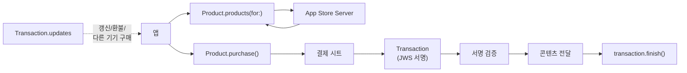
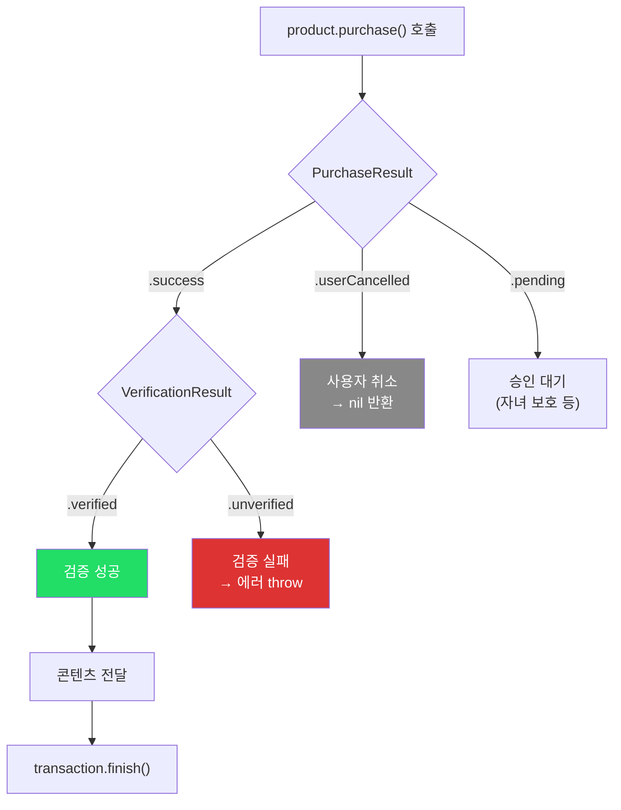
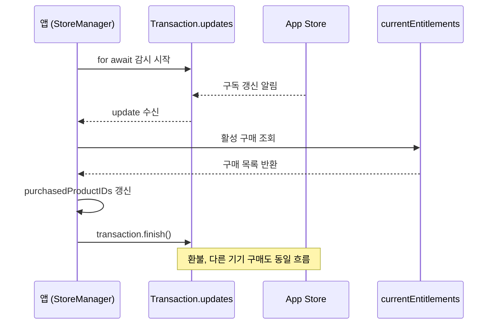
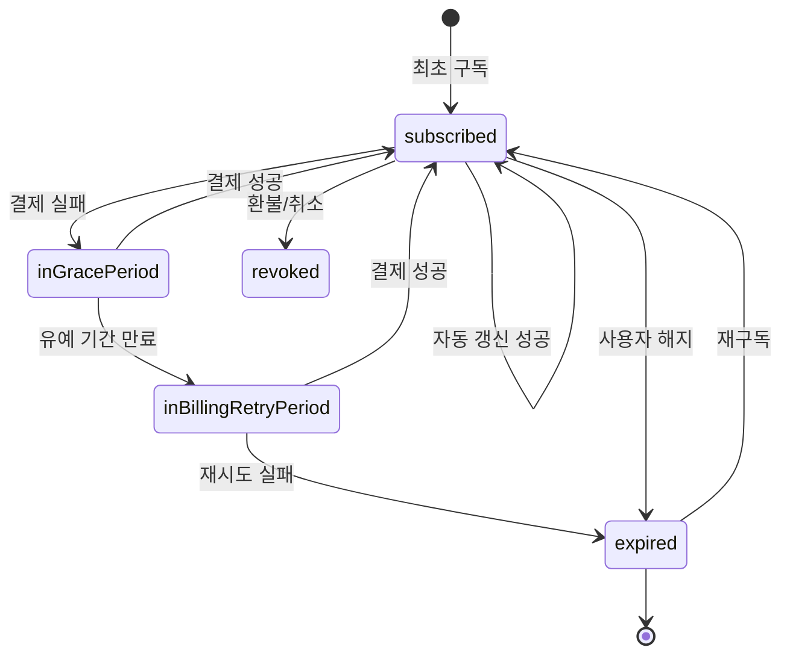

# In-App Purchase

> StoreKit 2, 구독 모델, 결제 처리와 영수증 검증

## 개요

앱으로 수익을 창출하는 가장 일반적인 방법이 **인앱 구매(In-App Purchase)**입니다. StoreKit 2는 async/await 기반의 현대적 API로, 상품 조회부터 구매 처리, 구독 관리까지 깔끔하게 처리할 수 있습니다. SwiftUI 전용 뷰까지 제공되어, 몇 줄의 코드로 페이월을 만들 수 있어요.

**선수 지식**: [App Intents와 Shortcuts](./03-app-intents.md)
**학습 목표**:
- StoreKit 2로 상품을 조회하고 구매를 처리할 수 있다
- SubscriptionStoreView로 구독 페이월을 구현할 수 있다
- Transaction 모니터링으로 구매 상태를 관리할 수 있다

## 왜 알아야 할까?

> 📊 **그림 1**: StoreKit 2 인앱 구매 전체 아키텍처




무료 앱으로 시작해도, 결국 지속 가능한 수익 모델이 필요합니다. 인앱 구매는 App Store 매출의 핵심이고, 특히 구독 모델은 안정적인 반복 수익을 만들어줍니다. StoreKit 2는 기존의 복잡한 영수증 검증을 자동화하고, SwiftUI 전용 뷰로 구매 UI까지 제공해서 개발 부담을 크게 줄여줬어요. 앱 수익화를 고려하고 있다면 반드시 알아야 할 프레임워크입니다.

## 핵심 개념

### 개념 1: 상품 유형 — 무엇을 팔 것인가?

> 💡 **비유**: 인앱 구매 유형은 **자판기 상품**과 같습니다. 음료(소모품)는 마시면 사라지고, 텀블러(비소모품)는 한 번 사면 계속 쓰고, 정기구독 잡지(구독)는 매달 자동 배달되죠.

| 유형 | 설명 | 예시 |
|------|------|------|
| **Consumable (소모품)** | 여러 번 구매 가능, 사용하면 소멸 | 게임 코인, 생명, 부스터 |
| **Non-consumable (비소모품)** | 한 번 구매, 영구 소유 | 프리미엄 테마, 광고 제거 |
| **Auto-renewable (자동 갱신 구독)** | 자동 갱신, 취소 전까지 지속 | 월간/연간 프리미엄 |
| **Non-renewing (비갱신 구독)** | 기간 만료 후 자동 갱신 안 됨 | 시즌 패스, 한시적 이용권 |

### 개념 2: 상품 조회와 구매 처리

> 📊 **그림 2**: 구매 처리 흐름과 결과 분기




StoreKit 2는 `Product` 구조체와 async/await API로 구매 흐름을 깔끔하게 처리합니다.

```swift
import StoreKit

// 상품 조회: App Store에서 상품 정보를 가져옵니다
func fetchProducts() async throws -> [Product] {
    let productIDs = [
        "com.myapp.pro.monthly",     // 월간 구독
        "com.myapp.pro.yearly",      // 연간 구독
        "com.myapp.theme.dark",      // 비소모품
        "com.myapp.tip.coffee"       // 소모품
    ]

    // Product.products(for:)로 App Store에서 상품 정보 조회
    let products = try await Product.products(for: productIDs)

    for product in products {
        print("\(product.displayName): \(product.displayPrice)")
        // "프리미엄 월간: ₩4,900" — 자동으로 현지 통화로 표시됩니다
    }

    return products
}
```

```swift
// 구매 처리: 상품을 구매하고 결과를 처리합니다
func purchase(_ product: Product) async throws -> Transaction? {
    // 1. 구매 요청
    let result = try await product.purchase()

    switch result {
    case .success(let verificationResult):
        // 2. Apple의 자동 서명 검증 확인
        switch verificationResult {
        case .verified(let transaction):
            // 검증 성공 — 안전하게 콘텐츠를 제공합니다
            await updatePurchasedProducts()

            // 3. 거래 완료를 App Store에 알립니다 (매우 중요!)
            await transaction.finish()
            return transaction

        case .unverified(_, let error):
            // 검증 실패 — 위변조 가능성
            throw StoreError.failedVerification(error)
        }

    case .userCancelled:
        // 사용자가 결제를 취소했습니다
        return nil

    case .pending:
        // 결제 승인 대기 중 (자녀 보호 기능 등)
        return nil

    @unknown default:
        return nil
    }
}
```

> ⚠️ **흔한 오해**: "finish()는 안 불러도 된다" — **절대 아닙니다!** `finish()`를 호출하지 않으면 해당 거래가 `Transaction.updates`에 계속 나타납니다. 이것은 의도된 안전장치예요. 콘텐츠를 전달한 **후에** 반드시 `finish()`를 호출하세요. 순서가 중요합니다: 콘텐츠 전달 → finish() 호출.

### 개념 3: Transaction 모니터링 — 실시간 구매 상태 추적

> 📊 **그림 3**: Transaction 모니터링 흐름




앱이 실행 중일 때 다른 기기에서의 구매, 구독 갱신, 환불 등을 감지하려면 `Transaction.updates`를 관찰해야 합니다.

```swift
import StoreKit
import Observation

@Observable
@MainActor
final class StoreManager {
    private(set) var purchasedProductIDs: Set<String> = []
    private(set) var hasProSubscription = false
    private var updateTask: Task<Void, Error>?

    init() {
        // 앱 시작 시 거래 업데이트를 감시합니다
        updateTask = Task.detached { [weak self] in
            // 구독 갱신, 환불, 다른 기기 구매를 감지합니다
            for await update in Transaction.updates {
                if let transaction = try? update.payloadValue {
                    await self?.updatePurchasedProducts()
                    await transaction.finish()
                }
            }
        }
    }

    deinit { updateTask?.cancel() }

    // 현재 활성화된 구매를 확인합니다
    func updatePurchasedProducts() async {
        var purchased: Set<String> = []

        // currentEntitlements: 활성 구독 + 환불되지 않은 비소모품
        for await entitlement in Transaction.currentEntitlements {
            if let transaction = try? entitlement.payloadValue {
                purchased.insert(transaction.productID)

                if transaction.productType == .autoRenewable {
                    hasProSubscription = true
                }
            }
        }

        purchasedProductIDs = purchased
    }

    // 구매 복원 (설정 > 구매 복원)
    func restorePurchases() async throws {
        try await AppStore.sync()
        await updatePurchasedProducts()
    }
}
```

### 개념 4: SwiftUI 전용 StoreKit 뷰 — 몇 줄로 페이월 만들기

> 💡 **비유**: SwiftUI StoreKit 뷰는 **완제품 가구**입니다. 원목(API)을 깎아서 직접 만들 수도 있지만, IKEA에서 완성된 책장을 사면 훨씬 빠르죠. Apple이 디자인, 결제 처리, 에러 핸들링까지 모두 해결해줍니다.

```swift
import StoreKit
import SwiftUI

// SubscriptionStoreView: 구독 페이월을 한 줄로 생성!
struct PaywallView: View {
    var body: some View {
        // 구독 그룹 ID만 넣으면 자동으로 구독 목록을 표시합니다
        SubscriptionStoreView(groupID: "598392E1") {
            // 마케팅 영역 커스터마이즈
            VStack(spacing: 12) {
                Image(systemName: "crown.fill")
                    .font(.system(size: 60))
                    .foregroundStyle(.yellow)
                Text("프리미엄으로 업그레이드")
                    .font(.title.bold())
                Text("모든 기능을 제한 없이 사용하세요")
                    .font(.subheadline)
                    .foregroundStyle(.secondary)
            }
        }
        // 버튼 스타일: .buttons, .picker, .prominentPicker
        .subscriptionStoreControlStyle(.prominentPicker)
        // 버튼에 가격과 기간을 상세 표시
        .subscriptionStoreButtonLabel(.multiline)
        // 구매 복원 버튼 표시
        .storeButton(.visible, for: .restorePurchases)
    }
}

#Preview {
    PaywallView()
}
```

**StoreView와 ProductView:**

```swift
// StoreView: 여러 상품을 목록으로 표시 (팁, 비소모품 등에 유용)
struct TipJarView: View {
    var body: some View {
        StoreView(ids: [
            "com.myapp.tip.small",
            "com.myapp.tip.medium",
            "com.myapp.tip.large"
        ])
        .productViewStyle(.compact)
        .storeButton(.visible, for: .restorePurchases)
    }
}

// ProductView: 단일 상품 표시
struct SingleProductView: View {
    var body: some View {
        ProductView(id: "com.myapp.theme.dark")
            .productViewStyle(.large)
    }
}
```

### 개념 5: 구독 상태 관리

구독의 현재 상태(활성, 만료, 유예 기간 등)를 확인하는 방법입니다.

```swift
// subscriptionStatusTask로 구독 상태 변화를 자동 감지합니다
@main
struct MyApp: App {
    @State private var isPro = false

    var body: some Scene {
        WindowGroup {
            ContentView()
                .environment(\.isPro, isPro)
                // 구독 상태가 바뀔 때마다 자동 호출됩니다
                .subscriptionStatusTask(for: "YOUR_GROUP_ID") { statuses in
                    isPro = await checkSubscriptionActive(statuses)
                }
        }
    }
}

// 구독 활성 여부를 판단하는 함수
func checkSubscriptionActive(
    _ statuses: EntitlementTaskState<[Product.SubscriptionInfo.Status]>
) async -> Bool {
    guard case .success(let statusArray) = statuses else { return false }

    for status in statusArray {
        guard case .verified(let transaction) = status.transaction else { continue }

        // 활성 구독 또는 유예 기간이면 프리미엄 유지
        switch status.state {
        case .subscribed, .inGracePeriod:
            return true
        default:
            continue
        }
    }
    return false
}
```

**구독 상태 종류:**

> 📊 **그림 4**: 구독 상태 전이 다이어그램




| 상태 | 의미 | 서비스 제공 |
|------|------|-----------|
| `.subscribed` | 활성 구독 중 | 제공 |
| `.inGracePeriod` | 결제 실패, 유예 기간 | 제공 (결제 수단 확인 안내) |
| `.inBillingRetryPeriod` | 결제 재시도 중 | 앱 정책에 따라 결정 |
| `.expired` | 구독 만료 | 미제공 |
| `.revoked` | 환불/취소됨 | 미제공 |

## 실습: 직접 해보기

StoreKit 테스트 환경 설정 체크리스트입니다.

**Xcode StoreKit 테스트 설정:**

- [ ] File → New → File → StoreKit Configuration File 생성
- [ ] 상품 추가: ID, 이름, 가격, 유형 설정
- [ ] 구독 상품의 경우: 구독 그룹, 기간, 등급 설정
- [ ] Edit Scheme → Options → StoreKit Configuration에 파일 할당
- [ ] 앱 실행 후 상품 로딩 테스트
- [ ] 구매 흐름 테스트 (성공, 취소, 대기)
- [ ] 구독 갱신/만료 시뮬레이션
- [ ] Transaction.updates 스트림 동작 확인

> 🔥 **실무 팁**: StoreKit Configuration 파일은 Xcode에서 직접 실행할 때만 동작합니다. TestFlight나 App Store 배포에서는 Sandbox 계정을 사용해야 해요. 두 환경 모두에서 테스트하세요.

## 더 깊이 알아보기

StoreKit의 역사는 곧 인앱 구매의 역사입니다. 2009년 iPhone OS 3.0과 함께 태어났을 때, 개발자들은 `SKPaymentQueue` 델리게이트와 영수증 검증의 악몽에 시달렸어요. `addPayment()`가 void를 반환해서 결제 추적 핸들이 없었고, 영수증 파싱은 전적으로 개발자 몫이었습니다.

2021년 WWDC에서 **StoreKit 2**가 등장하며 모든 것이 바뀌었습니다. async/await 기반 API, JWS(JSON Web Signature) 자동 검증, `Transaction.currentEntitlements`로 영수증 파싱이 사라졌죠. 2023년에는 `SubscriptionStoreView`가 추가되어 구독 UI까지 한 줄로 만들 수 있게 되었습니다. iOS 26에서는 `SubscriptionOfferView`가 새로 추가되고, 오퍼 코드가 소모품/비소모품으로 확장되었습니다.

## 흔한 오해와 팁

> 💡 **알고 계셨나요?**: App Store 수수료는 항상 30%가 아닙니다. **Small Business Program**에 등록하면(연 매출 $1M 이하) **15%**로 줄어듭니다. 자동 갱신 구독도 1년 이후에는 15%가 적용돼요.

> ⚠️ **흔한 오해**: "`Transaction.currentEntitlement(for:)` 하나면 충분하다" — iOS 18.4부터 이 단수형 API는 deprecated되었습니다. 한 사용자가 같은 상품에 대해 여러 거래를 가질 수 있거든요 (직접 구매 + Family Sharing). 복수형 `currentEntitlements(for:)`를 사용하세요.

## 핵심 정리

| 개념 | 설명 |
|------|------|
| Product.products(for:) | App Store에서 상품 정보 조회 (async/await) |
| Product.purchase() | 상품 구매 시작, PurchaseResult 반환 |
| Transaction.finish() | 콘텐츠 전달 후 반드시 호출 (안전장치) |
| Transaction.updates | 구매/갱신/환불 실시간 감지 스트림 |
| currentEntitlements | 현재 활성 구매 목록 (구독 + 비소모품) |
| SubscriptionStoreView | 구독 페이월을 한 줄로 생성하는 SwiftUI 뷰 |
| subscriptionStatusTask | 구독 상태 변화를 자동 감지하는 뷰 수정자 |
| StoreKit Configuration | Xcode에서 로컬 결제 테스트 환경 |

## 다음 섹션 미리보기

Ch15 앱 확장 기능 챕터를 모두 마쳤습니다! 다음 [Ch16. 최신 기술과 트렌드](../16-trends/01-swift6.md)에서는 Swift 6 Concurrency 안전, visionOS, AI/ML 통합, Swift 생태계 전망 등 Swift 개발의 현재와 미래를 살펴봅니다.

## 참고 자료

- [StoreKit 2 - Apple Developer](https://developer.apple.com/storekit/) - StoreKit 공식 문서
- [What's new in StoreKit and In-App Purchase - WWDC25](https://developer.apple.com/videos/play/wwdc2025/241/) - WWDC 2025 StoreKit 새 기능
- [Meet StoreKit 2 - WWDC21](https://developer.apple.com/videos/play/wwdc2021/10114/) - StoreKit 2 소개 세션
- [Meet StoreKit for SwiftUI - WWDC23](https://developer.apple.com/videos/play/wwdc2023/10013/) - SwiftUI StoreKit 뷰
