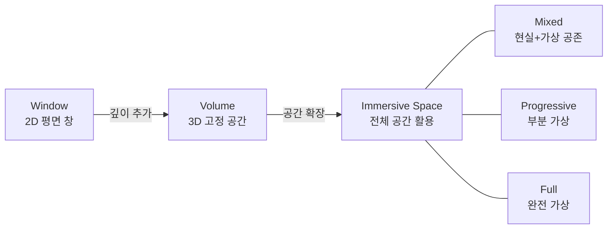
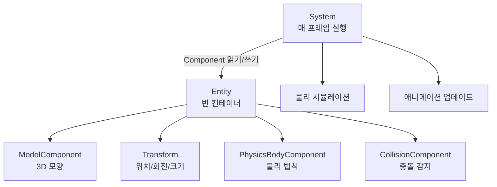
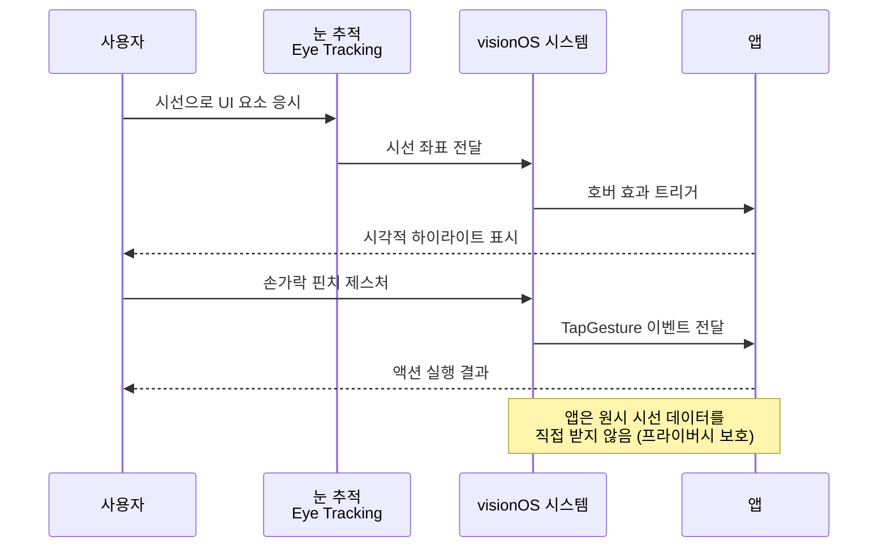
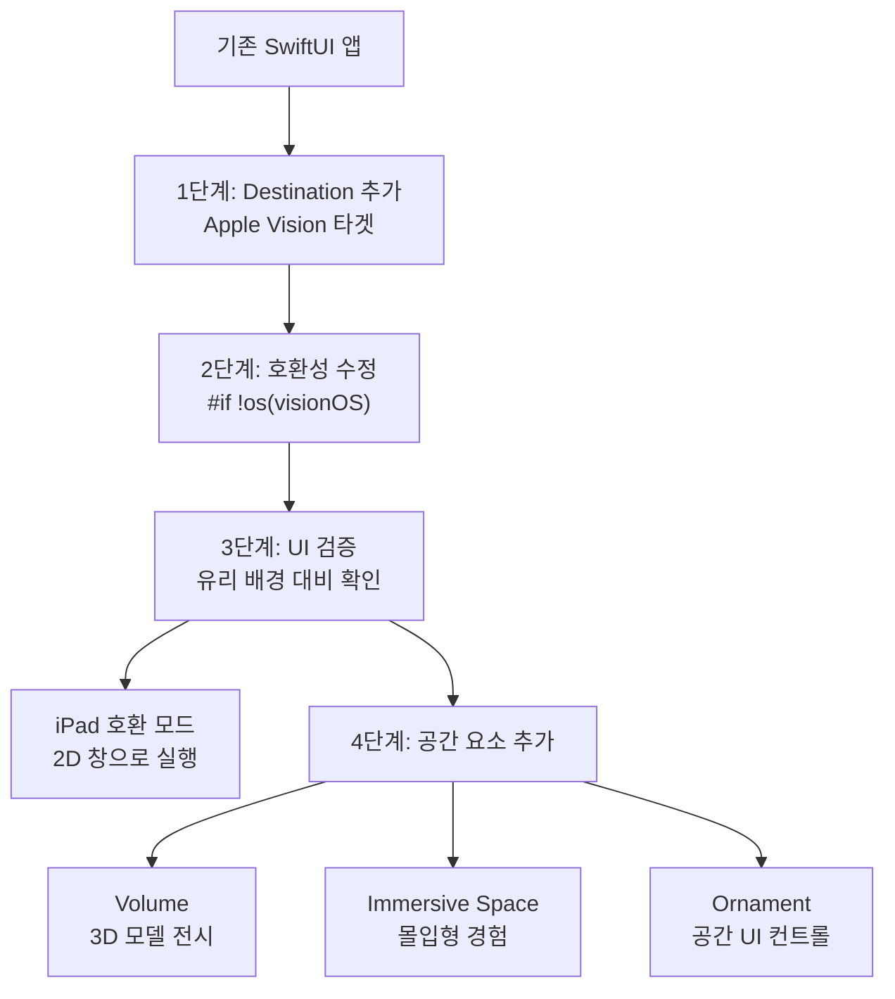

# visionOS와 공간 컴퓨팅

> RealityKit, 3D 콘텐츠, 공간 UI 기초

## 개요

Apple Vision Pro와 함께 등장한 **visionOS**는 SwiftUI를 3차원 공간으로 확장합니다. 기존 SwiftUI 지식만으로 공간 컴퓨팅 앱의 기초를 시작할 수 있어요. 이 섹션에서는 visionOS의 3가지 씬 타입(Window, Volume, Immersive Space)과 RealityKit으로 3D 콘텐츠를 표시하는 방법을 배웁니다.

**선수 지식**: [Swift 6와 Concurrency 안전](./01-swift6.md)
**학습 목표**:
- visionOS의 3가지 씬 타입(Window, Volume, Immersive Space)을 구분할 수 있다
- RealityKit의 Entity-Component-System 구조를 이해할 수 있다
- Model3D와 RealityView로 3D 콘텐츠를 표시할 수 있다

## 왜 알아야 할까?

"공간 컴퓨팅(Spatial Computing)"은 Apple이 AR/VR 대신 선택한 이름이에요. 단순히 가상현실 기기가 아니라, **컴퓨팅의 차원을 확장**한다는 의미죠. 중요한 건, visionOS 앱은 특별한 기술 없이도 시작할 수 있다는 겁니다. SwiftUI로 만든 기존 앱이 visionOS에서 그대로 돌아가거든요! 거기에 3D 요소를 점진적으로 추가하면 됩니다. 2025년 10월에는 M5 칩을 탑재한 업데이트 모델이 출시되었고, visionOS 26에서는 Liquid Glass 디자인과 공간 위젯이 추가되어 생태계가 빠르게 성장하고 있습니다.

## 핵심 개념

### 개념 1: 3가지 씬 타입 — Window, Volume, Immersive Space

> 💡 **비유**: visionOS의 씬 타입은 **전시 방식**과 같습니다. **Window**는 액자에 걸린 그림(2D), **Volume**은 유리 진열장 안의 조각품(3D, 고정 공간), **Immersive Space**는 전시관 전체를 채우는 설치 미술(무한 공간)이죠.

| 씬 타입 | 특징 | 사용 사례 |
|---------|------|----------|
| **Window** | 2D 평면 창, 리사이즈/이동 가능 | 일반 앱 UI, 리스트, 설정 |
| **Volume** | 3D 고정 공간(미터 단위), 모든 각도에서 관찰 | 3D 모델 전시, 지구본 |
| **Immersive Space** | 사용자 공간 전체 활용 | 게임, 몰입형 경험 |

> 📊 **그림 1**: visionOS 3가지 씬 타입의 몰입도 스펙트럼




```swift
import SwiftUI

@main
struct MyVisionApp: App {
    var body: some Scene {
        // 1. Window: 기본 2D 창
        WindowGroup {
            ContentView()
        }
        .defaultSize(CGSize(width: 600, height: 400))

        // 2. Volume: 3D 콘텐츠를 담는 유리 상자
        WindowGroup(id: "globe") {
            GlobeView()
        }
        .windowStyle(.volumetric)
        .defaultSize(width: 0.5, height: 0.5, depth: 0.5, in: .meters)

        // 3. Immersive Space: 사용자 공간 전체 활용
        ImmersiveSpace(id: "solarSystem") {
            SolarSystemView()
        }
        .immersionStyle(selection: .constant(.mixed), in: .mixed)
    }
}
```

**Immersive Space의 3가지 몰입 모드:**

| 모드 | 설명 |
|------|------|
| `.mixed` | 가상 콘텐츠와 현실 세계가 공존 |
| `.progressive` | 사용자 앞 일부가 가상으로 대체 |
| `.full` | 현실 세계가 완전히 가상으로 대체 |

```swift
struct ContentView: View {
    // 환경에서 Immersive Space 열기/닫기 액션 가져오기
    @Environment(\.openImmersiveSpace) private var openSpace
    @Environment(\.dismissImmersiveSpace) private var dismissSpace

    var body: some View {
        Button("우주로 떠나기") {
            Task {
                await openSpace(id: "solarSystem")
            }
        }
    }
}
```

### 개념 2: RealityKit — 3D 세계의 엔진

> 💡 **비유**: RealityKit의 **Entity-Component-System(ECS)**은 **레고 블록**과 같습니다. Entity는 빈 블록이고, Component를 끼워 넣으면 능력이 생깁니다. ModelComponent를 끼우면 보이고, PhysicsBodyComponent를 끼우면 물리 법칙을 따르죠.

| 요소 | 역할 | 예시 |
|------|------|------|
| **Entity** | 빈 컨테이너 | 3D 공간의 한 점 |
| **Component** | 능력/속성 부여 | ModelComponent, Transform |
| **System** | 매 프레임 동작하는 로직 | 물리 시뮬레이션, 애니메이션 |

> 📊 **그림 2**: RealityKit Entity-Component-System 구조




**Model3D**: 간단하게 3D 모델을 표시합니다. `AsyncImage`의 3D 버전이라고 생각하세요.

```swift
import RealityKit

// USDZ 모델을 비동기로 로드하고 표시
Model3D(named: "Globe") { model in
    model
        .resizable()
        .aspectRatio(contentMode: .fit)
        .frame(width: 200, height: 200)
} placeholder: {
    ProgressView()
        .controlSize(.large)
}
```

**RealityView**: Entity를 직접 다루는 전체 제어 모드입니다.

```swift
import RealityKit

struct EarthView: View {
    var body: some View {
        RealityView { content in
            // make 클로저: 초기 설정 (한 번만 호출)
            if let earth = try? await Entity(
                named: "Earth",
                in: realityKitContentBundle
            ) {
                // 위치: x=0, y=0.5m 위, z=2m 앞
                earth.position = [0, 0.5, -2]
                // 크기: 절반으로 축소
                earth.scale = [0.5, 0.5, 0.5]
                content.add(earth)
            }
        }
    }
}
```

### 개념 3: 공간 UI — Ornament와 상호작용

visionOS에서는 사용자가 **눈으로 보고(gaze), 손가락으로 집어(pinch)** 상호작용합니다. 앱은 원시 시선 데이터를 받지 않고, 최종 제스처 이벤트만 받아 프라이버시가 보호됩니다.

> 📊 **그림 4**: visionOS 공간 상호작용 흐름 — 시선에서 제스처까지




**Ornament**: 창 가장자리에 떠 있는 UI 요소입니다. 미디어 앱의 재생 컨트롤 같은 곳에 사용합니다.

```swift
struct PlayerView: View {
    var body: some View {
        VideoPlayerView()
            // 창 하단에 떠 있는 컨트롤 바
            .toolbar {
                ToolbarItem(placement: .bottomOrnament) {
                    HStack(spacing: 20) {
                        Button("이전", systemImage: "backward.fill") { }
                        Button("재생", systemImage: "play.fill") { }
                        Button("다음", systemImage: "forward.fill") { }
                    }
                    .padding()
                }
            }
    }
}
```

**호버 효과**: 사용자가 시선을 올리면 자동으로 시각적 피드백이 나타납니다.

```swift
// 표준 버튼은 자동으로 호버 효과 적용
Button("탭하세요") { }
    .hoverEffect()  // 커스텀 뷰에 호버 효과 추가
```

### 개념 4: 기존 앱을 visionOS로 가져오기

놀랍게도, SwiftUI 앱은 **코드 변경 없이** visionOS에서 실행됩니다! iPad 호환 모드로 2D 창에 표시되죠. 여기서 점진적으로 공간 경험을 추가할 수 있습니다.

**적용 단계:**

1. Xcode에서 **Supported Destinations**에 "Apple Vision" 추가
2. 컴파일 에러 수정 (`#if !os(visionOS)`로 미지원 API 감싸기)
3. 색상 확인 (유리 배경에서 중간 명도 색상은 대비가 낮을 수 있음)
4. 선택적으로 Volume이나 Immersive Space 추가

> 📊 **그림 3**: 기존 앱의 visionOS 마이그레이션 단계




```swift
struct AdaptiveView: View {
    var body: some View {
        NavigationStack {
            List {
                // 기존 SwiftUI 코드는 그대로 동작
                Text("모든 플랫폼에서 동일")
            }
            #if os(visionOS)
            // visionOS에서만 3D 요소 추가
            .toolbar {
                ToolbarItem(placement: .bottomOrnament) {
                    Button("3D로 보기", systemImage: "cube") { }
                }
            }
            #endif
        }
    }
}
```

## 실습: 직접 해보기

visionOS 앱 시작 체크리스트입니다.

**체크리스트:**

- [ ] Xcode에서 "visionOS App" 템플릿으로 새 프로젝트 생성
- [ ] WindowGroup으로 기본 2D UI 구성
- [ ] Model3D로 USDZ 모델 표시해보기
- [ ] `.volumetric` 스타일로 Volume 씬 추가
- [ ] `ImmersiveSpace`로 몰입형 경험 구현
- [ ] Ornament로 떠 있는 컨트롤 추가
- [ ] visionOS 시뮬레이터에서 테스트 (키보드/마우스로 공간 탐색)

## 더 깊이 알아보기

2023년 6월 WWDC에서 Tim Cook이 **"One more thing..."**과 함께 Apple Vision Pro를 공개했을 때, 이것은 Apple Watch(2014) 이후 가장 큰 신제품 발표였습니다. "공간 컴퓨팅(Spatial Computing)"이라는 용어를 VR이나 AR 대신 사용한 것은, 이것이 기존 VR 헤드셋과는 다른 **새로운 컴퓨팅 패러다임**이라는 메시지였죠.

$3,499라는 가격에도 2024년 1월 19일 사전주문이 **18분 만에 매진**되었습니다. Apple은 출시일에 수십만 개의 기존 iPad 앱이 바로 실행되도록 보장했는데, 이것은 iPad가 iPhone 앱으로 시작했던 전략의 재현이었습니다.

2025년 10월에는 M5 칩을 탑재한 업데이트 모델이 발표되면서, Apple이 세대 교체가 아닌 **점진적 개선** 전략을 택했음을 보여주었습니다.

## 흔한 오해와 팁

> ⚠️ **흔한 오해**: "visionOS 개발은 3D 전문가만 할 수 있다" — SwiftUI 앱은 코드 변경 없이 visionOS에서 실행됩니다. 3D 경험은 필요할 때 점진적으로 추가하면 됩니다.

> 🔥 **실무 팁**: `Model3D`는 `AsyncImage`처럼 간단하게 3D 모델을 표시합니다. 복잡한 RealityKit 코드 없이도 USDZ 파일 하나로 3D 콘텐츠를 보여줄 수 있어요.

> 💡 **알고 계셨나요?**: Apple은 visionOS를 위해 **5,000개 이상의 특허**를 출원했고, 개발에 **7년 이상**이 걸렸다고 합니다. 프로젝트 코드명은 "N301"이었어요.

## 핵심 정리

| 개념 | 설명 |
|------|------|
| Window | 기본 2D 창, 리사이즈 가능 |
| Volume | 3D 고정 공간 (미터 단위), .volumetric 스타일 |
| ImmersiveSpace | 사용자 공간 전체 활용, .mixed/.progressive/.full |
| Entity | RealityKit의 기본 단위, Component를 붙여 능력 부여 |
| Model3D | 간단한 3D 모델 표시 뷰 (AsyncImage의 3D 버전) |
| RealityView | Entity를 직접 다루는 전체 제어 뷰 |
| Ornament | 창 가장자리에 떠 있는 UI 요소 |
| Gaze + Pinch | visionOS의 기본 상호작용 (시선 + 손 제스처) |

## 다음 섹션 미리보기

visionOS가 공간을 확장했다면, **AI와 머신러닝**은 앱의 지능을 확장합니다. [AI와 머신러닝 통합](./03-ai-ml.md)에서 Core ML부터 iOS 26의 Foundation Models 프레임워크까지, 앱에 지능을 더하는 방법을 배워봅시다.

## 참고 자료

- [visionOS - Apple Developer](https://developer.apple.com/visionos/) - visionOS 공식 개발자 페이지
- [Meet SwiftUI for spatial computing - WWDC23](https://developer.apple.com/videos/play/wwdc2023/10109/) - visionOS SwiftUI 기초
- [Build spatial experiences with RealityKit - WWDC23](https://developer.apple.com/videos/play/wwdc2023/10080/) - RealityKit ECS 구조
- [Go beyond the window with SwiftUI - WWDC23](https://developer.apple.com/videos/play/wwdc2023/10111/) - Volume과 Immersive Space
- [What's new in visionOS 26 - WWDC25](https://developer.apple.com/videos/play/wwdc2025/317/) - visionOS 최신 업데이트
