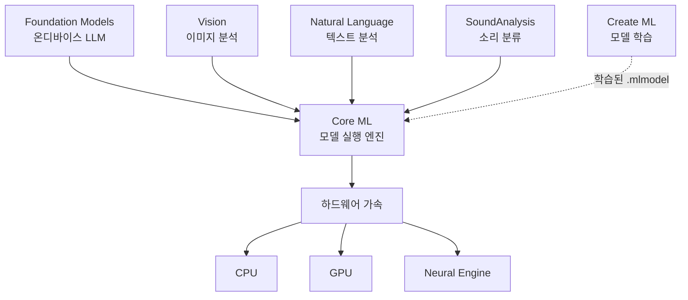
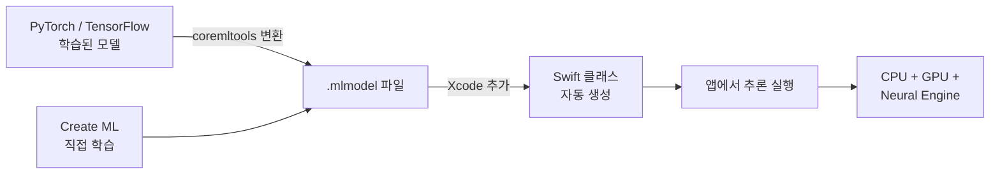
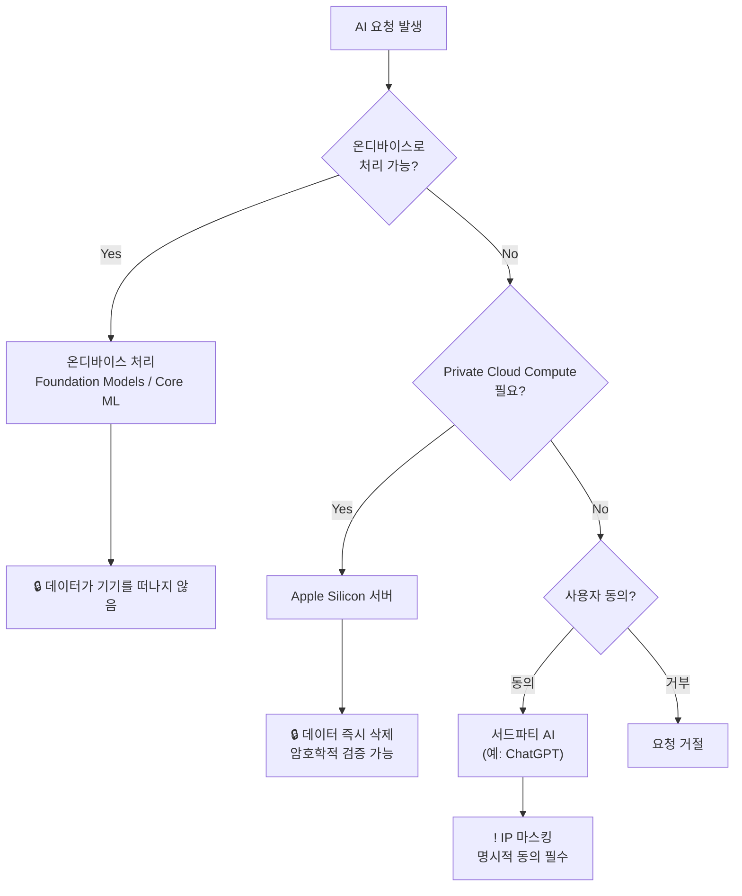
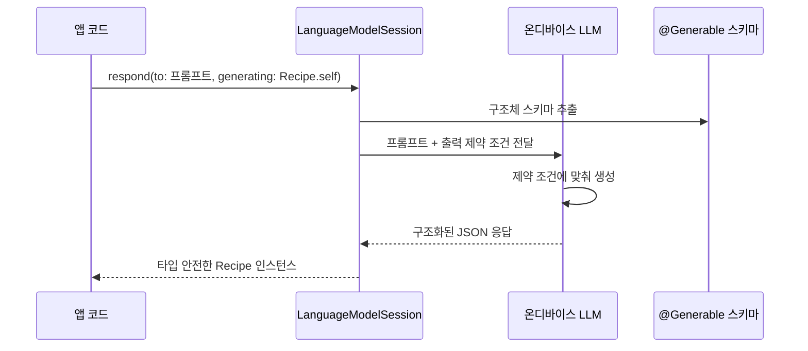

# AI와 머신러닝 통합

> Core ML, Create ML, Foundation Models, Apple Intelligence

## 개요

앱에 **사진 속 텍스트 인식**, **감정 분석**, **AI 기반 텍스트 생성** 같은 기능을 넣고 싶다면? Apple은 이를 위한 완전한 ML 프레임워크 스택을 제공합니다. 특히 iOS 26에서 도입된 **Foundation Models 프레임워크**는 온디바이스 LLM을 앱에서 직접 활용할 수 있게 해주는 혁신적인 API입니다.

**선수 지식**: [visionOS와 공간 컴퓨팅](./02-visionos.md)
**학습 목표**:
- Core ML로 학습된 모델을 앱에 통합할 수 있다
- Vision과 Natural Language 프레임워크로 이미지/텍스트를 분석할 수 있다
- Foundation Models 프레임워크로 온디바이스 AI 텍스트 생성을 구현할 수 있다

## 왜 알아야 할까?

AI는 더 이상 선택이 아닙니다. 사용자는 이미 **Writing Tools로 텍스트를 다듬고**, **Genmoji로 커스텀 이모지를 만들고**, **Siri에게 앱 안의 데이터를 물어보고** 있어요. iOS 26의 Foundation Models 프레임워크는 Apple Intelligence를 구동하는 바로 그 온디바이스 LLM을 개발자에게 직접 열어줍니다. 네트워크 없이, API 키 없이, 사용자 데이터가 기기를 떠나지 않으면서 AI 기능을 구현할 수 있죠.

## 핵심 개념

### 개념 1: Apple ML 프레임워크 스택

> 💡 **비유**: Apple의 ML 스택은 **요리 도구 세트**와 같습니다. **Core ML**은 완성된 레시피(모델)를 실행하는 오븐이고, **Create ML**은 나만의 레시피를 만드는 요리 학교이며, **Vision/NaturalLanguage**는 특화된 조리 도구(이미지/텍스트 분석)이고, **Foundation Models**는 만능 셰프(LLM)입니다.

> 📊 **그림 1**: Apple ML 프레임워크 스택 구조




| 프레임워크 | 역할 | 도입 |
|-----------|------|------|
| **Core ML** | 학습된 모델을 앱에서 실행 | 2017 |
| **Create ML** | Mac에서 커스텀 모델 학습 | 2018 |
| **Vision** | 이미지 분석 (OCR, 얼굴, 물체 감지) | 2017 |
| **Natural Language** | 텍스트 분석 (감정, 언어 감지, 품사) | 2018 |
| **SoundAnalysis** | 소리 분류 (300+ 종류) | 2019 |
| **Foundation Models** | 온디바이스 LLM (텍스트 생성, 요약) | 2025 |

### 개념 2: Core ML — 학습된 모델 실행하기

Core ML은 학습된 `.mlmodel` 파일을 Xcode에 추가하면, **Swift 클래스를 자동 생성**해줍니다. CPU, GPU, Neural Engine을 자동으로 활용하며 모든 추론이 온디바이스에서 이루어집니다.

```swift
import CoreML

// Xcode가 .mlmodel 파일에서 자동 생성한 클래스 사용
func classifyImage(_ image: CGImage) async throws -> String {
    // 1. 모델 로드
    let config = MLModelConfiguration()
    config.computeUnits = .all  // CPU + GPU + Neural Engine 모두 활용
    let model = try await ImageClassifier(configuration: config)

    // 2. 예측 실행
    let prediction = try await model.prediction(image: image)

    // 3. 결과 반환
    return prediction.classLabel  // 예: "cat", "dog"
}
```

**모델 출처**: PyTorch/TensorFlow 모델을 `coremltools`(Python)로 변환하거나, Create ML로 직접 학습합니다.

> 📊 **그림 2**: Core ML 모델 통합 워크플로우




### 개념 3: Vision과 Natural Language — 특화된 AI 도구

**Vision**: 이미지 속 텍스트 인식(OCR)부터 사람 분리(세그멘테이션)까지 다양한 이미지 분석을 제공합니다.

```swift
import Vision

// 이미지에서 텍스트 인식 (OCR)
func recognizeText(in image: CGImage) async throws -> [String] {
    let request = VNRecognizeTextRequest()
    request.recognitionLevel = .accurate  // .fast도 가능
    request.recognitionLanguages = ["ko-KR", "en-US"]

    let handler = VNImageRequestHandler(cgImage: image)
    try handler.perform([request])

    // 인식된 텍스트 결과 추출
    let results = request.results ?? []
    return results.compactMap { observation in
        observation.topCandidates(1).first?.string
    }
}
```

**Natural Language**: 텍스트의 감정을 분석하고, 언어를 감지하고, 품사를 태깅합니다.

```swift
import NaturalLanguage

// 감정 분석: -1.0(부정) ~ +1.0(긍정)
func analyzeSentiment(_ text: String) -> Double {
    let tagger = NLTagger(tagSchemes: [.sentimentScore])
    tagger.string = text

    let (sentiment, _) = tagger.tag(
        at: text.startIndex,
        unit: .paragraph,
        scheme: .sentimentScore
    )
    return Double(sentiment?.rawValue ?? "0") ?? 0
}

// 언어 감지
func detectLanguage(_ text: String) -> NLLanguage? {
    let recognizer = NLLanguageRecognizer()
    recognizer.processString(text)
    return recognizer.dominantLanguage  // .korean, .english 등
}

// 사용 예시
let score = analyzeSentiment("이 앱 정말 좋아요!")  // 약 0.8 (긍정)
let lang = detectLanguage("안녕하세요")  // .korean
```

### 개념 4: Foundation Models — 온디바이스 LLM

> 💡 **비유**: Foundation Models는 **앱 안에 사는 AI 비서**입니다. 인터넷 연결 없이도 텍스트를 요약하고, 질문에 답하고, 구조화된 데이터를 생성합니다. 외부 API를 호출하는 것과 달리, 모든 대화가 기기 안에서 끝나므로 사용자의 프라이버시가 완벽하게 보호됩니다.

**기본 텍스트 생성:**

```swift
import FoundationModels

// 모델 사용 가능 여부 확인
func checkAvailability() -> Bool {
    switch SystemLanguageModel.default.availability {
    case .available:
        return true
    case .unavailable(.appleIntelligenceNotEnabled):
        print("Apple Intelligence를 활성화해주세요")
        return false
    case .unavailable(.modelNotReady):
        print("모델 다운로드 중입니다")
        return false
    case .unavailable(.deviceNotEligible):
        print("이 기기에서는 사용할 수 없습니다")
        return false
    default:
        return false
    }
}

// 세션 생성 및 텍스트 생성
func summarize(_ text: String) async throws -> String {
    let session = LanguageModelSession {
        "당신은 한국어 요약 전문가입니다."
        "핵심만 간결하게 3줄로 요약하세요."
    }
    let response = try await session.respond(to: "다음 글을 요약해주세요: \(text)")
    return response.content
}
```

**스트리밍 응답:**

```swift
// 실시간으로 텍스트가 생성되는 모습을 보여줍니다
func streamResponse(_ prompt: String) async throws {
    let session = LanguageModelSession()

    for try await partial in session.streamResponse(to: prompt) {
        print(partial, terminator: "")  // 글자가 하나씩 나타남
    }
}
```

**@Generable — 구조화된 출력 (Guided Generation):**

가장 강력한 기능입니다. LLM이 **Swift 구조체 형태로 정확한 타입의 데이터를 생성**합니다.

```swift
import FoundationModels

// @Generable: LLM이 이 구조체를 직접 생성할 수 있음
@Generable
struct Recipe {
    @Guide(description: "요리 이름")
    var name: String

    @Guide(description: "조리 시간(분)", .range(1...120))
    var prepMinutes: Int

    @Guide(description: "재료 목록")
    var ingredients: [String]

    @Guide(description: "난이도", .anyOf(["쉬움", "보통", "어려움"]))
    var difficulty: String
}

// 사용: 타입 안전한 AI 생성
func suggestRecipe() async throws -> Recipe {
    let session = LanguageModelSession()
    let response = try await session.respond(
        to: "간단한 한국 가정식 레시피를 추천해주세요",
        generating: Recipe.self
    )
    return response.content  // 타입이 보장된 Recipe 인스턴스!
}
```

**Tool 프로토콜 — LLM이 앱 기능을 호출:**

```swift
import FoundationModels

// LLM이 호출할 수 있는 도구 정의
struct WeatherTool: Tool {
    let name = "getWeather"
    let description = "도시의 현재 날씨를 조회합니다"

    @Generable
    struct Arguments {
        @Guide(description: "도시 이름")
        var city: String
    }

    func call(arguments: Arguments) async throws -> ToolOutput {
        // 실제 날씨 API 호출
        let weather = await WeatherService.fetch(city: arguments.city)
        return ToolOutput("\(arguments.city): \(weather.temp)°C, \(weather.condition)")
    }
}

// 도구를 포함한 세션
let session = LanguageModelSession(tools: [WeatherTool()]) {
    "당신은 날씨 도우미입니다."
}
let response = try await session.respond(to: "서울 날씨 어때?")
// LLM이 자동으로 WeatherTool을 호출하고 결과를 자연어로 응답
```

### 개념 5: Apple의 온디바이스 ML 철학

> 📊 **그림 5**: Apple의 3계층 AI 프라이버시 모델




Apple은 **프라이버시 우선** 원칙을 ML에도 철저히 적용합니다.

| 계층 | 처리 방식 | 사용 사례 |
|------|----------|----------|
| **온디바이스** | 기기 내에서만 처리, 데이터 유출 없음 | Foundation Models, Core ML, Vision |
| **Private Cloud Compute** | Apple Silicon 서버, 데이터 즉시 삭제, 암호학적 검증 | 복잡한 Apple Intelligence 요청 |
| **서드파티 (ChatGPT)** | 명시적 사용자 동의 필수, IP 마스킹 | 고급 질의 (사용자 선택) |

## 실습: 직접 해보기

AI 기능 통합 체크리스트입니다.

**구현 체크리스트:**

- [ ] `SystemLanguageModel.default.availability`로 사용 가능 여부 확인
- [ ] `LanguageModelSession`으로 기본 텍스트 생성 구현
- [ ] `@Generable` 구조체로 타입 안전한 AI 출력 구현
- [ ] `streamResponse`로 실시간 스트리밍 UI 구현
- [ ] Vision 프레임워크로 이미지 텍스트 인식 테스트
- [ ] NaturalLanguage로 감정 분석 테스트
- [ ] 모델 사용 불가 시 대체 UI(fallback) 구현

## 더 깊이 알아보기

Apple의 ML 여정은 2017년 Core ML에서 시작되었습니다. 당시 구글의 TensorFlow와 페이스북의 PyTorch가 서버 기반 ML을 주도하던 시절, Apple은 **"모든 추론을 기기에서"**라는 독자적 경로를 선택했어요.

2024년 WWDC에서 **Apple Intelligence**가 발표되며 게임이 바뀌었습니다. Writing Tools, Image Playground, Genmoji 같은 생성형 AI 기능이 iOS에 내장되었죠. 하지만 개발자가 이 모델에 직접 접근할 수는 없었습니다.

2025년 WWDC에서 마침내 **Foundation Models 프레임워크**가 공개되며, Apple Intelligence를 구동하는 ~30억 파라미터 온디바이스 모델이 서드파티 개발자에게 열렸습니다. `@Generable` 매크로를 통한 **Guided Generation**(구조화된 출력)은 다른 LLM API에서는 보기 힘든 독특한 기능으로, 컴파일 타임에 출력 형식이 보장됩니다.

> 📊 **그림 3**: Foundation Models — Guided Generation 흐름




## 흔한 오해와 팁

> ⚠️ **흔한 오해**: "Foundation Models는 ChatGPT 같은 범용 AI다" — Foundation Models의 온디바이스 모델은 ~30억 파라미터로, 앱 내 요약/분류/구조화 작업에 최적화되어 있습니다. 복잡한 추론이나 코드 생성 같은 작업에는 한계가 있어요.

> 🔥 **실무 팁**: `@Generable`과 `@Guide`를 적극 활용하세요. 자유 형식 텍스트보다 구조화된 출력이 앱 연동에 훨씬 유용합니다. `.range()`, `.anyOf()` 같은 제약 조건으로 출력 품질을 높일 수 있어요.

> 💡 **알고 계셨나요?**: Apple의 Foundation Models는 **Private Cloud Compute**와 연동됩니다. 온디바이스 모델로 처리할 수 없는 요청만 Apple Silicon 서버로 보내지는데, 이 서버는 데이터를 저장하지 않고 암호학적으로 검증 가능합니다. 보안 연구자가 직접 감사할 수 있도록 공개되어 있어요.

## 핵심 정리

| 개념 | 설명 |
|------|------|
| Core ML | 학습된 .mlmodel을 앱에서 실행하는 프레임워크 |
| Create ML | Mac에서 커스텀 ML 모델을 학습하는 도구 |
| Vision | 이미지 분석 (OCR, 얼굴 감지, 세그멘테이션) |
| Natural Language | 텍스트 분석 (감정, 언어 감지, 품사 태깅) |
| Foundation Models | iOS 26+ 온디바이스 LLM (텍스트 생성/요약) |
| @Generable | LLM이 Swift 구조체를 직접 생성하는 매크로 |
| @Guide | @Generable 프로퍼티에 제약 조건을 추가하는 매크로 |
| Tool 프로토콜 | LLM이 앱의 기능을 호출할 수 있게 하는 인터페이스 |
| Private Cloud Compute | 온디바이스로 부족할 때 사용되는 Apple의 보안 클라우드 |

## 다음 섹션 미리보기

AI가 앱의 **지능**을 확장했다면, 이제 Swift 자체의 **미래**를 살펴볼 차례입니다. [Swift 생태계 전망](./04-ecosystem.md)에서 서버 사이드 Swift, 멀티플랫폼 확장, Swift Evolution의 방향을 탐구합니다. 이 튜토리얼의 마지막 여정이에요!

## 참고 자료

- [Foundation Models - Apple Developer](https://developer.apple.com/documentation/foundationmodels) - Foundation Models 공식 문서
- [Meet the Foundation Models framework - WWDC25](https://developer.apple.com/videos/play/wwdc2025/286/) - Foundation Models 소개 세션
- [Deep dive into the Foundation Models framework - WWDC25](https://developer.apple.com/videos/play/wwdc2025/301/) - @Generable, Tool 심화
- [Core ML - Apple Developer](https://developer.apple.com/documentation/coreml) - Core ML 공식 문서
- [Apple Intelligence - Apple Developer](https://developer.apple.com/apple-intelligence/) - Apple Intelligence 개발자 가이드
