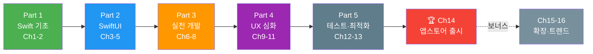

# 2026: Swift 완전 정복

> iOS 26 & Swift 6 시대의 앱 개발 A to Z — **16챕터 73섹션** 튜토리얼

## 학습 로드맵

> **Ch14(앱스토어 출시)가 최종 목표.** Ch1→14가 크리티컬 패스, Ch15-16은 보너스입니다.

---

## Part 1: Swift 언어 기초 (Ch1-2, 입문)

**Ch1. Swift 시작하기**
- [01. 개발 환경 설정](01-swift-basics/01-introduction.md) · [02. 변수와 상수](01-swift-basics/02-variables-constants.md) · [03. 컬렉션 타입](01-swift-basics/03-collections.md) · [04. 조건문과 반복문](01-swift-basics/04-control-flow.md) · [05. 함수와 클로저](01-swift-basics/05-functions-closures.md) · [06. 옵셔널](01-swift-basics/06-optionals.md)

**Ch2. Swift 타입 시스템**
- [01. 구조체와 클래스](02-swift-types/01-struct-class.md) · [02. 프로퍼티와 메서드](02-swift-types/02-properties-methods.md) · [03. 프로토콜과 익스텐션](02-swift-types/03-protocols-extensions.md) · [04. 열거형과 패턴 매칭](02-swift-types/04-enums-pattern.md) · [05. 제네릭과 에러 처리](02-swift-types/05-generics-errors.md)

## Part 2: SwiftUI 기본 (Ch3-5, 초급)

**Ch3. SwiftUI 첫걸음**
- [01. Hello, SwiftUI!](03-swiftui-start/01-hello-swiftui.md) · [02. 텍스트와 이미지](03-swiftui-start/02-text-image.md) · [03. 버튼과 인터랙션](03-swiftui-start/03-button-interaction.md) · [04. 레이아웃](03-swiftui-start/04-layout.md) · [05. 리스트와 스크롤](03-swiftui-start/05-lists-scroll.md)

**Ch4. 화면 구성과 네비게이션**
- [01. NavigationStack](04-navigation-design/01-navigation-stack.md) · [02. TabView와 모달](04-navigation-design/02-tab-modal.md) · [03. 폼과 사용자 입력](04-navigation-design/03-forms-input.md) · [04. SF Symbols](04-navigation-design/04-sf-symbols.md) · [05. Liquid Glass](04-navigation-design/05-liquid-glass.md)

**Ch5. 상태 관리**
- [01. @State와 @Binding](05-state-management/01-state-binding.md) · [02. @Observable](05-state-management/02-observable.md) · [03. @Environment](05-state-management/03-environment.md) · [04. 데이터 흐름 설계](05-state-management/04-data-flow.md)

## Part 3: 실전 앱 개발 (Ch6-8, 중급)

**Ch6. SwiftData**
- [01. SwiftData 시작](06-swiftdata/01-swiftdata-intro.md) · [02. CRUD](06-swiftdata/02-crud.md) · [03. 관계와 고급 쿼리](06-swiftdata/03-relationships-query.md) · [04. 마이그레이션](06-swiftdata/04-migration.md) · [05. CloudKit 동기화](06-swiftdata/05-cloudkit.md)

**Ch7. 네트워킹과 동시성**
- [01. async/await](07-networking/01-async-await.md) · [02. URLSession](07-networking/02-urlsession.md) · [03. Codable](07-networking/03-codable.md) · [04. 에러 핸들링](07-networking/04-error-handling.md) · [05. 실전 API 프로젝트](07-networking/05-api-project.md)

**Ch8. 아키텍처 패턴**
- [01. MVVM](08-architecture/01-mvvm.md) · [02. Repository 패턴](08-architecture/02-repository.md) · [03. 네비게이션 설계](08-architecture/03-navigation-design.md) · [04. 의존성 주입](08-architecture/04-dependency-injection.md)

## Part 4: 사용자 경험 (Ch9-11, 중상급)

**Ch9. 애니메이션과 인터랙션**
- [01. 기본 애니메이션](09-animation/01-basic-animation.md) · [02. 고급 애니메이션](09-animation/02-advanced-animation.md) · [03. 제스처](09-animation/03-gestures.md) · [04. Shape과 Canvas](09-animation/04-shapes-canvas.md) · [05. 전환 효과](09-animation/05-transitions.md)

**Ch10. 시스템 프레임워크**
- [01. 이미지와 카메라](10-system-frameworks/01-image-camera.md) · [02. 지도와 위치](10-system-frameworks/02-mapkit-location.md) · [03. 알림](10-system-frameworks/03-notifications.md) · [04. 공유와 딥링크](10-system-frameworks/04-sharing-deeplink.md)

**Ch11. 고급 SwiftUI**
- [01. Custom Layout](11-advanced-swiftui/01-custom-layout.md) · [02. ViewBuilder](11-advanced-swiftui/02-viewbuilder.md) · [03. PreferenceKey](11-advanced-swiftui/03-preference-geometry.md) · [04. UIKit 브릿지](11-advanced-swiftui/04-uikit-bridge.md)

## Part 5: 출시와 확장 (Ch12-16, 실무~전문가)

**Ch12. 테스트와 품질**
- [01. Unit Test](12-testing-quality/01-unit-test.md) · [02. Swift Testing](12-testing-quality/02-swift-testing.md) · [03. UI Test](12-testing-quality/03-ui-test.md) · [04. 접근성과 국제화](12-testing-quality/04-accessibility.md)

**Ch13. 성능과 최적화**
- [01. Concurrency 심화](13-performance/01-concurrency-deep.md) · [02. SwiftUI 최적화](13-performance/02-swiftui-optimization.md) · [03. 메모리와 ARC](13-performance/03-memory-arc.md) · [04. Instruments](13-performance/04-instruments.md)

**Ch14. 앱스토어 출시**
- [01. 앱 아이콘과 스크린샷](14-appstore/01-app-icon-assets.md) · [02. 인증서](14-appstore/02-certificates.md) · [03. App Store Connect](14-appstore/03-app-store-connect.md) · [04. 심사 가이드라인](14-appstore/04-review-guidelines.md) · [05. 출시 후 운영](14-appstore/05-post-launch.md)

**Ch15. 앱 확장 기능**
- [01. WidgetKit](15-app-extensions/01-widgetkit.md) · [02. Live Activities](15-app-extensions/02-live-activities.md) · [03. App Intents](15-app-extensions/03-app-intents.md) · [04. In-App Purchase](15-app-extensions/04-storekit.md)

**Ch16. 최신 기술과 트렌드**
- [01. Swift 6](16-trends/01-swift6.md) · [02. visionOS](16-trends/02-visionos.md) · [03. AI와 ML 통합](16-trends/03-ai-ml.md) · [04. Swift 생태계 전망](16-trends/04-ecosystem.md)

---

**Resources**: [공식 문서와 WWDC](resources/essential-papers.md) · [예제 프로젝트](resources/datasets.md) · [개발 도구](resources/tools.md)

**기술 스택**: Swift 6+ · SwiftUI (iOS 26+, Liquid Glass) · SwiftData · CloudKit · Swift Concurrency · Xcode 26+

## 라이선스

MIT License
